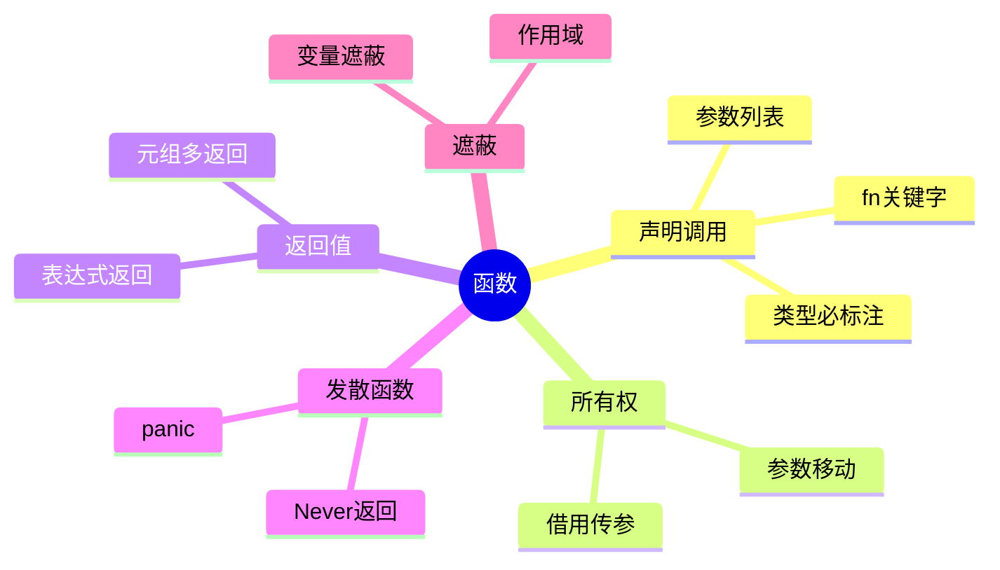

> **内容分级**: [综述级]

# Functions（函数）
>
> **EN**: Functions
> **Summary**: Functions: Rust's primary unit of executable behavior, covering declarations, parameters, return types, the `->` syntax, diverging functions, and the relationship to ownership and move semantics.
> **Rust 版本**: 1.97.0+ (Edition 2024)
> **受众**: [初学者]
> **Bloom 层级**: L1-L2
> **权威来源**: 本文件为 `concept/` 权威页。
> **A/S/P 标记**: **S+P** — Structure + Procedure
> **双维定位**: F×Und — 理解函数作为 Rust 行为单元的基础结构
> **定位**: 系统讲解 Rust 函数声明、参数传递、返回值、发散函数与所有权（Ownership）的交互，为后续 Trait、闭包（Closures）、Async 打下语法基础。
> **前置概念**:
> [Ownership](../01_ownership_borrow_lifetime/01_ownership.md) ·
> [Type System](../02_type_system/01_type_system.md) ·
> [Statements and Expressions](../04_control_flow/04_statements_and_expressions.md) ·
> [Terminology Glossary](../../00_meta/01_terminology/01_terminology_glossary.md)
> **后置概念**:
> [Traits](../../02_intermediate/00_traits/01_traits.md) ·
> [Closures](../00_start/03_closure_basics.md) ·
> [Modules and Paths](01_modules_and_paths.md)
>
> **来源**:
> [The Rust Programming Language — Functions](https://doc.rust-lang.org/book/ch03-03-how-functions-work.html) ·
> [Rust Reference — Functions](https://doc.rust-lang.org/reference/items/functions.html) ·
> [Rust By Example — Functions](https://doc.rust-lang.org/rust-by-example/fn.html)

---

> **对应 Crate**: [`c03_control_fn`](../../crates/c03_control_fn)
> **对应练习**: [`exercises/src/control_flow/`](../../exercises/src/control_flow)
> **权威来源**:
> [Rust Reference — Functions](https://doc.rust-lang.org/reference/items/functions.html) ·
> [TRPL — Functions](https://doc.rust-lang.org/book/ch03-03-how-functions-work.html) ·
> [Rust By Example — Functions](https://doc.rust-lang.org/rust-by-example/fn.html)
>
> **权威来源对齐变更日志**: 2026-07-10 补充权威来源标注（Rust Reference、TRPL、Rust By Example）

## 认知路径

> **认知路径**: 本节从“为什么需要函数”出发，依次建立函数声明、参数传递、返回值、发散函数与所有权（Ownership）交互的完整图景。

1. **问题识别**: 当代码重复出现时，如何封装为可复用单元？
2. **概念建立**: 掌握 `fn`、参数列表、返回类型、`->` 语法与函数体。
3. **机制推理**: 通过 ⟹ 定理链将函数签名、所有权（Ownership）移动与借用（Borrowing）规则串联起来。
4. **边界辨析**: 借助反命题/反例理解忘记返回表达式、移动后继续使用、可变借用（Mutable Borrow）冲突等错误。
5. **迁移应用**: 将函数与 Trait、闭包（Closures）、Async 等后置概念链接，形成跨层知识网络。

---

> **过渡**: 从函数的直观描述转向其形式化定义，需要先把日常经验中的“子程序”直觉转化为 Rust 中可验证的签名与类型规则。
> **过渡**: 在建立函数的核心命题之后，下一步是审视这些命题在边界条件下的稳定性——这正是反命题与反例的价值所在。
> **过渡**: 最后，将函数与相邻概念连接，形成从 L1 到 L7 的纵向认知路径，避免孤立记忆。

---

> **定理 1** [Tier 1]: 函数签名精确声明参数类型与返回类型 ⟹ 编译器可在调用点静态检查类型一致性（Coherence）。
>
> **定理 2** [Tier 1]: 函数参数默认按值传递 ⟹ 调用者需显式使用 `&T` / `&mut T` 表达借用（Borrowing），否则发生所有权移动。
>
> **定理 3** [Tier 1]: 发散函数返回 `!` ⟹ 任何需要 `T` 的位置都可安全替换为发散函数调用（never 的底类型性质）。

---

> **反向推理 1** [Tier 1]: 若编译器报错 `mismatched types` 或 `value borrowed here after move` ⟸ 应首先检查函数签名与调用点是否一致、参数传递方式是否正确。
>
> **反向推理 2** [Tier 1]: 若代码逻辑需要函数“不返回” ⟸ 考虑使用 `!` 返回类型并确保所有控制路径确实不返回。

---

## 🧠 知识结构图



## 📑 目录

- [Functions（函数）](#functions函数)
  - [认知路径](#认知路径)
  - [🧠 知识结构图](#-知识结构图)
  - [📑 目录](#-目录)
  - [一、核心命题](#一核心命题)
  - [二、函数声明与调用](#二函数声明与调用)
  - [三、参数与所有权](#三参数与所有权)
  - [四、返回值](#四返回值)
  - [五、发散函数](#五发散函数)
  - [六、函数与变量遮蔽](#六函数与变量遮蔽)
  - [七、反例与边界测试](#七反例与边界测试)
    - [7.1 忘记返回表达式](#71-忘记返回表达式)
    - [7.2 移动后继续使用](#72-移动后继续使用)
    - [7.3 可变借用冲突](#73-可变借用冲突)
  - [八、权威来源索引](#八权威来源索引)
  - [补充：来自 `crates/c03_control_fn` 函数参考的语法速查](#补充来自-cratesc03_control_fn-函数参考的语法速查)
    - [函数 BNF 语法概要](#函数-bnf-语法概要)
    - [参数传递语义](#参数传递语义)
    - [返回值要点](#返回值要点)
  - [国际权威参考 / International Authority References（P1 学术 · P2 生态）](#国际权威参考--international-authority-referencesp1-学术--p2-生态)
  - [嵌入式测验（Embedded Quiz）](#嵌入式测验embedded-quiz)
    - [测验 1：默认返回类型（🟢 基础）](#测验-1默认返回类型-基础)
    - [测验 2：分号改变返回值（🟡 进阶）](#测验-2分号改变返回值-进阶)
    - [测验 3：发散函数的底类型性质（🔴 专家）](#测验-3发散函数的底类型性质-专家)
  - [📋 关键属性](#-关键属性)
  - [🔗 概念关系](#-概念关系)

---

## 一、核心命题

> **命题 1**: 函数是 Rust 中**命名的、可复用的执行单元**，由签名（参数 + 返回类型）和函数体组成。
>
> **命题 2**: Rust 函数默认使用**移动语义**传递参数；借用（Borrowing）必须通过显式引用（Reference） `&T` / `&mut T` 表达。
>
> **命题 3**: 函数的返回类型不写时默认为单元类型 `()`；使用 `->` 显式声明返回类型。
>
> **命题 4**: 发散函数（Diverging Functions）返回 `!`（never type），承诺永不正常返回。

---

## 二、函数声明与调用

> (Source: [Rust Reference — Functions](https://doc.rust-lang.org/reference/items/functions.html))

```rust
fn greet(name: &str) {
    println!("Hello, {name}!");
}

fn main() {
    greet("Rust");          // 函数调用
}
```

**语法要素**:

| 要素 | 说明 | 示例 |
|:---|:---|:---|
| `fn` | 函数关键字 | `fn foo() {}` |
| 函数名 | snake_case | `fn do_thing() {}` |
| 参数列表 | 名称: 类型 | `(x: i32, y: &str)` |
| 返回类型 | `-> T` | `fn add(x: i32) -> i32` |
| 函数体 | 语句块 | `{ x + 1 }` |

> **关键洞察**: Rust 函数签名是**合约**: 调用者必须提供正确类型的参数，编译器保证返回值类型匹配。

---

## 三、参数与所有权

> (Source: [TRPL — What is Ownership?](https://doc.rust-lang.org/book/ch04-01-what-is-ownership.html))

```rust
fn take_ownership(s: String) {
    println!("{s}"); // s 在此有效
} // s 被 drop

fn borrow(s: &String) {
    println!("{s}"); // 不获取所有权
}

fn main() {
    let s = String::from("hello");
    take_ownership(s); // s 被移动
    // println!("{s}"); // ❌ 编译错误

    let t = String::from("world");
    borrow(&t);        // 借用
    println!("{t}");   // ✅ 仍可使用
}
```

**规则**:

1. 默认按值传递 = 移动（Move）对于非 `Copy` 类型。
2. `Copy` 类型（如 `i32`、`bool`、引用（Reference））按位复制，不转移所有权。
3. 可变借用 `&mut T` 允许函数修改传入数据，但需满足借用检查规则。

---

## 四、返回值

```rust
fn add(a: i32, b: i32) -> i32 {
    a + b // 末尾表达式作为返回值（无分号）
}

fn early_return(x: i32) -> i32 {
    if x < 0 {
        return 0; // 显式提前返回
    }
    x
}
```

> **注意**: 函数体最后一个**无分号表达式**是返回值；若加分号则变为语句，返回 `()`。

```rust,compile_fail
fn wrong() -> i32 {
    5; // ❌ 类型不匹配：实际返回 ()，期望 i32
}
```

---

## 五、发散函数

> (Source: [Rust Reference — Diverging Functions](https://doc.rust-lang.org/reference/items/functions.html#diverging-functions))

发散函数返回 `!`（never type），常用于 `panic!`、`loop {}`、`std::process::exit`。

```rust
fn forever() -> ! {
    loop {
        println!("again");
    }
}

fn must_not_happen() -> ! {
    panic!("unreachable");
}
```

**作用**:

- 在 `match` 分支中，发散分支可被合并到任意返回类型。
- 表达"此路径不会继续执行"的强保证。

---

## 六、函数与变量遮蔽

函数参数会遮蔽（shadow）外层同名变量，但仅在函数体内有效：

```rust
let x = 5;
fn print_x(x: i32) {
    println!("{x}");
}
print_x(10); // 输出 10，不影响外层 x
```

---

## 七、反例与边界测试

本节的反例覆盖函数使用的三个高频错误：

- **忘记返回表达式**：块尾部加分号使返回类型变 `()`（E0308）——「分号规则」是 Rust 表达式导向语法的第一个坎；判定准则：函数体最后一条语句的类型必须匹配返回类型，要么去分号要么显式 `return`；
- **移动后继续使用**：参数按值传入（move）后原变量失效（E0382）——修复是借用（`&T` 参数）或 `clone`；
- **可变借用冲突**：多个 `&mut` 参数指向同一数据（`swap(&mut x, &mut x)` 被拒，E0499）——`split_at_mut`、字段级借用或重构成单参数是标准解法。

附录给出函数 BNF 语法与参数传递语义速查：Rust 参数传递只有「按值（move/copy）」与「按借用」两种，没有 C++ 的引用（Reference）折叠或隐式拷贝构造——每个参数的传递成本在签名处可见。

### 7.1 忘记返回表达式

```rust,compile_fail
fn double(x: i32) -> i32 {
    x * 2; // ❌ 语句返回 ()
}
```

**修正**: 去掉分号：`x * 2`

### 7.2 移动后继续使用

```rust,compile_fail
fn consume(s: String) {}

fn main() {
    let s = String::from("hi");
    consume(s);
    println!("{s}"); // ❌ borrow of moved value
}
```

**修正**: 传递引用 `&s` 或改用 `Clone`。

### 7.3 可变借用冲突

```rust,compile_fail
fn append(dest: &mut String, src: &String) {
    dest.push_str(src);
}

fn main() {
    let mut s = String::from("a");
    append(&mut s, &s); // ❌ 不可变借用与可变借用重叠
}
```

**修正**: 确保借用的生命周期（Lifetimes）不重叠。

---

## 八、权威来源索引

| 来源 | 可信度 | 说明 |
|:---|:---:|:---|
| [TRPL — Functions](https://doc.rust-lang.org/book/ch03-03-how-functions-work.html) | ✅ 一级 | 官方入门教程 |
| [Rust Reference — Functions](https://doc.rust-lang.org/reference/items/functions.html) | ✅ 一级 | 语言规范 |
| [Rust By Example — Functions](https://doc.rust-lang.org/rust-by-example/fn.html) | ✅ 二级 | 交互示例 |

---

## 补充：来自 `crates/c03_control_fn` 函数参考的语法速查

> 本节由原 `crates/c03_control_fn/docs/tier_03_references/03_functions_reference.md` 合并而来，保留函数完整语法参考。

### 函数 BNF 语法概要

```text
function :=
    function_qualifiers "fn" IDENTIFIER generic_params?
    "(" function_parameters? ")" function_return_type? where_clause?
    block_expression

function_qualifiers :=
    "const"? "async"? "unsafe"? ("extern" abi?)?
```

### 参数传递语义

| 声明形式 | 调用侧行为 | 适用场景 |
| :--- | :--- | :--- |
| `fn f(x: T)` | 移动（Move）所有权 | 小类型或明确转移所有权 |
| `fn f(x: &T)` | 不可变借用（Immutable Borrow） | 只读访问 |
| `fn f(x: &mut T)` | 可变借用 | 需要修改 |
| `fn f(x: impl Trait)` | 静态分发单态化（Monomorphization） | 简单泛型（Generics）约束 |
| `fn f(x: dyn Trait)` | 动态分发，胖指针 | 需要运行时（Runtime）多态 |

### 返回值要点

- 默认返回单元类型 `()`；显式返回使用 `-> T`。
- 发散函数返回 `!`，可被强制转换为任意类型。
- 返回 `impl Trait` 隐藏具体类型，但调用方只能使用该 trait 的方法。

> 更多示例与所有权交互分析参见本节正文。

---

## 国际权威参考 / International Authority References（P1 学术 · P2 生态）

> 依据 `AGENTS.md` §2「对齐网络国际化权威内容」补充：仅追加已验证可达的权威链接，不改动正文事实。

- **P1 学术/形式化**: [Cardelli & Wegner: On Understanding Types, Data Abstraction, and Polymorphism (ACM Comput. Surv. 1985)](https://dl.acm.org/doi/10.1145/6041.6042)
- **P2 生态/社区**: [docs.rs/toml — 生态权威 API 文档](https://docs.rs/toml) · [docs.rs/cargo_metadata — 生态权威 API 文档](https://docs.rs/cargo_metadata)

---

## 嵌入式测验（Embedded Quiz）

> W3-b 补充（2026-07-12）：本页原无嵌入式测验，按四级题型规范补 3 题（🟢🟡🔴 各 1 题，`<details>` 折叠答案），内容与本页正文严格一致。

### 测验 1：默认返回类型（🟢 基础）

`fn greet(name: &str) { println!("Hello, {name}!"); }` 的返回类型是？

- A. `i32`
- B. `()`
- C. `&str`
- D. 必须显式标注，否则编译错误

<details>
<summary>✅ 答案</summary>

**B 正确**。按本页命题 3：函数的返回类型不写时**默认为单元类型 `()`**；使用 `-> T` 显式声明返回类型。

</details>

---

### 测验 2：分号改变返回值（🟡 进阶）

以下代码能否编译？

```rust,ignore
fn wrong() -> i32 {
    5;
}
```

- A. 能编译，返回 `5`
- B. 不能编译：`5;` 是语句，函数实际返回 `()`，与声明的 `i32` 类型不匹配
- C. 能编译，返回 `()`
- D. 不能编译：函数体不能为空

<details>
<summary>✅ 答案</summary>

**B 正确**。按本页「四、返回值」：函数体最后一个**无分号表达式**是返回值；若加分号则变为语句，返回 `()`。本例报 `mismatched types`（期望 `i32`，实际 `()`）。修正：去掉分号写 `5`。

</details>

---

### 测验 3：发散函数的底类型性质（🔴 专家）

关于发散函数（Diverging Functions），下列说法正确的是？

- A. 发散函数返回 `!`（never type），承诺永不正常返回，常见于 `panic!`、`loop {}`、`std::process::exit`
- B. 发散函数返回 `!` 后，调用点之后的代码仍会执行
- C. `-> !` 与 `-> ()` 语义相同
- D. 发散函数不能出现在 `match` 分支中

<details>
<summary>✅ 答案</summary>

**A 正确**。按本页「五、发散函数」与定理 3：发散函数返回 `!`，承诺永不正常返回；由于 never 的**底类型性质**，发散分支可被合并到任意返回类型——任何需要 `T` 的位置都可安全替换为发散函数调用（这正是它能出现在 `match` 分支中的原因，D 错）。B/C 与 `!` 的语义矛盾。

</details>

## 📋 关键属性

| 属性 | 取值 / 判定 | 依据 |
|---|---|---|
| 项类别 | 函数是项（item），非表达式，可前向引用 | Reference items |
| 参数传递 | 参数模式绑定 + 所有权 move / 借用规则 | 所有权模型 |
| 返回标注 | 返回类型必须显式标注（无返回即 `()`） | 函数文法 |
| 发散函数 | `-> !` 声明永不返回 | never type |
| 递归 | 允许直接/间接递归，无尾调用优化保证 | 实现约定 |

## 🔗 概念关系

- **上位（is-a）**：[Items](12_items.md) 项体系的可执行成员。
- **下位（实例）**：带环境捕获的函数见 [Closure Basics](../00_start/03_closure_basics.md) 与 [Closure Types](../../02_intermediate/04_types_and_conversions/02_closure_types.md)。
- **对偶**：与方法（带 receiver）相对，见 [Implementations](06_implementations.md)。
- **组合**：函数体是块表达式，求值规则见 [Statements and Expressions](../04_control_flow/04_statements_and_expressions.md)。
- **依赖**：参数与返回值的所有权转移依赖 [Ownership](../01_ownership_borrow_lifetime/01_ownership.md)。
