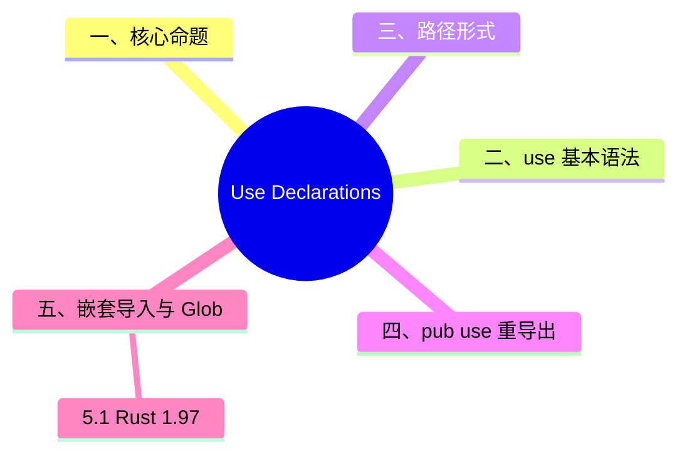

> **内容分级**: [综述级]

# Use Declarations（使用声明）
>
> **EN**: Use Declarations
> **Summary**: Use declarations: how Rust brings paths into scope, including `use`, `pub use`, nested imports, globs, re-exports, and visibility interplay.
> **Rust 版本**: 1.97.0+ (Edition 2024)
> **受众**: [初学者]
> **Bloom 层级**: L1-L3
> **权威来源**: 本文件为 `concept/` 权威页。
> **A/S/P 标记**: **S+P** — Structure + Procedure
> **双维定位**: F×App — 掌握模块（Module）路径的引入与重导出机制
> **定位**: 系统讲解 `use` 声明的语法、作用域规则、重导出与 glob 导入，帮助学习者建立清晰的模块（Module）命名空间心智模型。
> **前置概念**: [Modules and Paths](01_modules_and_paths.md) · [Items](12_items.md) · [Ownership](../01_ownership_borrow_lifetime/01_ownership.md) · [Terminology Glossary](../../00_meta/01_terminology/01_terminology_glossary.md)
> **后置概念**: [Preludes](10_preludes.md) · [API Naming Conventions](../../02_intermediate/05_modules_and_visibility/03_api_naming_conventions.md)
>
> **来源**: [The Rust Programming Language — Modules](https://doc.rust-lang.org/book/ch07-00-managing-growing-projects-with-packages-crates-and-modules.html) · [Rust Reference — Use Declarations](https://doc.rust-lang.org/reference/items/use-declarations.html)

---

> **对应 Crate**: [`c03_control_fn`](../../crates/c03_control_fn)
> **对应练习**: [`exercises/src/modules/`](../../exercises/src/modules)
> **权威来源**: [Rust Reference — Use Declarations](https://doc.rust-lang.org/reference/items/use-declarations.html) · [TRPL — Modules](https://doc.rust-lang.org/book/ch07-00-managing-growing-projects-with-packages-crates-and-modules.html)
>
> **权威来源对齐变更日志**: 2026-07-10 补充权威来源标注（Rust Reference、TRPL）

## 认知路径

> **认知路径**: 本节从“为什么需要 `use`”出发，依次建立路径引入、重导出、嵌套导入与 glob 导入的完整图景。

1. **问题识别**: 当模块（Module）层级较深时，如何简化路径书写？
2. **概念建立**: 掌握 `use`、`pub use`、嵌套导入、`use path::*` 的语法与语义。
3. **机制推理**: 通过 ⟹ 定理链将 `use` 声明、作用域与可见性规则串联起来。
4. **边界辨析**: 借助反命题/反例理解导入私有项、名称冲突、glob 遮蔽等问题。
5. **迁移应用**: 将 `use` 声明与 Prelude、API 命名规范等后置概念链接。

---

> **定理 1** [Tier 1]: `use path::Item;` 将路径绑定到当前作用域的短名 ⟹ 不创建新项，只创建别名，不影响原始可见性。
>
> **定理 2** [Tier 1]: `pub use path::Item;` 重导出内部路径 ⟹ 外部用户可通过当前模块（Module）访问该路径，构成 API 表面。
>
> **定理 3** [Tier 1]: Glob 导入 `use path::*;` 导入目标模块所有公开项 ⟹ 可能降低可读性并在名称冲突时引发编译错误。

---

> **反向推理 1** [Tier 1]: 若编译器报错 `unresolved import` 或 `private import` ⟸ 应检查路径是否正确、目标项是否 `pub`、以及 `use` 所在模块的可见性。
>
> **反向推理 2** [Tier 1]: 若公共 API 表面与内部模块结构不一致 ⟸ 考虑使用 `pub use` 进行重导出，隐藏实现细节。

---

## 📑 目录

- [Use Declarations（使用声明）](#use-declarations使用声明)
  - [认知路径](#认知路径)
  - [📑 目录](#-目录)
  - [一、核心命题](#一核心命题)
  - [二、`use` 基本语法](#二use-基本语法)
  - [三、路径形式](#三路径形式)
  - [四、`pub use` 重导出](#四pub-use-重导出)
  - [五、嵌套导入与 Glob](#五嵌套导入与-glob)
    - [5.1 Rust 1.97：尾随 `self` 的放宽](#51-rust-197尾随-self-的放宽)
  - [六、反例与边界测试](#六反例与边界测试)
    - [6.1 导入私有项](#61-导入私有项)
    - [6.2 名称冲突](#62-名称冲突)
    - [6.3 Glob 导入遮蔽标准库](#63-glob-导入遮蔽标准库)
  - [七、权威来源索引](#七权威来源索引)
  - [国际权威参考 / International Authority References（P1 学术 · P2 生态）](#国际权威参考--international-authority-referencesp1-学术--p2-生态)
  - [📋 关键属性](#-关键属性)
  - [🔗 概念关系](#-概念关系)
  - [🧭 思维导图（Mindmap）](#-思维导图mindmap)

---

## 一、核心命题

> **命题 1**: `use` 声明将某个路径绑定到当前作用域的短名，**不创建新项**，只创建别名。
>
> **命题 2**: `pub use` 可以把内部路径重导出为当前模块的公共 API。
>
> **命题 3**: Glob 导入 `use path::*` 导入所有公开项，但可能降低可读性并导致名称冲突。
>
> **命题 4**: `use` 可以解构枚举（Enum）变体、结构体（Struct）字段路径，以及嵌套模块。

---

## 二、`use` 基本语法

> (Source: [Rust Reference — Use Declarations](https://doc.rust-lang.org/reference/items/use-declarations.html))

```rust
mod kitchen {
    pub fn cook() {}
}

use kitchen::cook; // 将 kitchen::cook 引入当前作用域

fn main() {
    cook();
}
```

**绑定到不同名字**:

```rust
mod kitchen {
    pub fn cook() {}
}

use kitchen::cook as prepare;
```

---

## 三、路径形式

| 形式 | 说明 | 示例 |
|:---|:---|:---|
| 绝对路径 | `crate::`、`self::`、`super::` | `use crate::module::Item;` |
| 相对路径 | 从当前模块开始 | `use self::sub::Item;` |
| `super` | 父模块 | `use super::ParentItem;` |
| `crate` | 当前 crate 根 | `use crate::utils::helper;` |

```rust
mod outer {
    pub const VAL: i32 = 1;

    mod inner {
        pub fn print() {
            println!("{}", super::VAL); // 使用 super 访问父模块
        }
    }
}
```

---

## 四、`pub use` 重导出

> (Source: [TRPL — Modules](https://doc.rust-lang.org/book/ch07-00-managing-growing-projects-with-packages-crates-and-modules.html))

```rust
mod backend {
    pub struct User;
}

mod api {
    pub use crate::backend::User; // 重导出
}

fn main() {
    let _u = api::User; // 看起来 User 属于 api 模块
}
```

> **关键洞察**: `pub use` 是 Rust API 设计中常用的"门面模式（Facade）"工具，可将复杂内部结构隐藏，对外呈现简洁接口。

---

## 五、嵌套导入与 Glob

```rust
// 嵌套导入
use std::collections::{HashMap, HashSet, BTreeMap};

// 嵌套 + 重命名
use std::io::{self, Write as IoWrite};

// Glob（谨慎使用）
use std::fmt::*;
```

> **使用建议**:
>
> - 优先使用具名导入，明确依赖。
> - glob 导入适合 prelude 模式或测试模块中的 `super::*`。
> - 避免在库代码顶部使用 `use crate::*`，这会隐藏依赖关系。

---

### 5.1 Rust 1.97：尾随 `self` 的放宽

> (Source: [Rust Reference — Use Declarations — `self`](https://doc.rust-lang.org/reference/items/use-declarations.html)，curl 200 实测 2026-07-12；[Rust 1.97.0 Release Notes — Language](https://releases.rs/docs/1.97.0/)："Allow trailing `self` in imports in more cases")

`use` 路径的**最后一个段**可以是 `self`，形如 `P::self`。Rust 1.97.0 起，尾随 `self` 的前缀路径 `P` 不再限于模块——**枚举（Enum）、Trait 等类型命名空间实体**也可作为 `self` 的父路径，与花括号内 `self` 的父路径规则对齐：

| 写法 | 等价于 | 1.96 及更早 | 1.97.0+ |
|:---|:---|:---:|:---:|
| `use m::self as _;` | `use m::{self as _};` | ✅（父为模块） | ✅ |
| `use m::E::self;` | `use m::E::{self};` | ❌ 仅花括号形式可用 | ✅ |
| `use m::E::self as E2;` | `use m::E::{self as E2};` | ❌ | ✅ |
| `use S::self;`（`S` 为结构体（Struct）） | — | ❌ E0432 | ❌ 结构体仍不能作为 `self` 父路径 |

```rust
// edition = "2024", rust = "1.97" —— 尾随 self 用于枚举父路径（rustc 1.97.0 实测通过）
mod m {
    pub enum E { V1, V2 }
}

use m::E::self;   // 1.97：尾随 self 可直接作用于枚举，等价于 use m::E::{self};
use m::E::V1;     // 变体仍需单独导入

fn main() {
    let _ = E::V2;  // E 已由尾随 self 引入
    let _ = V1;
}
```

反例（1.97 后仍然错误）：

```rust,compile_fail
struct S;
use S::self; // ❌ E0432：`S` is a struct, not a module —— 结构体不是 self 的合法父路径
fn main() {}
```

> **关键洞察**: 该放宽是**语法糖对齐**而非语义变化——`P::self` 与 `P::{self}` 的等价关系（Reference `items.use.self.trailing`）从模块父路径推广到枚举（Enum）/Trait 父路径；`self` 只从父实体的**类型命名空间**建立绑定这一规则不变。

---

## 六、反例与边界测试

本节的反例覆盖 `use` 声明的三类典型错误：

- **导入私有项**：`use` 不能突破可见性——导入其他模块的私有项触发 E0603；判定准则是「项的可见性按声明点计算」，`pub use` 重导出的项才算公开；
- **名称冲突**：两个 glob 导入引入同名项时**不显式报错**——只有使用该名字时才报歧义（E0659）；显式导入优先于 glob 导入（静默遮蔽），这是排查「为什么调用的是这个版本」的关键规则；
- **Glob 导入遮蔽标准库**：`use mycrate::*` 引入的 `Result` 等名字会遮蔽 prelude——自定义 prelude 是合法模式，但意外遮蔽导致的行为变化极难定位，库导出大量短名时应文档化。

修复模式汇总：私有项 → 请求上游 `pub` 或 `pub(crate)`；冲突 → 显式导入 + `as` 别名；glob → 限定导入列表或 `self` 前缀。

### 6.1 导入私有项

```rust,compile_fail
mod inner {
    fn secret() {}
}

use inner::secret; // ❌ 函数 `secret` 是私有的
```

**修正**: 将 `secret` 标记为 `pub`。

### 6.2 名称冲突

```rust,compile_fail
mod a { pub fn foo() {} }
mod b { pub fn foo() {} }

use a::foo;
use b::foo; // ❌ `foo` 引入冲突

fn main() {
    foo();
}
```

**修正**: 使用别名 `use b::foo as b_foo;`。

### 6.3 Glob 导入遮蔽标准库

```rust
use std::io::*;

fn read() {} // 如果某个 trait/类型也叫 read，可能产生歧义
```

**修正**: 显式导入所需项。

---

## 七、权威来源索引

| 来源 | 可信度 | 说明 |
|:---|:---:|:---|
| [TRPL — Modules](https://doc.rust-lang.org/book/ch07-00-managing-growing-projects-with-packages-crates-and-modules.html) | ✅ 一级 | 模块与 use 的入门讲解 |
| [Rust Reference — Use Declarations](https://doc.rust-lang.org/reference/items/use-declarations.html) | ✅ 一级 | 完整语法规范 |

---

## 国际权威参考 / International Authority References（P1 学术 · P2 生态）

> 依据 `AGENTS.md` §2「对齐网络国际化权威内容」补充：仅追加已验证可达的权威链接，不改动正文事实。

- **P1 学术/形式化**: [Cardelli & Wegner: On Understanding Types, Data Abstraction, and Polymorphism (ACM Comput. Surv. 1985)](https://dl.acm.org/doi/10.1145/6041.6042)
- **P2 生态/社区**: [docs.rs/semver — 生态权威 API 文档](https://docs.rs/semver) · [docs.rs/toml — 生态权威 API 文档](https://docs.rs/toml)

## 📋 关键属性

| 属性 | 取值 / 判定 | 依据 |
|---|---|---|
| 本质 | 仅引入路径绑定，不产生代码或运行时（Runtime）效果 | Reference |
| 默认可见性 | `use` 导入默认私有，不向外泄漏 | 隐私规则 |
| 重导出 | `pub use` 将内部路径提升为公共 API | API 设计惯例 |
| 嵌套导入 | `use a::{b, c}` 与 glob `*` 两种批量形式 | 路径文法 |
| 别名 | `as` 重命名解决命名冲突 | 文法 |

## 🔗 概念关系

- **上位（is-a）**：[Modules and Paths](01_modules_and_paths.md) 路径系统的消费端。
- **下位（实例）**：glob/嵌套/重导出三类实例见本页正文。
- **对偶**：与 `pub` 定义端可见性相对（定义可见 vs 引入可见），见 [Module System](../../02_intermediate/05_modules_and_visibility/01_module_system.md)。
- **组合**：与 [Structs](04_structs.md) 等项定义组合构成模块接口。
- **依赖**：路径解析依赖 [Items](12_items.md) 的作用域规则。

## 🧭 思维导图（Mindmap）


