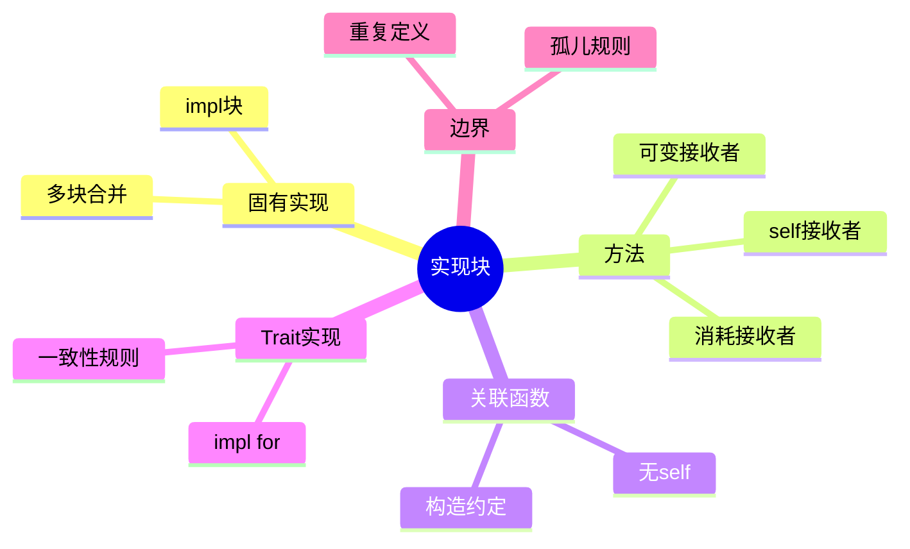

> **内容分级**: [基础级]

# Implementations（实现块）
>
> **EN**: Implementations
> **Summary**: Implementations: `impl` blocks for defining methods and trait implementations, covering associated functions, `self`, `&self`, `&mut self`, trait impls, and inherent impls.
> **Rust 版本**: 1.97.0+ (Edition 2024)
> **受众**: [初学者]
> **Bloom 层级**: L2-L3
> **权威来源**: 本文件为 `concept/` 权威页。
> **A/S/P 标记**: **S+P** — Structure + Procedure
> **双维定位**: F×App — 掌握 `impl` 块将行为绑定到类型的机制
> **定位**: 系统讲解 Rust `impl` 块的两种形式（固有实现、Trait 实现）、方法 receiver、关联函数，以及与结构体（Struct）/枚举（Enum）/Trait 的关系。
> **前置概念**: [Structs](04_structs.md) · [Enumerations](05_enumerations.md) · [Traits](../../02_intermediate/00_traits/01_traits.md) · [Functions](02_functions.md) · [Terminology Glossary](../../00_meta/01_terminology/01_terminology_glossary.md)
> **后置概念**: [Generics](../../02_intermediate/01_generics/01_generics.md) · [Type Conversions](../../02_intermediate/04_types_and_conversions/07_type_conversions.md) · [Advanced Traits](../../02_intermediate/00_traits/04_advanced_traits.md)
>
> **来源**: [The Rust Programming Language — Method Syntax](https://doc.rust-lang.org/book/ch05-03-method-syntax.html) · [Rust Reference — Implementations](https://doc.rust-lang.org/reference/items/implementations.html)

---

> **对应 Crate**: [`c02_type_system`](../../crates/c02_type_system)
> **对应练习**: [`exercises/src/type_system/`](../../exercises/src/type_system)
> **权威来源**: [Rust Reference — Implementations](https://doc.rust-lang.org/reference/items/implementations.html) · [TRPL — Method Syntax](https://doc.rust-lang.org/book/ch05-03-method-syntax.html)
>
> **权威来源对齐变更日志**: 2026-07-10 补充权威来源标注（Rust Reference、TRPL）

## 认知路径

> **认知路径**: 本节从“如何将行为绑定到类型”出发，依次建立固有实现、方法 receiver、关联函数与 Trait 实现的完整图景。

1. **问题识别**: 当类型需要附带行为时，如何组织方法与函数？
2. **概念建立**: 掌握 `impl` 块、`self` / `&self` / `&mut self`、关联函数、Trait `impl`。
3. **机制推理**: 通过 ⟹ 定理链将方法调用、receiver 选择与所有权（Ownership）/借用（Borrowing）规则串联起来。
4. **边界辨析**: 借助反命题/反例理解在 `&self` 中修改字段、方法调用后继续使用、Orphan Rule 等问题。
5. **迁移应用**: 将 `impl` 与泛型（Generics）、类型转换、高级 Trait 等后置概念链接。

---

> **过渡**: 从实现块的直观描述转向其形式化定义，需要先把“给类型加方法”的直觉转化为 `impl` 块、receiver 类型与 Coherence 规则的精确表述。
> **过渡**: 在建立实现块的核心命题之后，下一步是审视这些命题在边界条件下的稳定性——这正是反命题与反例的价值所在。
> **过渡**: 最后，将实现块与相邻概念连接，形成从 L1 到 L7 的纵向认知路径，避免孤立记忆。

---

> **定理 1** [Tier 1]: `impl Type { ... }` 将方法绑定到类型 ⟹ 方法第一个参数 `self` / `&self` / `&mut self` 决定调用时的所有权（Ownership）转移或借用（Borrowing）。
>
> **定理 2** [Tier 1]: 关联函数无 `self` 参数 ⟹ 通常用作构造函数，通过 `Type::func()` 调用，不依赖实例。
>
> **定理 3** [Tier 1]: `impl Trait for Type` 为类型实现 Trait ⟹ 受 Orphan Rule 与 Coherence 约束，防止不相关 crate 间的冲突实现。

---

> **反向推理 1** [Tier 1]: 若编译器报错 `cannot borrow ... as mutable` 在方法内部 ⟸ 应检查方法 receiver 是否为 `&mut self`。
>
> **反向推理 2** [Tier 1]: 若编译器报错 `conflicting implementations` ⟸ 应检查是否违反 Orphan Rule 或存在重叠 Blanket Impl。

---

## 🧠 知识结构图



## 📑 目录

- [Implementations（实现块）](#implementations实现块)
  - [认知路径](#认知路径)
  - [🧠 知识结构图](#-知识结构图)
  - [📑 目录](#-目录)
  - [一、核心命题](#一核心命题)
  - [二、固有实现](#二固有实现)
  - [三、方法 Receiver](#三方法-receiver)
  - [四、关联函数](#四关联函数)
  - [五、Trait 实现](#五trait-实现)
  - [六、反例与边界测试](#六反例与边界测试)
    - [6.1 在 `&self` 方法中修改字段](#61-在-self-方法中修改字段)
    - [6.2 调用获取所有权的方法后继续使用](#62-调用获取所有权的方法后继续使用)
    - [6.3 Orphan Rule 违规](#63-orphan-rule-违规)
  - [七、权威来源索引](#七权威来源索引)
  - [国际权威参考 / International Authority References（P1 学术 · P2 生态）](#国际权威参考--international-authority-referencesp1-学术--p2-生态)
  - [嵌入式测验（Embedded Quiz）](#嵌入式测验embedded-quiz)
    - [测验 1：方法 Receiver 的所有权语义（🟢 基础）](#测验-1方法-receiver-的所有权语义-基础)
    - [测验 2：关联函数与方法的分界（🟡 进阶）](#测验-2关联函数与方法的分界-进阶)
    - [测验 3：Orphan Rule 违规与修复（🔴 专家）](#测验-3orphan-rule-违规与修复-专家)
  - [📋 关键属性](#-关键属性)
  - [🔗 概念关系](#-概念关系)

---

## 一、核心命题

> **命题 1**: `impl` 块将**函数（方法）**绑定到类型，分为固有实现和 Trait 实现。
>
> **命题 2**: 方法第一个参数为 `self`、`&self` 或 `&mut self`，决定调用时所有权的转移/借用方式。
>
> **命题 3**: 关联函数没有 `self` 参数，通常用作构造函数，通过 `Type::function()` 调用。
>
> **命题 4**: 一个类型可以为多个 Trait 实现，但受 Orphan Rule 与 Coherence 约束。

---

## 二、固有实现

> (Source: [Rust Reference — Implementations](https://doc.rust-lang.org/reference/items/implementations.html))
（Inherent Impl）

```rust
struct Rectangle {
    width: u32,
    height: u32,
}

impl Rectangle {
    fn area(&self) -> u32 {
        self.width * self.height
    }

    fn can_hold(&self, other: &Rectangle) -> bool {
        self.width > other.width && self.height > other.height
    }
}

fn main() {
    let r = Rectangle { width: 10, height: 5 };
    println!("{}", r.area()); // 50
}
```

> **关键洞察**: 固有实现让类型拥有"面向对象"风格的方法，但不引入继承，所有行为通过组合和 Trait 表达。

---

## 三、方法 Receiver

| Receiver | 调用方式 | 所有权 |
|:---|:---|:---|
| `self` | `obj.method()` | 获取所有权 |
| `&self` | `obj.method()` | 不可变借用（Immutable Borrow） |
| `&mut self` | `obj.method()` | 可变借用（Mutable Borrow） |

```rust,ignore
// 示意 std 内部实现结构（不能为外部类型定义固有 impl，仅作概念说明）
impl String {
    // 不可变借用
    fn len(&self) -> usize { self.as_bytes().len() }

    // 可变借用
    fn push_str(&mut self, s: &str) { /* ... */ }

    // 获取所有权并返回转换后的值
    fn into_bytes(self) -> Vec<u8> { /* ... */ }
}
```

---

## 四、关联函数

```rust
struct Rectangle {
    width: u32,
    height: u32,
}

impl Rectangle {
    fn square(size: u32) -> Rectangle {
        Rectangle { width: size, height: size }
    }
}

fn main() {
    let sq = Rectangle::square(5);
}
```

> **注意**: 关联函数没有 `self`，不是方法，但通常作为构造函数或工具函数。

---

## 五、Trait 实现

```rust
struct Rectangle {
    width: u32,
    height: u32,
}

trait Drawable {
    fn draw(&self);
}

impl Drawable for Rectangle {
    fn draw(&self) {
        println!("{}x{} rectangle", self.width, self.height);
    }
}

fn main() {
    let r = Rectangle { width: 4, height: 2 };
    r.draw();
}
```

> **规则**:
>
> - `impl Trait for Type { ... }` 实现 Trait。
> - 实现的方法签名必须与 Trait 定义一致。
> - 受 Orphan Rule 约束：Trait 或类型至少有一个由当前 crate 定义。

---

## 六、反例与边界测试

本节的反例覆盖 `impl` 块的四个高频问题：

- **`&self` 方法中修改字段**：`&self` 承诺不可变借用——直接赋值触发 E0594/E0596；需要「逻辑可变」时用内部可变性（`Cell`/`RefCell`）或改 `&mut self`；
- **消耗性方法后继续使用**：`fn consume(self)` 取所有权，调用后原变量失效（E0382）——builder 模式的 `self -> Self` 链式调用即利用此语义保证「每个中间态只使用一次」；
- **Orphan Rule 违规**：`impl ForeignTrait for ForeignType` 触发 E0117——修复模式是 newtype 包装（`struct Wrapper(ForeignType)` 获得本地类型身份）或 trait 改由本地定义；
- **测验衔接**：receiver 形式（`self`/`&self`/`&mut self`/`Box<Self>`/`Rc<Self>`）的选择是 impl 设计的第一决策。

判定准则：方法 receiver 决定调用后变量的可用性——`self` 消耗、`&mut self` 独占借用、`&self` 共享只读，选错 receiver 是 API 易用性事故的高发源。

### 6.1 在 `&self` 方法中修改字段

```rust,compile_fail
impl Rectangle {
    fn set_width(&self, w: u32) {
        self.width = w; // ❌ 不可变借用无法修改
    }
}
```

**修正**: 使用 `&mut self`。

### 6.2 调用获取所有权的方法后继续使用

```rust,compile_fail
fn main() {
    let s = String::from("hello");
    s.into_bytes();
    println!("{s}"); // ❌ s 已被移动
}
```

**修正**: 使用 `s.as_bytes()` 或 `s.clone().into_bytes()`。

### 6.3 Orphan Rule 违规

```rust,compile_fail
// ❌ 孤儿规则违反：trait（`Display`）与类型（`Vec`）均来自外部 crate，
// 当前 crate 两者都未定义，禁止实现。
impl std::fmt::Display for Vec<u8> {
    fn fmt(&self, f: &mut std::fmt::Formatter<'_>) -> std::fmt::Result {
        write!(f, "{} bytes", self.len())
    }
}
```

**修正**: 使用 newtype 包装 `struct MyString(String); impl MyTrait for MyString {}`。

---

## 七、权威来源索引

| 来源 | 可信度 | 说明 |
|:---|:---:|:---|
| [TRPL — Method Syntax](https://doc.rust-lang.org/book/ch05-03-method-syntax.html) | ✅ 一级 | 方法与 impl 入门 |
| [Rust Reference — Implementations](https://doc.rust-lang.org/reference/items/implementations.html) | ✅ 一级 | 完整规范 |

---

## 国际权威参考 / International Authority References（P1 学术 · P2 生态）

> 依据 `AGENTS.md` §2「对齐网络国际化权威内容」补充：仅追加已验证可达的权威链接，不改动正文事实。

- **P1 学术/形式化**: [Cardelli & Wegner: On Understanding Types, Data Abstraction, and Polymorphism (ACM Comput. Surv. 1985)](https://dl.acm.org/doi/10.1145/6041.6042)
- **P2 生态/社区**: [docs.rs/semver — 生态权威 API 文档](https://docs.rs/semver) · [docs.rs/toml — 生态权威 API 文档](https://docs.rs/toml)

---

## 嵌入式测验（Embedded Quiz）

> W3-b 补充（2026-07-12）：本页原无嵌入式测验，按四级题型规范补 3 题（🟢🟡🔴 各 1 题，`<details>` 折叠答案），内容与本页正文严格一致。

### 测验 1：方法 Receiver 的所有权语义（🟢 基础）

`impl String` 中 `fn into_bytes(self)` 的 receiver 是 `self`，其调用语义是？

- A. 不可变借用，调用后原值仍可用
- B. 可变借用，调用后原值仍可用
- C. 获取所有权，调用后原值被移动、不可再使用
- D. 复制原值，`self` 要求 `Copy`

<details>
<summary>✅ 答案</summary>

**C 正确**。按本页「三、方法 Receiver」表格：`self` ⟹ 获取所有权；`&self` ⟹ 不可变借用；`&mut self` ⟹ 可变借用。§6.2 反例正是 `s.into_bytes()` 后再用 `s` 报 "borrow of moved value"。

</details>

---

### 测验 2：关联函数与方法的分界（🟡 进阶）

`impl Rectangle { fn square(size: u32) -> Rectangle { ... } }` 中 `square` 的性质是？

- A. 方法：第一个参数是隐式 `self`
- B. 关联函数：没有 `self` 参数，通过 `Rectangle::square(5)` 调用，通常用作构造函数
- C. 自由函数：与 `Rectangle` 无命名空间关联
- D. Trait 方法：必须先声明 trait

<details>
<summary>✅ 答案</summary>

**B 正确**。按本页定理 2 与「四、关联函数」：关联函数**无 `self` 参数**，不是方法，通常用作构造函数或工具函数，通过 `Type::function()` 调用，不依赖实例。

</details>

---

### 测验 3：Orphan Rule 违规与修复（🔴 专家）

以下代码为何编译失败？正确修复方式是？

```rust,ignore
trait MyTrait {}
impl MyTrait for String {}
```

- A. 语法错误；把 `{}` 改为 `{ fn f() {} }`
- B. 违反 Orphan Rule：当前 crate 既未定义 `MyTrait` 也未定义 `String`；修复：用 newtype 包装 `struct MyString(String); impl MyTrait for MyString {}`
- C. `String` 不能实现任何 trait；无修复方式
- D. 缺少 `#[derive]`；给 trait 加 derive 即可

<details>
<summary>✅ 答案</summary>

**B 正确**。按本页 §6.3 与定理 3：`impl Trait for Type` 受 **Orphan Rule** 约束——Trait 或类型**至少有一个由当前 crate 定义**，防止不相关 crate 间的冲突实现。本例二者皆外部定义，故拒绝；标准修复是 **newtype 包装**使类型成为本地类型。

</details>

## 📋 关键属性

| 属性 | 取值 / 判定 | 依据 |
|---|---|---|
| 分类 | 固有 impl（inherent）与 trait impl 二分 | Reference |
| 方法 receiver | `self` / `&self` / `&mut self` 三种接收形式 | 方法文法 |
| 关联函数 | 无 receiver 的命名空间函数（如 `new`） | API 惯例 |
| 多块 | 同一类型可拆分多个 impl 块 | 文法 |
| 孤儿规则 | trait impl 要求 trait 或类型至少一方在本地定义 | 一致性规则 |

## 🔗 概念关系

- **上位（is-a）**：[Items](12_items.md) 项体系的行为附加机制。
- **下位（实例）**：trait impl 的进阶形态见 [Advanced Traits](../../02_intermediate/00_traits/04_advanced_traits.md)。
- **对偶**：与 C++ 构造函数体系相对，见 [构造与初始化](../../02_intermediate/00_traits/05_construction_and_initialization.md)。
- **组合**：与 [Structs](04_structs.md) / [Enumerations](05_enumerations.md) 组合定义类型行为。
- **依赖**：方法调用解析依赖 [Traits](../../02_intermediate/00_traits/01_traits.md) 的查找规则。
