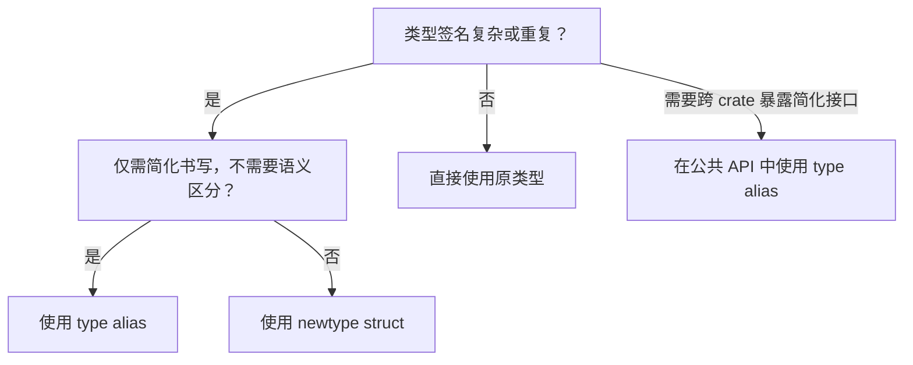
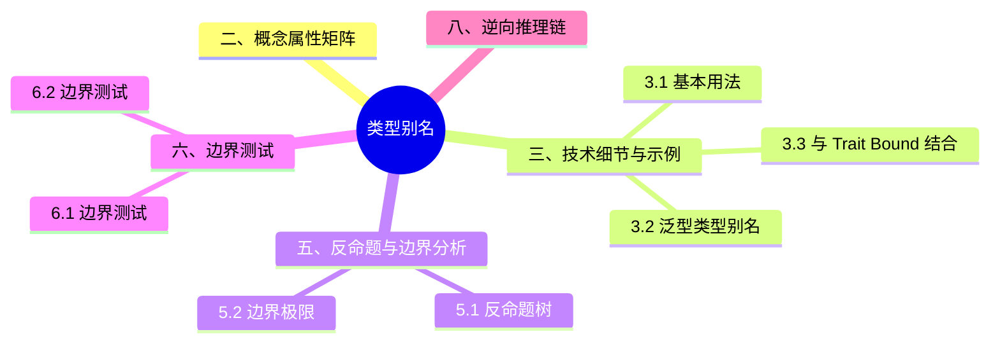

> **内容分级**: [综述级]
> **Rust 版本**: 1.97.0+ (Edition 2024)
> **本节关键术语**: 类型别名（Type Alias） · 泛型（Generics）类型别名（Generic Type Alias） · 关联类型（Associated Type） · 新类型模式（Newtype Pattern）

# 类型别名（Type Alias）
>
> **EN**: Type Aliases
> **Summary**: A type alias (`type`) gives an existing type a new name without creating a new type, improving readability and reducing repetition, especially for complex generic or trait-bound types.
>
> **受众**: [初学者]
> **层级**: L1 基础概念
> **Bloom 层级**: L1-L3
> **A/S/P 标记**: **S** — Structure
> **双维定位**: C×App
> **前置概念**: [Type System Basics](../02_type_system/01_type_system.md) · [Generics](../../02_intermediate/01_generics/01_generics.md)
> **后置概念**: [Newtype and Wrapper Types](../../02_intermediate/04_types_and_conversions/03_newtype_and_wrapper.md) · [Traits](../../02_intermediate/00_traits/01_traits.md)
>
> **主要来源**: [The Rust Reference — Type Aliases](https://doc.rust-lang.org/reference/items/type-aliases.html) ·
> [The Rust Programming Language — Custom Types](https://doc.rust-lang.org/book/ch06-01-defining-an-enum.html) ·
> [Rust By Example — Alias](https://doc.rust-lang.org/rust-by-example/custom_types.html)
>
> **权威来源**: 本文件为 `concept/` 权威页。

---

> **变更日志**:
>
> - v1.0 (2026-07-04): 初始创建

## 📑 目录

---

- [类型别名（Type Alias）](#类型别名type-alias)
  - [📑 目录](#-目录)
  - [一、权威定义（Definition）](#一权威定义definition)
    - [1.1 形式化定义](#11-形式化定义)
    - [1.2 直觉解释](#12-直觉解释)
  - [二、概念属性矩阵](#二概念属性矩阵)
  - [三、技术细节与示例](#三技术细节与示例)
    - [3.1 基本用法](#31-基本用法)
    - [3.2 泛型类型别名](#32-泛型类型别名)
    - [3.3 与 Trait Bound 结合](#33-与-trait-bound-结合)
    - [3.4 在 impl 块中使用别名](#34-在-impl-块中使用别名)
  - [四、示例与反例](#四示例与反例)
    - [4.1 正确示例：简化复杂类型](#41-正确示例简化复杂类型)
    - [4.2 反例：为类型别名添加额外约束](#42-反例为类型别名添加额外约束)
    - [4.3 反例：混淆别名与 newtype](#43-反例混淆别名与-newtype)
  - [五、反命题与边界分析](#五反命题与边界分析)
    - [5.1 反命题树](#51-反命题树)
    - [5.2 边界极限](#52-边界极限)
  - [六、边界测试](#六边界测试)
    - [6.1 边界测试：递归类型别名](#61-边界测试递归类型别名)
    - [6.2 边界测试：别名与 impl Trait](#62-边界测试别名与-impl-trait)
  - [七、判断推理与决策树](#七判断推理与决策树)
    - [7.1 何时使用类型别名？](#71-何时使用类型别名)
    - [7.2 与其他概念的辨析](#72-与其他概念的辨析)
  - [八、逆向推理链（Backward Reasoning）](#八逆向推理链backward-reasoning)
  - [九、来源与延伸阅读](#九来源与延伸阅读)
  - [嵌入式测验（Embedded Quiz）](#嵌入式测验embedded-quiz)
    - [测验 1：类型别名 vs Newtype](#测验-1类型别名-vs-newtype)
  - [认知路径](#认知路径)
  - [国际权威参考 / International Authority References（P1 学术 · P2 生态）](#国际权威参考--international-authority-referencesp1-学术--p2-生态)
  - [🧭 思维导图（Mindmap）](#-思维导图mindmap)

---

## 一、权威定义（Definition）

> **类型别名（Type Alias）** 使用 `type` 关键字为一个已存在的类型声明一个新名称。别名与原类型**完全等价**，不会创建新的类型。
>
> [来源: [The Rust Reference — Type Aliases](https://doc.rust-lang.org/reference/items/type-aliases.html)]

### 1.1 形式化定义

```text
type AliasName<T1, T2, ...> = ExistingType<T1, T2, ...>;
```

其中：

- `AliasName` 是新名称。
- `ExistingType` 是已存在的类型（可为具体类型或泛型类型）。
- 别名可携带泛型参数，但**不能**添加新的 trait bound 或改变类型的基本语义。

### 1.2 直觉解释

类型别名类似于数学中的“令 `x = 5`”：它引入了一个新的符号，但没有改变符号背后的值。在 Rust 中，`type Meters = u32;` 使得 `Meters` 和 `u32` 在类型系统（Type System）中不可区分。

> [💡 原创分析](../../00_meta/00_framework/methodology.md)

---

## 二、概念属性矩阵

| 属性 | 说明 | Rust 表达 | 权威来源 |
|:---|:---|:---|:---|
| 名称绑定 | 为现有类型引入新名称 | `type Foo = Bar;` | Reference |
| 类型等价 | 别名与原类型完全等价 | `Foo` ≡ `Bar` | Reference |
| 泛型支持 | 可参数化 | `type Map<K, V> = HashMap<K, V>;` | Reference |
| Trait bound 传递 | 别名继承原类型的所有实现 | `impl Trait for Foo` 等价于 `impl Trait for Bar` | Reference |
| 不能创建新类型 | 与 newtype 模式相反 | `struct Wrapper(Bar);` 才创建新类型 | TRPL |

---

## 三、技术细节与示例

本节展开类型别名（`type`）的三个技术要点：

- **别名是透明同义**：`type UserId = u64;` 后 `UserId` 与 `u64` **完全同一类型**——可互换、无新类型约束（区别于 newtype）；别名的价值在可读性与集中维护，不在类型安全；
- **泛型别名与生命周期（Lifetimes）**：`type Result<T> = std::result::Result<T, MyError>;` 可部分应用参数；别名可携带生命周期（`type Ref<'a, T> = &'a T;`），GAT 稳定后 trait 关联类型也可用别名风格声明；
- **`type` 在 trait 中的角色**：关联类型 `type Output;` 由 impl 指定——这是「类型函数」的入口：`FnOnce::Output` 让每个闭包（Closures）类型映射到其返回类型，迭代器（Iterator）的 `Item` 同理。

判定准则：缩短长类型名、统一错误类型用别名；需要编译器区分两种 `u64` 用 newtype——别名不提供任何隔离。

### 3.1 基本用法

```rust
fn main() {
    type Meters = u32;
    type Kilograms = u32;

    let distance: Meters = 100;
    let weight: Kilograms = 70;

    // 别名完全等价，可互相比较/赋值
    let raw: u32 = distance;
    assert_eq!(distance, raw);

    println!("distance: {}, weight: {}", distance, weight);
}
```

> **关键洞察**: `Meters` 和 `Kilograms` 在类型系统（Type System）中没有区别，因此上述代码无法阻止将重量赋值给距离。若需区分语义，应使用 newtype 模式（`struct Meters(u32);`）。
> [来源: [TRPL — Newtype Pattern](https://doc.rust-lang.org/book/ch19-04-advanced-types.html)]

### 3.2 泛型类型别名

```rust
use std::collections::HashMap;

type Map<K, V> = HashMap<K, V>;
type ResultMap<T, E> = HashMap<T, Result<T, E>>;

fn main() {
    let mut map: Map<&str, i32> = HashMap::new();
    map.insert("answer", 42);
    println!("{:?}", map);
}
```

### 3.3 与 Trait Bound 结合

```rust,compile_fail
use std::fmt::Debug;

type Debuggable<T> = T where T: Debug;

fn show(x: Debuggable<impl Debug>) {
    println!("{:?}", x);
}

fn main() {
    show(42);
}
```

> **注意**: `where` 子句在类型别名上主要用于限制泛型参数可用的 trait，但别名本身仍与原类型等价。
> [来源: [Rust Reference — Generic Type Aliases](https://doc.rust-lang.org/reference/items/type-aliases.html)]

### 3.4 在 impl 块中使用别名

```rust
type Point = (f64, f64);

// 错误：不能为类型别名实现固有方法（无法编译）
// impl Point {
//     fn origin() -> Self { (0.0, 0.0) }
// }

// 错误：由于孤儿规则（orphan rule, E0117），也不能为别名指向的外部类型
// （此处是元组 `(f64, f64)`）实现外部 trait `Debug`：
// impl std::fmt::Debug for Point { ... }  // 无法编译

// 正确：使用 newtype 包装，获得独立的本地类型
#[derive(Debug)]
struct Point2(f64, f64);
```

> **关键洞察**: 不能为类型别名本身实现固有方法（inherent methods）；且由于孤儿规则（Orphan Rule），也不能为别名指向的外部类型实现外部 trait——需要独立类型时应使用 newtype 模式。
> [来源: [The Rust Reference — Type Aliases](https://doc.rust-lang.org/reference/items/type-aliases.html)]

---

## 四、示例与反例

本节用三组对照说明「类型别名（Type Alias）」：正确示例：简化复杂类型、反例：为类型别名添加额外约束与反例：混淆别名与 newtype。每组先给正确示例并标注其成立的类型系统（Type System）依据，再给反例并标注编译器诊断（E0xxx）或运行时（Runtime）后果，最后给出修正方案。判读标准：正确示例应能通过 rustc 1.97 编译且无 clippy 警告，反例的失败点必须可定位到具体规则。

### 4.1 正确示例：简化复杂类型

```rust
use std::collections::HashMap;
use std::sync::{Arc, Mutex};

type SharedState = Arc<Mutex<HashMap<String, Vec<u8>>>>;

fn process(state: SharedState) {
    let mut guard = state.lock().unwrap();
    guard.insert("key".to_string(), vec![1, 2, 3]);
}

fn main() {
    let state: SharedState = Arc::new(Mutex::new(HashMap::new()));
    process(state);
}
```

### 4.2 反例：为类型别名添加额外约束

```rust,compile_fail
// 错误：类型别名不能改变原类型的语义或添加新的字段
type PositiveInt = u32 where PositiveInt > 0;

fn main() {}
```

> **错误诊断**: `error[E0658]`（类型别名 where 子句放置值约束为未稳定特性；stable Rust 1.96 不支持）。
> **修正**: 使用 newtype 模式 + 构造函数校验。
>
> ```rust
> struct PositiveInt(u32);
>
> impl PositiveInt {
>     fn new(n: u32) -> Option<Self> {
>         if n > 0 { Some(Self(n)) } else { None }
>     }
> }
> ```
>
> [来源: [Rust Reference — Where Clauses](https://doc.rust-lang.org/reference/items/generics.html#where-clauses)]

### 4.3 反例：混淆别名与 newtype

```rust
type UserId = u64;
type ProductId = u64;

fn find_user(id: UserId) -> String {
    format!("user-{}", id)
}

fn main() {
    let product: ProductId = 42;
    // 危险：ProductId 与 UserId 完全等价，编译器不会阻止传错
    println!("{}", find_user(product));
}
```

> **错误诊断**: 代码可以编译，但这是逻辑错误。
> **修正**: 若需区分语义，使用 newtype：`struct UserId(u64);` 和 `struct ProductId(u64);`。
> [来源: [TRPL — Newtype Pattern](https://doc.rust-lang.org/book/ch19-04-advanced-types.html)]

---

## 五、反命题与边界分析

本节检验类型别名的两条常见误判：

- **反命题 1：「类型别名能提供类型安全」** —— 错误。`type Meters = f64; type Seconds = f64;` 后两者可自由混用，编译器不会阻止 `meters + seconds`——需要区分时必须 newtype（`struct Meters(f64)`）。别名只是「同义词」，不是「新类型」。
- **反命题 2：「别名越长越抽象越好」** —— 过度。别名是**完全透明**的：错误信息中编译器可能展开也可能保留别名（取决于错误位置），深层嵌套别名让类型推断（Type Inference）错误信息反而更难读。判定准则：别名层数 ≤ 2，公共 API 中的别名应稳定且文档化。

边界极限小节量化：`impl Trait` 不能出现在别名右侧（TAIT，`type_alias_impl_trait` 仍 nightly）、循环别名的拒绝（E0391）、以及别名在泛型约束中的等价性判定。

### 5.1 反命题树

> **反命题 1**: "类型别名会创建新类型" ⟹ 不成立。别名与原类型完全等价，编译器不会区分。
> **反命题 2**: "类型别名可以提高类型安全性" ⟹ 不成立。别名不会引入新的类型检查，只有 newtype 才能做到。
> **反命题 3**: "类型别名可以添加新的方法" ⟹ 不成立。不能为别名实现 inherent methods，只能为原类型实现 trait。
> **反命题 4**: "任何复杂类型都适合用别名简化" ⟹ 不成立。过度使用别名会降低可读性，尤其是别名嵌套时。

### 5.2 边界极限

| 边界 | 现状 | 理论极限 | 工程意义 |
|:---|:---|:---|:---|
| 类型区分 | 别名无法区分 | 新类型可区分 | 需要语义区分时用 newtype |
| 方法实现 | 只能 impl trait | 可定义 inherent methods | 别名不适合封装行为 |
| 递归类型 | 可间接支持 | 不能直接自引用（Reference） | 如 `type Link<T> = Option<Box<Node<T>>>;` |
| 泛型约束 | 可传递 where | 不能添加值约束 | where 子句仅用于 trait bound |

---

## 六、边界测试

本节把「类型别名（Type Alias）」的规则推到编译器与运行时的边界上逐一实测：边界测试：递归类型别名 与 边界测试：别名与 impl Trait。每个用例标注预期结果（编译错误 / 运行时 panic / 逻辑错误），并用 rustc 1.97 验证：能复现的给出诊断信息与触发条件，不能复现的说明原因。这些用例共同回答一个问题——规则在极限处是否仍然成立，以及违反时编译器能否兜底。

### 6.1 边界测试：递归类型别名

```rust
type Link<T> = Option<Box<Node<T>>>;

struct Node<T> {
    value: T,
    next: Link<T>,
}

fn main() {
    let list: Link<i32> = Some(Box::new(Node {
        value: 1,
        next: Some(Box::new(Node { value: 2, next: None })),
    }));
    println!("list exists: {}", list.is_some());
}
```

### 6.2 边界测试：别名与 impl Trait

```rust
type IntIterator = std::ops::Range<i32>;

fn numbers() -> IntIterator {
    0..10
}

fn main() {
    for n in numbers() {
        print!("{} ", n);
    }
    println!();
}
```

---

## 七、判断推理与决策树

本节从何时使用类型别名？ 与 与其他概念的辨析 两个层面剖析「判断推理与决策树」。

### 7.1 何时使用类型别名？



### 7.2 与其他概念的辨析

| 场景 | 推荐选择 | 不推荐 | 理由 |
|:---|:---|:---|:---|
| 简化 `HashMap<String, Vec<u8>>` | `type Cache = HashMap<String, Vec<u8>>;` | `struct Cache(HashMap<String, Vec<u8>>);` | 若无需额外行为，别名更轻量 |
| 区分 `UserId` 与 `ProductId` | `struct UserId(u64);` | `type UserId = u64;` | 需要类型安全区分 |
| 为类型添加验证逻辑 | newtype + 构造函数 | type alias | 别名无法约束值 |
| 在 trait 中暴露关联类型 | `type Output;` | `type Output = T;`（默认） | 关联类型是 trait 契约的一部分 |

---

## 八、逆向推理链（Backward Reasoning）

> **从编译错误/运行时（Runtime）症状反推定理链**:
>
> ```text
> 类型签名冗长难以维护 ⟸ 未使用类型别名 ⟸ 应检查重复出现的复杂类型
> 逻辑错误：传错 ID/单位 ⟸ 使用了 type alias 而非 newtype ⟸ 若需语义区分应改为 struct wrapper
> 无法为别名添加方法 ⟸ type alias 不支持 inherent impl ⟸ 应使用 newtype 或直接在原类型上实现 trait
> ```
>
> **诊断映射**:
>
> - `error[E0117]: only traits defined in the current crate can be implemented for arbitrary types` → 试图为外部类型的别名实现 trait，但违反了孤儿规则（Orphan Rule）；应检查 impl 目标是否为本地 newtype。
> - 代码编译通过但业务逻辑出错 → 可能混淆了语义等价的别名；考虑 newtype。

---

## 九、来源与延伸阅读

- [Rust 核心术语英中对照表](../../00_meta/01_terminology/01_terminology_glossary.md)
- [The Rust Reference — Type Aliases](https://doc.rust-lang.org/reference/items/type-aliases.html)
- [The Rust Programming Language — Advanced Types](https://doc.rust-lang.org/book/ch19-04-advanced-types.html)
- [Rust By Example — Alias](https://doc.rust-lang.org/rust-by-example/custom_types.html)
- [Rust Reference — Generic Type Aliases](https://doc.rust-lang.org/reference/items/type-aliases.html)

---

## 嵌入式测验（Embedded Quiz）

本节测验覆盖类型别名的三个核心判别点：

- **理解层**：别名 vs newtype 的本质差异——给定混用代码判断能否编译（别名可混，newtype 不可）；
- **应用层**：`type Result<T>` 模式——为 crate 定义统一错误别名的正确姿势（保留一个泛型参数给 Ok 类型）；
- **分析层**：关联类型 vs 泛型参数的选择——`Iterator::Item` 为什么是关联类型而非 `Iterator<T>`：同一类型对同一 trait 的 impl 唯一性（每个类型只有一种迭代产出类型）。

作答建议：测验 3 是 trait 设计的分水岭问题，先尝试用泛型参数写 `Iterator`，体会「一个类型多种迭代方式」的冲突，再核对答案。

### 测验 1：类型别名 vs Newtype

**题目**: 以下哪种情况应该使用 newtype 而非 type alias？

A. 简化 `Vec<Vec<Option<String>>>` 的书写
B. 为 `u64` 类型的用户 ID 添加类型安全，防止与普通整数混淆
C. 为 `HashMap<String, i32>` 提供一个更短的名称
D. 在函数签名中减少泛型参数重复

<details>
<summary>✅ 答案与解析</summary>

**答案**: B

**解析**: type alias 只创建名称绑定，不创建新类型，因此无法阻止 `UserId` 和普通 `u64` 的混用。newtype（`struct UserId(u64);`）会创建不同的类型，编译器会在类型检查中区分它们。

</details>

---

## 认知路径

> **认知路径**: 本节从“复杂类型签名难以维护”的实际问题出发，建立类型别名作为轻量名称绑定工具的概念，再通过与 newtype 的对比明确其边界，最终形成在类型安全与代码简洁之间的判断能力。
>
> 1. **问题识别**: 复杂泛型类型在代码中重复出现，降低可读性。
> 2. **概念建立**: `type` 关键字为现有类型创建等价别名。
> 3. **机制推理**: 别名不改变类型系统语义，仅改变书写形式。
> 4. **边界辨析**: 别名不能提供类型安全区分，需要时用 newtype。
> 5. **迁移应用**: 在 API 设计、递归类型、状态共享等场景中选择合适的抽象。

---

> **权威来源**: [The Rust Reference](https://doc.rust-lang.org/reference/introduction.html), [The Rust Programming Language](https://doc.rust-lang.org/book/title-page.html), [Rust By Example](https://doc.rust-lang.org/rust-by-example/index.html)
> **权威来源对齐变更日志**: 2026-07-04 创建 [Rust 1.97.0 Reference 与 TRPL 对齐](https://doc.rust-lang.org/reference/introduction.html)
> **状态**: ✅ 权威来源对齐完成

---

## 国际权威参考 / International Authority References（P1 学术 · P2 生态）

> 依据 `AGENTS.md` §2「对齐网络国际化权威内容」补充：仅追加已验证可达的权威链接，不改动正文事实。

- **P1 学术/形式化**: [Cardelli & Wegner: On Understanding Types, Data Abstraction, and Polymorphism (ACM Comput. Surv. 1985)](https://dl.acm.org/doi/10.1145/6041.6042)
- **P2 生态/社区**: [docs.rs/cargo_metadata — 生态权威 API 文档](https://docs.rs/cargo_metadata) · [docs.rs/semver — 生态权威 API 文档](https://docs.rs/semver)

## 🧭 思维导图（Mindmap）


