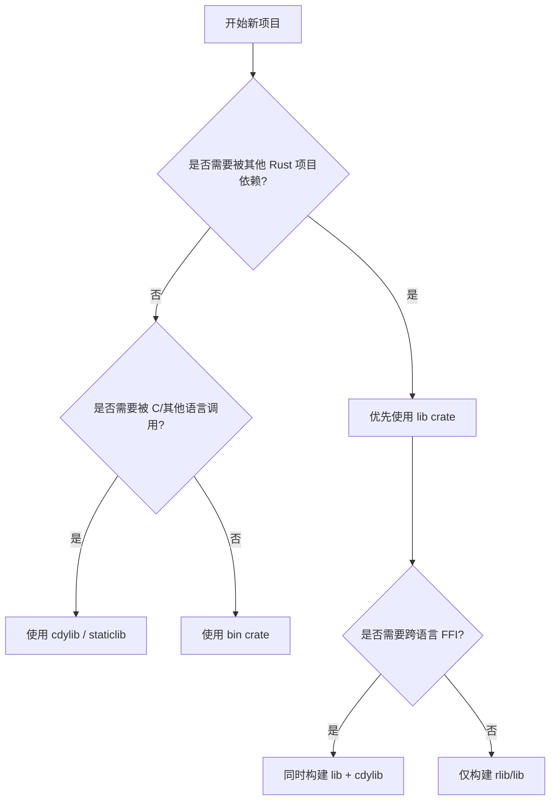

# Crate 与源文件（Crates and Source Files）

> **EN**: Crates and Source Files
> **Summary**: The Rust compilation model: crate as the unit of compilation, linking, versioning, and runtime loading; source file conventions, crate-level attributes, `main` function rules, and how the module tree maps to the filesystem.
>
> **受众**: [初学者]
> **内容分级**: [综述级]
> **Bloom 层级**: 理解 → 应用
> **A/S/P 标记**: **S** — Specification
> **双维定位**: S×App — 规范应用
> **前置依赖**: [Modules and Paths](11_modules_and_paths.md) · [Attributes and Macros](../09_macros_basics/12_attributes_and_macros.md) · [Functions](12_functions.md)
> **后置概念**: [Items](39_items.md) · [Cargo Workspaces](../../06_ecosystem/01_cargo/78_cargo_workspaces.md) · [Cargo Manifest Reference](../../06_ecosystem/01_cargo/64_cargo_manifest_reference.md) · [Linkage](../../03_advanced/04_ffi/27_linkage.md) · [The Rust Runtime](../../03_advanced/02_unsafe/30_rust_runtime.md)
> **定理链**: Crate → Module Tree → Source File → Item
> **主要来源**: [Rust Reference — Crates and Source Files](https://doc.rust-lang.org/reference/crates-and-source-files.html) · [TRPL — Packages and Crates](https://doc.rust-lang.org/book/ch07-01-packages-and-crates.html) · [Cargo Book](https://doc.rust-lang.org/cargo/index.html)

---

---

## 认知路径

> **认知路径**: 本节从 "Crate 与源文件" 的核心问题出发，依次建立直观理解、形式化模型与工程实践之间的联系。

1. **问题识别**: 为什么 Rust 选择 crate 作为编译与分发的基本单元？它与 C/C++ 的翻译单元、Java 的包有何异同？
2. **概念建立**: 掌握 crate、crate root、源文件、模块树、crate-level 属性等关键术语。
3. **机制推理**: 通过 ⟹ 定理链将 `Cargo.toml` 配置、源文件布局、模块路径解析串联起来。
4. **边界辨析**: 借助反命题/反例理解 `crate_type`、`no_main`、混合 crate 等边界情况。
5. **迁移应用**: 将 crate 模型与 [Cargo workspace](../../06_ecosystem/01_cargo/78_cargo_workspaces.md)、[链接](../../03_advanced/04_ffi/27_linkage.md)、[运行时](../../03_advanced/02_unsafe/30_rust_runtime.md) 等后置概念链接。

---

## 反命题决策树

> **反命题 1**: "一个 Cargo package 就是一个 crate" ⟹ 不成立。一个 package 可以包含多个 crate（一个库 + 多个二进制）。

> **反命题 2**: "crate 名称可以随意命名" ⟹ 不成立。`crate_name` 只能包含 Unicode 字母数字或下划线，且不能为空。

> **反命题 3**: "源文件越多，编译后的 crate 越多" ⟹ 不成立。一个 crate 由单个 crate root 与若干模块源文件组成，最终输出仍是一个编译单元。

---

## 一、Crate 是 Rust 的编译单元

Rust 的语义存在清晰的**编译期与运行期阶段区分（phase distinction）**：

- **静态解释**的规则决定编译是否成功。
- **动态解释**的规则决定程序运行时（Runtime）的行为。

编译模型围绕 **crate** 展开：

- 每次编译处理一个源形式的 crate。
- 若编译成功，输出一个二进制形式的 crate：可执行文件或某种库。
- crate 是**编译、链接、版本控制、分发和运行时（Runtime）加载**的基本单元。

一个 crate 包含一棵嵌套的模块（Module）作用域树。这棵树的顶层是一个**匿名模块**；crate 中任意项都有规范的模块路径，表示它在 crate 模块树中的位置。

---

## 二、源文件

- Rust 编译器总是以**单个源文件**作为输入，输出**单个 crate**。
- 源文件扩展名为 `.rs`。
- 一个源文件描述一个模块（Module），模块的名称和在 crate 模块树中的位置由外部决定：要么由引用（Reference）它的源文件中的显式模块项定义，要么由 crate 本身决定。
- 每个源文件都是模块（Module），但并非每个模块都需要独立源文件；模块定义可以嵌套在一个文件内。
- 源文件以零个或多个 **Item** 定义序列组成，文件开头可以有应用于所在模块的属性。
- 匿名 crate 模块还可以拥有应用于整个 crate 的属性。
- 文件内容可以以 shebang（`#!`）开头。

---

## 三、Crate 输出类型

`Cargo.toml` 通过 `crate-type` 控制输出：

```toml
[package]
name = "mylib"
version = "0.1.0"
edition = "2024"

[lib]
name = "mylib"
crate-type = ["lib", "staticlib", "cdylib"]
```

| `crate_type` | 输出 | 典型用途 |
|:---|:---|:---|
| `bin` | 可执行文件 | 命令行程序、服务入口 |
| `lib` | Rust 库（rlib）| 被其他 Rust crate 依赖 |
| `rlib` | Rust 静态库格式 | 中间链接格式 |
| `dylib` | 动态 Rust 库 | 插件、热重载 |
| `cdylib` | C 兼容动态库 | FFI、WebAssembly、嵌入其他语言 |
| `staticlib` | C 兼容静态库 | 与 C/C++ 项目静态链接 |

---

## 四、典型源文件布局

```text
my_project/
├── Cargo.toml
└── src/
    ├── main.rs          # 默认二进制入口（bin crate）
    ├── lib.rs           # 默认库入口（lib crate）
    ├── bin/
    │   ├── server.rs    # 额外二进制：cargo run --bin server
    │   └── cli.rs       # 额外二进制：cargo run --bin cli
    └── utils/
        ├── mod.rs       # utils 模块
        └── parser.rs    # utils::parser 子模块
```

模块树与文件系统的映射：

```text
crate root (main.rs / lib.rs)
├── mod front_of_house;
│   └── src/front_of_house.rs
│       └── mod hosting;
│           └── src/front_of_house/hosting.rs
└── mod back_of_house { ... }   // 同文件内嵌套模块
```

---

## 五、Crate 级属性示例

```rust
#![crate_name = "projx"]
#![crate_type = "lib"]
#![warn(non_camel_case_types)]
#![deny(unsafe_code)]
```

常用 crate 级属性：

| 属性 | 作用 |
|:---|:---|
| `crate_name` | 指定 crate 名称 |
| `crate_type` | 指定输出类型：`bin` / `lib` / `dylib` / `cdylib` / `staticlib` / `rlib` |
| `warn` / `deny` / `allow` | 控制 lint 级别 |
| `no_main` | 禁止为可执行文件生成 `main` 符号 |
| `no_std` | 禁用标准库，用于嵌入式或内核开发 |

---

## 六、`main` 函数

一个包含 `main` 函数的 crate 可以被编译为可执行文件。

### `main` 的约束

- 不接受参数。
- 不能声明 trait bound 或 lifetime bound。
- 不能有 `where` 子句。
- 返回类型必须实现 `Termination` trait。

```rust
fn main() {
    println!("Hello, world!");
}

fn main() -> Result<(), std::io::Error> {
    std::fs::read_to_string("config.toml")?;
    Ok(())
}

fn main() -> ! {
    std::process::exit(0);
}
```

`main` 也可以是导入的函数：

```rust
mod foo {
    pub fn bar() {
        println!("Hello, world!");
    }
}
use foo::bar as main;
```

### 未捕获的外部 unwind

当来自外部运行时（Runtime）的 unwind（例如 C++ 异常、或不同 panic handler 的 Rust panic）传播到 `main` 之外时，进程会被安全终止。这可能是 abort，且不保证执行 `Drop`。

### `no_main` 属性

`#![no_main]` 禁止为可执行二进制文件生成 `main` 符号，适用于由其他链接对象定义 `main` 的场景（如嵌入式或操作系统内核）。

---

## 七、`crate_name` 属性

`#![crate_name = "mycrate"]` 用于在 crate 级别指定 crate 名称。

- 名称不能为空。
- 只能包含 Unicode 字母数字或下划线 `_`。

```rust
#![crate_name = "parser_core"]
#![crate_type = "lib"]

pub fn parse(input: &str) -> Result<(), &str> {
    if input.is_empty() { Err("empty") } else { Ok(()) }
}
```

---

## 八、如何选择 Crate 类型



| 目标 | 推荐 crate 类型 | 说明 |
|:---|:---|:---|
| 命令行工具 | `bin` | `cargo run` 直接执行 |
| 可复用 Rust 库 | `lib` | 发布到 crates.io 供 Rust 项目使用 |
| Python/Node 扩展 | `cdylib` | 生成平台动态库 |
| 静态链接到 C++ | `staticlib` | 不依赖 Rust 运行时分发 |
| 插件系统 | `dylib` | Rust 动态加载 |

---

## 九、关联概念

| 概念 | 关系 |
|:---|:---|
| [Modules and Paths](11_modules_and_paths.md) | crate 由模块树组织 |
| [Items](39_items.md) | crate 由各种 item 组成 |
| [Functions](12_functions.md) | `main` 与普通函数的定义规则 |
| [Cargo Workspaces](../../06_ecosystem/01_cargo/78_cargo_workspaces.md) | Cargo 在 crate 之上组织 workspace |
| [Cargo Manifest Reference](../../06_ecosystem/01_cargo/64_cargo_manifest_reference.md) | `Cargo.toml` 完整字段说明 |
| [Linkage](../../03_advanced/04_ffi/27_linkage.md) | crate 输出参与链接 |
| [The Rust Runtime](../../03_advanced/02_unsafe/30_rust_runtime.md) | crate 运行时行为由运行时定义 |
| [Terminology Glossary](../../00_meta/01_terminology/terminology_glossary.md) | 术语表（元层参考） |

---

> **权威来源**: [Rust Reference — Crates and Source Files](https://doc.rust-lang.org/reference/crates-and-source-files.html) · [TRPL — Packages and Crates](https://doc.rust-lang.org/book/ch07-01-packages-and-crates.html) · [Cargo Book](https://doc.rust-lang.org/cargo/index.html)
> **内容分级**: [综述级]
