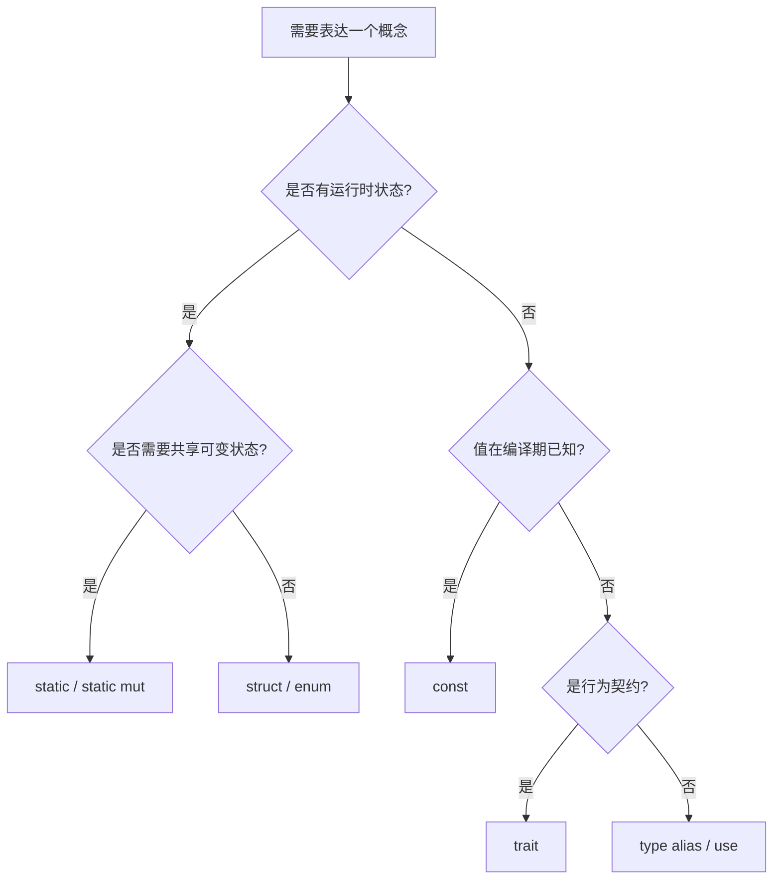

# 项（Items）

> **EN**: Items
> **Summary**: The building blocks of a Rust crate: modules, `use` declarations, functions, type definitions, constants, statics, traits, implementations, and `extern` blocks, with examples of their syntax, visibility, and scope rules.
>
> **受众**: [初学者]
> **内容分级**: [综述级]
> **Bloom 层级**: L2-L3
> **权威来源**: 本文件为 `concept/` 权威页。
> **A/S/P 标记**: **S** — Specification
> **双维定位**: S×App — 规范应用
> **前置依赖**: [Modules and Paths](11_modules_and_paths.md) · [Crates and Source Files](38_crates_and_source_files.md) · [Functions](12_functions.md)
> **后置概念**: [Traits](../../02_intermediate/00_traits/01_traits.md) · [Generics](../../02_intermediate/01_generics/02_generics.md) · [Unsafe Rust](../../03_advanced/02_unsafe/03_unsafe.md) · [FFI](../../03_advanced/04_ffi/05_rust_ffi.md) · [Linkage](../../03_advanced/04_ffi/27_linkage.md)
> **定理链**: Crate → Module → Item → Scope → Visibility
> **主要来源**: [Rust Reference — Items](https://doc.rust-lang.org/reference/items.html) · [TRPL — Packages and Crates](https://doc.rust-lang.org/book/ch07-01-packages-and-crates.html) · [Rust Reference — Modules](https://doc.rust-lang.org/reference/items/modules.html)

---

> **跨层回溯**: [学习方法论](../../00_meta/00_framework/methodology.md) · [术语表](../../00_meta/01_terminology/terminology_glossary.md)

---

## 认知路径

> **认知路径**: 本节从 "项（Items）" 的核心问题出发，依次建立直观理解、形式化模型与工程实践之间的联系。

1. **问题识别**: 为什么 Rust 将程序拆分为模块（Module）与项？这与 C/C++ 的头文件/源文件模型有何不同？
2. **概念建立**: 掌握 item 的定义、种类、声明位置、可见性与作用域规则。
3. **机制推理**: 通过 ⟹ 定理链将 crate、模块（Module）、item、名称解析与可见性串联起来。
4. **边界辨析**: 借助反命题/反例理解 item 顺序、`macro_rules` 作用域、关联项与外部项的边界。
5. **迁移应用**: 将 item 知识与 [trait](../../02_intermediate/00_traits/01_traits.md)、[泛型（Generics）](../../02_intermediate/01_generics/02_generics.md)、[unsafe](../../03_advanced/02_unsafe/03_unsafe.md) 等后置概念链接。

---

## 反命题决策树

> **反命题 1**: "所有 item 都在运行时（Runtime）可以动态创建" ⟹ 不成立。Item 完全在编译期确定，执行期间通常保持不变。
> **反命题 2**: "item 必须按使用顺序定义" ⟹ 不成立。Rust 的名称解析允许 item 在引用（Reference）位置之前或之后声明。
> **反命题 3**: "模块中的 item 默认对外可见" ⟹ 不成立。Item 默认私有，必须通过 `pub` 显式公开。

---

## 一、什么是 Item

> (Source: [Rust Reference — Items](https://doc.rust-lang.org/reference/items.html))

**项（item）** 是 crate 的组成部分。项通过嵌套的模块（Module）集合在 crate 中组织。每个 crate 都有一个最外层的匿名模块；crate 中的所有其他项都位于该 crate 模块树的路径中。

项的特性：

- 完全在编译期确定。
- 执行期间通常保持不变。
- 可能驻留在只读内存中。

```rust
// 这些都是 item
mod math;          // 模块声明
use std::fmt;      // use 声明
const PI: f64 = 3.14; // 常量
fn add(a: i32, b: i32) -> i32 { a + b } // 函数
struct Point { x: i32, y: i32 } // 结构体
enum Status { Ok, Err } // 枚举
trait Drawable { fn draw(&self); } // trait
impl Drawable for Point { fn draw(&self) { println!("point"); } } // 实现
```

---

## 二、Item 的种类

> (Source: [Rust Reference — Items](https://doc.rust-lang.org/reference/items.html))

Rust 中的 item 包括：

| 类别 | 说明 | 示例 |
|:---|:---|:---|
| Modules | 模块声明，组织代码命名空间 | `mod math;` |
| `extern crate` declarations | 外部 crate 声明（2015/2018 需要，2021+ 通常省略） | `extern crate serde;` |
| `use` declarations | 引入或重导出名称 | `use std::vec::Vec;` |
| Function definitions | 函数定义 | `fn f() {}` |
| Type alias definitions | 类型别名 | `type MyResult<T> = Result<T, Error>;` |
| Struct definitions | 结构体定义 | `struct S { x: i32 }` |
| Enumeration definitions | 枚举（Enum）定义 | `enum E { A, B }` |
| Union definitions | 联合体定义 | `union U { i: i32, f: f32 }` |
| Constant items | `const` 常量 | `const MAX: u32 = 100;` |
| Static items | `static` 静态项 | `static VERSION: &str = "1.0";` |
| Trait definitions | trait 定义 | `trait T { ... }` |
| Implementations | `impl` 实现块 | `impl T for S { ... }` |
| `extern` blocks | 外部函数声明块 | `extern "C" { fn c_func(); }` |

---

## 三、常见 Item 示例

### 函数

```rust
pub fn greet(name: &str) -> String {
    format!("Hello, {name}!")
}
```

### 类型别名

```rust
pub type UserId = u64;
```

### 结构体与枚举

```rust
pub struct Rectangle {
    pub width: u32,
    pub height: u32,
}

pub enum Message {
    Quit,
    Move { x: i32, y: i32 },
    Write(String),
}
```

### 常量与静态项

```rust
pub const MAX_CONNECTIONS: usize = 100;
pub static APP_NAME: &str = "MyApp";
```

### `use` 声明

```rust
use std::collections::HashMap;
pub use std::time::Duration; // 重导出
```

### 联合体（unsafe）

```rust
#[repr(C)]
union FloatInt {
    f: f32,
    i: u32,
}
```

---

## 四、Item 的声明位置

Item 可以声明在：

- crate 根（crate root）
- 模块（Module）内部
- 块表达式（block expression）内部（如函数体内的嵌套函数、常量）

```rust
fn outer() {
    const INNER_CONST: i32 = 1;
    fn inner() { println!("inner"); }
    inner();
}
```

---

## 五、可见性

Item 默认私有。使用 `pub` 及其变体控制可见性：

| 可见性 | 含义 |
|:---|:---|
| `pub` | 全局公开 |
| `pub(crate)` | 当前 crate 内可见 |
| `pub(super)` | 父模块可见 |
| `pub(in path)` | 指定路径可见 |

```rust
mod outer {
    pub mod inner {
        pub(crate) fn crate_only() {}
        pub(super) fn parent_only() {}
    }
}
```

---

## 六、关联项与外部项

### 关联项（Associated items）

- 可以声明在 **trait** 和 **实现（implementations）** 内部的项子集。
- 包括关联函数、关联类型、关联常量。

```rust
trait Area {
    type Output;
    const PI: f64;
    fn area(&self) -> Self::Output;
}

impl Area for Rectangle {
    type Output = u32;
    const PI: f64 = 3.14;
    fn area(&self) -> Self::Output { self.width * self.height }
}
```

参见 [Traits](../../02_intermediate/00_traits/01_traits.md) 与 [Advanced Traits](../../02_intermediate/00_traits/19_advanced_traits.md)。

### 外部项（External items）

- 可以声明在 **`extern` 块** 内部的项子集。
- 用于声明来自其他语言（通常是 C）的函数和变量。

```rust
#[link(name = "c")]
extern "C" {
    fn malloc(size: usize) -> *mut u8;
    fn free(ptr: *mut u8);
}
```

参见 [FFI](../../03_advanced/04_ffi/05_rust_ffi.md) 与 [Linkage](../../03_advanced/04_ffi/27_linkage.md)。

---

## 七、Item 的顺序

Item 可以按任意顺序定义，但 **`macro_rules!`** 具有自己独立的作用域行为。

名称解析允许 item 在模块或块中先于或后于其被引用（Reference）的位置定义。

```rust
fn main() {
    say_hello(); // 先引用，后定义
}

fn say_hello() {
    println!("hello");
}
```

---

## 八、如何选择 Item



---

## 九、关联概念

| 概念 | 关系 |
|:---|:---|
| [Modules and Paths](11_modules_and_paths.md) | item 通过模块树组织 |
| [Crates and Source Files](38_crates_and_source_files.md) | crate 由 item 组成 |
| [Functions](12_functions.md) | 函数是最常用的 item |
| [Use Declarations](13_use_declarations.md) | `use` 本身也是 item |
| [Structs](14_structs.md) / [Enumerations](15_enumerations.md) | 类型定义 item |
| [Implementations](16_implementations.md) | `impl` item |
| [Const Items](45_const_items_and_const_fn.md) | `const` 与 `const fn` |
| [Static Items](44_static_items.md) | `static` 规则 |
| [Traits](../../02_intermediate/00_traits/01_traits.md) | trait 定义与实现是 item 的重要类别 |
| [Generics](../../02_intermediate/01_generics/02_generics.md) | 泛型 item 的定义与实例化 |
| [Unsafe Rust](../../03_advanced/02_unsafe/03_unsafe.md) | `extern` 块、`unsafe` trait 等属于 unsafe 相关 item |
| [Linkage](../../03_advanced/04_ffi/27_linkage.md) | item 的可见性影响链接器符号 |

---

> **权威来源**: [Rust Reference — Items](https://doc.rust-lang.org/reference/items.html) · [Rust Reference — Modules](https://doc.rust-lang.org/reference/items/modules.html)
> **内容分级**: [综述级]

## 过渡段

> **过渡**: 从 item 分类过渡到作用域与可见性，可以理解 Rust 名称解析的基础规则。
>
> **过渡**: 从可见性规则过渡到 use 声明，可以建立“定义—导出—使用”的模块协作模式。
>
> **过渡**: 从 item 顺序与宏（Macro）作用域过渡到 trait 与泛型（Generics），可以为进阶类型系统（Type System）学习奠定基础。
>

## 反向推理

> **反向推理**: 编译器提示某 item 不存在但实际已定义 ⟸ 说明可见性 `pub` 或模块路径未正确设置。
>
> **反向推理**: 宏（Macro）在定义前被调用导致错误 ⟸ 说明 item 顺序与 `macro_rules` 作用域规则未遵守。
>
