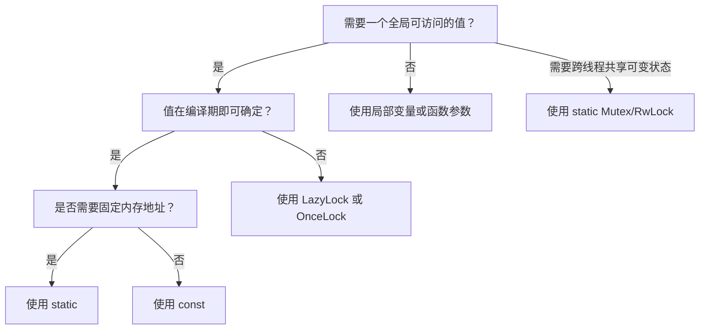

> **内容分级**: [基础级]
> **Rust 版本**: 1.97.0+ (Edition 2024)
> **本节关键术语**: 静态项（Static Item） · 可变静态（Mutable Static） · 内部可变性（Interior Mutability） · 生命周期（Lifetime） · 延迟初始化（Lazy Initialization）

# 静态项（Static Items）
>
> **EN**: Static Items
> **Summary**: Static items are global variables with a `'static` lifetime, stored in the program's static memory region. They enable data sharing across the entire program but require careful handling of mutability and thread safety.
>
> **受众**: [初学者]
> **层级**: L1 基础概念
> **Bloom 层级**: 理解 → 应用
> **A/S/P 标记**: **S** — Structure
> **双维定位**: C×App
> **前置概念**: [Ownership](../01_ownership_borrow_lifetime/01_ownership.md) · [Lifetimes](../01_ownership_borrow_lifetime/03_lifetimes.md) · [Borrowing](../01_ownership_borrow_lifetime/02_borrowing.md)
> **后置概念**: [Interior Mutability](../../02_intermediate/02_memory_management/08_interior_mutability.md) · [Concurrency](../../03_advanced/00_concurrency/01_concurrency.md) · [Unsafe Rust](../../03_advanced/02_unsafe/03_unsafe.md)
>
> **主要来源**: [The Rust Reference — Static Items](https://doc.rust-lang.org/reference/items/static-items.html) ·
> [The Rust Programming Language — Constants and Statics](https://doc.rust-lang.org/book/ch03-01-variables-and-mutability.html) ·
> [Rust By Example — Statics](https://doc.rust-lang.org/rust-by-example/custom_types/constants.html)
>
> **Rust 版本**: 1.97.0+ (Edition 2024)

---

> **Bloom 层级**: 理解 → 应用
> **变更日志**:
>
> - v1.0 (2026-07-04): 初始创建

## 📑 目录

---

> **过渡**: 从 静态项 的直观描述转向其形式化定义，需要先把日常经验中的模糊直觉转化为可验证的术语与规则。
> **过渡**: 在建立 静态项 的核心命题之后，下一步是审视这些命题在边界条件下的稳定性——这正是反命题与反例的价值所在。
> **过渡**: 最后，将 静态项 与相邻概念连接，形成从 L1 到 L7 的纵向认知路径，避免孤立记忆。

---

- [静态项（Static Items）](#静态项static-items)
  - [📑 目录](#-目录)
  - [一、权威定义（Definition）](#一权威定义definition)
    - [1.1 形式化定义](#11-形式化定义)
    - [1.2 直觉解释](#12-直觉解释)
  - [二、概念属性矩阵](#二概念属性矩阵)
  - [三、技术细节与示例](#三技术细节与示例)
    - [3.1 不可变静态项](#31-不可变静态项)
    - [3.2 可变静态项](#32-可变静态项)
    - [3.3 静态项与 `const` 的区别](#33-静态项与-const-的区别)
    - [3.4 延迟初始化](#34-延迟初始化)
  - [四、示例与反例](#四示例与反例)
    - [4.1 正确示例：全局配置常量](#41-正确示例全局配置常量)
    - [4.2 反例：在 safe 代码中访问 `static mut`](#42-反例在-safe-代码中访问-static-mut)
    - [4.3 反例：用 `static` 替代 `const` 导致内联问题](#43-反例用-static-替代-const-导致内联问题)
  - [五、反命题与边界分析](#五反命题与边界分析)
    - [5.1 反命题树](#51-反命题树)
    - [5.2 边界极限](#52-边界极限)
  - [六、边界测试](#六边界测试)
    - [6.1 边界测试：静态项的生命周期](#61-边界测试静态项的生命周期)
    - [6.2 边界测试：内部可变性静态项](#62-边界测试内部可变性静态项)
  - [七、判断推理与决策树](#七判断推理与决策树)
    - [7.1 何时使用 `static`？](#71-何时使用-static)
    - [7.2 与其他概念的辨析](#72-与其他概念的辨析)
  - [八、逆向推理链（Backward Reasoning）](#八逆向推理链backward-reasoning)
  - [九、来源与延伸阅读](#九来源与延伸阅读)
  - [嵌入式测验（Embedded Quiz）](#嵌入式测验embedded-quiz)
    - [测验 1：`static` vs `const`](#测验-1static-vs-const)
    - [测验 2：安全可变全局状态](#测验-2安全可变全局状态)
  - [认知路径](#认知路径)

---

## 一、权威定义（Definition）

> **静态项（Static Item）** 是使用 `static` 关键字声明的、具有 `'static` 生命周期的全局变量。它在程序整个运行期间存在，内存地址固定，存储于静态数据区。
>
> [来源: [The Rust Reference — Static Items](https://doc.rust-lang.org/reference/items/static-items.html)]

### 1.1 形式化定义

```text
static IDENTIFIER: Type = expr;
static mut IDENTIFIER: Type = expr;   // 可变静态，需要 unsafe 访问
```

- `static` 声明的变量生命周期为 `'static`。
- 默认不可变；`static mut` 允许可变，但访问必须在 `unsafe` 块中。
- 静态项的值必须是 `const` 可计算的（但 Rust 1.96 已放宽部分限制）。

### 1.2 直觉解释

静态项相当于程序的全局“公告板”：任何代码都可以看到它，但它不会被栈分配或堆分配释放。因为生命周期贯穿整个程序，所以常用于配置常量、全局计数器、单例状态等场景。

> [💡 原创分析](../../00_meta/00_framework/methodology.md)

---

## 二、概念属性矩阵

| 属性 | 说明 | Rust 表达 | 权威来源 |
|:---|:---|:---|:---|
| 生命周期 | 始终为 `'static` | `static X: i32 = 1;` | Reference |
| 存储位置 | 静态数据区（.bss/.data） | N/A | Reference |
| 可变性 | 默认不可变；`static mut` 可变 | `static mut Y: i32 = 0;` | Reference |
| 线程安全 | 非 `Sync` 的 `static mut` 不能在线程间共享 | `unsafe` 访问 | Reference |
| 初始化 | 必须是 const-evaluable | `static VAL: i32 = 42;` | Reference |
| 延迟初始化 | 通过 `std::sync::LazyLock` 或 `lazy_static` | `static LAZY: LazyLock<T> = ...;` | std docs |

---

## 三、技术细节与示例

### 3.1 不可变静态项

```rust
static GREETING: &str = "Hello, Rust!";
static MAX_SIZE: usize = 1024;

fn main() {
    println!("{}", GREETING);
    println!("max size: {}", MAX_SIZE);
}
```

> **关键洞察**: 不可变静态项与 `const` 类似，但 `static` 有固定内存地址，而 `const` 会在每次使用时内联展开。
> [来源: [TRPL — Constants and Statics](https://doc.rust-lang.org/book/ch03-01-variables-and-mutability.html)]

### 3.2 可变静态项

```rust
static mut COUNTER: i32 = 0;

fn increment() {
    unsafe {
        COUNTER += 1;
    }
}

fn main() {
    increment();
    increment();
    unsafe {
        println!("counter: {}", COUNTER);
    }
}
```

> **关键洞察**: 访问 `static mut` 需要 `unsafe`，因为编译器无法保证多线程或重入时的数据竞争安全。
> [来源: [The Rust Reference — Static Items](https://doc.rust-lang.org/reference/items/static-items.html)]

### 3.3 静态项与 `const` 的区别

| 特性 | `static` | `const` |
|:---|:---|:---|
| 内存地址 | 固定 | 内联，无固定地址 |
| 生命周期 | `'static` | 取决于使用位置 |
| 可变性 | 可有 `static mut` | 永远不可变 |
| 大小 | 可包含非 `Copy` 类型 | 通常用于 `Copy` 类型 |
| 用途 | 全局状态、单例 | 编译期常量 |

### 3.4 延迟初始化

```rust
use std::sync::LazyLock;

static CONFIG: LazyLock<String> = LazyLock::new(|| {
    println!("initializing config...");
    "loaded".to_string()
});

fn main() {
    println!("first: {}", &*CONFIG);
    println!("second: {}", &*CONFIG); // 不会再次初始化
}
```

> **关键洞察**: `LazyLock`（Rust 1.80+ 稳定）是 `static mut` 的安全替代方案，用于需要运行时（Runtime）初始化的全局状态。
> [来源: [std::sync::LazyLock](https://doc.rust-lang.org/std/sync/struct.LazyLock.html)]

---

## 四、示例与反例

### 4.1 正确示例：全局配置常量

```rust
static APP_NAME: &str = "my_app";
static MAX_CONNECTIONS: usize = 100;

fn main() {
    println!("{} supports up to {} connections", APP_NAME, MAX_CONNECTIONS);
}
```

### 4.2 反例：在 safe 代码中访问 `static mut`

```rust,compile_fail
static mut COUNTER: i32 = 0;

fn main() {
    COUNTER += 1; // 错误：需要 unsafe 块
    println!("{}", COUNTER);
}
```

> **错误诊断**: `error[E0133]: use of mutable static is unsafe and requires unsafe function or block`
> **修正**: 将访问包裹在 `unsafe { ... }` 中，或改用 `std::sync::Mutex` / `LazyLock`。
> [来源: [The Rust Reference — Static Items](https://doc.rust-lang.org/reference/items/static-items.html)]

### 4.3 反例：用 `static` 替代 `const` 导致内联问题

```rust,compile_fail
// 不推荐：将纯常量声明为 static
static PI: f64 = 3.14;

fn main() {
    println!("{}", PI);
}
```

> **错误诊断**: 代码可编译，但 `static` 会占用固定内存；对于不会改变的标量常量，应优先使用 `const`。
> **修正**: `const PI: f64 = 3.14;`
> [来源: [TRPL — Constants vs Statics](https://doc.rust-lang.org/book/ch03-01-variables-and-mutability.html)]

---

## 五、反命题与边界分析

### 5.1 反命题树

> **反命题 1**: "`static` 和 `const` 完全相同" ⟹ 不成立。`static` 有固定地址且可运行期存在；`const` 是编译期内联值。
> **反命题 2**: "`static mut` 是线程安全的" ⟹ 不成立。`static mut` 不是 `Sync`，多线程访问会导致数据竞争。
> **反命题 3**: "静态项可以包含任意运行时（Runtime）计算的值" ⟹ 不成立。静态项初始化器必须是 const-evaluable；需要运行时初始化时使用 `LazyLock`。
> **反命题 4**: "不可变静态项完全安全" ⟹ 不成立。若静态项包含内部可变类型（如 `Mutex`），仍可能通过内部可变性产生不安全行为。

### 5.2 边界极限

| 边界 | 现状 | 理论极限 | 工程意义 |
|:---|:---|:---|:---|
| 可变性 | `static mut` 需 unsafe | 安全可变全局状态 | 使用 `Mutex`/`RwLock`/`LazyLock` |
| 初始化时机 | 编译期或首次访问 | 任意运行时 | `LazyLock` 支持延迟初始化 |
| 线程共享 | 不可变 static 是 `Sync` | `static mut` 非 `Sync` | 共享只读数据用 `static`，共享可变数据用同步原语 |
| Drop 语义 | static 不会被 drop | 程序退出时泄漏 | 避免在 static 中持有需要显式释放的资源 |

---

## 六、边界测试

### 6.1 边界测试：静态项的生命周期

```rust
static VALUE: i32 = 42;

fn borrow_static() -> &'static i32 {
    &VALUE
}

fn main() {
    let r = borrow_static();
    println!("{}", r); // 即使函数返回，引用仍然有效
}
```

### 6.2 边界测试：内部可变性静态项

```rust
use std::sync::Mutex;

static COUNTER: Mutex<i32> = Mutex::new(0);

fn main() {
    {
        let mut guard = COUNTER.lock().unwrap();
        *guard += 1;
    }
    println!("counter: {}", COUNTER.lock().unwrap());
}
```

> **关键洞察**: `Mutex<T>` 是 `Sync` 的（当 `T: Send`），因此可以放在不可变 `static` 中，通过内部可变性安全地修改。
> [来源: [std::sync::Mutex](https://doc.rust-lang.org/std/sync/struct.Mutex.html)]

---

## 七、判断推理与决策树

### 7.1 何时使用 `static`？



### 7.2 与其他概念的辨析

| 场景 | 推荐选择 | 不推荐 | 理由 |
|:---|:---|:---|:---|
| 编译期数学常量 | `const PI: f64 = 3.14;` | `static PI: f64 = 3.14;` | `const` 内联，无内存开销 |
| 全局字符串配置 | `static CONFIG: &str = "...";` | `const`（若需地址稳定） | `static` 地址稳定 |
| 全局可变计数器 | `static COUNTER: Mutex<i32> = ...;` | `static mut COUNTER: i32` | `Mutex` 是线程安全的 |
| 延迟加载配置 | `static CFG: LazyLock<Config> = ...;` | `static mut` + 手动初始化 | `LazyLock` 保证初始化一次且线程安全 |

---

## 八、逆向推理链（Backward Reasoning）

> **从编译错误/运行时症状反推定理链**:
>
> ```text
> error[E0133] 访问 static mut 需要 unsafe ⟸ 试图修改全局可变状态 ⟸ 应检查是否需要 Mutex/LazyLock
> 数据竞争/UB ⟸ 多线程访问 static mut ⟸ 应改为 static + Mutex/RwLock
> 初始化失败/非 const 值 ⟸ static 初始化器包含运行时计算 ⟸ 应使用 LazyLock/OnceLock
> ```
>
> **诊断映射**:
>
> - `error[E0133]: use of mutable static is unsafe` → 访问 `static mut` 未使用 `unsafe` 块。
> - `error[E0277]: ... cannot be shared between threads safely` → 静态项未实现 `Sync`，不能在线程间共享。
> - 运行时 panic / 数据损坏 → 可能在多线程中使用了 `static mut`，应替换为同步原语。

---

## 九、来源与延伸阅读

- [Rust 核心术语英中对照表](../../00_meta/01_terminology/terminology_glossary.md)
- [The Rust Reference — Static Items](https://doc.rust-lang.org/reference/items/static-items.html)
- [The Rust Programming Language — Constants and Statics](https://doc.rust-lang.org/book/ch03-01-variables-and-mutability.html)
- [Rust By Example — Statics](https://doc.rust-lang.org/rust-by-example/custom_types/constants.html)
- [std::sync::LazyLock](https://doc.rust-lang.org/std/sync/struct.LazyLock.html)
- [std::sync::Mutex](https://doc.rust-lang.org/std/sync/struct.Mutex.html)

---

## 嵌入式测验（Embedded Quiz）

### 测验 1：`static` vs `const`

**题目**: 以下哪项最准确地描述了 `static` 和 `const` 的区别？

A. `static` 可以在运行时修改，`const` 不可以
B. `static` 有固定的内存地址，`const` 会被内联展开
C. `static` 只能用于整数，`const` 可以用于任何类型
D. `static` 生命周期更短

<details>
<summary>✅ 答案与解析</summary>

**答案**: B

**解析**: `static` 变量存储在静态数据区，有固定地址；`const` 是编译期常量，使用时会被内联展开，没有固定地址。`static` 默认不可变（除非 `static mut`），且可用于多种类型。

</details>

### 测验 2：安全可变全局状态

**题目**: 要在多线程程序中安全地共享一个可变计数器，应该使用？

A. `static mut COUNTER: i32 = 0;` 并在 `unsafe` 块中访问
B. `static COUNTER: Mutex<i32> = Mutex::new(0);`
C. `const COUNTER: i32 = 0;`
D. `static COUNTER: i32 = 0;` 并直接修改

<details>
<summary>✅ 答案与解析</summary>

**答案**: B

**解析**: `Mutex<i32>` 实现了 `Sync`，可以放在不可变 `static` 中，并通过内部可变性安全地在多线程间共享。`static mut` 需要 unsafe 且不保证线程安全；`const` 不可变且每次使用都会内联。

</details>

---

## 认知路径

> **认知路径**: 本节从“全局可访问数据”的需求出发，区分 `static`、`const`、`static mut` 三种声明，强调生命周期和线程安全边界，最终形成在全局状态设计中选择安全抽象的能力。
>
> 1. **问题识别**: 需要在程序全局范围内共享数据。
> 2. **概念建立**: `static` 提供 `'static` 生命周期的全局变量。
> 3. **机制推理**: 不可变 static 是 `Sync` 的，可安全共享；`static mut` 需要 unsafe。
> 4. **边界辨析**: `static` 与 `const` 的内存语义不同；运行时初始化需要 `LazyLock`。
> 5. **迁移应用**: 在配置、计数器、单例等场景中选择合适的全局状态抽象。

---

> **权威来源**: [The Rust Reference](https://doc.rust-lang.org/reference/introduction.html), [The Rust Programming Language](https://doc.rust-lang.org/book/title-page.html), [Rust By Example](https://doc.rust-lang.org/rust-by-example/index.html)
> **权威来源对齐变更日志**: 2026-07-04 创建 [Rust 1.97.0 Reference 与 TRPL 对齐](https://doc.rust-lang.org/reference/introduction.html)
> **状态**: ✅ 权威来源对齐完成
