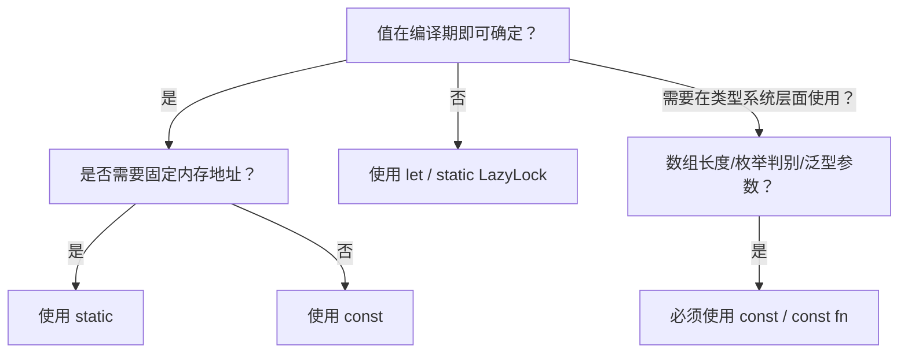

> **内容分级**: [基础级]
> **Rust 版本**: 1.96.1+ (Edition 2024)
> **本节关键术语**: 常量项（Const Item） · 常量函数（Const Function / const fn） · 常量上下文（Const Context） · 常量泛型（Const Generic） · 编译期执行（Compile-Time Execution）

# 常量项与常量函数（Const Items and Const Functions）
>
> **EN**: Const Items and Const Functions
> **Summary**: `const` items and `const fn` enable values and computations to be evaluated at compile time, allowing zero-cost abstractions where complex logic is resolved before runtime.
>
> **受众**: [初学者]
> **层级**: L1 基础概念
> **Bloom 层级**: 理解 → 应用
> **A/S/P 标记**: **S** — Structure
> **双维定位**: C×App
> **前置概念**: [Type System Basics](../02_type_system/04_type_system.md) · [Functions and Control Flow](../04_control_flow/07_control_flow.md)
> **后置概念**: [Generics](../../02_intermediate/01_generics/02_generics.md) · [Constant Evaluation](../../04_formal/03_operational_semantics/39_constant_evaluation.md) · [Unsafe Rust](../../03_advanced/02_unsafe/03_unsafe.md)
>
> **主要来源**: [The Rust Reference — Constant Items](https://doc.rust-lang.org/reference/items/constant-items.html) ·
> [The Rust Reference — Const Functions](https://doc.rust-lang.org/reference/const_eval.html#const-functions) ·
> [The Rust Programming Language — Constants](https://doc.rust-lang.org/book/ch03-01-variables-and-mutability.html) ·
> [Rust By Example — Constants](https://doc.rust-lang.org/rust-by-example/custom_types/constants.html)
>
> **Rust 版本**: 1.96.1+ (Edition 2024)

---

> **Bloom 层级**: 理解 → 应用
> **变更日志**:
>
> - v1.0 (2026-07-04): 初始创建

## 📑 目录

---

> **过渡**: 从 常量项与 const fn 的直观描述转向其形式化定义，需要先把日常经验中的模糊直觉转化为可验证的术语与规则。
> **过渡**: 在建立 常量项与 const fn 的核心命题之后，下一步是审视这些命题在边界条件下的稳定性——这正是反命题与反例的价值所在。
> **过渡**: 最后，将 常量项与 const fn 与相邻概念连接，形成从 L1 到 L7 的纵向认知路径，避免孤立记忆。

---

- [常量项与常量函数（Const Items and Const Functions）](#常量项与常量函数const-items-and-const-functions)
  - [📑 目录](#-目录)
  - [一、权威定义（Definition）](#一权威定义definition)
    - [1.1 形式化定义](#11-形式化定义)
    - [1.2 直觉解释](#12-直觉解释)
  - [二、概念属性矩阵](#二概念属性矩阵)
  - [三、技术细节与示例](#三技术细节与示例)
    - [3.1 常量项](#31-常量项)
    - [3.2 常量函数](#32-常量函数)
    - [3.3 常量上下文](#33-常量上下文)
    - [3.4 `const fn` 的限制](#34-const-fn-的限制)
  - [四、示例与反例](#四示例与反例)
    - [4.1 正确示例：编译期配置计算](#41-正确示例编译期配置计算)
    - [4.2 反例：在 `const fn` 中分配堆内存](#42-反例在-const-fn-中分配堆内存)
    - [4.3 反例：试图修改 `const`](#43-反例试图修改-const)
  - [五、反命题与边界分析](#五反命题与边界分析)
    - [5.1 反命题树](#51-反命题树)
    - [5.2 边界极限](#52-边界极限)
  - [六、边界测试](#六边界测试)
    - [6.1 边界测试：常量泛型](#61-边界测试常量泛型)
    - [6.2 边界测试：`const fn` 中使用 `if`/`match`](#62-边界测试const-fn-中使用-ifmatch)
  - [七、判断推理与决策树](#七判断推理与决策树)
    - [7.1 何时使用 `const` / `const fn`？](#71-何时使用-const--const-fn)
    - [7.2 与其他概念的辨析](#72-与其他概念的辨析)
  - [八、逆向推理链（Backward Reasoning）](#八逆向推理链backward-reasoning)
  - [九、来源与延伸阅读](#九来源与延伸阅读)
  - [嵌入式测验（Embedded Quiz）](#嵌入式测验embedded-quiz)
    - [测验 1：`const` vs `static`](#测验-1const-vs-static)
    - [测验 2：`const fn` 的限制](#测验-2const-fn-的限制)
  - [认知路径](#认知路径)

---

## 一、权威定义（Definition）

> **常量项（Const Item）** 是使用 `const` 关键字声明的、值在编译期确定的命名常量。
> **常量函数（Const Function / `const fn`）** 是在 `const` 上下文中可以被调用的函数，其执行可在编译期完成。
>
> [来源: [The Rust Reference — Constant Items](https://doc.rust-lang.org/reference/items/constant-items.html)]

### 1.1 形式化定义

```text
const IDENTIFIER: Type = expr;
const fn function_name(args) -> ReturnType { body }
```

- `const` 项的值必须是 **const-evaluable**（可在编译期求值）。
- `const fn` 可在 `const` 上下文（如 `const` 项、数组长度、枚举（Enum）判别值）中调用。
- `const fn` 也可以在运行时（Runtime）被调用。

### 1.2 直觉解释

常量机制让编译器在程序运行前完成尽可能多的计算。就像烘焙前先把配方算好，而不是每次顾客点餐时才计算配料比例。这样运行时（Runtime）既快又无额外开销。

> [💡 原创分析](../../00_meta/00_framework/methodology.md)

---

## 二、概念属性矩阵

| 属性 | 说明 | Rust 表达 | 权威来源 |
|:---|:---|:---|:---|
| 求值时机 | 编译期 | `const X: i32 = 1 + 2;` | Reference |
| 内存行为 | 内联展开，无固定地址 | `const` 每次使用等价于字面量 | Reference |
| 可变性 | 永远不可变 | 无 `const mut` | Reference |
| 作用域 | 遵循项作用域 | 模块（Module）级或局部 | Reference |
| 函数常量性 | `const fn` 可在 const 上下文调用 | `const fn add(a: i32, b: i32) -> i32 { a + b }` | Reference |
| 限制 | 不能使用堆分配、I/O、随机数等运行时操作 | `const fn` 体受限 | Reference |

---

## 三、技术细节与示例

### 3.1 常量项

```rust
const PI: f64 = 3.141592653589793;
const MAX_USERS: usize = 1000;
const GREETING: &str = "Hello";

fn main() {
    println!("{}", PI);
    println!("max users: {}", MAX_USERS);
    println!("{}", GREETING);
}
```

> **关键洞察**: `const` 项会在每次使用时内联展开，因此不占用运行时内存，也没有固定地址。
> [来源: [TRPL — Constants](https://doc.rust-lang.org/book/ch03-01-variables-and-mutability.html)]

### 3.2 常量函数

```rust
const fn square(n: i32) -> i32 {
    n * n
}

const SQUARE_OF_FIVE: i32 = square(5);

fn main() {
    println!("{}", SQUARE_OF_FIVE); // 25，编译期计算
    println!("{}", square(10));      // 100，运行时调用也合法
}
```

> **关键洞察**: `const fn` 既可以在 `const` 上下文中编译期执行，也可以在运行时作为普通函数调用。
> [来源: [The Rust Reference — Const Functions](https://doc.rust-lang.org/reference/const_eval.html#const-functions)]

### 3.3 常量上下文

常量上下文包括：

- `const` 项的初始化器
- `static` 项的初始化器
- 数组长度表达式
- 枚举（Enum）判别式
- 常量泛型参数

```rust
const fn factorial(n: u64) -> u64 {
    let mut result = 1;
    let mut i = 1;
    while i <= n {
        result *= i;
        i += 1;
    }
    result
}

const ARR_SIZE: usize = factorial(5) as usize;

fn main() {
    let arr = [0; ARR_SIZE]; // ARR_SIZE = 120
    println!("array length: {}", arr.len());
}
```

### 3.4 `const fn` 的限制

在 Rust 1.96.1 中，`const fn` 不能：

- 分配堆内存（`Box::new`、`Vec::new` 等）
- 执行 I/O
- 调用非 `const fn`
- 使用 `unsafe` 块（部分 unstable 特性除外）
- 使用 `for` 循环（稳定版需用 `while`/`loop`）

> [来源: [The Rust Reference — Const Eval](https://doc.rust-lang.org/reference/const_eval.html)]

---

## 四、示例与反例

### 4.1 正确示例：编译期配置计算

```rust
const fn bytes_to_kibibytes(bytes: u64) -> u64 {
    bytes / 1024
}

const BUFFER_SIZE_BYTES: u64 = 4096;
const BUFFER_SIZE_KIB: u64 = bytes_to_kibibytes(BUFFER_SIZE_BYTES);

fn main() {
    println!("buffer: {} KiB", BUFFER_SIZE_KIB);
}
```

### 4.2 反例：在 `const fn` 中分配堆内存

```rust,compile_fail
const fn make_vec() -> Vec<i32> {
    vec![1, 2, 3] // 错误：Vec 分配堆内存，不能在 const fn 中使用
}

fn main() {}
```

> **错误诊断**: `error[E0015]: cannot call non-const fn ... in constant functions`
> **修正**: 在 `const` 上下文中使用固定大小的数组或切片（Slice）；若需堆分配，使用运行时函数。
> [来源: [The Rust Reference — Const Eval](https://doc.rust-lang.org/reference/const_eval.html)]

### 4.3 反例：试图修改 `const`

```rust,compile_fail
const X: i32 = 10;

fn main() {
    X = 20; // 错误：const 不可变
}
```

> **错误诊断**: `error[E0070]: invalid left-hand side of assignment`
> **修正**: 若需要可变状态，使用 `let mut` 局部变量或 `static mut` / `Mutex`。
> [来源: [TRPL — Constants](https://doc.rust-lang.org/book/ch03-01-variables-and-mutability.html)]

---

## 五、反命题与边界分析

### 5.1 反命题树

> **反命题 1**: "`const` 和 `let` 一样" ⟹ 不成立。`const` 是编译期常量，无运行时地址；`let` 是运行时局部绑定。
> **反命题 2**: "`const fn` 只能在编译期调用" ⟹ 不成立。`const fn` 也可以在运行时调用。
> **反命题 3**: "`const fn` 可以使用任何 Rust 特性" ⟹ 不成立。`const fn` 受 const eval 限制，不能堆分配、I/O、调用非 const fn 等。
> **反命题 4**: "常量项有固定内存地址" ⟹ 不成立。`const` 会被内联；需要固定地址应使用 `static`。

### 5.2 边界极限

| 边界 | 现状 | 理论极限 | 工程意义 |
|:---|:---|:---|:---|
| 可计算性 | const eval 子集 | 任意可判定计算 | 随 Rust 版本逐步扩展 |
| 堆分配 | 不允许 | 未来可能支持 | 当前用数组/切片（Slice）替代 |
| 泛型 | 支持 | 常量泛型已稳定 | `const N: usize` |
|  trait 方法 | 部分支持 | 逐步开放 | `~const Trait` 仍在演进 |

---

## 六、边界测试

### 6.1 边界测试：常量泛型

```rust
struct Array<T, const N: usize> {
    data: [T; N],
}

impl<T: Default + Copy, const N: usize> Array<T, N> {
    fn new() -> Self {
        Self { data: [T::default(); N] }
    }
}

fn main() {
    let arr = Array::<i32, 5>::new();
    println!("len: {}", arr.data.len());
}
```

### 6.2 边界测试：`const fn` 中使用 `if`/`match`

```rust
const fn abs(n: i32) -> i32 {
    if n < 0 { -n } else { n }
}

const fn describe(n: i32) -> &'static str {
    match n {
        0 => "zero",
        1..=10 => "small",
        _ => "large",
    }
}

fn main() {
    println!("{}", abs(-42));
    println!("{}", describe(5));
}
```

> **关键洞察**: 控制流（`if`、`match`、`while`、`loop`）在 stable `const fn` 中可用，但 `for` 循环稳定版暂不支持。
> [来源: [The Rust Reference — Const Functions](https://doc.rust-lang.org/reference/const_eval.html#const-functions)]

---

## 七、判断推理与决策树

### 7.1 何时使用 `const` / `const fn`？



### 7.2 与其他概念的辨析

| 场景 | 推荐选择 | 不推荐 | 理由 |
|:---|:---|:---|:---|
| 编译期数学常量 | `const` | `static` | `const` 内联无内存开销 |
| 函数可在数组长度中使用 | `const fn` | 普通 `fn` | 只有 `const fn` 可在 const 上下文调用 |
| 运行时动态计算 | 普通 `fn` | `const fn` | `const fn` 限制更多 |
| 全局可变状态 | `static` + `Mutex` | `const` | `const` 不可变且无固定地址 |

---

## 八、逆向推理链（Backward Reasoning）

> **从编译错误/运行时症状反推定理链**:
>
> ```text
> error[E0015] 调用非 const fn ⟸ 在 const fn/const 项中使用了不允许的操作 ⟸ 替换为 const 操作或改为运行时函数
> error[E0080] 常量求值失败 ⟸ const 项包含 panic/UB ⟸ 检查 const fn 的边界条件
> 运行时 unexpectedly slow ⟸ 大量计算放在运行时而非编译期 ⟸ 提取为 const fn
> ```
>
> **诊断映射**:
>
> - `error[E0015]: cannot call non-const fn ... in constant functions` → 在 `const fn` 或 `const` 项中调用了非 const 函数。
> - `error[E0080]: evaluation of constant value failed` → const 求值过程中发生 panic 或 UB。
> - `error[E0070]: invalid left-hand side of assignment` → 试图给 `const` 赋值。

---

## 九、来源与延伸阅读

- [Rust 核心术语英中对照表](../../00_meta/01_terminology/terminology_glossary.md)
- [The Rust Reference — Constant Items](https://doc.rust-lang.org/reference/items/constant-items.html)
- [The Rust Reference — Const Functions](https://doc.rust-lang.org/reference/const_eval.html#const-functions)
- [The Rust Reference — Const Evaluation](https://doc.rust-lang.org/reference/const_eval.html)
- [The Rust Programming Language — Constants](https://doc.rust-lang.org/book/ch03-01-variables-and-mutability.html)
- [Rust By Example — Constants](https://doc.rust-lang.org/rust-by-example/custom_types/constants.html)

---

## 嵌入式测验（Embedded Quiz）

### 测验 1：`const` vs `static`

**题目**: 以下哪种情况必须使用 `const` 而不是 `static`？

A. 需要一个全局可变计数器
B. 需要数组长度表达式
C. 需要一个有固定内存地址的全局字符串
D. 需要在运行时被多个线程共享

<details>
<summary>✅ 答案与解析</summary>

**答案**: B

**解析**: 数组长度表达式必须在编译期求值，因此必须使用 `const`（或 `const fn` 的结果）。`static` 有固定地址但值在运行期存在；`static mut` 可变但不安全；多线程共享通常用 `static` + `Mutex`。

</details>

### 测验 2：`const fn` 的限制

**题目**: 在 Rust 1.96 的稳定版中，`const fn` 不能做什么？

A. 使用 `if`/`match` 控制流
B. 调用其他 `const fn`
C. 分配 `Vec` 或 `Box`
D. 返回基本类型如 `i32`

<details>
<summary>✅ 答案与解析</summary>

**答案**: C

**解析**: `const fn` 不能进行堆分配（如 `Vec`、`Box`）。`if`/`match`、`while`、`loop`、调用其他 `const fn`、返回基本类型都是允许的。

</details>

---

## 认知路径

> **认知路径**: 本节从“在编译期完成计算”的需求出发，建立 `const` 项和 `const fn` 的概念，区分其与 `static`、`let`、普通 `fn` 的边界，最终形成在类型系统（Type System）、性能和代码清晰度之间做出选择的能力。
>
> 1. **问题识别**: 某些值或计算应在编译期确定，以提升运行时性能和类型表达能力。
> 2. **概念建立**: `const` 提供编译期常量，`const fn` 提供编译期可执行函数。
> 3. **机制推理**: const 上下文限制可用操作，保证求值在编译期完成。
> 4. **边界辨析**: `const` vs `static` vs `let`，`const fn` vs 普通 `fn`。
> 5. **迁移应用**: 在数组长度、枚举判别、配置计算、常量泛型等场景中使用 const 能力。

---

> **权威来源**: [The Rust Reference](https://doc.rust-lang.org/reference/introduction.html), [The Rust Programming Language](https://doc.rust-lang.org/book/title-page.html), [Rust By Example](https://doc.rust-lang.org/rust-by-example/index.html)
> **权威来源对齐变更日志**: 2026-07-04 创建 [Rust 1.96.1 Reference 与 TRPL 对齐](https://doc.rust-lang.org/reference/introduction.html)
> **状态**: ✅ 权威来源对齐完成
