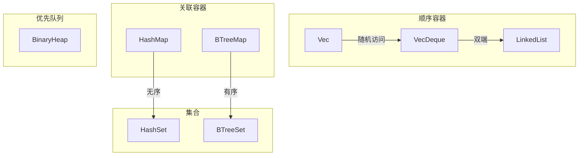
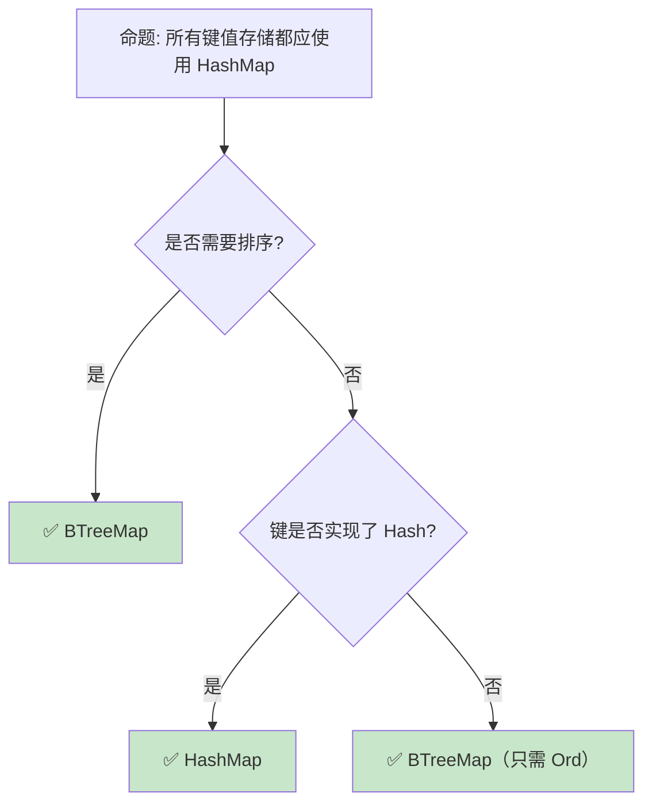

# 集合类型：Rust 标准库的数据结构谱系

> **Bloom 层级**: 应用 → 分析
> **定位**: 系统分析 Rust **标准库集合类型**的设计——从 Vec/VecDeque 的顺序容器，到 HashMap/BTreeMap 的关联容器，再到 HashSet/BTreeSet 的集合类型，揭示每种数据结构的所有权语义、性能特征和选型策略。
> **前置概念**: [Ownership](./01_ownership.md) · [Borrowing](./02_borrowing.md) · [Generics](../02_intermediate/02_generics.md)
> **后置概念**: [Smart Pointers](../02_intermediate/12_smart_pointers.md) · [Smart Pointers](../02_intermediate/12_smart_pointers.md)

---

> **来源**: [std::collections](https://doc.rust-lang.org/std/collections/index.html) · [TRPL Ch8 — Collections](https://doc.rust-lang.org/book/ch08-00-common-collections.html) · [Rust Algorithm Book](https://doc.rust-lang.org/std/collections/) · [Wikipedia — Hash Table](https://en.wikipedia.org/wiki/Hash_table) · [Wikipedia — B-tree](https://en.wikipedia.org/wiki/B-tree)

## 📑 目录
>
> [来源: [Rust Reference](https://doc.rust-lang.org/reference/)]
>
> [来源: [TRPL](https://doc.rust-lang.org/book/)]

- [集合类型：Rust 标准库的数据结构谱系](#集合类型rust-标准库的数据结构谱系)
  - [📑 目录](#-目录)
  - [一、核心概念](#一核心概念)
    - [1.1 集合类型谱系](#11-集合类型谱系)
    - [1.2 Vec：动态数组](#12-vec动态数组)
    - [1.3 HashMap vs BTreeMap](#13-hashmap-vs-btreemap)
  - [二、技术细节](#二技术细节)
    - [2.1 容量管理与重新分配](#21-容量管理与重新分配)
    - [2.2 Entry API](#22-entry-api)
    - [2.3 Drain 与保留模式](#23-drain-与保留模式)
  - [三、选型决策矩阵](#三选型决策矩阵)
  - [四、反命题与边界分析](#四反命题与边界分析)
    - [4.1 反命题树](#41-反命题树)
    - [4.2 边界极限](#42-边界极限)
  - [五、常见陷阱](#五常见陷阱)
  - [六、来源与延伸阅读](#六来源与延伸阅读)
  - [相关概念文件](#相关概念文件)

---

## 一、核心概念
>
> [来源: [Rust Reference](https://doc.rust-lang.org/reference/)]
>
> [来源: [Rust Reference](https://doc.rust-lang.org/reference/)]

### 1.1 集合类型谱系



> **认知功能**: 此图展示 Rust 标准库集合的**分类谱系**。每种集合类型针对特定的访问模式和排序需求设计。
> [来源: [TRPL](https://doc.rust-lang.org/book/)]
> **使用建议**: 默认使用 Vec 和 HashMap；需要排序时使用 BTreeMap；需要双端操作时使用 VecDeque。
> **关键洞察**: Rust 的集合类型与 C++ STL 对应，但**所有权语义更严格**——插入操作是 move，访问需要借用。
> [来源: [std::collections](https://doc.rust-lang.org/std/collections/index.html)]

---

### 1.2 Vec：动态数组

```text
Vec<T> 的设计:

  内存布局:
  ├── ptr: 指向堆分配的缓冲区
  ├── len: 当前元素数量
  └── capacity: 缓冲区总容量

  增长策略:
  ├── 容量不足时重新分配
  ├── 通常翻倍增长（amortized O(1) push）
  └── 可通过 with_capacity 预分配

  所有权语义:
  ├── push: 移动值到 Vec
  ├── pop: 移出最后一个值
  ├── get: 借用引用
  └── remove: 移出指定位置值（O(n)）

  与 slice 的关系:
  ├── Vec<T> 可以解引用为 &[T] 或 &mut [T]
  ├── slice 是"胖指针"（ptr + len）
  └── Vec 拥有内存，slice 只是借用视图
```

> **Vec 洞察**: Vec 是 Rust 的**默认顺序容器**——它与 slice 的紧密集成（Deref to [T]）使其成为标准库中最通用的集合类型。
> [来源: [std::vec::Vec](https://doc.rust-lang.org/std/vec/struct.Vec.html)]

---

### 1.3 HashMap vs BTreeMap

```text
HashMap<K, V>:
├── 基于 Robin Hood 哈希（Rust 实现）
├── 平均 O(1) 查找/插入/删除
├── 无序遍历
├── K: Eq + Hash
└── 适用: 大多数键值存储场景

BTreeMap<K, V>:
├── 基于 B-Tree（B=6）
├── O(log n) 查找/插入/删除
├── 按键排序遍历
├── K: Ord
└── 适用: 需要范围查询、有序遍历

性能对比:
┌─────────────────┬─────────────────┬─────────────────┐
│ 操作            │ HashMap         │ BTreeMap        │
├─────────────────┼─────────────────┼─────────────────┤
│ 查找            │ O(1) 平均       │ O(log n)        │
│ 插入            │ O(1) 平均       │ O(log n)        │
│ 范围查询        │ 不支持          │ O(log n + k)    │
│ 内存局部性      │ 较差            │ 较好            │
│ 最小/最大键     │ O(n)            │ O(log n)        │
│ 内存开销        │ 较高            │ 较低            │
└─────────────────┴─────────────────┴─────────────────┘
```

> **Map 洞察**: HashMap 是**默认选择**——除非需要排序或范围查询，否则它的 O(1) 操作更优。BTreeMap 的内存局部性更好，在某些场景下实际性能可能超越 HashMap。
> [来源: [std::collections::HashMap](https://doc.rust-lang.org/std/collections/struct.HashMap.html)] · [来源: [std::collections::BTreeMap](https://doc.rust-lang.org/std/collections/struct.BTreeMap.html)]

---

## 二、技术细节
>
> [来源: [Rust Reference](https://doc.rust-lang.org/reference/)]
>
> [来源: [TRPL](https://doc.rust-lang.org/book/)]

### 2.1 容量管理与重新分配

```rust,ignore
// Vec 的容量管理

let mut vec = Vec::new();
vec.push(1);  // capacity = 4（首次分配）
vec.push(2);
vec.push(3);
vec.push(4);
vec.push(5);  // capacity 不足，重新分配（通常翻倍）

// 预分配避免重新分配
let mut vec = Vec::with_capacity(1000);
for i in 0..1000 {
    vec.push(i);  // 无重新分配
}

// shrink_to_fit: 释放多余容量
vec.shrink_to_fit();

// reserve: 预留额外容量
vec.reserve(100);

// into_boxed_slice: 转换为精确容量的 Box<[T]>
let boxed: Box<[i32]> = vec.into_boxed_slice();
```

> **容量管理**: 预分配（`with_capacity`）是性能优化的**基础技巧**——避免多次重新分配的开销。
> [来源: [Vec Methods](https://doc.rust-lang.org/std/vec/struct.Vec.html)]

---

### 2.2 Entry API

```rust,ignore
use std::collections::HashMap;

let mut map = HashMap::new();

// 传统方式（低效）
if !map.contains_key("key") {
    map.insert("key", 0);
}
*map.get_mut("key").unwrap() += 1;

// Entry API（高效，只查找一次）
*map.entry("key").or_insert(0) += 1;

// Entry 的其他用法
map.entry("key").or_insert_with(|| expensive_computation());
map.entry("key").and_modify(|v| *v += 1).or_insert(0);

// 避免不必要的分配
// or_insert: 总是构造值（即使不需要）
// or_insert_with: 惰性构造
```

> **Entry API 洞察**: Entry API 是 HashMap 的**杀手级特性**——它将"检查-插入-修改"的复合操作优化为单次哈希查找。
> [来源: [HashMap::entry](https://doc.rust-lang.org/std/collections/hash_map/enum.Entry.html)]

---

### 2.3 Drain 与保留模式

```rust,ignore
// drain: 移除并迭代范围内的元素
let mut vec = vec![1, 2, 3, 4, 5];
for x in vec.drain(2..) {
    println!("{}", x);  // 3, 4, 5
}
// vec == [1, 2]

// retain: 保留满足条件的元素（原地过滤）
let mut vec = vec![1, 2, 3, 4, 5];
vec.retain(|&x| x % 2 == 0);
// vec == [2, 4]

// HashMap 的 retain
let mut map = HashMap::new();
map.insert("a", 1);
map.insert("b", 2);
map.retain(|k, v| *v > 1);
// map == {"b": 2}
```

> **Drain/Retain 洞察**: `drain` 和 `retain` 提供了**高效的条件移除**——避免手动迭代和移除的复杂度。
> [来源: [Vec::retain](https://doc.rust-lang.org/std/vec/struct.Vec.html#method.retain)]

---

## 三、选型决策矩阵
>
> [来源: [Rust Reference](https://doc.rust-lang.org/reference/)]
>
> [来源: [TRPL](https://doc.rust-lang.org/book/)]

```text
场景 → 推荐集合 → 关键理由

默认顺序存储:
  → Vec<T>
  → 随机访问、尾部追加高效

双端队列:
  → VecDeque<T>
  → 头尾插入/删除 O(1)

键值查找:
  → HashMap<K, V>
  → O(1) 平均查找

有序键值:
  → BTreeMap<K, V>
  → 排序、范围查询

去重集合:
  → HashSet<T>
  → O(1) 成员检查

有序去重:
  → BTreeSet<T>
  → 排序、范围操作

优先队列:
  → BinaryHeap<T>
  → O(1) 最大值，O(log n) 插入

大量中间插入/删除:
  → LinkedList<T>
  → O(1) 插入/删除（但缓存不友好）
  → 注意: 实际中 Vec 往往更快
```

> **选型原则**: 默认使用 Vec/HashMap，只有在测量证实需要其他集合时才切换。
> [来源: [Rust Collections Performance](https://doc.rust-lang.org/std/collections/index.html#sequences)]

---

## 四、反命题与边界分析
>
> [来源: [Rust Reference](https://doc.rust-lang.org/reference/)]
>
> [来源: [Rust Reference](https://doc.rust-lang.org/reference/)]

### 4.1 反命题树



> **认知功能**: 此决策树展示 Map 类型的**选型逻辑**。核心判断是**是否需要排序**和**键类型实现了哪些 Trait**。
> [来源: [Rust API Guidelines](https://rust-lang.github.io/api-guidelines/)]

---

### 4.2 边界极限

```text
边界 1: HashMap 的哈希质量
├── 默认 SipHash 1-3（防 HashDoS）
├── 非加密安全，但抵抗碰撞攻击
├── 如果不需要安全性，可用 fxhash/ahash 加速
└── 自定义类型需要实现 Hash

边界 2: BTreeMap 的 B 值固定
├── Rust BTreeMap B=6（每个节点最多 11 个元素）
├── 不可配置，针对通用场景优化
├── 特定场景可能需要自定义 B-Tree
└── 或使用第三方 crate（如 sled）

边界 3: Vec 的连续内存要求
├── 需要大块连续内存
├── 超大 Vec 可能分配失败
├── 碎片化内存环境下性能下降
└── 缓解: VecDeque 或自定义分块结构

边界 4: 自定义分配器
├── 标准库集合使用全局分配器
├── nightly 支持自定义 Allocator API
├── stable 需要包装或使用第三方 crate
└── 嵌入式/特殊场景需要关注

边界 5: 迭代器失效
├── Vec 重新分配后，所有引用和迭代器失效
├── HashMap 重新哈希后，所有引用失效
├── BTreeMap 结构变化后，部分引用可能失效
└── Rust 借用检查器防止了 C++ 式的 use-after-free
```

> **边界要点**: 集合类型的边界主要与**哈希质量**、**B-Tree 参数**、**内存连续性**、**分配器**和**迭代器失效**相关。
> [来源: [Rustonomicon — Collections](https://doc.rust-lang.org/nomicon/)]

---

## 五、常见陷阱
>
> [来源: [Rust Reference](https://doc.rust-lang.org/reference/)]

```text
陷阱 1: 在迭代时修改集合
  ❌ for item in &vec {
       vec.push(*item);  // 编译错误！
     }

  ✅ for item in vec.clone() { ... }
     // 或: 先收集再处理

陷阱 2: HashMap 的自定义键忘记实现 Hash/Eq
  ❌ struct Point { x: i32, y: i32 }
     let mut map = HashMap::new();
     map.insert(Point { x: 0, y: 0 }, "origin");
     // 编译错误: Point 没有实现 Hash

  ✅ #[derive(Hash, Eq, PartialEq)]
     struct Point { x: i32, y: i32 }

陷阱 3: 使用 Vec::remove 删除多个元素
  ❌ for i in 0..vec.len() {
       if should_remove(&vec[i]) {
         vec.remove(i);  // O(n) 且索引错位！
       }
     }

  ✅ vec.retain(|item| !should_remove(item));
     // 或: 倒序删除

陷阱 4: 忽略 HashMap 的容量预分配
  ❌ let mut map = HashMap::new();
     for i in 0..10000 {
       map.insert(i, i);  // 多次重新分配
     }

  ✅ let mut map = HashMap::with_capacity(10000);

陷阱 5: 误用 LinkedList
  ❌ 认为 LinkedList 总是比 Vec 快
     // 实际上 Vec 在大多数场景更快（缓存友好）

  ✅ 只在真正需要 O(1) 中间插入/删除时使用 LinkedList
```

> **陷阱总结**: 集合类型的陷阱主要与**迭代修改**、**Trait 实现**、**删除模式**、**容量管理**和**性能假设**相关。
> [来源: [Rust Performance Book — Collections](https://nnethercote.github.io/perf-book/collections.html)]

---

## 六、来源与延伸阅读
>
> [来源: [Rust Reference](https://doc.rust-lang.org/reference/)]

| 来源 | 可信度 | 说明 |
|:---|:---:|:---|
| [std::collections](https://doc.rust-lang.org/std/collections/index.html) | ✅ 一级 | 标准库集合文档 |
| [TRPL Ch8 — Collections](https://doc.rust-lang.org/book/ch08-00-common-collections.html) | ✅ 一级 | 集合入门 |
| [Rust Performance Book](https://nnethercote.github.io/perf-book/collections.html) | ✅ 二级 | 集合性能 |
| [Wikipedia — Hash Table](https://en.wikipedia.org/wiki/Hash_table) | ✅ 三级 | 哈希表理论 |
| [Wikipedia — B-tree](https://en.wikipedia.org/wiki/B-tree) | ✅ 三级 | B-Tree 理论 |

---

## 相关概念文件
>
> [来源: [Rust Reference](https://doc.rust-lang.org/reference/)]
>
> [来源: [Rust Reference](https://doc.rust-lang.org/reference/)]

- [Ownership](./01_ownership.md) — 所有权模型
- [Borrowing](./02_borrowing.md) — 借用规则
- [Generics](../02_intermediate/02_generics.md) — 泛型系统
- [Smart Pointers](../02_intermediate/12_smart_pointers.md) — 智能指针

---

> **权威来源**: [Rust Reference](https://doc.rust-lang.org/reference/), [The Rust Programming Language](https://doc.rust-lang.org/book/)
>
> **权威来源对齐变更日志**: 2026-05-22 创建 [来源: Authority Source Sprint Batch 9]

**文档版本**: 1.0
**对应 Rust 版本**: 1.96.0+ (Edition 2024)
**最后更新**: 2026-05-22
**状态**: ✅ 概念文件创建完成
