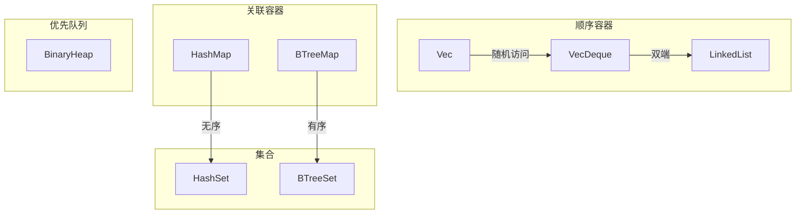
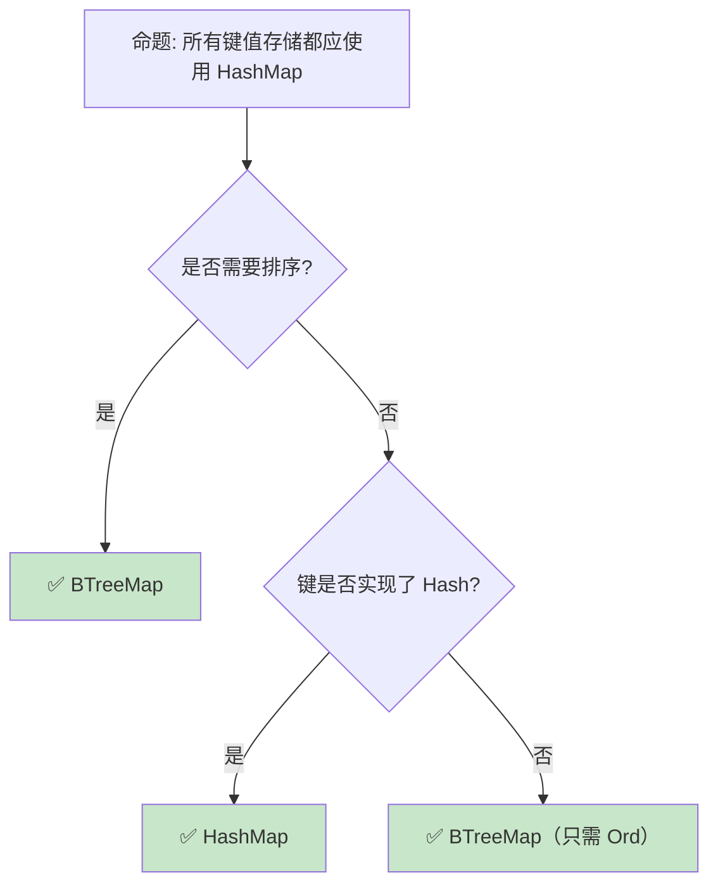

> **内容分级**: [综述级]
>
> **Rust 版本**: 1.96.0+ (Edition 2024)
>
> **本节关键术语**: 集合 (Collection) · 向量 (Vec) · 哈希映射 (HashMap) · 哈希集合 (HashSet) · 二叉堆 (BinaryHeap) — [完整对照表](../00_meta/terminology_glossary.md)

# 集合类型：Rust 标准库的数据结构谱系
>
> **EN**: Collections
> **Summary**: Collections: core Rust concepts, syntax, and examples.
> **📎 交叉引用（Reference）**
>
> 本主题在 knowledge 中有系统化的知识索引：[集合](../../knowledge/02_intermediate/01_collections.md)
> **受众**: [初学者]
> **Bloom 层级**: 应用 → 分析
> **A/S/P 标记**: **A** — Application
> **双维定位**: F×App — 标准集合 API 的应用
> **定位**: 系统分析 Rust **标准库集合类型**的设计——从 Vec/VecDeque 的顺序容器，到 HashMap/BTreeMap 的关联容器，再到 HashSet/BTreeSet 的集合类型，揭示每种数据结构的所有权（Ownership）语义、性能特征和选型策略。
> **前置概念**: [Ownership](01_ownership.md) ·
> [Borrowing](02_borrowing.md) ·
> [Generics](../02_intermediate/02_generics.md)
> **后置概念**: [Smart Pointers](../02_intermediate/12_smart_pointers.md) ·
> [Smart Pointers](../02_intermediate/12_smart_pointers.md)

---

> **来源**: [std::collections](https://doc.rust-lang.org/std/collections/index.html) ·
> [TRPL Ch8 — Collections](https://doc.rust-lang.org/book/ch08-00-common-collections.html) ·
> [Rust Algorithm Book](https://doc.rust-lang.org/std/collections/) ·
> [Wikipedia — Hash Table](https://en.wikipedia.org/wiki/Hash_table) ·
> [Wikipedia — B-tree](https://en.wikipedia.org/wiki/B-tree)

## 📑 目录

- [集合类型：Rust 标准库的数据结构谱系](#集合类型rust-标准库的数据结构谱系)
  - [📑 目录](#-目录)
  - [一、核心概念](#一核心概念)
    - [1.1 集合类型谱系](#11-集合类型谱系)
    - [1.2 Vec：动态数组](#12-vec动态数组)
    - [1.3 HashMap vs BTreeMap](#13-hashmap-vs-btreemap)
  - [二、技术细节](#二技术细节)
    - [2.1 容量管理与重新分配](#21-容量管理与重新分配)
    - [2.2 Entry API](#22-entry-api)
    - [2.3 Drain 与保留模式](#23-drain-与保留模式)
    - [2.4 `FromIterator`/`Extend` for Tuples (Rust 1.85+)](#24-fromiteratorextend-for-tuples-rust-185)
  - [三、选型决策矩阵](#三选型决策矩阵)
  - [四、反命题与边界分析](#四反命题与边界分析)
    - [4.1 反命题树](#41-反命题树)
    - [4.2 边界极限](#42-边界极限)
  - [五、常见陷阱](#五常见陷阱)
  - [六、来源与延伸阅读](#六来源与延伸阅读)
  - [相关概念文件](#相关概念文件)
  - [权威来源索引](#权威来源索引)
  - [十四、边界测试：集合的编译错误](#十四边界测试集合的编译错误)
    - [14.1 边界测试：`HashMap` 键未实现 `Hash` + `Eq`（编译错误）](#141-边界测试hashmap-键未实现-hash--eq编译错误)
    - [14.2 边界测试：迭代器消费后重复使用（编译错误）](#142-边界测试迭代器消费后重复使用编译错误)
    - [10.3 边界测试：`Vec::drain` 的范围越界（运行时 panic）](#103-边界测试vecdrain-的范围越界运行时-panic)
    - [10.4 边界测试：`HashMap` 的自定义哈希器与 `BuildHasherDefault`（编译错误）](#104-边界测试hashmap-的自定义哈希器与-buildhasherdefault编译错误)
    - [10.3 边界测试：`Vec::drain` 后继续使用原 Vec（编译错误）](#103-边界测试vecdrain-后继续使用原-vec编译错误)
    - [10.4 边界测试：不可变借用与可变借用的冲突](#104-边界测试不可变借用与可变借用的冲突)
  - [实践](#实践)
  - [参考来源](#参考来源)
  - [认知路径](#认知路径)
    - [核心推理链](#核心推理链)
    - [反命题与边界](#反命题与边界)
  - [嵌入式测验（Embedded Quiz）](#嵌入式测验embedded-quiz)
    - [测验 1：Vec 与容量（理解层）](#测验-1vec-与容量理解层)
    - [测验 2：HashMap 所有权（应用层）](#测验-2hashmap-所有权应用层)
    - [测验 3：迭代器与借用（分析层）](#测验-3迭代器与借用分析层)
    - [测验 4：BTreeMap vs HashMap（评价层）](#测验-4btreemap-vs-hashmap评价层)
    - [测验 5： draining 与内存（应用层）](#测验-5-draining-与内存应用层)
  - [十二、延伸阅读与自测](#十二延伸阅读与自测)

---

## 一、核心概念
>

### 1.1 集合类型谱系
>



> **认知功能**: 此图展示 Rust 标准库集合的**分类谱系**。每种集合类型针对特定的访问模式和排序需求设计。
> [来源: [TRPL](https://doc.rust-lang.org/book/ch08-00-common-collections.html)]
> **使用建议**: 默认使用 Vec 和 HashMap；需要排序时使用 BTreeMap；需要双端操作时使用 VecDeque。
> **关键洞察**: Rust 的集合类型与 C++ STL 对应，但**所有权（Ownership）语义更严格**——插入操作是 move，访问需要借用（Borrowing）。
> [来源: [std::collections](https://doc.rust-lang.org/std/collections/index.html)]

---

### 1.2 Vec：动态数组
>

```text
Vec<T> 的设计:

  内存布局:
  ├── ptr: 指向堆分配的缓冲区
  ├── len: 当前元素数量
  └── capacity: 缓冲区总容量

  增长策略:
  ├── 容量不足时重新分配
  ├── 通常翻倍增长（amortized O(1) push）
  └── 可通过 with_capacity 预分配

  所有权语义:
  ├── push: 移动值到 Vec
  ├── pop: 移出最后一个值
  ├── get: 借用引用
  └── remove: 移出指定位置值（O(n)）

  与 slice 的关系:
  ├── Vec<T> 可以解引用为 &[T] 或 &mut [T]
  ├── slice 是"胖指针"（ptr + len）
  └── Vec 拥有内存，slice 只是借用视图
```

> **Vec 洞察**: Vec 是 Rust 的**默认顺序容器**——它与 slice 的紧密集成（Deref to [T]）使其成为标准库中最通用的集合类型。
> [来源: [std::vec::Vec](https://doc.rust-lang.org/std/vec/struct.Vec.html)]

---

### 1.3 HashMap vs BTreeMap
>

```text
HashMap<K, V>:
├── 基于 Robin Hood 哈希（Rust 实现）
├── 平均 O(1) 查找/插入/删除
├── 无序遍历
├── K: Eq + Hash
└── 适用: 大多数键值存储场景

BTreeMap<K, V>:
├── 基于 B-Tree（B=6）
├── O(log n) 查找/插入/删除
├── 按键排序遍历
├── K: Ord
└── 适用: 需要范围查询、有序遍历

性能对比:
┌─────────────────┬─────────────────┬─────────────────┐
│ 操作            │ HashMap         │ BTreeMap        │
├─────────────────┼─────────────────┼─────────────────┤
│ 查找            │ O(1) 平均       │ O(log n)        │
│ 插入            │ O(1) 平均       │ O(log n)        │
│ 范围查询        │ 不支持          │ O(log n + k)    │
│ 内存局部性      │ 较差            │ 较好            │
│ 最小/最大键     │ O(n)            │ O(log n)        │
│ 内存开销        │ 较高            │ 较低            │
└─────────────────┴─────────────────┴─────────────────┘
```

> **Map 洞察**: HashMap 是**默认选择**——除非需要排序或范围查询，否则它的 O(1) 操作更优。BTreeMap 的内存局部性更好，在某些场景下实际性能可能超越 HashMap。
> [来源: [std::collections::HashMap](https://doc.rust-lang.org/std/collections/struct.HashMap.html)] · [来源: [std::collections::BTreeMap](https://doc.rust-lang.org/std/collections/struct.BTreeMap.html)]

---

## 二、技术细节

### 2.1 容量管理与重新分配

```rust
// Vec 的容量管理

let mut vec = Vec::new();
vec.push(1);  // capacity = 4（首次分配）
vec.push(2);
vec.push(3);
vec.push(4);
vec.push(5);  // capacity 不足，重新分配（通常翻倍）

// 预分配避免重新分配
let mut vec = Vec::with_capacity(1000);
for i in 0..1000 {
    vec.push(i);  // 无重新分配
}

// shrink_to_fit: 释放多余容量
vec.shrink_to_fit();

// reserve: 预留额外容量
vec.reserve(100);

// into_boxed_slice: 转换为精确容量的 Box<[T]>
let boxed: Box<[i32]> = vec.into_boxed_slice();
```

> **容量管理**: 预分配（`with_capacity`）是性能优化的**基础技巧**——避免多次重新分配的开销。
> [来源: [Vec Methods](https://doc.rust-lang.org/std/vec/struct.Vec.html)]

---

### 2.2 Entry API

```rust,ignore
use std::collections::HashMap;

let mut map = HashMap::new();

// 传统方式（低效）
if !map.contains_key("key") {
    map.insert("key", 0);
}
*map.get_mut("key").unwrap() += 1;

// Entry API（高效，只查找一次）
*map.entry("key").or_insert(0) += 1;

// Entry 的其他用法
map.entry("key").or_insert_with(|| expensive_computation());
map.entry("key").and_modify(|v| *v += 1).or_insert(0);

// 避免不必要的分配
// or_insert: 总是构造值（即使不需要）
// or_insert_with: 惰性构造
```

> **Entry API 洞察**: Entry API 是 HashMap 的**杀手级特性**——它将"检查-插入-修改"的复合操作优化为单次哈希查找。
> [来源: [HashMap::entry](https://doc.rust-lang.org/std/collections/hash_map/enum.Entry.html)]

---

### 2.3 Drain 与保留模式

```rust,ignore
// drain: 移除并迭代范围内的元素
let mut vec = vec![1, 2, 3, 4, 5];
for x in vec.drain(2..) {
    println!("{}", x);  // 3, 4, 5
}
// vec == [1, 2]

// retain: 保留满足条件的元素（原地过滤）
let mut vec = vec![1, 2, 3, 4, 5];
vec.retain(|&x| x % 2 == 0);
// vec == [2, 4]

// HashMap 的 retain
let mut map = HashMap::new();
map.insert("a", 1);
map.insert("b", 2);
map.retain(|k, v| *v > 1);
// map == {"b": 2}
```

> **Drain/Retain 洞察**: `drain` 和 `retain` 提供了**高效的条件移除**——避免手动迭代和移除的复杂度。
> [来源: [Vec::retain](https://doc.rust-lang.org/std/vec/struct.Vec.html#method.retain)]

---

### 2.4 `FromIterator`/`Extend` for Tuples (Rust 1.85+)

> **Rust 版本**: 1.85.0+ Stable · [来源: [Rust 1.85.0 Release Notes](https://blog.rust-lang.org/2025/02/20/Rust-1.85.0.html)]

Rust 1.85.0 将 `FromIterator` 和 `Extend` 支持扩展到 **1-12 元组 arity**，允许单次 `collect()` 将迭代器（Iterator） fanout 到多个集合：

```rust
use std::collections::{LinkedList, VecDeque};

// 单次 collect 拆分到三个不同类型的集合
let (squares, cubes, tesseracts): (Vec<i32>, VecDeque<i32>, LinkedList<i32>) =
    (0i32..10)
        .map(|i| (i * i, i.pow(3), i.pow(4)))
        .collect();

assert_eq!(squares, vec![0, 1, 4, 9, 16, 25, 36, 49, 64, 81]);
assert_eq!(cubes.into_iter().next(), Some(0));
```

与 `unzip()` 的对比：

| 特性 | `unzip()` | `collect()` to tuple |
|:---|:---|:---|
| 返回类型 | 二元组 `(A, B)` | 支持 1-12 arity 任意元组 |
| 集合类型 | 两个集合必须相同类型 | 每个位置可以是不同集合类型 |
| 使用场景 | 简单二元拆分 | 复杂多路 fanout |
| 性能 | 单次遍历 | 单次遍历（零成本抽象） |

> **设计洞察**: 这是 Rust 2024 Edition 的**零成本抽象**典范——编译期元组展开，运行时（Runtime）无额外开销。

---

## 三、选型决策矩阵

```text
场景 → 推荐集合 → 关键理由

默认顺序存储:
  → Vec<T>
  → 随机访问、尾部追加高效

双端队列:
  → VecDeque<T>
  → 头尾插入/删除 O(1)

键值查找:
  → HashMap<K, V>
  → O(1) 平均查找

有序键值:
  → BTreeMap<K, V>
  → 排序、范围查询

去重集合:
  → HashSet<T>
  → O(1) 成员检查

有序去重:
  → BTreeSet<T>
  → 排序、范围操作

优先队列:
  → BinaryHeap<T>
  → O(1) 最大值，O(log n) 插入

大量中间插入/删除:
  → LinkedList<T>
  → O(1) 插入/删除（但缓存不友好）
  → 注意: 实际中 Vec 往往更快
```

> **选型原则**: 默认使用 Vec/HashMap，只有在测量证实需要其他集合时才切换。
> [来源: [Rust Collections Performance](https://doc.rust-lang.org/std/collections/index.html#sequences)]

---

## 四、反命题与边界分析
>
>

### 4.1 反命题树
>



> **认知功能**: 此决策树展示 Map 类型的**选型逻辑**。核心判断是**是否需要排序**和**键类型实现了哪些 Trait**。
> [来源: [Rust API Guidelines](https://rust-lang.github.io/api-guidelines/)]

---

### 4.2 边界极限
>

```text
边界 1: HashMap 的哈希质量
├── 默认 SipHash 1-3（防 HashDoS）
├── 非加密安全，但抵抗碰撞攻击
├── 如果不需要安全性，可用 fxhash/ahash 加速
└── 自定义类型需要实现 Hash

边界 2: BTreeMap 的 B 值固定
├── Rust BTreeMap B=6（每个节点最多 11 个元素）
├── 不可配置，针对通用场景优化
├── 特定场景可能需要自定义 B-Tree
└── 或使用第三方 crate（如 sled）

边界 3: Vec 的连续内存要求
├── 需要大块连续内存
├── 超大 Vec 可能分配失败
├── 碎片化内存环境下性能下降
└── 缓解: VecDeque 或自定义分块结构

边界 4: 自定义分配器
├── 标准库集合使用全局分配器
├── nightly 支持自定义 Allocator API
├── stable 需要包装或使用第三方 crate
└── 嵌入式/特殊场景需要关注

边界 5: 迭代器失效
├── Vec 重新分配后，所有引用和迭代器失效
├── HashMap 重新哈希后，所有引用失效
├── BTreeMap 结构变化后，部分引用可能失效
└── Rust 借用检查器防止了 C++ 式的 use-after-free
```

> **边界要点**: 集合类型的边界主要与**哈希质量**、**B-Tree 参数**、**内存连续性**、**分配器**和**迭代器失效**相关。
> [来源: [Rustonomicon — Collections](https://doc.rust-lang.org/nomicon/)]

---

## 五、常见陷阱

```text
陷阱 1: 在迭代时修改集合
  ❌ for item in &vec {
       vec.push(*item);  // 编译错误！
     }

  ✅ for item in vec.clone() { ... }
     // 或: 先收集再处理

陷阱 2: HashMap 的自定义键忘记实现 Hash/Eq
  ❌ struct Point { x: i32, y: i32 }
     let mut map = HashMap::new();
     map.insert(Point { x: 0, y: 0 }, "origin");
     // 编译错误: Point 没有实现 Hash

  ✅ #[derive(Hash, Eq, PartialEq)]
     struct Point { x: i32, y: i32 }

陷阱 3: 使用 Vec::remove 删除多个元素
  ❌ for i in 0..vec.len() {
       if should_remove(&vec[i]) {
         vec.remove(i);  // O(n) 且索引错位！
       }
     }

  ✅ vec.retain(|item| !should_remove(item));
     // 或: 倒序删除

陷阱 4: 忽略 HashMap 的容量预分配
  ❌ let mut map = HashMap::new();
     for i in 0..10000 {
       map.insert(i, i);  // 多次重新分配
     }

  ✅ let mut map = HashMap::with_capacity(10000);

陷阱 5: 误用 LinkedList
  ❌ 认为 LinkedList 总是比 Vec 快
     // 实际上 Vec 在大多数场景更快（缓存友好）

  ✅ 只在真正需要 O(1) 中间插入/删除时使用 LinkedList
```

> **陷阱总结**: 集合类型的陷阱主要与**迭代修改**、**Trait 实现**、**删除模式**、**容量管理**和**性能假设**相关。
> [来源: [Rust Performance Book — Collections](https://nnethercote.github.io/perf-book/print.html#reusing-collections)]

---

## 六、来源与延伸阅读

| 来源 | 可信度 | 说明 |
|:---|:---:|:---|
| [std::collections](https://doc.rust-lang.org/std/collections/index.html) | ✅ 一级 | 标准库集合文档 |
| [TRPL Ch8 — Collections](https://doc.rust-lang.org/book/ch08-00-common-collections.html) | ✅ 一级 | 集合入门 |
| [Rust Performance Book](https://nnethercote.github.io/perf-book/print.html#reusing-collections) | ✅ 二级 | 集合性能 |
| [Wikipedia — Hash Table](https://en.wikipedia.org/wiki/Hash_table) | ✅ 三级 | 哈希表理论 |
| [Wikipedia — B-tree](https://en.wikipedia.org/wiki/B-tree) | ✅ 三级 | B-Tree 理论 |

---

## 相关概念文件

- [Ownership](01_ownership.md) — 所有权模型
- [Borrowing](02_borrowing.md) — 借用规则
- [Generics](../02_intermediate/02_generics.md) — 泛型（Generics）系统
- [Smart Pointers](../02_intermediate/12_smart_pointers.md) — 智能指针（Smart Pointer）

---

> **权威来源**: [Rust Reference](https://doc.rust-lang.org/reference/), [The Rust Programming Language](https://doc.rust-lang.org/book/ch08-00-common-collections.html)
>
> **权威来源对齐变更日志**: 2026-05-22 创建 [来源: Authority Source Sprint Batch 9]

**文档版本**: 1.0
**对应 Rust 版本**: 1.96.0+ (Edition 2024)
**最后更新**: 2026-05-22
**状态**: ✅ 概念文件创建完成

---

## 权威来源索引

>
>
>

---

---

---

> **补充来源**

## 十四、边界测试：集合的编译错误

### 14.1 边界测试：`HashMap` 键未实现 `Hash` + `Eq`（编译错误）

```rust,compile_fail
use std::collections::HashMap;

#[derive(Debug)]
struct Point {
    x: i32,
    y: i32,
}

fn main() {
    let mut map = HashMap::new();
    let p = Point { x: 1, y: 2 };
    // ❌ 编译错误: `Point` cannot be hashed
    // HashMap 要求键实现 Hash + Eq
    map.insert(p, "value");
}

// 正确: 为 Point 实现 Hash 和 Eq
use std::hash::{Hash, Hasher};

#[derive(Debug, Hash, Eq, PartialEq)] // ✅ derive 自动生成
struct PointFixed {
    x: i32,
    y: i32,
}
```

> **修正**: `HashMap` 的键必须实现 `Hash` 和 `Eq`（以及 `PartialEq`）。
> `Hash` 用于计算哈希值，`Eq` 保证相等性判断的等价关系（自反、对称、传递）。
> 浮点数（`f32`/`f64`）未实现 `Eq`（因 NaN != NaN），不能作为 `HashMap` 键。
> [来源: [Rust Standard Library](https://doc.rust-lang.org/std/)]

### 14.2 边界测试：迭代器消费后重复使用（编译错误）

```rust,compile_fail
fn main() {
    let v = vec![1, 2, 3];
    let iter = v.into_iter();
    let sum: i32 = iter.sum();
    // ❌ 编译错误: use of moved value: `iter`
    // into_iter() 消耗集合，迭代器只能使用一次
    let count = iter.count(); // iter 已被 sum() 消耗
}

// 正确: 使用引用迭代器避免消耗
fn fixed() {
    let v = vec![1, 2, 3];
    let sum: i32 = v.iter().sum(); // ✅ 不消耗 v
    let count = v.iter().count();  // ✅ 可再次迭代
    println!("sum={}, count={}", sum, count);
}
```

> **修正**: `into_iter()` 消耗集合所有权，迭代器只能遍历一次。
> 如需多次遍历，使用 `iter()`（共享引用（Reference））或 `iter_mut()`（可变引用）。
> 这体现了 Rust 所有权系统与迭代器模式的紧密结合——编译器通过所有权追踪防止"迭代器失效"和"重复消费"。
> [来源: [The Rust Programming Language](https://doc.rust-lang.org/book/ch08-00-common-collections.html)]

### 10.3 边界测试：`Vec::drain` 的范围越界（运行时 panic）

```rust,ignore
fn main() {
    let mut v = vec![1, 2, 3, 4, 5];
    // ❌ 运行时 panic: drain 范围越界
    let drained: Vec<_> = v.drain(2..10).collect();
    // 范围 2..10 超出 vec 长度 5
}
```

> **修正**: `Vec::drain(range)` 移除指定范围内的元素并返回迭代器。
> 范围必须满足 `start <= end <= len`，否则 panic。
> `drain` 是高效的批量移除（O(end - start))，因为只需移动尾部元素填充空洞。
> 这与 `Vec::remove`（逐个移除，每次 O(n)）或 `retain`（按条件过滤）不同。
> 安全使用：
>
> 1) 先检查 `v.len()`；
> 2) 使用 `v.drain(..)`（全部移除）；
> 3) 使用 `split_off`（分割为两个 Vec）。
> Rust 的边界检查在 `drain` 等批量操作上同样严格，防止内存越界。
> 这与 C++ 的 `vector::erase(first, last)`（范围无效是 UB）不同——Rust 将 UB 转化为 panic。
> [来源: [Rust Standard Library](https://doc.rust-lang.org/std/vec/struct.Vec.html)] ·
> [来源: [The Rust Programming Language](https://doc.rust-lang.org/book/ch08-00-common-collections.html)]

### 10.4 边界测试：`HashMap` 的自定义哈希器与 `BuildHasherDefault`（编译错误）

```rust,ignore
use std::collections::HashMap;
use std::hash::BuildHasherDefault;

fn main() {
    // ❌ 编译错误: FnvHasher 未实现 Default 或未导入
    // type FnvHashMap<K, V> = HashMap<K, V, BuildHasherDefault<FnvHasher>>;
    // FnvHasher 来自 fnv crate，需单独引入

    // 正确: 使用标准库的 RandomState（默认）
    let map: HashMap<i32, String> = HashMap::new();

    // 或引入 fnv crate:
    // use fnv::FnvBuildHasher;
    // let map: HashMap<i32, String, FnvBuildHasher> = HashMap::default();
}
```

> **修正**: `HashMap` 的第三个泛型（Generics）参数是哈希器构建器（`S: BuildHasher`），默认 `RandomState`（使用 SipHash 1-3，防 HashDoS）。
> 自定义哈希器（如 `fnv::FnvHasher` 用于小键高性能、`ahash::AHasher` 用于通用高性能）需实现 `BuildHasher` 和 `Hasher` trait。
> `BuildHasherDefault<H>` 要求 `H: Default + Hasher`，是标准库提供的便捷包装。
> 常见错误：
>
> 1) 未引入 crate（`fnv`、`ahash`）；
> 2) 混淆 `Hasher`（状态机，产生哈希值）和 `BuildHasher`（工厂，创建 `Hasher`）；
> 3) 在需要 `Send + Sync` 的环境中使用非线程安全的哈希器。
> 这与 Java 的 `HashMap`（固定哈希算法）或 C++ 的 `std::unordered_map`（模板参数 `Hash` 和 `KeyEqual`）类似——Rust 提供编译期可配置的哈希策略。
> [来源: [Rust Standard Library](https://doc.rust-lang.org/std/collections/struct.HashMap.html)] · [来源: [fnv Crate](https://docs.rs/fnv/)]

### 10.3 边界测试：`Vec::drain` 后继续使用原 Vec（编译错误）

```rust,compile_fail
fn main() {
    let mut v = vec![1, 2, 3, 4, 5];
    let mut drained = v.drain(1..4);
    // ❌ 编译错误: 不能同时借用 v（drain 持有 &mut v）
    v.push(6);
    for x in drained {
        println!("{}", x);
    }
}
```

> **修正**:
> `Vec::drain(range)` 返回一个迭代器，它**可变借用（Mutable Borrow）**原 `Vec`（`&mut self`）。
> 在 `drain` 迭代器存活期间，不能对原 `Vec` 进行任何操作（读、写、push、pop）。
> `drain` 的实现：将指定范围的元素移动到迭代器中，原位置标记为空。迭代器（Iterator） `drop` 时，压缩剩余元素。
> 这与 `retain`（原地过滤，不返回迭代器）或 `splice`（替换范围）不同——`drain` 是"取出并消费"的操作。
> 常见模式：`for x in v.drain(..) { process(x); }` 完成后 `v` 为空。
> [来源: [Rust Standard Library](https://doc.rust-lang.org/std/vec/struct.Vec.html)] ·
> [来源: [The Rust Programming Language](https://doc.rust-lang.org/book/ch08-00-common-collections.html)]

### 10.4 边界测试：不可变借用与可变借用的冲突

```rust,compile_fail
fn main() {
    let mut v = vec![1, 2, 3];
    let r = &v;
    // ❌ 编译错误: 已存在不可变借用时不能可变借用
    v.push(4);
    println!("{:?}", r);
}
```

> **修正**: **借用（Borrowing）规则**：1) 任意数量的 `&T` 或一个 `&mut T`；2) 不能同时存在；3) NLL 使借用仅在**使用点**检查，非作用域结束。

## 实践

> **相关资源**:
>
> - [crates/ 示例代码](../crates) — 与本文概念对应的可编译示例
> - [exercises/ 练习](../exercises) — 动手编程挑战
> - [MVP 学习路径](../00_meta/LEARNING_MVP_PATH.md) — 从零到多线程 CLI 的 40 小时路径
>
> **建议**: 阅读完本概念文件后，打开对应 crate 的示例代码，尝试修改并运行。完成至少 1 道相关练习以巩固理解。

## 参考来源

> [来源: [Rustonomicon — Collections](https://doc.rust-lang.org/nomicon/vec/vec.html)]
> [来源: [Rust Reference — Generic Collections](https://doc.rust-lang.org/reference/items/generics.html)]
> [来源: [Algorithmica — Rust Collections](https://en.algorithmica.org/hpc/)]

## 认知路径

> **认知路径**: 从 L0 基础概念出发，经由本节的 **集合类型：Rust 标准库的数据结构谱系** 核心原理，通向 L2 进阶模式与 L3 工程实践。

### 核心推理链

| 定理 | 前提 | 结论 | 置信度 |
|:---|:---|:---|:---|
| 集合类型：Rust 标准库的数据结构谱系 基础定义 ⟹ 正确用法 | 理解语法与语义 | 能写出符合惯用法的代码 | 高 |
| 集合类型：Rust 标准库的数据结构谱系 正确用法 ⟹ 常见陷阱 | 忽略边界条件 | 编译错误或运行时（Runtime） bug | 高 |
| 集合类型：Rust 标准库的数据结构谱系 常见陷阱 ⟹ 深度掌握 | 系统学习反模式 | 能进行代码审查与优化 | 高 |

> 内存安全（Memory Safety）数据结构 ⟸ 所有权自动管理 ⟸ Vec/HashMap 实现
> 迭代器安全 ⟸ 借用检查器验证 ⟸ 集合 API 设计
> **过渡**: 掌握 集合类型：Rust 标准库的数据结构谱系 的基础语法后，下一步需要理解其在类型系统（Type System）中的位置与与其他概念的交互关系。
> **过渡**: 在实践中应用 集合类型：Rust 标准库的数据结构谱系 时，务必关注边界条件与异常处理，这是从"能编译"到"能生产"的关键跃迁。
> **过渡**: 集合类型：Rust 标准库的数据结构谱系 的设计理念体现了 Rust 零成本抽象与安全保证的核心权衡，理解这一权衡有助于迁移到更高级的并发与形式化验证领域。

### 反命题与边界

> **反命题**: "集合类型：Rust 标准库的数据结构谱系 在所有场景下都是最佳选择" —— 错误。需要根据具体上下文权衡性能、可读性与安全性，某些场景下显式替代方案可能更优。

---

## 嵌入式测验（Embedded Quiz）

### 测验 1：Vec 与容量（理解层）

以下代码的输出是什么？

```rust
fn main() {
    let mut v = Vec::with_capacity(10);
    v.push(1);
    v.push(2);
    println!("len={}, cap={}", v.len(), v.capacity());
}
```

- A. `len=2, cap=2`
- B. `len=2, cap=10`
- C. `len=10, cap=10`

<details>
<summary>✅ 答案</summary>

**B. `len=2, cap=10`**。

`Vec::with_capacity(10)` 预先分配可容纳 10 个元素的空间，但 `len` 仍为 0。`push` 两个元素后，`len=2`，`cap=10`。

`with_capacity` 用于避免多次重新分配，提高性能。
</details>

---

### 测验 2：HashMap 所有权（应用层）

以下代码能否编译？

```rust,compile_fail
fn main() {
    let mut map = HashMap::new();
    map.insert("key".to_string(), vec![1, 2, 3]);
    let value = map.get("key").unwrap();
    map.insert("other".to_string(), vec![4, 5, 6]);
    println!("{:?}", value);
}
```

<details>
<summary>✅ 答案</summary>

**编译错误**。

`map.get("key")` 返回对 HashMap 内部值的不可变引用（Immutable Reference） `&Vec<i32>`。随后 `map.insert(...)` 需要可变借用（Mutable Borrow） `&mut self`，与之前的不可变引用冲突。

修复方案：

```rust,ignore
let value = map.get("key").unwrap().clone();
map.insert("other".to_string(), vec![4, 5, 6]);
println!("{:?}", value);
```

</details>

---

### 测验 3：迭代器与借用（分析层）

以下代码能否编译？

```rust,compile_fail
fn main() {
    let mut v = vec![1, 2, 3];
    for i in &v {
        v.push(*i);
    }
}
```

<details>
<summary>✅ 答案</summary>

**编译错误**。

`for i in &v` 创建了对 `v` 的不可变借用（Immutable Borrow）。循环体内 `v.push(*i)` 尝试获取 `v` 的可变借用，冲突。

这是 Rust 借用检查器防止迭代器失效的经典保护。

修复方案（若需扩展 vec）：先收集再扩展：

```rust,ignore
let to_add: Vec<_> = v.iter().copied().collect();
v.extend(to_add);
```

</details>

---

### 测验 4：BTreeMap vs HashMap（评价层）

需要按 key 排序遍历，应该选择哪种集合？

- A. `HashMap` — 遍历顺序不确定，但平均 O(1) 查找
- B. `BTreeMap` — key 有序，遍历按排序顺序
- C. `Vec<(K, V)>` — 手动排序后遍历

<details>
<summary>✅ 答案</summary>

**B. `BTreeMap`**。

`BTreeMap` 基于 B 树实现，key 按顺序存储，遍历自然按 key 的 `Ord` 顺序。查找复杂度为 O(log n)。

`HashMap` 遍历顺序是任意的（基于哈希值），即使插入顺序相同，不同运行可能产生不同遍历顺序。

若同时需要 O(1) 查找和有序遍历，可考虑维护两个结构（`HashMap` + `BTreeSet`），但增加内存开销。
</details>

---

### 测验 5： draining 与内存（应用层）

以下代码后，`v` 的状态是什么？

```rust
fn main() {
    let mut v = vec![1, 2, 3, 4, 5];
    let drained: Vec<_> = v.drain(1..4).collect();
    println!("v={:?}, drained={:?}", v, drained);
}
```

- A. `v=[1, 2, 3, 4, 5], drained=[]`
- B. `v=[1, 5], drained=[2, 3, 4]`
- C. `v=[1, 5], drained=[2, 3, 4, 5]`

<details>
<summary>✅ 答案</summary>

**B. `v=[1, 5], drained=[2, 3, 4]`**。

`drain(range)` 移除指定范围的元素并返回迭代器。范围 `1..4` 包含索引 1, 2, 3（不包含 4），因此移除 `[2, 3, 4]`，保留 `[1, 5]`。

`drain` 不会释放底层内存，`v` 的 `capacity` 保持不变。
</details>

---

## 十二、延伸阅读与自测

> 学完常见集合后，建议通过 **Ownership Inventory #2** 检验对「Vec/String/HashMap 与所有权、借用（Borrowing）、迭代器（Iterator）」的理解：
>
> - 本地映射与样题：[所有权清单自测：Brown University Ownership Inventory](28_ownership_inventories_brown_book.md)
> - Brown Book 交互式题目：[Ownership Inventory #2](https://rust-book.cs.brown.edu/ch08-04-inventory.html)
