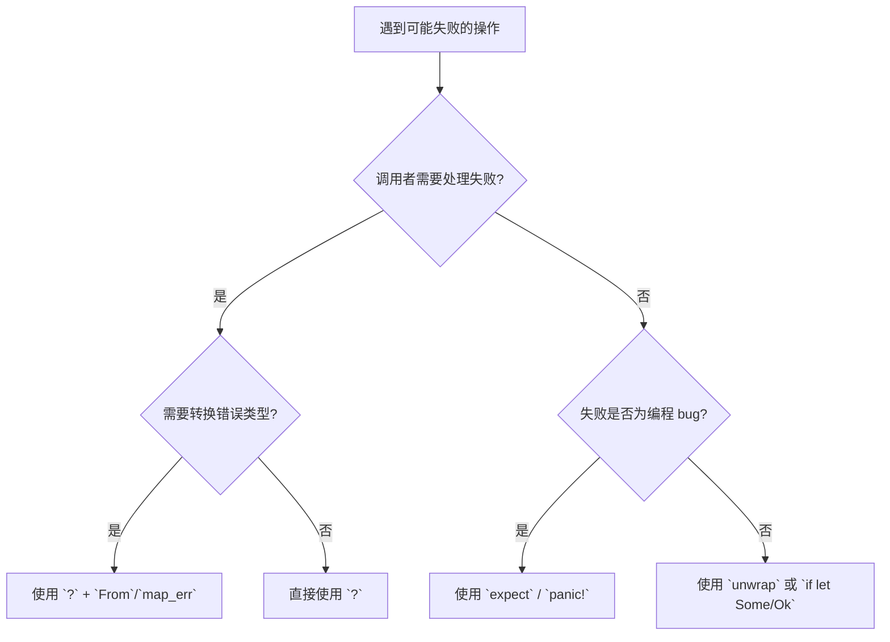

> **内容分级**: [综述级]

# 错误处理控制流（Error Handling Control Flow）
>
> **EN**: Error Handling Control Flow
> **Summary**: Error-handling patterns in Rust control flow: the `?` operator, `Try`/`FromResidual`, `try` blocks, custom error types with `thiserror`, and decision guidance for choosing between `?`, `match`, `unwrap`, `expect`, and `panic`.
>
> **受众**: [初学者]
> **层级**: L1 基础概念
> **Bloom 层级**: L1-L3
> **Rust 版本**: 1.97.0+ (Edition 2024)
> **权威来源**: 本文件为 `concept/` 权威页。
> **状态**: 从 `crates/c03_control_fn/docs/04_error_handling_control_flow_1_90.md` 迁移整理
>
> **主要来源**:
> [The Rust Reference — The ? operator](https://doc.rust-lang.org/reference/expressions/operator-expr.html#the-question-mark-operator) ·
> [The Rust Programming Language — Error Handling](https://doc.rust-lang.org/book/ch09-00-error-handling.html) ·
> [Rust By Example — Error handling](https://doc.rust-lang.org/rust-by-example/error.html)
>
> **L0 关联**: 本页属于 L1 基础概念层；全局知识拓扑参见 [Rust 知识体系全局思维导图](../../00_meta/00_framework/knowledge_mindmap.md)。
>
> **前置概念**:
> [Error Handling 基础](01_error_handling_basics.md) ·
> [Control Flow](../04_control_flow/01_control_flow.md) ·
> [Functions](../07_modules_and_items/02_functions.md)
> **后置概念**:
> [Error Handling 深入](../../02_intermediate/03_error_handling/01_error_handling.md) ·
> [Iterator Patterns](../../02_intermediate/07_iterators_and_closures/01_iterator_patterns.md)

---

## 🧠 知识结构图


## 📊 目录

- [错误处理控制流（Error Handling Control Flow）](#错误处理控制流error-handling-control-flow)
  - [🧠 知识结构图](#-知识结构图)
  - [📊 目录](#-目录)
  - [`?` 运算符与早退](#-运算符与早退)
  - [`Try`/`FromResidual` 与跨类型传播](#tryfromresidual-与跨类型传播)
  - [`try` 块](#try-块)
  - [错误转换：From 与 map\_err](#错误转换from-与-map_err)
    - [FromResidual 与 try\_trait\_v2](#fromresidual-与-try_trait_v2)
  - [自定义错误类型](#自定义错误类型)
  - [常见反模式](#常见反模式)
  - [边界设计建议](#边界设计建议)
  - [对比与决策](#对比与决策)
    - [决策树](#决策树)
  - [认知路径与推理骨架](#认知路径与推理骨架)
    - [认知路径](#认知路径)
    - [定理链](#定理链)
    - [反向推理](#反向推理)
    - [反命题](#反命题)
  - [国际权威参考 / International Authority References（P1 学术 · P2 生态）](#国际权威参考--international-authority-referencesp1-学术--p2-生态)
  - [📋 关键属性](#-关键属性)
  - [🔗 概念关系](#-概念关系)
  - [⚠️ 反例与陷阱：`?` 用于不返回 Result 的函数](#️-反例与陷阱-用于不返回-result-的函数)

本篇聚焦 `Result`/`Option` 与 `?` 运算符、`Try`/`FromResidual` 残差机制、`try` 块、错误转换与边界设计。

## `?` 运算符与早退

> (Source: [Rust Reference — The ? operator](https://doc.rust-lang.org/reference/expressions/operator-expr.html#the-question-mark-operator))

`?` 用于从返回 `Result`、`Option` 或 `ControlFlow` 的函数中提前返回错误/空值/控制信号。

```rust
fn read_number(s: &str) -> Result<i32, String> {
    let num: i32 = s.trim().parse().map_err(|_| "parse failed".to_string())?;
    Ok(num)
}
```

要点：

- `?` 等价于一段展开后的 `match`，在 `Err`/`None` 时立即从当前函数返回。
- 自动通过 `From` 将内部错误类型转换到函数返回错误类型。

等价展开：

```rust
fn read_number_manual(s: &str) -> Result<i32, String> {
    match s.trim().parse::<i32>() {
        Ok(n) => Ok(n),
        Err(_) => Err("parse failed".to_string()),
    }
}
```

---

## `Try`/`FromResidual` 与跨类型传播

> (Source: [TRPL — Error Handling](https://doc.rust-lang.org/book/ch09-00-error-handling.html))

`?` 依赖 `Try` 与 `FromResidual` trait 将 `Option::None`、`Result::Err` 等转换为调用者返回类型的**残差**（residual）。

```rust
fn opt_chain(x: Option<i32>) -> Option<i32> {
    let y = Some(1)?; // None 则直接返回 None
    Some(x? + y)
}
```

在 `Result` 与 `Option` 之间转换时需要显式处理，因为错误信息会丢失：

```rust
fn option_to_result(o: Option<i32>) -> Result<i32, &'static str> {
    let n = o.ok_or("missing value")?;
    Ok(n)
}
```

---

## `try` 块

将一段内部使用 `?` 的表达式整体化，便于在表达式位置编写错误传播逻辑。

```rust,ignore
// try 块仍未稳定（stable 不可编译，示意概念）
fn sum3(a: Result<i32, &'static str>, b: Result<i32, &'static str>) -> Result<i32, &'static str> {
    let s: Result<i32, _> = try { a? + b? };
    s
}
```

`try` 块允许把错误传播限制在一个表达式内，而不是整个函数：

```rust,ignore
// try 块仍未稳定（stable 不可编译，示意概念）
fn demo() -> Result<i32, &'static str> {
    let x: i32 = try {
        let a = "10".parse::<i32>()?;
        let b = "20".parse::<i32>()?;
        a + b
    }.map_err(|_| "inner parse failed")?;
    Ok(x * 2)
}
```

---

## 错误转换：From 与 map_err

> (Source: [std::result::Result](https://doc.rust-lang.org/std/result/enum.Result.html))

`?` 要求内部错误类型能够转换到函数返回的错误类型。标准库已为常见类型实现 `From`，例如 `io::Error` → `Box<dyn Error>`、`Infallible` → `E`。

当默认转换不存在时，使用 `map_err`：

```rust
fn parse_positive(s: &str) -> Result<u32, String> {
    let n: u32 = s.parse::<u32>()
        .map_err(|e| format!("invalid number '{}': {}", s, e))?;
    n.checked_add(1).ok_or_else(|| "overflow".to_string())?;
    Ok(n)
}
```

### FromResidual 与 try_trait_v2

`?` 在 Rust 1.56+ 通过 `Try` trait 与 `FromResidual` trait 实现。残差（residual）指 `Err`、`None`、`Break` 等"跳出"值，`?` 将其转换为外层可返回的形式。

```rust,ignore
// `?` 的概念展开（`expr` 为占位符，仅示意）
// 等价展开（概念上）
let x = expr?;
// ≈ match Try::branch(expr) {
//     ControlFlow::Continue(v) => v,
//     ControlFlow::Break(r) => return FromResidual::from_residual(r),
// }
```

自定义类型要实现 `?` 支持，需实现 `Try` 与 `FromResidual`，但绝大多数场景使用 `Result`/`Option`/`ControlFlow` 即可。

## 自定义错误类型

对外 API 推荐定义精确的错误类型，可使用 `thiserror` 减少样板：

```toml
[dependencies]
thiserror = "2"
```

```rust,ignore
use thiserror::Error;

#[derive(Debug, Error)]
enum ConfigError {
    #[error("io error: {0}")]
    Io(#[from] std::io::Error),
    #[error("parse error: {0}")]
    Parse(#[from] toml::de::Error),
    #[error("missing field: {0}")]
    MissingField(String),
}

fn load_config(path: &str) -> Result<Config, ConfigError> {
    let text = std::fs::read_to_string(path)?; // io::Error -> ConfigError
    let cfg: Config = toml::from_str(&text)?;  // toml::de::Error -> ConfigError
    Ok(cfg)
}
```

---

## 常见反模式

- **在 `main` 中大量使用 `unwrap`**：CLI 程序应使用 `Result` 与 `main` 返回 `Result<(), E>` 以优雅退出。
- **滥用 `map_err(|_| ...)` 丢失原始错误**：保留原始错误有助于调试，可使用 `#[source]` 或 `#[from]`。
- **为不可恢复错误返回 `Result`**：如数组索引越界应为 `panic!` 或前置检查，不要返回 `Result` 让调用者不知所措。

---

## 边界设计建议

- 对外 API 使用语义明确的错误类型（可结合 `thiserror`）。
- 小范围 `try` 块提升表达式可读性。
- 仅在需要时引入 `anyhow`/`eyre` 等动态错误类型。
- 不可恢复或编程错误使用 `panic!` 或 `assert!`，不要滥用 `Result`。

---

## 对比与决策

| 方式 | 适用场景 | 优点 | 缺点 |
|:---|:---|:---|:---|
| `match` | 需要立即处理每个分支 | 最显式、最灵活 | 嵌套多时代码冗长 |
| `?` | 错误需要向上传播 | 代码扁平、可读性高 | 要求返回类型兼容 |
| `try` 块 | 局部表达式内需要 `?` | 限制错误作用域 | Rust 1.85+ / 2024 Edition |
| `unwrap` | 原型或确定不会失败 | 简洁 | panic 风险，生产代码慎用 |
| `expect` | 失败说明确为 bug |  panic 信息可自定义 | 同 `unwrap` |
| `panic!` | 不可恢复状态 | 立即终止错误传播 | 不应作为常规错误处理（Error Handling） |

### 决策树



---
> **权威来源**:
> [Rust Reference — The ? operator](https://doc.rust-lang.org/reference/expressions/operator-expr.html#the-question-mark-operator) ·
> [TRPL — Error Handling](https://doc.rust-lang.org/book/ch09-00-error-handling.html) ·
> [Rust By Example — Error handling](https://doc.rust-lang.org/rust-by-example/error.html)
>
> **权威来源对齐变更日志**: 2026-07-10 补充权威来源标注（Rust Reference、TRPL、Rust By Example）

## 认知路径与推理骨架

本节给出「错误处理（Error Handling）即控制流」视角下的推理骨架，把 `Result`/`?`/`Option` 理解为类型化的控制流机制：

1. **问题识别**：这段代码的失败点是控制流分支（`if`/`match`）还是类型传播（`?`）？后者的优势是失败路径在签名可见；
2. **概念建立**：`?` 等价于 `match res { Ok(v) => v, Err(e) => return Err(e.into()) }`——所有「魔法」都是这一个脱糖；
3. **机制推理**：`Try` trait 是 `?` 的抽象接口——`Result`/`Option`/`ControlFlow` 共享同一传播协议，`?` 在 `Option` 函数中传播 `None`；
4. **边界辨析**：`?` 要求函数返回类型实现 `Try`——在 `main`/`test`/`fn -> ()` 中使用的修复是改返回类型为 `Result<(), E>` 或 `Result` 的 `Termination` 实现；
5. **迁移应用**：从「异常思维」迁移的关键是接受「错误是值」——控制流显式化的回报是静态可检查性。

骨架用法：遇到 `?` 相关编译错误，先脱糖为 `match` 再分析——90% 的错误在脱糖后显而易见。

### 认知路径

1. **从显式 `match` 开始**：先理解如何用 `match` 处理 `Result`/`Option`。
2. **引入 `?` 简化传播**：掌握 `?` 的早退语义与自动类型转换。
3. **理解残差机制**：通过 `Try`/`FromResidual` 知道 `?` 为何能在 `Option` 与 `Result` 间统一工作。
4. **自定义错误类型**：在 API 边界定义精确错误类型，实现 `std::error::Error`。
5. **边界设计**：在库/API 边界处选择错误类型、错误转换策略与可恢复性设计。

### 定理链

- **T-EH-1 错误传播单调性**：若函数返回 `Result<T, E>`，内部 `?` ⟹ 只会将 `Err` 向 `E` 转换，不会引入额外成功路径。
- **T-EH-2 `?` 早退等价性**：`expr?` ⟹ 在语义上等价于一段展开后的 `match`，编译器保证控制流一致。
- **T-EH-3 边界封闭性**：良好的错误边界设计 ⟹ 将领域错误封装在 crate/模块（Module）内部，对外暴露稳定、可操作的错误类型。

### 反向推理

- 要写出扁平、可维护的错误处理（Error Handling）代码 ⟸ 应优先使用 `?` 而非嵌套 `match`。
- 要让调用方能够准确判断失败原因 ⟸ 需要在 API 边界定义精确的错误类型并实现 `From` 转换。
- 遇到 `?` 类型不匹配 ⟸ 应检查返回类型是否实现了必要的 `From` 转换或 `Try` trait。

### 反命题

- ❌ “`?` 会隐藏错误处理（Error Handling）逻辑” → `?` 只是 `match` 的语法糖，错误路径仍然显式返回，只是视觉噪声更少。
- ❌ “所有函数都应该返回 `Result`” → 不可恢复或不可能失败的场景应使用 `panic!` 或纯返回值，避免过度工程化。

> **过渡**: 从显式 `match` 过渡到 `?` 运算符，可以理解错误传播语法糖背后的控制流等价性。
>
> **过渡**: 从 `?` 运算符过渡到 `Try`/`FromResidual`，可以建立“残差转换”这一统一错误处理模型。
>
> **过渡**: 从控制流机制过渡到自定义错误类型，可以形成在 API 边界精确表达失败原因的工程实践。
>
> **过渡提示**：掌握控制流层面的错误处理后，可继续阅读 [Error Handling 深入](../../02_intermediate/03_error_handling/01_error_handling.md) 了解自定义错误类型、`Error` trait 与生态库实践。

---

## 国际权威参考 / International Authority References（P1 学术 · P2 生态）

> 依据 `AGENTS.md` §2「对齐网络国际化权威内容」补充：仅追加已验证可达的权威链接，不改动正文事实。

- **P1 学术/形式化**:
- [Liu et al.: Towards Fixing Panic Bugs for Real-world Rust Programs（Panic4R 数据集, arXiv:2408.03262）](https://arxiv.org/abs/2408.03262) ·
- [Lagaillardie, Neykova & Yoshida: Stay Safe Under Panic — Affine Rust Programming with Multiparty Session Types（ECOOP 2022 全文, arXiv:2204.13464）](https://arxiv.org/abs/2204.13464)（2026-07-12 验证 HTTP 200）
- **P2 生态/社区**:
- [docs.rs/thiserror — 生态权威 API 文档](https://docs.rs/thiserror) ·
- [docs.rs/anyhow — 生态权威 API 文档](https://docs.rs/anyhow)

## 📋 关键属性

| 属性 | 取值 / 判定 | 依据 |
|---|---|---|
| `?` 语义 | 经 `FromResidual`/`Try` 转换并早退 | Reference |
| 跨类型传播 | `From<E1> for E2` 自动转换错误类型 | trait 契约 |
| `try` 块 | 捕获块内 `?` 早退（nightly 特性） | 跟踪特性 |
| 显式转换 | `map_err` / `ok_or` 手动映射 | 组合子 API |
| 自定义错误 | 枚举（Enum） + `Display`/`Error` 实现惯例 | 生态惯例 |

## 🔗 概念关系

- **上位（is-a）**：[Error Handling Basics](01_error_handling_basics.md) 的传播机制细化。
- **下位（实例）**：生态级错误设计见 [Error Handling Deep Dive](../../02_intermediate/03_error_handling/02_error_handling_deep_dive.md)。
- **对偶**：与 panic 不可恢复路径相对，见 [Panic and Abort](03_panic_and_abort.md)。
- **组合**：与 [Enumerations](../07_modules_and_items/05_enumerations.md) 的 `Result` 变体组合。
- **依赖**：转换合法性依赖 [Traits](../../02_intermediate/00_traits/01_traits.md) 的 `From`/`Into` 契约。

---

## ⚠️ 反例与陷阱：`?` 用于不返回 Result 的函数

**反例**（rustc 1.97 实测编译失败：E0277）：

```rust,compile_fail
fn f() {
    let n: i32 = "x".parse()?;
    println!("{n}");
}
fn main() { f(); }
```

`?` 要求所在函数返回 `Result`/`Option` 等实现了 `Try` 的类型；返回 `()` 时无法传播错误。

**修正**：

```rust
fn f() -> Result<(), std::num::ParseIntError> {
    let n: i32 = "x".parse()?;
    println!("{n}");
    Ok(())
}
fn main() { let _ = f(); }
```
