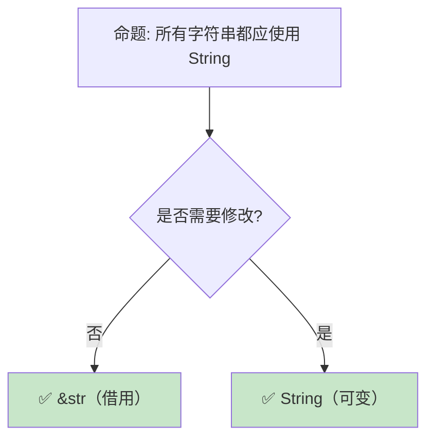

> **内容分级**: [综述级]

# 字符串与文本：Rust 的 Unicode 处理与格式化系统

> **受众**: [初学者]
> **Bloom 层级**: 应用 → 分析
> **A/S/P 标记**: **A+S** — Application + Structure
> **双维定位**: C×App — 应用字符串处理和编码知识
> **定位**:
> 系统分析 Rust **字符串类型**的设计——String [来源: [Rust String](https://doc.rust-lang.org/std/string/struct.String.html)] 与
> str [来源: [Rust str](https://doc.rust-lang.org/std/str/index.html)] 的所有权语义、
> UTF-8 [来源: [UTF-8](https://en.wikipedia.org/wiki/UTF-8)]
> [来源: [UTF-8 Wikipedia](https://en.wikipedia.org/wiki/UTF-8)]
> 编码约束、格式化宏（format!/write!）的类型安全设计，以及与 C 字符串、OS 字符串的互操作。
> **前置概念**: [Ownership](./01_ownership.md) · [Borrowing](./02_borrowing.md) · [Type System](./04_type_system.md)
> **后置概念**: [Collections](./08_collections.md) · [FFI](../03_advanced/05_rust_ffi.md)

---

> **来源**: [std::string::String](https://doc.rust-lang.org/std/string/struct.String.html) ·
> [std::str](https://doc.rust-lang.org/std/str/index.html) ·
> [TRPL Ch8 — Strings](https://doc.rust-lang.org/book/ch08-02-strings.html) ·
> [Unicode Standard](https://www.unicode.org/standard/standard.html) ·
> [Rust Formatting](https://doc.rust-lang.org/std/fmt/index.html) ·
> [RFC 504 — CString](https://github.com/rust-lang/rfcs/pull/504)

## 📑 目录

- [字符串与文本：Rust 的 Unicode 处理与格式化系统](#字符串与文本rust-的-unicode-处理与格式化系统)
  - [📑 目录](#-目录)
  - [一、核心概念](#一核心概念)
    - [1.1 String vs str：所有权谱系](#11-string-vs-str所有权谱系)
    - [1.2 UTF-8：Rust 的编码选择](#12-utf-8rust-的编码选择)
    - [1.3 格式化系统的类型安全](#13-格式化系统的类型安全)
  - [二、技术细节](#二技术细节)
    - [2.1 字符串切片与索引](#21-字符串切片与索引)
    - [2.2 OS 字符串与路径](#22-os-字符串与路径)
    - [2.3 与 C 字符串的互操作](#23-与-c-字符串的互操作)
  - [三、选型决策矩阵](#三选型决策矩阵)
  - [四、反命题与边界分析](#四反命题与边界分析)
    - [4.1 反命题树](#41-反命题树)
    - [4.2 边界极限](#42-边界极限)
  - [五、常见陷阱](#五常见陷阱)
  - [六、来源与延伸阅读](#六来源与延伸阅读)
  - [相关概念文件](#相关概念文件)
  - [权威来源索引](#权威来源索引)
  - [十二、边界测试：字符串与文本的编译错误](#十二边界测试字符串与文本的编译错误)
    - [12.1 边界测试：`String` 与 `&str` 的生命周期不匹配（编译错误）](#121-边界测试string-与-str-的生命周期不匹配编译错误)
    - [12.2 边界测试：字符串索引操作（编译错误）](#122-边界测试字符串索引操作编译错误)
    - [10.3 边界测试：`str::split` 与模式类型的不匹配（编译错误）](#103-边界测试strsplit-与模式类型的不匹配编译错误)
    - [10.4 边界测试：字符串拼接的 `+` 运算符消耗左操作数（编译错误）](#104-边界测试字符串拼接的--运算符消耗左操作数编译错误)
    - [10.5 边界测试：字符串索引与 UTF-8 编码边界（编译错误）](#105-边界测试字符串索引与-utf-8-编码边界编译错误)
    - [10.6 边界测试：`String::from_utf8` 的无效序列与损失转换（运行时 panic）](#106-边界测试stringfrom_utf8-的无效序列与损失转换运行时-panic)
  - [实践](#实践)
  - [认知路径](#认知路径)
    - [核心推理链](#核心推理链)
    - [反命题与边界](#反命题与边界)

---

## 一、核心概念
>
>

### 1.1 String vs str：所有权谱系
>

```text
Rust 的两种字符串类型:

  String:
  ├── 拥有所有权的、可变的、堆分配的 UTF-8 字符串
  ├── 类似 C++ std::string 或 Java StringBuilder
  ├── 大小: 3 × usize（ptr + len + capacity）
  └── 可以增长、收缩、修改

  str:
  ├── 字符串切片——对 UTF-8 字节序列的不可变引用
  ├── 通常以 &str 形式出现
  ├── 大小: 2 × usize（ptr + len）
  └── 不拥有数据，只是借用视图

  关系:
  String: Deref<Target = str>
  └── String 可以解引用为 str，所以 String 可用在所有需要 &str 的地方

  转换:
  String → &str: 自动（Deref）
  &str → String: to_string() 或 to_owned()（分配）
  String → 其他: into_bytes()、char [来源: [Rust char](https://doc.rust-lang.org/std/primitive.char.html)]s()、lines() 等
```

> **认知功能**: String/str 的关系是 Rust **所有权模型**的典型应用——String 拥有数据，str 借用数据，两者通过 Deref 无缝协作。
> [来源: [Rust Reference](https://doc.rust-lang.org/reference/)]
> **关键洞察**: 这种设计避免了 C++ 中 `std::string` 和 `const char*` 的混淆，以及 Java 中 `String` 和 `StringBuilder` 的性能陷阱。
> [来源: [TRPL Ch8 — Strings](https://doc.rust-lang.org/book/ch08-02-strings.html)]

---

### 1.2 UTF-8：Rust 的编码选择
>

```text
Rust 强制 UTF-8 的设计决策:

  原因:
  ├── Unicode 是文本的国际标准
  ├── UTF-8 是 Web 和文件系统的标准编码
  ├── ASCII 是 UTF-8 的子集（向后兼容）
  └── 避免编码混乱（如 Python 2 的 str/unicode 问题）

  代价:
  ├── 字符串不是简单的字节数组
  ├── 索引操作是 O(n) 而非 O(1)
  ├── 切片可能落在字符边界上（导致 panic）
  └── 与 C 的 char* 互操作需要转换

  与其他语言的对比:
  ┌─────────────────┬─────────────────┬─────────────────┐
  │ 语言            │ 默认编码        │ 索引行为        │
  ├─────────────────┼─────────────────┼─────────────────┤
  │ Rust            │ UTF-8           │ 字节索引，字符  │
  │                 │                 │ 边界检查        │
  │ Python 3        │ Unicode（内部   │ 字符索引        │
  │                 │ 表示可变）      │                 │
  │ Java            │ UTF-16          │ UTF-16 单元索引 │
  │ JavaScript      │ UTF-16          │ UTF-16 单元索引 │
  │ C/C++           │ 无（字节序列）  │ 字节索引        │
  └─────────────────┴─────────────────┴─────────────────┘
```

> **UTF-8 洞察**: Rust 的 UTF-8 强制是**有争议但一致**的设计——它排除了许多编码相关的 bug，但要求程序员理解 Unicode 的复杂性。
> [来源: [Unicode Standard](https://www.unicode.org/standard/standard.html)]

---

### 1.3 格式化系统的类型安全
>

```rust,ignore
// Rust 的格式化宏在编译期检查

// 编译期验证占位符数量和类型
let s = format!("Hello, {}! You are {} years old.", name, age);
// 编译器检查:
// - 两个 {} 占位符
// - name 和 age 都实现 Display trait
// - 编译错误如果数量不匹配或类型不实现 Display

// 命名参数（Rust 1.58+）
let s = format!("{greeting}, {name}!", greeting = "Hello", name = "World");

// 格式化选项
let s = format!("{:>10}", "hello");     // 右对齐，宽度 10
let s = format!("{:.2}", 3.14159);      // 保留 2 位小数
let s = format!("{:?}", vec![1, 2, 3]); // Debug 格式化
let s = format!("{:#x}", 255);          // 十六进制，带 0x 前缀

// 自定义类型的格式化
use std::fmt;

struct Point { x: i32, y: i32 }

impl fmt::Display for Point {
    fn fmt(&self, f: &mut fmt::Formatter) -> fmt::Result {
        write!(f, "({}, {})", self.x, self.y)
    }
}

let p = Point { x: 1, y: 2 };
println!("{}", p);  // 输出: (1, 2)
```

> **格式化洞察**: Rust 的 `format!` 是**类型安全**的——它在编译期检查参数数量和类型，消除了 C `printf` 的整类运行时错误。
> [来源: [std::fmt](https://doc.rust-lang.org/std/fmt/index.html)]

---

## 二、技术细节

### 2.1 字符串切片与索引
>

```rust
let s = "hello 世界";  // 11 个字节（ASCII 5 + 中文 6）

// ❌ 字符串不支持整数索引
// let c = s[0];  // 编译错误！

// ✅ 使用 chars() 迭代
for c in s.chars() {
    println!("{}", c);  // h, e, l, l, o, 世, 界
}

// ✅ 使用 bytes() 迭代原始字节
for b in s.bytes() {
    println!("{}", b);  // 104, 101, 108, 108, 111, 228, 184, ...
}

// ✅ 使用 char_indices() 获取字符和字节索引
for (i, c) in s.char_indices() {
    println!("{}: {}", i, c);  // 0: h, 1: e, ..., 6: 世, 9: 界
}

// ✅ 切片需要落在字符边界上
let hello = &s[0..5];    // "hello"（ASCII，每个字符 1 字节）
let world = &s[6..11];   // 需要知道字符边界！
// let bad = &s[0..4];   // ❌ panic! 不在字符边界

// 安全切片方法
if let Some(substr) = s.get(0..5) {
    println!("{}", substr);  // 不 panic，返回 Option
}
```

> **索引洞察**: Rust **禁止字符串整数索引**是为了防止 Unicode 边界错误——这是一个**故意的不便**，换取安全性。
> [来源: [Rust String Methods](https://doc.rust-lang.org/std/string/struct.String.html)]

---

### 2.2 OS 字符串与路径
>

```rust
use std::ffi::{OsString, OsStr};
use std::path::{Path, PathBuf};

// OsString/OsStr: 平台相关的字符串
// - Unix: 任意字节序列（不一定是 UTF-8）
// - Windows: WTF-8（UTF-16 的扩展）

let os_str: &OsStr = OsStr::new("hello");
let os_string: OsString = OsString::from("hello");

// 与 String/str 的转换
let maybe_str = os_str.to_str();  // Option<&str> — 可能失败！
let lossy = os_str.to_string_lossy();  // Cow<str> — 替换无效字符

// Path/PathBuf: 专门用于文件路径
let path = Path::new("/tmp/file.txt");
let path_buf = PathBuf::from("/tmp/file.txt");

// 路径操作
let parent = path.parent();       // Some("/tmp")
let file_name = path.file_name(); // Some("file.txt")
let extension = path.extension(); // Some("txt")

// PathBuf 可以修改
let mut p = PathBuf::from("/tmp");
p.push("dir");
p.push("file.txt");
// p == "/tmp/dir/file.txt"
```

> **OS 字符串洞察**: `OsString` 的存在反映了**现实世界的复杂性**——文件系统路径不一定是有效的 UTF-8，Rust 选择显式处理这种不确定性（通过 `Option` 和 `Cow`）。
> [来源: [std::ffi::OsString](https://doc.rust-lang.org/std/ffi/struct.OsString.html)]

---

### 2.3 与 C 字符串的互操作
>

```rust
use std::ffi::{CString, CStr};
use std::os::raw::c_char;

// CString: 拥有所有权的 C 兼容字符串
// - 以 NUL 字节结尾
// - 内部不包含 NUL 字节

let c_string = CString::new("hello").unwrap();
let ptr: *const c_char = c_string.as_ptr();
// ptr 可以传递给 C 函数

// CStr: 借用 C 字符串
// - 从 C 函数返回的指针创建
// - 不拥有内存

unsafe {
    let c_str = CStr::from_ptr(ptr);
    let str_slice = c_str.to_str().unwrap();
    println!("{}", str_slice);
}

// 与 String/str 的对比:
// ┌──────────┬─────────────┬─────────────┬─────────────┐
// │ 类型     │ 所有权      │ 编码        │ NUL 终止    │
// ├──────────┼─────────────┼─────────────┼─────────────┤
// │ String   │ 拥有        │ UTF-8       │ 否          │
// │ str      │ 借用        │ UTF-8       │ 否          │
// │ CString  │ 拥有        │ 任意字节    │ 是          │
// │ CStr     │ 借用        │ 任意字节    │ 是          │
// │ OsString │ 拥有        │ 平台相关    │ 否          │
// │ OsStr    │ 借用        │ 平台相关    │ 否          │
// └──────────┴─────────────┴─────────────┴─────────────┘
```

> **C 字符串洞察**: `CString`/`CStr` 是 Rust **FFI 安全**的关键——它们保证 NUL 终止且不包含内部 NUL，避免了 C 字符串的常见陷阱。
> [来源: [std::ffi::CString](https://doc.rust-lang.org/std/ffi/struct.CString.html)]

---

## 三、选型决策矩阵

```text
场景 → 推荐类型 → 关键理由

通用文本处理:
  → String / &str
  → UTF-8、所有权清晰、生态丰富

文件路径:
  → PathBuf / &Path
  → 跨平台、路径语义正确

系统调用参数:
  → OsString / &OsStr
  → 兼容非 UTF-8 路径

FFI C 接口:
  → CString / &CStr
  → NUL 终止保证

字节序列（可能非文本）:
  → Vec<u8> / &[u8]
  → 无编码假设

环境变量:
  → OsString
  → 平台兼容

命令行参数:
  → OsString / String
  → 取决于是否需要处理非 UTF-8
```

> **选型原则**: 默认使用 `String`/`&str`，只在需要与非 UTF-8 数据交互时使用 `OsString`/`CString`。
> [来源: [Rust API Guidelines — Strings](https://rust-lang.github.io/api-guidelines/naming.html)]

---

## 四、反命题与边界分析

### 4.1 反命题树
>



> **认知功能**: 此决策树展示字符串类型的**核心选择**。原则很简单：**只读用 &str，需要修改用 String**。
> [来源: [Rust API Guidelines](https://rust-lang.github.io/api-guidelines/flexibility.html#c-str)]

---

### 4.2 边界极限
>

```text
边界 1: Unicode 复杂度
├── Rust 的 char 是 Unicode 标量值（4 字节）
├── 但用户感知的"字符"（字素簇）可能由多个 char 组成
├── 例如: é 可以是 U+00E9 或 U+0065 U+0301
└── 需要 unicode-segmentation crate 处理字素簇

边界 2: 正则表达式的性能
├── Rust 的 regex crate 是安全的但非最快
├── 某些场景下 PCRE2（C 库）更快
├── 但 PCRE2 需要 unsafe 或外部进程
└── 权衡: 安全 vs 性能

边界 3: 格式化字符串的大小
├── format! 生成的代码可能很大
├── 大量格式化调用增加二进制体积
├── 嵌入式场景需要注意
└── 缓解: 使用 write! 直接写入缓冲区

边界 4: 与 JSON/XML 的互操作
├── serde 自动处理字符串序列化
├── 但某些格式有特殊字符转义需求
├── 大字符串的序列化/反序列化开销
└── 缓解: 使用流式解析器

边界 5: 字符串interning
├── Rust 标准库无内置字符串 interning
├── 大量重复字符串浪费内存
├── 需要第三方 crate（如 lasso）
└── 编译器内部有符号表（sym）的实现
```

> **边界要点**: 字符串处理的边界主要与**Unicode 复杂性**、**正则性能**、**格式化开销**、**序列化**和**内存优化**相关。
> [来源: [Rust Performance Book — Strings](https://nnethercote.github.io/perf-book/string-processing.html)]

---

## 五、常见陷阱
>

```text
陷阱 1: 假设字符串索引是 O(1)
  ❌ s.chars().nth(100)  // O(n)
     // 误以为和数组索引一样快

  ✅ 如果需要频繁索引，使用 Vec<char> 或字节索引
     // 或重新设计算法避免索引

陷阱 2: 忽略 OsStr 到 str 的转换失败
  ❌ os_str.to_str().unwrap()
     // 在 Unix 上可能 panic（非法 UTF-8 路径）

  ✅ os_str.to_string_lossy()
     // 或: os_str.to_str().unwrap_or("<invalid>")

陷阱 3: CString::new 的 panic
  ❌ CString::new("hello\0world")
     // panic! 因为内部有 NUL

  ✅ CString::new(s).expect("NUL byte in string")
     // 或正确处理 Result

陷阱 4: 混淆 String 和 &str 的 API
  ❌ fn process(s: String) { ... }
     // 调用者必须拥有 String

  ✅ fn process(s: &str) { ... }
     // 接受 String（通过 Deref）和 &str

陷阱 5: 格式化时的所有权问题
  ❌ let s = format!("{}", data);
     // data 被 move（如果 data 不是 Copy）

  ✅ let s = format!("{:?}", &data);
     // 借用而非 move
```

> **陷阱总结**: 字符串处理的陷阱主要与**性能假设**、**编码转换**、**NUL 处理**、**API 设计**和**所有权**相关。
> [来源: [Rust Compiler Error E0277](https://doc.rust-lang.org/error_codes/E0277.html)]

---

## 六、来源与延伸阅读

| 来源 | 可信度 | 说明 |
|:---|:---:|:---|
| [std::string::String](https://doc.rust-lang.org/std/string/struct.String.html) | ✅ 一级 | 标准库文档 |
| [std::str](https://doc.rust-lang.org/std/str/index.html) | ✅ 一级 | 字符串切片文档 |
| [TRPL Ch8 — Strings](https://doc.rust-lang.org/book/ch08-02-strings.html) | ✅ 一级 | 字符串章节 |
| [Unicode Standard](https://www.unicode.org/standard/standard.html) | ✅ 一级 | Unicode 规范 |
| [std::fmt](https://doc.rust-lang.org/std/fmt/index.html) | ✅ 一级 | 格式化系统 |
| [RFC 504 — CString](https://github.com/rust-lang/rfcs/pull/504) | ✅ 一级 | C 字符串 RFC |

---

## 相关概念文件

- [Ownership](./01_ownership.md) — 所有权模型
- [Borrowing](./02_borrowing.md) — 借用规则
- [Collections](./08_collections.md) — 集合类型
- [FFI](../03_advanced/05_rust_ffi.md) — FFI 跨语言

---

> **权威来源**: [Rust Reference](https://doc.rust-lang.org/reference/), [The Rust Programming Language](https://doc.rust-lang.org/book/)
>
> **权威来源对齐变更日志**: 2026-05-22 创建 [来源: Authority Source Sprint Batch 9]

**文档版本**: 1.0
**对应 Rust 版本**: 1.96.0+ (Edition 2024)
**最后更新**: 2026-05-22
**状态**: ✅ 概念文件创建完成

---

## 权威来源索引

>
>
>

---

---

---

> **补充来源**

## 十二、边界测试：字符串与文本的编译错误

### 12.1 边界测试：`String` 与 `&str` 的生命周期不匹配（编译错误）

```rust,compile_fail
fn get_str() -> &str {
    let s = String::from("hello");
    // ❌ 编译错误: `s` does not live long enough
    // String 在函数返回时 drop，不能返回其内部 str 的引用
    &s[..]
}

// 正确: 返回 String（所有权）
fn get_string() -> String {
    String::from("hello") // ✅ 所有权转移给调用者
}

// 或: 返回 'static str
fn get_static() -> &'static str {
    "hello" // ✅ 字符串字面量是 'static
}
```

> **修正**: `String` 拥有堆分配的 UTF-8 字节数组，`&str` 是对其内部数据的借用。返回 `&str` 意味着返回一个引用，但被引用的 `String` 在函数返回时释放。这与悬垂引用问题相同——生命周期系统阻止返回指向局部 `String` 的 `&str`。正确做法是返回 `String`（转移所有权）或返回 `'static str`（字符串字面量）。[来源: [The Rust Programming Language](https://doc.rust-lang.org/book/)]

### 12.2 边界测试：字符串索引操作（编译错误）

```rust,compile_fail
fn main() {
    let s = "hello".to_string();
    // ❌ 编译错误: `String` cannot be indexed by `{integer}`
    // Rust 字符串不支持整数索引
    let c = s[0];
}

// 正确: 使用 chars() 迭代或 get 方法
fn fixed() {
    let s = "hello".to_string();
    let c = s.chars().nth(0); // ✅ 返回 Option<char>
    println!("{:?}", c); // Some('h')

    // 或使用字节索引（需谨慎，可能截断 UTF-8）
    let byte = s.as_bytes().get(0); // ✅ 返回 Option<&u8>
    println!("{:?}", byte);
}
```

> **修正**: Rust 禁止 `String`/`str` 的整数索引，因为 UTF-8 是多字节编码，第 N 个"字符"不一定是第 N 个字节。`"你好"[0]` 可能返回 UTF-8 首字节而非完整字符。这与 Python/Java 的透明 Unicode 处理不同——Rust 强制开发者显式选择字节级或字符级访问，避免隐式截断多字节字符。[来源: [Rust Standard Library](https://doc.rust-lang.org/std/)]

### 10.3 边界测试：`str::split` 与模式类型的不匹配（编译错误）

```rust,compile_fail
fn main() {
    let s = "hello world";
    // ❌ 编译错误: split 的参数类型不匹配
    // let parts: Vec<&str> = s.split(' ').collect(); // char，OK
    // let parts: Vec<&str> = s.split(" ").collect(); // &str，OK
    // let parts: Vec<&str> = s.split([' ', '\t']).collect(); // [char; 2]，OK（1.51+）

    // 但以下错误:
    let parts: Vec<&str> = s.split(vec![' ', '\t']).collect();
    // Vec<char> 未实现 Pattern trait
}
```

> **修正**: `str::split` 接受实现 `Pattern` trait 的参数：`char`、`&str`、`&[char]`、`FnMut(char) -> bool`。`Vec<char>` 未实现 `Pattern`，因此不能作为 `split` 参数。Rust 的 `Pattern` trait 是稳定的内部 trait（`std::str::pattern::Pattern`），不对外公开实现，因此不能为自定义类型实现 `Pattern`。这是标准库的封闭 trait 设计：防止外部类型破坏 `split` 的内部优化。替代方案：1) 将 `Vec<char>` 转为 `&[char]`（`vec.as_slice()`）；2) 使用闭包 `|c| vec.contains(&c)`；3) 使用 `regex` crate 处理复杂分割模式。这与 Python 的 `str.split`（接受 `str` 或 `None`）或 JavaScript 的 `String.prototype.split`（接受字符串或正则）不同——Rust 的 `split` 参数类型在编译期严格检查，但灵活性较低。[来源: [Rust Standard Library](https://doc.rust-lang.org/std/primitive.str.html)] · [来源: [The Rust Programming Language](https://doc.rust-lang.org/book/)]

### 10.4 边界测试：字符串拼接的 `+` 运算符消耗左操作数（编译错误）

```rust,compile_fail
fn main() {
    let s1 = String::from("hello");
    let s2 = String::from(" world");
    let s3 = s1 + &s2; // s1 被消耗，s2 被借用
    // ❌ 编译错误: s1 在 + 后被移动，不能再次使用
    println!("{}", s1);
}
```

> **修正**: `String + &str` 的实现消耗左边的 `String`（取得所有权），追加右边的 `&str`，返回新的 `String`。这是效率优化：若 `s1` 有足够容量，直接在其缓冲区后追加 `s2` 的内容，无需新分配。代价：`s1` 被移动。若需保留 `s1`，应使用 `format!("{}{}", s1, s2)` 或 `s1.clone() + &s2`。多次拼接时，`+` 链的效率差（每次可能重新分配），应使用 `String::with_capacity` + `push_str` 或 `format!`。这与 Java 的 `String +`（创建新 `String`，不修改原对象）或 C++ 的 `std::string +`（创建新字符串）不同——Rust 的 `+` 是变异操作（mutating），利用已有分配。[来源: [The Rust Programming Language](https://doc.rust-lang.org/book/ch08-02-strings.html)] · [来源: [Rust Standard Library](https://doc.rust-lang.org/std/string/struct.String.html)]

### 10.5 边界测试：字符串索引与 UTF-8 编码边界（编译错误）

```rust,compile_fail
fn main() {
    let s = "hello";
    // ❌ 编译错误: String 和 str 不支持整数索引
    let c = s[0];
    // 正确: 使用 chars() 迭代或 get() 安全访问
    // let c = s.chars().nth(0).unwrap();
}
```

> **修正**: Rust 的 `String`/`str` **不支持整数索引**，因为 UTF-8 是变长编码：ASCII 字符占 1 字节，中文占 3 字节，`s[0]` 的语义不明确（是第 0 个字节还是第 0 个 Unicode 标量值？）。访问方式：1) `s.chars().nth(i)` — 第 i 个 Unicode 标量值（O(n)）；2) `s.as_bytes()[i]` — 第 i 个字节（unsafe，可能切分多字节字符）；3) `s.get(i..j)` — 安全子串切片（返回 `Option<&str>`，检查边界完整性）。设计哲学：禁止可能产生无效 UTF-8 的操作。这与 Python 3 的 `s[0]`（返回 Unicode 码点）或 JavaScript 的 `s[0]`（返回 UTF-16 码元）不同——Rust 强制开发者明确索引语义。[来源: [The Rust Programming Language](https://doc.rust-lang.org/book/ch08-02-strings.html)] · [来源: [Rust Standard Library](https://doc.rust-lang.org/std/string/struct.String.html)]

### 10.6 边界测试：`String::from_utf8` 的无效序列与损失转换（运行时 panic）

```rust,ignore
fn main() {
    let bytes = vec![0, 159, 146, 150]; // 无效的 UTF-8 序列
    // ❌ 运行时 panic: from_utf8 返回 Err，unwrap 时 panic
    let s = String::from_utf8(bytes).unwrap();
    println!("{}", s);
}
```

> **修正**: `String::from_utf8` 将 `Vec<u8>` 转为 `String`，要求严格 UTF-8。无效序列时：1) `unwrap()` → panic；2) `from_utf8_lossy` → 用 `U+FFFD`（�）替换无效字节，返回 `Cow<'_, str>`；3) `from_utf8` 返回 `Result<String, FromUtf8Error>`，可恢复原始 `Vec`。`String::from_utf8` 的所有权语义：成功时消耗 `Vec<u8>`（无额外分配），失败时返回 `Err` 包含原始 `Vec`。这与 `str::from_utf8`（`&[u8]` → `&str`，不消耗输入）或 Python 的 `bytes.decode('utf-8', errors='replace')` 类似——Rust 提供严格转换和损失转换两种选择。[来源: [Rust Standard Library](https://doc.rust-lang.org/std/string/struct.String.html)] · [来源: [The Rust Programming Language](https://doc.rust-lang.org/book/ch08-02-strings.html)]

## 实践

> **相关资源**:
>
> - [crates/ 示例代码](../../crates/) — 与本文概念对应的可编译示例
> - [exercises/ 练习](../../exercises/) — 动手编程挑战
> - [MVP 学习路径](../00_meta/LEARNING_MVP_PATH.md) — 从零到多线程 CLI 的 40 小时路径
>
> **建议**: 阅读完本概念文件后，打开对应 crate 的示例代码，尝试修改并运行。完成至少 1 道相关练习以巩固理解。

## 认知路径

> **认知路径**: 从 L0 基础概念出发，经由本节的 **字符串与文本：Rust 的 Unicode 处理与格式化系统** 核心原理，通向 L2 进阶模式与 L3 工程实践。

### 核心推理链

| 定理 | 前提 | 结论 | 置信度 |
|:---|:---|:---|:---|
| 字符串与文本：Rust 的 Unicode 处理与格式化系统 基础定义 ⟹ 正确用法 | 理解语法与语义 | 能写出符合惯用法的代码 | 高 |
| 字符串与文本：Rust 的 Unicode 处理与格式化系统 正确用法 ⟹ 常见陷阱 | 忽略边界条件 | 编译错误或运行时 bug | 高 |
| 字符串与文本：Rust 的 Unicode 处理与格式化系统 常见陷阱 ⟹ 深度掌握 | 系统学习反模式 | 能进行代码审查与优化 | 高 |

> **过渡**: 掌握 字符串与文本：Rust 的 Unicode 处理与格式化系统 的基础语法后，下一步需要理解其在类型系统中的位置与与其他概念的交互关系。

> **过渡**: 在实践中应用 字符串与文本：Rust 的 Unicode 处理与格式化系统 时，务必关注边界条件与异常处理，这是从"能编译"到"能生产"的关键跃迁。

> **过渡**: 字符串与文本：Rust 的 Unicode 处理与格式化系统 的设计理念体现了 Rust 零成本抽象与安全保证的核心权衡，理解这一权衡有助于迁移到更高级的并发与形式化验证领域。

### 反命题与边界

> **反命题**: "字符串与文本：Rust 的 Unicode 处理与格式化系统 在所有场景下都是最佳选择" —— 错误。需要根据具体上下文权衡性能、可读性与安全性，某些场景下显式替代方案可能更优。
