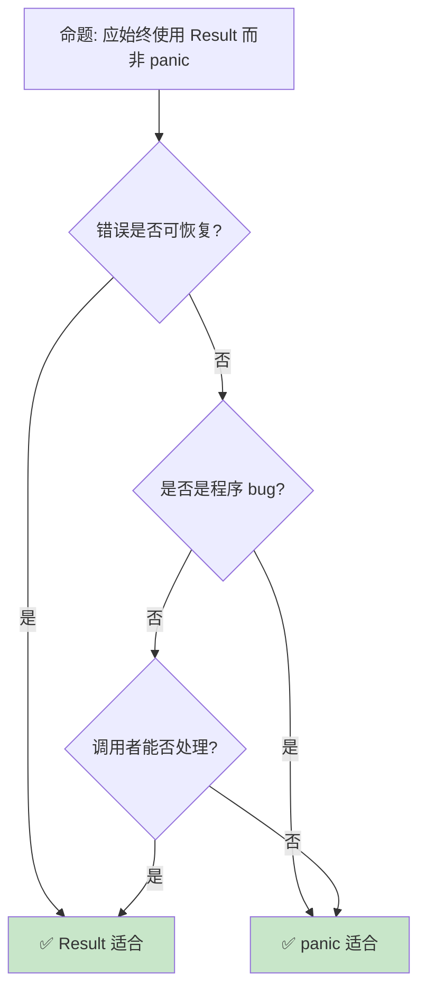

# Rust 错误处理基础

> **Bloom 层级**: 理解 → 应用
> **A/S/P 标记**: **A+S** — Application + Structure
> **双维定位**: C×App — 应用 Result/Option 错误传播模式
> **定位**: 系统讲解 Rust 的错误处理机制——从 `Result` 和 `Option` 到 `?` 运算符，分析 Rust 如何将错误处理融入类型系统，实现编译期安全。
> **前置概念**: [Ownership](01_ownership.md) · [Type System](04_type_system.md) · [Control Flow](07_control_flow.md)
> **后置概念**: [Error Handling](../02_intermediate/04_error_handling.md) ·
> [Panic](../03_advanced/03_unsafe.md) ·
> [Logging](../06_ecosystem/13_logging_observability.md)

---

> **来源**: [The Rust Programming Language](https://doc.rust-lang.org/book/) ·
> [Rust By Example](https://doc.rust-lang.org/rust-by-example/error.html) ·
> [std::result](https://doc.rust-lang.org/std/result/index.html) ·
> [std::option](https://doc.rust-lang.org/std/option/index.html) ·
> [Wikipedia — Exception Handling](https://en.wikipedia.org/wiki/Exception_handling)

## 📑 目录
>
>

- [Rust 错误处理基础](#rust-错误处理基础)
  - [📑 目录](#-目录)
  - [一、核心概念](#一核心概念)
    - [1.1 Result 类型](#11-result-类型)
    - [1.2 Option 类型](#12-option-类型)
    - [1.3 ? 运算符](#13--运算符)
  - [二、错误转换与组合](#二错误转换与组合)
    - [2.1 From trait](#21-from-trait)
    - [2.2 map 与 and\_then](#22-map-与-and_then)
    - [2.3 组合模式](#23-组合模式)
  - [三、Panic 与不可恢复错误](#三panic-与不可恢复错误)
    - [3.1 panic! 宏](#31-panic-宏)
    - [3.2 unwrap 与 expect](#32-unwrap-与-expect)
  - [四、反命题与边界分析](#四反命题与边界分析)
    - [4.1 反命题树](#41-反命题树)
    - [4.2 边界极限](#42-边界极限)
  - [五、常见陷阱](#五常见陷阱)
  - [六、来源与延伸阅读](#六来源与延伸阅读)
  - [相关概念文件](#相关概念文件)
  - [权威来源索引](#权威来源索引)
  - [十二、边界测试：错误处理的编译错误](#十二边界测试错误处理的编译错误)
    - [12.1 边界测试：`unwrap()` 在 `Result::Err` 上 panic（运行时错误）](#121-边界测试unwrap-在-resulterr-上-panic运行时错误)
    - [12.2 边界测试：`?` 在返回 `()` 的函数中使用（编译错误）](#122-边界测试-在返回--的函数中使用编译错误)
    - [10.3 边界测试：`Result` 与 `Option` 的混用（编译错误）](#103-边界测试result-与-option-的混用编译错误)
    - [10.4 边界测试：`catch_unwind` 与 `UnwindSafe`（编译错误）](#104-边界测试catch_unwind-与-unwindsafe编译错误)
    - [10.5 边界测试：`Result` 的 `unwrap_unchecked` 与 release 模式（运行时 UB）](#105-边界测试result-的-unwrap_unchecked-与-release-模式运行时-ub)
    - [10.5 边界测试：生命周期参数的不匹配返回](#105-边界测试生命周期参数的不匹配返回)

---

## 一、核心概念
>
>

### 1.1 Result 类型
>

```text
Result<T, E>:

  定义: 表示可能失败的操作结果
  enum Result<T, E> {
      Ok(T),   // 成功，包含值
      Err(E),  // 失败，包含错误
  }

  对比异常处理:
  ┌─────────────────┬─────────────────┬─────────────────┐
  │ 方面            │ 异常（Java/C++）│ Result（Rust）  │
  ├─────────────────┼─────────────────┼─────────────────┤
  │ 错误类型        │ 运行时          │ 编译期          │
  │ 是否处理        │ 可选            │ 强制            │
  │ 性能            │ 有开销          │ 零成本          │
  │ 控制流          │ 非局部跳转      │ 显式传播        │
  │ 文档化          │ 差              │ 类型即文档      │
  └─────────────────┴─────────────────┴─────────────────┘
> [来源: [TRPL](https://doc.rust-lang.org/book/)]

  代码示例:

  fn read_file(path: &str) -> Result<String, io::Error> {
      let mut file = File::open(path)?;
      let mut content = String::new();
      file.read_to_string(&mut content)?;
      Ok(content)
  }

  使用模式:
  ├── match 完整处理
  ├── if let 简化处理
  ├── ? 传播错误
  └── unwrap 快速原型
```

```rust
fn divide(a: f64, b: f64) -> Result<f64, String> {
    if b == 0.0 {
        Err(String::from("division by zero"))
    } else {
        Ok(a / b)
    }
}

fn main() {
    match divide(10.0, 2.0) {
        Ok(result) => println!("result: {}", result),
        Err(e) => println!("error: {}", e),
    }
}
```

> **认知功能**: **Result 将错误从"隐藏的副作用"转变为"显式的类型"**——编译器强制处理所有错误路径。
> [来源: [TRPL Ch. 9](https://doc.rust-lang.org/book/ch09-00-error-handling.html)]

---

### 1.2 Option 类型
>

```text
Option<T>:

  定义: 表示可能不存在的值
  enum Option<T> {
      Some(T),  // 值存在
      None,     // 值不存在
  }

  对比 null:
  ┌─────────────────┬─────────────────┬─────────────────┐
  │ 方面            │ null            │ Option          │
  ├─────────────────┼─────────────────┼─────────────────┤
  │ 安全性          │ 空指针异常      │ 编译期检查      │
  │ 显式性          │ 隐式            │ 显式            │
  │ 组合能力        │ 弱              │ 强              │
  │ 文档化          │ 差              │ 类型即文档      │
  └─────────────────┴─────────────────┴─────────────────┘

  代码示例:

  fn find_user(users: &[User], id: u32) -> Option<&User> {
      users.iter().find(|u| u.id == id)
  }

  // 使用
  if let Some(user) = find_user(&users, 1) {
      println!("{}", user.name);
  }

  Option → Result:
  opt.ok_or("not found")        // None → Err
  opt.ok_or_else(|| make_err()) // 惰性版本
```

```rust
fn maybe_sqrt(x: f64) -> Option<f64> {
    if x >= 0.0 {
        Some(x.sqrt())
    } else {
        None
    }
}

fn main() {
    let value = maybe_sqrt(4.0)
        .map(|v| v * 2.0)
        .unwrap_or(0.0);
    println!("{}", value);
}
```

> **Option 洞察**: **Option 消除了 null 指针问题**——编译器确保你处理"值不存在"的情况。
> [来源: [std::option::Option](https://doc.rust-lang.org/std/option/enum.Option.html)]

---

### 1.3 ? 运算符
>

```text
? 运算符:

  作用: 简化错误传播
  ├── Ok(v) → 解包为 v
  ├── Err(e) → 提前返回 Err(e.into())
  └── 只能在返回 Result/Option 的函数中使用

  代码对比:

  不使用 ?:
  fn read_username(path: &str) -> Result<String, io::Error> {
      let file_result = File::open(path);
      let mut file = match file_result {
          Ok(f) => f,
          Err(e) => return Err(e),
      };
      let mut username = String::new();
      match file.read_to_string(&mut username) {
          Ok(_) => Ok(username),
          Err(e) => Err(e),
      }
  }

  使用 ?:
  fn read_username(path: &str) -> Result<String, io::Error> {
      let mut file = File::open(path)?;
      let mut username = String::new();
      file.read_to_string(&mut username)?;
      Ok(username)
  }

  转换能力:
  ? 自动调用 From::from 转换错误类型
  └── 需要实现 From<E> for 目标错误类型
```

```rust
fn parse_add_one(s: &str) -> Result<i32, std::num::ParseIntError> {
    let n: i32 = s.parse()?;
    Ok(n + 1)
}

fn main() {
    match parse_add_one("42") {
        Ok(n) => println!("{}", n),
        Err(e) => println!("parse error: {}", e),
    }
}
```

> **? 洞察**: **? 运算符是 Rust 错误处理的"语法糖"**——保持显式性的同时减少样板代码。
> [来源: [Rust Reference — Question Mark](https://doc.rust-lang.org/reference/expressions/operator-expr.html#the-question-mark-operator)]

---

## 二、错误转换与组合

### 2.1 From trait
>

```text
From trait:

  定义: 类型之间的转换
  trait From<T> {
      fn from(value: T) -> Self;
  }

  错误转换:
  ├── ? 运算符依赖 From
  ├── 自动将具体错误转为通用错误
  └── 实现一次，处处可用

  代码示例:

  #[derive(Debug)]
  enum AppError {
      Io(io::Error),
      Parse(ParseIntError),
      Custom(String),
  }

  impl From<io::Error> for AppError {
      fn from(err: io::Error) -> Self {
          AppError::Io(err)
      }
  }

  impl From<ParseIntError> for AppError {
      fn from(err: ParseIntError) -> Self {
          AppError::Parse(err)
      }
  }

  fn do_something() -> Result<(), AppError> {
      let file = File::open("data.txt")?;  // io::Error → AppError
      let num: i32 = "abc".parse()?;       // ParseIntError → AppError
      Ok(())
  }
```

> **From 洞察**: **From trait 实现了错误的"自动上转"**——具体错误隐式转为通用错误类型。
> [来源: [std::convert::From](https://doc.rust-lang.org/std/convert/trait.From.html)]

---

### 2.2 map 与 and_then
>

```text
Result/Option 组合:

  map: 转换成功值
  ├── Result<T, E>::map(F) -> Result<U, E>
  └── Option<T>::map(F) -> Option<U>

  and_then (flat_map): 链式操作
  ├── Result<T, E>::and_then(F) -> Result<U, E>
  └── Option<T>::and_then(F) -> Option<U>

  代码示例:

  let result = Some(5)
      .map(|x| x + 1)           // Some(6)
      .and_then(|x| {
          if x > 5 { Some(x * 2) } else { None }
      })                         // Some(12)
      .map(|x| x.to_string());   // Some("12")

  // 对比 match
  let result = match Some(5) {
      Some(x) => {
          let x = x + 1;
          if x > 5 {
              Some((x * 2).to_string())
          } else {
              None
          }
      }
      None => None,
  };

  其他组合器:
  ├── unwrap_or(default): 提取或默认值
  ├── unwrap_or_else(f): 惰性默认值
  ├── or_else(f): 错误恢复
  └── map_err(f): 转换错误
```

> **组合洞察**: **map 和 and_then 是函数式错误处理的核心**——声明式组合避免嵌套 match。
> [来源: [Rust By Example — Result](https://doc.rust-lang.org/rust-by-example/error/result.html)]

---

### 2.3 组合模式
>

```text
常见组合模式:

  提前返回链:
  let val = step1()?
      .and_then(step2)?
      .and_then(step3)?;

  默认值回退:
  let config = read_config()
      .or_else(|_| read_default_config())
      .unwrap_or_else(|| Config::default());

  错误收集:
  let results: Vec<Result<i32, _>> = vec!["1", "2", "abc"]
      .into_iter()
      .map(|s| s.parse())
      .collect();

  let (oks, errs): (Vec<_>, Vec<_>) = results
      .into_iter()
      .partition(Result::is_ok);

  传播收集:
  let nums: Vec<i32> = vec!["1", "2", "3"]
      .into_iter()
      .map(|s| s.parse())
      .collect::<Result<_, _>>()?; // 任一错误即返回
```

> **模式洞察**: **组合模式让错误处理成为数据流的一部分**——而非控制流的例外。
> [来源: [Rust API Guidelines — Error Handling](https://rust-lang.github.io/api-guidelines/errors.html)]

---

## 三、Panic 与不可恢复错误

### 3.1 panic! 宏
>

```text
panic!:

  定义: 不可恢复错误的即时终止
  ├── 展开调用栈（默认）
  ├── 或立即中止（panic = 'abort'）
  ├── 打印错误信息
  └── 可设置 panic hook

  使用场景:
  ├── 不变量被破坏
  ├── 内存损坏
  ├── 逻辑不可能的情况
  └── 开发阶段的快速失败

  代码示例:
  fn divide(a: f64, b: f64) -> f64 {
      if b == 0.0 {
          panic!("division by zero");
      }
      a / b
  }

  对比 Result:
  ┌─────────────────┬─────────────────┬─────────────────┐
  │ 方面            │ Result          │ panic           │
  ├─────────────────┼─────────────────┼─────────────────┤
  │ 可恢复          │ 是              │ 否              │
  │ 调用者处理      │ 强制            │ 无法处理        │
  │ 性能            │ 零成本          │ 有开销          │
  │ 使用场景        │ 预期错误        │ 程序 bug        │
  └─────────────────┴─────────────────┴─────────────────┘
```

> **panic 洞察**: **panic 是"程序有 bug"的信号**——不应被用于预期错误场景。
> [来源: [TRPL — Panic](https://doc.rust-lang.org/book/ch09-01-unrecoverable-errors-with-panic.html)]

---

### 3.2 unwrap 与 expect
>

```text
unwrap / expect:

  unwrap: 直接提取值，失败时 panic
  ├── 快速原型
  ├── 已知安全的场景
  └── 测试代码

  expect: unwrap + 自定义消息
  ├── 比 unwrap 更有信息量
  ├── 说明为何不会失败
  └── 生产代码中优先使用

  代码示例:
  // 快速原型
  let file = File::open("config.txt").unwrap();

  // 说明原因
  let file = File::open("config.txt")
      .expect("config.txt should exist in production");

  // 已知安全（已验证）
  let num = "42".parse::<i32>().unwrap(); // 字面量保证成功

  注意:
  ├── unwrap 在库代码中应避免
  ├── 使用 Result 返回错误给调用者
  └── unwrap_or / unwrap_or_default 更安全
```

> **unwrap 洞察**: **unwrap 是"我知道这不会失败"的断言**——如果错了，程序 panic 告诉你。
> [来源: [Rust API Guidelines — unwrap](https://rust-lang.github.io/api-guidelines/documentation.html#function-docs-include-error-panic-and-safety-considerations-c-failure)]

---

## 四、反命题与边界分析

### 4.1 反命题树



> **认知功能**: **可恢复错误用 Result，程序 bug 用 panic**——区分是关键设计决策。

---

### 4.2 边界极限

```text
边界 1: 错误类型设计
├── 错误类型过多导致组合困难
├── 错误类型过少丢失信息
└── 缓解: 使用 thiserror / anyhow

边界 2: ? 的限制
├── 只能在返回 Result/Option 的函数中使用
├── 闭包和迭代器中使用受限
└── 缓解: try_blocks（不稳定）

边界 3: 性能
├── Result 在热路径有分支开销
├── panic = abort 减少二进制大小
└── 缓解: 使用 unwrap_unchecked（unsafe）

边界 4: 跨线程错误
├── panic 在子线程中可能终止进程
├── Result 可以跨线程传递
└── 缓解: catch_unwind, JoinHandle

边界 5: FFI 错误
├── C 错误码需手动转换
├── panic 跨越 FFI 边界是 UB
└── 缓解: 使用 Result 包装 FFI 调用
```

> **边界要点**: 错误处理的边界与**类型设计**、**? 限制**、**性能**、**并发**和**FFI**相关。
> [来源: [Rustonomicon](https://doc.rust-lang.org/nomicon/)]

---

## 五、常见陷阱
>

```text
陷阱 1: 过度使用 unwrap
  ❌ 在生产代码中大量使用 unwrap
     let val = some_option.unwrap(); // 可能 panic！

  ✅ 使用 ? 或 match 处理
     let val = some_option.ok_or("missing value")?;

陷阱 2: 忽略错误
  ❌ 使用 let _ = 丢弃 Result
     let _ = file.write_all(data); // 错误被忽略！

  ✅ 显式处理或使用 ?
     file.write_all(data)?;

陷阱 3: 错误类型不匹配
  ❌ 函数返回 Result<T, io::Error> 但使用 ? 返回其他错误
     fn foo() -> Result<(), io::Error> {
         "abc".parse::<i32>()?; // 编译错误！
     }

  ✅ 实现 From 或使用自定义错误类型
     fn foo() -> Result<(), AppError> {
         "abc".parse::<i32>()?; // 需要 From<ParseIntError>
     }

陷阱 4: 在闭包中误用 ?
  ❌ 在返回 () 的闭包中使用 ?
     items.iter().for_each(|x| {
         process(x)?; // 编译错误！
     });

  ✅ 使用 try_for_each 或返回 Result
     items.iter().try_for_each(|x| {
         process(x)?;
         Ok(())
     })?;

陷阱 5: 过度嵌套 Result
  ❌ Result<Result<T, E>, E> 嵌套
     let x = function_returning_result()?;
     let y = x.another_result()?;

  ✅ 使用 flatten 或提前处理
     let x = function_returning_result().flatten()?;
```

> **陷阱总结**: 错误处理的陷阱主要与**unwrap**、**忽略错误**、**类型匹配**、**闭包**和**嵌套**相关。
> [来源: [Rust By Example — Error Handling](https://doc.rust-lang.org/rust-by-example/error.html)]

---

## 六、来源与延伸阅读

| 来源 | 可信度 | 说明 |
|:---|:---:|:---|
| [TRPL Ch. 9](https://doc.rust-lang.org/book/ch09-00-error-handling.html) | ✅ 一级 | 错误处理 |
| [std::result](https://doc.rust-lang.org/std/result/index.html) | ✅ 一级 | Result API |
| [std::option](https://doc.rust-lang.org/std/option/index.html) | ✅ 一级 | Option API |
| [Rust API Guidelines](https://rust-lang.github.io/api-guidelines/errors.html) | ✅ 一级 | 错误指南 |
| [thiserror](https://docs.rs/thiserror/latest/thiserror/) | ✅ 二级 | 错误派生 |
| [anyhow](https://docs.rs/anyhow/latest/anyhow/) | ✅ 二级 | 便捷错误 |

---

## 相关概念文件

- [Error Handling](../02_intermediate/04_error_handling.md) — 进阶错误处理
- [Type System](04_type_system.md) — 类型系统
- [Trait](../02_intermediate/01_traits.md) — Trait
- [Logging](../06_ecosystem/13_logging_observability.md) — 日志

---

> **权威来源**: [Rust Reference](https://doc.rust-lang.org/reference/)
>
> **权威来源对齐变更日志**: 2026-05-22 创建 [来源: Authority Source Sprint Batch 12]

**文档版本**: 1.0
**对应 Rust 版本**: 1.96.0+ (Edition 2024)
**最后更新**: 2026-05-22
**状态**: ✅ 概念文件创建完成

---

## 权威来源索引

>
>
>
>

---


---


---


> **补充来源**


## 十二、边界测试：错误处理的编译错误

### 12.1 边界测试：`unwrap()` 在 `Result::Err` 上 panic（运行时错误）

```rust
fn main() {
    let result: Result<i32, &str> = Err("something went wrong");
    // ⚠️ 运行时 panic: called `Result::unwrap()` on an `Err` value
    // let val = result.unwrap(); // panic!
    // 正确: 使用 match 或 if let 处理两种状态
    match result {
        Ok(v) => println!("{}", v),
        Err(e) => println!("Error: {}", e), // ✅ 安全处理错误
    }
}
```

> **修正**: `unwrap()` 是"快速失败"策略，仅在确定值为 `Ok` 时使用。生产代码应使用 `match`、`if let` 或 `?` 运算符传播错误。`unwrap()` 在测试代码和原型开发中常见，但不应出现在健壮的生产代码中。[来源: [The Rust Programming Language](https://doc.rust-lang.org/book/)]

### 12.2 边界测试：`?` 在返回 `()` 的函数中使用（编译错误）

```rust,compile_fail
fn may_fail() -> Result<i32, String> {
    Ok(42)
}

fn main() {
    // ❌ 编译错误: `?` couldn't convert the error to `()`
    // main 返回 ()，但 `?` 需要函数返回 Result 或 Option
    let val = may_fail()?;
    println!("{}", val);
}

// 正确: main 返回 Result
fn main_fixed() -> Result<(), String> {
    let val = may_fail()?; // ✅ main 返回 Result，? 可传播错误
    println!("{}", val);
    Ok(())
}
```

> **修正**: `?` 运算符只能在返回 `Result`、`Option` 或实现 `Try` trait 的类型的函数中使用。它会将错误值自动转换为函数返回类型（通过 `From` trait）。在 `main` 中如需使用 `?`，将 `main` 的返回类型改为 `Result<(), E>`。[来源: [Rust Reference](https://doc.rust-lang.org/reference/)]

### 10.3 边界测试：`Result` 与 `Option` 的混用（编译错误）

```rust,compile_fail
fn may_fail() -> Result<i32, String> {
    Ok(42)
}

fn main() {
    // ❌ 编译错误: `?` 运算符要求 `Result` 或 `Option`，不能混用
    let val: Option<i32> = Some(may_fail()?);
    // Result 的 `?` 返回 Err，但外层是 Option，类型不匹配
}
```

> **修正**: `?` 运算符在 `Result` 上下文中传播 `Err`，在 `Option` 上下文中传播 `None`，二者不能自动转换。`Result<T, E>` → `Option<T>` 丢失错误信息，`Option<T>` → `Result<T, E>` 需要构造错误值。解决方案：1) `may_fail().ok()?`（`Result` → `Option`）；2) `Some(may_fail()?).transpose()?`（复杂转换）；3) 统一错误类型（`Result<T, E>` 或 `Option<T>`）。这与 Go 的 `if err != nil`（总是显式处理）或 Swift 的 `try?`（自动转换抛出的错误为 `Optional`）不同——Rust 要求显式选择转换策略。[来源: [The Rust Programming Language](https://doc.rust-lang.org/book/ch09-02-recoverable-errors-with-result.html)] · [来源: [Rust Standard Library](https://doc.rust-lang.org/std/result/)]

### 10.4 边界测试：`catch_unwind` 与 `UnwindSafe`（编译错误）

```rust,compile_fail
use std::panic::catch_unwind;

fn main() {
    let mut data = vec![1, 2, 3];
    // ❌ 编译错误: `&mut Vec<i32>` 不是 `UnwindSafe`
    let result = catch_unwind(|| {
        data.push(4);
        panic!("boom");
    });
}
```

> **修正**: `catch_unwind` 捕获 panic 并恢复执行，但要求闭包实现 `UnwindSafe`——保证 panic 不会破坏共享状态。`&mut T` 不是 `UnwindSafe`，因为 panic 可能在 `push` 中途发生（`Vec` 内部指针已更新但长度未更新），导致 `Vec` 处于不一致状态。解决方案：1) 使用 `AssertUnwindSafe` 包装（承诺手动保证安全）；2) 在闭包内 `clone` 数据；3) 使用 `std::panic::resume_unwind`。`UnwindSafe` 不是内存安全边界（unsafe 代码仍需保证 panic safety），而是防止逻辑不一致的标记 trait。这与 C++ 的异常安全（basic guarantee、strong guarantee、no-throw guarantee）理念相同，但 Rust 通过类型系统部分自动化。[来源: [The Rust Programming Language](https://doc.rust-lang.org/book/ch09-01-unrecoverable-errors-with-panic.html)] · [来源: [Rust Standard Library](https://doc.rust-lang.org/std/panic/trait.UnwindSafe.html)]

### 10.5 边界测试：`Result` 的 `unwrap_unchecked` 与 release 模式（运行时 UB）

```rust,ignore
fn main() {
    let res: Result<i32, &str> = Err("error");
    // ❌ 运行时 UB: unwrap_unchecked 在 Err 上调用是未定义行为
    let val = unsafe { res.unwrap_unchecked() };
    println!("{}", val);
}
```

> **修正**: `Result::unwrap_unchecked` 和 `Option::unwrap_unchecked` 是 `unsafe` 方法：调用者必须保证值是 `Ok`/`Some`，否则是 UB。与 `unwrap`（Err 时 panic）不同，`unwrap_unchecked` 无检查、无分支，是零成本的"信任但验证"操作。使用场景：1) 热路径上已通过前置检查确保成功；2) 编译器无法推断但开发者确知的状态；3) 与 C 代码交互（C 函数返回错误码，但 Rust 侧已处理）。风险：错误使用导致任意行为（可能读取无效内存、可能崩溃、可能静默错误）。这与 C 的 `*(int*)NULL`（同样 UB，但编译器可能不警告）或 Swift 的 `try!`（运行时 panic，非 UB）不同——Rust 的 `unwrap_unchecked` 是真正的"无安全网"操作。[来源: [Rust Standard Library](https://doc.rust-lang.org/std/result/enum.Result.html)] · [来源: [The Rustonomicon](https://doc.rust-lang.org/nomicon/)]

### 10.5 边界测试：生命周期参数的不匹配返回

```rust,compile_fail
fn longest<'a, 'b>(x: &'a str, y: &'b str) -> &'a str {
    // ❌ 编译错误: 不能返回 y，因为 y 的生命周期 'b 可能短于 'a
    y
}

fn main() {}
```

> **修正**: **生命周期标注**：1) `&'a str` 表示引用至少存活 `'a`；2) 返回 `'a` 要求数据存活至少 `'a`；3) `y` 的 lifetime `'b` 可能短于 `'a`，返回会导致悬垂引用。
