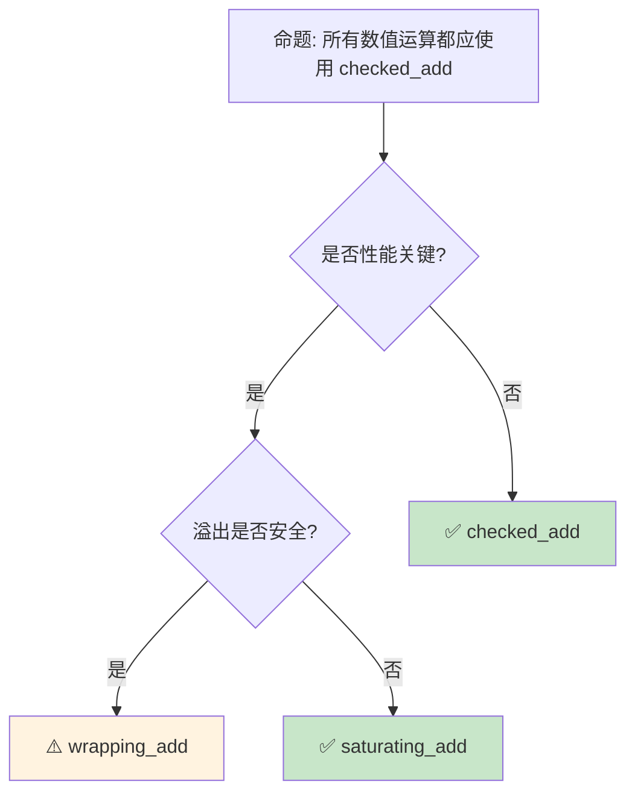

# 数值类型与运算：从整数到浮点的完整图景

> **Bloom 层级**: 记忆 → 理解
> **定位**: 系统讲解 Rust **数值类型**——从整数、浮点、饱和运算到类型转换和溢出行为，揭示 Rust 如何在安全性与性能之间做出精确的设计选择。
> **前置概念**: [Type System](./04_type_system.md) · [Ownership](./01_ownership.md)
> **后置概念**: [Zero Cost Abstractions](./06_zero_cost_abstractions.md) · [Collections](./08_collections.md)

---

> **来源**: [Rust Reference — Types](https://doc.rust-lang.org/reference/types.html) · [TRPL — Data Types](https://doc.rust-lang.org/book/ch03-02-data-types.html) · [std::num](https://doc.rust-lang.org/std/num/) · [RFC 0560 — Integer Overflow](https://github.com/rust-lang/rfcs/blob/master/text/0560-integer-overflow.md) · [IEEE 754](https://en.wikipedia.org/wiki/IEEE_754)

## 📑 目录
> [来源: [TRPL](https://doc.rust-lang.org/book/)]

- [数值类型与运算：从整数到浮点的完整图景](#数值类型与运算从整数到浮点的完整图景)
  - [📑 目录](#-目录)
  - [一、核心概念](#一核心概念)
    - [1.1 整数类型全景](#11-整数类型全景)
    - [1.2 浮点类型与 IEEE 754](#12-浮点类型与-ieee-754)
    - [1.3 溢出行为与饱和运算](#13-溢出行为与饱和运算)
  - [二、技术细节](#二技术细节)
    - [2.1 类型转换与 as](#21-类型转换与-as)
    - [2.2 Wrapping、Saturating、Checked、Overflowing](#22-wrappingsaturatingcheckedoverflowing)
    - [2.3 NonZero 类型与优化](#23-nonzero-类型与优化)
  - [三、数值类型矩阵](#三数值类型矩阵)
  - [四、反命题与边界分析](#四反命题与边界分析)
    - [4.1 反命题树](#41-反命题树)
    - [4.2 边界极限](#42-边界极限)
  - [五、常见陷阱](#五常见陷阱)
  - [六、来源与延伸阅读](#六来源与延伸阅读)
  - [相关概念文件](#相关概念文件)

---

## 一、核心概念
> [来源: [Rust Reference](https://doc.rust-lang.org/reference/)]

### 1.1 整数类型全景

```text
Rust 整数类型:

  有符号整数:
  ┌──────────┬────────────┬──────────────────────────────┐
  │ 类型     │ 大小       │ 范围                         │
  ├──────────┼────────────┼──────────────────────────────┤
  │ i8       │ 1 字节     │ -128 ~ 127                   │
  │ i16      │ 2 字节     │ -32,768 ~ 32,767             │
  │ i32      │ 4 字节     │ -2.1e9 ~ 2.1e9               │
  │ i64      │ 8 字节     │ -9.2e18 ~ 9.2e18             │
  │ i128     │ 16 字节    │ -1.7e38 ~ 1.7e38             │
  │ isize    │ 指针大小   │ -2^(N-1) ~ 2^(N-1)-1         │
  └──────────┴────────────┴──────────────────────────────┘
> [来源: [TRPL](https://doc.rust-lang.org/book/)]

  无符号整数:
  ┌──────────┬────────────┬──────────────────────────────┐
  │ 类型     │ 大小       │ 范围                         │
  ├──────────┼────────────┼──────────────────────────────┤
  │ u8       │ 1 字节     │ 0 ~ 255                      │
  │ u16      │ 2 字节     │ 0 ~ 65,535                   │
  │ u32      │ 4 字节     │ 0 ~ 4.3e9                    │
  │ u64      │ 8 字节     │ 0 ~ 1.8e19                   │
  │ u128     │ 16 字节    │ 0 ~ 3.4e38                   │
  │ usize    │ 指针大小   │ 0 ~ 2^N-1                    │
  └──────────┴────────────┴──────────────────────────────┘
> [来源: [TRPL](https://doc.rust-lang.org/book/)]

  字面量表示:
  ├── 十进制: 98_222（下划线分隔可读性）
  ├── 十六进制: 0xff
  ├── 八进制: 0o77
  ├── 二进制: 0b1111_0000
  └── 类型后缀: 57u8, 0x1f_i64

  默认类型:
  └── 未标注类型的整数默认 i32
      // let x = 5;  // 类型: i32
```

> **认知功能**: Rust 的**显式整数类型**（无默认"int"）是类型安全的设计选择——它迫使开发者考虑数值的范围和符号，防止隐式截断。
> [来源: [Rust Reference — Integer Types](https://doc.rust-lang.org/reference/types/numeric.html#integer-types)]

---

### 1.2 浮点类型与 IEEE 754

```text
Rust 浮点类型 (IEEE 754 标准):

  ┌──────────┬────────────┬─────────────────────────────────┐
  │ 类型     │ 大小       │ 精度                            │
  ├──────────┼────────────┼─────────────────────────────────┤
  │ f32      │ 4 字节     │ ~7 位十进制数                   │
  │ f64      │ 8 字节     │ ~15 位十进制数                  │
  └──────────┴────────────┴─────────────────────────────────┘
> [来源: [TRPL](https://doc.rust-lang.org/book/)]

  默认类型: f64（现代 64 位 CPU 上 f64 与 f32 速度相同）

  特殊值:
  ├── NaN (Not a Number): f64::NAN
  ├── 正无穷: f64::INFINITY
  ├── 负无穷: f64::NEG_INFINITY
  └── 正负零: +0.0, -0.0（不同位模式）

  注意事项:
  ├── 浮点比较: a == b 通常不可靠
  │   └── 应使用 (a - b).abs() < epsilon
  ├── 无总序: NaN != NaN
  │   └── 使用 total_cmp() 获得总序
  └── 精度损失: 0.1 + 0.2 != 0.3

  字面量:
  ├── 3.14, -2.5
  ├── 科学计数法: 1.2e5
  └── 必须有小数点或指数: 5f64, 5.0
```

> **浮点洞察**: Rust 的 `f64` 默认选择反映了**"安全优先"**的设计哲学——在大多数平台上 f64 不比 f32 慢，但精度翻倍。
> [来源: [IEEE 754 Wikipedia](https://en.wikipedia.org/wiki/IEEE_754)]

---

### 1.3 溢出行为与饱和运算

```rust,ignore
// 整数溢出行为（release vs debug）

// Debug 模式: 溢出 panic!
let x: u8 = 255;
// let y = x + 1;  // debug: panic!，release: wrapping

// 显式控制溢出行为:
use std::num::Wrapping;

let x = Wrapping(255u8);
let y = x + Wrapping(1);  // Wrapping(0)，不 panic

// 四种溢出处理方法:
let a: u8 = 200;
let b: u8 = 100;

// 1. wrapping: 回绕（模运算）
a.wrapping_add(b);  // 44 (300 % 256)

// 2. saturating: 饱和（限制在范围内）
a.saturating_add(b);  // 255 (u8::MAX)

// 3. checked: 返回 Option
a.checked_add(b);  // None（溢出时）

// 4. overflowing: 返回 (值, 是否溢出)
a.overflowing_add(b);  // (44, true)

// 使用场景:
// - wrapping: 位运算、哈希、游戏循环计数器
// - saturating: 图像处理、音频、保证不溢出
// - checked: 算术运算，溢出时优雅处理
// - overflowing: 多精度算术、进位传播
```

> **溢出洞察**: Rust 的**显式溢出方法**将 C/C++ 的"未定义行为"转化为**明确的选择**——开发者必须显式选择溢出语义。
> [来源: [RFC 0560 — Integer Overflow](https://github.com/rust-lang/rfcs/blob/master/text/0560-integer-overflow.md)]

---

## 二、技术细节
> [来源: [TRPL](https://doc.rust-lang.org/book/)]

### 2.1 类型转换与 as

```rust,ignore
// Rust 的显式类型转换

// as: 可能截断的转换
let a: i32 = 300;
let b: i8 = a as i8;  // 44 (截断)

let c: f64 = 3.7;
let d: i32 = c as i32;  // 3 (截断小数)

// as 的转换矩阵:
┌─────────────────────────────────────────────────────┐
│ 从 \ 到  │ i8~i128 │ u8~u128 │ f32 │ f64 │ bool │ char │
├─────────────────────────────────────────────────────┤
│ i8~i128  │ ✅      │ ✅      │ ✅  │ ✅  │ ✅   │ ⚠️   │
│ u8~u128  │ ✅      │ ✅      │ ✅  │ ✅  │ ✅   │ ⚠️   │
│ f32, f64 │ ✅(截断)│ ✅(截断)│ ✅  │ ✅  │ ❌   │ ❌   │
│ bool     │ ✅      │ ✅      │ ✅  │ ✅  │ -    │ ❌   │
│ char     │ ✅      │ ✅      │ ✅  │ ✅  │ ❌   │ -    │
└─────────────────────────────────────────────────────┘
> [来源: [TRPL](https://doc.rust-lang.org/book/)]

// From/Into: 安全、无截断的转换
let a: i32 = 42;
let b: i64 = a.into();  // ✅ 自动推导目标类型

let c: u32 = 42;
// let d: i32 = c.into();  // ❌ 编译错误！可能溢出

// TryFrom/TryInto: 可能失败的转换
use std::convert::TryInto;
let e: i64 = 300;
let f: i8 = e.try_into()?;  // Err(Overflow)!

// 最佳实践:
// - 窄化转换（可能丢失数据）: 使用 try_into() 或 checked
// - 拓宽转换（安全）: 使用 into()
// - 位模式转换: 使用 as
```

> **转换洞察**: Rust 的**显式转换**（`as`、`From`、`TryFrom`）消除了 C/C++ 的**隐式类型转换陷阱**。
> [来源: [std::convert](https://doc.rust-lang.org/std/convert/index.html)]

---

### 2.2 Wrapping、Saturating、Checked、Overflowing

```rust,ignore
// 四种溢出处理方法的对比

use std::num::{Wrapping, Saturating};

// Wrapping 类型（代数包装）
let a = Wrapping(250u8);
let b = Wrapping(10u8);
assert_eq!((a + b).0, 4);  // (250 + 10) % 256 = 4

// Saturating 类型（边界限制）
let c = Saturating(250u8);
let d = Saturating(10u8);
assert_eq!((c + d).0, 255);  // 饱和到 u8::MAX

// Checked 方法（返回 Option）
let e: u8 = 250;
assert_eq!(e.checked_add(10), None);
assert_eq!(e.checked_add(5), Some(255));

// Overflowing 方法（返回进位）
let f: u8 = 250;
let (result, overflowed) = f.overflowing_add(10);
assert_eq!(result, 4);
assert!(overflowed);

// 何时使用:
┌────────────────┬────────────────────────────────────────┐
│ 方法           │ 使用场景                               │
├────────────────┼────────────────────────────────────────┤
│ wrapping_add   │ 位运算、哈希、计数器回绕               │
│ saturating_add │ 图像/音频处理、保证不 panic            │
│ checked_add    │ 通用算术、安全敏感代码                 │
│ overflowing_add│ 多精度算术、进位传播                   │
└────────────────┴────────────────────────────────────────┘
```

> **方法洞察**: 四种方法覆盖了**所有合理的溢出语义**——从数学正确性（checked）到性能（wrapping）到安全性（saturating）。
> [来源: [std::num::Wrapping](https://doc.rust-lang.org/std/num/struct.Wrapping.html)]

---

### 2.3 NonZero 类型与优化

```rust,ignore
use std::num::{NonZeroU32, NonZeroU64};

// NonZero 类型: 保证值不为零
let size = NonZeroU32::new(1024).unwrap();
// let bad = NonZeroU32::new(0);  // 返回 None

// 核心价值:  niche value optimization
// Option<NonZeroU32> 只需 4 字节（不是 8 字节）
// 因为 0 被用作 None 的表示

// 内存布局对比:
// Option<u32>:     tag (4/8 bytes) + u32 (4 bytes) = 8/12 bytes
// Option<NonZeroU32>: 直接使用 0 表示 None = 4 bytes

// 使用场景:
// - 大小/长度（通常不为 0）
// - 指针（NonNull<T>）
// - 持续时间、容量

// 与指针优化的关系:
// Option<&T>: 使用 null 指针表示 None（同为 niche optimization）
// Option<NonNull<T>>: 双重优化
```

> **NonZero 洞察**: `NonZero` 类型是 Rust **类型系统与优化**结合的经典案例——编译器利用**niche value**（零）压缩 `Option<T>` 的表示。
> [来源: [std::num::NonZeroU32](https://doc.rust-lang.org/std/num/struct.NonZeroU32.html)]

---

## 三、数值类型矩阵
> [来源: [TRPL](https://doc.rust-lang.org/book/)]

```text
数值类型选择指南:

  计数/索引:
  ├── 数组索引: usize（平台指针大小）
  ├── 集合大小: usize
  └── 循环计数: i32/i64（视范围而定）

  文件/网络:
  ├── 文件大小: u64（大文件支持）
  ├── 偏移量: u64 或 i64
  └── 协议字段: 根据协议规范精确类型

  科学计算:
  ├── 一般计算: f64（默认精度）
  ├── GPU/图形: f32（内存带宽）
  └── 高精度: 使用 decimal/rug crate

  嵌入式:
  ├── 寄存器: u8/u16/u32（匹配硬件位宽）
  ├── 标志位: u8（位运算）
  └── 传感器值: i16/i32（ADC 分辨率）

  财务:
  ├── ❌ 不使用浮点！
  ├── ✅ 使用整数（分/厘为单位）
  └── 或使用 rust_decimal 等库
```

> **类型选择**: Rust 的**精确数值类型**迫使开发者思考数值的真实语义——这是避免整数溢出和精度错误的**第一道防线**。
> [来源: [Rust API Guidelines — Type Safety](https://rust-lang.github.io/api-guidelines/type-safety.html)]

---

## 四、反命题与边界分析
> [来源: [Rust Reference](https://doc.rust-lang.org/reference/)]

### 4.1 反命题树



> **认知功能**: 数值运算方法的选择是一个**三元权衡**——性能（wrapping）、安全（checked）、可用性（saturating）。
> [来源: [RFC 0560 — Integer Overflow](https://github.com/rust-lang/rfcs/blob/master/text/0560-integer-overflow.md)]

---

### 4.2 边界极限

```text
边界 1: 浮点精度
├── f32 只有 ~7 位十进制精度
├── f64 只有 ~15 位十进制精度
├── 财务计算绝对不能用浮点
└── 需要精确十进制: 使用 rust_decimal 或 bigdecimal

边界 2: 整数除法
├── Rust 整数除法向零截断（不是向下取整）
├── -5 / 2 = -2（不是 -3）
├── 与 Python 的 // 不同
└── 需要向下取整: 使用 .div_euclid()

边界 3: 移位操作的位数
├── 1u32 << 32 在 debug 模式 panic
├── 在 release 模式 wrapping（位数模运算）
├── 与 C 的未定义行为不同
└── Rust 明确定义为 wrapping

边界 4: char 到整数的转换
├── 'A' as u8 = 65（ASCII）
├── '中' as u8 截断为低位
├── 非 ASCII 字符用 as 会丢失信息
└── 使用 encode_utf8() 获取 UTF-8 字节

边界 5: usize/isize 的平台依赖
├── 32 位平台: 4 字节
├── 64 位平台: 8 字节
├── 序列化到文件时大小不固定
└── 使用 u64/i64 进行跨平台数据交换
```

> **边界要点**: 数值运算的边界主要与**浮点精度**、**整数除法语义**、**移位位数**、**char 转换**和**平台依赖**相关。
> [来源: [Rust Reference — Operator Expressions](https://doc.rust-lang.org/reference/expressions/operator-expr.html)]

---

## 五、常见陷阱

```text
陷阱 1: 隐式截断
  ❌ let x: u8 = 256;  // 编译错误（字面量溢出）
  ✅ let x: u8 = 255;   // 正确

陷阱 2: as 的隐式截断
  ❌ let x: i32 = -1;
     let y: u32 = x as u32;  // 4294967295！
  ✅ 窄化转换使用 try_into()
     let y: u32 = x.try_into()?;

陷阱 3: 浮点比较
  ❌ if x == 0.1 { ... }  // 不可靠
  ✅ if (x - 0.1).abs() < f64::EPSILON { ... }

陷阱 4: 忘记 checked 在算术运算中
  ❌ let sum = a + b;  // debug 可能 panic
  ✅ let sum = a.checked_add(b)?;

陷阱 5: usize 与 u32 混淆
  ❌ fn process(data: &[u8], index: u32) { data[index]; }
     // 可能越界（u32 > usize 在 32 位平台）
  ✅ fn process(data: &[u8], index: usize) { data[index]; }

陷阱 6: 除以零
  ❌ let x = 1 / 0;  // panic！
  ✅ let x = 1.checked_div(0);  // None
```

> **陷阱总结**: 数值陷阱主要与**截断**、**类型转换**、**浮点比较**、**溢出**和**索引类型**相关。
> [来源: [Rust Reference — Numeric Types](https://doc.rust-lang.org/reference/types/numeric.html)]

---

## 六、来源与延伸阅读

| 来源 | 可信度 | 说明 |
|:---|:---:|:---|
| [Rust Reference — Numeric Types](https://doc.rust-lang.org/reference/types/numeric.html) | ✅ 一级 | 数值类型参考 |
| [TRPL — Data Types](https://doc.rust-lang.org/book/ch03-02-data-types.html) | ✅ 一级 | 基础教程 |
| [RFC 0560 — Integer Overflow](https://github.com/rust-lang/rfcs/blob/master/text/0560-integer-overflow.md) | ✅ 一级 | 溢出行为 RFC |
| [std::num](https://doc.rust-lang.org/std/num/) | ✅ 一级 | 数值模块 |
| [IEEE 754](https://en.wikipedia.org/wiki/IEEE_754) | ✅ 一级 | 浮点标准 |

---

## 相关概念文件
> [来源: [Rust Reference](https://doc.rust-lang.org/reference/)]

- [Type System](./04_type_system.md) — 类型系统
- [Zero Cost Abstractions](./06_zero_cost_abstractions.md) — 零成本抽象
- [Collections](./08_collections.md) — 集合类型

---

> **权威来源**: [Rust Reference](https://doc.rust-lang.org/reference/), [The Rust Programming Language](https://doc.rust-lang.org/book/)
>
> **权威来源对齐变更日志**: 2026-05-22 创建 [来源: Authority Source Sprint Batch 9]

**文档版本**: 1.0
**对应 Rust 版本**: 1.96.0+ (Edition 2024)
**最后更新**: 2026-05-22
**状态**: ✅ 概念文件创建完成
