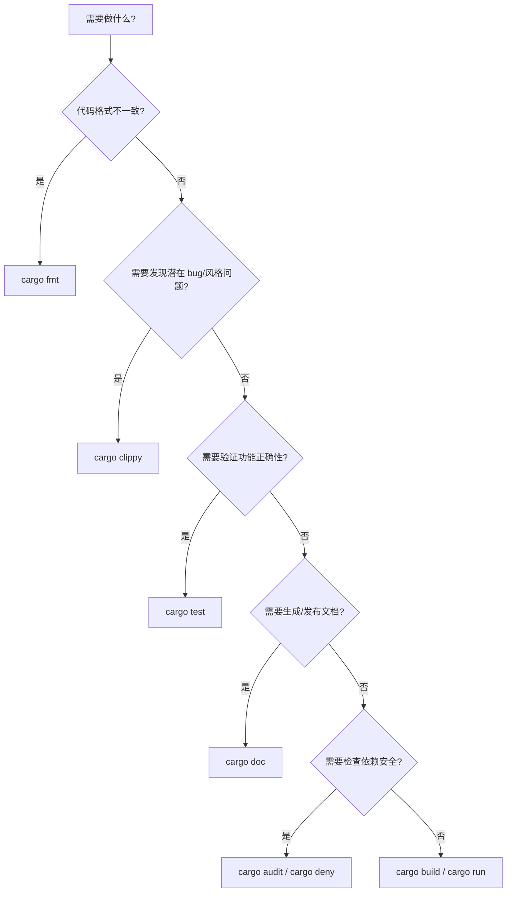

# 常用开发工具（Useful Development Tools）

> **EN**: Useful Development Tools
> **Summary**: A tour of the Rust toolchain and ecosystem tooling: rustfmt, clippy, rustdoc, cargo, rust-analyzer, plus popular community plugins like cargo-watch, cargo-expand, cargo-audit, and cargo-deny, with configuration examples and CI workflow guidance.
> **Rust 版本**: 1.97.0+ (Edition 2024)
>
> **受众**: [初学者]
> **内容分级**: [参考级]
> **Bloom 层级**: L1-L2
> **权威来源**: 本文件为 `concept/` 权威页。
> **A/S/P 标记**: **A** — Application
> **双维定位**: E×Tool — 工具链与生态系统
> **前置依赖**: [Toolchain](../../06_ecosystem/00_toolchain/01_toolchain.md) · [Cargo Getting Started](../../06_ecosystem/01_cargo/15_cargo_getting_started.md)
> **后置概念**:
> [Testing Basics](01_testing_basics.md) ·
> [Documentation](../../06_ecosystem/09_testing_and_quality/02_documentation.md) ·
> [DevOps and CI/CD](../../06_ecosystem/00_toolchain/03_devops_and_ci_cd.md) ·
> [Cargo Subcommands](../../06_ecosystem/01_cargo/12_cargo_subcommands_and_plugins.md)
> **L0 基础入口**:
> [Hello World / 00_start](../00_start/00_start.md) ·
> [Cargo Getting Started](../../06_ecosystem/01_cargo/15_cargo_getting_started.md)
> **定理链**: Source Code → Formatter → Linter → Tester → Documenter → Distributor
>
> **来源**:
> [The Rust Programming Language — Appendix D: Useful Development Tools](https://doc.rust-lang.org/book/appendix-04-useful-development-tools.html) ·
> [Cargo Book](https://doc.rust-lang.org/cargo/index.html) ·
> [Rust Analyzer Manual](https://rust-analyzer.github.io/manual.html)

---

## 📑 目录

- [常用开发工具（Useful Development Tools）](#常用开发工具useful-development-tools)
  - [📑 目录](#-目录)
  - [认知路径](#认知路径)
  - [反命题决策树](#反命题决策树)
  - [一、官方工具链](#一官方工具链)
  - [二、IDE 与编辑器支持](#二ide-与编辑器支持)
  - [三、开发工作流中的位置](#三开发工作流中的位置)
  - [四、配置示例](#四配置示例)
    - [`rustfmt.toml`](#rustfmttoml)
    - [`.clippy.toml`](#clippytoml)
    - [`Cargo.toml` 开发配置](#cargotoml-开发配置)
  - [五、社区常用工具](#五社区常用工具)
  - [六、与 CI 的集成](#六与-ci-的集成)
  - [七、工具选择决策树](#七工具选择决策树)
  - [八、相关概念](#八相关概念)
  - [过渡段](#过渡段)
  - [反向推理](#反向推理)
  - [📋 关键属性](#-关键属性)
  - [🔗 概念关系](#-概念关系)
  - [国际权威参考 / International Authority References（P1 学术 · P2 生态）](#国际权威参考--international-authority-referencesp1-学术--p2-生态)
  - [⚠️ 反例与陷阱：debug 构建下整数溢出 panic（运行时陷阱）](#️-反例与陷阱debug-构建下整数溢出-panic运行时陷阱)

---

## 认知路径

1. **问题识别**: 为什么 Rust 开发需要 rustfmt、clippy、rust-analyzer 等专用工具？它们各自解决什么问题？
2. **概念建立**: 掌握官方工具链与社区生态工具的用途、命令与配置方式。
3. **机制推理**: 通过 ⟹ 定理链将代码编写、格式化、lint、测试、文档、发布串联为可重复工作流。
4. **边界辨析**: 借助反命题/反例理解 linter 误报、格式化冲突、工具版本绑定等边界情况。
5. **迁移应用**: 将这些工具集成到 [测试](01_testing_basics.md)、[文档](../../06_ecosystem/09_testing_and_quality/02_documentation.md)、[CI/CD](../../06_ecosystem/00_toolchain/03_devops_and_ci_cd.md) 中。

---

## 反命题决策树

> **反命题 1**: "有了 rust-analyzer 就不需要运行 `cargo build`" ⟹ 不成立。IDE 提供快速反馈，但最终正确性仍需编译器确认。
> **反命题 2**: "Clippy 的所有建议都必须遵循" ⟹ 不成立。部分 lint 在特定场景下需要 `#[allow(...)]` 抑制。
> **反命题 3**: "开发工具版本可以任意落后于编译器" ⟹ 不成立。rust-analyzer、clippy 通常需要与当前工具链版本匹配。

---

## 一、官方工具链

> (Source: [TRPL — Appendix D](https://doc.rust-lang.org/book/appendix-04-useful-development-tools.html))

| 工具 | 作用 | 常用命令 |
|:---|:---|:---|
| `rustfmt` | 自动格式化代码 | `cargo fmt` |
| `clippy` | 静态分析与 lint | `cargo clippy` |
| `rustdoc` | 生成文档 | `cargo doc` |
| `cargo` | 构建、测试、依赖管理 | `cargo build`, `cargo test` |
| `rustc` | Rust 编译器 | `rustc main.rs` |

---

## 二、IDE 与编辑器支持

> (Source: [Rust Analyzer Manual](https://rust-analyzer.github.io/manual.html))

**rust-analyzer** 是官方推荐的 Rust 语言服务器，提供：

- 自动补全
- 跳转定义
- 类型提示
- 内联错误诊断
- 重构辅助

主流编辑器（VS Code、Vim/Neovim、Emacs、IntelliJ Rust）均支持 rust-analyzer。

VS Code 推荐配置：

```json
{
    "rust-analyzer.checkOnSave.command": "clippy",
    "rust-analyzer.checkOnSave.allTargets": true,
    "rust-analyzer.cargo.features": "all"
}
```

---

## 三、开发工作流中的位置


---

## 四、配置示例

本节给出三份生产可用的配置文件模板与关键项说明：

- **`rustfmt.toml`**：`edition = "2024"`、`max_width = 100`、`group_imports = "StdExternalCrate"`——团队统一的核心是「全量纳入 CI 检查（`cargo fmt --check`）」，配置项越少争议越少；
- **`.clippy.toml`**：`msrv = "1.97"`（让 clippy 只建议当前 MSRV 可用的写法）、`cognitive-complexity-threshold` 等阈值项——配合 CI 的 `cargo clippy -- -D warnings` 形成强制基线；
- **`Cargo.toml` 开发配置**：`[profile.dev] opt-level = 1`（调试与编译速度的平衡点）、`[profile.dev.package."*"] opt-level = 3`（只优化依赖，测试/基准不再痛苦）。

配置原则：先默认后定制——每个非默认项都应有注释说明「为什么默认不够好」，否则删除回归默认。

### `rustfmt.toml`

```toml
edition = "2024"
max_width = 100
tab_spaces = 4
use_small_heuristics = "Default"
reorder_imports = true
```

### `.clippy.toml`

```toml
avoid-breaking-exported-api = true
msrv = "1.85.0"
```

### `Cargo.toml` 开发配置

```toml
[package]
name = "myapp"
version = "0.1.0"
edition = "2024"
rust-version = "1.85"

[dev-dependencies]
assert_cmd = "2"
predicates = "3"
```

---

## 五、社区常用工具

| 工具 | 作用 | 安装/使用 |
|:---|:---|:---|
| `cargo-watch` | 文件变动自动重跑命令 | `cargo install cargo-watch`; `cargo watch -x check` |
| `cargo-expand` | 展开宏（Macro）查看生成代码 | `cargo install cargo-expand`; `cargo expand` |
| `cargo-audit` | 检查依赖安全漏洞 | `cargo install cargo-audit`; `cargo audit` |
| `cargo-deny` | 许可证/漏洞/依赖策略检查 | `cargo install cargo-deny`; `cargo deny check` |
| `cargo-outdated` | 列出可更新的依赖 | `cargo install cargo-outdated`; `cargo outdated` |
| `cargo-udeps` | 发现未使用的依赖 | `cargo install cargo-udeps`; `cargo udeps` |

---

## 六、与 CI 的集成

典型 CI 流水线：

```bash
cargo fmt --check
cargo clippy -- -D warnings
cargo test --all-targets
cargo doc --no-deps
cargo audit
```

GitHub Actions 示例：

```yaml
name: CI
on: [push, pull_request]
jobs:
  test:
    runs-on: ubuntu-latest
    steps:
      - uses: actions/checkout@v4
      - uses: dtolnay/rust-toolchain@stable
        with:
          components: rustfmt, clippy
      - run: cargo fmt --check
      - run: cargo clippy -- -D warnings
      - run: cargo test
      - run: cargo doc --no-deps
```

---

## 七、工具选择决策树



---

## 八、相关概念

| 概念 | 关系 |
|:---|:---|
| [Testing Basics](01_testing_basics.md) | `cargo test` 的详细用法 |
| [Toolchain](../../06_ecosystem/00_toolchain/01_toolchain.md) | rustup 与组件管理 |
| [Cargo Getting Started](../../06_ecosystem/01_cargo/15_cargo_getting_started.md) | Cargo 基础命令与项目结构 |
| [Documentation](../../06_ecosystem/09_testing_and_quality/02_documentation.md) | `cargo doc` 与文档测试 |
| [DevOps and CI/CD](../../06_ecosystem/00_toolchain/03_devops_and_ci_cd.md) | 持续集成中的工具链配置 |
| [Cargo Subcommands](../../06_ecosystem/01_cargo/12_cargo_subcommands_and_plugins.md) | 扩展 Cargo 的插件生态 |
| [Learning Guide](../../00_meta/04_navigation/07_learning_guide.md) | 工具学习在整体学习路径中的位置 |
| [Terminology Glossary](../../00_meta/01_terminology/01_terminology_glossary.md) | rustfmt/clippy 等工具术语的权威对照 |

---

> **权威来源**: [TRPL — Appendix D](https://doc.rust-lang.org/book/appendix-04-useful-development-tools.html) · [Rust Analyzer Manual](https://rust-analyzer.github.io/manual.html) · [Cargo Book](https://doc.rust-lang.org/cargo/index.html)

## 过渡段

> **过渡**: 从 rustfmt 格式化过渡到 clippy lint，可以理解“先统一风格、再捕获潜在问题”的代码质量流程。
>
> **过渡**: 从静态检查过渡到测试与文档工具，可以建立“写—查—测—文档”的完整工作流。
>
> **过渡**: 从本地工具过渡到 CI/CD 集成，可以将个人开发习惯转化为团队交付标准。
>

## 反向推理

> **反向推理**: CI 报告风格不一致 ⟸ 说明未在 CI 中统一运行 `rustfmt --check`。
>
> **反向推理**: 出现本可避免的常见错误 ⟸ 说明 clippy 未启用或未处理 warn 级别提示。
>

---

## 📋 关键属性

| 属性 | 取值 / 判定 | 依据 |
|---|---|---|
| 官方工具链 | rustup / cargo / rustc / rustfmt / clippy / rustdoc 六位一体 | 本文 §一 |
| IDE 支持 | rust-analyzer 提供补全、内联诊断与重构 | 本文 §二 |
| 可配置性 | `rustfmt.toml` / `.clippy.toml` / Cargo profile 分层定制 | 本文 §四 |
| CI 集成 | fmt / clippy / test / doc 可全部纳入 CI 质量门 | 本文 §六 |
| 选型路径 | 按「格式 → lint → 测试 → 文档」流水线决策 | 本文 §七 决策树 |

## 🔗 概念关系

- **上位（is-a）**：Rust 开发者工具生态的总览页。
- **下位（实例）**：rustfmt、clippy、rust-analyzer、rustdoc、cargo 子命令与社区工具。
- **组合**：与 [Crates 与源文件](../07_modules_and_items/11_crates_and_source_files.md)（cargo 工作区）、[`assert_matches!`](../../02_intermediate/06_macros_and_metaprogramming/01_assert_matches.md)（测试断言宏）组合。
- **依赖**：依赖 cargo 的构建与包管理能力。

---

## 国际权威参考 / International Authority References（P1 学术 · P2 生态）

> 依据 `AGENTS.md` §2「对齐网络国际化权威内容」补充：仅追加已验证可达的权威链接，不改动正文事实。

- **P1 学术/形式化**: [Bae et al.: RUDRA — Finding Memory Safety Bugs in Rust at the Ecosystem Scale（SOSP 2021；部分算法已集成进官方 Clippy）](https://dl.acm.org/doi/10.1145/3477132.3483570)（2026-07-12 验证可访问，ACM DOI 页面）
- **P2 生态/社区**: [docs.rs/criterion — 生态权威 API 文档](https://docs.rs/criterion) · [docs.rs/proptest — 生态权威 API 文档](https://docs.rs/proptest)

---

## ⚠️ 反例与陷阱：debug 构建下整数溢出 panic（运行时陷阱）

**反例**（运行时陷阱，代码可通过编译）：

```rust
fn main() {
    let a: u8 = 200;
    let b = std::hint::black_box(100u8);
    let c = a + b;
    println!("{c}");
}
```

debug 构建（`cargo test` 默认）开启溢出检查，`u8` 的 `200 + 100` 在运行时 panic；release 构建则静默回绕为 44，行为随 profile 变化是常见测试陷阱。（用 `black_box` 阻止编译期常量折叠，确保溢出发生在运行时。）

**修正**：

```rust
fn main() {
    let a: u8 = 200;
    let b = a.wrapping_add(100); // 显式回绕：44
    let c = a.checked_add(100);  // 显式检查：None
    println!("{b} {c:?}");
}
```
