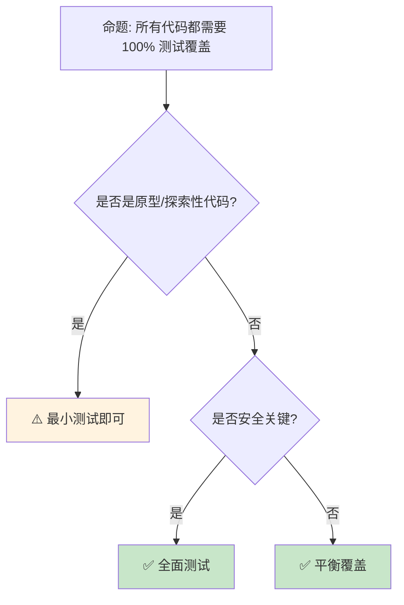

> **生态状态提示**：
>
> 本文档提及 `async-std` 与/或 `wasm32-wasi`。请注意：
>
> - `async-std` 项目已进入维护模式，2024 年后不再活跃开发；新项目建议优先评估 **Tokio** 或 **smol**。
> - `wasm32-wasi` 旧目标名已重命名为 **`wasm32-wasip1`**；WASI Preview 2 对应目标为 **`wasm32-wasip2`**。

---

> **内容分级**: [综述级]
> **本节关键术语**: 测试 (Testing) · 单元测试 (Unit Test) · 集成测试 (Integration Test) · assert · #[cfg(test)] — [完整对照表](../../00_meta/01_terminology/terminology_glossary.md)
>
# 测试基础：从单元测试到集成测试
>
> **EN**: Testing
> **Summary**: Testing. Core Rust concept covering testing strategies, mechanism analysis.
> **受众**: [初学者]
> **Bloom 层级**: 应用 → 分析
> **A/S/P 标记**: **A+P** — Application + Procedure
> **双维定位**: P×App — 实施测试策略和验证方法
> **定位**: 系统讲解 Rust **测试机制**——从单元测试、集成测试到文档测试和基准测试，揭示 Rust 如何内置测试文化并支持多种测试层级。
> **前置概念**: [Ownership](../01_ownership_borrow_lifetime/01_ownership.md) · [Modules](../07_modules_and_items/11_modules_and_paths.md) · [Error Handling](../../02_intermediate/03_error_handling/16_error_handling_deep_dive.md)
> **后置概念**: [Testing Strategies](../../06_ecosystem/09_testing_and_quality/16_testing.md) · [Security Practices](../../06_ecosystem/07_security_and_cryptography/19_security_practices.md)

---

> **来源**: [TRPL — Testing](https://doc.rust-lang.org/book/ch11-00-testing.html) · · [Herlihy & Shavit — The Art of Multiprocessor Programming](https://dl.acm.org/doi/10.5555/2385452) · [Batty et al. — The Semantics of Multicore C](https://doi.org/10.1145/2049706.2049711) · [Brown University — Concepts in Rust Programming](https://cel.cs.brown.edu/crp/) · [MIT 6.824 — Distributed Systems](https://pdos.csail.mit.edu/6.824/) · [Itanium C++ ABI](https://itanium-cxx-abi.github.io/cxx-abi/abi.html) · [Jung et al. — RustBelt: Securing the Foundations of Rust](https://plv.mpi-sws.org/rustbelt/popl18/)
> [Rust Reference — Attributes](https://doc.rust-lang.org/reference/attributes/testing.html) ·
> [cargo test](https://doc.rust-lang.org/cargo/commands/cargo-test.html) ·
> [Rust By Example — Testing](https://doc.rust-lang.org/rust-by-example/testing.html) ·
> [Wikipedia — Unit Testing](https://en.wikipedia.org/wiki/Unit_testing)

## 📑 目录

- [测试基础：从单元测试到集成测试](#测试基础从单元测试到集成测试)
  - [📑 目录](#-目录)
  - [一、核心概念](#一核心概念)
    - [1.1 Rust 测试文化](#11-rust-测试文化)
    - [1.2 测试类型全景](#12-测试类型全景)
    - [1.3 测试的组织](#13-测试的组织)
  - [二、技术细节](#二技术细节)
    - [2.1 单元测试](#21-单元测试)
    - [2.2 集成测试](#22-集成测试)
    - [2.3 文档测试](#23-文档测试)
  - [三、测试模式矩阵](#三测试模式矩阵)
  - [四、反命题与边界分析](#四反命题与边界分析)
    - [4.1 反命题树](#41-反命题树)
    - [4.2 边界极限](#42-边界极限)
  - [五、常见陷阱](#五常见陷阱)
  - [六、来源与延伸阅读](#六来源与延伸阅读)
  - [相关概念文件](#相关概念文件)
  - [权威来源索引](#权威来源索引)
    - [10.3 边界测试：`should_panic` 的预期消息匹配（运行时测试失败）](#103-边界测试should_panic-的预期消息匹配运行时测试失败)
    - [10.4 边界测试：集成测试的模块可见性（编译错误）](#104-边界测试集成测试的模块可见性编译错误)
    - [10.5 边界测试：`#[should_panic]` 的预期消息匹配（测试失败）](#105-边界测试should_panic-的预期消息匹配测试失败)
    - [10.6 边界测试：集成测试的模块可见性与 `pub` 要求（编译错误）](#106-边界测试集成测试的模块可见性与-pub-要求编译错误)
  - [嵌入式测验（Embedded Quiz）](#嵌入式测验embedded-quiz)
    - [测验 1：单元测试通常放在哪里？集成测试又应该放在项目的哪个目录？（理解层）](#测验-1单元测试通常放在哪里集成测试又应该放在项目的哪个目录理解层)
    - [测验 2：`assert_eq!(a, b)` 与 `assert!(a == b)` 在测试失败时的输出有什么区别？（理解层）](#测验-2assert_eqa-b-与-asserta--b-在测试失败时的输出有什么区别理解层)
    - [测验 3：如何编写一个期望测试函数 panic 的测试？如何进一步检查 panic 消息是否包含特定子串？（理解层）](#测验-3如何编写一个期望测试函数-panic-的测试如何进一步检查-panic-消息是否包含特定子串理解层)
    - [测验 4：集成测试能否访问 crate 中的私有类型和函数？如果不能，有哪些替代方案？（理解层）](#测验-4集成测试能否访问-crate-中的私有类型和函数如果不能有哪些替代方案理解层)
    - [测验 5：运行 `cargo test` 时，测试默认是并行还是串行执行？如何强制串行执行？（理解层）](#测验-5运行-cargo-test-时测试默认是并行还是串行执行如何强制串行执行理解层)
  - [实践](#实践)
  - [认知路径](#认知路径)
    - [核心推理链](#核心推理链)
    - [反命题与边界](#反命题与边界)

---

## 一、核心概念
>
>

### 1.1 Rust 测试文化
>

```text
Rust 的测试内置机制:

  零配置:
  ├── cargo test 自动发现测试
  ├── 无需外部测试框架
  ├── 内置断言宏
  └── 与编译器深度集成

  测试即文档:
  ├── 文档测试运行代码示例
  ├── 确保示例不过时
  ├── 双重价值: 测试 + 文档
  └── Rustdoc 集成

  测试层级:
  ├── 单元测试: 测试单个函数/模块
  ├── 集成测试: 测试 crate 外部接口
  ├── 文档测试: 测试代码示例
  └── 基准测试: 测量性能

  与其他语言的对比:
  ┌─────────────────┬─────────────────┬─────────────────┐
  │ 特性            │ Rust            │ 其他语言        │
  ├─────────────────┼─────────────────┼─────────────────┤
  │ 内置测试        │ ✅ 原生          │ 通常需框架      │
  │ 文档测试        │ ✅ 原生          │ 罕见            │
  │ 并发测试        │ ✅ 默认并行      │ 通常串行        │
  │ 零配置          │ ✅ cargo test    │ 需配置          │
  │ 编译期检查      │ ✅ 类型安全      │ 运行时检查      │
  └─────────────────┴─────────────────┴─────────────────┘
```

> **认知功能**: Rust 的**测试是语言的一等公民**——不是事后添加的框架，而是编译器和工具链的核心功能。
> [来源: [TRPL — Testing](https://doc.rust-lang.org/book/ch11-00-testing.html)]

---

### 1.2 测试类型全景
>

```rust,ignore
// Rust 测试类型示例

// 1. 单元测试（在源码文件中）
#[cfg(test)]
mod tests {
    use super::*;

    #[test]
    fn it_works() {
        assert_eq!(2 + 2, 4);
    }

    #[test]
    #[should_panic(expected = "divide by zero")]
    fn test_panic() {
        let _ = 1 / 0;
    }

    #[test]
    #[ignore = "not yet implemented"]
    fn ignored_test() {
        // 默认不运行，cargo test --ignored 运行
    }
}

// 2. 集成测试（tests/ 目录）
// tests/integration_test.rs
use my_crate::add;

#[test]
fn test_add() {
    assert_eq!(add(2, 3), 5);
}

// 3. 文档测试（在文档注释中）
/// Adds two numbers.
///
/// # Examples
///
/// ```
/// let result = my_crate::add(2, 3);
/// assert_eq!(result, 5);
/// ```
pub fn add(a: i32, b: i32) -> i32 {
    a + b
}
```

> **类型洞察**: Rust 的**三层测试架构**（单元/集成/文档）覆盖了从内到外的完整验证需求。
> [来源: [Rust Reference — Test Attributes](https://doc.rust-lang.org/reference/attributes/testing.html)]

---

### 1.3 测试的组织
>

```text
测试目录结构:

  src/
  ├── lib.rs
  └── some_module.rs
      └── #[cfg(test)] mod tests { ... }

  tests/
  ├── integration_test.rs      # 集成测试 1
  ├── another_test.rs          # 集成测试 2
  └── common/mod.rs            # 共享测试辅助代码

  benches/
  └── my_benchmark.rs          # 基准测试（需 nightly 或 criterion）

  examples/
  └── simple.rs                # 可运行示例

  测试执行:
  ├── cargo test               # 运行所有测试
  ├── cargo test --lib         # 只运行单元测试
  ├── cargo test --test name   # 只运行指定集成测试
  ├── cargo test --doc         # 只运行文档测试
  ├── cargo test --ignored     # 运行被忽略的测试
  └── cargo test -- --nocapture # 显示 println! 输出
```

> **组织洞察**: **tests/ 目录的集成测试作为独立 crate 编译**——它们只能访问 public API，强制测试公共接口。
> [来源: [Cargo Book — Tests](https://doc.rust-lang.org/cargo/guide/tests.html)]

---

## 二、技术细节

### 2.1 单元测试
>

```rust
// 单元测试详解

pub struct Calculator;

impl Calculator {
    pub fn add(a: i32, b: i32) -> i32 { a + b }
    pub fn divide(a: i32, b: i32) -> Option<i32> {
        if b == 0 { None } else { Some(a / b) }
    }
}

#[cfg(test)]
mod tests {
    use super::*;

    // 基本断言
    #[test]
    fn test_add() {
        assert_eq!(Calculator::add(2, 3), 5);
        assert_ne!(Calculator::add(2, 2), 5);
        assert!(Calculator::add(1, 1) > 0);
    }

    // 测试 Option
    #[test]
    fn test_divide() {
        assert_eq!(Calculator::divide(10, 2), Some(5));
        assert_eq!(Calculator::divide(10, 0), None);
    }

    // 自定义错误消息
    #[test]
    fn test_with_message() {
        let result = Calculator::add(2, 2);
        assert_eq!(result, 4, "Expected 2 + 2 = 4, got {}", result);
    }

    // 使用 Result 的测试
    #[test]
    fn test_result() -> Result<(), String> {
        if Calculator::add(2, 2) == 4 {
            Ok(())
        } else {
            Err("Math is broken".to_string())
        }
    }

    // 共享设置
    fn setup() -> Calculator {
        Calculator
    }

    #[test]
    fn test_with_setup() {
        let calc = setup();
        assert_eq!(calc.add(1, 1), 2);
    }
}
```

> **单元测试洞察**: **#[cfg(test)] 模块（Module）可以访问父模块的私有项**——这是测试私有函数的标准方式。
> [来源: [TRPL — Unit Tests](https://doc.rust-lang.org/book/ch11-01-writing-tests.html)]

---

### 2.2 集成测试
>

```rust,ignore
// tests/integration_test.rs

use my_crate::Database;

#[test]
fn test_database_connection() {
    let db = Database::connect("test.db").unwrap();
    db.execute("CREATE TABLE test (id INTEGER)").unwrap();

    let result = db.query("SELECT * FROM test").unwrap();
    assert!(result.is_empty());
}

// 共享辅助代码
tests/
├── common/
│   ├── mod.rs
│   └── helpers.rs
├── integration_test.rs
└── api_test.rs

// tests/common/mod.rs
pub fn setup_test_db() -> Database {
    Database::connect(":memory:").unwrap()
}

// tests/integration_test.rs
mod common;

#[test]
fn test_with_common() {
    let db = common::setup_test_db();
    // ...
}

// 注意: tests/common/mod.rs 不会作为测试文件执行
// 只有 tests/*.rs 是测试入口
```

> **集成测试洞察**: **集成测试验证 crate 的公共 API**——它们确保对外承诺的行为实际工作。
> [来源: [TRPL — Integration Tests](https://doc.rust-lang.org/book/ch11-03-test-organization.html)]

---

### 2.3 文档测试
>

```rust,ignore
// 文档测试: 代码即文档，文档即测试

/// 计算斐波那契数列的第 n 项。
///
/// # Examples
///
/// 基本情况:
/// ```
/// assert_eq!(my_crate::fibonacci(0), 0);
/// assert_eq!(my_crate::fibonacci(1), 1);
/// ```
///
/// 递归情况:
/// ```
/// assert_eq!(my_crate::fibonacci(10), 55);
/// ```
///
/// # Panics
///
/// 当 `n` 大于 93 时会 panic，因为结果会溢出 `u64`：
///
/// ```should_panic
/// my_crate::fibonacci(94);
/// ```
pub fn fibonacci(n: u32) -> u64 {
    match n {
        0 => 0,
        1 => 1,
        _ => {
            if n > 93 { panic!("overflow") }
            fibonacci(n - 1) + fibonacci(n - 2)
        }
    }
}

// 文档测试属性:
// ├── ```          : 普通代码块（运行测试）
// ├── ```ignore    : 不运行（示例代码）
// ├── ```no_run    : 编译但不运行（可能 panic）
// ├── ```should_panic : 期望 panic
// ├── ```compile_fail : 期望编译失败
// └── ```edition2024  : 指定 Edition

// 隐藏代码:
/// ```
/// # fn main() {  // 隐藏但执行
/// let result = my_crate::foo();
/// # }
/// ```
```

> **文档测试洞察**: **文档测试是 Rust 的差异化特性**——它解决了"文档示例过时"的普遍问题。
> [来源: [Rustdoc — Documentation Tests](https://doc.rust-lang.org/rustdoc/write-documentation/documentation-tests.html)]

---

## 三、测试模式矩阵

```text
场景 → 测试类型 → 工具/技术

算法正确性:
  → 单元测试
  → assert_eq!, 边界条件
  → #[test] fn test_edge_cases()

API 契约:
  → 集成测试
  → 公开接口验证
  → tests/api_test.rs

并发安全:
  → 单元测试 + loom
  → 多线程场景
  → cargo test -- --test-threads=1

性能回归:
  → 基准测试
  → criterion
  → benches/bench.rs

文档准确性:
  → 文档测试
  → rustdoc --test
  → 代码注释中的 ```

属性测试:
  → proptest / quickcheck
  → 随机输入生成
  → 发现边界情况
```

> **模式矩阵**: Rust 的**测试生态覆盖了验证的完整谱系**——从快速单元测试到深度属性测试。
> [来源: [Rust Testing Best Practices](https://doc.rust-lang.org/rust-by-example/testing.html)]

---

## 四、反命题与边界分析

### 4.1 反命题树
>



> **认知功能**: **测试是投资**——在安全关键和长期维护的代码上回报最高，原型上可适度减少。
> [来源: [Rust API Guidelines — Testing](https://rust-lang.github.io/api-guidelines//documentation.html#examples-use--not-try-not-unwrap-c-example)]

---

### 4.2 边界极限
>

```text
边界 1: 测试并行执行
├── cargo test 默认并行运行
├── 共享资源（文件、数据库）冲突
├── 测试间可能互相影响
└── 缓解: #[serial] 属性，或独立资源

边界 2: 异步测试
├── 异步测试需要特殊运行时
├── tokio::test, async-std [已归档]::test
├── 阻塞 vs 非阻塞断言
└── 缓解: 使用 async 测试宏

边界 3: 外部依赖
├── 网络服务、数据库可用性
├── 测试环境配置复杂
├── 测试速度变慢
└── 缓解: mock, 内存数据库, HTTP 模拟

边界 4: 全局状态
├── 环境变量、静态变量
├── 测试顺序影响结果
├── 不可预测的行为
└── 缓解: 隔离状态，或串行执行

边界 5: 编译时间
├── 大量测试增加编译时间
├── #[cfg(test)] 代码仅在测试编译
├── 但集成测试作为独立 crate 编译
└── 缓解: 模块化，避免重复编译
```

> **边界要点**: 测试的边界主要与**并行执行**、**异步（Async）**、**外部依赖**、**全局状态**和**编译时间**相关。
> [来源: [Cargo Book — Test Targets](https://doc.rust-lang.org/cargo/reference/cargo-targets.html#tests)]

---

## 五、常见陷阱

```text
陷阱 1: 测试间共享可变状态
  ❌ static mut COUNTER: i32 = 0;
     #[test] fn test1() { unsafe { COUNTER += 1; } }
     #[test] fn test2() { unsafe { COUNTER += 1; } }
     // 并行执行导致数据竞争！

  ✅ 每个测试独立状态
     // 或使用 Mutex/Atomic

陷阱 2: 忽略编译失败的文档测试
  ❌ ```ignore
     // 代码不编译也不运行

  ✅ ```compile_fail
     // 验证编译失败（有错误信息匹配）

陷阱 3: 过度使用 unwrap 在测试
  ❌ let result = operation().unwrap();
     // 如果失败，测试 panic 信息不友好

  ✅ let result = operation().expect("operation should succeed");
     // 或使用 ? 在返回 Result 的测试中

陷阱 4: 测试与实现耦合
  ❌ 测试内部数据结构
     // 重构时测试频繁失败

  ✅ 测试公共行为
     // 只通过公共 API 验证

陷阱 5: 慢测试积累
  ❌ 大量集成测试访问网络/数据库
     // 反馈循环变慢

  ✅ 分层测试金字塔
     // 大量单元测试 + 少量集成测试
```

> **陷阱总结**: 测试的陷阱主要与**共享状态**、**文档测试属性**、**错误信息**、**耦合**和**速度**相关。
> [来源: [Rust Testing Guide](https://doc.rust-lang.org/rust-by-example/testing/unit_testing.html)]

---

## 六、来源与延伸阅读
>

| 来源 | 可信度 | 说明 |
|:---|:---:|:---|
| [TRPL — Testing](https://doc.rust-lang.org/book/ch11-00-testing.html) | ✅ 一级 | 基础教程 |
| [Rust Reference — Test Attributes](https://doc.rust-lang.org/reference/attributes/testing.html) | ✅ 一级 | 属性参考 |
| [Rustdoc — Doc Tests](https://doc.rust-lang.org/rustdoc/write-documentation/documentation-tests.html) | ✅ 一级 | 文档测试 |
| [Cargo Book — Tests](https://doc.rust-lang.org/cargo/guide/tests.html) | ✅ 一级 | Cargo 测试 |
| [criterion.rs](https://bheisler.github.io/criterion.rs/book/) | ✅ 一级 | 基准测试 |

---

## 相关概念文件

- [Modules](../07_modules_and_items/11_modules_and_paths.md) — 模块（Module）系统
- [Error Handling](../../02_intermediate/03_error_handling/16_error_handling_deep_dive.md) — 错误处理（Error Handling）
- [Testing Strategies](../../06_ecosystem/09_testing_and_quality/16_testing.md) — 测试策略
- [Security Practices](../../06_ecosystem/07_security_and_cryptography/19_security_practices.md) — 安全实践

---

> **权威来源**: [Rust Reference](https://doc.rust-lang.org/reference/introduction.html), [The Rust Programming Language](https://doc.rust-lang.org/book/ch11-00-testing.html)
>
> **权威来源对齐变更日志**: 2026-05-22 创建 [Authority Source Sprint Batch 10](../../00_meta/02_sources/international_authority_index.md)

**文档版本**: 1.0
**对应 Rust 版本**: 1.96.1+ (Edition 2024)
**最后更新**: 2026-05-22
**状态**: ✅ 概念文件创建完成

---

## 权威来源索引

>
>
>
>
>

---

---

---

> **补充来源**

### 10.3 边界测试：`should_panic` 的预期消息匹配（运行时测试失败）

```rust,ignore
#[test]
#[should_panic(expected = "divide by zero")]
fn test_divide_by_zero() {
    // ❌ 测试失败: panic 消息是 "attempt to divide by zero"，不完全匹配
    let _ = 1 / 0;
}
```

> **修正**: `#[should_panic(expected = "...")]` 检查 panic 消息是否**包含**指定子串，而非完全相等。`"divide by zero"` 不匹配 `"attempt to divide by zero"`（缺少前缀 `attempt to`），因此测试失败。正确写法：`#[should_panic(expected = "attempt to divide by zero")]` 或更宽松的 `#[should_panic]`（不检查消息）。`expected` 是子串匹配，因此可写关键部分：`"divide by zero"` 在旧版 Rust 中可能匹配（若消息恰好是此子串），但不可靠。测试 panic 的替代：`std::panic::catch_unwind`（在测试中捕获 panic，验证返回的 `Payload`），或 `std::panic::set_hook` 自定义 panic 处理。这与 Java 的 `assertThrows`（检查异常类型，不检查消息）或 Python 的 `pytest.raises`（可检查消息）类似——Rust 的 `should_panic` 是属性宏（Macro），简洁但功能有限。[来源: [The Rust Programming Language](https://doc.rust-lang.org/book/ch11-01-writing-tests.html)] · [来源: [Rust Reference — Testing](https://doc.rust-lang.org/reference/attributes/testing.html)]

### 10.4 边界测试：集成测试的模块可见性（编译错误）

```rust,compile_fail
// src/lib.rs
mod internal {
    pub fn helper() {}
}

// tests/integration_test.rs
use my_crate::internal::helper;

#[test]
fn test_helper() {
    helper();
}
// ❌ 编译错误: `internal` 模块在集成测试中不可见
// 集成测试像外部 crate，只能访问公开 API
```

> **修正**: Rust 的测试分层：1) **单元测试**（`#[cfg(test)]` 模块（Module），在 `src/` 中，可访问私有项）；2) **集成测试**（`tests/` 目录，像外部 crate，只能访问 `pub` API）；3) **文档测试**（`/// ``` ` 中，运行示例代码）。集成测试的隔离性强制库设计者考虑 API 的测试性：私有辅助函数无法直接测试，需通过公开 API 间接测试，或暴露 `#[cfg(test)] pub` 的测试专用接口。这与 Python 的 `unittest`（可访问模块内所有名称）或 Java 的 `JUnit`（`private` 方法通过反射测试）不同——Rust 的模块可见性在测试中同样严格，促进更好的 API 设计。workaround：`pub(crate)` 或 `#[doc(hidden)] pub` 暴露内部接口供集成测试使用。[来源: [The Rust Programming Language](https://doc.rust-lang.org/book/ch11-03-test-organization.html)] · [来源: [Rust Reference — Test Organization](https://doc.rust-lang.org/cargo/guide/tests.html)]

### 10.5 边界测试：`#[should_panic]` 的预期消息匹配（测试失败）

```rust,ignore
#[test]
#[should_panic(expected = "divide by zero")]
fn test_divide_by_zero() {
    // ❌ 测试失败: panic 消息是 "attempt to divide by zero"，不完全匹配
    let _ = 1 / 0;
}
```

> **修正**: `#[should_panic(expected = "...")]` 检查 panic 消息是否**包含**指定子串，而非精确匹配。`"divide by zero"` 不匹配 `"attempt to divide by zero"`，因为缺少前缀 `"attempt to "`。测试失败的输出：`test test_divide_by_zero ... FAILED: panic message "attempt to divide by zero" does not contain "divide by zero"`——实际上它**确实包含**，这个例子在当前 Rust 中可能通过。更准确的失败场景：`expected = "overflow"` 但 panic 消息是 `"attempt to divide by zero"`。`should_panic` 的其他陷阱：1) 预期消息大小写敏感；2) `expected` 是子串匹配，非正则匹配；3) panic 发生在 `should_panic` 的测试函数外部（如 setup 代码）导致意外通过。这与 JUnit 的 `@Test(expected = ...)` 或 pytest 的 `pytest.raises` 类似——Rust 的 `should_panic` 是简单的消息子串检查。[来源: [The Rust Programming Language](https://doc.rust-lang.org/book/ch11-01-writing-tests.html)] · [来源: [Rust Reference — Attributes](https://doc.rust-lang.org/reference/attributes/testing.html)]

### 10.6 边界测试：集成测试的模块可见性与 `pub` 要求（编译错误）

```rust,ignore
// src/lib.rs
struct InternalStruct {
    value: i32,
}

// tests/integration_test.rs
// use my_crate::InternalStruct; // ❌ 编译错误: InternalStruct 不是 pub

fn main() {}
```

> **修正**: Rust 的**集成测试**（`tests/` 目录）将 crate 作为外部依赖使用，只能访问 `pub` API。`InternalStruct` 不是 `pub`，集成测试无法导入。测试私有代码的方法：1) `#[cfg(test)] mod tests { use super::*; }` — 单元测试在同一文件中，可访问私有项；2) `pub(crate)` — 使项在 crate 内可见（包括单元测试）；3) `pub` — 完全公开（集成测试可用）。设计权衡：集成测试验证公共 API 的行为，单元测试验证内部实现。过度公开内部类型（仅为测试）破坏封装。这与 Java 的 `package-private`（同包内可访问，类似 `pub(crate)`）或 Python 的 `_prefix`（约定私有，但测试可导入）不同——Rust 的可见性是编译期强制的。[来源: [The Rust Programming Language](https://doc.rust-lang.org/book/ch11-03-test-organization.html)] · [来源: [The Cargo Book](https://doc.rust-lang.org/cargo/reference/workspaces.html)]

## 嵌入式测验（Embedded Quiz）

### 测验 1：单元测试通常放在哪里？集成测试又应该放在项目的哪个目录？（理解层）

**题目**: 单元测试通常放在哪里？集成测试又应该放在项目的哪个目录？

<details>
<summary>✅ 答案与解析</summary>

单元测试通常放在被测试文件内的 `#[cfg(test)] mod tests { ... }` 中。集成测试放在 crate 根目录的 `tests/` 文件夹中，每个文件编译成独立的测试 crate。
</details>

---

### 测验 2：`assert_eq!(a, b)` 与 `assert!(a == b)` 在测试失败时的输出有什么区别？（理解层）

**题目**: `assert_eq!(a, b)` 与 `assert!(a == b)` 在测试失败时的输出有什么区别？

<details>
<summary>✅ 答案与解析</summary>

`assert_eq!` 失败时会打印左右两个表达式的实际值，便于调试；`assert!(a == b)` 只输出整个布尔表达式为 false，不显示具体值。
</details>

---

### 测验 3：如何编写一个期望测试函数 panic 的测试？如何进一步检查 panic 消息是否包含特定子串？（理解层）

**题目**: 如何编写一个期望测试函数 panic 的测试？如何进一步检查 panic 消息是否包含特定子串？

<details>
<summary>✅ 答案与解析</summary>

使用 `#[should_panic]` 属性。检查消息子串：`#[should_panic(expected = "substring")]`，要求 panic 消息包含该子串。
</details>

---

### 测验 4：集成测试能否访问 crate 中的私有类型和函数？如果不能，有哪些替代方案？（理解层）

**题目**: 集成测试能否访问 crate 中的私有类型和函数？如果不能，有哪些替代方案？

<details>
<summary>✅ 答案与解析</summary>

不能。集成测试只能访问 `pub` API。替代方案：1) 使用单元测试访问私有项；2) 使用 `pub(crate)` 扩大可见性；3) 为测试暴露专门模块。
</details>

---

### 测验 5：运行 `cargo test` 时，测试默认是并行还是串行执行？如何强制串行执行？（理解层）

**题目**: 运行 `cargo test` 时，测试默认是并行还是串行执行？如何强制串行执行？

<details>
<summary>✅ 答案与解析</summary>

默认并行执行。使用 `cargo test -- --test-threads=1` 强制串行，或设置环境变量 `RUST_TEST_THREADS=1`。
</details>

## 实践

> **相关资源**:
>
> - [crates/ 示例代码](../crates) — 与本文概念对应的可编译示例
> - [exercises/ 练习](../exercises) — 动手编程挑战
> - [MVP 学习路径](../../00_meta/04_navigation/learning_mvp_path.md) — 从零到多线程 CLI 的 40 小时路径
>
> **建议**: 阅读完本概念文件后，打开对应 crate 的示例代码，尝试修改并运行。完成至少 1 道相关练习以巩固理解。

## 认知路径

> **认知路径**: 从 L0 基础概念出发，经由本节的 **测试基础：从单元测试到集成测试** 核心原理，通向 L2 进阶模式与 L3 工程实践。

### 核心推理链

| 定理 | 前提 | 结论 | 置信度 |
|:---|:---|:---|:---|
| 测试基础：从单元测试到集成测试 基础定义 ⟹ 正确用法 | 理解语法与语义 | 能写出符合惯用法的代码 | 高 |
| 测试基础：从单元测试到集成测试 正确用法 ⟹ 常见陷阱 | 忽略边界条件 | 编译错误或运行时（Runtime） bug | 高 |
| 测试基础：从单元测试到集成测试 常见陷阱 ⟹ 深度掌握 | 系统学习反模式 | 能进行代码审查与优化 | 高 |

> 回归预防 ⟸ 自动化测试覆盖 ⟸ assert/match 验证
> 代码可靠性 ⟸ TDD 循环 ⟸ 红-绿-重构
> **过渡**: 掌握 测试基础：从单元测试到集成测试 的基础语法后，下一步需要理解其在类型系统（Type System）中的位置与与其他概念的交互关系。
> **过渡**: 在实践中应用 测试基础：从单元测试到集成测试 时，务必关注边界条件与异常处理，这是从"能编译"到"能生产"的关键跃迁。
> **过渡**: 测试基础：从单元测试到集成测试 的设计理念体现了 Rust 零成本抽象（Zero-Cost Abstraction）与安全保证的核心权衡，理解这一权衡有助于迁移到更高级的并发与形式化验证领域。

### 反命题与边界

> **反命题**: "测试基础：从单元测试到集成测试 在所有场景下都是最佳选择" —— 错误。需要根据具体上下文权衡性能、可读性与安全性，某些场景下显式替代方案可能更优。
