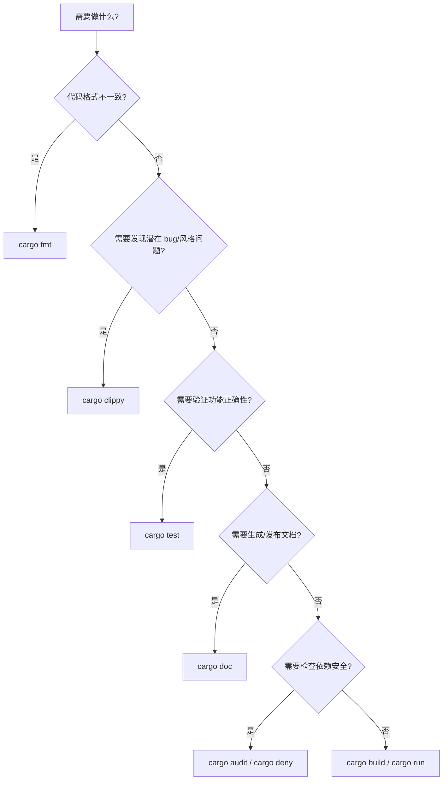

# 常用开发工具（Useful Development Tools）

> **EN**: Useful Development Tools
> **Summary**: A tour of the Rust toolchain and ecosystem tooling: rustfmt, clippy, rustdoc, cargo, rust-analyzer, plus popular community plugins like cargo-watch, cargo-expand, cargo-audit, and cargo-deny, with configuration examples and CI workflow guidance.
>
> **受众**: [初学者]
> **内容分级**: [参考级]
> **Bloom 层级**: 记忆 → 理解
> **A/S/P 标记**: **P** — Practice
> **双维定位**: E×Tool — 工具链与生态系统
> **前置依赖**: [Toolchain](../../06_ecosystem/00_toolchain/01_toolchain.md) · [Cargo Getting Started](../../06_ecosystem/01_cargo/80_cargo_getting_started.md)
> **后置概念**: [Testing Basics](16_testing_basics.md) · [Documentation](../../06_ecosystem/09_testing_and_quality/14_documentation.md) · [DevOps and CI/CD](../../06_ecosystem/00_toolchain/28_devops_and_ci_cd.md) · [Cargo Subcommands](../../06_ecosystem/01_cargo/66_cargo_subcommands_and_plugins.md)
> **定理链**: Source Code → Formatter → Linter → Tester → Documenter → Distributor
>
> **来源**: [The Rust Programming Language — Appendix D: Useful Development Tools](https://doc.rust-lang.org/book/appendix-04-useful-development-tools.html) · [Cargo Book](https://doc.rust-lang.org/cargo/index.html) · [Rust Analyzer Manual](https://rust-analyzer.github.io/manual.html)

---

---

## 认知路径

> **认知路径**: 本节从 "常用开发工具" 的核心问题出发，依次建立直观理解、形式化模型与工程实践之间的联系。

1. **问题识别**: 为什么 Rust 开发需要 rustfmt、clippy、rust-analyzer 等专用工具？它们各自解决什么问题？
2. **概念建立**: 掌握官方工具链与社区生态工具的用途、命令与配置方式。
3. **机制推理**: 通过 ⟹ 定理链将代码编写、格式化、lint、测试、文档、发布串联为可重复工作流。
4. **边界辨析**: 借助反命题/反例理解 linter 误报、格式化冲突、工具版本绑定等边界情况。
5. **迁移应用**: 将这些工具集成到 [测试](16_testing_basics.md)、[文档](../../06_ecosystem/09_testing_and_quality/14_documentation.md)、[CI/CD](../../06_ecosystem/00_toolchain/28_devops_and_ci_cd.md) 中。

---

## 反命题决策树

> **反命题 1**: "有了 rust-analyzer 就不需要运行 `cargo build`" ⟹ 不成立。IDE 提供快速反馈，但最终正确性仍需编译器确认。

> **反命题 2**: "Clippy 的所有建议都必须遵循" ⟹ 不成立。部分 lint 在特定场景下需要 `#[allow(...)]` 抑制。

> **反命题 3**: "开发工具版本可以任意落后于编译器" ⟹ 不成立。rust-analyzer、clippy 通常需要与当前工具链版本匹配。

---

## 一、官方工具链

| 工具 | 作用 | 常用命令 |
|:---|:---|:---|
| `rustfmt` | 自动格式化代码 | `cargo fmt` |
| `clippy` | 静态分析与 lint | `cargo clippy` |
| `rustdoc` | 生成文档 | `cargo doc` |
| `cargo` | 构建、测试、依赖管理 | `cargo build`, `cargo test` |
| `rustc` | Rust 编译器 | `rustc main.rs` |

---

## 二、IDE 与编辑器支持

**rust-analyzer** 是官方推荐的 Rust 语言服务器，提供：

- 自动补全
- 跳转定义
- 类型提示
- 内联错误诊断
- 重构辅助

主流编辑器（VS Code、Vim/Neovim、Emacs、IntelliJ Rust）均支持 rust-analyzer。

VS Code 推荐配置：

```json
{
    "rust-analyzer.checkOnSave.command": "clippy",
    "rust-analyzer.checkOnSave.allTargets": true,
    "rust-analyzer.cargo.features": "all"
}
```

---

## 三、开发工作流中的位置


---

## 四、配置示例

### `rustfmt.toml`

```toml
edition = "2024"
max_width = 100
tab_spaces = 4
use_small_heuristics = "Default"
reorder_imports = true
```

### `.clippy.toml`

```toml
avoid-breaking-exported-api = true
msrv = "1.85.0"
```

### `Cargo.toml` 开发配置

```toml
[package]
name = "myapp"
version = "0.1.0"
edition = "2024"
rust-version = "1.85"

[dev-dependencies]
assert_cmd = "2"
predicates = "3"
```

---

## 五、社区常用工具

| 工具 | 作用 | 安装/使用 |
|:---|:---|:---|
| `cargo-watch` | 文件变动自动重跑命令 | `cargo install cargo-watch`; `cargo watch -x check` |
| `cargo-expand` | 展开宏查看生成代码 | `cargo install cargo-expand`; `cargo expand` |
| `cargo-audit` | 检查依赖安全漏洞 | `cargo install cargo-audit`; `cargo audit` |
| `cargo-deny` | 许可证/漏洞/依赖策略检查 | `cargo install cargo-deny`; `cargo deny check` |
| `cargo-outdated` | 列出可更新的依赖 | `cargo install cargo-outdated`; `cargo outdated` |
| `cargo-udeps` | 发现未使用的依赖 | `cargo install cargo-udeps`; `cargo udeps` |

---

## 六、与 CI 的集成

典型 CI 流水线：

```bash
cargo fmt --check
cargo clippy -- -D warnings
cargo test --all-targets
cargo doc --no-deps
cargo audit
```

GitHub Actions 示例：

```yaml
name: CI
on: [push, pull_request]
jobs:
  test:
    runs-on: ubuntu-latest
    steps:
      - uses: actions/checkout@v4
      - uses: dtolnay/rust-toolchain@stable
        with:
          components: rustfmt, clippy
      - run: cargo fmt --check
      - run: cargo clippy -- -D warnings
      - run: cargo test
      - run: cargo doc --no-deps
```

---

## 七、工具选择决策树



---

## 八、关联概念

| 概念 | 关系 |
|:---|:---|
| [Testing Basics](16_testing_basics.md) | `cargo test` 的详细用法 |
| [Toolchain](../../06_ecosystem/00_toolchain/01_toolchain.md) | rustup 与组件管理 |
| [Cargo Getting Started](../../06_ecosystem/01_cargo/80_cargo_getting_started.md) | Cargo 基础命令与项目结构 |
| [Documentation](../../06_ecosystem/09_testing_and_quality/14_documentation.md) | `cargo doc` 与文档测试 |
| [DevOps and CI/CD](../../06_ecosystem/00_toolchain/28_devops_and_ci_cd.md) | 持续集成中的工具链配置 |
| [Cargo Subcommands](../../06_ecosystem/01_cargo/66_cargo_subcommands_and_plugins.md) | 扩展 Cargo 的插件生态 |

---

> **权威来源**: [TRPL — Appendix D](https://doc.rust-lang.org/book/appendix-04-useful-development-tools.html) · [Rust Analyzer Manual](https://rust-analyzer.github.io/manual.html) · [Cargo Book](https://doc.rust-lang.org/cargo/index.html)
> **内容分级**: [参考级]
