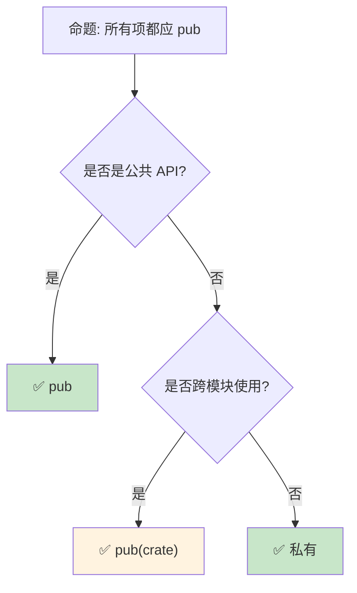

# 模块系统与路径：Rust 的代码组织哲学

> **受众**: [初学者]
> **Bloom 层级**: 记忆 → 应用
> **A/S/P 标记**: **A** — Application
> **双维定位**: F×App — 模块系统和路径的语法应用
> **定位**: 系统讲解 Rust **模块系统**——从 `mod`、`use`、`pub` 的语法到文件系统映射、工作空间组织，揭示 Rust 如何通过模块系统实现代码封装、可见性控制和大型项目组织。
> **前置概念**: [Ownership](./01_ownership.md) · [Type System](./04_type_system.md)
> **后置概念**: [Crate Ecosystem](../06_ecosystem/03_core_crates.md) · [Workspace](../06_ecosystem/01_toolchain.md)

---

> **来源**: [Rust Reference — Modules](https://doc.rust-lang.org/reference/items/modules.html) ·
> [TRPL — Packages, Crates, Modules](https://doc.rust-lang.org/book/ch07-00-managing-growing-projects-with-packages-crates-and-modules.html) ·
> [Cargo Book — Workspaces](https://doc.rust-lang.org/cargo/reference/workspaces.html) ·
> [Rust API Guidelines — Naming](https://rust-lang.github.io/api-guidelines/naming.html) ·
> [RFC 2126 — Uniform Paths](https://rust-lang.github.io/rfcs/2126-path-clarity.html)

## 📑 目录

- [模块系统与路径：Rust 的代码组织哲学](#模块系统与路径rust-的代码组织哲学)
  - [📑 目录](#-目录)
  - [一、核心概念](#一核心概念)
    - [1.1 模块层次结构](#11-模块层次结构)
    - [1.2 可见性系统](#12-可见性系统)
    - [1.3 路径解析](#13-路径解析)
  - [二、技术细节](#二技术细节)
    - [2.1 文件系统映射](#21-文件系统映射)
    - [2.2 use 语句与重导出](#22-use-语句与重导出)
    - [2.3 工作空间（Workspace）](#23-工作空间workspace)
  - [三、设计模式矩阵](#三设计模式矩阵)
  - [四、反命题与边界分析](#四反命题与边界分析)
    - [4.1 反命题树](#41-反命题树)
    - [4.2 边界极限](#42-边界极限)
  - [五、常见陷阱](#五常见陷阱)
  - [六、来源与延伸阅读](#六来源与延伸阅读)
  - [相关概念文件](#相关概念文件)
  - [权威来源索引](#权威来源索引)
  - [十、边界测试：模块系统的编译错误](#十边界测试模块系统的编译错误)
    - [10.1 边界测试：私有字段跨模块访问（编译错误）](#101-边界测试私有字段跨模块访问编译错误)
    - [10.2 边界测试：`use` 路径循环依赖（编译错误）](#102-边界测试use-路径循环依赖编译错误)
    - [10.3 边界测试：`pub(crate)` 与 `pub(super)` 的层级混淆（编译错误）](#103-边界测试pubcrate-与-pubsuper-的层级混淆编译错误)
    - [10.4 边界测试：`use` 语句的循环依赖（编译错误）](#104-边界测试use-语句的循环依赖编译错误)
    - [10.5 边界测试：模块文件系统的歧义解析（编译错误）](#105-边界测试模块文件系统的歧义解析编译错误)
    - [10.6 边界测试：`use` 语句的可见性与 `pub use` 重导出（编译错误）](#106-边界测试use-语句的可见性与-pub-use-重导出编译错误)
  - [实践](#实践)

---

## 一、核心概念

### 1.1 模块层次结构

```text
Rust 模块系统的核心实体:

  Package（包）:
  ├── 一个 Cargo.toml 定义
  ├── 包含一个或多个 Crate
  └── 对应一个代码仓库

  Crate（ crate）:
  ├── 一个编译单元
  ├── 可以是二进制（bin）或库（lib）
  └── 生成一个 .rlib 或可执行文件

  Module（模块）:
  ├── 代码的逻辑分组
  ├── 控制可见性边界
  ├── 可以嵌套
  └── 映射到文件或目录

  层级关系:
  Package
  └── Crate (binary / library)
      └── Module (root)
          ├── Module (child)
          │   └── Module (grandchild)
          └── Module (sibling)

  示例结构:
  my_project/
  ├── Cargo.toml          # Package 定义
  └── src/
      ├── main.rs         # 二进制 crate root
      └── lib.rs          # 或库 crate root
          ├── mod front_of_house;    // 声明子模块
          │   └── front_of_house.rs  // 模块实现
          └── mod back_of_house;
              └── back_of_house/
                  ├── mod.rs        // 目录模块
                  └── hosting.rs    // 子模块
```

> **认知功能**: Rust 的模块系统与**文件系统解耦**——`mod` 声明显式控制哪些文件被包含，不同于 Python/JS 的自动文件映射。
> [来源: [TRPL — Modules](https://doc.rust-lang.org/book/ch07-02-defining-modules-to-control-scope-and-privacy.html)]

---

### 1.2 可见性系统
>

```rust,ignore
// Rust 的可见性修饰符

mod outer {
    // 默认: 私有（仅当前模块及子模块可见）
    fn private_fn() {}

    // pub: 对所有模块可见
    pub fn public_fn() {}

    // pub(crate): 对整个 crate 可见
    pub(crate) fn crate_fn() {}

    // pub(super): 对父模块可见
    pub(super) fn super_fn() {}

    // pub(in path): 对指定路径可见
    pub(in crate::outer) fn restricted_fn() {}

    pub mod inner {
        // 子模块可以访问父模块的私有项
        pub fn call_parent_private() {
            // super::private_fn(); // ✅ 可以访问！
        }
    }
}

// 可见性对比:
┌────────────────┬─────────────────────────────────────────┐
│ 修饰符         │ 可见范围                                │
├────────────────┼─────────────────────────────────────────┤
│ (无)           │ 当前模块 + 所有子模块                   │
│ pub            │ 任何地方                                │
│ pub(crate)     │ 当前 crate                              │
│ pub(super)     │ 父模块                                  │
│ pub(in path)   │ 指定的模块路径                          │
│ pub(self)      │ 等同于私有（显式）                      │
└────────────────┴─────────────────────────────────────────┘
```

> **可见性洞察**: Rust 的**默认私有**设计遵循"最小权限原则"——与 Python/JavaScript 的默认公开形成鲜明对比。
> [来源: [Rust Reference — Visibility and Privacy](https://doc.rust-lang.org/reference/visibility-and-privacy.html)]

---

### 1.3 路径解析

```rust,ignore
// 路径类型

// 绝对路径: 从 crate root 开始
crate::front_of_house::hosting::add_to_waitlist();

// 相对路径: 从当前模块开始
front_of_house::hosting::add_to_waitlist();
self::front_of_house::hosting::add_to_waitlist();

// 父模块
super::some_function();

// Edition 2018+ 的变更:
// - 外部 crate 直接使用 crate_name::...
// - 不再需要 extern crate
// - use 路径更清晰

use std::collections::HashMap;           // 导入具体项
use std::collections::*;                 // 通配符导入
use std::io::{self, Write};              // 重命名 + 多导入
use std::io::Result as IoResult;         // 别名

// use 的嵌套语法（减少重复）
use std::{
    collections::HashMap,
    io::{self, Write, Read},
    fs::File,
};

// pub use: 重导出（重构 API 表面）
pub use self::hosting::add_to_waitlist;  // 外部可见
```

> **路径洞察**: Rust 的**Uniform Paths**（统一路径）在 2018 Edition 中引入，消除了 `extern crate` 的需要，使路径系统更直观。
> [来源: [RFC 2126 — Path Clarity](https://rust-lang.github.io/rfcs/2126-path-clarity.html)]

---

## 二、技术细节

### 2.1 文件系统映射

```text
模块到文件的映射规则:

  单文件模块:
  ├── mod foo; 在 lib.rs 中
  └── 对应 foo.rs 文件

  目录模块:
  ├── mod foo; 在 lib.rs 中
  └── 对应 foo/mod.rs 文件
  └── foo/ 目录下可包含其他模块文件

  2021 Edition 新增:
  ├── foo.rs 可以直接作为模块文件
  └── foo/ 目录下的文件作为子模块
  └── (无需 foo/mod.rs)

  示例 (2021 Edition):
  src/
  ├── lib.rs
  ├── front_of_house.rs      // front_of_house 模块
  └── front_of_house/        // front_of_house 的子模块
      ├── hosting.rs
      └── serving.rs

  传统方式 (2018 Edition):
  src/
  ├── lib.rs
  └── front_of_house/
      ├── mod.rs             // 必须
      ├── hosting.rs
      └── serving.rs
```

> **文件映射洞察**: 2021 Edition 的**模块系统改进**消除了 `mod.rs` 的需要，使文件结构更清晰（类似 Python 的 `__init__.py`）。
> [来源: [Rust Edition Guide — 2021](https://doc.rust-lang.org/edition-guide/rust-2021/index.html)]

---

### 2.2 use 语句与重导出

```rust,ignore
// 重导出（Re-export）模式

// 场景: 重构内部模块结构，但保持外部 API 不变

// internal/implementation.rs
pub fn complex_operation() {}

// internal/mod.rs
pub mod implementation;

// lib.rs
// 内部结构复杂，但对外暴露简洁 API
mod internal;

// 重导出: 外部用户只需 use mycrate::complex_operation;
pub use internal::implementation::complex_operation;

// 预lude 模式: 自动导入常用项
pub mod prelude {
    pub use crate::MyTrait;
    pub use crate::MyStruct;
}

// 用户: use mycrate::prelude::*;

// 扁平化导出: 将深层模块项提升到顶层
pub use self::{
    config::Config,
    error::Error,
    client::Client,
};
```

> **重导出洞察**: `pub use` 是 Rust **API 设计**的核心工具——它允许内部模块保持清晰结构，同时对外暴露简洁的 API 表面。
> [来源: [Rust API Guidelines — Re-exports](https://rust-lang.github.io/api-guidelines/naming.html#casing-conforms-to-rfc-430-c-casing)]

---

### 2.3 工作空间（Workspace）

```toml
# Cargo.toml (workspace root)
[workspace]
members = [
    "my_app",
    "my_lib",
    "my_utils",
]
resolver = "2"

# 共享依赖
[workspace.dependencies]
tokio = { version = "1", features = ["full"] }
serde = { version = "1", features = ["derive"] }
```

```text
工作空间结构:

  my_workspace/
  ├── Cargo.toml          # Workspace 定义（无 [package]）
  ├── my_app/
  │   └── Cargo.toml      # 依赖 my_lib 和 my_utils
  ├── my_lib/
  │   └── Cargo.toml      # 可能依赖 my_utils
  └── my_utils/
      └── Cargo.toml      # 基础工具 crate

  工作空间的优势:
  ├── 共享 Cargo.lock（统一依赖版本）
  ├── 共享 target 目录（减少磁盘使用）
  ├── 跨 crate 编译优化
  ├── cargo test --workspace 运行所有测试
  └── 适合大型项目/微服务架构

  常见模式:
  ├── bin + lib 分离: app 调用 library
  ├── 多 bin: 同一仓库多个可执行文件
  ├── 分层架构: core → domain → application
  └── 单体工作空间: 所有微服务在一个仓库
```

> **工作空间洞察**: Cargo Workspace 是 Rust **大型项目组织**的标准方式——它将单一代码库（monorepo）的优势与 crate 的模块化结合。
> [来源: [Cargo Book — Workspaces](https://doc.rust-lang.org/cargo/reference/workspaces.html)]

---

## 三、设计模式矩阵

```text
场景 → 模式 → 实现

创建库 API:
  → 内部模块组织实现细节
  → pub use 重导出公开 API
  → prelude 模块简化导入

大型项目组织:
  → Workspace 分 crate
  → 每个 crate 有清晰的职责边界
  → 依赖关系形成有向无环图

测试私有函数:
  → #[cfg(test)] mod tests { use super::*; }
  → 测试模块作为子模块访问私有项
  → 或使用 integration tests（tests/ 目录）

条件编译:
  → #[cfg(feature = "async")]
  → mod async_impl;
  → 特性控制模块包含
```

> **模式矩阵**: Rust 的模块系统与**Cargo 特性**（features）结合，实现强大的**条件编译和可选依赖**管理。
> [来源: [Cargo Book — Features](https://doc.rust-lang.org/cargo/reference/features.html)]

---

## 四、反命题与边界分析

### 4.1 反命题树
>



> **认知功能**: 可见性的**核心决策**是"谁需要访问"——默认私有，按需放宽。
> [来源: [Rust API Guidelines — Exposure](https://rust-lang.github.io/api-guidelines/naming.html)]

---

### 4.2 边界极限

```text
边界 1: 循环依赖
├── Crate A 不能依赖 Crate B，同时 B 依赖 A
├── 编译器拒绝循环依赖
├── 需要重构为三个 crate（提取公共部分）
└── 或者使用 trait 解耦

边界 2: 可见性的编译期特性
├── 可见性完全是编译期概念
├── 无运行时检查开销
├── 无法通过反射绕过
└── 这是安全保证的一部分

边界 3: 集成测试的限制
├── tests/ 目录下的测试是外部 crate
├── 只能测试 pub 项
├── 需要 #[cfg(test)] 内联测试来测试私有项
└── 或者使用 pub(crate) 妥协

边界 4: 宏与模块的交互
├── 宏展开在模块解析之后
├── 宏生成的代码受相同可见性规则约束
├── 复杂宏可能产生意外的路径问题
└── 缓解: 使用 $crate 引用当前 crate

边界 5: 路径冲突
├── use std::result::Result; 与自定义 Result 冲突
├── 需要显式路径或别名
└── 缓解: 使用 fully qualified syntax
```

> **边界要点**: 模块系统的边界主要与**循环依赖**、**集成测试限制**、**宏交互**和**路径冲突**相关。
> [来源: [Rust Reference — Modules](https://doc.rust-lang.org/reference/items/modules.html)]

---

## 五、常见陷阱

```text
陷阱 1: mod 和文件不同步
  ❌ lib.rs: mod foo;
     // 但文件名为 bar.rs
     // 编译错误: cannot find module file

  ✅ mod foo; → foo.rs (或 foo/mod.rs)

陷阱 2: 忘记 pub
  ❌ mod inner { fn helper() {} }
     // 外部无法调用 helper

  ✅ mod inner { pub fn helper() {} }
     // 或者 pub(crate) 根据需要

陷阱 3: use 和 mod 混淆
  ❌ use foo;  // 导入外部 crate
     // 但 foo 是本地模块

  ✅ mod foo;  // 声明本地模块
     // use foo::Bar;  // 导入模块中的项

陷阱 4: 循环模块依赖
  ❌ mod a { use crate::b::B; }
     mod b { use crate::a::A; }
     // 编译错误（如果形成循环）

  ✅ 重构为共享模块或使用 trait

陷阱 5: Workspace 中版本不一致
  ❌ crate A 依赖 tokio 1.0
     crate B 依赖 tokio 1.5
     // 工作空间可能有两个 tokio 版本

  ✅ 在 workspace.dependencies 中统一管理
```

> **陷阱总结**: 模块系统的陷阱主要与**文件命名**、**可见性**、**use/mod 混淆**、**循环依赖**和**workspace 版本管理**相关。
> [来源: [TRPL — Common Module Issues](https://doc.rust-lang.org/book/ch07-05-separating-modules-into-different-files.html)]

---

## 六、来源与延伸阅读

| 来源 | 可信度 | 说明 |
|:---|:---:|:---|
| [Rust Reference — Modules](https://doc.rust-lang.org/reference/items/modules.html) | ✅ 一级 | 模块系统参考 |
| [TRPL — Packages, Crates, Modules](https://doc.rust-lang.org/book/ch07-00-managing-growing-projects-with-packages-crates-and-modules.html) | ✅ 一级 | 基础教程 |
| [Cargo Book — Workspaces](https://doc.rust-lang.org/cargo/reference/workspaces.html) | ✅ 一级 | 工作空间 |
| [RFC 2126 — Path Clarity](https://rust-lang.github.io/rfcs/2126-path-clarity.html) | ✅ 一级 | 路径改进 |
| [Rust API Guidelines](https://rust-lang.github.io/api-guidelines/naming.html) | ✅ 一级 | API 设计 |

---

## 相关概念文件

- [Ownership](./01_ownership.md) — 所有权系统
- [Type System](./04_type_system.md) — 类型系统
- [Crate Ecosystem](../06_ecosystem/03_core_crates.md) — 核心 crate
- [Toolchain](../06_ecosystem/01_toolchain.md) — 工具链

---

> **权威来源**: [Rust Reference](https://doc.rust-lang.org/reference/), [The Rust Programming Language](https://doc.rust-lang.org/book/)
>
> **权威来源对齐变更日志**: 2026-05-22 创建 [来源: Authority Source Sprint Batch 10]

**文档版本**: 1.0
**对应 Rust 版本**: 1.96.0+ (Edition 2024)
**最后更新**: 2026-05-22
**状态**: ✅ 概念文件创建完成

---

## 权威来源索引

> **补充来源**

## 十、边界测试：模块系统的编译错误

### 10.1 边界测试：私有字段跨模块访问（编译错误）

```rust,compile_fail
// 模块内部
mod inner {
    pub struct Config {
        name: String, // 私有字段
    }

    impl Config {
        pub fn new(name: &str) -> Self {
            Self { name: name.to_string() }
        }
    }
}

fn main() {
    let cfg = inner::Config::new("test");
    // ❌ 编译错误: field `name` of struct `Config` is private
    println!("{}", cfg.name);
}

// 正确: 通过公共方法访问
mod inner_fixed {
    pub struct Config {
        name: String,
    }

    impl Config {
        pub fn new(name: &str) -> Self {
            Self { name: name.to_string() }
        }
        pub fn name(&self) -> &str { // ✅ 公共 getter
            &self.name
        }
    }
}
```

> **修正**: Rust 的可见性默认是私有的（`private`）。结构体字段、模块项、trait 方法等除非标记 `pub`，否则只能在定义模块内访问。这与 C++ 的 `public`/`private` 类似，但 Rust 默认私有，需显式公开。公共 API 设计应通过方法暴露数据，而非直接公开字段。[来源: [The Rust Programming Language](https://doc.rust-lang.org/book/)]

### 10.2 边界测试：`use` 路径循环依赖（编译错误）

```rust,ignore
// a.rs
// use crate::b::B; // a 依赖 b

// b.rs
// use crate::a::A; // b 依赖 a → 循环依赖

// ❌ 编译错误: cycle detected when building crate graph
// Rust 模块间不能存在循环依赖

// 正确: 提取公共依赖到独立模块
// common.rs
// pub struct Shared { ... }

// a.rs: use crate::common::Shared;
// b.rs: use crate::common::Shared;
```

> **修正**: Rust 严格禁止模块间的循环依赖（circular dependency）。
> 这与 C/C++ 的前向声明（forward declaration）不同——Rust 的模块系统要求依赖关系是有向无环图（DAG）。
> 若出现循环依赖，需重构代码：提取公共类型到独立模块，或使用 trait 抽象打破循环。
> 这是 Rust 编译模型（整体编译、基于 crate 的依赖）的固有约束。
> [来源: [Rust Reference](https://doc.rust-lang.org/reference/)]

### 10.3 边界测试：`pub(crate)` 与 `pub(super)` 的层级混淆（编译错误）

```rust,compile_fail
mod outer {
    mod inner {
        pub(crate) struct Secret; // 整个 crate 可见
        pub(super) struct ParentOnly; // 仅 outer 可见
    }

    fn use_items() {
        let _ = inner::Secret; // ✅ crate 内可见
        let _ = inner::ParentOnly; // ✅ super 可见
    }
}

mod sibling {
    fn try_access() {
        // ❌ 编译错误: ParentOnly 仅在 outer 内可见
        // let _ = super::outer::inner::ParentOnly;

        // Secret 整个 crate 可见
        let _ = crate::outer::inner::Secret; // ✅
    }
}
```

> **修正**: Rust 的可见性修饰符精确控制作用域：
> `pub`（完全公开）、`pub(crate)`（当前 crate）、`pub(super)`（父模块）、`pub(in path)`（指定路径）。
> `pub(crate)` 和 `pub(super)` 的区别在大型 crate 中尤为重要——`pub(crate)` 允许 crate 内任何模块访问，`pub(super)` 限制为直接父模块。
> 常见错误：
>
> 1) 用 `pub` 代替 `pub(crate)`，暴露内部实现细节；
> 2) 用 `pub(super)` 但需要在兄弟模块中访问；
> 3) 混淆 `super` 和 `crate`（`super` 是上一级，`crate` 是根）。
> 这与 Java 的 `package-private`（无修饰符，同包可见）或 C# 的 `internal`（同程序集可见）类似——Rust 提供更细粒度的控制。
> 模块系统的可见性是 API 设计的关键工具：最小化公开表面，最大化重构自由。
> [来源: [The Rust Programming Language](https://doc.rust-lang.org/book/ch07-03-paths-for-referring-to-an-item-in-the-module-tree.html)] ·
> [来源: [Rust Reference — Visibility and Privacy](https://doc.rust-lang.org/reference/visibility-and-privacy.html)]

### 10.4 边界测试：`use` 语句的循环依赖（编译错误）

```rust,compile_fail
// a.rs
pub use crate::b::B;

// b.rs
pub use crate::a::A;

// ❌ 编译错误: 循环 use 导致模块解析失败
// Rust 允许模块间的循环依赖（通过 `use`），但 item 的定义不能循环
```

> **修正**: Rust 的模块系统允许**循环 `use`**（模块 A `use` 模块 B 的项，模块 B `use` 模块 A 的项），因为 `use` 只是别名，不定义新项。
> 但**项的定义不能循环**：`struct A { b: B }` 和 `struct B { a: A }` 是无限大小类型，编译错误。
> `use` 循环的常见场景：
>
> 1) `prelude` 模块集中暴露公开 API；
> 2) 子模块互相引用类型；
> 3) `pub use` 重新导出组织 API 表面。
> Rust 的模块解析是声明式的：
> 所有 `mod` 声明在编译期收集，然后解析 `use` 路径，最后检查循环。
> 这与 Python 的循环 import（运行时动态，可能部分成功）或 C/C++ 的头文件循环 include（需 `#pragma once` 或 include guard）不同
> ——Rust 的模块系统从设计上避免循环问题。
> [来源: [The Rust Programming Language](https://doc.rust-lang.org/book/ch07-01-packages-and-crates.html)] ·
> [来源: [Rust Reference — Items](https://doc.rust-lang.org/reference/items.html)]

### 10.5 边界测试：模块文件系统的歧义解析（编译错误）

```rust,ignore
// 文件结构:
// src/
//   foo.rs
//   foo/
//     mod.rs

// ❌ 编译错误: foo.rs 和 foo/mod.rs 同时存在时，编译器无法确定模块入口
```

> **修正**: Rust 2018 Edition 后，模块的**文件系统映射**规则：
>
> 1) `mod foo;` → 查找 `foo.rs` 或 `foo/mod.rs`（不能同时存在）；
> 2) `mod foo { ... }` → 内联模块定义；
> 3) `mod bar;` 在 `foo/mod.rs` 中 → 查找 `foo/bar.rs`。
> 2015 Edition 的差异：`mod foo;` 查找 `foo.rs` 或 `foo/mod.rs`，但 `foo.rs` 优先级更高。
> 常见错误：
> 4) 同时存在 `foo.rs` 和 `foo/mod.rs` → 编译错误；
> 5) `mod foo;` 在 `foo.rs` 中引用自己 → 循环模块；
> 6) `pub(crate) mod foo;` 在错误位置 → 可见性不符合预期。
> 这与 Python 的 `__init__.py`（目录即包）或 Java 的包结构（目录映射到包名）类似——Rust 的模块系统显式声明依赖关系，文件系统是模块声明的反射。
> [来源: [The Rust Programming Language](https://doc.rust-lang.org/book/ch07-00-managing-growing-projects-with-packages-crates-and-modules.html)] ·
> [来源: [Rust Reference — Modules](https://doc.rust-lang.org/reference/items/modules.html)]

### 10.6 边界测试：`use` 语句的可见性与 `pub use` 重导出（编译错误）

```rust,ignore
mod inner {
    pub fn public_fn() {}
    fn private_fn() {}
}

mod outer {
    // ❌ 编译错误: private_fn 不是 pub，不能重导出
    // pub use super::inner::private_fn;
    pub use super::inner::public_fn;
}

fn main() {
    outer::public_fn();
}
```

> **修正**: `pub use` 是**重导出**（re-export）：将其他模块的项在当前模块的公共接口中暴露。
> 重导出的项必须本身是 `pub` 的（或在与当前模块相同的可见性范围内）。
> `pub use` 的常见用途：
>
> 1) 扁平化模块结构（`pub use self::inner::Item`）；
> 2) 创建 facade 模式（crate 根重导出所有公共 API）；
> 3) 版本兼容（旧路径重定向到新路径）。
> `pub(crate) use`、`pub(super) use` 限制重导出的可见性。
> 这与 Python 的 `from module import *`（导入所有公共名称）或 Java 的 `import`（无重导出概念）不同——Rust 的 `use` 是别名声明，可控制可见性。
> [来源: [The Rust Programming Language](https://doc.rust-lang.org/book/ch07-04-bringing-paths-into-scope-with-the-use-keyword.html)] ·
> [来源: [Rust Reference — Use Declarations](https://doc.rust-lang.org/reference/items/use-declarations.html)]
> **权威来源**:
> [Rust Reference](https://doc.rust-lang.org/reference/) ·
> [The Rust Programming Language](https://doc.rust-lang.org/book/) ·
> [Rust Standard Library](https://doc.rust-lang.org/std/) ·
> [Rust RFCs](https://rust-lang.github.io/rfcs/)
> **对应 Rust 版本**: 1.96.0+ (Edition 2024)

## 实践

> **相关资源**:
>
> - [crates/ 示例代码](../../crates/) — 与本文概念对应的可编译示例
> - [exercises/ 练习](../../exercises/) — 动手编程挑战
> - [MVP 学习路径](../00_meta/LEARNING_MVP_PATH.md) — 从零到多线程 CLI 的 40 小时路径
>
> **建议**: 阅读完本概念文件后，打开对应 crate 的示例代码，尝试修改并运行。完成至少 1 道相关练习以巩固理解。

## 认知路径

> **认知路径**: 从 L0 基础概念出发，经由本节的 **模块系统与路径：Rust 的代码组织哲学** 核心原理，通向 L2 进阶模式与 L3 工程实践。

### 核心推理链

| 定理 | 前提 | 结论 | 置信度 |
|:---|:---|:---|:---|
| 模块系统与路径：Rust 的代码组织哲学 基础定义 ⟹ 正确用法 | 理解语法与语义 | 能写出符合惯用法的代码 | 高 |
| 模块系统与路径：Rust 的代码组织哲学 正确用法 ⟹ 常见陷阱 | 忽略边界条件 | 编译错误或运行时 bug | 高 |
| 模块系统与路径：Rust 的代码组织哲学 常见陷阱 ⟹ 深度掌握 | 系统学习反模式 | 能进行代码审查与优化 | 高 |

> **过渡**: 掌握 模块系统与路径：Rust 的代码组织哲学 的基础语法后，下一步需要理解其在类型系统中的位置与与其他概念的交互关系。

> **过渡**: 在实践中应用 模块系统与路径：Rust 的代码组织哲学 时，务必关注边界条件与异常处理，这是从"能编译"到"能生产"的关键跃迁。

> **过渡**: 模块系统与路径：Rust 的代码组织哲学 的设计理念体现了 Rust 零成本抽象与安全保证的核心权衡，理解这一权衡有助于迁移到更高级的并发与形式化验证领域。

### 反命题与边界

> **反命题**: "模块系统与路径：Rust 的代码组织哲学 在所有场景下都是最佳选择" —— 错误。需要根据具体上下文权衡性能、可读性与安全性，某些场景下显式替代方案可能更优。

