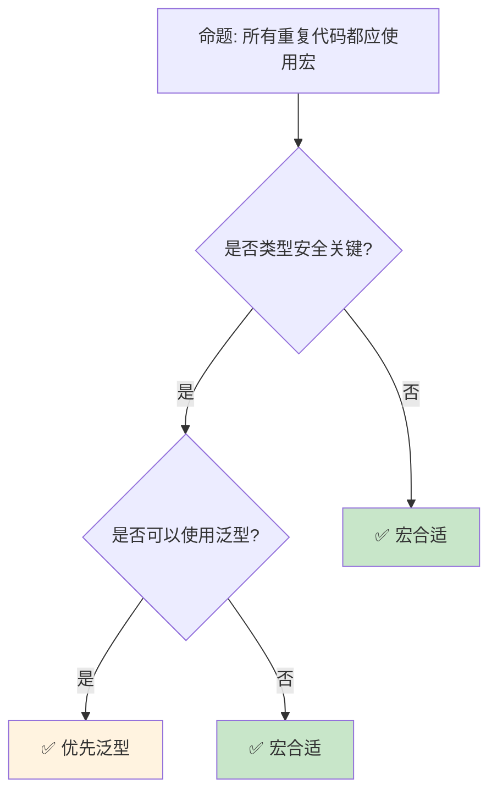

# 属性与声明宏：编译期元编程基础

> **Bloom 层级**: 理解 → 应用
> **定位**: 系统讲解 Rust **属性（attributes）**和**声明宏（macro_rules!）**——从编译期元编程的基础语法到模式匹配、递归宏和卫生性，揭示 Rust 如何在编译期生成代码同时保持类型安全。
> **前置概念**: [Type System](./04_type_system.md) · [Modules](./11_modules_and_paths.md)
> **后置概念**: [Proc Macros](../03_advanced/07_proc_macro.md) · [DSL](../02_intermediate/13_dsl_and_embedding.md)

---

> **来源**: [Rust Reference — Attributes](https://doc.rust-lang.org/reference/attributes.html) ·
> [TRPL — Macros](https://doc.rust-lang.org/book/ch19-06-macros.html) ·
> [The Little Book of Rust Macros](https://veykril.github.io/tlborm/) ·
> [RFC 1584 — Macros 2.0](https://rust-lang.github.io/rfcs/1584-macros.html) ·
> [Wikipedia — Hygienic Macro](https://en.wikipedia.org/wiki/Hygienic_macro)

## 📑 目录
>
> [来源: [Rust Reference](https://doc.rust-lang.org/reference/)]
>
> [来源: [TRPL](https://doc.rust-lang.org/book/)]

- [属性与声明宏：编译期元编程基础](#属性与声明宏编译期元编程基础)
  - [📑 目录](#-目录)
  - [一、核心概念](#一核心概念)
    - [1.1 属性系统全景](#11-属性系统全景)
    - [1.2 声明宏基础](#12-声明宏基础)
    - [1.3 宏的卫生性](#13-宏的卫生性)
  - [二、技术细节](#二技术细节)
    - [2.1 模式匹配与重复](#21-模式匹配与重复)
    - [2.2 递归宏](#22-递归宏)
    - [2.3 常见属性详解](#23-常见属性详解)
  - [三、设计模式矩阵](#三设计模式矩阵)
  - [四、反命题与边界分析](#四反命题与边界分析)
    - [4.1 反命题树](#41-反命题树)
    - [4.2 边界极限](#42-边界极限)
  - [五、常见陷阱](#五常见陷阱)
  - [六、来源与延伸阅读](#六来源与延伸阅读)
  - [相关概念文件](#相关概念文件)

---

## 一、核心概念
>
> [来源: [Rust Reference](https://doc.rust-lang.org/reference/)]
>
> [来源: [Rust Reference](https://doc.rust-lang.org/reference/)]

### 1.1 属性系统全景

```text
Rust 属性分类:

  内置属性 (Built-in):
  ├── 条件编译: #[cfg], #[cfg_attr]
  ├── 测试: #[test], #[bench], #[should_panic]
  ├── 派生: #[derive(Debug, Clone)]
  ├── 文档: #[doc = "..."]
  ├── 链接: #[link], #[link_name]
  ├── 格式化: #[rustfmt::skip]
  ├── 诊断: #[allow], #[warn], #[deny], #[forbid]
  └── 其他: #[inline], #[must_use], #[repr(...)]

  属性语法:
  ├── 外部属性: #[attr]
  │   └── 应用于紧随其后的项
  └── 内部属性: #![attr]
      └── 应用于包含它的项（通常是 crate/module）

  示例:
  #![allow(unused)]           // 应用于整个 crate

  #[derive(Debug)]            // 应用于结构体
  struct Point { x: i32, y: i32 }

  #[cfg(target_os = "linux")]  // 条件编译
  fn linux_only() {}

  #[test]                     // 标记为测试
  fn my_test() { assert_eq!(2 + 2, 4); }

  属性参数:
  ├── 标识符: #[inline]
  ├── 等号赋值: #[doc = "help text"]
  ├── 元组: #[derive(Debug, Clone)]
  └── 嵌套: #[cfg(all(target_os = "linux", target_arch = "x86_64"))]
```

> **认知功能**: Rust 的**属性系统是编译器的通用扩展点**——它允许在不修改语法的情况下影响编译行为。
> [来源: [Rust Reference — Attributes](https://doc.rust-lang.org/reference/attributes.html)]

---

### 1.2 声明宏基础

```rust,ignore
// macro_rules! 声明宏

// 最简单的宏: 类似于 C 的 #define，但类型安全
macro_rules! say_hello {
    () => {
        println!("Hello!");
    };
}

// 带参数的宏
macro_rules! print_value {
    ($value:expr) => {
        println!("{} = {:?}", stringify!($value), $value);
    };
}

// 多模式匹配
macro_rules! vec_custom {
    // 空向量
    () => {
        Vec::new()
    };
    // 带初始值的向量
    ($($element:expr),+ $(,)?) => {{
        let mut v = Vec::new();
        $(v.push($element);)*
        v
    }};
}

// 使用:
say_hello!();
print_value!(42);  // 输出: 42 = 42
let v = vec_custom![1, 2, 3,];

// 宏的核心概念:
// ├── 声明式: 模式匹配 → 代码模板
// ├── 编译期展开: 无运行时开销
// ├── 语法树操作: 操作 token，非文本替换
// └── 卫生性: 避免变量名冲突
```

> **宏洞察**: `macro_rules!` 是 Rust **声明式元编程**的基础工具——它比 C 预处理器**更安全**（语法树级操作）且**更强大**（模式匹配）。
> [来源: [TRPL — Macros](https://doc.rust-lang.org/book/ch19-06-macros.html)]

---

### 1.3 宏的卫生性

```rust,ignore
// 卫生性（Hygiene）: 宏不会意外捕获外部变量

fn hygiene_demo() {
    let x = "outer";

    macro_rules! print_x {
        () => {
            println!("{}", x);  // ❌ 编译错误！
            // 宏内部的 x 未定义
        };
    }

    // 必须显式传递
    macro_rules! print_value {
        ($value:ident) => {
            println!("{}", $value);
        };
    }

    print_value!(x);  // ✅ 显式传递 x
}

// 与 C 预处理器的对比:
// C:
// #define SWAP(a, b) { int temp = a; a = b; b = temp; }
// // temp 可能与外部变量冲突！

// Rust:
macro_rules! swap {
    ($a:ident, $b:ident) => {{
        let temp = $a;  // temp 只在宏内部可见
        $a = $b;
        $b = temp;
    }};
}

// 卫生性保证:
// ├── 宏内部变量不污染外部作用域
// ├── 外部变量不会被宏意外捕获
// └── 每个宏调用有独立的变量命名空间
```

> **卫生性洞察**: **卫生宏**是 Rust 宏相比 C 预处理器的**核心安全特性**——它消除了宏展开中的命名冲突类错误。
> [来源: [Wikipedia — Hygienic Macro](https://en.wikipedia.org/wiki/Hygienic_macro)]

---

## 二、技术细节
>
> [来源: [Rust Reference](https://doc.rust-lang.org/reference/)]
>
> [来源: [TRPL](https://doc.rust-lang.org/book/)]

### 2.1 模式匹配与重复

```rust,ignore
// 宏的模式匹配语法

macro_rules! complex_macro {
    // 匹配标识符
    ($name:ident) => { ... };

    // 匹配表达式
    ($expr:expr) => { ... };

    // 匹配语句
    ($stmt:stmt) => { ... };

    // 匹配类型
    ($ty:ty) => { ... };

    // 匹配路径
    ($path:path) => { ... };

    // 匹配模式
    ($pat:pat) => { ... };

    // 匹配字面量
    ($lit:literal) => { ... };

    // 匹配块
    ($block:block) => { ... };

    // 匹配元项
    ($meta:meta) => { ... };

    // 匹配生命周期
    ($life:lifetime) => { ... };

    // 匹配可见性
    ($vis:vis) => { ... };

    // 匹配 tt（token tree，最通用）
    ($tt:tt) => { ... };
}

// 重复模式:
macro_rules! sum {
    // 零个或多个
    ($($x:expr),*) => {{
        let mut total = 0;
        $(total += $x;)*
        total
    }};

    // 一个或多个
    ($($x:expr),+) => {{ ... }};

    // 可选逗号分隔
    ($($x:expr),+ $(,)?) => {{ ... }};

    // 带分隔符的重复（; 分隔）
    ($($name:ident: $ty:ty);* $(;)?) => {{ ... }};
}

// 使用:
let s = sum!(1, 2, 3, 4);  // 10
let empty = sum!();         // 0
```

> **模式洞察**: Rust 宏的**片段类型**（`expr`, `ty`, `pat` 等）使宏操作在**语法树层面**而非文本层面，这是安全性的关键。
> [来源: [The Little Book of Rust Macros](https://veykril.github.io/tlborm/)]

---

### 2.2 递归宏

```rust,ignore
// 递归宏: 通过模式匹配实现递归

// 计算参数个数
macro_rules! count {
    () => { 0 };
    ($head:tt $($tail:tt)*) => { 1 + count!($($tail)*) };
}

// 使用:
let n = count!(a b c d);  // 4

// 递归实现 vec![...]
macro_rules! my_vec {
    () => { Vec::new() };
    ($item:expr) => {{
        let mut v = Vec::new();
        v.push($item);
        v
    }};
    ($first:expr, $($rest:expr),+ $(,)?) => {{
        let mut v = my_vec!($($rest),+);
        v.push($first);
        v
    }};
}

// 递归的限制:
// ├── 编译器有宏展开深度限制（默认 64）
// ├── 过度递归导致编译错误
// └── 某些模式需要技巧避免无限递归

// 尾递归风格（更高效）:
macro_rules! build_vec {
    ($($result:expr),*) => { vec![$($result),*] };
    ($first:expr, $($rest:expr),+) => {
        build_vec!($($rest),*, $first)
    };
}
```

> **递归洞察**: 宏递归是**编译期计算**的强大工具——它使 Rust 宏具备图灵完备性。
> [来源: [TLBORM — Counting](https://veykril.github.io/tlborm/patterns/counting.html)]

---

### 2.3 常见属性详解

```text
关键属性速查:

  #[derive(...)]
  ├── Debug: 格式化输出 {:?}
  ├── Clone: 显式复制 .clone()
  ├── Copy: 隐式复制（位复制）
  ├── PartialEq/Eq: 相等比较
  ├── PartialOrd/Ord: 排序比较
  ├── Hash: 哈希计算
  ├── Default: 默认值
  └── 自定义 derive: 过程宏实现

  #[repr(...)]
  ├── C: C 兼容布局
  ├── transparent: 单字段结构体透传 ABI
  ├── packed: 无填充紧密布局
  └── align(n): 指定对齐

  条件编译:
  ├── #[cfg(target_os = "linux")]
  ├── #[cfg(feature = "serde")]
  ├── #[cfg(all(unix, not(target_os = "macos")))]
  └── #[cfg_attr(feature = "serde", derive(Serialize))]

  诊断控制:
  ├── #[allow(dead_code)]
  ├── #[warn(unused_variables)]
  ├── #[deny(unsafe_code)]
  └── #[forbid(missing_docs)]

  其他重要属性:
  ├── #[inline]: 内联提示
  ├── #[must_use]: 返回值必须被使用
  ├── #[non_exhaustive]: 外部 crate 不能穷举匹配
  └── #[track_caller]: panic 显示调用者位置
```

> **属性洞察**: Rust 的**属性系统是零成本抽象的语法糖**——所有属性在编译期处理，无运行时开销。
> [来源: [Rust Reference — Built-in Attributes](https://doc.rust-lang.org/reference/attributes.html#built-in-attributes-index)]

---

## 三、设计模式矩阵
>
> [来源: [Rust Reference](https://doc.rust-lang.org/reference/)]
>
> [来源: [Rust Reference](https://doc.rust-lang.org/reference/)]

```text
宏应用场景:

  避免重复代码:
  → macro_rules! 提取公共模式
  → 例如: 为多个类型实现相同 trait

  DSL 构建:
  → 创建领域特定语法
  → 例如: vec!, format!, println!

  编译期计算:
  → 递归宏实现编译期逻辑
  → 例如: 计算类型列表长度

  代码生成:
  → 根据模式生成重复代码
  → 例如: 为枚举生成访问器

  条件编译:
  → cfg 属性控制代码包含
  → 跨平台/特性条件代码
```

> **模式矩阵**: 宏和属性是 Rust **"不重复自己"（DRY）**原则的核心工具——在编译期消除重复，无运行时成本。
> [来源: [Rust Macros — Patterns](https://doc.rust-lang.org/reference/macros.html)]

---

## 四、反命题与边界分析
>
> [来源: [Rust Reference](https://doc.rust-lang.org/reference/)]
>
> [来源: [Rust Reference](https://doc.rust-lang.org/reference/)]

### 4.1 反命题树



> **认知功能**: **泛型优先于宏**——当类型系统可以表达时，优先使用泛型（更好的错误信息、IDE 支持）。宏用于类型系统无法表达的场景。
> [来源: [Rust API Guidelines — Macros](https://rust-lang.github.io/api-guidelines/macros.html)]

---

### 4.2 边界极限

```text
边界 1: 宏的调试困难
├── 宏展开后的代码不在源文件中
├── 编译错误可能指向展开后的位置
├── rustfmt 对宏内部格式化有限
└── 缓解: cargo expand 查看展开结果

边界 2: IDE 支持
├── 宏内部的代码补全可能失效
├── 跳转定义在宏中不准确
├── 某些 IDE 对复杂宏支持有限
└── 缓解: rust-analyzer 持续改善

边界 3: 编译时间
├── 复杂宏增加编译时间
├── 递归宏可能触发展开限制
├── 宏滥用导致编译缓慢
└── 缓解: 限制宏复杂度

边界 4: 错误信息质量
├── 宏错误可能难以理解
├── 需要精心设计错误消息
├── 内部宏细节暴露给用户
└── 缓解: compile_error! 宏提供清晰错误

边界 5: 导出和可见性
├── 宏遵循模块可见性规则
├── #[macro_export] 使宏 crate 级可见
├── 宏的 hygiene 可能意外限制使用
└── 缓解: 使用 $crate 引用当前 crate
```

> **边界要点**: 宏的边界主要与**调试**、**IDE 支持**、**编译时间**、**错误信息**和**可见性**相关。
> [来源: [Rust Reference — Macros](https://doc.rust-lang.org/reference/macros.html)]

---

## 五、常见陷阱
>
> [来源: [Rust Reference](https://doc.rust-lang.org/reference/)]
>
> [来源: [TRPL](https://doc.rust-lang.org/book/)]

```text
陷阱 1: 忘记分号或逗号
  ❌ macro_rules! bad {
       ($x:expr) => { $x }
     }
     // 在语句上下文可能产生意外行为

  ✅ macro_rules! good {
       ($x:expr) => {{ $x }}
     }
     // 使用块确保表达式上下文

陷阱 2: 多次求值参数
  ❌ macro_rules! double {
       ($x:expr) => { $x + $x }
     }
     // double!(expensive()) 调用两次！

  ✅ macro_rules! double_safe {
       ($x:expr) => {{
         let val = $x;
         val + val
       }}
     }

陷阱 3: 宏与优先级
  ❌ macro_rules! add {
       ($a:expr, $b:expr) => { $a + $b }
     }
     // add!(1, 2) * 3 可能展开为 1 + 2 * 3 = 7！

  ✅ macro_rules! add {
       ($a:expr, $b:expr) => { ($a + $b) }
     }

陷阱 4: hygiene 误解
  ❌ 假设宏可以访问外部变量
     // 卫生性阻止了这一点

  ✅ 显式传递所有需要的变量
     // 或设计不需要外部变量的宏

陷阱 5: 过程宏与声明宏混淆
  ❌ 用 macro_rules! 做复杂代码分析
     // 能力有限

  ✅ 复杂场景使用过程宏（proc_macro）
     // 可以操作完整语法树
```

> **陷阱总结**: 宏的陷阱主要与**表达式上下文**、**多次求值**、**优先级**、**卫生性**和**宏类型选择**相关。
> [来源: [The Little Book of Rust Macros — Pitfalls](https://veykril.github.io/tlborm/)]

---

## 六、来源与延伸阅读
>
> [来源: [Rust Reference](https://doc.rust-lang.org/reference/)]

| 来源 | 可信度 | 说明 |
|:---|:---:|:---|
| [Rust Reference — Macros](https://doc.rust-lang.org/reference/macros.html) | ✅ 一级 | 宏参考 |
| [TRPL — Macros](https://doc.rust-lang.org/book/ch19-06-macros.html) | ✅ 一级 | 基础教程 |
| [The Little Book of Rust Macros](https://veykril.github.io/tlborm/) | ✅ 一级 | 宏权威指南 |
| [Rust Reference — Attributes](https://doc.rust-lang.org/reference/attributes.html) | ✅ 一级 | 属性参考 |
| [RFC 1584 — Macros 2.0](https://rust-lang.github.io/rfcs/1584-macros.html) | ✅ 一级 | 宏系统设计 |

---

## 相关概念文件
>
> [来源: [Rust Reference](https://doc.rust-lang.org/reference/)]
>
> [来源: [Rust Reference](https://doc.rust-lang.org/reference/)]

- [Type System](./04_type_system.md) — 类型系统
- [Modules](./11_modules_and_paths.md) — 模块系统
- [Proc Macros](../03_advanced/07_proc_macro.md) — 过程宏
- [DSL](../02_intermediate/13_dsl_and_embedding.md) — DSL 模式

---

> **权威来源**: [Rust Reference](https://doc.rust-lang.org/reference/), [The Rust Programming Language](https://doc.rust-lang.org/book/)
>
> **权威来源对齐变更日志**: 2026-05-22 创建 [来源: Authority Source Sprint Batch 10]

**文档版本**: 1.0
**对应 Rust 版本**: 1.96.0+ (Edition 2024)
**最后更新**: 2026-05-22
**状态**: ✅ 概念文件创建完成
