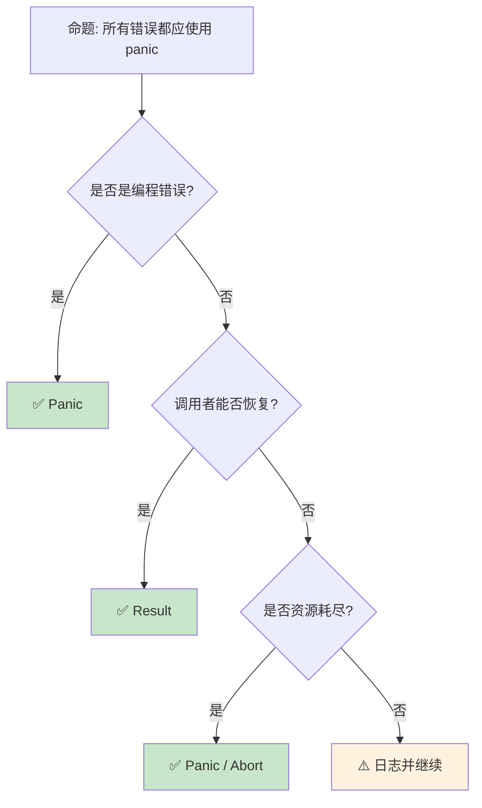

> **内容分级**: [综述级]
>
> **本节关键术语**: panic · 展开 (Unwind) · 中止 (Abort) · 栈回溯 (Stack Trace) · 不可恢复错误 (Unrecoverable Error) — [完整对照表](../00_meta/terminology_glossary.md)
>
# Panic 与 Abort：不可恢复错误的处理机制
>
> **EN**: Panic and Abort
> **Summary**: Panic and Abort: core Rust concepts, syntax, and examples.
> **受众**: [初学者]
> **Bloom 层级**: 理解 → 应用
> **A/S/P 标记**: **S+P** — Structure + Procedure
> **双维定位**: C×Eva — 评价 panic 与 abort 的策略选择
> **定位**: 系统讲解 Rust **panic** 机制——从 panic 与 Result 的哲学分野、panic 传播、到自定义 panic 处理和 abort 模式，揭示 Rust 如何在"优雅失败"与"快速崩溃"之间做出设计选择。
> **前置概念**: [Error Handling](../02_intermediate/16_error_handling_deep_dive.md) · [Ownership](01_ownership.md)
> **后置概念**: [Unsafe](../03_advanced/03_unsafe.md) · [FFI](../03_advanced/05_rust_ffi.md)

---

> **来源**: [Rust Reference — Panics](https://doc.rust-lang.org/reference/runtime.html#panics) ·
> [TRPL — Unrecoverable Errors](https://doc.rust-lang.org/book/ch09-01-unrecoverable-errors-with-panic.html) ·
> [std::panic](https://doc.rust-lang.org/std/panic/index.html) ·
> [RFC 2361 — catch_panic](https://rust-lang.github.io/rfcs//2361-dbg-macro.html) ·
> [Wikipedia — Crash-only Software](https://en.wikipedia.org/wiki/Crash-only_software)

## 📑 目录

- [Panic 与 Abort：不可恢复错误的处理机制](#panic-与-abort不可恢复错误的处理机制)
  - [📑 目录](#-目录)
  - [一、核心概念](#一核心概念)
    - [1.1 Panic 的语义](#11-panic-的语义)
    - [1.2 Panic vs Result](#12-panic-vs-result)
    - [1.3 Panic 传播与栈展开](#13-panic-传播与栈展开)
  - [二、技术细节](#二技术细节)
    - [2.1 自定义 Panic 处理](#21-自定义-panic-处理)
    - [2.2 Panic 钩子与日志](#22-panic-钩子与日志)
    - [2.3 Abort 模式](#23-abort-模式)
  - [三、设计模式矩阵](#三设计模式矩阵)
  - [四、反命题与边界分析](#四反命题与边界分析)
    - [4.1 反命题树](#41-反命题树)
    - [4.2 边界极限](#42-边界极限)
  - [五、常见陷阱](#五常见陷阱)
  - [六、来源与延伸阅读](#六来源与延伸阅读)
  - [相关概念文件](#相关概念文件)
  - [权威来源索引](#权威来源索引)
  - [十、边界测试：Panic 与 Abort 的编译错误](#十边界测试panic-与-abort-的编译错误)
    - [10.1 边界测试：`catch_unwind` 捕获非 `UnwindSafe` 类型（编译错误）](#101-边界测试catch_unwind-捕获非-unwindsafe-类型编译错误)
    - [10.2 边界测试：在 `Drop` 中 panic 导致双重 panic（运行时 abort）](#102-边界测试在-drop-中-panic-导致双重-panic运行时-abort)
    - [10.3 边界测试：`panic=abort` 与 `catch_unwind` 的冲突（编译错误/链接错误）](#103-边界测试panicabort-与-catch_unwind-的冲突编译错误链接错误)
    - [10.4 边界测试：双重 panic导致 abort（运行时行为）](#104-边界测试双重-panic导致-abort运行时行为)
    - [10.5 边界测试：`panic=abort` 与 `Drop` 的补偿动作缺失（运行时资源泄漏）](#105-边界测试panicabort-与-drop-的补偿动作缺失运行时资源泄漏)
    - [10.6 边界测试：`catch_unwind` 与 FFI 的不可恢复性（运行时 UB）](#106-边界测试catch_unwind-与-ffi-的不可恢复性运行时-ub)
    - [10.7 边界测试：`core::intrinsics::abort` 与 `std::process::abort` 的差异（运行时行为）](#107-边界测试coreintrinsicsabort-与-stdprocessabort-的差异运行时行为)
    - [10.5 边界测试：`catch_unwind` 与 `UnwindSafe` 边界（编译错误）](#105-边界测试catch_unwind-与-unwindsafe-边界编译错误)
    - [10.6 边界测试：`panic!` 与 `assert!` 的消息格式化开销（运行时性能）](#106-边界测试panic-与-assert-的消息格式化开销运行时性能)
  - [嵌入式测验（Embedded Quiz）](#嵌入式测验embedded-quiz)
    - [测验 1：Panic vs Result（理解层）](#测验-1panic-vs-result理解层)
    - [测验 2：panic=unwind vs panic=abort（应用层）](#测验-2panicunwind-vs-panicabort应用层)
    - [测验 3：catch\_unwind 的边界（应用层）](#测验-3catch_unwind-的边界应用层)
    - [测验 4：Drop 中 panic 的危险性（分析层）](#测验-4drop-中-panic-的危险性分析层)
    - [测验 5：UnwindSafe 与 AssertUnwindSafe（分析层）](#测验-5unwindsafe-与-assertunwindsafe分析层)
  - [实践](#实践)
  - [认知路径](#认知路径)
    - [核心推理链](#核心推理链)
    - [反命题与边界](#反命题与边界)

---

## 一、核心概念

### 1.1 Panic 的语义

```text
Panic 的定义:
  ├── 不可恢复的错误状态
  ├── 表示程序存在 bug
  ├── 立即终止当前线程的执行
  └── 可选地展开栈（unwind）或中止（abort）

  Panic 触发方式:
  ├── 显式: panic!("message")
  ├── 断言: assert!(condition), assert_eq!(a, b)
  ├── 不可达: unreachable!()
  ├── 未实现: unimplemented!(), todo!()
  └── 越界/空值: .unwrap(), .expect("msg")

  Panic 的哲学:
  ├── "不应该发生"的错误
  ├── 违反契约 = bug
  ├── 与异常（Exception）不同
  │   ├── 异常: 可恢复的错误条件
  │   └── Panic: 程序状态损坏，无法继续
  └── 与 C 的 abort/segfault 不同
      ├── 更可控（可捕获、可自定义）
      └── 更安全（运行析构函数）

  核心原则:
  ├── API 契约被破坏时 panic
  ├── 不应使用 panic 处理预期错误
  └── 每个 panic 都应是可修复的 bug
```

> **认知功能**: Panic 是 Rust **"快速失败"哲学**的体现——当检测到内部不一致时，立即停止而非继续运行在不安全状态。
> [来源: [TRPL — Unrecoverable Errors](https://doc.rust-lang.org/book/ch09-01-unrecoverable-errors-with-panic.html)]

---

### 1.2 Panic vs Result

```text
何时 Panic，何时 Result?

  Panic 适用场景:
  ├── 编程错误（违反前置条件）
  │   └── 索引越界: vec[100] 当 len = 10
  ├── 内部状态不一致
  │   └── 非法的枚举变体组合
  ├── 无法合理恢复的情况
  │   └── 内存分配失败（在 no_std）
  └── 快速原型中暂时 unwrap

  Result 适用场景:
  ├── 外部输入可能无效
  │   └── 文件不存在、网络断开
  ├── 环境条件可能不满足
  │   └── 磁盘已满、权限不足
  ├── 调用者可以选择处理策略
  │   └── 重试、降级、报告错误
  └── API 设计: 让错误显式

  决策树:
  错误是否由调用者引起? ──否──→ 调用者能否修复? ──否──→ Panic
         │                           │
        是                         是
         │                           │
         └────→ Result ─────────────┘
> [来源: [TRPL](https://doc.rust-lang.org/book/ch09-01-unrecoverable-errors-with-panic.html)]

  经典对比:
  ├── String::from_utf8(vec) -> Result<String, FromUtf8Error>
  │   └── 输入可能无效，调用者负责
  └── slice::get_unchecked(index) -> &T
      └── unsafe: 调用者保证索引有效，否则 panic/UB
```

> **选择洞察**: **Panic 用于 bug，Result 用于预期错误**——这个区分是 Rust 错误处理（Error Handling）设计的核心。
> [来源: [Rust API Guidelines — Panics](https://rust-lang.github.io/api-guidelines//documentation.html#function-docs-include-error-conditions-and-panic-conditions-c-failure)]

---

### 1.3 Panic 传播与栈展开

```text
Panic 传播机制:

  栈展开 (Unwind):
  ├── 沿调用栈向上传播
  ├── 每帧运行析构函数（Drop）
  ├── 释放已获取的资源
  ├── 线程 panic，其他线程继续
  └── 默认行为

  中止 (Abort):
  ├── 立即终止进程
  ├── 不运行析构函数
  ├── 更快的终止
  ├── 更小的二进制文件
  └── 适用于嵌入式/FFI

  配置方式:
  // Cargo.toml
  [profile.release]
  panic = "abort"  # 或 "unwind"

  捕获 Panic:
  use std::panic;

  let result = panic::catch_unwind(|| {
      might_panic();
  });

  match result {
      Ok(value) => println!("Success: {:?}", value),
      Err(_) => println!("Thread panicked!"),
  }

  限制:
  ├── catch_unwind 不能捕获所有 panic
  │   └── 例如: abort 模式、double panic
  ├── panic 负载必须是 UnwindSafe
  └── FFI 边界不应 panic（UB）
```

> **传播洞察**: **栈展开**是 Rust panic 相比 C abort 的**关键安全特性**——它保证资源在崩溃时被释放。
> [来源: [std::panic::catch_unwind](https://doc.rust-lang.org/std/panic/fn.catch_unwind.html)]

---

## 二、技术细节

### 2.1 自定义 Panic 处理

```rust
// 自定义 panic 行为

use std::panic;

// 设置 panic 钩子
panic::set_hook(Box::new(|info| {
    println!("Custom panic handler!");

    if let Some(location) = info.location() {
        println!("Panic at {}:{}", location.file(), location.line());
    }

    if let Some(s) = info.payload().downcast_ref::<&str>() {
        println!("Message: {}", s);
    }

    // 自定义行为:
    // ├── 记录到日志
    // ├── 发送告警
    // ├── 生成核心转储
    // └── 优雅关闭服务
}));

// 获取并替换钩子
let old_hook = panic::take_hook();

// 在 no_std 环境中:
// #![feature(panic_handler)]
// #[panic_handler]
// fn panic(info: &PanicInfo) -> ! {
//     // 自定义 panic 处理（嵌入式）
//     loop {}
// }
```

> **自定义洞察**: Panic 钩子使 Rust 程序可以**集中处理崩溃**——记录、告警、优雅降级，而非简单地打印到 stderr。
> [来源: [std::panic::set_hook](https://doc.rust-lang.org/std/panic/fn.set_hook.html)]

---

### 2.2 Panic 钩子与日志
>

```text
Panic 与日志集成:

  标准做法:
  ├── panic 钩子中调用日志 crate
  ├── log::error!("Panic: {:?}", info)
  ├── tracing::error!("Panic occurred")
  └── 确保日志在 panic 前刷新

  结构化日志:
  ├── 记录 panic 位置（文件:行号）
  ├── 记录 panic 消息
  ├── 记录线程 ID
  └── 记录调用栈（如果可用）

  生产环境:
  ├── 优雅关闭（drain connections）
  ├── 发送错误报告（Sentry, Bugsnag）
  ├── 重启策略（supervisor, systemd）
  └── 避免无限 panic 循环

  示例集成:
  panic::set_hook(Box::new(|info| {
      log::error!("PANIC: {}", info);

      // 刷新日志
      log::logger().flush();

      // 发送错误报告
      sentry::capture_event(sentry::protocol::Event {
          message: Some(format!("{}", info)),
          level: sentry::Level::Fatal,
          ..Default::default()
      });
  }));
```

> **日志洞察**: **结构化 panic 日志**是生产环境可观测性的关键——它使事后分析成为可能。
> [来源: [log crate](https://docs.rs/log/latest/log/)]

---

### 2.3 Abort 模式
>

```rust,ignore
// Abort 模式详解

// 1. 全局配置
// Cargo.toml
[profile.release]
panic = "abort"

// 2. 代码中强制 abort
use std::process;

if unrecoverable_condition {
    process::abort();  // 立即中止，无析构
}

// 3. 自定义 panic 处理为 abort
#[cfg(panic = "abort")]
fn configure_panic() {
    // 在 abort 模式下，catch_unwind 不可用
}

// Abort 的适用场景:
// ├── 嵌入式系统（无 unwinding 支持）
// ├── 与 C 代码互操作（panic 跨越 FFI = UB）
// ├── 需要最小二进制文件
// └── 进程由外部监控器管理（systemd, k8s）

// Abort 的代价:
// ├── 不运行 Drop
// │   └── 内存泄漏、资源未释放
// ├── 无法 catch_unwind
// │   └── 线程边界隔离失效
// └── 调试信息减少
//     └── 无栈跟踪（取决于平台）
```

> **Abort 洞察**: `panic = "abort"` 是**嵌入式和 FFI**场景的常见选择——它以牺牲优雅性换取简单性和代码大小。
> [来源: [Rust Reference — Panic Strategy](https://doc.rust-lang.org/reference/runtime.html#the-panic_strategy-attribute)]

---

## 三、设计模式矩阵

```text
场景 → 处理方式 → 代码示例

不可变条件违反:
  → assert!, assert_eq!, assert_ne!
  → debug_assert!（release 模式忽略）
  → assert!(index < len, "Index out of bounds");

未实现功能:
  → todo!() 或 unimplemented!()
  → 编译通过但运行时 panic
  → fn new_feature() { todo!("Implement in Phase 2") }

不应到达的代码:
  → unreachable!()
  → 穷尽匹配后的 else 分支
  → match val { A => ..., B => ..., _ => unreachable!() }

可选值 unwrap:
  → 仅在测试或确定 Some/Ok 时
  → config.get("host").unwrap()
  → 生产代码应使用 ? 或 match

线程隔离:
  → catch_unwind + 线程边界
  → 防止单线程 panic 拖垮进程
  → std::thread::spawn(|| { ... }).join()
```

> **模式矩阵**: Panic 的**每种形式都有明确语义**——选择正确的宏（Macro）可以传达意图（todo vs unreachable vs assert）。
> [来源: [Rust By Example — Panic](https://doc.rust-lang.org/rust-by-example/error/panic.html)]

---

## 四、反命题与边界分析

### 4.1 反命题树
>



> **认知功能**: **Result 是默认选择**——Panic 只在"这不应该发生"时使用。
> [来源: [Rust API Guidelines — Errors](https://rust-lang.github.io/api-guidelines//interoperability.html#error-types-are-meaningful-and-well-behaved-c-good-err)]

---

### 4.2 边界极限
>

```text
边界 1: Panic 安全性
├── 某些类型不是 UnwindSafe
├── panic 时可能破坏不变性
├── 需要 PoisonGuard（如 Mutex）
└── 缓解: 仔细设计析构函数

边界 2: FFI 边界
├── Panic 跨越 FFI = 未定义行为
├── 必须 catch_unwind 在 FFI 边界
├── 某些 C 运行时对 unwinding 不友好
└── 缓解: panic = "abort" 或 catch_unwind

边界 3: 析构函数中的 Panic
├── Drop 中 panic 可能导致双重 panic
├── 双重 panic → abort
├── 资源泄漏风险
└── 缓解: Drop 中避免 panic，记录错误

边界 4: 性能影响
├── 展开栈比 abort 慢
├── 编译器为 unwinding 生成额外代码
├── 代码体积增加（landing pads）
└── 缓解: release 模式用 abort

边界 5: 测试中的 Panic
├── #[should_panic] 测试
├── expected = "substring"
├── 验证 panic 条件
└── 但难以精确匹配消息
```

> **边界要点**: Panic 的边界主要与**UnwindSafe**、**FFI**、**析构函数**、**性能**和**测试**相关。
> [来源: [std::panic::UnwindSafe](https://doc.rust-lang.org/std/panic/trait.UnwindSafe.html)]

---

## 五、常见陷阱

```text
陷阱 1: unwrap 滥用
  ❌ let file = File::open(path).unwrap();
     // 生产环境 panic！

  ✅ let file = File::open(path)?;
     // 或 unwrap_or_else(|e| { log::error!(...); default })

陷阱 2: 在库中使用 panic
  ❌ pub fn library_function() {
         panic!("internal error");
     }
     // 库的 panic 会传播到调用者

  ✅ pub fn library_function() -> Result<(), LibraryError> {
         Err(LibraryError::Internal)
     }

陷阱 3: 忽略 catch_unwind 的局限
  ❌ catch_unwind(|| { abort(); });
     // 无法捕获 abort！

  ✅ 理解 catch_unwind 只能捕获 unwinding panic
     // abort 和 double panic 无法捕获

陷阱 4: 在 async 中 panic
  ❌ async fn may_panic() { panic!("oops"); }
     // 可能破坏 executor 状态

  ✅ 使用 catch_unwind 包装关键路径
     // 或使用 Result 替代

陷阱 5: Poison 状态不处理
  ❌ let data = mutex.lock().unwrap();
     // 如果其他线程 panic，lock() 返回 Err(PoisonError)

  ✅ let data = mutex.lock().unwrap_or_else(|e| e.into_inner());
     // 明确处理 poison 状态
```

> **陷阱总结**: Panic 的陷阱主要与**unwrap 滥用**、**库设计**、**catch_unwind 局限**、**async** 和 **poison** 相关。
> [来源: [Rust Error Handling Best Practices](https://doc.rust-lang.org/rust-by-example/error.html)]

---

## 六、来源与延伸阅读
>

| 来源 | 可信度 | 说明 |
|:---|:---:|:---|
| [TRPL — Panic](https://doc.rust-lang.org/book/ch09-01-unrecoverable-errors-with-panic.html) | ✅ 一级 | 基础教程 |
| [std::panic](https://doc.rust-lang.org/std/panic/index.html) | ✅ 一级 | 标准库模块（Module） |
| [RFC 2361](https://rust-lang.github.io/rfcs//2361-dbg-macro.html) | ✅ 一级 | Panic 安全 |
| [Rust Reference — Panic](https://doc.rust-lang.org/reference/runtime.html#panics) | ✅ 一级 | 参考 |

---

## 相关概念文件

- [Error Handling](../02_intermediate/16_error_handling_deep_dive.md) — 错误处理（Error Handling）
- [Unsafe](../03_advanced/03_unsafe.md) — 不安全代码
- [FFI](../03_advanced/05_rust_ffi.md) — 外部函数接口

---

> **权威来源**: [Rust Reference](https://doc.rust-lang.org/reference/), [The Rust Programming Language](https://doc.rust-lang.org/book/ch09-01-unrecoverable-errors-with-panic.html)
>
> **权威来源对齐变更日志**: 2026-05-22 创建 [来源: Authority Source Sprint Batch 10]

**文档版本**: 1.0
**对应 Rust 版本**: 1.96.0+ (Edition 2024)
**最后更新**: 2026-05-22
**状态**: ✅ 概念文件创建完成

---

## 权威来源索引

> **补充来源**

## 十、边界测试：Panic 与 Abort 的编译错误

### 10.1 边界测试：`catch_unwind` 捕获非 `UnwindSafe` 类型（编译错误）

```rust,compile_fail
use std::panic::catch_unwind;

fn main() {
    let mut x = vec![1, 2, 3];
    let r = &mut x;
    // ❌ 编译错误: `&mut Vec<i32>` cannot be sent between threads safely
    // catch_unwind 要求闭包实现 UnwindSafe，而 &mut 不实现
    let result = catch_unwind(|| {
        r.push(4);
        panic!("oops");
    });
}

// 正确: 使用 AssertUnwindSafe 包装
use std::panic::AssertUnwindSafe;

fn fixed() {
    let mut x = vec![1, 2, 3];
    let result = catch_unwind(AssertUnwindSafe(|| {
        x.push(4);
        panic!("oops");
    }));
    println!("{:?}", result);
}
```

> **修正**:
>
> `catch_unwind` 捕获 panic 并恢复执行，但要求闭包（Closures）实现 `UnwindSafe` trait。
> 共享/可变引用（Mutable Reference）（`&T`、`&mut T`）、`RefCell` 等类型不实现 `UnwindSafe`，因为 panic 可能导致它们处于不一致状态（如 `RefCell` 的借用（Borrowing）计数未递减）。
> 使用 `AssertUnwindSafe` 包装闭包（Closures）可显式声明"我知道这是安全的"——但这是 unsafe 的契约。
> [来源: [Rust Standard Library](https://doc.rust-lang.org/std/)]

### 10.2 边界测试：在 `Drop` 中 panic 导致双重 panic（运行时 abort）

```rust
struct BadDrop;

impl Drop for BadDrop {
    fn drop(&mut self) {
        panic!("panic in drop"); // ⚠️ 若在已有 panic 时执行 → abort
    }
}

fn main() {
    let _ = BadDrop;
    // 若主线程 panic，BadDrop 的 drop 被调用，再次 panic
    // → 双重 panic → 程序 abort（非优雅退出）
}

// 正确: Drop 中绝不 panic
struct GoodDrop;

impl Drop for GoodDrop {
    fn drop(&mut self) {
        // ✅ 使用日志记录而非 panic
        eprintln!("dropping");
    }
}
```

> **修正**:
>
> `Drop::drop` 在值离开作用域或 panic 传播时被调用。
> 若在 panic 处理过程中（unwinding stack）`Drop` 再次 panic，Rust 无法继续栈展开，直接调用 `abort()` 终止进程。
> 这是 Rust 的"双重 panic = abort"策略——确保资源泄漏不会导致更严重的不安全状态。
> `Drop` 实现应永不 panic。
> [来源: [Rustonomicon](https://doc.rust-lang.org/nomicon/)]

### 10.3 边界测试：`panic=abort` 与 `catch_unwind` 的冲突（编译错误/链接错误）

```rust,ignore
use std::panic::catch_unwind;

// Cargo.toml: profile.release panic = "abort"

fn main() {
    // ❌ 编译错误/链接错误: panic=abort 时 catch_unwind 不可用
    let _ = catch_unwind(|| {
        panic!("this will abort, not unwind");
    });
}
```

> **修正**:
> `panic=abort` 配置使 panic 直接调用 `abort()` 终止进程，跳过栈展开和 `Drop` 调用。
> 这消除了 `catch_unwind` 的语义基础——没有展开，就没有可捕获的 panic。
> 混合使用 `panic=abort` 和 `catch_unwind` 的代码在链接时失败（`catch_unwind` 的符号未定义）或运行时（Runtime）直接 abort。
> 选择 `panic=abort` 的场景：嵌入式（无栈展开支持）、追求最小二进制体积、禁止异常处理的系统。
> 代价：无法从子线程 panic 中恢复（`std::thread::spawn` 的 `JoinHandle` 无法获取 panic payload），某些库（如 `rayon`）要求 `panic=unwind`。
> 这与 C 的 `abort()`（无恢复）或 C++ 的 `-fno-exceptions`（编译错误使用 try/catch）类似。
> [来源: [The Rust Programming Language](https://doc.rust-lang.org/book/ch09-01-unrecoverable-errors-with-panic.html)] ·
> [来源: [Cargo Profiles](https://doc.rust-lang.org/cargo/reference/profiles.html)]

### 10.4 边界测试：双重 panic导致 abort（运行时行为）

```rust
struct Bomb;

impl Drop for Bomb {
    fn drop(&mut self) {
        panic!("double panic!");
    }
}

fn main() {
    let _bomb = Bomb;
    panic!("first panic");
    // ⚠️ 运行时 abort: 栈展开调用 Bomb::drop，drop 中又 panic
    // 双重 panic → process abort
}
```

> **修正**:
> Rust 的 panic 机制设计为"不可恢复"，栈展开过程中调用 `Drop::drop` 释放资源。
> 若 `drop` 中再次 panic，形成**双重 panic**（double panic），Rust 立即调用 `abort()` 终止进程（不继续展开）。
> 这是为了防止无限递归和状态进一步损坏。安全关键代码中，`Drop` 实现必须保证不 panic——称为"panic safety"。
> 这与 C++ 的异常规范（`noexcept`）类似，但 Rust 不强制静态检查（`drop` 不标记为 `noexcept`），依赖运行时检测。
> `std::panic::always_abort()`（不稳定）可配置所有 panic 直接 abort，避免双重 panic 风险。
> [来源: [The Rust Programming Language](https://doc.rust-lang.org/book/ch09-01-unrecoverable-errors-with-panic.html)] ·
> [来源: [Rustonomicon](https://doc.rust-lang.org/nomicon/exception-safety.html)]

### 10.5 边界测试：`panic=abort` 与 `Drop` 的补偿动作缺失（运行时资源泄漏）

```rust
struct Resource {
    name: &'static str,
}

impl Drop for Resource {
    fn drop(&mut self) {
        println!("cleaning up {}", self.name);
    }
}

fn main() {
    let _r1 = Resource { name: "file" };
    let _r2 = Resource { name: "socket" };
    // ⚠️ 运行时: panic=abort 时，不调用 Drop，资源泄漏
    // panic!("abort now");
}
```

> **修正**:
> `panic=abort` 直接终止进程，**不执行栈展开**，因此不调用任何 `Drop::drop`。
> 这与 `panic=unwind` 形成对比：unwind 会逐帧调用 Drop，释放资源。
> 选择 `panic=abort` 的场景（嵌入式、最小体积）需接受资源泄漏风险，或避免在 panic 路径上持有需要清理的资源。
> 安全关键系统通常使用 `panic=abort`，因为栈展开的代码体积大且复杂，可能引入额外错误路径。
> 这与 C 的 `abort()`（同样不调用 atexit 处理程序）或 C++ 的 `std::terminate`（不调用析构函数）相同——abort 是"立即停止"，无清理。
> [来源: [The Rust Programming Language](https://doc.rust-lang.org/book/ch09-01-unrecoverable-errors-with-panic.html)] ·
> [来源: [Cargo Profiles](https://doc.rust-lang.org/cargo/reference/profiles.html)]

### 10.6 边界测试：`catch_unwind` 与 FFI 的不可恢复性（运行时 UB）

```rust,compile_fail
extern "C" {
    fn c_function();
}

fn main() {
    let result = std::panic::catch_unwind(|| {
        unsafe { c_function(); }
    });
    // ❌ 运行时 UB: 若 C 函数触发 C++ 异常或 longjmp，
    // catch_unwind 无法捕获，可能导致堆栈损坏
    match result {
        Ok(_) => println!("success"),
        Err(_) => println!("panic caught"),
    }
}
```

> **修正**:
> `catch_unwind` 只捕获 Rust 的 panic（栈展开），不捕获 C++ 异常、Windows SEH、或 `longjmp`。
> 若 FFI 调用的 C 代码调用 C++ 库（如通过 C 接口封装），C++ 异常传播过 FFI 边界是 UB。
> 安全模式：
>
> 1) 确保 C 代码不抛出异常（`noexcept`、`extern "C"` 包装器捕获异常）；
> 2) 不在 `catch_unwind` 中调用可能 `longjmp` 的 C 函数（如某些 libc 函数）；
> 3) 使用 `panic=abort`（无栈展开，但进程终止）。这与 Java 的 JNI（Java 异常与 C 异常不互通）或 Python 的 `ctypes`（同样不捕获 C 异常）相同——跨语言异常处理是系统编程的边界问题。
> [来源: [The Rust Programming Language](https://doc.rust-lang.org/book/ch19-01-unsafe-rust.html)] ·
> [来源: [Rustonomicon](https://doc.rust-lang.org/nomicon/)]

### 10.7 边界测试：`core::intrinsics::abort` 与 `std::process::abort` 的差异（运行时行为）

```rust,compile_fail
fn main() {
    // ❌ 运行时: core::intrinsics::abort 是底层 trap 指令，
    // std::process::abort 可能执行清理（如刷新 stdout）
    // 在 no_std 环境中只能使用 core::intrinsics::abort
    unsafe { core::intrinsics::abort(); }
}
```

> **修正**:
>
> `std::process::abort` 和 `core::intrinsics::abort` 都终止进程，但行为不同：
>
> 1) `std::process::abort` 可能刷新标准流、生成 core dump（视平台）；
> 2) `core::intrinsics::abort` 是直接执行非法指令（`ud2` on x86、`brk #0x1` on ARM），无清理。
> `no_std` 环境（嵌入式、内核）只能使用 `core::intrinsics::abort`（或 `panic=abort` 配置的 panic handler）。
> 选择取决于场景：用户空间应用使用 `std::process::abort`（更友好），裸机代码使用 `core::intrinsics::abort`（更直接）。
> 这与 C 的 `abort()`（SIGABRT，可能触发信号处理器）或 C++ 的 `std::abort`（类似 C）不同——Rust 的两种 abort 提供了不同层级的控制。
> [来源: [Rust Standard Library](https://doc.rust-lang.org/std/process/fn.abort.html)] ·
> [来源: [The Rustonomicon](https://doc.rust-lang.org/nomicon/)]

### 10.5 边界测试：`catch_unwind` 与 `UnwindSafe` 边界（编译错误）

```rust,compile_fail
use std::panic::catch_unwind;

fn main() {
    let mut x = 0;
    // ❌ 编译错误: &mut x 不是 UnwindSafe，不能在 catch_unwind 闭包中捕获
    let result = catch_unwind(|| {
        x += 1;
        panic!("boom");
    });
    println!("{:?}", result);
}
```

> **修正**:
>
> `catch_unwind` 捕获 panic 并返回 `Result`，但要求闭包（Closures）实现 `UnwindSafe`——保证 panic 不会破坏共享状态的不变性。
> `&mut T` 不实现 `UnwindSafe`，因为 panic 可能在状态更新中途发生，留下不一致数据。
> 修复：
>
> 1) `AssertUnwindSafe` wrapper（显式声明"我保证安全"）；
> 2) `Mutex<T>`（锁在 panic 时释放，状态可能不一致但无数据竞争）；
> 3) 避免在 `catch_unwind` 中修改共享状态。`UnwindSafe` 是**标记 trait**（auto trait），非强制执行——它是编译期提示，不是运行时保证。
>
> 这与 Java 的 `try/catch`（可捕获任何异常，无 UnwindSafe 等价物）或 C++ 的异常安全（依赖 RAII，无编译期检查）不同——Rust 的 `UnwindSafe` 是保守设计，避免 panic 后继续使用可能损坏的状态。
> [来源: [Rust Standard Library](https://doc.rust-lang.org/std/panic/fn.catch_unwind.html)] ·
> [来源: [The Rustonomicon](https://doc.rust-lang.org/nomicon/exception-safety.html)]

### 10.6 边界测试：`panic!` 与 `assert!` 的消息格式化开销（运行时性能）

```rust,ignore
fn main() {
    let x = compute_expensive_value();
    // ❌ 运行时开销: panic 消息在 panic 时才格式化，但 assert! 的 msg 参数总是求值
    assert!(x > 0, "value {} is not positive", compute_expensive_string());
}

fn compute_expensive_value() -> i32 { 42 }
fn compute_expensive_string() -> String { String::from("expensive") }
```

> **修正**:
>
> `assert!` 的格式参数在**断言失败时**求值，但 `compute_expensive_string()` 是否在断言通过时求值？实际上，Rust 的 `assert!` 宏（Macro）展开后，格式参数在 panic 时才求值（通过 `format_args!` 的惰性），但闭包（Closures）捕获可能意外触发求值。
> 更安全的模式：`assert!(x > 0, "value is not positive")`，或延迟格式化：`assert!(x > 0, "value {x} is not positive")`（1.58+ 的捕获格式化）。
> `debug_assert!` 在 release 模式下完全消除（无运行时开销），适合开发期检查。
> 这与 C 的 `assert`（宏（Macro），条件为假时打印消息并 abort）或 Java 的 `assert`（类似，但可启用/禁用）不同——Rust 的 `assert!` 是宏，可格式化消息，且 `debug_assert!` 在 release 中零成本。
> [来源: [The Rust Programming Language](https://doc.rust-lang.org/book/ch09-01-unrecoverable-errors-with-panic.html)] ·
> [来源: [Rust Reference — Macros](https://doc.rust-lang.org/reference/panic.html)]

## 嵌入式测验（Embedded Quiz）

### 测验 1：Panic vs Result（理解层）

以下哪种情况应该使用 `panic!` 而不是 `Result`？

- A. 用户输入了无效的文件路径
- B. 程序遭遇了不可能发生的内部状态（如数组索引越界的前置条件被破坏）
- C. 网络请求超时

<details>
<summary>✅ 答案</summary>

**B. 程序遭遇了不可能发生的内部状态**。

Rust 的错误处理（Error Handling）哲学：

- **`Result<T, E>`**：用于**可预期的失败**（文件不存在、网络超时、解析失败）
- **`panic!`**：用于**不可恢复的内部错误**（不变量被破坏、不可达代码被执行）

用户输入错误和网络超时都是可预期的外部失败，应使用 `Result`。`panic` 意味着"这是一个 bug"，调用者通常无法合理处理。
</details>

---

### 测验 2：panic=unwind vs panic=abort（应用层）

在 `Cargo.toml` 中设置 `panic = "abort"` 后，以下哪项是正确的？

- A. `catch_unwind` 仍能捕获 panic
- B. panic 发生时直接终止进程，不调用 `Drop`
- C. panic 发生时仍会展开栈并调用 `Drop`

<details>
<summary>✅ 答案</summary>

**B. panic 发生时直接终止进程，不调用 `Drop`**。

| 模式 | 行为 | 适用场景 |
|:---|:---|:---|
| `panic = "unwind"` | 展开栈，调用各作用域的 `Drop` | 默认模式，需要 `catch_unwind` |
| `panic = "abort"` | 立即终止进程 | 嵌入式、wasm、追求最小二进制 |

`panic = "abort"` 与 `catch_unwind` 不兼容，因为不再展开栈。选择 abort 意味着放弃清理资源的机会，但可减小二进制体积。
</details>

---

### 测验 3：catch_unwind 的边界（应用层）

`std::panic::catch_unwind` 不能捕获哪种 panic？

- A. 由 `panic!("msg")` 触发的 panic
- B. 由 `assert_eq!` 触发的 panic
- C. 由 `std::process::abort()` 触发的进程终止

<details>
<summary>✅ 答案</summary>

**C. 由 `std::process::abort()` 触发的进程终止**。

`catch_unwind` 只能捕获**栈展开（unwind）**类型的 panic。它不能捕获：

- `std::process::abort()`（直接终止进程）
- `core::intrinsics::abort()`（内禀终止）
- 致命信号（SIGSEGV、SIGILL）
- `panic = "abort"` 模式下的 panic

`catch_unwind` 的主要用途：隔离 FFI 边界或线程池中的 panic，防止整个进程崩溃。
</details>

---

### 测验 4：Drop 中 panic 的危险性（分析层）

在 `Drop::drop` 中调用 `panic!()` 会发生什么？

- A. 正常触发栈展开
- B. 若已在 panic 展开过程中，会导致双重 panic并立即 abort
- C. 编译错误

<details>
<summary>✅ 答案</summary>

**B. 若已在 panic 展开过程中，会导致双重 panic 并立即 abort**。

Rust 的运行时规则：

- 若 `drop` 在正常情况下被调用，其中的 panic 会触发正常的栈展开
- 若 `drop` 已经在 panic 展开过程中被调用，再次 panic 会形成**双重 panic（double panic）**
- 双重 panic 无法安全恢复，Rust 会直接调用 `abort()` 终止进程

因此，`Drop` 实现应该避免 panic，或使用 `catch_unwind` 包装可能失败的操作。
</details>

---

### 测验 5：UnwindSafe 与 AssertUnwindSafe（分析层）

以下代码为什么需要 `AssertUnwindSafe`？

```rust
use std::panic::{catch_unwind, AssertUnwindSafe};

let mut x = 0;
catch_unwind(AssertUnwindSafe(|| {
    x += 1;
    panic!("boom");
}));
```

- A. 闭包修改了外部变量，可能留下不一致状态
- B. `catch_unwind` 只接受无参数函数
- C. `x` 没有实现 `Copy`

<details>
<summary>✅ 答案</summary>

**A. 闭包修改了外部变量，可能留下不一致状态**。

`catch_unwind` 要求捕获的闭包实现 `UnwindSafe` —— 即在 panic 后不会留下破损的不变量。修改外部可变引用（Mutable Reference）（`&mut x`）的闭包**不是** `UnwindSafe`，因为 panic 可能在 `x += 1` 之后发生，导致外部状态部分更新。

`AssertUnwindSafe` 是一个**显式承诺**："我保证这个闭包在 panic 后是安全的"。这是 unsafe 的一种形式（虽然不需要 `unsafe` 关键字），应谨慎使用。
</details>

---

## 实践

> **相关资源**:
>
> - [crates/ 示例代码](../crates) — 与本文概念对应的可编译示例
> - [exercises/ 练习](../exercises) — 动手编程挑战
> - [MVP 学习路径](../00_meta/learning_mvp_path.md) — 从零到多线程 CLI 的 40 小时路径
>
> **建议**: 阅读完本概念文件后，打开对应 crate 的示例代码，尝试修改并运行。完成至少 1 道相关练习以巩固理解。

## 认知路径

> **认知路径**: 从 L0 基础概念出发，经由本节的 **Panic 与 Abort：不可恢复错误的处理机制** 核心原理，通向 L2 进阶模式与 L3 工程实践。

### 核心推理链

| 定理 | 前提 | 结论 | 置信度 |
|:---|:---|:---|:---|
| Panic 与 Abort：不可恢复错误的处理机制 基础定义 ⟹ 正确用法 | 理解语法与语义 | 能写出符合惯用法的代码 | 高 |
| Panic 与 Abort：不可恢复错误的处理机制 正确用法 ⟹ 常见陷阱 | 忽略边界条件 | 编译错误或运行时 bug | 高 |
| Panic 与 Abort：不可恢复错误的处理机制 常见陷阱 ⟹ 深度掌握 | 系统学习反模式 | 能进行代码审查与优化 | 高 |

> 程序不异常终止 ⟸ panic 路径受控 ⟸ unwind/abort 选择
> 安全性保证 ⟸ catch_unwind 隔离 ⟸ 线程边界
> **过渡**: 掌握 Panic 与 Abort：不可恢复错误的处理机制 的基础语法后，下一步需要理解其在类型系统（Type System）中的位置与与其他概念的交互关系。
> **过渡**: 在实践中应用 Panic 与 Abort：不可恢复错误的处理机制 时，务必关注边界条件与异常处理，这是从"能编译"到"能生产"的关键跃迁。
> **过渡**: Panic 与 Abort：不可恢复错误的处理机制 的设计理念体现了 Rust 零成本抽象（Zero-Cost Abstraction）与安全保证的核心权衡，理解这一权衡有助于迁移到更高级的并发与形式化验证领域。

### 反命题与边界

> **反命题**: "Panic 与 Abort：不可恢复错误的处理机制 在所有场景下都是最佳选择" —— 错误。需要根据具体上下文权衡性能、可读性与安全性，某些场景下显式替代方案可能更优。
