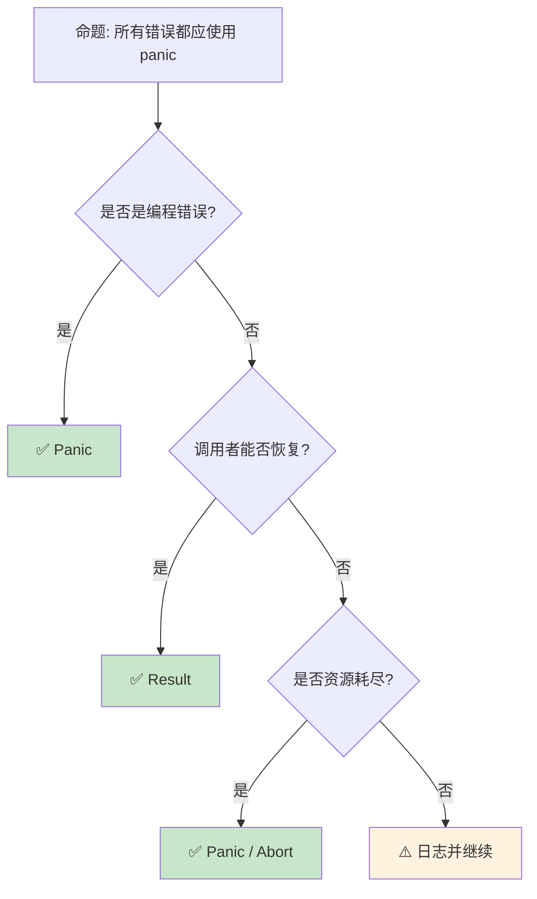

# Panic 与 Abort：不可恢复错误的处理机制

> **Bloom 层级**: 理解 → 应用
> **定位**: 系统讲解 Rust **panic** 机制——从 panic 与 Result 的哲学分野、panic 传播、到自定义 panic 处理和 abort 模式，揭示 Rust 如何在"优雅失败"与"快速崩溃"之间做出设计选择。
> **前置概念**: [Error Handling](../02_intermediate/15_error_handling_deep_dive.md) · [Ownership](./01_ownership.md)
> **后置概念**: [Unsafe](../03_advanced/03_unsafe.md) · [FFI](../03_advanced/05_rust_ffi.md)

---

> **来源**: [Rust Reference — Panics](https://doc.rust-lang.org/reference/runtime.html#panics) ·
> [TRPL — Unrecoverable Errors](https://doc.rust-lang.org/book/ch09-01-unrecoverable-errors-with-panic.html) ·
> [std::panic](https://doc.rust-lang.org/std/panic/index.html) ·
> [RFC 2361 — catch_panic](https://rust-lang.github.io/rfcs/2361-panic-safe-rust.html) ·
> [Wikipedia — Crash-only Software](https://en.wikipedia.org/wiki/Crash-only_software)

## 📑 目录
>
> [来源: [Rust Reference](https://doc.rust-lang.org/reference/)]
>
> [来源: [TRPL](https://doc.rust-lang.org/book/)]

- [Panic 与 Abort：不可恢复错误的处理机制](#panic-与-abort不可恢复错误的处理机制)
  - [📑 目录](#-目录)
  - [一、核心概念](#一核心概念)
    - [1.1 Panic 的语义](#11-panic-的语义)
    - [1.2 Panic vs Result](#12-panic-vs-result)
    - [1.3 Panic 传播与栈展开](#13-panic-传播与栈展开)
  - [二、技术细节](#二技术细节)
    - [2.1 自定义 Panic 处理](#21-自定义-panic-处理)
    - [2.2 Panic 钩子与日志](#22-panic-钩子与日志)
    - [2.3 Abort 模式](#23-abort-模式)
  - [三、设计模式矩阵](#三设计模式矩阵)
  - [四、反命题与边界分析](#四反命题与边界分析)
    - [4.1 反命题树](#41-反命题树)
    - [4.2 边界极限](#42-边界极限)
  - [五、常见陷阱](#五常见陷阱)
  - [六、来源与延伸阅读](#六来源与延伸阅读)
  - [相关概念文件](#相关概念文件)

---

## 一、核心概念
>
> [来源: [Rust Reference](https://doc.rust-lang.org/reference/)]
>
> [来源: [Rust Reference](https://doc.rust-lang.org/reference/)]

### 1.1 Panic 的语义

```text
Panic 的定义:
  ├── 不可恢复的错误状态
  ├── 表示程序存在 bug
  ├── 立即终止当前线程的执行
  └── 可选地展开栈（unwind）或中止（abort）

  Panic 触发方式:
  ├── 显式: panic!("message")
  ├── 断言: assert!(condition), assert_eq!(a, b)
  ├── 不可达: unreachable!()
  ├── 未实现: unimplemented!(), todo!()
  └── 越界/空值: .unwrap(), .expect("msg")

  Panic 的哲学:
  ├── "不应该发生"的错误
  ├── 违反契约 = bug
  ├── 与异常（Exception）不同
  │   ├── 异常: 可恢复的错误条件
  │   └── Panic: 程序状态损坏，无法继续
  └── 与 C 的 abort/segfault 不同
      ├── 更可控（可捕获、可自定义）
      └── 更安全（运行析构函数）

  核心原则:
  ├── API 契约被破坏时 panic
  ├── 不应使用 panic 处理预期错误
  └── 每个 panic 都应是可修复的 bug
```

> **认知功能**: Panic 是 Rust **"快速失败"哲学**的体现——当检测到内部不一致时，立即停止而非继续运行在不安全状态。
> [来源: [TRPL — Unrecoverable Errors](https://doc.rust-lang.org/book/ch09-01-unrecoverable-errors-with-panic.html)]

---

### 1.2 Panic vs Result

```text
何时 Panic，何时 Result?

  Panic 适用场景:
  ├── 编程错误（违反前置条件）
  │   └── 索引越界: vec[100] 当 len = 10
  ├── 内部状态不一致
  │   └── 非法的枚举变体组合
  ├── 无法合理恢复的情况
  │   └── 内存分配失败（在 no_std）
  └── 快速原型中暂时 unwrap

  Result 适用场景:
  ├── 外部输入可能无效
  │   └── 文件不存在、网络断开
  ├── 环境条件可能不满足
  │   └── 磁盘已满、权限不足
  ├── 调用者可以选择处理策略
  │   └── 重试、降级、报告错误
  └── API 设计: 让错误显式

  决策树:
  错误是否由调用者引起? ──否──→ 调用者能否修复? ──否──→ Panic
         │                           │
        是                         是
         │                           │
         └────→ Result ─────────────┘
> [来源: [TRPL](https://doc.rust-lang.org/book/)]

  经典对比:
  ├── String::from_utf8(vec) -> Result<String, FromUtf8Error>
  │   └── 输入可能无效，调用者负责
  └── slice::get_unchecked(index) -> &T
      └── unsafe: 调用者保证索引有效，否则 panic/UB
```

> **选择洞察**: **Panic 用于 bug，Result 用于预期错误**——这个区分是 Rust 错误处理设计的核心。
> [来源: [Rust API Guidelines — Panics](https://rust-lang.github.io/api-guidelines/documentation.html#function-docs-include-error-conditions-and-panic-conditions-c-failure)]

---

### 1.3 Panic 传播与栈展开

```text
Panic 传播机制:

  栈展开 (Unwind):
  ├── 沿调用栈向上传播
  ├── 每帧运行析构函数（Drop）
  ├── 释放已获取的资源
  ├── 线程 panic，其他线程继续
  └── 默认行为

  中止 (Abort):
  ├── 立即终止进程
  ├── 不运行析构函数
  ├── 更快的终止
  ├── 更小的二进制文件
  └── 适用于嵌入式/FFI

  配置方式:
  // Cargo.toml
  [profile.release]
  panic = "abort"  # 或 "unwind"

  捕获 Panic:
  use std::panic;

  let result = panic::catch_unwind(|| {
      might_panic();
  });

  match result {
      Ok(value) => println!("Success: {:?}", value),
      Err(_) => println!("Thread panicked!"),
  }

  限制:
  ├── catch_unwind 不能捕获所有 panic
  │   └── 例如: abort 模式、double panic
  ├── panic 负载必须是 UnwindSafe
  └── FFI 边界不应 panic（UB）
```

> **传播洞察**: **栈展开**是 Rust panic 相比 C abort 的**关键安全特性**——它保证资源在崩溃时被释放。
> [来源: [std::panic::catch_unwind](https://doc.rust-lang.org/std/panic/fn.catch_unwind.html)]

---

## 二、技术细节
>
> [来源: [Rust Reference](https://doc.rust-lang.org/reference/)]
>
> [来源: [TRPL](https://doc.rust-lang.org/book/)]

### 2.1 自定义 Panic 处理

```rust,ignore
// 自定义 panic 行为

use std::panic;

// 设置 panic 钩子
panic::set_hook(Box::new(|info| {
    println!("Custom panic handler!");

    if let Some(location) = info.location() {
        println!("Panic at {}:{}", location.file(), location.line());
    }

    if let Some(s) = info.payload().downcast_ref::<&str>() {
        println!("Message: {}", s);
    }

    // 自定义行为:
    // ├── 记录到日志
    // ├── 发送告警
    // ├── 生成核心转储
    // └── 优雅关闭服务
}));

// 获取并替换钩子
let old_hook = panic::take_hook();

// 在 no_std 环境中:
// #![feature(panic_handler)]
// #[panic_handler]
// fn panic(info: &PanicInfo) -> ! {
//     // 自定义 panic 处理（嵌入式）
//     loop {}
// }
```

> **自定义洞察**: Panic 钩子使 Rust 程序可以**集中处理崩溃**——记录、告警、优雅降级，而非简单地打印到 stderr。
> [来源: [std::panic::set_hook](https://doc.rust-lang.org/std/panic/fn.set_hook.html)]

---

### 2.2 Panic 钩子与日志

```text
Panic 与日志集成:

  标准做法:
  ├── panic 钩子中调用日志 crate
  ├── log::error!("Panic: {:?}", info)
  ├── tracing::error!("Panic occurred")
  └── 确保日志在 panic 前刷新

  结构化日志:
  ├── 记录 panic 位置（文件:行号）
  ├── 记录 panic 消息
  ├── 记录线程 ID
  └── 记录调用栈（如果可用）

  生产环境:
  ├── 优雅关闭（drain connections）
  ├── 发送错误报告（Sentry, Bugsnag）
  ├── 重启策略（supervisor, systemd）
  └── 避免无限 panic 循环

  示例集成:
  panic::set_hook(Box::new(|info| {
      log::error!("PANIC: {}", info);

      // 刷新日志
      log::logger().flush();

      // 发送错误报告
      sentry::capture_event(sentry::protocol::Event {
          message: Some(format!("{}", info)),
          level: sentry::Level::Fatal,
          ..Default::default()
      });
  }));
```

> **日志洞察**: **结构化 panic 日志**是生产环境可观测性的关键——它使事后分析成为可能。
> [来源: [log crate](https://docs.rs/log/latest/log/)]

---

### 2.3 Abort 模式

```rust,ignore
// Abort 模式详解

// 1. 全局配置
// Cargo.toml
[profile.release]
panic = "abort"

// 2. 代码中强制 abort
use std::process;

if unrecoverable_condition {
    process::abort();  // 立即中止，无析构
}

// 3. 自定义 panic 处理为 abort
#[cfg(panic = "abort")]
fn configure_panic() {
    // 在 abort 模式下，catch_unwind 不可用
}

// Abort 的适用场景:
// ├── 嵌入式系统（无 unwinding 支持）
// ├── 与 C 代码互操作（panic 跨越 FFI = UB）
// ├── 需要最小二进制文件
// └── 进程由外部监控器管理（systemd, k8s）

// Abort 的代价:
// ├── 不运行 Drop
// │   └── 内存泄漏、资源未释放
// ├── 无法 catch_unwind
// │   └── 线程边界隔离失效
// └── 调试信息减少
//     └── 无栈跟踪（取决于平台）
```

> **Abort 洞察**: `panic = "abort"` 是**嵌入式和 FFI**场景的常见选择——它以牺牲优雅性换取简单性和代码大小。
> [来源: [Rust Reference — Panic Strategy](https://doc.rust-lang.org/reference/runtime.html#the-panic_strategy-attribute)]

---

## 三、设计模式矩阵
>
> [来源: [Rust Reference](https://doc.rust-lang.org/reference/)]
>
> [来源: [Rust Reference](https://doc.rust-lang.org/reference/)]

```text
场景 → 处理方式 → 代码示例

不可变条件违反:
  → assert!, assert_eq!, assert_ne!
  → debug_assert!（release 模式忽略）
  → assert!(index < len, "Index out of bounds");

未实现功能:
  → todo!() 或 unimplemented!()
  → 编译通过但运行时 panic
  → fn new_feature() { todo!("Implement in Phase 2") }

不应到达的代码:
  → unreachable!()
  → 穷尽匹配后的 else 分支
  → match val { A => ..., B => ..., _ => unreachable!() }

可选值 unwrap:
  → 仅在测试或确定 Some/Ok 时
  → config.get("host").unwrap()
  → 生产代码应使用 ? 或 match

线程隔离:
  → catch_unwind + 线程边界
  → 防止单线程 panic 拖垮进程
  → std::thread::spawn(|| { ... }).join()
```

> **模式矩阵**: Panic 的**每种形式都有明确语义**——选择正确的宏可以传达意图（todo vs unreachable vs assert）。
> [来源: [Rust By Example — Panic](https://doc.rust-lang.org/rust-by-example/error/panic.html)]

---

## 四、反命题与边界分析
>
> [来源: [Rust Reference](https://doc.rust-lang.org/reference/)]
>
> [来源: [Rust Reference](https://doc.rust-lang.org/reference/)]

### 4.1 反命题树



> **认知功能**: **Result 是默认选择**——Panic 只在"这不应该发生"时使用。
> [来源: [Rust API Guidelines — Errors](https://rust-lang.github.io/api-guidelines/interoperability.html#error-types-are-meaningful-and-well-behaved-c-good-err)]

---

### 4.2 边界极限

```text
边界 1: Panic 安全性
├── 某些类型不是 UnwindSafe
├── panic 时可能破坏不变性
├── 需要 PoisonGuard（如 Mutex）
└── 缓解: 仔细设计析构函数

边界 2: FFI 边界
├── Panic 跨越 FFI = 未定义行为
├── 必须 catch_unwind 在 FFI 边界
├── 某些 C 运行时对 unwinding 不友好
└── 缓解: panic = "abort" 或 catch_unwind

边界 3: 析构函数中的 Panic
├── Drop 中 panic 可能导致双重 panic
├── 双重 panic → abort
├── 资源泄漏风险
└── 缓解: Drop 中避免 panic，记录错误

边界 4: 性能影响
├── 展开栈比 abort 慢
├── 编译器为 unwinding 生成额外代码
├── 代码体积增加（landing pads）
└── 缓解: release 模式用 abort

边界 5: 测试中的 Panic
├── #[should_panic] 测试
├── expected = "substring"
├── 验证 panic 条件
└── 但难以精确匹配消息
```

> **边界要点**: Panic 的边界主要与**UnwindSafe**、**FFI**、**析构函数**、**性能**和**测试**相关。
> [来源: [std::panic::UnwindSafe](https://doc.rust-lang.org/std/panic/trait.UnwindSafe.html)]

---

## 五、常见陷阱
>
> [来源: [Rust Reference](https://doc.rust-lang.org/reference/)]
>
> [来源: [TRPL](https://doc.rust-lang.org/book/)]

```text
陷阱 1: unwrap 滥用
  ❌ let file = File::open(path).unwrap();
     // 生产环境 panic！

  ✅ let file = File::open(path)?;
     // 或 unwrap_or_else(|e| { log::error!(...); default })

陷阱 2: 在库中使用 panic
  ❌ pub fn library_function() {
         panic!("internal error");
     }
     // 库的 panic 会传播到调用者

  ✅ pub fn library_function() -> Result<(), LibraryError> {
         Err(LibraryError::Internal)
     }

陷阱 3: 忽略 catch_unwind 的局限
  ❌ catch_unwind(|| { abort(); });
     // 无法捕获 abort！

  ✅ 理解 catch_unwind 只能捕获 unwinding panic
     // abort 和 double panic 无法捕获

陷阱 4: 在 async 中 panic
  ❌ async fn may_panic() { panic!("oops"); }
     // 可能破坏 executor 状态

  ✅ 使用 catch_unwind 包装关键路径
     // 或使用 Result 替代

陷阱 5: Poison 状态不处理
  ❌ let data = mutex.lock().unwrap();
     // 如果其他线程 panic，lock() 返回 Err(PoisonError)

  ✅ let data = mutex.lock().unwrap_or_else(|e| e.into_inner());
     // 明确处理 poison 状态
```

> **陷阱总结**: Panic 的陷阱主要与**unwrap 滥用**、**库设计**、**catch_unwind 局限**、**async** 和 **poison** 相关。
> [来源: [Rust Error Handling Best Practices](https://doc.rust-lang.org/rust-by-example/error.html)]

---

## 六、来源与延伸阅读
>
> [来源: [Rust Reference](https://doc.rust-lang.org/reference/)]

| 来源 | 可信度 | 说明 |
|:---|:---:|:---|
| [TRPL — Panic](https://doc.rust-lang.org/book/ch09-01-unrecoverable-errors-with-panic.html) | ✅ 一级 | 基础教程 |
| [std::panic](https://doc.rust-lang.org/std/panic/index.html) | ✅ 一级 | 标准库模块 |
| [RFC 2361](https://rust-lang.github.io/rfcs/2361-panic-safe-rust.html) | ✅ 一级 | Panic 安全 |
| [Rust Reference — Panic](https://doc.rust-lang.org/reference/runtime.html#panics) | ✅ 一级 | 参考 |

---

## 相关概念文件
>
> [来源: [Rust Reference](https://doc.rust-lang.org/reference/)]
>
> [来源: [Rust Reference](https://doc.rust-lang.org/reference/)]

- [Error Handling](../02_intermediate/15_error_handling_deep_dive.md) — 错误处理
- [Unsafe](../03_advanced/03_unsafe.md) — 不安全代码
- [FFI](../03_advanced/05_rust_ffi.md) — 外部函数接口

---

> **权威来源**: [Rust Reference](https://doc.rust-lang.org/reference/), [The Rust Programming Language](https://doc.rust-lang.org/book/)
>
> **权威来源对齐变更日志**: 2026-05-22 创建 [来源: Authority Source Sprint Batch 10]

**文档版本**: 1.0
**对应 Rust 版本**: 1.96.0+ (Edition 2024)
**最后更新**: 2026-05-22
**状态**: ✅ 概念文件创建完成
