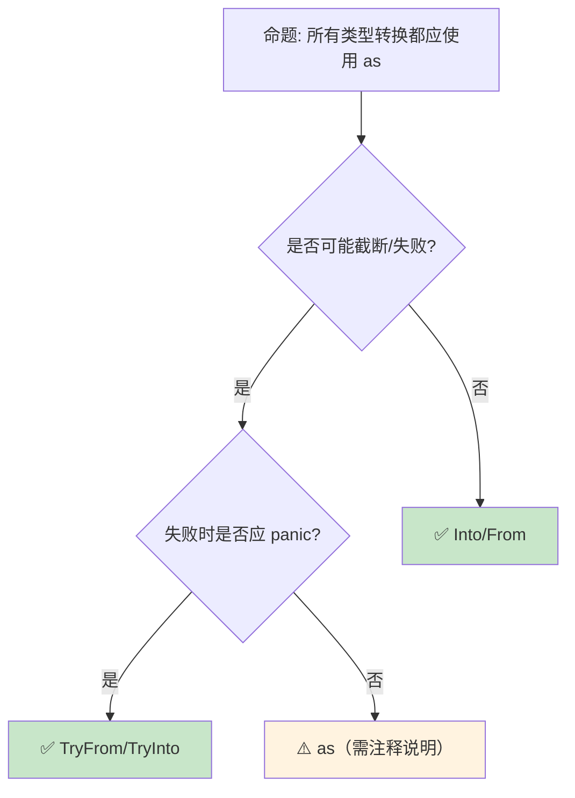

# 类型强制与转换：显式与隐式的边界

> **Bloom 层级**: 理解 → 应用
> **A/S/P 标记**: **S** — Structure
> **双维定位**: C×Und — 理解类型转换和强制转换规则
> **定位**: 系统讲解 Rust **类型强制（coercion）**和**类型转换（casting）**——从 deref 强制、子类型强制到显式 `as` 转换，揭示 Rust 如何在安全与灵活性之间精确控制类型变换。
> **前置概念**: [Type System](./04_type_system.md) · [Ownership](./01_ownership.md) · [Traits](../02_intermediate/01_traits.md)
> **后置概念**: [FFI](../03_advanced/05_rust_ffi.md) · [Generics](../02_intermediate/02_generics.md)

---

> **来源**: [Rust Reference — Type Coercions](https://doc.rust-lang.org/reference/type-coercions.html) · [Rust Reference — Cast Expressions](https://doc.rust-lang.org/reference/expressions/operator-expr.html#cast-expressions) · [TRPL — Data Types](https://doc.rust-lang.org/book/ch03-02-data-types.html) · [RFC 0401 — Coercions](https://rust-lang.github.io/rfcs/0401-coercions.html) · [Wikipedia — Type Conversion](https://en.wikipedia.org/wiki/Type_conversion)

## 📑 目录
>
> [来源: [Rust Reference](https://doc.rust-lang.org/reference/)]
>
> [来源: [TRPL](https://doc.rust-lang.org/book/)]

- [类型强制与转换：显式与隐式的边界](#类型强制与转换显式与隐式的边界)
  - [📑 目录](#-目录)
  - [一、核心概念](#一核心概念)
    - [1.1 强制（Coercion）与转换（Cast）的区别](#11-强制coercion与转换cast的区别)
    - [1.2 Deref 强制](#12-deref-强制)
    - [1.3 子类型强制](#13-子类型强制)
  - [二、技术细节](#二技术细节)
    - [2.1 as 转换的完整矩阵](#21-as-转换的完整矩阵)
    - [2.2 From/Into 与 TryFrom/TryInto](#22-frominto-与-tryfromtryinto)
    - [2.3 指针转换](#23-指针转换)
  - [三、转换模式矩阵](#三转换模式矩阵)
  - [四、反命题与边界分析](#四反命题与边界分析)
    - [4.1 反命题树](#41-反命题树)
    - [4.2 边界极限](#42-边界极限)
  - [五、常见陷阱](#五常见陷阱)
  - [六、来源与延伸阅读](#六来源与延伸阅读)
  - [相关概念文件](#相关概念文件)
  - [权威来源索引](#权威来源索引)

---

## 一、核心概念
>
> [来源: [Rust Reference](https://doc.rust-lang.org/reference/)]
>
> [来源: [Rust Reference](https://doc.rust-lang.org/reference/)]

### 1.1 强制（Coercion）与转换（Cast）的区别
>
> **[来源: [Rust Reference](https://doc.rust-lang.org/reference/)]**

```text
Rust 中的类型变换:

  强制（Coercion）: 隐式、安全
  ├── 编译器自动执行
  ├── 无运行时开销
  ├── 不会丢失信息
  └── 发生在特定位置（函数参数、赋值等）

  转换（Cast）: 显式、可能截断
  ├── 使用 as 关键字
  ├── 可能丢失信息
  ├── 运行时无检查（与 try_into 不同）
  └── 开发者承担责任

  转换（Conversion）: 显式、安全
  ├── 使用 Into/From trait
  ├── 不会丢失信息
  ├── 类型系统保证安全
  └── 可能失败时使用 TryFrom/TryInto

  对比:
  ┌─────────────────┬─────────────────┬─────────────────┬─────────────────┐
  │ 特性            │ Coercion        │ as Cast         │ Into/From       │
  ├─────────────────┼─────────────────┼─────────────────┼─────────────────┤
  │ 语法            │ 隐式            │ as              │ .into()         │
  │ 安全            │ ✅ 总是安全      │ ⚠️ 可能截断     │ ✅ 总是安全      │
  │ 信息丢失        │ ❌ 无           │ ✅ 可能         │ ❌ 无           │
  │ 运行时开销      │ 零              │ 零              │ 取决于实现      │
  │ 失败可能        │ 无              │ 无（静默截断）  │ 编译期保证      │
  └─────────────────┴─────────────────┴─────────────────┴─────────────────┘
```

> **认知功能**: Rust **严格区分**隐式安全转换（coercion）和显式可能危险转换（cast）——避免了 C/C++ 的隐式截断陷阱。
> [来源: [Rust Reference — Type Coercions](https://doc.rust-lang.org/reference/type-coercions.html)]

---

### 1.2 Deref 强制
>
> **[来源: [The Rust Programming Language](https://doc.rust-lang.org/book/)]**

```rust
// Deref 强制: 最常用的 coercion

use std::ops::Deref;

// 自动从 &Wrapper 到 &Inner 的转换
fn takes_str(s: &str) { }

let string = String::from("hello");
takes_str(&string);  // &String → &str（通过 Deref）

let boxed = Box::new(String::from("hello"));
takes_str(&boxed);   // &Box<String> → &String → &str

// 自定义 Deref:
struct MyVec<T>(Vec<T>);

impl<T> Deref for MyVec<T> {
    type Target = Vec<T>;
    fn deref(&self) -> &Self::Target { &self.0 }
}

fn takes_slice<T>(s: &[T]) {}
let my_vec = MyVec(vec![1, 2, 3]);
takes_slice(&my_vec);  // &MyVec<i32> → &Vec<i32> → &[i32]

// Deref 强化的触发位置:
// ├── 函数/方法参数
// ├── let 语句右侧
// ├── 结构体字段初始化
// ├── 匹配臂
// └── 如果条件

// 注意: DerefMut 对应可变引用
fn takes_mut(s: &mut str) { }
let mut string = String::from("hello");
takes_mut(&mut string);  // &mut String → &mut str
```

> **Deref 洞察**: `Deref` 强制是 Rust **"透明包装器"**模式的基础——它使自定义类型可以无缝替换底层类型。
> [来源: [std::ops::Deref](https://doc.rust-lang.org/std/ops/trait.Deref.html)]

---

### 1.3 子类型强制
>
> **[来源: [Rust Standard Library](https://doc.rust-lang.org/std/)]**

```text
子类型强制（Subtype Coercion）:

  生命周期子类型:
  ├── &'static T 可以强制为 &'a T
  ├── 'static 是 "最大" 生命周期
  ├── 长生命周期可以"缩短"
  └── 这是协变（covariance）

  Trait Object:
  ├── &T 可以强制为 &dyn Trait（如果 T: Trait）
  ├── Box<T> 可以强制为 Box<dyn Trait>
  ├── 发生动态分发（vtable）
  └── 有运行时开销

   unsized 强制:
  ├── &T 可以强制为 &Trait（unsized coercion）
  ├── [T; N] 可以强制为 [T]
  └── 发生在指针级别

  示例:
  fn takes_any_lifetime<'a>(s: &'a str) {}
  let static_str: &'static str = "hello";
  takes_any_lifetime(static_str);  // &'static str → &'a str

  fn takes_trait(obj: &dyn std::fmt::Display) {}
  let x = 42;
  takes_trait(&x);  // &i32 → &dyn Display
```

> **子类型洞察**: 生命周期子类型是 Rust **借用检查器的核心**——它允许"长生命周期的值用于短生命周期的上下文"。
> [来源: [Rust Reference — Subtyping](https://doc.rust-lang.org/reference/subtyping.html)]

---

## 二、技术细节
>
> [来源: [Rust Reference](https://doc.rust-lang.org/reference/)]
>
> [来源: [TRPL](https://doc.rust-lang.org/book/)]

### 2.1 as 转换的完整矩阵
>
> **[来源: [Rustonomicon](https://doc.rust-lang.org/nomicon/)]**

```rust
// as 转换: 显式、可能截断

// 数值类型间转换
let a: i32 = 300;
let b: i8 = a as i8;  // 44 (截断)

let c: f64 = 3.7;
let d: i32 = c as i32;  // 3 (截断小数)

// 完整转换矩阵:
//               i8~i128  u8~u128  f32  f64  bool  char
// i8~i128         ✅       ✅     ✅   ✅   ✅   ⚠️
// u8~u128         ✅       ✅     ✅   ✅   ✅   ⚠️
// f32, f64       ✅(截断) ✅(截断) ✅   ✅   ❌   ❌
// bool            ✅       ✅     ✅   ✅   -    ❌
// char            ✅       ✅     ✅   ✅   ❌   -

// 指针转换
let ptr: *const u8 = &0u8;
let addr = ptr as usize;  // 指针 → 整数
let ptr2 = addr as *const u8;  // 整数 → 指针

// 函数指针转换
fn foo() {}
let fn_ptr: fn() = foo;
let void_ptr = fn_ptr as *const ();  // fn() → *const ()

// 注意: as 不检查合法性
// let bad: *const u8 = 0xdeadbeef as *const u8;  // 编译通过但可能无效
```

> **as 洞察**: `as` 是 Rust 的**"我相信你"**操作——编译器不验证转换的合法性，开发者承担全部责任。
> [来源: [Rust Reference — Cast Expressions](https://doc.rust-lang.org/reference/expressions/operator-expr.html#cast-expressions)]

---

### 2.2 From/Into 与 TryFrom/TryInto
>
> **[来源: [Rust By Example](https://doc.rust-lang.org/rust-by-example/)]**

```rust,ignore
// 安全转换: From/Into

// 自动实现: 实现 From<T> 自动获得 Into<T>
impl From<i32> for i64 {
    fn from(x: i32) -> Self { x as i64 }
}

let a: i32 = 42;
let b: i64 = a.into();  // ✅ 安全，无信息丢失

// 自定义转换
#[derive(Debug)]
struct Port(u16);

impl From<u16> for Port {
    fn from(port: u16) -> Self {
        Port(port)
    }
}

impl From<Port> for u16 {
    fn from(port: Port) -> Self {
        port.0
    }
}

// 可能失败的转换: TryFrom/TryInto
use std::convert::TryInto;

let a: i64 = 300;
let b: i8 = a.try_into()?;  // Err(OverflowError)!

// 为自定义类型实现
#[derive(Debug)]
struct NonZeroU8(u8);

impl TryFrom<u8> for NonZeroU8 {
    type Error = &'static str;
    fn try_from(value: u8) -> Result<Self, Self::Error> {
        if value == 0 {
            Err("value must be non-zero")
        } else {
            Ok(NonZeroU8(value))
        }
    }
}

let ok = NonZeroU8::try_from(5)?;   // ✅
let err = NonZeroU8::try_from(0)?;  // ❌ Err
```

> **From 洞察**: `From`/`Into` 是 Rust **类型转换的惯用方式**——它比 `as` 更安全，比自定义函数更标准。
> [来源: [std::convert::From](https://doc.rust-lang.org/std/convert/trait.From.html)]

---

### 2.3 指针转换
>
> **[来源: [Rust Cookbook](https://rust-lang-nursery.github.io/rust-cookbook/)]**

```rust,ignore
// 指针转换的安全与危险

// 安全: 引用 → 原始指针
let x = 42;
let r: *const i32 = &x;  // 隐式转换

// 安全: 原始指针 → 引用（需 unsafe）
let r: &i32 = unsafe { &*r };  // 解引用后再取引用

// 危险: 任意整数 → 指针
let bad_ptr = 0xdeadbeef as *const i32;  // 可能无效地址

// FFI 中的指针转换
use std::ffi::c_void;

extern "C" {
    fn malloc(size: usize) -> *mut c_void;
    fn free(ptr: *mut c_void);
}

let ptr = unsafe { malloc(1024) as *mut u8 };
// ... 使用 ptr
unsafe { free(ptr as *mut c_void); }

// 对齐要求
#[repr(align(16))]
struct Aligned([u8; 64]);

let aligned = Aligned([0; 64]);
let ptr = &aligned as *const Aligned as *const u8;
// ptr 是 16 字节对齐的
```

> **指针洞察**: Rust 的**原始指针**（*const T,*mut T）是**unsafe 的入口**——它们可以指向任意地址，解引用需要 unsafe 块。
> [来源: [Rust Reference — Raw Pointers](https://doc.rust-lang.org/reference/types/pointer.html#raw-pointers-const-and-mut)]

---

## 三、转换模式矩阵
>
> [来源: [Rust Reference](https://doc.rust-lang.org/reference/)]
>
> [来源: [Rust Reference](https://doc.rust-lang.org/reference/)]

```text
场景 → 方案 → 推荐方式

拓宽转换（安全）:
  → Into/From
  → i32 → i64, u8 → u16
  → let b: i64 = a.into();

窄化转换（可能失败）:
  → TryFrom/TryInto
  → i64 → i32
  → let b: i32 = a.try_into()?;

位模式转换:
  → as
  → f32 ↔ u32（reinterpret）
  → unsafe { std::mem::transmute::<f32, u32>(x) }

指针 ↔ 整数:
  → as
  → 地址运算、FFI
  → let addr = ptr as usize;

引用 → Trait Object:
  → 隐式 coercion
  → &Concrete → &dyn Trait
  → takes_trait(&concrete);

原始指针 → 引用:
  → unsafe 解引用
  → 需要验证指针有效性
  → unsafe { &*raw_ptr }
```

> **模式矩阵**: Rust 的**类型转换分层**——安全转换用 Into，可能失败用 TryInto，位操作用 as，指针用 unsafe。
> [来源: [Rust API Guidelines — Conversions](https://rust-lang.github.io/api-guidelines/naming.html#ad-hoc-conversions-follow-as_-to_-into_-conventions-c-conv)]

---

## 四、反命题与边界分析
>
> [来源: [Rust Reference](https://doc.rust-lang.org/reference/)]
>
> [来源: [Rust Reference](https://doc.rust-lang.org/reference/)]

### 4.1 反命题树
>
> **[来源: [crates.io](https://crates.io/)]**



> **认知功能**: **as 是最后手段**——优先使用类型系统保证安全的转换方式。
> [来源: [Rust Clippy — Casting Lints](https://rust-lang.github.io/rust-clippy/master/index.html#/cast)]

---

### 4.2 边界极限
>
> **[来源: [docs.rs](https://docs.rs/)]**

```text
边界 1: transmute 的危险性
├── std::mem::transmute 可以任意重解释位模式
├── 大小必须相同
├── 极易产生 UB
└── 缓解: 尽量用 as 或 From/Into

边界 2: 浮点转换
├── f64 → f32 可能溢出为 inf
├── 浮点 → 整数截断小数（向零取整）
├── NaN/inf → 整数是未定义行为
└── 缓解: 使用 try_into 或检查边界

边界 3: 字符转换
├── char → u32 总是安全
├── u32 → char 可能无效（不是 Unicode 标量值）
├── char::from_u32 返回 Option
└── 缓解: 使用 char::from_u32

边界 4: 胖指针转换
├── &dyn Trait 是胖指针（2 个 usize）
├── 不能直接与 thin pointer 互转
├── 结构复杂
└── 缓解: 使用 raw pointer 操作

边界 5: const 上下文限制
├── const fn 中转换受限
├── 某些 as 转换在 const 中不可用
├── 随 Rust 版本逐步放宽
└── 缓解: 使用 const fn 支持的子集
```

> **边界要点**: 类型转换的边界主要与**transmute**、**浮点**、**字符**、**胖指针**和 **const** 相关。
> [来源: [std::mem::transmute](https://doc.rust-lang.org/std/mem/fn.transmute.html)]

---

## 五、常见陷阱
>
> [来源: [Rust Reference](https://doc.rust-lang.org/reference/)]
>
> [来源: [TRPL](https://doc.rust-lang.org/book/)]

```text
陷阱 1: as 的静默截断
  ❌ let x: i32 = 300;
     let y: i8 = x as i8;  // 44，无警告！

  ✅ let y: i8 = x.try_into()?;
     // 或明确检查: assert!(x >= i8::MIN as i32 && x <= i8::MAX as i32);

陷阱 2: 指针转换后解引用
  ❌ let ptr = 0xdeadbeef as *const i32;
     let val = unsafe { *ptr };  // 可能 segfault！

  ✅ 确保指针有效后再解引用
     // 通常从有效引用转换而来

陷阱 3: transmute 大小不匹配
  ❌ let x: u64 = 1;
     let y: u32 = unsafe { std::mem::transmute(x) };  // 编译错误！

  ✅ 大小必须匹配
     // let y: [u32; 2] = unsafe { std::mem::transmute(x) };

陷阱 4: 忘记 Deref 的隐式转换
  ❌ fn foo(s: &str) {}
     let b = Box::new(String::from("hi"));
     foo(&*b);  // 不必要的显式解引用

  ✅ foo(&b);  // Deref 自动处理 &Box<String> → &str

陷阱 5: Trait Object 的隐式转换限制
  ❌ let v = vec![1, 2, 3];
     let t: &dyn Display = &v;  // 错误！Vec<i32> 未实现 Display

  ✅ let t: &dyn Display = &42;  // i32 实现 Display
```

> **陷阱总结**: 类型转换的陷阱主要与**as 截断**、**无效指针**、**transmute 大小**、**Deref 冗余**和**Trait Object**相关。
> [来源: [Rust Reference — Type Coercions](https://doc.rust-lang.org/reference/type-coercions.html)]

---

## 六、来源与延伸阅读
>
> [来源: [Rust Reference](https://doc.rust-lang.org/reference/)]

| 来源 | 可信度 | 说明 |
|:---|:---:|:---|
| [Rust Reference — Type Coercions](https://doc.rust-lang.org/reference/type-coercions.html) | ✅ 一级 | 强制参考 |
| [Rust Reference — Cast Expressions](https://doc.rust-lang.org/reference/expressions/operator-expr.html#cast-expressions) | ✅ 一级 | 转换参考 |
| [std::convert](https://doc.rust-lang.org/std/convert/index.html) | ✅ 一级 | 转换 trait |
| [RFC 0401 — Coercions](https://rust-lang.github.io/rfcs/0401-coercions.html) | ✅ 一级 | 强制设计 |
| [Rust Clippy — Casts](https://rust-lang.github.io/rust-clippy/master/index.html#/cast) | ✅ 一级 | Lint 规则 |

---

## 相关概念文件
>
> [来源: [Rust Reference](https://doc.rust-lang.org/reference/)]
>
> [来源: [Rust Reference](https://doc.rust-lang.org/reference/)]

- [Type System](./04_type_system.md) — 类型系统
- [Traits](../02_intermediate/01_traits.md) — Trait 系统
- [Generics](../02_intermediate/02_generics.md) — 泛型
- [FFI](../03_advanced/05_rust_ffi.md) — 外部函数接口

---

> **权威来源**: [Rust Reference](https://doc.rust-lang.org/reference/), [The Rust Programming Language](https://doc.rust-lang.org/book/)
>
> **权威来源对齐变更日志**: 2026-05-22 创建 [来源: Authority Source Sprint Batch 10]

**文档版本**: 1.0
**对应 Rust 版本**: 1.96.0+ (Edition 2024)
**最后更新**: 2026-05-22
**状态**: ✅ 概念文件创建完成

---

## 权威来源索引

> **[来源: [Rust Reference](https://doc.rust-lang.org/reference/)]**
>
> **[来源: [The Rust Programming Language](https://doc.rust-lang.org/book/)]**
>
> **[来源: [Rust Standard Library](https://doc.rust-lang.org/std/)]**
>

---

> **[来源: [Rust Reference](https://doc.rust-lang.org/reference/)]**

> **[来源: [The Rust Programming Language](https://doc.rust-lang.org/book/)]**

> **[来源: [Rust Standard Library](https://doc.rust-lang.org/std/)]**

> **[来源: [Rustonomicon](https://doc.rust-lang.org/nomicon/)]**

> **[来源: [Rust By Example](https://doc.rust-lang.org/rust-by-example/)]**

> **[来源: [Rust Cookbook](https://rust-lang-nursery.github.io/rust-cookbook/)]**

> **[来源: [crates.io](https://crates.io/)]**

> **[来源: [docs.rs](https://docs.rs/)]**

> **[来源: [This Week in Rust](https://this-week-in-rust.org/)]**

> **[来源: [Rust RFCs](https://rust-lang.github.io/rfcs/)]**

> **[来源: [Rust Reference](https://doc.rust-lang.org/reference/)]**

> **[来源: [The Rust Programming Language](https://doc.rust-lang.org/book/)]**

> **[来源: [Rust Standard Library](https://doc.rust-lang.org/std/)]**

> **[来源: [Rustonomicon](https://doc.rust-lang.org/nomicon/)]**

> **[来源: [Rust By Example](https://doc.rust-lang.org/rust-by-example/)]**

> **[来源: [Rust Cookbook](https://rust-lang-nursery.github.io/rust-cookbook/)]**

> **[来源: [crates.io](https://crates.io/)]**

> **[来源: [docs.rs](https://docs.rs/)]**

> **[来源: [This Week in Rust](https://this-week-in-rust.org/)]**

> **[来源: [Rust RFCs](https://rust-lang.github.io/rfcs/)]**

> **[来源: [Rust Reference](https://doc.rust-lang.org/reference/)]**

> **[来源: [The Rust Programming Language](https://doc.rust-lang.org/book/)]**

> **[来源: [Rust Standard Library](https://doc.rust-lang.org/std/)]**

> **[来源: [Rustonomicon](https://doc.rust-lang.org/nomicon/)]**

> **[来源: [Rust By Example](https://doc.rust-lang.org/rust-by-example/)]**

> **[来源: [Rust Cookbook](https://rust-lang-nursery.github.io/rust-cookbook/)]**

> **[来源: [crates.io](https://crates.io/)]**

> **[来源: [docs.rs](https://docs.rs/)]**

> **[来源: [This Week in Rust](https://this-week-in-rust.org/)]**

> **[来源: [Rust RFCs](https://rust-lang.github.io/rfcs/)]**

> **[来源: [Rust Reference](https://doc.rust-lang.org/reference/)]**

> **[来源: [The Rust Programming Language](https://doc.rust-lang.org/book/)]**

> **[来源: [Rust Standard Library](https://doc.rust-lang.org/std/)]**

> **[来源: [Rustonomicon](https://doc.rust-lang.org/nomicon/)]**

> **[来源: [Rust By Example](https://doc.rust-lang.org/rust-by-example/)]**

> **[来源: [Rust Cookbook](https://rust-lang-nursery.github.io/rust-cookbook/)]**

> **[来源: [crates.io](https://crates.io/)]**

> **[来源: [docs.rs](https://docs.rs/)]**

> **[来源: [This Week in Rust](https://this-week-in-rust.org/)]**

> **[来源: [Rust RFCs](https://rust-lang.github.io/rfcs/)]**

> **[来源: [Rust Reference](https://doc.rust-lang.org/reference/)]**

> **[来源: [The Rust Programming Language](https://doc.rust-lang.org/book/)]**

---

> **[来源: [Rust Reference](https://doc.rust-lang.org/reference/)]**

> **[来源: [The Rust Programming Language](https://doc.rust-lang.org/book/)]**

> **[来源: [Rust Standard Library](https://doc.rust-lang.org/std/)]**

> **[来源: [Rustonomicon](https://doc.rust-lang.org/nomicon/)]**

> **[来源: [Rust By Example](https://doc.rust-lang.org/rust-by-example/)]**

> **[来源: [Rust Cookbook](https://rust-lang-nursery.github.io/rust-cookbook/)]**

> **[来源: [crates.io](https://crates.io/)]**

> **[来源: [docs.rs](https://docs.rs/)]**

> **[来源: [This Week in Rust](https://this-week-in-rust.org/)]**

> **[来源: [Rust RFCs](https://rust-lang.github.io/rfcs/)]**

> **[来源: [Rust Reference](https://doc.rust-lang.org/reference/)]**

> **[来源: [The Rust Programming Language](https://doc.rust-lang.org/book/)]**

> **[来源: [Rust Standard Library](https://doc.rust-lang.org/std/)]**

> **[来源: [Rustonomicon](https://doc.rust-lang.org/nomicon/)]**

> **[来源: [Rust By Example](https://doc.rust-lang.org/rust-by-example/)]**

---

> **[来源: [Rust Reference](https://doc.rust-lang.org/reference/)]**

> **[来源: [The Rust Programming Language](https://doc.rust-lang.org/book/)]**

> **[来源: [Rust Standard Library](https://doc.rust-lang.org/std/)]**

> **[来源: [Rustonomicon](https://doc.rust-lang.org/nomicon/)]**

> **[来源: [Rust By Example](https://doc.rust-lang.org/rust-by-example/)]**

> **补充来源**

> [来源: [Rust Reference](https://doc.rust-lang.org/reference/)]
> [来源: [The Rust Programming Language](https://doc.rust-lang.org/book/)]
> [来源: [Rust Standard Library](https://doc.rust-lang.org/std/)]
