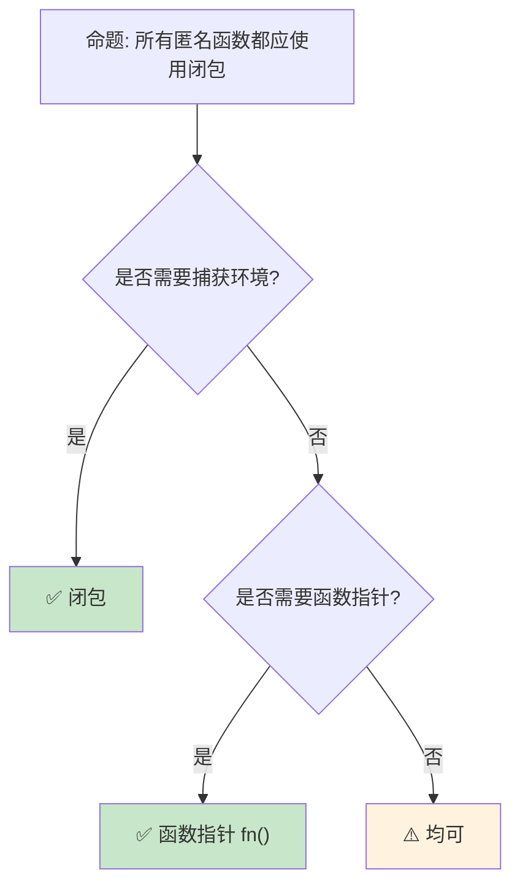

# 闭包基础：捕获环境与匿名函数

> **Bloom 层级**: 理解 → 应用
> **A/S/P 标记**: **A+S** — Application + Structure
> **双维定位**: C×App — 应用闭包和捕获模式
> **定位**: 系统讲解 Rust **闭包（Closure）**——从环境捕获、Fn/FnMut/FnOnce trait 到闭包作为参数和返回值，揭示 Rust 如何将函数式编程的灵活性与所有权系统的安全性结合。
> **前置概念**: [Traits](../02_intermediate/01_traits.md) · [Ownership](./01_ownership.md) · [Borrowing](./02_borrowing.md)
> **后置概念**: [Iterator](../02_intermediate/16_iterator_patterns.md) · [Async](../03_advanced/02_async.md) · [Functional Patterns](../02_intermediate/07_closure_types.md)

---

> **来源**: [TRPL — Closures](https://doc.rust-lang.org/book/ch13-01-closures.html) ·
> [Rust Reference — Closure Expressions](https://doc.rust-lang.org/reference/expressions/closure-expr.html) ·
> [std::ops::Fn](https://doc.rust-lang.org/std/ops/trait.Fn.html) ·
> [RFC 1558 — Closures](https://rust-lang.github.io/rfcs/1558-closure-to-fn-coercion.html) ·
> [Wikipedia — Closure (computer programming)](https://en.wikipedia.org/wiki/Closure_(computer_programming))

## 📑 目录

- [闭包基础：捕获环境与匿名函数](#闭包基础捕获环境与匿名函数)
  - [📑 目录](#-目录)
  - [一、核心概念](#一核心概念)
    - [1.1 闭包的语法与捕获](#11-闭包的语法与捕获)
    - [1.2 Fn / FnMut / FnOnce](#12-fn--fnmut--fnonce)
    - [1.3 闭包与所有权](#13-闭包与所有权)
  - [二、技术细节](#二技术细节)
    - [2.1 闭包作为函数参数](#21-闭包作为函数参数)
    - [2.2 闭包与类型推断](#22-闭包与类型推断)
    - [2.3 move 闭包](#23-move-闭包)
  - [三、闭包模式矩阵](#三闭包模式矩阵)
  - [四、反命题与边界分析](#四反命题与边界分析)
    - [4.1 反命题树](#41-反命题树)
    - [4.2 边界极限](#42-边界极限)
  - [五、常见陷阱](#五常见陷阱)
  - [六、来源与延伸阅读](#六来源与延伸阅读)
  - [相关概念文件](#相关概念文件)
  - [权威来源索引](#权威来源索引)
  - [十、边界测试：闭包的编译错误](#十边界测试闭包的编译错误)
    - [10.1 边界测试：闭包捕获环境后环境失效（编译错误）](#101-边界测试闭包捕获环境后环境失效编译错误)
    - [10.2 边界测试：`Fn` vs `FnMut` vs `FnOnce` 不匹配（编译错误）](#102-边界测试fn-vs-fnmut-vs-fnonce-不匹配编译错误)
    - [10.3 边界测试：`move` 闭包与 `Copy` 类型的交互（编译错误/逻辑错误）](#103-边界测试move-闭包与-copy-类型的交互编译错误逻辑错误)
    - [10.4 边界测试：闭包类型与 `impl Trait` 返回（编译错误）](#104-边界测试闭包类型与-impl-trait-返回编译错误)
    - [10.5 边界测试：闭包捕获模式与 `move` 关键字的语义（编译错误）](#105-边界测试闭包捕获模式与-move-关键字的语义编译错误)
    - [10.6 边界测试：闭包 trait 的自动推导与显式约束（编译错误）](#106-边界测试闭包-trait-的自动推导与显式约束编译错误)

---

## 一、核心概念

### 1.1 闭包的语法与捕获

```rust
// 闭包的基本语法

// 1. 最简单的闭包
let add_one = |x| x + 1;
assert_eq!(add_one(5), 6);

// 2. 多参数
let add = |x, y| x + y;
assert_eq!(add(1, 2), 3);

// 3. 显式类型标注（通常可推断）
let add = |x: i32, y: i32| -> i32 { x + y };

// 4. 捕获环境
let factor = 2;
let multiply = |x| x * factor;  // factor 被捕获
assert_eq!(multiply(5), 10);

// 5. 多语句闭包
let process = |x: i32| -> i32 {
    let doubled = x * 2;
    let incremented = doubled + 1;
    incremented
};

// 捕获方式:
// ├── 不可变借用: &T（默认，如果可能）
// ├── 可变借用: &mut T（如果需要修改）
// └── 移动: T（使用 move 关键字）
```

> **认知功能**: Rust 闭包是**匿名函数 + 环境捕获**——编译器自动推断捕获方式，遵循所有权规则。
> [来源: [TRPL — Closures](https://doc.rust-lang.org/book/ch13-01-closures.html)]

---

### 1.2 Fn / FnMut / FnOnce

```rust
// 三种闭包 trait

// Fn: 不可变借用捕获，可多次调用
fn call_fn<F>(f: F)
where F: Fn() {
    f();
    f();  // 可以多次调用
}

// FnMut: 可变借用捕获，可多次调用
fn call_fn_mut<F>(mut f: F)
where F: FnMut() {
    f();
    f();  // 可以多次调用
}

// FnOnce: 移动捕获，只能调用一次
fn call_fn_once<F>(f: F)
where F: FnOnce() {
    f();
    // f();  // 编译错误！只能调用一次
}

// 自动推导:
let s = String::from("hello");

// Fn: 只读引用
let closure_fn = |x: &str| println!("{} {}", s, x);
// s 被 &String 捕获

// FnMut: 可变引用
let mut count = 0;
let mut closure_fn_mut = || {
    count += 1;  // count 被 &mut i32 捕获
};

// FnOnce: 移动所有权
let s = String::from("hello");
let closure_fn_once = move || {
    drop(s);  // s 被 move 进闭包
};

// 继承关系:
// Fn <: FnMut <: FnOnce
// 实现 Fn 自动实现 FnMut 和 FnOnce
// 实现 FnMut 自动实现 FnOnce
```

> **Trait 洞察**: **Fn/FnMut/FnOnce 是 Rust 闭包的核心类型系统**——它们精确描述了闭包对环境的访问方式。
> [来源: [std::ops::Fn](https://doc.rust-lang.org/std/ops/trait.Fn.html)]

---

### 1.3 闭包与所有权
>

```rust
// 闭包捕获与所有权的交互

// 场景 1: 不可变借用
let s = String::from("hello");
let c = |x| println!("{} {}", s, x);  // s 被 &String 捕获
c("world");
println!("{}", s);  // ✅ s 仍可用

// 场景 2: 可变借用
let mut v = vec![1, 2, 3];
let mut c = || v.push(4);  // v 被 &mut Vec 捕获
c();
// println!("{:?}", v);  // ❌ v 被闭包可变借用

// 场景 3: move 闭包
let s = String::from("hello");
let c = move || println!("{}", s);  // s 被 move 进闭包
c();
// println!("{}", s);  // ❌ s 已被 move

// 场景 4: 强制 copy 捕获
let x = 5;
let c = || println!("{}", x);  // x 被 &i32 捕获（i32: Copy）
c();
c();  // ✅ 可以多次调用（Fn）

// move 与 Copy 类型:
let x = 5;
let c = move || x;  // x 被 copy（不是 move）
println!("{}", x);  // ✅ i32 是 Copy
```

> **所有权洞察**: 闭包的**捕获方式由编译器自动推断**——但开发者可以通过 `move` 关键字强制移动捕获。
> [来源: [Rust Reference — Closure Expressions](https://doc.rust-lang.org/reference/expressions/closure-expr.html)]

---

## 二、技术细节

### 2.1 闭包作为函数参数

```rust
// 高阶函数：接受闭包作为参数

// 1. 简单高阶函数
fn apply_twice<F>(f: F, x: i32) -> i32
where F: Fn(i32) -> i32,
{
    f(f(x))
}

let result = apply_twice(|x| x + 1, 5);  // 7

// 2. 迭代器风格的高阶函数
fn filter_and_map<T, F, G>(
    items: Vec<T>,
    predicate: F,
    transform: G,
) -> Vec<i32>
where
    F: Fn(&T) -> bool,
    G: Fn(T) -> i32,
{
    items.into_iter()
        .filter(predicate)
        .map(transform)
        .collect()
}

// 3. 返回闭包（需要 'static 或显式生命周期）
fn make_adder(x: i32) -> impl Fn(i32) -> i32 {
    move |y| x + y  // x 被 move，闭包是 'static
}

let add_five = make_adder(5);
assert_eq!(add_five(10), 15);

// 4. 闭包 trait 对象（动态分发）
fn dynamic_closure(f: Box<dyn Fn(i32) -> i32>) -> i32 {
    f(42)
}
```

> **高阶洞察**: Rust 的**高阶函数**与闭包结合，提供了与函数式语言相当的表达能力，同时保持类型安全。
> [来源: [Rust By Example — Closures](https://doc.rust-lang.org/rust-by-example/fn/closures.html)]

---

### 2.2 闭包与类型推断
>

```rust,ignore
// 闭包的类型推断

// 编译器推断闭包类型:
let closure = |x| x + 1;
// 类型: 某种实现 Fn(i32) -> i32 的匿名结构体

// 每个闭包是唯一的类型！
let c1 = || {};
let c2 = || {};
// c1 和 c2 是不同的类型

// 但可以实现相同的 trait:
fn take_closure<F: Fn()>(f: F) {}
take_closure(c1);
take_closure(c2);  // ✅ 都满足 Fn()

// 闭包大小:
// ├── 空闭包: 0 字节（类似 unit 结构体）
// ├── 捕获一个引用: 8/16 字节（指针大小）
// ├── 捕获一个 String: 24 字节（ptr + len + cap）
// └── 闭包大小 = 捕获变量大小之和

// 闭包不能比较（除非实现特定 trait）:
// let c1 = || 1;
// let c2 = || 1;
// assert_eq!(c1, c2);  // ❌ 编译错误！

// 闭包可以强制转换为函数指针（如果无捕获）:
let f: fn(i32) -> i32 = |x| x + 1;
// 仅当闭包不捕获环境时
```

> **推断洞察**: 每个闭包是**唯一的匿名类型**——这是 Rust 实现零成本抽象的**关键设计**。
> [来源: [RFC 1558 — Closure to Fn Coercion](https://rust-lang.github.io/rfcs/1558-closure-to-fn-coercion.html)]

---

### 2.3 move 闭包
>

```rust,ignore
// move 关键字：强制按值捕获

// 场景 1: 延长生命周期
fn make_closure<'a>(s: &'a str) -> impl Fn() + 'a {
    // let c = || println!("{}", s);  // 可能不够长
    let c = move || println!("{}", s.to_string());  // 复制数据
    c
}

// 场景 2: 跨线程发送
let data = vec![1, 2, 3];
std::thread::spawn(move || {
    println!("{:?}", data);
}).join().unwrap();
// data 被 move 进新线程

// 场景 3: 在 async 中
let resource = get_resource();
let future = async move {
    use_resource(resource).await;
};
// resource 被 move 进 future

// move 与 Copy:
let x = 5;
let c = move || x;  // x 被 copy（不是 move）
println!("{}", x);  // ✅ i32: Copy

let s = String::from("hello");
let c = move || s;  // s 被 move
// println!("{}", s);  // ❌ s 已被 move

// move 与引用:
let s = String::from("hello");
let c = move || &s;  // ❌ 编译错误！s 被 move，无法返回引用
```

> **move 洞察**: `move` 是**控制闭包所有权的显式工具**——它在需要延长数据生命周期或跨线程/异步边界时使用。
> [来源: [TRPL — Move Closures](https://doc.rust-lang.org/book/ch13-01-closures.html#moving-captured-values-out-of-the-closure-and-the-fn-traits)]

---

## 三、闭包模式矩阵

```text
场景 → 闭包类型 → 使用方式

回调函数:
  → Fn / FnMut
  → 事件处理、回调注册
  → button.on_click(|| println!("clicked"));

迭代器适配:
  → Fn
  → map, filter, fold
  → items.iter().map(|x| x * 2)

延迟计算:
  → FnOnce / Fn
  → 惰性求值、缓存
  → once_cell::Lazy::new(|| expensive())

线程入口:
  → FnOnce + Send + 'static
  → thread::spawn(move || { ... })

async 块:
  → 类似闭包，但异步
  → async move { ... }

排序比较:
  → Fn(&T, &T) -> Ordering
  → items.sort_by(|a, b| a.cmp(b))
```

> **模式矩阵**: 闭包是 Rust **函数式编程风格的核心**——它们与迭代器、异步和并发深度集成。
> [来源: [Rust Patterns — Closures](https://rust-unofficial.github.io/patterns/patterns/functional/closure.html)]

---

## 四、反命题与边界分析

### 4.1 反命题树
>



> **认知功能**: **不捕获环境时使用 fn 指针或普通函数**——它们更简单且有明确类型。
> [来源: [Rust API Guidelines — Functions](https://rust-lang.github.io/api-guidelines/naming.html)]

---

### 4.2 边界极限
>

```text
边界 1: 闭包类型的大小
├── 大捕获增加闭包大小
├── 闭包按值传递时复制开销
├── 建议 Box<dyn Fn()> 减少复制
└── 缓解: 使用 Rc/Arc 共享大捕获

边界 2: 递归闭包
├── 闭包不能直接递归调用自身
├── 需要 Y combinator 或固定点组合子
├── 复杂且不直观
└── 缓解: 使用普通递归函数

边界 3: 闭包与 Trait Object
├── Box<dyn Fn()> 有动态分发开销
├── 不适合性能关键路径
├── 但提供类型擦除能力
└── 缓解: 泛型参数（单态化）

边界 4: 生命周期复杂化
├── 捕获引用的闭包有生命周期约束
├── 返回借用闭包需要显式标注
├── 可能与 HRTB 交互
└── 缓解: 使用 owned 数据或 'static

边界 5: 调试困难
├── 闭包是匿名类型，调试信息有限
├── 堆栈跟踪中闭包名称不友好
├── 某些 IDE 对闭包支持有限
└── 缓解: 为重要闭包提供命名包装
```

> **边界要点**: 闭包的边界主要与**大小**、**递归**、**动态分发**、**生命周期**和**调试**相关。
> [来源: [Rust Reference — Closure Types](https://doc.rust-lang.org/reference/types/closure.html)]

---

## 五、常见陷阱

```text
陷阱 1: 可变捕获与多次调用冲突
  ❌ let mut s = String::from("hello");
     let c = || s.push_str(" world");  // FnMut
     call_fn(c);  // 需要 Fn

  ✅ let mut s = String::from("hello");
     let mut c = || s.push_str(" world");
     call_fn_mut(&mut c);

陷阱 2: 忘记 move 导致生命周期问题
  ❌ let s = String::from("hello");
     std::thread::spawn(|| println!("{}", s));
     // 编译错误：s 可能不够长

  ✅ std::thread::spawn(move || println!("{}", s));
     // s 被 move 进闭包

陷阱 3: 在闭包中返回局部引用
  ❌ let c = |x: &str| -> &str { let s = x.to_string(); &s };
     // 返回局部变量引用

  ✅ let c = |x: &str| -> String { x.to_string() };
     // 返回 owned 值

陷阱 4: 混淆 Fn trait bound
  ❌ fn takes_fn<F: FnOnce()>(f: F) { f(); f(); }
     // 只能调用一次

  ✅ fn takes_fn<F: Fn()>(f: F) { f(); f(); }
     // 可以多次调用

陷阱 5: 大闭包的性能问题
  ❌ 闭包捕获大量数据
     // 按值传递时复制开销大

  ✅ 使用 Rc/Arc 共享数据
     // 或 Box< dyn Fn() > 减少复制
```

> **陷阱总结**: 闭包的陷阱主要与**Fn trait 选择**、**move 遗漏**、**返回引用**、**多次调用**和**性能**相关。
> [来源: [Common Closure Mistakes](https://doc.rust-lang.org/rust-by-example/fn/closures.html)]

---

## 六、来源与延伸阅读
>

| 来源 | 可信度 | 说明 |
|:---|:---:|:---|
| [TRPL — Closures](https://doc.rust-lang.org/book/ch13-01-closures.html) | ✅ 一级 | 基础教程 |
| [std::ops::Fn](https://doc.rust-lang.org/std/ops/trait.Fn.html) | ✅ 一级 | Trait 文档 |
| [Rust Reference — Closures](https://doc.rust-lang.org/reference/expressions/closure-expr.html) | ✅ 一级 | 语法参考 |
| [RFC 1558](https://rust-lang.github.io/rfcs/1558-closure-to-fn-coercion.html) | ✅ 一级 | 闭包设计 |
| [Rust By Example — Closures](https://doc.rust-lang.org/rust-by-example/fn/closures.html) | ✅ 一级 | 示例 |

---

## 相关概念文件

- [Traits](../02_intermediate/01_traits.md) — Trait 系统
- [Ownership](./01_ownership.md) — 所有权
- [Iterator](../02_intermediate/16_iterator_patterns.md) — 迭代器
- [Async](../03_advanced/02_async.md) — 异步编程

---

> **权威来源**: [Rust Reference](https://doc.rust-lang.org/reference/), [The Rust Programming Language](https://doc.rust-lang.org/book/)
>
> **权威来源对齐变更日志**: 2026-05-22 创建 [来源: Authority Source Sprint Batch 10]

**文档版本**: 1.0
**对应 Rust 版本**: 1.96.0+ (Edition 2024)
**最后更新**: 2026-05-22
**状态**: ✅ 概念文件创建完成

---

## 权威来源索引

>
>
>

---

---

---

> **补充来源**

## 十、边界测试：闭包的编译错误

### 10.1 边界测试：闭包捕获环境后环境失效（编译错误）

```rust,compile_fail
fn make_closure() -> impl Fn() -> i32 {
    let x = 5;
    // ❌ 编译错误: `x` does not live long enough
    // 闭包捕获 &x，但 x 在函数返回时 drop
    let f = || x;
    f
}

// 正确: 使用 move 闭包转移所有权
fn make_closure_fixed() -> impl Fn() -> i32 {
    let x = 5;
    let f = move || x; // ✅ x 的所有权移入闭包
    f
}
```

> **修正**: 默认闭包以引用捕获环境变量。若闭包的生命周期超过被捕获变量的生命周期（如返回闭包），必须使用 `move` 关键字转移所有权。
> `move` 闭包将环境变量复制/移动到闭包自身中，脱离原作用域。[来源: [The Rust Programming Language](https://doc.rust-lang.org/book/)]

### 10.2 边界测试：`Fn` vs `FnMut` vs `FnOnce` 不匹配（编译错误）

```rust,compile_fail
fn call_twice<F>(f: F)
where
    F: Fn(),
{
    f();
    f();
}

fn main() {
    let s = String::from("hello");
    let f = move || {
        drop(s); // 消耗 s（FnOnce）
    };
    // ❌ 编译错误: expected a closure that implements `Fn`, found one that implements `FnOnce`
    call_twice(f); // f 只能调用一次
}

// 正确: 使用 FnOnce 约束
fn call_once<F>(f: F)
where
    F: FnOnce(),
{
    f(); // ✅ FnOnce 只能调用一次
}
```

> **修正**: 闭包根据捕获方式分为三类：`Fn`（共享借用）、`FnMut`（可变借用）、`FnOnce`（所有权消耗）。
> 接受闭包的函数必须声明正确的 trait bound。
> 若闭包消耗捕获变量（如 `drop`），则只能实现 `FnOnce`，不能传递给要求 `Fn` 或 `FnMut` 的函数。
> [来源: [Rust Reference](https://doc.rust-lang.org/reference/)]

### 10.3 边界测试：`move` 闭包与 `Copy` 类型的交互（编译错误/逻辑错误）

```rust,ignore
fn main() {
    let x = 5; // i32 实现 Copy
    let closure = move || {
        println!("{}", x);
    };
    // ⚠️ 逻辑注意: move 闭包复制 x，而非移动
    // i32 是 Copy，move 语义退化为复制
    println!("{}", x); // ✅ x 仍可用

    let s = String::from("hello"); // String 不实现 Copy
    let closure2 = move || {
        println!("{}", s);
    };
    // ❌ 编译错误: s 被移动到闭包中
    // println!("{}", s);
}
```

> **修正**: `move` 关键字强制闭包**按值捕获**所有环境变量。对 `Copy` 类型（`i32`、`bool`、`&T`），按值捕获即复制，原变量仍可用。
> 对非 `Copy` 类型（`String`、`Vec<T>`），按值捕获即移动，原变量失效。
> 这是 Rust 所有权系统的统一规则，但初学者常困惑：`move` 不总是"移动"，而是"按值捕获"。
> `move` 的使用场景：
>
> 1) 闭包返回或发送到其他线程（需要 `'static`）；
> 2) 闭包的生命周期长于被捕获的引用；
> 3) 明确表达"闭包拥有数据"的意图。
> 这与 C++ 的 lambda capture `[=]`（按值复制，即使是非可复制类型也调用拷贝构造）或 JavaScript 的闭包（总是引用捕获，无所有权概念）不同——Rust 的 `move` 与 `Copy` trait 交互，产生微妙但一致的行为。
> [来源: [The Rust Programming Language](https://doc.rust-lang.org/book/ch13-01-closures.html)] ·
> [来源: [Rust Reference — Closure Expressions](https://doc.rust-lang.org/reference/expressions/closure-expr.html)]

### 10.4 边界测试：闭包类型与 `impl Trait` 返回（编译错误）

```rust,compile_fail
fn make_adder(x: i32) -> impl Fn(i32) -> i32 {
    |y| x + y
}

fn main() {
    let add5 = make_adder(5);
    // ❌ 编译错误: 每个闭包类型是唯一的，即使签名相同
    // 以下比较闭包类型:
    // let add10 = make_adder(10);
    // assert_eq!(std::mem::size_of_val(&add5), std::mem::size_of_val(&add10)); // 可能相同

    // 但以下错误:
    // let mut f: impl Fn(i32) -> i32 = add5;
    // f = make_adder(10); // impl Trait 在赋值位置不可用
}
```

> **修正**: Rust 中每个闭包表达式有**唯一的匿名类型**，即使捕获环境和签名完全相同。
> `impl Fn(i32) -> i32` 在返回类型中隐藏具体类型，但在变量类型中不可用（`let x: impl Trait` 非法）。
> 若需存储多个相同签名的闭包，使用 `Box<dyn Fn(i32) -> i32>`（动态分发）或函数指针 `fn(i32) -> i32`（仅适用于无捕获闭包）。
> 闭包的匿名类型使编译器能内联调用（零成本），但限制了类型层面的操作（不能 `==` 比较类型、不能模式匹配）。
> 这与 C++ 的 lambda（每个 lambda 有唯一类型，但 `std::function` 提供类型擦除）或 Java 的 lambda（编译为 `invokedynamic`，运行时生成类）不同
> ——Rust 的闭包类型在编译期完全确定，无运行时生成。
> [来源: [The Rust Programming Language](https://doc.rust-lang.org/book/ch13-01-closures.html)] ·
> [来源: [Rust Reference — Closure Types](https://doc.rust-lang.org/reference/types/closure.html)]

### 10.5 边界测试：闭包捕获模式与 `move` 关键字的语义（编译错误）

```rust,ignore
fn main() {
    let s = String::from("hello");
    let closure = || println!("{}", s); // 默认捕获 &s（Fn）
    closure();

    // ❌ 编译错误: s 被闭包以 &s 借用，不能移动
    let s2 = s;
}
```

> **修正**: 闭包的**捕获模式**由编译器根据使用方式自动推断：
>
> 1) 只读使用 → `&T`（`Fn`）；
> 2) 修改使用 → `&mut T`（`FnMut`）；
> 3) 移动/消耗使用 → `T`（`FnOnce`）。
> `move ||` 强制**按值捕获**所有变量（move 语义），用于延长闭包生命周期（如返回闭包或跨线程传递）。
> 常见陷阱：
> 4) 闭包捕获 `&s` 后，原变量 `s` 被借用，不能移动；
> 5) `move ||` 闭包尝试多次调用（若捕获变量未实现 `Copy`）；
> 6) 闭包返回后，捕获变量在闭包内 drop。
> 修复：使用 `move ||` 强制转移所有权，或在闭包使用后立即 drop 闭包释放借用。
> 这与 C++ 的 lambda 捕获列表（`[&]`、`[=]` 显式指定）或 Java 的匿名类（隐式 final 变量捕获）不同
> ——Rust 的闭包推断是自动的，但开发者需理解捕获模式对变量可用性的影响。
> [来源: [The Rust Programming Language](https://doc.rust-lang.org/book/ch13-01-closures.html)] ·
> [来源: [Rust Reference — Closure Types](https://doc.rust-lang.org/reference/types/closure.html)]

### 10.6 边界测试：闭包 trait 的自动推导与显式约束（编译错误）

```rust,ignore
fn apply_twice<F>(f: F, x: i32) -> i32
where
    F: Fn(i32) -> i32,
{
    f(f(x))
}

fn main() {
    let mut counter = 0;
    let mut closure = |x| { counter += 1; x + counter };
    // ❌ 编译错误: 闭包修改 counter，是 FnMut，不满足 Fn 约束
    // let result = apply_twice(closure, 5);

    // 正确: 使用 FnMut 约束
    fn apply_twice_mut<F>(mut f: F, x: i32) -> i32
    where
        F: FnMut(i32) -> i32,
    {
        let first = f(x);
        f(first)
    }
    let result = apply_twice_mut(closure, 5);
    println!("{}", result);
}
```

> **修正**: 闭包的 trait 自动实现：1) `Fn` — 不修改捕获状态；2) `FnMut` — 修改捕获状态（`mut` 绑定）；3) `FnOnce` — 消耗捕获状态（move）。`apply_twice` 要求 `F: Fn`（可多次调用不修改状态），但 `closure` 是 `FnMut`（修改 `counter`）。修复：1) 改用 `FnMut` 约束 + `mut` 参数；2) 重构闭包避免修改状态（用返回值传递状态）；3) 使用 `Cell`/`RefCell` 内部可变性（使闭包变为 `Fn`）。这与 C++ 的 lambda（按值/按引用捕获显式指定，无 Fn/FnMut/FnOnce 区分）或 Java 的 lambda（隐式 final 变量捕获，只能读取）不同——Rust 的闭包推断是自动的，但开发者需理解捕获模式对调用次数的限制。[来源: [The Rust Programming Language](https://doc.rust-lang.org/book/ch13-01-closures.html)] · [来源: [Rust Reference — Closure Traits](https://doc.rust-lang.org/reference/types/closure.html)]
