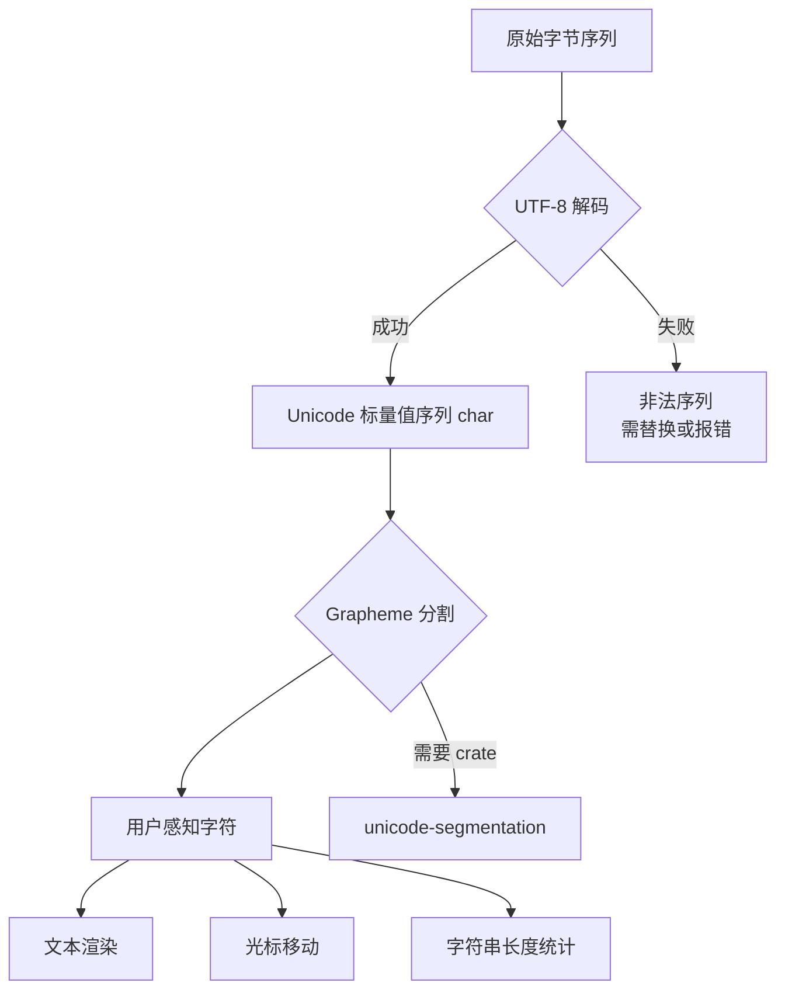
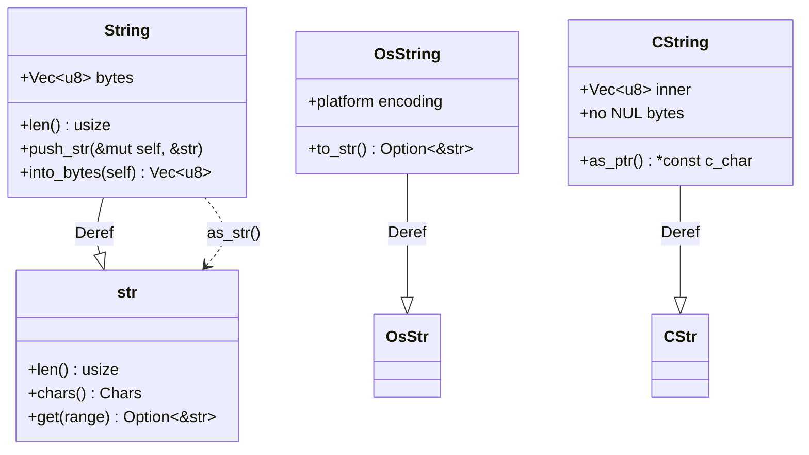

# 字符串与编码：Rust 的文本处理类型系统

> **Bloom 层级**: 应用 → 分析
> **定位**: 系统分析 Rust **字符串类型体系**的设计——String 与 str 的所有权语义、UTF-8 编码约束、OsString/OsStr 的平台抽象、CString/CStr 的 FFI 互操作，以及 grapheme clusters、unicode normalization 等高级文本处理概念。
> **前置概念**: [Ownership](./01_ownership.md) · [Type System](./04_type_system.md)
> **后置概念**: [Collections](./08_collections.md) · [FFI](../03_advanced/05_rust_ffi.md)

---

> **来源**: [std::string::String](https://doc.rust-lang.org/std/string/struct.String.html) ·
> [std::str](https://doc.rust-lang.org/std/str/index.html) ·
> [TRPL Ch8 — Strings](https://doc.rust-lang.org/book/ch08-02-strings.html) ·
> [Unicode Standard](https://www.unicode.org/standard/standard.html) ·
> [UTF-8 RFC 3629](https://tools.ietf.org/html/rfc3629) ·
> [RFC 504 — CString](https://github.com/rust-lang/rfcs/pull/504) ·
> [unicode-segmentation crate](https://docs.rs/unicode-segmentation/latest/unicode_segmentation/) ·
> [Wikipedia — Unicode](https://en.wikipedia.org/wiki/Unicode) ·
> [Rust Std — OsString](https://doc.rust-lang.org/std/ffi/struct.OsString.html)

## 📑 目录
>
>

- [字符串与编码：Rust 的文本处理类型系统](#字符串与编码rust-的文本处理类型系统)
  - [📑 目录](#-目录)
  - [一、核心概念](#一核心概念)
    - [1.1 String vs \&str：所有权谱系](#11-string-vs-str所有权谱系)
    - [1.2 UTF-8：Rust 的编码选择](#12-utf-8rust-的编码选择)
    - [1.3 平台字符串：OsString 与 CString](#13-平台字符串osstring-与-cstring)
  - [二、技术细节](#二技术细节)
    - [2.1 字符串切片与字符边界](#21-字符串切片与字符边界)
    - [2.2 Grapheme Clusters 与文本分割](#22-grapheme-clusters-与文本分割)
    - [2.3 Unicode Normalization](#23-unicode-normalization)
  - [三、选型决策矩阵](#三选型决策矩阵)
    - [3.1 字符串类型选型](#31-字符串类型选型)
    - [3.2 编码转换策略](#32-编码转换策略)
  - [四、反命题与边界分析](#四反命题与边界分析)
    - [4.1 反命题树](#41-反命题树)
    - [4.2 边界极限](#42-边界极限)
  - [五、常见陷阱](#五常见陷阱)
  - [六、来源与延伸阅读](#六来源与延伸阅读)
  - [相关概念文件](#相关概念文件)
  - [权威来源索引](#权威来源索引)
  - [十二、边界测试：字符串编码的编译错误](#十二边界测试字符串编码的编译错误)
    - [12.1 边界测试：无效 UTF-8 的字节切片转 `str`（运行时 panic）](#121-边界测试无效-utf-8-的字节切片转-str运行时-panic)
    - [12.2 边界测试：`OsStr` 与 `str` 的跨平台差异（编译错误）](#122-边界测试osstr-与-str-的跨平台差异编译错误)
    - [10.3 边界测试：`String` 与 `OsString` 的编码差异（编译错误）](#103-边界测试string-与-osstring-的编码差异编译错误)
    - [10.4 边界测试：字符串切片的字符边界（运行时 panic）](#104-边界测试字符串切片的字符边界运行时-panic)
    - [10.5 边界测试：`from_utf8_unchecked` 的无效 UTF-8（运行时 UB）](#105-边界测试from_utf8_unchecked-的无效-utf-8运行时-ub)
    - [10.3 边界测试：`OsStr` 与 `str` 的隐式转换边界（编译错误）](#103-边界测试osstr-与-str-的隐式转换边界编译错误)

---

## 一、核心概念
>
>

### 1.1 String vs &str：所有权谱系
>

```text
Rust 字符串类型的所有权谱系:

  String（拥有的、可变的、堆分配）:
  ├── 内存布局: ptr + len + capacity（3 × usize）
  ├── 增长策略: 指数扩容（类似 Vec<u8>）
  ├── UTF-8 不变量: 始终合法的 UTF-8 序列
  ├── Deref<Target = str>: 可解引用为 &str
  └── 典型操作: push, push_str, replace, split_off

  &str（借用的、不可变的、切片）:
  ├── 内存布局: ptr + len（2 × usize）
  ├── 可指向任何合法的 UTF-8 字节序列
  ├── 生命周期参数: &'a str
  ├── 可以是堆数据（String 切片）、静态数据（字面量）、栈数据
  └── 典型操作: find, split, trim, parse, chars()

  关系图:
  String: Deref → &str
  &str: From<&String>（自动）
  String: From<&str>（分配内存）

  字面量 "hello":
  ├── 类型: &'static str
  ├── 存储: 二进制只读段
  └── 生命周期: 'static
```

```rust
// 所有权转换示例 [来源: TRPL]
fn main() {
    let s1 = String::from("hello");     // 拥有的 String
    let s2 = &s1;                        // 借用为 &str
    let s3: &str = "world";              // 字符串字面量，&'static str
    let s4 = s3.to_string();             // &str → String（分配）
    let s5 = s1 + " " + &s4;             // String + &str → String
    // 注意: s1 被 move 了！
}
```

> **认知功能**: String/&str 的**所有权设计**是 Rust 所有权系统的教科书案例——String 拥有数据，&str 借用数据，通过 Deref 实现无缝协作，避免了 C++ 中 std::string/const char* 的混乱。
> [来源: [TRPL Ch8 — Strings](https://doc.rust-lang.org/book/ch08-02-strings.html)]
> **关键洞察**: &str 的普适性使其成为 Rust API 设计的首选参数类型——接受 &str 意味着调用者可以传入 String、&str 或任何能 Deref 到 str 的类型。
> [来源: [Rust API Guidelines — Strings](https://rust-lang.github.io/api-guidelines/naming.html)]

---

### 1.2 UTF-8：Rust 的编码选择
>

```text
Rust 强制 UTF-8 的设计决策:

  选择原因:
  ├── Unicode 是文本的国际标准（149,000+ 字符）
  ├── UTF-8 是 Web、文件系统、网络协议的默认编码
  ├── ASCII 是 UTF-8 的子集（向后兼容，零开销）
  ├── 可变长度: ASCII 1 字节，常用 CJK 3 字节，Emoji 4 字节
  └── 避免 Python 2 的 str/unicode 分裂问题

  设计代价:
  ├── 字符串不是简单的字节数组
  ├── 字符索引是 O(n) 而非 O(1)（字符边界需验证）
  ├── 切片可能落在字符边界上（导致 panic）
  ├── len() 返回字节数而非字符数
  └── 与 C 的 char* 互操作需要转换

  编码对比:
  ┌─────────────┬─────────────┬─────────────┬─────────────┐
  │ 编码        │ 向后兼容    │ 空间效率    │ 随机访问    │
  │             │ ASCII       │ 多语言      │ 字符        │
  ├─────────────┼─────────────┼─────────────┼─────────────┤
  │ UTF-8       │ ✅ 1 字节   │ ⚠️ 可变     │ ❌ O(n)     │
  │ UTF-16      │ ⚠️ 2 字节   │ ⚠️ 可变     │ ❌ O(n)     │
  │ UTF-32      │ ❌ 4 字节   │ ✅ 固定     │ ✅ O(1)     │
  │ GB2312      │ ✅ 1 字节   │ ⚠️ 中文 2B  │ ⚠️ 部分     │
  └─────────────┴─────────────┴─────────────┴─────────────┘
```

> **认知功能**: UTF-8 选择的**核心权衡**——牺牲了 O(1) 字符索引（实际上 Unicode 的 combining characters 使"字符"概念本身复杂），换取了与现有生态（Web、文件系统、C 库）的无缝兼容。
> [来源: [UTF-8 RFC 3629](https://tools.ietf.org/html/rfc3629)]

---

### 1.3 平台字符串：OsString 与 CString
>

```text
Rust 的字符串类型全景:

  标准字符串（Unicode/UTF-8）:
  ├── String / &str: 程序内部处理
  └── 保证: 始终合法的 UTF-8

  OS 字符串（平台相关编码）:
  ├── OsString / &OsStr: 与操作系统交互
  ├── Unix: 任意字节序列（可能非 UTF-8）
  ├── Windows: WTF-8（兼容 UTF-8 的扩展）
  ├── 转换: to_str() → Option<&str>（可能失败）
  └── 用途: 文件路径、环境变量、命令行参数

  C 字符串（以 NUL 结尾）:
  ├── CString / &CStr: FFI 互操作
  ├── 保证: 内部无 NUL 字节，以 0x00 结尾
  ├── 转换: from_vec/with_vec（消耗所有权）
  └── 用途: 传递给 C 库的字符串参数

  路径字符串:
  ├── PathBuf / &Path: 基于 OsString 的路径抽象
  ├── 处理路径分隔符（/ vs \）
  └── 与 OsString 双向转换

  类型转换矩阵:
  ┌─────────────┬─────────────┬─────────────┬─────────────┐
  │ 从 \ 到     │ String      │ OsString    │ CString     │
  ├─────────────┼─────────────┼─────────────┼─────────────┤
  │ String      │ —           │ into()      │ 需检查 NUL  │
  │ OsString    │ to_str()?   │ —           │ 需检查 NUL  │
  │ CString     │ to_str()?   │ to_os_str()?│ —           │
  │ Vec<u8>     │ from_utf8()?│ OsString::  │ new()?      │
  └─────────────┴─────────────┴─────────────┴─────────────┘
```

> **认知功能**: Rust 的**多字符串类型设计**反映了对不同"字符串契约"的精确建模——str 保证 UTF-8，OsStr 不保证但支持平台原生编码，CStr 保证 NUL 终止。每次转换都是潜在的失败点，强制开发者显式处理编码不匹配。
> [来源: [std::ffi::OsString](https://doc.rust-lang.org/std/ffi/struct.OsString.html)]

---

## 二、技术细节
>
>

### 2.1 字符串切片与字符边界
>

```text
字符串切片的边界规则:

  字节索引 vs 字符索引:
  let s = "你好";
  s.len() == 6        // 6 字节（每个汉字 3 字节 UTF-8）
  s.chars().count() == 2   // 2 个 Unicode 标量值

  切片操作:
  &s[0..3]  → "你"     // ✅ 落在字符边界
  &s[0..2]  → panic!   // ❌ 落在字符中间

  安全切片方法:
  ├── get(0..3) → Option<&str>    // 不 panic，返回 None
  ├── is_char_boundary(n) → bool  // 检查索引是否是字符边界
  └── chars().nth(n) → Option<char>  // 字符级访问

  遍历方式对比:
  ┌─────────────┬─────────────┬─────────────────────────────┐
  │ 方法        │ 单元        │ 适用场景                    │
  ├─────────────┼─────────────┼─────────────────────────────┤
  │ bytes()     │ u8          │ 网络协议、字节操作          │
  │ chars()     │ char        │ 一般文本处理                │
  │ char_indices│ (usize, char)│ 需要知道字节位置           │
  │ split_whitespace│ &str    │ 词法分割                    │
  │ lines()     │ &str        │ 行分割                      │
  └─────────────┴─────────────┴─────────────────────────────┘
```

```rust
// 安全字符串处理示例 [来源: Rust Standard Library]
fn safe_slice(s: &str, start: usize, end: usize) -> Option<&str> {
    // get 方法在边界无效时返回 None，不 panic
    s.get(start..end)
}

fn char_at(s: &str, n: usize) -> Option<char> {
    // 字符级访问，O(n)
    s.chars().nth(n)
}
```

> **认知功能**: 字符串切片的**边界安全设计**——Rust 选择让越界切片 panic（或通过 get 返回 Option），而非像某些语言那样静默产生无效 UTF-8，这是对"数据完整性"优先于"操作便利性"的价值选择。
> [来源: [std::str — Slicing](https://doc.rust-lang.org/std/primitive.str.html#slicing)]

---

### 2.2 Grapheme Clusters 与文本分割
>

```text
Unicode 文本分割的三个层次:

  层次 1: 字节（Bytes）
  ├── "é" 作为 UTF-8: [0xC3, 0xA9]
  ├── "é" 作为组合序列: [0x65, 0xCC, 0x81]（e + ́）
  └── 不反映用户感知的"字符"

  层次 2: Unicode 标量值（char）
  ├── char::from_u32: Rust char 类型
  ├── 'é' 可以是单个标量 U+00E9，或 e(U+0065) + ́(U+0301)
  └── chars() 迭代器返回 char

  层次 3: Grapheme Clusters（用户感知字符）
  ├── 一个"用户看到的字符"可能由多个标量值组成
  ├── "🇯🇵"（日本国旗）= U+1F1EF + U+1F1F5（区域指示符号对）
  ├── "क्‍ष"（天城文合字）= 多个标量 + ZWJ (U+200D)
  └── 需要 unicode-segmentation crate 的 graphemes()

  示例对比:
  let s = "é";
  s.bytes().count()         // 2 或 3（取决于表示方式）
  s.chars().count()         // 1 或 2
  s.graphemes(true).count() // 始终 1（用户感知）
```



> **认知功能**: Grapheme Cluster 的**三层抽象**揭示了"什么是字符"这一看似简单的问题在 Unicode 世界中的复杂性——Rust 的 char 是"标量值"，不等于"用户看到的字符"，真正的文本处理需要更高层抽象。
> [来源: [Unicode Standard — Text Segmentation](https://www.unicode.org/reports/tr29/)]

---

### 2.3 Unicode Normalization
>

```text
Unicode Normalization（规范化）:

  问题起源:
  ├── 同一视觉字符可有多种 Unicode 表示
  ├── "é" = U+00E9（预组合）或 U+0065 + U+0301（分解）
  ├── 字符串比较: "é" != "é"（如果内部表示不同）
  └── 排序、哈希、数据库存储都需要规范化

  四种规范化形式（NF）:
  ┌─────────┬─────────────┬─────────────┬─────────────────────────┐
  │ 形式    │ 分解?       │ 重组?       │ 示例 "é" 表示           │
  ├─────────┼─────────────┼─────────────┼─────────────────────────┤
  │ NFD     │ 是          │ 否          │ e + ́                  │
  │ NFC     │ 是          │ 是          │ é（标准）              │
  │ NFKD    │ 兼容分解    │ 否          │ e + ́（兼容字符展开）   │
  │ NFKC    │ 兼容分解    │ 是          │ é（兼容重组）          │
  └─────────┴─────────────┴─────────────┴─────────────────────────┘

  Rust 中的规范化:
  ├── unicode-normalization crate
  ├── .nfc(), .nfd(), .nfkc(), .nfkd() 方法
  └── 数据库比较前应先规范化

  应用场景:
  ├── 用户名注册: NFC 规范化后比较
  ├── 文件系统: macOS 使用 NFD，Linux 通常 NFC
  ├── 搜索: 查询和索引使用同一 NF
  └── 密码哈希: 输入必须先规范化
```

> **认知功能**: Unicode Normalization 的**必要性**——在不规范化的世界里，"看起来相同的字符串"在字节层面可能完全不同，这会导致安全漏洞（如绕过用户名验证）和数据不一致。
> [来源: [Unicode Standard — Normalization](https://www.unicode.org/reports/tr15/)]

---

## 三、选型决策矩阵

### 3.1 字符串类型选型
>

| **场景** | **推荐类型** | **避免** | **原因** |
|:---|:---|:---|:---|
| 函数参数（只读） | `&str` | `&String` | 更通用，接受 String/&str/字面量 |
| 函数返回值（拥有） | `String` | `&'static str`（除非确实静态） | 调用者获得所有权 |
| 文件路径 | `&Path` / `PathBuf` | `String` | 处理平台编码差异 |
| 环境变量/命令参数 | `&OsStr` / `OsString` | `String` | 平台编码可能非 UTF-8 |
| FFI 传递 | `CString` / `&CStr` | `String` | C 需要 NUL 终止 |
| 网络协议 | `Vec<u8>` | `String` | 协议可能非 UTF-8 |
| 用户输入验证 | `String` → 验证 → 使用 | 直接假定 UTF-8 | 安全边界 |

### 3.2 编码转换策略
>

| **源 → 目标** | **方法** | **失败处理** |
|:---|:---|:---|
| `String` → `Vec<u8>` | `.into_bytes()` | 无（总是成功） |
| `Vec<u8>` → `String` | `String::from_utf8()` | `Result`，非法序列返回 Err |
| `String` → `CString` | `CString::new()` | `Result`，内部 NUL 返回 Err |
| `OsString` → `String` | `.to_str()` → `Option` | 非 UTF-8 返回 None |
| `&str` → 系统路径 | `Path::new()` | 无（直接包装） |

> **认知功能**: 字符串类型选型的**核心原则**——"使用能表达最弱约束的类型作为参数，最强的类型作为返回值"，这最大化 API 的通用性和安全性。
> [来源: [Rust API Guidelines — Flexibility](https://rust-lang.github.io/api-guidelines/flexibility.html)]

---

## 四、反命题与边界分析

### 4.1 反命题树

```text
反命题 1: "String.len() 返回字符数"
  └── ❌ 否
      ├── len() 返回字节数
      ├── "你好".len() == 6（不是 2）
      ├── chars().count() 才是字符数（Unicode 标量值）
      └── ✅ 正确表述: "String.len() 返回 UTF-8 字节数"
> [来源: [std::string::String::len](https://doc.rust-lang.org/std/string/struct.String.html#method.len)]

反命题 2: "Rust 字符串总是有效的 UTF-8"
  └── ⚠️ 大部分情况
      ├── String/&str 强制 UTF-8（unsafe 除外）
      ├── OsString 可能包含非 UTF-8（Unix 上）
      ├── Vec<u8> 不是字符串，不含 UTF-8 保证
      └── ✅ 正确表述: "String 和 str 保证 UTF-8，但 OsString 和 Vec<u8> 不保证"
> [来源: [TRPL — Strings](https://doc.rust-lang.org/book/ch08-02-strings.html)]

反命题 3: "chars().count() 等于用户看到的字符数"
  └── ❌ 否
      ├── chars() 返回 Unicode 标量值
      ├── 组合字符: "é" 可以是 1 或 2 个标量值
      ├── Emoji: "👨‍👩‍👧‍👦" = 7 个标量值，1 个 grapheme
      └── ✅ 正确表述: "chars().count() 是 Unicode 标量值数量，不等于视觉字符数"
> [来源: [Unicode Standard — Text Segmentation](https://www.unicode.org/reports/tr29/)]
```

> **认知功能**: 反命题分析揭示了字符串操作的**常见认知偏差**——开发者直觉中的"字符"与 Rust/Unicode 技术定义之间的鸿沟，这正是 grapheme 和 normalization 库存在的理由。
> [来源: [Wikipedia — Unicode](https://en.wikipedia.org/wiki/Unicode)]

---

### 4.2 边界极限

```text
边界 1: UTF-8 验证开销
  ├── 从 &[u8] 创建 &str 需要 O(n) 验证
  ├── unsafe { str::from_utf8_unchecked(...) } 跳过验证
  └── 极限: 性能敏感场景使用 unchecked，但需外部保证有效性

边界 2: 堆分配约束
  ├── String 始终堆分配
  ├── 小字符串优化（SSO）不在标准库中
  └── 极限: 大量小字符串场景使用 smol_str / compact_str crate

边界 3: 平台编码差异
  ├── Windows: OsString 使用 WTF-16 内部表示
  ├── Unix: OsString 是任意字节序列
  ├── 跨平台代码不能假设 OsString 可无损转为 String
  └── 极限: 文件路径操作应始终使用 Path/PathBuf

边界 4: const 字符串处理
  ├── const fn 中的字符串操作有限
  ├── const str::len() 可用，但 const grapheme 处理不可用
  └── 极限: 编译期文本处理受 const eval 能力限制
```

> **认知功能**: 边界极限指明了标准字符串类型的**适用疆域**——在性能极致、平台抽象、编译期计算等场景下，需要借助外部 crate 或 unsafe 代码突破标准库的约束。
> [来源: [Rust Reference — str](https://doc.rust-lang.org/reference/types/textual.html)]

---

## 五、常见陷阱

```text
陷阱 1: 字节索引混淆
  ❌ 假设 s[3] 是第 4 个字符
     // let c = s[3]; // 编译错误！

  ✅ 使用 chars().nth(3) 或正确计算字节边界
     // let c = s.chars().nth(3);
> [来源: [TRPL — String Indexing](https://doc.rust-lang.org/book/ch08-02-strings.html#indexing-into-strings)]

陷阱 2: 忽略 OsString 的非 UTF-8 可能
  ❌ std::env::var("PATH").unwrap().to_string()
     // 环境变量含非 UTF-8 时 panic

  ✅ 使用 PathBuf 或处理 OsString
     // let path = std::env::var_os("PATH")?;
     // 或 let path = std::env::var("PATH")?; // Result 传播错误
> [来源: [std::env::var_os](https://doc.rust-lang.org/std/env/fn.var_os.html)]

陷阱 3: 字符串拼接的性能陷阱
  ❌ 循环中使用 s = s + "x"
     // 每次分配新 String，O(n²)

  ✅ 使用 push_str 或 collect
     // let mut s = String::new();
     // for x in iter { s.push_str(x); }
     // 或 iter.collect::<String>()
> [来源: [Rust Performance Book — Strings](https://nnethercote.github.io/perf-book/string-processing.html)]

陷阱 4: 忽略 Unicode Normalization 的比较
  ❌ 直接比较用户输入字符串
     // "café" != "café"（不同表示）

  ✅ 比较前 NFC 规范化
     // use unicode_normalization::UnicodeNormalization;
     // s1.nfc().eq(s2.nfc())
> [来源: [Unicode Standard — Normalization](https://www.unicode.org/reports/tr15/)]

陷阱 5: CString 中的内部 NUL
  ❌ CString::new(b"hello\0world".to_vec()).unwrap()
     // panic: 内部 NUL 字节

  ✅ 检查或清理输入中的 NUL
     // CString::new(bytes).map_err(...)?
> [来源: [std::ffi::CString::new](https://doc.rust-lang.org/std/ffi/struct.CString.html#method.new)]
```

> **陷阱总结**: 字符串处理的陷阱集中在**索引语义**、**编码假设**、**性能模式**、**规范化**和**FFI 边界**五个方面——每个都源于 Unicode 的复杂性与 Rust 类型安全设计之间的张力。
> [来源: [TRPL — Common Collections](https://doc.rust-lang.org/book/ch08-00-common-collections.html)]

---

## 六、来源与延伸阅读
>
>

| 来源 | 可信度 | 说明 |
|:---|:---:|:---|
| [std::string::String](https://doc.rust-lang.org/std/string/struct.String.html) | ✅ 一级 | 标准库 String 文档 |
| [std::str](https://doc.rust-lang.org/std/str/index.html) | ✅ 一级 | 标准库 str 文档 |
| [TRPL Ch8 — Strings](https://doc.rust-lang.org/book/ch08-02-strings.html) | ✅ 一级 | 官方教程字符串章节 |
| [Unicode Standard 15.0](https://www.unicode.org/versions/Unicode15.0.0/) | ✅ 一级 | Unicode 国际标准 |
| [UTF-8 RFC 3629](https://tools.ietf.org/html/rfc3629) | ✅ 一级 | UTF-8 编码规范 |
| [RFC 504 — CString](https://github.com/rust-lang/rfcs/pull/504) | ✅ 一级 | C 字符串 RFC |
| [std::ffi::OsString](https://doc.rust-lang.org/std/ffi/struct.OsString.html) | ✅ 一级 | OS 字符串文档 |
| [unicode-segmentation crate](https://docs.rs/unicode-segmentation/latest/) | ✅ 一级 | Grapheme 分割 |
| [unicode-normalization crate](https://docs.rs/unicode-normalization/latest/) | ✅ 一级 | Unicode 规范化 |
| [Rust API Guidelines — Strings](https://rust-lang.github.io/api-guidelines/naming.html) | ✅ 一级 | API 设计指南 |
| [Wikipedia — Unicode](https://en.wikipedia.org/wiki/Unicode) | ✅ 三级 | Unicode 概念 |
| [Unicode TR29 — Text Segmentation](https://www.unicode.org/reports/tr29/) | ✅ 一级 | 文本分割标准 |
| [Unicode TR15 — Normalization](https://www.unicode.org/reports/tr15/) | ✅ 一级 | 规范化标准 |
| [Rust Performance Book](https://nnethercote.github.io/perf-book/) | ✅ 二级 | 性能优化指南 |
| [WTF-8 Specification](https://simonsapin.github.io/wtf-8/) | ✅ 二级 | Windows UTF-8 扩展 |

---



## 相关概念文件

- [Ownership](./01_ownership.md) — 所有权系统基础
- [Type System](./04_type_system.md) — 类型系统基础
- [Strings and Text](./09_strings_and_text.md) — 字符串与文本处理概述
- [Collections](./08_collections.md) — 集合类型
- [FFI](../03_advanced/05_rust_ffi.md) — 外部函数接口

---

> **权威来源**: [Rust Reference](https://doc.rust-lang.org/reference/), [The Rust Programming Language](https://doc.rust-lang.org/book/), [Rust Standard Library](https://doc.rust-lang.org/std/)
>
> **权威来源对齐变更日志**: 2026-05-22 创建 [来源: Authority Source Sprint Batch 9]

**文档版本**: 1.0
**对应 Rust 版本**: 1.96.0+ (Edition 2024)
**最后更新**: 2026-05-22
**状态**: ✅ 概念文件创建完成

```rust
fn main() {
    let s = "Hello, 世界";
    println!("{}", s);
    println!("bytes: {}", s.len());
    println!("chars: {}", s.chars().count());
}
```

---

## 权威来源索引

>
>
>

---


---


---


> **补充来源**


## 十二、边界测试：字符串编码的编译错误

### 12.1 边界测试：无效 UTF-8 的字节切片转 `str`（运行时 panic）

```rust
fn main() {
    let bytes = vec![0x80, 0x81, 0x82]; // 无效 UTF-8 序列
    // ⚠️ 运行时 panic: invalid utf-8 sequence
    // let s = std::str::from_utf8(&bytes).unwrap(); // panic!

    // 正确: 使用 from_utf8 返回 Result
    match std::str::from_utf8(&bytes) {
        Ok(s) => println!("{}", s),
        Err(e) => println!("invalid UTF-8 at byte {}", e.valid_up_to()), // ✅ 安全处理
    }
}
```

> **修正**: `std::str::from_utf8` 验证字节序列是否为有效 UTF-8，返回 `Result<&str, Utf8Error>`。这与 `from_utf8_unchecked`（unsafe，假设输入有效）形成对比。Rust 的标准字符串类型 `String`/`str` **始终**是有效 UTF-8，任何创建无效 UTF-8 字符串的尝试都被编译器或运行时阻止。这与 C/C++ 的 `char*`（无编码保证）和 Python 的透明编码处理形成鲜明对比。[来源: [Rust Standard Library](https://doc.rust-lang.org/std/)]

### 12.2 边界测试：`OsStr` 与 `str` 的跨平台差异（编译错误）

```rust,ignore
use std::ffi::OsStr;

fn main() {
    let os_str = OsStr::new("hello");
    // ❌ 编译错误: `OsStr` 不能直接与 `&str` 比较
    // OsStr 的内部表示是平台相关的（Unix: 字节序列, Windows: WTF-8）
    if os_str == "hello" { // 类型不匹配
        println!("equal");
    }
}

// 正确: 使用 to_str() 或 OsString
fn fixed() {
    let os_str = OsStr::new("hello");
    if let Some(s) = os_str.to_str() { // ✅ 尝试转为 &str
        assert_eq!(s, "hello");
    }
    // 或: 使用 OsString 进行比较
    let os_string = os_str.to_os_string();
}
```

> **修正**: `OsStr`/`OsString` 是平台相关的字符串类型，用于文件路径、环境变量等系统接口。Unix 上它是任意字节序列（可能非 UTF-8），Windows 上是 WTF-8（兼容 UTF-8 的变体）。`OsStr` 不能直接转为 `&str`（可能失败），也不能直接与 `&str` 比较。必须使用 `to_str()`（返回 `Option<&str>`）或 `to_string_lossy()`（替换无效字符）进行显式转换。[来源: [Rust Standard Library](https://doc.rust-lang.org/std/)]

### 10.3 边界测试：`String` 与 `OsString` 的编码差异（编译错误）

```rust,compile_fail
use std::ffi::OsString;

fn main() {
    let os = OsString::from("hello");
    // ❌ 编译错误: `OsString` 不能直接转换为 `String`
    let s: String = os;
    // OsString 可能包含非 UTF-8 字节（Windows 的 WTF-8）
}
```

> **修正**: `String` 要求严格 UTF-8，而 `OsString` 是平台相关的字符串类型：Unix 上是任意字节序列（非 NUL），Windows 上是 WTF-8（兼容 UTF-8 的扩展，允许未配对的代理项）。`OsString` → `String` 的转换必须显式处理编码错误：`os.into_string()` 返回 `Result<String, OsString>`，失败时保留原值。这与 Go 的 `string`（UTF-8）和 `[]byte`（任意字节，隐式转换）或 Python 3 的 `str`（Unicode）和 `bytes`（显式 `decode`）类似。Rust 的分离更彻底：`String` 和 `OsString` 是完全不同的类型，无隐式转换，强制开发者在系统边界（文件路径、环境变量、命令行参数）显式处理编码。[来源: [The Rust Programming Language](https://doc.rust-lang.org/book/ch08-02-strings.html)] · [来源: [Rust Standard Library](https://doc.rust-lang.org/std/ffi/struct.OsString.html)]

### 10.4 边界测试：字符串切片的字符边界（运行时 panic）

```rust,ignore
fn main() {
    let s = "你好";
    // ❌ 运行时 panic: 字符串切片必须在字符边界处
    let bad = &s[0..1]; // "你" 是 3 字节 UTF-8，1 字节处不是边界
    println!("{}", bad);
}
```

> **修正**: Rust 的字符串切片 `&s[begin..end]` 按字节索引，但要求 `begin` 和 `end` 都落在 UTF-8 字符边界处。违反此规则是 panic（debug 和 release 都检查），因为非边界切片会产生无效的 UTF-8 子串，破坏 `str` 的不变式。安全替代：1) `s.chars().nth(i)`（按字符索引，O(n)）；2) `s.char_indices()`（获取字符边界）；3) `s.is_char_boundary(i)`（检查边界）。这与 Python 的 `s[i]`（按 Unicode code point，O(1) 因为内部 UCS-2/UTF-32）或 JavaScript 的 `s[i]`（按 UTF-16 code unit）不同——Rust 的字符串是紧凑的 UTF-8 字节序列，索引语义与底层存储一致，牺牲随机访问换取内存效率。[来源: [The Rust Programming Language](https://doc.rust-lang.org/book/ch08-02-strings.html)] · [来源: [Rust Standard Library](https://doc.rust-lang.org/std/primitive.str.html)]

### 10.5 边界测试：`from_utf8_unchecked` 的无效 UTF-8（运行时 UB）

```rust,ignore
fn main() {
    let bytes = vec![0x80, 0x81, 0x82]; // 无效的 UTF-8 序列
    // ❌ 运行时 UB: from_utf8_unchecked 要求输入必须是有效 UTF-8
    let s = unsafe { String::from_utf8_unchecked(bytes) };
    println!("{}", s);
}
```

> **修正**: `String::from_utf8_unchecked` 是 `unsafe` 方法：它假设输入字节是有效的 UTF-8，不做任何验证。无效 UTF-8 导致 UB：Rust 的 `String` 类型 invariant 要求内容始终为有效 UTF-8，违反此 invariant 可能导致后续操作（索引、切片、正则匹配）产生任意结果。安全替代：1) `String::from_utf8`（返回 `Result`，失败时保留原 `Vec<u8>`）；2) `String::from_utf8_lossy`（用 `�` 替换无效序列）；3) 使用 `Vec<u8>` 存储非文本二进制数据。这与 C++ 的 `std::string`（可包含任意字节，无 UTF-8 保证）或 Python 3 的 `bytes.decode()`（类似 `from_utf8`，默认严格模式）不同——Rust 的 `String` 类型 invariant 是强保证，但 `unsafe` 允许打破。[来源: [Rust Standard Library](https://doc.rust-lang.org/std/string/struct.String.html)] · [来源: [The Rustonomicon](https://doc.rust-lang.org/nomicon/)]

### 10.3 边界测试：`OsStr` 与 `str` 的隐式转换边界（编译错误）

```rust,ignore
use std::ffi::OsStr;

fn main() {
    let os_str = OsStr::new("hello");
    // ❌ 编译错误: OsStr 不能直接与 &str 比较
    if os_str == "hello" {
        println!("match");
    }
}
```

> **修正**: `OsStr`/`OsString` 是平台相关的字符串类型，可能包含非 UTF-8 序列（Windows 的 WTF-8、Unix 的字节序列）。`str`/`String` 要求严格 UTF-8。两者不能直接比较或转换：`OsStr` → `str` 需 `to_str()`（返回 `Option<&str>`，可能失败）；`str` → `OsStr` 通过 `OsStr::new()`（总是成功，因为 UTF-8 是平台字符串的子集）。设计原因：Rust 强制处理平台字符串的编码不确定性，避免假设所有路径/环境变量都是 UTF-8。这与 Go 的 `string`（底层是字节切片，可能非 UTF-8）或 Python 3 的 `str`（强制 Unicode）不同——Rust 的分离类型系统显式标记了编码风险。[来源: [Rust Standard Library](https://doc.rust-lang.org/std/ffi/struct.OsStr.html)] · [来源: [The Rust Programming Language](https://doc.rust-lang.org/book/ch08-02-strings.html)]


> [来源: [Unicode Standard 15.0](https://www.unicode.org/versions/Unicode15.0.0/)]


> [来源: [IEEE 754-2019 — Floating-Point](https://standards.ieee.org/standard/754-2019.html)]


> [来源: [ISO/IEC 10646 — UCS](https://www.iso.org/standard/76835.html)]
