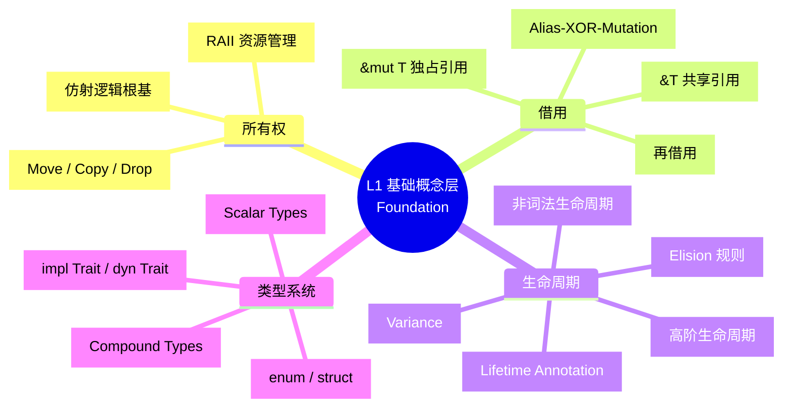
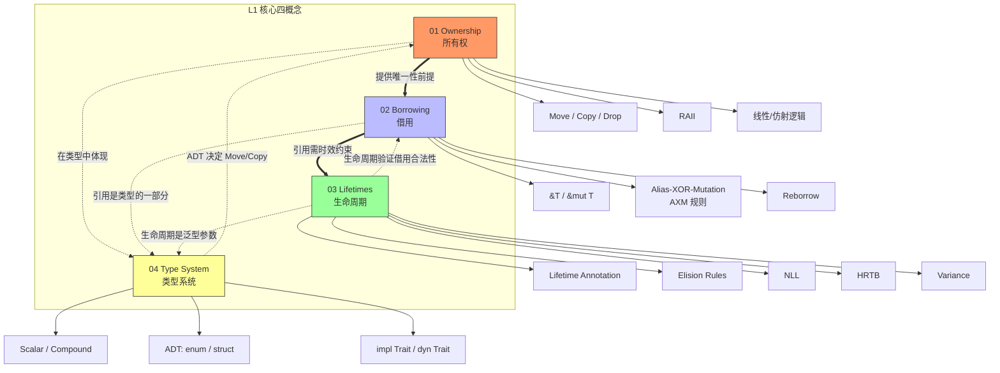

# L1 基础概念层（Foundation）
>
> **EN**: Readme
> **Summary**: Foundation concepts: ownership, borrowing, lifetimes, and the type system.
> **受众**: [初学者]
> **定位**：Rust 最核心的基础性概念，是所有进阶内容的**必要前提**。本层内容对齐 TRPL 第 3-10 章、Wikipedia 核心词条、Stanford/CMU 基础课程。
> **Bloom 层级**: 记忆 → 理解
> **对应 L4 形式化**: 线性逻辑 ⊗ · 分离逻辑 · 区域类型系统（Type System） · 代数类型论
> **来源: [TRPL Ch3](https://doc.rust-lang.org/book/ch03-00-common-programming-concepts.html)** ·
> **来源: [Wikipedia - Ownership (programming)](https://en.wikipedia.org/wiki/Ownership_(programming))** ·
> **来源: [Wikipedia - Type System](https://en.wikipedia.org/wiki/Type_system)** ·
> **[来源: Stanford CS242 - Programming Languages]**
> **本节关键术语**: 基础概念 (Foundation) · 所有权 (Ownership) · 借用 (Borrowing) · 生命周期 (Lifetime) · 类型系统 (Type System) — [完整对照表](../00_meta/terminology_glossary.md)
>
> **来源**: [TRPL](https://doc.rust-lang.org/book/title-page.html) · [Rust Reference](https://doc.rust-lang.org/reference/)
> **前置概念**: N/A
> **后置概念**: N/A
---

## 📑 目录

- [L1 基础概念层（Foundation）](#l1-基础概念层foundation)
  - [📑 目录](#-目录)
    - [〇、L1 认知入口](#〇l1-认知入口)
  - [一、本层概念关系图（完整版）](#一本层概念关系图完整版)
    - [1.1 概念间语义链接](#11-概念间语义链接)
    - [1.2 学习路径的严格依赖](#12-学习路径的严格依赖)
  - [二、文件索引与关系](#二文件索引与关系)
    - [补充文件索引](#补充文件索引)
  - [三、课程对齐路径](#三课程对齐路径)
  - [四、形式化层级定位（理论-模型-实践）](#四形式化层级定位理论-模型-实践)
  - [五、本层定理一致性概览](#五本层定理一致性概览)
  - [六、认知路径（从直觉到形式化）](#六认知路径从直觉到形式化)
  - [七、待创建内容](#七待创建内容)
  - [八、跨层出口](#八跨层出口)
  - [嵌入式测验（Embedded Quiz）](#嵌入式测验embedded-quiz)
    - [测验 1：《L1 基础概念层（Foundation）》在本知识体系中扮演什么角色？（理解层）](#测验-1l1-基础概念层foundation在本知识体系中扮演什么角色理解层)
    - [测验 2：使用本索引文件时，最有效的学习策略是什么？（理解层）](#测验-2使用本索引文件时最有效的学习策略是什么理解层)
    - [测验 3：索引文档能否替代具体概念文件的学习？（理解层）](#测验-3索引文档能否替代具体概念文件的学习理解层)

### 〇、L1 认知入口



> **认知功能**: 本 mindmap 是 L1 层的**放射式认知入口**。放射式结构（中心向外扩散）适合展示「一个核心主题的多维分解」。四个分支对应 Rust 内存安全（Memory Safety）的「四根支柱」，每根支柱下的子节点是读者需要掌握的「最小核心概念集」。建议用法：新读者将此图作为「学习进度追踪器」——掌握一个子节点后标记完成，全部标记后再进入 L2。四根支柱的依赖关系是：所有权（Ownership） → 借用（Borrowing） → 生命周期（Lifetimes）（递进），类型系统（Type System）贯穿始终（横向支撑）。 [来源: 💡 原创分析]

> **认知路径**:

## 一、本层概念关系图（完整版）



> **认知功能**: 此图是 L1 层的**概念关系拓扑图**，展示四概念之间的「递进依赖」与「循环强化」双重结构。==> 实线箭头表示严格的学习依赖顺序（所有权（Ownership） → 借用（Borrowing） → 生命周期（Lifetimes）），-.-> 虚线箭头表示概念间的反馈循环（类型系统（Type System）影响所有权语义，生命周期验证借用）。四种颜色编码帮助快速区分概念域。关键认知：L1 不是四个孤立文件的集合，而是一个**有机系统**——每个概念既依赖前面的概念，又反过来强化整个系统的保证。建议读者在学习过程中定期回到此图，确认自己理解了「当前概念与相邻概念的交互关系」。 [来源: 💡 原创分析]

### 1.1 概念间语义链接

| 关系 | 从 | 到 | 语义类型 | 说明 |
|:---|:---|:---|:---|:---|
| 1 | **Ownership** | **Borrowing** | `==>` 前提/启用 | 所有权唯一性是借用规则成立的根本前提。若无唯一 owner，则无法安全地出借引用（Reference）。 |
| 2 | **Borrowing** | **Lifetimes** | `==>` 导致/约束 | 引用（Reference）（&T）必须在其指向数据的生命周期内有效，借用规则直接产生生命周期约束需求。 |
| 3 | **Ownership** | **Type System** | `-.->` 体现/映射 | Move/Copy/Drop 在类型层面通过 trait 和编译器内建规则实现。 |
| 4 | **Type System** | **Ownership** | `-.->` 反馈/决定 | 类型（如 `Copy` / `!Copy`）决定值在传递时是 move 还是 copy。 |
| 5 | **Lifetimes** | **Borrowing** | `-.->` 验证/约束 | 生命周期约束的求解结果直接决定借用检查是否通过。 |

### 1.2 学习路径的严格依赖

```text
Ownership（理解"唯一拥有"）
    │ 必须先掌握：无（L1 入口）
    │ 后置：Borrowing
    │ 反事实：若无唯一 owner，则借用无法安全实现
    ↓
Borrowing（理解"临时租借"）
    │ 必须先掌握：Ownership
    │ 后置：Lifetimes
    │ 反事实：若允许 &mut T 与 &T 共存，则产生数据竞争
    ↓
Lifetimes（理解"时效约束"）
    │ 必须先掌握：Ownership + Borrowing
    │ 后置：Generics（L2）, Concurrency（L3）
    │ 反事实：若无生命周期，引用可能成为悬垂指针
    ↓
Type System（理解"类型即证明"）
    │ 必须先掌握：Ownership（影响 ADT 的语义）
    │ 后置：Trait（L2）, 所有类型相关概念
    │ 反事实：弱类型系统无法表达所有权语义
```

---

## 二、文件索引与关系

| 文件 | 概念 | 核心内容 | 状态 | 前置 | 后置 |
|:---|:---|:---|:---|:---|:---|
| [01_ownership.md](./01_ownership.md) | 所有权（Ownership） | 唯一所有权、Move/Copy/Drop、线性/仿射逻辑、RAII | ✅ v1.0 | 无（L1 入口） | Borrowing, Type System |
| [02_borrowing.md](./02_borrowing.md) | 借用（Borrowing） | `&T`/`&mut T`、AXM 规则、Reborrow、NLL | ✅ v1.0 | Ownership | Lifetimes, Concurrency |
| [03_lifetimes.md](./03_lifetimes.md) | 生命周期（Lifetimes） | 标注、Elision、NLL、`'static`、HRTB、Variance | ✅ v1.0 | Borrowing | Generics, Async |
| [04_type_system.md](./04_type_system.md) | 类型系统基础 | 标量/复合/ADT、impl/dyn Trait、类型推断（Type Inference） | ✅ v1.0 | Ownership | Trait, Generics, Macros |
| 05_reference_semantics.md | 引用（Reference）语义 | Deref/DerefMut、自动解引用、智能指针（Smart Pointer）接口 | ✅ v1.0 | Borrowing, Type System | Pin, FFI |
| [06_zero_cost_abstractions.md](./06_zero_cost_abstractions.md) | 零成本抽象（Zero-Cost Abstraction） | 单态化（Monomorphization）、内联、迭代器（Iterator）零成本、编译期优化 | ✅ v1.0 | Type System, Generics | Ecosystem Patterns |
| [07_control_flow.md](./07_control_flow.md) | 控制流 | match/if let/loop、表达式导向、穷尽性检查 | ✅ v1.0 | Ownership, Type System | Iterator, Async |
| [08_collections.md](./08_collections.md) | 集合类型 | Vec/HashMap/BTreeMap/HashSet、Entry API、容量管理 | ✅ v1.0 | Ownership, Generics | Smart Pointers, Ecosystem |
| [09_strings_and_text.md](./09_strings_and_text.md) | 字符串与文本 | String/str、UTF-8、格式化、OS 字符串、C 字符串 | ✅ v1.0 | Ownership, Type System | Collections, FFI |
| [10_numerics.md](./10_numerics.md) | 数值类型与运算 | 整数、浮点、溢出、饱和运算、类型转换 | ✅ v1.0 | Type System | Zero Cost, Collections |
| [19_value_vs_reference_semantics.md](./19_value_vs_reference_semantics.md) | 值语义 vs 引用语义 | C++/Java/Python/Rust 对比、Rust 所有权作为值语义极致 | ✅ v1.0 | Ownership, Variable Model | Rust vs C++ |
| [20_variable_model.md](./20_variable_model.md) | 变量模型（PL 通用） | 环境/存储、绑定语义、值语义 vs 引用（Reference）语义、lvalue/rvalue | ✅ v1.0 | Type System, Ownership | Evaluation Strategies |
| [21_effects_and_purity.md](./21_effects_and_purity.md) | 副作用与纯度 | 引用透明、效果系统、Rust const/unsafe/async 作为效果 | ✅ v1.0 | Ownership, Type System | Formal Methods |
| [22_data_abstraction_spectrum.md](./22_data_abstraction_spectrum.md) | 数据抽象谱系 | C→C++→Java→Haskell→Rust 的抽象演进、Trait 统一性 | ✅ v1.0 | Type System, Trait | Comparative |
| [23_move_semantics.md](./23_move_semantics.md) | Move 语义 | C++ vs Rust 资源转移模型、Copy/Clone、RVO | ✅ v1.0 | Ownership, Variable Model | Rust vs C++ |

---

### 补充文件索引

- [编程语言理论基础（PL Prerequisites）](./00_pl_prerequisites.md)
- [Lifetimes 高级主题](./03_lifetimes_advanced.md)
- [Never Type (`!`)：底类型与穷尽性](./05_never_type.md)
- Rust 错误处理（Error Handling）基础
- 模块（Module）系统与路径：Rust 的代码组织哲学
- [Rust 数值类型与运算](./11_numeric_types.md)
- [属性与声明宏（Declarative Macro）：编译期元编程基础](12_attributes_and_macros.md)
- [Panic 与 Abort：不可恢复错误的处理机制](./13_panic_and_abort.md)
- [类型强制与转换：显式与隐式的边界](./14_coercion_and_casting.md)
- [闭包（Closures）基础：捕获环境与匿名函数](15_closure_basics.md)
- [测试基础：从单元测试到集成测试](./16_testing_basics.md)
- [高级集合类型：BTreeMap、VecDeque、BinaryHeap 与自定义 Hasher 深度分析](./17_collections_advanced.md)
- [字符串与编码：Rust 的文本处理类型系统](./18_strings_and_encoding.md)
- 测验：所有权（Ownership）、借用（Borrowing）与生命周期（Lifetimes）（嵌入式互动试点）
- [测验：类型系统（嵌入式互动试点）](./24_quiz_type_system.md)
- [测验：错误处理（Error Handling）（嵌入式互动试点）](./25_quiz_error_handling.md)
- [测验：模块（Module）系统与测试（嵌入式互动试点）](./26_quiz_modules_testing.md)
- 测验：闭包（Closures）与迭代器（Iterator）（嵌入式互动试点）
- [测验：通用 PL 基座](./29_quiz_pl_foundations.md)

## 三、课程对齐路径

| 阶段 | TRPL 章节 | Stanford CS340R | CMU 17-363 | Bloom 目标 |
|:---|:---|:---|:---|:---|
| 所有权 | Ch 4.1 | Week 1-2 基础 | Lecture: Ownership | 记忆 → 理解 |
| 借用 | Ch 4.2 | Week 1-2 基础 | Lecture: Borrowing | 理解 |
| 生命周期（Lifetimes） | Ch 10.3 | Week 3 | Lecture: Lifetime Elision | 理解 → 应用 |
| 类型系统（Type System） | Ch 3, 6, 8 | Week 1 | Lecture: ADT & Pattern Matching | 记忆 → 理解 |

---

## 四、形式化层级定位（理论-模型-实践）

本层概念在理论-模型-实践三层中的分布：

| 概念 | 理论层 (Why) | 模型层 (What) | 实践层 (How) | L4 形式化对应 |
|:---|:---|:---|:---|:---|
| **所有权（Ownership）** | 线性/仿射逻辑：资源不可复制 | 所有权状态机：有主/无主 | `move`、`Copy`、`Drop`、RAII | Linear Logic ⊗ · Affine weakening |
| **借用（Borrowing）** | 分离逻辑：分数权限 | 借用检查器算法 | `&T`、`&mut T`、编译错误 E0382/E0502 | Fractional Permissions · Separation Logic |
| **生命周期** | 区域类型系统：偏序约束 | 约束图、偏序求解 | 标注、`'a`、Elision、NLL | Region Types (Tofte & Talpin 1994) |
| **类型系统** | 类型论、范畴论：和/积类型 | HM 推断 + 所有权约束 | `enum`、`struct`、`match`、类型标注 | Algebraic Type Theory · Hindley-Milner |

---

## 五、本层定理一致性概览

| 定理 | 前提 | 结论 | 依赖的 L4 公理 | 失效条件 | 典型错误码 |
|:---|:---|:---|:---|:---|:---|
| 所有权唯一性 | 每个值有唯一 owner | 无 double-free | 线性逻辑 ⊗ | `Rc` 循环、`mem::forget` | — |
| AXM (Alias-XOR-Mutation) | 借用检查器接受 | 无数据竞争 | 分离逻辑 | `UnsafeCell`、裸指针 | E0502 |
| 引用有效性 | 生命周期约束满足 | 无悬垂指针 | 区域类型 | `'static` 误用、循环引用 | E0597 |
| Move 语义安全 | 非 Copy 类型赋值后 | 原变量不可访问 | 仿射逻辑 | 隐式 Copy（意外） | E0382 |

> 完整定理一致性（Coherence）矩阵见各文件"定理推理链"章节。跨层映射见 [`../00_meta/inter_layer_map.md`](../00_meta/inter_layer_map.md)。

---

## 六、认知路径（从直觉到形式化）

```text
直觉困惑                    具体场景                  模式抽象               形式规则              代码验证              边界测试
    │                         │                       │                     │                    │                    │
    ▼                         ▼                       ▼                     ▼                    ▼                    ▼
"为什么 s1 赋值后            "函数传参后原变量          "所有权转移            "Affine Logic:       "编译器检查           "Rc 循环、
 不能用了？"                  不能用了？"               就是消耗"             资源不可复用"          move 后访问报错"       mem::forget"

"为什么 &mut s               "同时读和修改            "AXM 规则:              "分离逻辑:            "编译错误            "UnsafeCell
 和 &s 不能共存？"            会出错？"                读写互斥"              分数权限"            E0502"              运行时 panic"

"为什么返回值引用            "返回局部变量引用          "引用不能比             "区域类型:            "编译错误            "'static 陷阱、
 不能指向局部变量？"          会崩溃？"                 指向对象活得长"        偏序约束"            E0597"              self-referential"
```

---

## 七、待创建内容

- [x] `05_stack_heap.md` —— Stack vs Heap 内存模型 —— 已融入 `01_ownership.md` §3 和 `03_memory_management.md` §5.9
- [x] `06_slice_string.md` —— Slice 与 String 类型详解 —— 已融入 `02_borrowing.md` §8.4 和 `03_memory_management.md` §5.9
- [x] `07_pattern_matching.md` —— Pattern Matching 完整分析 —— 已融入 `04_type_system.md` §11.5（Discriminant）和 `02_borrowing.md`

---

## 八、跨层出口

掌握 L1 后可进入：

- **L2 进阶**: Trait（类型系统延伸）、泛型（Generics）（生命周期参数化）、内存管理（所有权进阶）、错误处理（Result 类型）
- **L4 形式化**: 线性逻辑（所有权数学根基）、区域类型（生命周期形式化）、分离逻辑（借用形式化）
- **L5 对比**: Rust vs C++（所有权 vs 智能指针（Smart Pointer））

---

> **权威来源**: [Rust Reference](https://doc.rust-lang.org/reference/), [The Rust Programming Language](https://doc.rust-lang.org/book/title-page.html), [Rustonomicon](https://doc.rust-lang.org/nomicon/)
>
> **权威来源对齐变更日志**: 2026-05-19 补全权威来源标注（Rust Reference、TRPL、Rustonomicon、RFCs、学术论文） [来源: Authority Source Sprint Batch 8]
> **内容分级**: [综述级]

**文档版本**: 1.1
**对应 Rust 版本**: 1.96.0+ (Edition 2024)
**最后更新: 2026-05-21
**状态**: ✅ 权威来源对齐完成 (Batch 8)

## 嵌入式测验（Embedded Quiz）

### 测验 1：《L1 基础概念层（Foundation）》在本知识体系中扮演什么角色？（理解层）

**题目**: 《L1 基础概念层（Foundation）》在本知识体系中扮演什么角色？

<details>
<summary>✅ 答案与解析</summary>

作为导航和索引文档，帮助学习者快速定位内容、理解知识结构关系，是进入各层内容的入口和路线图。
</details>

---

### 测验 2：使用本索引文件时，最有效的学习策略是什么？（理解层）

**题目**: 使用本索引文件时，最有效的学习策略是什么？

<details>
<summary>✅ 答案与解析</summary>

先浏览整体结构建立全局视野，然后根据自身水平选择对应层级，遇到模糊概念时利用交叉引用跳转复习。
</details>

---

### 测验 3：索引文档能否替代具体概念文件的学习？（理解层）

**题目**: 索引文档能否替代具体概念文件的学习？

<details>
<summary>✅ 答案与解析</summary>

不能。索引提供的是结构框架和导航，深入理解需要通过阅读具体概念文件、完成测验和实践练习来实现。
</details>
