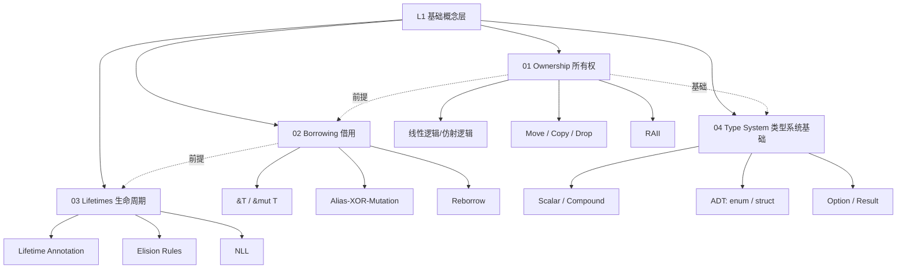

# L1 基础概念层（Foundation）

> **定位**：Rust 最核心的基础性概念，是所有进阶内容的必要前提。本层内容对齐 TRPL 第 3-10 章、Wikipedia 核心词条、Stanford/CMU 基础课程。

---

## 一、本层概念图谱



---

## 二、文件索引

| 文件 | 概念 | 核心内容 | 状态 |
|:---|:---|:---|:---|
| [01_ownership.md](./01_ownership.md) | 所有权 | 唯一所有权、Move/Copy/Drop、线性/仿射逻辑、RAII | ✅ v1.0 |
| [02_borrowing.md](./02_borrowing.md) | 借用 | `&T`/`&mut T`、借用规则、Alias-XOR-Mutation、NLL | ✅ v1.0 |
| [03_lifetimes.md](./03_lifetimes.md) | 生命周期 | 标注、Elision、NLL、`'static`、HRTB | ✅ v1.0 |
| [04_type_system.md](./04_type_system.md) | 类型系统基础 | 标量/复合/ADT、Option/Result、类型推断 | ✅ v1.0 |

---

## 三、学习路径建议

### 3.1 标准路径（推荐）

```
Ownership → Borrowing → Lifetimes → Type System
     ↑_________|__________|___________|
              （循环强化）
```

### 3.2 课程对齐路径

| 阶段 | TRPL 章节 | Stanford CS340R | CMU 17-363 |
|:---|:---|:---|:---|
| 所有权 | Ch 4.1 | Week 1-2 基础 | Lecture: Ownership in Rust |
| 借用 | Ch 4.2 | Week 1-2 基础 | Lecture: Borrowing & Lifetimes |
| 生命周期 | Ch 10.3 | Week 3 | Lecture: Lifetime Elision |
| 类型系统 | Ch 3, 6, 8 | Week 1 | Lecture: ADT & Pattern Matching |

---

## 四、形式化层级定位

本层概念在理论-模型-实践三层中的分布：

| 概念 | 理论层 | 模型层 | 实践层 |
|:---|:---|:---|:---|
| 所有权 | 线性/仿射逻辑 | 所有权状态机 | `move`、`Copy`、`Drop` |
| 借用 | 分离逻辑、权限分割 | 借用检查器算法 | `&T`、`&mut T`、编译错误 |
| 生命周期 | 区域类型系统 | 偏序约束求解 | 标注、Elision、NLL |
| 类型系统 | 类型论、范畴论 | HM 推断 + 所有权约束 | `enum`、`match`、类型标注 |

---

## 五、待创建内容

- [ ] `05_stack_heap.md` —— Stack vs Heap 内存模型（可与 Ownership 合并或独立）
- [ ] `06_slice_string.md` —— Slice 与 String 类型详解
- [ ] `07_pattern_matching.md` —— Pattern Matching 完整分析
