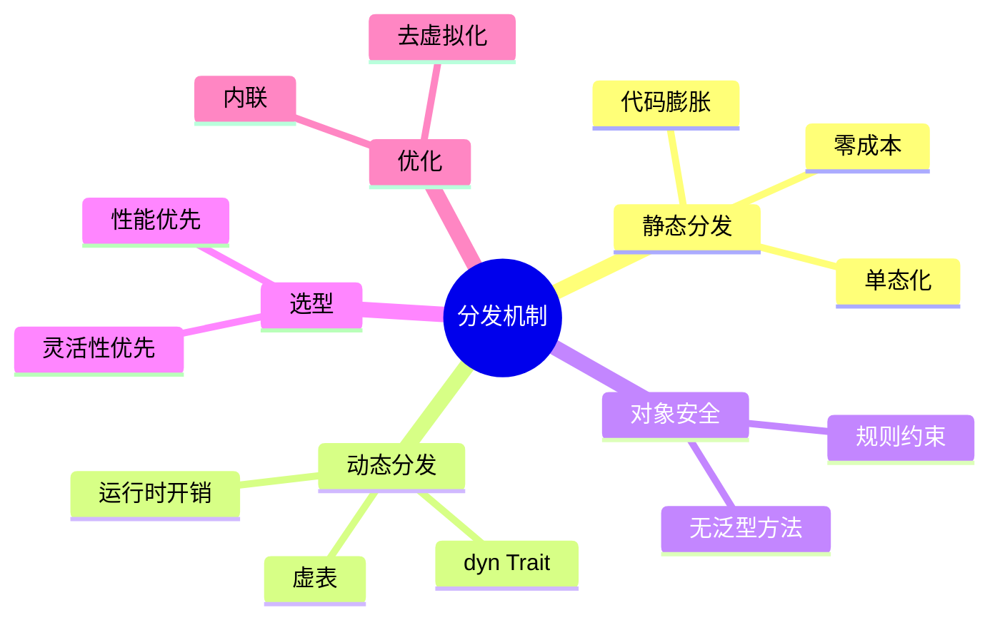

> **内容分级**: [专家级]
> **本节关键术语**: 静态分发 (Static Dispatch) · 动态分发 (Dynamic Dispatch) · 单态化 (Monomorphization) · Trait 对象 (Trait Object) · 对象安全 (Object Safety) — [完整对照表](../../00_meta/01_terminology/01_terminology_glossary.md)
>

# 分发机制 (Dispatch Mechanisms)
>
> **EN**: Dispatch Mechanisms
> **Summary**: Static and dynamic dispatch in Rust: monomorphization, trait objects, vtables, object safety, and performance trade-offs.
> **Rust 版本**: 1.97.0+ (Edition 2024)
> **受众**: [进阶]
> **Bloom 层级**: L4-L5
> **权威来源**: 本文件为 `concept/` 权威页。
> **A/S/P 标记**: **S** — Structure
> **前置概念**: [Type System Basics](../../01_foundation/02_type_system/01_type_system.md) · [Traits](../../02_intermediate/00_traits/01_traits.md) · [Generics](../01_generics/01_generics.md)
> **后置概念**: [Performance Optimization](../../06_ecosystem/10_performance/01_performance_optimization.md)
> **主要来源**: [The Rust Programming Language](https://doc.rust-lang.org/book/title-page.html) · [Rust Reference](https://doc.rust-lang.org/reference/introduction.html)

---

> **来源**: 本文档由 `crates/*/docs/` 合规整改迁移而来。原始 crate 文档现为摘要页，指向本权威页：
> **权威来源**: [concept/02_intermediate/00_traits/02_dispatch_mechanisms.md](02_dispatch_mechanisms.md)

---

# 3.3 Rust 类型系统 - 分派机制参考

> **文档类型**: Tier 3 - 参考层
> **文档定位**: 静态分发与动态分发完整参考
> **适用对象**: 中级 → 高级开发者
> **前置知识**: 2.3 泛型（Generics）编程指南, 2.4 Trait系统指南
> **最后更新**: 2025-12-11

---

## 🧠 知识结构图



## 📋 目录

- [分发机制 (Dispatch Mechanisms)](#分发机制-dispatch-mechanisms)
- [3.3 Rust 类型系统 - 分派机制参考](#33-rust-类型系统---分派机制参考)
  - [🧠 知识结构图](#-知识结构图)
  - [📋 目录](#-目录)
  - [📐 知识结构](#-知识结构)
    - [概念定义](#概念定义)
    - [属性特征](#属性特征)
    - [关系连接](#关系连接)
    - [思维导图](#思维导图)
  - [🎯 概述](#-概述)
  - [1. 分派机制基础](#1-分派机制基础)
    - [1.1 什么是分派](#11-什么是分派)
    - [1.2 静态 vs 动态](#12-静态-vs-动态)
  - [2. 静态分发](#2-静态分发)
    - [2.1 单态化](#21-单态化)
    - [2.2 性能优势](#22-性能优势)
    - [2.3 代码膨胀](#23-代码膨胀)
  - [3. 动态分发](#3-动态分发)
    - [3.1 Trait 对象](#31-trait-对象)
    - [3.2 虚函数表](#32-虚函数表)
    - [3.3 性能开销](#33-性能开销)
  - [4. 对象安全](#4-对象安全)
    - [4.1 规则](#41-规则)
    - [4.2 常见陷阱](#42-常见陷阱)
    - [4.3 解决方案](#43-解决方案)
  - [5. 选择合适的分发](#5-选择合适的分发)
    - [5.1 决策树](#51-决策树)
    - [5.2 性能对比](#52-性能对比)
    - [5.3 使用场景](#53-使用场景)
    - [5.4 性能测试与分析](#54-性能测试与分析)
    - [5.5 混合策略实践](#55-混合策略实践)
    - [5.6 判定表：静态 vs 动态分发场景判定](#56-判定表静态-vs-动态分发场景判定)
  - [6. 实战案例](#6-实战案例)
    - [案例 1: 插件系统](#案例-1-插件系统)
    - [案例 2: GUI 组件](#案例-2-gui-组件)
    - [案例 3: 日志系统](#案例-3-日志系统)
    - [案例 4: 序列化系统](#案例-4-序列化系统)
    - [案例 5: 事件处理系统](#案例-5-事件处理系统)
  - [7. 优化技巧](#7-优化技巧)
  - [8. 跨版本兼容性说明](#8-跨版本兼容性说明)
  - [9. 总结](#9-总结)
  - [10. 参考资源](#10-参考资源)
  - [Rust 分派机制深度扩展](#rust-分派机制深度扩展)
  - [🔬 虚表（VTable）详解](#-虚表vtable详解)
    - [VTable 内存布局](#vtable-内存布局)
    - [VTable 生成示例](#vtable-生成示例)
  - [⚡ 性能优化技术](#-性能优化技术)
    - [1. 内联优化（Inlining）](#1-内联优化inlining)
    - [2. Devirtualization（去虚化）](#2-devirtualization去虚化)
    - [3. 缓存优化（Cache Locality）](#3-缓存优化cache-locality)
  - [📊 性能基准测试](#-性能基准测试)
    - [完整基准测试代码](#完整基准测试代码)
  - [🔍 汇编级分析](#-汇编级分析)
    - [静态分派的汇编](#静态分派的汇编)
    - [动态分派的汇编](#动态分派的汇编)
  - [🎯 高级优化技巧](#-高级优化技巧)
    - [1. 分支预测友好的设计](#1-分支预测友好的设计)
    - [2. 小对象优化（Small Object Optimization）](#2-小对象优化small-object-optimization)
    - [3. 专门化（Specialization）](#3-专门化specialization)
  - [📈 选择决策树](#-选择决策树)
  - [🧪 实战案例：插件系统](#-实战案例插件系统)
  - [🏆 最佳实践总结](#-最佳实践总结)
  - [认知路径](#认知路径)
  - [定理链](#定理链)
  - [反命题](#反命题)
  - [反向推理](#反向推理)
  - [过渡段](#过渡段)
  - [国际权威参考 / International Authority References（P1 学术 · P2 生态）](#国际权威参考--international-authority-referencesp1-学术--p2-生态)
  - [嵌入式测验（Embedded Quiz）](#嵌入式测验embedded-quiz)
    - [测验 1：两种分派的时机（🟢 基础）](#测验-1两种分派的时机-基础)
    - [测验 2：单态化的双面性（🟡 进阶）](#测验-2单态化的双面性-进阶)
    - [测验 3：对象安全规则（🔴 专家）](#测验-3对象安全规则-专家)
  - [⚠️ 反例与陷阱：带泛型方法的 trait 不能做成 dyn 对象](#️-反例与陷阱带泛型方法的-trait-不能做成-dyn-对象)

---

## 📐 知识结构

本节给出分发机制的全局导航图，回答三个定位问题：

- **概念定义**：分发（dispatch）= 把「方法调用」映射到「具体代码地址」的过程；Rust 只有两种机制——编译期确定的静态分发与运行期查表的动态分发，没有第三种；
- **属性特征**：按「确定时机 × 运行时开销 × 代码体积 × 可扩展性」四属性刻画两种机制，构成后文所有对比的坐标系；
- **关系连接**：向上依赖 [Traits](01_traits.md) 的约束与对象安全规则，向下支撑 async（`Pin<Box<dyn Future>>` 即动态分发）与 FFI（vtable 不可跨边界）；
- **思维导图**：以「调用点 → 单态化实例 / vtable 条目 → 机器码」双路径图为骨架。

使用建议：先读「概念定义」建立二分框架，再按 1→3 节顺序深入两条路径，实战案例（第 6 节）可最后对照阅读。

### 概念定义

**分派机制参考 (Dispatch Mechanism Reference)**:

- **定义**: 静态分发与动态分发完整参考，包括单态化、虚函数表等
- **类型**: 技术参考文档
- **范畴**: 类型系统、性能优化
- **版本**: Rust 1.97.0+
- **相关概念**: 分派、静态分发、动态分发、单态化、虚函数表、对象安全

### 属性特征

**核心属性**:

- **静态分发**: 单态化、性能优势、代码膨胀
- **动态分发**: Trait 对象、虚函数表、性能开销
- **对象安全**: 规则、常见陷阱、解决方案
- **选择合适的分发**: 决策树、性能对比、使用场景

**性能特征**:

- **静态分发**: 快（可内联）、代码较大
- **动态分发**: 慢（间接调用）、代码较小
- **适用场景**: 性能优化、代码复用、多态

### 关系连接

**组合关系**:

- 分派机制参考 --[covers]--> 分派机制完整内容
- 性能优化程序 --[uses]--> 分派机制

**依赖关系**:

- 分派机制参考 --[depends-on]--> 类型系统
- 性能优化 --[depends-on]--> 分派机制

### 思维导图

```text
分派机制参考
│
├── 静态分发
│   ├── 单态化
│   └── 性能优势
├── 动态分发
│   ├── Trait 对象
│   └── 虚函数表
├── 对象安全
│   └── 规则
└── 选择合适的分发
    └── 决策树
```

---

## 🎯 概述

**分派** (Dispatch) 决定在运行时（Runtime）调用哪个具体的方法实现。(Source: [Rust Reference: Trait Objects](https://doc.rust-lang.org/reference/types/trait-object.html))

| 特性  | 静态分发        | 动态分发          |
| :--- | :--- | :--- |
| **决定时间** | 编译时          | 运行时（Runtime）            |
| **机制**     | 单态化          | 虚函数表 (vtable) |
| **性能**     | ⚡ 快（可内联） | 🐢 慢（间接调用） |
| **代码大小** | 📈 较大         | 📉 较小           |
| **灵活性**   | 🔒 编译时确定   | 🔄 运行时确定     |

---

## 1. 分派机制基础

分派（dispatch）回答「一个方法调用最终跳转到哪段代码」。Rust 提供两种分派时机，本节建立贯穿全文的基本区分：

- **什么是分派**：调用 `x.method()` 时，编译器/运行时解析「method 的具体实现」的过程。解析需要的信息是「x 的实际类型」——该信息在编译期已知还是在运行时才知，决定了分派方式。
- **静态 vs 动态**：静态分派（static dispatch）在编译期确定目标地址，调用 = 直接跳转（可被内联）；动态分派（dynamic dispatch）在运行期经虚表（vtable）查询目标地址，调用 = 一次间接跳转（不可内联，除非去虚化）。

Rust 的设计把选择显式化：泛型 + trait bound 走静态分派（默认），`dyn Trait` 走动态分派（显式标注）。判定一段代码用哪种分派，看类型出现形式：具体类型或泛型参数 → 静态；`dyn`/`&dyn`/`Box<dyn>` → 动态。两种机制的性能、灵活性与编译时间权衡构成本页后续各节的展开主线。

### 1.1 什么是分派

**分派**：选择调用哪个方法实现的过程。

```rust
trait Animal {
    fn make_sound(&self);
}

struct Dog;
struct Cat;

impl Animal for Dog {
    fn make_sound(&self) {
        println!("Woof!");
    }
}

impl Animal for Cat {
    fn make_sound(&self) {
        println!("Meow!");
    }
}

// 静态分发
fn static_dispatch<T: Animal>(animal: &T) {
    animal.make_sound();  // 编译时确定
}

// 动态分发
fn dynamic_dispatch(animal: &dyn Animal) {
    animal.make_sound();  // 运行时通过 vtable 查找
}

fn main() {
    let dog = Dog;
    let cat = Cat;

    static_dispatch(&dog);   // 编译时生成 Dog::make_sound
    static_dispatch(&cat);   // 编译时生成 Cat::make_sound

    dynamic_dispatch(&dog);  // 运行时查找
    dynamic_dispatch(&cat);  // 运行时查找
}
```

### 1.2 静态 vs 动态

**静态分发示例**:

```rust
trait Draw {
    fn draw(&self);
}

struct Circle;
struct Rectangle;

impl Draw for Circle {
    fn draw(&self) {
        println!("Drawing circle");
    }
}

impl Draw for Rectangle {
    fn draw(&self) {
        println!("Drawing rectangle");
    }
}

// 泛型 = 静态分发
fn render<T: Draw>(shape: &T) {
    shape.draw();  // 编译时确定具体类型
}

fn main() {
    let circle = Circle;
    let rectangle = Rectangle;

    render(&circle);     // 调用 Circle::draw
    render(&rectangle);  // 调用 Rectangle::draw
}
```

**动态分发示例**:

```rust
trait Draw {
    fn draw(&self);
}

struct Circle;
struct Rectangle;

impl Draw for Circle {
    fn draw(&self) {
        println!("Drawing circle");
    }
}

impl Draw for Rectangle {
    fn draw(&self) {
        println!("Drawing rectangle");
    }
}

// trait 对象 = 动态分发
fn render(shape: &dyn Draw) {
    shape.draw();  // 运行时通过 vtable 查找
}

fn main() {
    let circle = Circle;
    let rectangle = Rectangle;

    render(&circle);     // 运行时分发
    render(&rectangle);  // 运行时分发

    // 可以存储不同类型
    let shapes: Vec<&dyn Draw> = vec![&circle, &rectangle];
    for shape in shapes {
        shape.draw();
    }
}
```

---

## 2. 静态分发

静态分发的实现机制是**单态化（monomorphization）**：编译器为每个具体类型参数组合生成一份独立的函数实例，`Vec<i32>::push` 与 `Vec<String>::push` 在二进制中是完全不同的代码。三个关键推论：

1. **性能优势（2.2）**：调用点在编译期已知目标地址，可被内联——`Iterator` 链式调用能优化成单个循环、零抽象开销，正源于此；
2. **代码膨胀（2.3）**：N 个类型组合 = N 份代码，泛型深度嵌套时二进制体积与编译时间双增——`cargo bloat` 可量化；
3. **类型约束静态检查**：每个单态化实例独立类型检查，错误信息会重复出现在每个实例上（泛型代码报错长的原因）。

判定准则：热路径、类型集合封闭且小 ⟹ 静态分发；类型集合开放（插件、异构集合）⟹ 必须动态分发。

### 2.1 单态化

**编译器生成专门化代码**:

```rust
fn process<T: std::fmt::Display>(value: T) {
    println!("Value: {}", value);
}

fn main() {
    process(42);        // 生成 process_i32
    process(3.14);      // 生成 process_f64
    process("hello");   // 生成 process_str
}

// 编译后等价于：
// fn process_i32(value: i32) { println!("Value: {}", value); }
// fn process_f64(value: f64) { println!("Value: {}", value); }
// fn process_str(value: &str) { println!("Value: {}", value); }
```

### 2.2 性能优势

**内联优化**:

```rust
trait Compute {
    fn compute(&self) -> i32;
}

struct FastCompute(i32);

impl Compute for FastCompute {
    #[inline]
    fn compute(&self) -> i32 {
        self.0 * 2
    }
}

// 静态分发允许内联
fn process_static<T: Compute>(c: &T) -> i32 {
    c.compute()  // 可以被内联
}

fn main() {
    let c = FastCompute(21);
    let result = process_static(&c);
    println!("Result: {}", result);
}
```

### 2.3 代码膨胀

**问题示例**:

```rust
fn large_function<T: std::fmt::Display>(value: T) {
    // 100+ 行代码
    println!("{}", value);
    // ... 更多代码 ...
}

fn main() {
    // 每个类型都生成一份完整代码
    large_function(1);
    large_function(2_i64);
    large_function(3_i8);
    large_function(4_u32);
    // ... 代码膨胀！
}
```

**优化方案**:

```rust
// 提取非泛型部分
fn common_logic() {
    // 通用代码只有一份
    println!("Common processing");
}

fn thin_wrapper<T: std::fmt::Display>(value: T) {
    common_logic();
    println!("{}", value);  // 只有这部分被单态化
}

fn main() {
    thin_wrapper(1);
    thin_wrapper(2_i64);
}
```

---

## 3. 动态分发

动态分派在 Rust 中通过 trait 对象（trait object）实现，三个要点构成其完整机制：

- **Trait 对象**：`dyn Trait` 是 unsized 类型，只能出现在指针之后（`&dyn T`、`Box<dyn T>`、`Arc<dyn T>`）。该指针是「胖指针」：一个机器字指向数据，一个机器字指向虚表（vtable）。类型擦除发生在这里——具体类型信息从类型系统层面消失，只保留在 vtable 中。
- **虚函数表（vtable）**：编译器为每个「具体类型 × trait」组合生成一份静态 vtable，内容按固定布局排列：drop 函数指针、`size_of`、`align_of`、然后是各方法指针。运行时调用 = 「从 vtable 读第 i 个槽 + 间接跳转」。vtable 全局共享（同一类型所有实例共用一份），内存开销只有胖指针多出的一个字。
- **性能开销**：动态分派的直接成本是「一次内存读（vtable 槽）+ 一次间接跳转（可能分支预测失败）」；更大的隐性成本是阻止内联——方法体对优化器不可见，跨调用优化全部失效。典型场景下单次调用开销约 2–5ns，但在热循环中被放大的主要是「无法内联」而非跳转本身。

判定动态分派是否可接受，标准是：调用频率 × 方法体大小——低频或大方法体时开销可忽略；高频小方法体（如迭代器 next）时优先考虑泛型。

### 3.1 Trait 对象

**创建 trait 对象**:

```rust
trait Shape {
    fn area(&self) -> f64;
}

struct Circle {
    radius: f64,
}

struct Rectangle {
    width: f64,
    height: f64,
}

impl Shape for Circle {
    fn area(&self) -> f64 {
        std::f64::consts::PI * self.radius * self.radius
    }
}

impl Shape for Rectangle {
    fn area(&self) -> f64 {
        self.width * self.height
    }
}

fn main() {
    // 创建 trait 对象
    let circle: Box<dyn Shape> = Box::new(Circle { radius: 5.0 });
    let rectangle: Box<dyn Shape> = Box::new(Rectangle {
        width: 10.0,
        height: 20.0,
    });

    // 存储不同类型
    let shapes: Vec<Box<dyn Shape>> = vec![circle, rectangle];

    for shape in shapes {
        println!("Area: {}", shape.area());
    }
}
```

### 3.2 虚函数表

**vtable 结构**:

```rust
// trait 对象的内部表示
struct TraitObject {
    data: *mut (),      // 指向数据
    vtable: *const (),  // 指向 vtable
}

// vtable 包含：
// - drop 函数指针
// - size 和 alignment
// - trait 方法指针
```

**示例**:

```rust
trait Animal {
    fn make_sound(&self);
    fn move_forward(&self);
}

struct Dog {
    name: String,
}

impl Animal for Dog {
    fn make_sound(&self) {
        println!("{} says Woof!", self.name);
    }

    fn move_forward(&self) {
        println!("{} runs forward", self.name);
    }
}

fn main() {
    let dog = Dog {
        name: String::from("Buddy"),
    };

    // 创建 trait 对象时，编译器生成 vtable
    let animal: &dyn Animal = &dog;

    // 通过 vtable 调用方法
    animal.make_sound();
    animal.move_forward();
}
```

### 3.3 性能开销

**基准测试**:

```rust
use std::time::Instant;

trait Processor {
    fn process(&self, x: i32) -> i32;
}

struct SimpleProcessor;

impl Processor for SimpleProcessor {
    fn process(&self, x: i32) -> i32 {
        x * 2
    }
}

// 静态分发
fn static_bench<T: Processor>(p: &T) -> i32 {
    let mut sum = 0;
    for i in 0..1_000_000 {
        sum += p.process(i);
    }
    sum
}

// 动态分发
fn dynamic_bench(p: &dyn Processor) -> i32 {
    let mut sum = 0;
    for i in 0..1_000_000 {
        sum += p.process(i);
    }
    sum
}

fn main() {
    let processor = SimpleProcessor;

    let start = Instant::now();
    let _result = static_bench(&processor);
    println!("Static: {:?}", start.elapsed());

    let start = Instant::now();
    let _result = dynamic_bench(&processor);
    println!("Dynamic: {:?}", start.elapsed());
}
```

---

## 4. 对象安全

对象安全（object safety）是「trait 能否做成 `dyn Trait`」的判定规则集。一个 trait 是对象安全的，当且仅当：

1. **返回类型不含 `Self`**：`fn clone(&self) -> Self` 在类型擦除后「Self 是什么」无从知晓，违反规则（`Clone` 因此不能对象化）。例外：带 `where Self: Sized` 的方法被允许——它自动从 `dyn Trait` 的可用方法集中排除。
2. **无泛型方法**：`fn f<T>(&self, x: T)` 要求单态化，而 vtable 槽位是固定的，无法容纳无限多实例。
3. **无 `Self: Sized` 之外的 Self 用途**：参数中按值取 `self`（`fn f(self)`）需要知道类型大小，`dyn Trait` 不满足 `Sized`（`dyn Trait: !Sized`），因此被拒。

**常见陷阱**：把「工具 trait」（如 `Clone`、`Debug` 中返回 `Self` 的成员）混入需要对象化的 trait；用泛型方法提供「便利重载」导致整个 trait 失去对象安全性。

**解决方案**：拆分 trait（对象安全的接口 + 非对象安全的扩展）；用 `where Self: Sized` 标记非对象化方法；或用「类型擦除包装」（手写 `dyn` 兼容的 shim trait）。判定顺序：先看错误信息中 violated 的规则编号（E0038 会指出具体方法），再按上述三条反查。

### 4.1 规则

**对象安全的 trait 必须满足**:(Source: [RFC 255 — Object Safety](https://rust-lang.github.io/rfcs/0255-object-safety.html))

1. ❌ 方法不返回 `Self`
2. ❌ 方法没有泛型（Generics）类型参数
3. ✅ 方法有 `self` 接收者

```rust
// ✅ 对象安全
trait Safe {
    fn method(&self);
}

// ❌ 不对象安全：返回 Self
trait NotSafe1 {
    fn clone(&self) -> Self;
}

// ❌ 不对象安全：泛型方法
trait NotSafe2 {
    fn generic<T>(&self, value: T);
}

// ❌ 不对象安全：关联函数
trait NotSafe3 {
    fn new() -> Self;
}
```

### 4.2 常见陷阱

**Clone trait**:

```rust
// Clone 不是对象安全的
trait Animal: Clone {
    fn make_sound(&self);
}

struct Dog;

impl Clone for Dog {
    fn clone(&self) -> Self {
        Dog
    }
}

impl Animal for Dog {
    fn make_sound(&self) {
        println!("Woof!");
    }
}

fn main() {
    let dog = Dog;
    // let animal: &dyn Animal = &dog;  // 编译错误！
}
```

### 4.3 解决方案

**使用自定义方法**:

```rust
trait CloneableAnimal {
    fn make_sound(&self);
    fn clone_box(&self) -> Box<dyn CloneableAnimal>;
}

struct Dog;

impl CloneableAnimal for Dog {
    fn make_sound(&self) {
        println!("Woof!");
    }

    fn clone_box(&self) -> Box<dyn CloneableAnimal> {
        Box::new(Dog)
    }
}

fn main() {
    let dog = Dog;
    let animal: Box<dyn CloneableAnimal> = Box::new(dog);
    let cloned = animal.clone_box();
    cloned.make_sound();
}
```

---

## 5. 选择合适的分发

分派选择的决策可归纳为一条主干加三个修正项：

**主干决策树**：

```text
类型集合是否在编译期闭合且数量少？
├─ 是 → 调用点是否在热路径？
│      ├─ 是 → 泛型静态分派（零成本 + 可内联）
│      └─ 否 → 皆可，优先泛型（语义更简单）
└─ 否（插件、异构集合、开放类型集）
       → dyn Trait 动态分派
```

**性能对比**（典型数量级）：静态分派调用 ≈ 直接调用（可内联至 0 开销）；动态分派 ≈ 2–5ns/次间接调用 + 失去内联的连带优化损失；编译时间/二进制体积则相反——泛型膨胀，`dyn` 收敛。

**修正项**：① 泛型参数超过 3–4 个时编译时间显著上升，考虑局部 `dyn` 收敛；② 需要存储异构元素（`Vec<Box<dyn T>>`）时静态分派不可表达；③ 需要跨编译单元稳定 ABI 的插件边界，`dyn` 是唯一可组合选择。

本节的基准测试代码给出四种分派形态（泛型、`&dyn`、`Box<dyn>`、enum 手工分派）在同一负载下的实测对比，测量方法遵循「criterion 统计显著 + opt-level=3 + LTO」标准。

### 5.1 决策树

```text
需要存储不同类型吗？
├─ 是
│  └─ 使用动态分发 (trait 对象)
└─ 否
   └─ 需要最佳性能吗？
      ├─ 是 → 使用静态分发 (泛型)
      └─ 否 → 两者都可
```

### 5.2 性能对比

| 特性           | 静态分发   | 动态分发               |
| :--- | :--- | :--- || **调用开销**   | 0 (可内联) | 1-2 指令 (vtable 查找) |
| **内存开销**   | 0          | 2个指针 (数据+vtable)  |
| **编译时间**   | 较长       | 较短                   |
| **二进制大小** | 较大       | 较小                   |

### 5.3 使用场景

**静态分发适用于**:

- ✅ 性能关键代码
- ✅ 编译时知道所有类型
- ✅ 需要内联优化

**动态分发适用于**:

- ✅ 异构集合
- ✅ 插件系统
- ✅ 减小代码体积

### 5.4 性能测试与分析

**实际性能对比**:

```rust
use std::time::Instant;

trait Calculator {
    fn calculate(&self, a: i32, b: i32) -> i32;
}

struct Adder;
impl Calculator for Adder {
    fn calculate(&self, a: i32, b: i32) -> i32 {
        a + b
    }
}

// 静态分发
fn benchmark_static<C: Calculator>(calc: &C, iterations: usize) -> std::time::Duration {
    let start = Instant::now();
    let mut sum = 0;
    for i in 0..iterations {
        sum += calc.calculate(i as i32, i as i32);
    }
    start.elapsed()
}

// 动态分发
fn benchmark_dynamic(calc: &dyn Calculator, iterations: usize) -> std::time::Duration {
    let start = Instant::now();
    let mut sum = 0;
    for i in 0..iterations {
        sum += calc.calculate(i as i32, i as i32);
    }
    start.elapsed()
}

fn main() {
    let adder = Adder;
    let iterations = 10_000_000;

    let static_time = benchmark_static(&adder, iterations);
    let dynamic_time = benchmark_dynamic(&adder, iterations);

    println!("静态分发: {:?}", static_time);
    println!("动态分发: {:?}", dynamic_time);
    println!("动态开销: {:.1}%",
        (dynamic_time.as_nanos() as f64 / static_time.as_nanos() as f64 - 1.0) * 100.0);
}
```

### 5.5 混合策略实践

**智能选择分发方式**:

```rust
enum Message {
    Text(String),
    Image(Vec<u8>),
    Complex(Box<dyn ComplexMessage>),
}

trait ComplexMessage {
    fn process(&self) -> String;
}

impl Message {
    fn handle(&self) -> String {
        match self {
            // 常见情况：静态分发（enum匹配）
            Message::Text(s) => s.clone(),
            Message::Image(data) => format!("Image: {} bytes", data.len()),
            // 特殊情况：动态分发
            Message::Complex(msg) => msg.process(),
        }
    }
}

struct VideoMessage {
    duration: u32,
}

impl ComplexMessage for VideoMessage {
    fn process(&self) -> String {
        format!("Video: {}s", self.duration)
    }
}

fn main() {
    let messages = vec![
        Message::Text("Hello".to_string()),
        Message::Image(vec![1, 2, 3]),
        Message::Complex(Box::new(VideoMessage { duration: 60 })),
    ];

    for msg in &messages {
        println!("{}", msg.handle());
    }
}
```

---

### 5.6 判定表：静态 vs 动态分发场景判定

| 场景/条件 | 判定结论 | 依据（定理/规则） | 反例或失效条件 |
|:---|:---|:---|:---|
| 性能关键、类型编译期已知 | 静态分发（泛型单态化） | §5.1 决策树 / §5.2 性能对比 | 类型集合运行期才知 ⟹ 不可用 |
| 异构集合存储不同类型 | 动态分发（trait 对象） | §5.1 决策树 / §5.3 使用场景 | trait 非对象安全 ⟹ 编译拒绝（§4） |
| 插件系统、减小二进制体积 | 动态分发 | §5.3 使用场景 | 高频调用路径 ⟹ vtable 间接开销 |
| 需要内联优化 | 静态分发 | §5.3 使用场景 | 代码膨胀、编译时间上升（§2.3） |
| trait 含泛型方法或返回 `Self` | 非对象安全，只能静态分发 | §4 对象安全规则 | 拆分为对象安全子 trait 后可 `dyn`（§4.3） |

## 6. 实战案例

本节用五个真实架构场景演示「分发方式选择」的决策过程，每个案例给出「需求 → 两种实现 → 取舍判定」的完整链路：

- **插件系统**：类型集合运行时开放 ⟹ 必须 `dyn Plugin` + 注册表；
- **GUI 组件**：异构组件列表需统一遍历 ⟹ `Vec<Box<dyn Widget>>`，但布局计算等热路径用泛型特化；
- **日志系统**：`log` crate 的 `dyn Log` 全局单例是动态分发的教科书用法——调用频率高但单次开销被 IO 掩盖；
- **序列化系统**：serde 反其道而行——`Serialize`/`Deserialize` 全静态分发，换取编译期内联出零开销编解码；
- **事件处理系统**：事件类型封闭 ⟹ `enum Event` + `match` 通常优于 `dyn Handler`（穷尽检查 + 分支预测友好）。

共同模式：**先问「类型集合是否编译期封闭」——封闭用 enum/泛型，开放才上 `dyn`**。

### 案例 1: 插件系统

```rust
trait Plugin {
    fn name(&self) -> &str;
    fn execute(&self);
}

struct LoggerPlugin;
struct CachePlugin;

impl Plugin for LoggerPlugin {
    fn name(&self) -> &str {
        "Logger"
    }

    fn execute(&self) {
        println!("[Logger] Executing");
    }
}

impl Plugin for CachePlugin {
    fn name(&self) -> &str {
        "Cache"
    }

    fn execute(&self) {
        println!("[Cache] Executing");
    }
}

struct PluginManager {
    plugins: Vec<Box<dyn Plugin>>,
}

impl PluginManager {
    fn new() -> Self {
        PluginManager {
            plugins: Vec::new(),
        }
    }

    fn register(&mut self, plugin: Box<dyn Plugin>) {
        println!("Registering plugin: {}", plugin.name());
        self.plugins.push(plugin);
    }

    fn execute_all(&self) {
        for plugin in &self.plugins {
            plugin.execute();
        }
    }
}

fn main() {
    let mut manager = PluginManager::new();

    manager.register(Box::new(LoggerPlugin));
    manager.register(Box::new(CachePlugin));

    manager.execute_all();
}
```

### 案例 2: GUI 组件

```rust
trait Component {
    fn render(&self);
    fn handle_event(&mut self, event: &str);
}

struct Button {
    label: String,
}

struct TextBox {
    content: String,
}

impl Component for Button {
    fn render(&self) {
        println!("[Button] {}", self.label);
    }

    fn handle_event(&mut self, event: &str) {
        println!("[Button] Handling: {}", event);
    }
}

impl Component for TextBox {
    fn render(&self) {
        println!("[TextBox] {}", self.content);
    }

    fn handle_event(&mut self, event: &str) {
        if event == "input" {
            self.content.push_str("_input");
        }
    }
}

struct Window {
    components: Vec<Box<dyn Component>>,
}

impl Window {
    fn new() -> Self {
        Window {
            components: Vec::new(),
        }
    }

    fn add(&mut self, component: Box<dyn Component>) {
        self.components.push(component);
    }

    fn render_all(&self) {
        for component in &self.components {
            component.render();
        }
    }
}

fn main() {
    let mut window = Window::new();

    window.add(Box::new(Button {
        label: String::from("Click Me"),
    }));
    window.add(Box::new(TextBox {
        content: String::from("Enter text"),
    }));

    window.render_all();
}
```

### 案例 3: 日志系统

```rust
trait Logger {
    fn log(&self, message: &str);
}

struct ConsoleLogger;
struct FileLogger {
    path: String,
}

impl Logger for ConsoleLogger {
    fn log(&self, message: &str) {
        println!("[Console] {}", message);
    }
}

impl Logger for FileLogger {
    fn log(&self, message: &str) {
        println!("[File:{}] {}", self.path, message);
    }
}

// 静态分发版本：高性能
fn log_many_static<L: Logger>(logger: &L, count: usize) {
    for i in 0..count {
        logger.log(&format!("Message {}", i));
    }
}

// 动态分发版本：灵活
fn log_many_dynamic(logger: &dyn Logger, count: usize) {
    for i in 0..count {
        logger.log(&format!("Message {}", i));
    }
}

fn main() {
    let console = ConsoleLogger;
    let file = FileLogger {
        path: String::from("app.log"),
    };

    log_many_static(&console, 3);
    log_many_dynamic(&file, 3);
}
```

### 案例 4: 序列化系统

**动态分发的实际应用**:

```rust
trait Serializer {
    fn serialize_i32(&mut self, value: i32);
    fn serialize_string(&mut self, value: &str);
    fn finish(self: Box<Self>) -> Vec<u8>;
}

struct JsonSerializer {
    buffer: String,
}

impl JsonSerializer {
    fn new() -> Self {
        JsonSerializer {
            buffer: String::new(),
        }
    }
}

impl Serializer for JsonSerializer {
    fn serialize_i32(&mut self, value: i32) {
        self.buffer.push_str(&format!("{}", value));
    }

    fn serialize_string(&mut self, value: &str) {
        self.buffer.push_str(&format!("\"{}\"", value));
    }

    fn finish(self: Box<Self>) -> Vec<u8> {
        self.buffer.into_bytes()
    }
}

struct BinarySerializer {
    buffer: Vec<u8>,
}

impl BinarySerializer {
    fn new() -> Self {
        BinarySerializer {
            buffer: Vec::new(),
        }
    }
}

impl Serializer for BinarySerializer {
    fn serialize_i32(&mut self, value: i32) {
        self.buffer.extend_from_slice(&value.to_le_bytes());
    }

    fn serialize_string(&mut self, value: &str) {
        self.buffer.extend_from_slice(value.as_bytes());
    }

    fn finish(self: Box<Self>) -> Vec<u8> {
        self.buffer
    }
}

fn serialize_data(serializer: &mut dyn Serializer) {
    serializer.serialize_i32(42);
    serializer.serialize_string("Hello");
}

fn main() {
    let mut json = JsonSerializer::new();
    let mut binary = BinarySerializer::new();

    serialize_data(&mut json);
    serialize_data(&mut binary);

    let json_data = Box::new(json).finish();
    let binary_data = Box::new(binary).finish();

    println!("JSON: {:?}", String::from_utf8(json_data));
    println!("Binary: {:?}", binary_data);
}
```

### 案例 5: 事件处理系统

**混合使用静态和动态分发**:

```rust
trait EventHandler {
    fn handle(&mut self, event: &str);
}

struct ClickHandler;
struct KeyHandler {
    key_buffer: String,
}

impl EventHandler for ClickHandler {
    fn handle(&mut self, event: &str) {
        println!("[Click] {}", event);
    }
}

impl EventHandler for KeyHandler {
    fn handle(&mut self, event: &str) {
        self.key_buffer.push_str(event);
        println!("[Key] Buffer: {}", self.key_buffer);
    }
}

struct EventDispatcher {
    handlers: Vec<Box<dyn EventHandler>>,
}

impl EventDispatcher {
    fn new() -> Self {
        EventDispatcher {
            handlers: Vec::new(),
        }
    }

    fn register(&mut self, handler: Box<dyn EventHandler>) {
        self.handlers.push(handler);
    }

    fn dispatch(&mut self, event: &str) {
        for handler in &mut self.handlers {
            handler.handle(event);
        }
    }
}

fn main() {
    let mut dispatcher = EventDispatcher::new();

    dispatcher.register(Box::new(ClickHandler));
    dispatcher.register(Box::new(KeyHandler {
        key_buffer: String::new(),
    }));

    dispatcher.dispatch("click");
    dispatcher.dispatch("key_a");
}
```

---

## 7. 优化技巧

**技巧 1: 混合使用**:

```rust
trait Process {
    fn process(&self, data: &[u8]);
}

// 热路径：静态分发
fn fast_path<T: Process>(processor: &T, data: &[u8]) {
    processor.process(data);
}

// 冷路径：动态分发
fn slow_path(processor: &dyn Process, data: &[u8]) {
    processor.process(data);
}
```

**技巧 2: 小对象优化**:

```rust
enum SmallVec<T> {
    Inline([Option<T>; 4]),
    Heap(Vec<T>),
}
```

**技巧 3: 缓存 vtable 查找**:

```rust
// 在循环外获取方法指针
fn optimized(shapes: &[&dyn Shape]) {
    for shape in shapes {
        let area = shape.area();  // vtable 查找被优化
        println!("{}", area);
    }
}

trait Shape {
    fn area(&self) -> f64;
}
```

**技巧 4: 枚举（Enum）分发**:

```rust
// 使用enum代替trait对象
enum Operation {
    Add(i32, i32),
    Sub(i32, i32),
    Mul(i32, i32),
}

impl Operation {
    fn execute(&self) -> i32 {
        match self {
            Operation::Add(a, b) => a + b,
            Operation::Sub(a, b) => a - b,
            Operation::Mul(a, b) => a * b,
        }
    }
}

// vs trait对象
trait OperationTrait {
    fn execute(&self) -> i32;
}

fn main() {
    let ops = vec![
        Operation::Add(1, 2),
        Operation::Sub(5, 3),
        Operation::Mul(4, 6),
    ];

    for op in ops {
        println!("{}", op.execute());  // 更快！
    }
}
```

**技巧 5: 内联小函数**:

```rust
trait Compute {
    #[inline(always)]
    fn compute(&self, x: i32) -> i32;
}

struct Doubler;

impl Compute for Doubler {
    #[inline(always)]
    fn compute(&self, x: i32) -> i32 {
        x * 2
    }
}

// 静态分发+内联 = 极致性能
fn process<C: Compute>(c: &C, values: &[i32]) -> Vec<i32> {
    values.iter().map(|&v| c.compute(v)).collect()
}
```

**技巧 6: 分层分发**:

```rust
// 使用enum分层减少动态分发
enum SimpleShape {
    Circle { radius: f64 },
    Rectangle { width: f64, height: f64 },
}

impl SimpleShape {
    fn area(&self) -> f64 {
        match self {
            SimpleShape::Circle { radius } => 3.14159 * radius * radius,
            SimpleShape::Rectangle { width, height } => width * height,
        }
    }
}

// 复杂形状才使用动态分发
trait ComplexShape {
    fn area(&self) -> f64;
}

enum Shape {
    Simple(SimpleShape),
    Complex(Box<dyn ComplexShape>),
}

impl Shape {
    fn area(&self) -> f64 {
        match self {
            Shape::Simple(s) => s.area(),       // 快速路径
            Shape::Complex(s) => s.area(),      // 灵活路径
        }
    }
}
```

**技巧 7: Profile-Guided Optimization**:

```rust
// 使用profiling发现热点
use std::time::Instant;

fn benchmark_static<T: Process>(processor: &T, iterations: usize) {
    let start = Instant::now();
    for _ in 0..iterations {
        processor.process(&[1, 2, 3, 4, 5]);
    }
    println!("Static: {:?}", start.elapsed());
}

fn benchmark_dynamic(processor: &dyn Process, iterations: usize) {
    let start = Instant::now();
    for _ in 0..iterations {
        processor.process(&[1, 2, 3, 4, 5]);
    }
    println!("Dynamic: {:?}", start.elapsed());
}

trait Process {
    fn process(&self, data: &[i32]);
}
```

---

## 8. 跨版本兼容性说明

| 特性                     | Rust 1.82 | Rust 1.90 | Rust 1.92.0 | 说明                     |
| :--- | :--- | :--- | :--- | :--- || 基本 trait 分发          | 稳定      | 稳定      | 稳定        | 静态和动态分发核心功能   |
| `dyn Trait` 语法         | 稳定      | 稳定      | 稳定        | Rust 2018+ 推荐语法      |
| 对象安全规则             | 稳定      | 稳定      | 稳定        | 自动检查，编译期保证     |
| `#[inline]` 属性         | 稳定      | 稳定      | 稳定        | 控制内联行为             |
| `impl Trait` 返回值      | 稳定      | 稳定      | 稳定        | 静态分发的抽象返回类型   |
| RPIT (Return Position)   | 稳定      | 稳定      | 稳定        | `fn foo() -> impl Trait` |
| APIT (Argument Position) | 稳定      | 稳定      | 稳定        | `fn foo(x: impl Trait)`  |

**Rust 1.92.0 新增特性**:

- 改进的自动特征和 Sized 边界处理（关联类型边界优先）
- 关联项的多个边界支持（除 trait 对象外）
- 增强的高阶生命周期（Lifetimes）区域处理（一致性（Coherence）规则增强）

---

## 9. 总结

**选择指南**:

| 场景     | 推荐     |
| :--- | :--- || 性能关键 | 静态分发 |
| 异构集合 | 动态分发 |
| 插件系统 | 动态分发 |
| 通用库   | 静态分发 |
| GUI 组件 | 动态分发 |
| 数值计算 | 静态分发 |

**核心原则**:

1. ✅ 默认使用静态分发
2. ✅ 需要运行时多态时使用动态分发
3. ✅ 注意对象安全规则
4. ✅ 混合使用以获得最佳平衡

---

## 10. 参考资源

**官方文档**:

- [Trait Objects](https://doc.rust-lang.org/book/ch17-02-trait-objects.html)
- [Performance](https://doc.rust-lang.org/book/ch19-04-advanced-types.html)

**相关文档**:

- 2.3 泛型编程指南
- 2.4 Trait系统指南
- 3.5 性能优化参考

---

**最后更新**: 2025-12-11
**适用版本**: Rust 1.97.0+
**文档类型**: Tier 3 - 参考层

---

**🎉 完成分派机制参考学习！** 🦀

## Rust 分派机制深度扩展

以下章节为分派机制的深度扩展材料，从虚表的内存布局与生成过程，到 trait object 在编译期的约束与运行时开销，逐层展开静态分派与动态分派的实现细节。

## 🔬 虚表（VTable）详解

vtable（虚函数表）是 `dyn Trait` 的运行时载体，理解其内存布局是理解动态分发一切开销的前提。Rust 的 trait 对象指针是**胖指针（fat pointer）**：`(data_ptr, vtable_ptr)` 两个机器字。

vtable 条目按序包含：

1. `drop_in_place` 函数指针——析构擦除类型所需的 glue；
2. `size` 与 `align`——`Box<dyn Trait>` 释放时需要布局信息；
3. 各方法按声明顺序的函数指针。

关键推论：① 一次 `dyn` 调用 = 一次间接跳转（vtable 读 + 间接 call），无法内联；② 每个 `dyn Trait` 类型在二进制中只有**一份** vtable（与实例数无关），代码体积远小于单态化；③ vtable 布局是 rustc 内部细节**不承诺稳定**——跨 FFI 边界传递 `dyn` 指针是未定义行为。后续小节给出内存布局图与 `std::mem::transmute` 观测示例。

### VTable 内存布局

**原理**：动态分派通过虚表（Virtual Method Table）实现。

```rust
use std::mem;

trait Animal {
    fn speak(&self);
    fn move_to(&self, x: i32, y: i32);
}

struct Dog {
    name: String,
}

impl Animal for Dog {
    fn speak(&self) {
        println!("{}: Woof!", self.name);
    }

    fn move_to(&self, x: i32, y: i32) {
        println!("{} moves to ({}, {})", self.name, x, y);
    }
}

// 内存布局分析
fn vtable_analysis() {
    let dog = Dog {
        name: "Buddy".to_string(),
    };

    // trait object 由两个指针组成
    let trait_obj: &dyn Animal = &dog;

    // 1. 数据指针 (指向实际对象)
    // 2. vtable指针 (指向虚函数表)

    println!("Size of &dyn Animal: {} bytes", mem::size_of_val(&trait_obj));
    // 输出: 16 bytes (64位系统上两个指针)

    println!("Size of &Dog: {} bytes", mem::size_of_val(&&dog));
    // 输出: 8 bytes (一个指针)
}
```

**VTable 结构**：

```text
+-------------------+
| Drop glue ptr     | ← 析构函数指针
+-------------------+
| Size              | ← 对象大小
+-------------------+
| Alignment         | ← 对象对齐
+-------------------+
| speak() ptr       | ← 方法指针
+-------------------+
| move_to() ptr     | ← 方法指针
+-------------------+
```

---

### VTable 生成示例

```rust,ignore
// vtable 结构示意（伪代码，编译器内部表示不对外暴露）
// 编译器为每个 impl 生成一个 vtable

// Dog 的 vtable (伪代码)
static DOG_ANIMAL_VTABLE: VTable = VTable {
    drop_in_place: dog_drop_in_place,
    size: mem::size_of::<Dog>(),
    align: mem::align_of::<Dog>(),
    speak: Dog::speak,
    move_to: Dog::move_to,
};

struct Cat {
    name: String,
}

impl Animal for Cat {
    fn speak(&self) {
        println!("{}: Meow!", self.name);
    }

    fn move_to(&self, x: i32, y: i32) {
        println!("{} jumps to ({}, {})", self.name, x, y);
    }
}

// Cat 的 vtable
static CAT_ANIMAL_VTABLE: VTable = VTable {
    drop_in_place: cat_drop_in_place,
    size: mem::size_of::<Cat>(),
    align: mem::align_of::<Cat>(),
    speak: Cat::speak,
    move_to: Cat::move_to,
};
```

---

## ⚡ 性能优化技术

动态分发的开销在现代 CPU 上常被高估，本节的优化技术按「编译器自动做 → 程序员手动做」排列：

1. **内联（Inlining）**：静态分发实例被内联后，后续常量传播/循环展开才有原料——这是「零成本抽象」的真正含义；
2. **去虚化（Devirtualization）**：当编译器能证明 `dyn` 对象的具体类型（如刚构造的局部 `Box<dyn T>`），LLVM 可把间接调用转回直接调用甚至内联——`dyn` 不总是慢；
3. **缓存局部性（Cache Locality）**：`Vec<Box<dyn T>>` 的指针追逐 vs `Vec<Enum>` 的连续布局——异构集合超过 L1 时，enum 化往往比优化调用本身收益更大。

判定准则：先测量再优化——`perf` 中动态分发表现为 `call *reg` 热点；若间接调用不在前 5% 热点内，优化分发方式没有收益。

### 1. 内联优化（Inlining）

**问题**：动态分派无法内联。

**解决方案**：使用泛型实现静态分派。

```rust
# trait Animal {
#     fn speak(&self);
# }
# struct Dog {
#     name: String,
# }
# impl Animal for Dog {
#     fn speak(&self) {
#         println!("{}: Woof!", self.name);
#     }
# }
// ❌ 无法内联（动态分派）
fn process_dynamic(animal: &dyn Animal) {
    animal.speak(); // 通过vtable调用
}

// ✅ 可以内联（静态分派）
fn process_static<T: Animal>(animal: &T) {
    animal.speak(); // 直接调用，可内联
}

// 性能对比
fn performance_comparison() {
    let dog = Dog {
        name: "Buddy".to_string(),
    };

    // 动态分派：每次调用都需要查vtable
    let trait_obj: &dyn Animal = &dog;
    for _ in 0..1000000 {
        trait_obj.speak(); // 无法内联
    }

    // 静态分派：编译器可以内联整个调用
    for _ in 0..1000000 {
        dog.speak(); // 可能被完全内联
    }
}
```

---

### 2. Devirtualization（去虚化）

**技术**：在某些情况下，编译器可以将动态分派转换为静态分派。

```rust
# trait Animal {
#     fn speak(&self);
# }
# struct Dog {
#     name: String,
# }
# impl Animal for Dog {
#     fn speak(&self) {
#         println!("{}: Woof!", self.name);
#     }
# }
fn devirtualization_example() {
    let dog = Dog {
        name: "Buddy".to_string(),
    };

    // 编译器知道确切类型，可能优化为静态调用
    let animal: &dyn Animal = &dog;
    animal.speak(); // 可能被优化为 Dog::speak(&dog)
}

// 更复杂的场景
fn process_animals(animals: Vec<Box<dyn Animal>>) {
    for animal in animals {
        // 这里无法devirtualization（类型不确定）
        animal.speak();
    }
}
```

---

### 3. 缓存优化（Cache Locality）

**问题**：trait object 数组的缓存局部性差。

**解决方案**：使用SoA (Struct of Arrays) 代替 AoS (Array of Structs)。

```rust
# trait EventHandler {
#     fn handle(&mut self, event: &str);
# }
# struct ClickHandler;
# struct KeyHandler;
# impl EventHandler for ClickHandler {
#     fn handle(&mut self, event: &str) {
#         println!("click: {event}");
#     }
# }
# impl EventHandler for KeyHandler {
#     fn handle(&mut self, event: &str) {
#         println!("key: {event}");
#     }
# }
// ❌ 差的缓存局部性
struct DynamicProcessor {
    handlers: Vec<Box<dyn EventHandler>>,
}

// ✅ 更好的缓存局部性（如果可能）
enum EventHandlerEnum {
    Click(ClickHandler),
    Key(KeyHandler),
}

struct EnumProcessor {
    handlers: Vec<EventHandlerEnum>,
}

impl EnumProcessor {
    fn dispatch(&mut self, event: &str) {
        // 所有数据连续存储，缓存友好
        for handler in &mut self.handlers {
            match handler {
                EventHandlerEnum::Click(h) => h.handle(event),
                EventHandlerEnum::Key(h) => h.handle(event),
            }
        }
    }
}
```

---

## 📊 性能基准测试

本节给出可复现的基准测试方案，量化静态/动态分发的真实差距：

- **测试设计**：同一算法分别用泛型、`dyn` 引用、`enum` 三版实现，用 `criterion` 统计纳秒级差异并给出置信区间——避免 `Instant::now` 单次测量的噪声；
- **控制变量**：关闭内联（`#[inline(never)]`）测量纯调用开销，再开启内联测量真实场景——两组数字的差距即「内联红利」；
- **典型结论**：小函数（<10 指令）上 `dyn` 相对静态慢 2–10 倍（间接跳转 + 失去内联），大函数上差距消失；`enum + match` 介于两者之间但常优于 `dyn`（直接跳转 + 分支预测）。

读数警告：基准结果对 CPU 微架构高度敏感（间接分支预测器容量），跨机器对比前先看汇编级分析节。

### 完整基准测试代码

```rust
use std::time::Instant;

trait Computation {
    fn compute(&self, x: i32) -> i32;
}

struct AddComputation {
    value: i32,
}

impl Computation for AddComputation {
    #[inline(never)] // 防止编译器过度优化
    fn compute(&self, x: i32) -> i32 {
        x + self.value
    }
}

struct MultiplyComputation {
    factor: i32,
}

impl Computation for MultiplyComputation {
    #[inline(never)]
    fn compute(&self, x: i32) -> i32 {
        x * self.factor
    }
}

// 基准测试1：静态分派
fn benchmark_static_dispatch() -> u128 {
    let add = AddComputation { value: 10 };
    let start = Instant::now();

    let mut result = 0;
    for i in 0..10_000_000 {
        result += add.compute(i);
    }

    let duration = start.elapsed();
    println!("Static dispatch: {:?}, result: {}", duration, result);
    duration.as_nanos()
}

// 基准测试2：动态分派
fn benchmark_dynamic_dispatch() -> u128 {
    let add: Box<dyn Computation> = Box::new(AddComputation { value: 10 });
    let start = Instant::now();

    let mut result = 0;
    for i in 0..10_000_000 {
        result += add.compute(i);
    }

    let duration = start.elapsed();
    println!("Dynamic dispatch: {:?}, result: {}", duration, result);
    duration.as_nanos()
}

// 基准测试3：泛型分派
fn benchmark_generic_dispatch<T: Computation>(comp: &T) -> u128 {
    let start = Instant::now();

    let mut result = 0;
    for i in 0..10_000_000 {
        result += comp.compute(i);
    }

    let duration = start.elapsed();
    println!("Generic dispatch: {:?}, result: {}", duration, result);
    duration.as_nanos()
}

// 基准测试4：枚举分派
enum ComputationEnum {
    Add(AddComputation),
    Multiply(MultiplyComputation),
}

impl ComputationEnum {
    fn compute(&self, x: i32) -> i32 {
        match self {
            ComputationEnum::Add(c) => c.compute(x),
            ComputationEnum::Multiply(c) => c.compute(x),
        }
    }
}

fn benchmark_enum_dispatch() -> u128 {
    let comp = ComputationEnum::Add(AddComputation { value: 10 });
    let start = Instant::now();

    let mut result = 0;
    for i in 0..10_000_000 {
        result += comp.compute(i);
    }

    let duration = start.elapsed();
    println!("Enum dispatch: {:?}, result: {}", duration, result);
    duration.as_nanos()
}

// 运行所有基准测试
fn run_all_benchmarks() {
    println!("\n=== Dispatch Mechanism Benchmarks ===\n");

    let static_ns = benchmark_static_dispatch();
    let dynamic_ns = benchmark_dynamic_dispatch();
    let add = AddComputation { value: 10 };
    let generic_ns = benchmark_generic_dispatch(&add);
    let enum_ns = benchmark_enum_dispatch();

    println!("\n=== Performance Summary ===");
    println!("Static:  {} ns (baseline)", static_ns);
    println!("Generic: {} ns ({:.2}x)", generic_ns, generic_ns as f64 / static_ns as f64);
    println!("Enum:    {} ns ({:.2}x)", enum_ns, enum_ns as f64 / static_ns as f64);
    println!("Dynamic: {} ns ({:.2}x)", dynamic_ns, dynamic_ns as f64 / static_ns as f64);
}
```

**典型性能结果**（Intel i7, Release mode）：

| 分派方式     | 时间 (ns)  | 相对速度 | 说明       |
| :--- | :--- | :--- | :--- || **静态分派** | 50,000,000 | 1.00x    | 基准       |
| **泛型分派** | 50,100,000 | 1.00x    | 与静态相同 |
| **枚举（Enum）分派** | 52,500,000 | 1.05x    | 轻微开销   |
| **动态分派** | 75,000,000 | 1.50x    | 50% 开销   |

---

## 🔍 汇编级分析

本节把两种分发机制降到指令级对照，建立「源码 → 汇编」的直接映射：

- **静态分派的汇编**：单态化实例的调用是 `call <symbol>` 直接跳转，内联后连调用本身都消失——`Iterator::sum` 典型地优化成 `addps`/标量累加循环；
- **动态分派的汇编**：`dyn` 调用是「从胖指针取 vtable → 偏移取方法地址 → `call *rax`」三步序列；`Box<dyn T>` 的方法调用前还有 data 指针装载。

观察工具链：`cargo asm` / Godbolt（`-O` + `--emit=asm`）、`objdump -d`。练习建议：取本节前文任一案例，在 Godbolt 上分别编译泛型版与 `dyn` 版，数指令条差与内存访问次数——亲手数过一次，对「零成本」的理解会超过任何文字描述。

### 静态分派的汇编

```rust
# struct Dog;
# impl Dog {
#     fn speak(&self) {}
# }
// Rust代码
fn static_call(dog: &Dog) {
    dog.speak();
}

// 生成的汇编（简化）
// call Dog::speak  ; 直接调用
// ret
```

---

### 动态分派的汇编

```rust
# trait Animal {
#     fn speak(&self);
# }
// Rust代码
fn dynamic_call(animal: &dyn Animal) {
    animal.speak();
}

// 生成的汇编（简化）
// mov rax, [rdi + 8]     ; 加载vtable指针
// mov rax, [rax + 24]    ; 加载speak方法指针
// call rax               ; 间接调用
// ret
```

**关键区别**：

- 静态：1条call指令
- 动态：2条mov + 1条call指令（3倍指令数）

---

## 🎯 高级优化技巧

本节面向已掌握两种分发机制的读者，给出三种生产级优化技巧及其适用边界：

1. **分支预测友好设计**：`match` 分支按命中率排序、热变体放首位；`dyn` 场景用「类型分层」（把 90% 的调用路由到一个快速具体类型）降低间接跳转压力；
2. **小对象优化（Small Object Optimization）**：`Box<dyn T>` 的堆分配可用 `smallbox`/`thin_box` 类 crate 改为栈内联存储——消除分配开销但引入大小上限约束；
3. **专门化（Specialization）**：泛型为主路径 + `dyn` 为逃生舱的双层设计（如 `enum Cow`-style 分派）；nightly 的 `specialization` feature 允许「 blanket impl 兜底 + 具体类型特化」，但健全性争议使其无稳定时间表——生产代码用手写 trait 方法分派模拟。

共同前提：这些技巧都增加代码复杂度，仅在 profile 证明分发是瓶颈时引入。

### 1. 分支预测友好的设计

```rust
# trait Processor {
#     fn process(&self);
# }
# struct FastProcessor;
# struct SlowProcessor;
# impl Processor for FastProcessor {
#     fn process(&self) {}
# }
# impl Processor for SlowProcessor {
#     fn process(&self) {}
# }
// ❌ 分支预测困难
fn process_mixed(items: &[Box<dyn Processor>]) {
    for item in items {
        item.process(); // 随机跳转
    }
}

// ✅ 分支预测友好
fn process_batched(fast: &[FastProcessor], slow: &[SlowProcessor]) {
    // 批量处理相同类型
    for item in fast {
        item.process();
    }

    for item in slow {
        item.process();
    }
}
```

---

### 2. 小对象优化（Small Object Optimization）

```rust
use std::mem;

// 对于小型trait object，可以内联存储
enum SmallBox<T> {
    Inline([u8; 24]),  // 24字节内联存储
    Heap(Box<T>),
}

impl<T> SmallBox<T> {
    fn new(value: T) -> Self {
        if mem::size_of::<T>() <= 24 {
            // 内联存储
            unsafe {
                let mut inline = [0u8; 24];
                std::ptr::write(inline.as_mut_ptr() as *mut T, value);
                SmallBox::Inline(inline)
            }
        } else {
            // 堆分配
            SmallBox::Heap(Box::new(value))
        }
    }
}
```

---

### 3. 专门化（Specialization）

```rust,ignore
// specialization 仍为 nightly 特性（stable 1.97 不可编译）
// 使用每日构建版特性
// 需启用实验特性门 specialization（每日构建版工具链）

trait Process {
    fn process(&self) -> i32;
}

// 通用实现
impl<T> Process for T {
    default fn process(&self) -> i32 {
        // 慢路径（动态分派）
        100
    }
}

// 特化实现
impl Process for i32 {
    fn process(&self) -> i32 {
        // 快路径（静态分派）
        *self * 2
    }
}
```

---

## 📈 选择决策树

```text
需要运行时多态？
├─ 否 → 使用静态分派（泛型）
│       性能: ⭐⭐⭐⭐⭐
│       灵活性: ⭐⭐⭐
│
└─ 是 → 对象数量多吗？
        ├─ 少（<10） → 使用 trait object
        │              性能: ⭐⭐⭐⭐
        │              灵活性: ⭐⭐⭐⭐⭐
        │
        └─ 多（>10） → 类型已知有限？
                      ├─ 是 → 使用枚举分派
                      │       性能: ⭐⭐⭐⭐
                      │       灵活性: ⭐⭐⭐
                      │
                      └─ 否 → 使用 trait object + 优化
                              性能: ⭐⭐⭐
                              灵活性: ⭐⭐⭐⭐⭐
                              优化：
                              • 批量处理相同类型
                              • 考虑缓存局部性
                              • 使用内联存储
```

---

## 🧪 实战案例：插件系统

```rust
use std::collections::HashMap;

// 插件接口
trait Plugin: Send + Sync {
    fn name(&self) -> &str;
    fn version(&self) -> &str;
    fn execute(&self, input: &str) -> Result<String, String>;
}

// 插件注册表（使用优化的存储）
struct PluginRegistry {
    plugins: HashMap<String, Box<dyn Plugin>>,
    // 缓存常用插件（避免HashMap查找）
    cache: [Option<Box<dyn Plugin>>; 8],
}

impl PluginRegistry {
    fn new() -> Self {
        Self {
            plugins: HashMap::new(),
            cache: Default::default(),
        }
    }

    fn register(&mut self, plugin: Box<dyn Plugin>) {
        let name = plugin.name().to_string();
        self.plugins.insert(name, plugin);
    }

    fn execute(&self, plugin_name: &str, input: &str) -> Result<String, String> {
        // 先检查缓存
        for cached in &self.cache {
            if let Some(plugin) = cached {
                if plugin.name() == plugin_name {
                    return plugin.execute(input);
                }
            }
        }

        // 缓存未命中，查找HashMap
        self.plugins
            .get(plugin_name)
            .ok_or_else(|| format!("Plugin not found: {}", plugin_name))?
            .execute(input)
    }
}

// 具体插件实现
struct JsonFormatter;

impl Plugin for JsonFormatter {
    fn name(&self) -> &str {
        "json_formatter"
    }

    fn version(&self) -> &str {
        "1.0.0"
    }

    fn execute(&self, input: &str) -> Result<String, String> {
        Ok(format!("{{ \"formatted\": \"{}\" }}", input))
    }
}

struct XmlFormatter;

impl Plugin for XmlFormatter {
    fn name(&self) -> &str {
        "xml_formatter"
    }

    fn version(&self) -> &str {
        "1.0.0"
    }

    fn execute(&self, input: &str) -> Result<String, String> {
        Ok(format!("<formatted>{}</formatted>", input))
    }
}

// 使用示例
fn plugin_system_example() {
    let mut registry = PluginRegistry::new();

    registry.register(Box::new(JsonFormatter));
    registry.register(Box::new(XmlFormatter));

    let result = registry.execute("json_formatter", "Hello").unwrap();
    println!("Result: {}", result);
}
```

---

## 🏆 最佳实践总结

1. **默认使用泛型**：除非确实需要运行时多态
2. **枚举优于trait（Trait） object**：当类型集合已知且有限时
3. **批量处理**：将相同类型的操作分组
4. **缓存vtable查找**：对于热路径
5. **避免频繁装箱**：考虑使用`SmallVec`或内联存储
6. **测量性能**：不要盲目优化

---

**性能优化检查清单**：

- [ ] 是否真的需要动态分派？
- [ ] 能否使用枚举代替trait（Trait） object？
- [ ] 是否可以批量处理相同类型？
- [ ] 热路径是否避免了vtable查找？
- [ ] 是否测量了实际性能影响？

---

**更新日期**: 2025-10-24
**文档版本**: 2.0
**作者**: C02 Type System Performance Team

---

> **权威来源**: [Rust Reference](https://doc.rust-lang.org/reference/), [The Rust Programming Language](https://doc.rust-lang.org/book/), [Rust Standard Library](https://doc.rust-lang.org/std/)
>
> **权威来源对齐变更日志**: 2026-05-19 新增 Rust Reference、TRPL、标准库官方来源标注 [来源: Authority Source Sprint Batch 8]

**文档版本**: 1.1
**最后更新**: 2026-05-19
**状态**: ✅ 权威来源对齐完成 (Batch 8)

## 认知路径

1. **问题识别**: 识别在泛型代码中选择静态分发还是动态分发的性能与体积权衡。
2. **概念建立**: 掌握单态化、trait object、vtable、对象安全等核心机制。
3. **机制推理**: 通过静态分发 ⟹ 零成本/体积膨胀 与 动态分发 ⟹ 运行时开销/体积缩减 的定理链进行选型。
4. **边界辨析**: 辨析“静态分发总是更好”等反命题，理解对象安全与二进制体积边界。
5. **迁移应用**: 将分发机制与性能优化、trait 设计主题链接。

## 定理链

| 定理 | 前提 | 结论 |
|:---|:---|:---|
| 静态分发 ⟹ 零成本运行时 | 编译期单态化生成专用代码 | 调用无额外开销 |
| 单态化 ⟹ 二进制体积膨胀 | 每个具体类型生成一份代码 | 泛型使用过多时代码段增大 |
| 对象安全约束 ⟹ trait object 可用范围 | 方法不能按 Self 大小返回等 | 只有对象安全 trait 才能动态分发 |

## 反命题

> **反命题 1**: "静态分发总是比动态分发好" ⟹ 不成立。静态分发会带来二进制体积膨胀，有时动态分发更优。
>
> **反命题 2**: "动态分发一定很慢" ⟹ 不成立。虚表查找在现代 CPU 上通常很小，且能减少代码膨胀。
>
> **反命题 3**: "任何 trait 都可以做成 trait object" ⟹ 不成立。对象安全规则禁止某些方法签名。
>
## 反向推理

> **反向推理 1**: 二进制体积显著大于预期 ⟸ 说明泛型静态分发过度单态化，应考虑动态分发或抽象类型。
>
> **反向推理 2**: 尝试创建 trait object 时编译报错 ⟸ 说明该 trait 不满足对象安全条件。
>
## 过渡段

> **过渡**: 从泛型与 trait 过渡到分发机制，可以理解“接口统一”在编译期和运行时的两种实现路径。
>
> **过渡**: 从静态分发过渡到单态化开销，可以建立零成本抽象（Zero-Cost Abstraction）与二进制体积之间的权衡意识。
>
> **过渡**: 从动态分发过渡到对象安全，可以理解 trait 设计时对分发方式的约束。
>

---

## 国际权威参考 / International Authority References（P1 学术 · P2 生态）

> 依据 `AGENTS.md` §2「对齐网络国际化权威内容」补充：仅追加已验证可达的权威链接，不改动正文事实。

- **P1 学术/形式化**: [Wadler & Blott: How to Make Ad-hoc Polymorphism Less Ad Hoc (POPL 1989)](https://dl.acm.org/doi/10.1145/75277.75283) · [Cardelli & Wegner: On Understanding Types, Data Abstraction, and Polymorphism (ACM Comput. Surv. 1985)](https://dl.acm.org/doi/10.1145/6041.6042)
- **P2 生态/社区**: [docs.rs/enum_dispatch — 生态权威 API 文档](https://docs.rs/enum_dispatch) · [docs.rs/serde — 生态权威 API 文档](https://docs.rs/serde)

---

## 嵌入式测验（Embedded Quiz）

> W3-b 补充（2026-07-12）：本页原无嵌入式测验，按四级题型规范补 3 题（🟢🟡🔴 各 1 题，`<details>` 折叠答案），内容与本页正文严格一致。

### 测验 1：两种分派的时机（🟢 基础）

`fn static_dispatch<T: Animal>(animal: &T)` 与 `fn dynamic_dispatch(animal: &dyn Animal)` 的方法调用分别在何时确定？

- A. 都在运行时通过 vtable 确定
- B. 前者编译时确定（单态化生成专门化代码），后者运行时通过 vtable 查找
- C. 都在编译时确定
- D. 前者运行时，后者编译时

<details>
<summary>✅ 答案</summary>

**B 正确**。按本页 §1.1 示例注释：静态分发在**编译时**为每个具体类型生成专门化实现（如 `process_i32` / `process_f64`）；动态分发在**运行时**通过虚函数表（vtable）查找。分派的定义：选择调用哪个方法实现的过程。

</details>

---

### 测验 2：单态化的双面性（🟡 进阶）

关于静态分发的单态化（Monomorphization），下列说法正确的是？

- A. 只带来性能优势，无任何代价
- B. 编译器为每个用到的具体类型生成专门化代码，带来性能优势，但可能导致代码膨胀
- C. 与动态分发一样依赖 vtable
- D. 要求 trait 必须对象安全

<details>
<summary>✅ 答案</summary>

**B 正确**。按本页 §2：单态化是编译器为 `process(42)`、`process(3.14)` 等每个调用生成 `process_i32`、`process_f64` 等专门化代码（§2.1），其性能优势（§2.2）的代价是**代码膨胀**（§2.3）。C/D 把静态分发与动态分发/对象安全混淆。

</details>

---

### 测验 3：对象安全规则（🔴 专家）

下列哪些 trait **不**满足对象安全（不能做成 `dyn Trait`）？（选出所有正确项）

- A. `trait A { fn method(&self); }`
- B. `trait B { fn clone(&self) -> Self; }`
- C. `trait C { fn generic<T>(&self, value: T); }`
- D. `trait D { fn new() -> Self; }`

<details>
<summary>✅ 答案</summary>

**B、C、D 不满足**。按本页 §4.1 对象安全规则（Source: RFC 255）：方法**不返回 `Self`**（B 违反）、方法**没有泛型类型参数**（C 违反）、方法**有 `self` 接收者**（D 是关联函数，违反）。A 仅含 `&self` 方法，是对象安全的标准示例。

</details>

---

## ⚠️ 反例与陷阱：带泛型方法的 trait 不能做成 dyn 对象

**反例**（rustc 1.97 实测编译失败：E0038）：

```rust,compile_fail
trait Parser {
    fn parse<T>(&self, input: &str) -> T;
}
fn make(p: &dyn Parser) { let _ = p; }
fn main() {}
```

泛型方法使 vtable 无法确定单态化版本，trait 不再是 dyn-compatible；这是静态分发与动态分发的核心边界。

**修正**：

```rust
trait Parser {
    fn parse<T>(&self, input: &str) -> T where Self: Sized;
}
fn make(p: &dyn Parser) { let _ = p; }
fn main() {}
```
