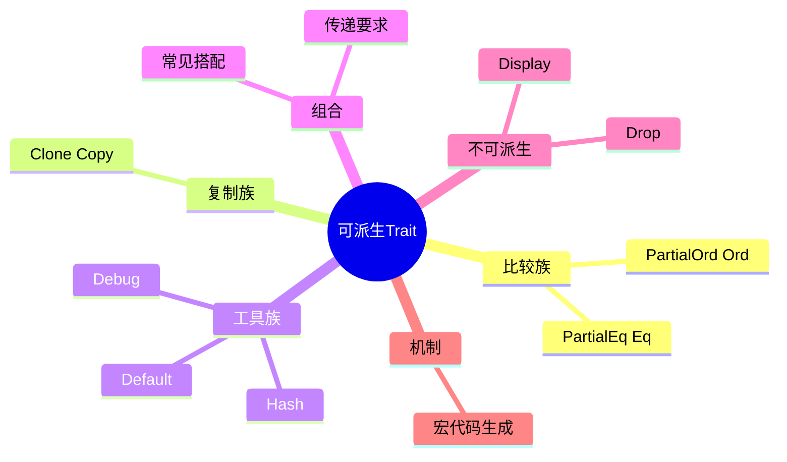

# 可派生 Trait（Derive Traits）

> **内容分级**: [参考级]
> **本节关键术语**: Derive · `Debug` · `PartialEq` · `Eq` · `PartialOrd` · `Ord` · `Clone` · `Copy` · `Hash` · `Default` — [完整对照表](../../00_meta/01_terminology/01_terminology_glossary.md)
>
> **EN**: Derivable Traits
> **Summary**: 标准库中可通过 `#[derive(...)]` 自动实现的 trait 参考：行为、默认实现语义、对字段类型的要求及典型使用场景。
> **Rust 版本**: 1.97.0+ (Edition 2024)
> **受众**: [初学者] / [中级]
> **Bloom 层级**: L2-L3
> **权威来源**: 本文件为 `concept/` 权威页。
> **A/S/P 标记**: **S** — Specification / Language semantics
> **双维定位**: S×Lang — 语言标准库约定
> **前置依赖**: [Traits](../../01_foundation/02_type_system/01_type_system.md) · [Structs and Enums](../../01_foundation/03_values_and_references/01_reference_semantics.md) · [Terminology Glossary](../../00_meta/01_terminology/01_terminology_glossary.md)
> **后置概念**: [Advanced Traits](04_advanced_traits.md) · [Proc Macros](../../03_advanced/03_proc_macros/02_proc_macro.md)
> **定理链**: N/A — 参考级文档
> **主要来源**: [Rust Reference — Derive](https://doc.rust-lang.org/reference/attributes/derive.html) · [TRPL — Appendix C](https://doc.rust-lang.org/book/appendix-03-derivable-traits.html) · [Pierce — Types and Programming Languages](https://www.cis.upenn.edu/~bcpierce/tapl/) · [System F](https://en.wikipedia.org/wiki/System_F) · [Brown University — Concepts in Rust Programming](https://cel.cs.brown.edu/crp/) · [Brown Interactive Rust Book](https://rust-book.cs.brown.edu/) · [Jung et al. — RustBelt: Securing the Foundations of Rust](https://plv.mpi-sws.org/rustbelt/popl18/) · [Itanium C++ ABI](https://itanium-cxx-abi.github.io/cxx-abi/abi.html)

>
> **来源**: [TRPL — Appendix C: Derivable Traits](https://doc.rust-lang.org/book/appendix-03-derivable-traits.html)

---

## 🧠 知识结构图



## 一、`#[derive]` 的作用

`#[derive(TraitName)]` 可以自动为 struct 或 enum 生成 trait 实现。编译器使用默认实现，其行为通常基于字段的逐字段/逐变体推导。(Source: [Rust Reference — Derive](https://doc.rust-lang.org/reference/attributes/derive.html))

```rust
#[derive(Debug, Clone, PartialEq, Eq, Hash)]
struct User {
    id: u64,
    name: String,
}
```

> **注意**：如果默认行为不满足需求，需要手动实现。例如 `Display` 没有合理的默认用户可见格式，因此不能 derive。

---

## 二、标准库可派生 Trait 一览

标准库提供 11 个可 `#[derive]` 的 trait，分为四组记忆：

| 组 | Trait | 语义要点 |
|:---|:---|:---|
| 比较 | `PartialEq`/`Eq`/`PartialOrd`/`Ord` | 派生实现按**字段声明序**字典序比较；`Eq` 是自反性标记（浮点不可派生） |
| 复制 | `Clone`/`Copy` | `Copy` 要求所有字段 `Copy` 且类型不实现 `Drop`；`Clone` 逐字段克隆 |
| 哈希 | `Hash` | 派生版按字段序喂入 hasher——`Eq` 与 `Hash` 必须一致（相等 ⟹ 同哈希），自定义一个就必须同步另一个 |
| 调试与默认 | `Debug`/`Default` | `Debug` 输出结构化表示；`Default` 逐字段取默认值（枚举（Enum）需 `#[default]` 标注变体，1.62+） |

派生的共同机制：编译器为泛型（Generics）参数自动加约束（`#[derive(Clone)] struct S<T>` 生成 `impl<T: Clone> Clone for S<T>`）——注意这是**语法级**约束添加，字段实际不需要 `T: Clone` 时（如 `PhantomData<T>`）会过度约束，需手写 impl。

### `Debug` — 调试输出

- 启用 `{:?}` 格式化。
- 用于 `assert_eq!` 等宏（Macro）在断言失败时打印值。
- 派生实现按字段顺序输出调试表示。

```rust
#[derive(Debug)]
struct Point { x: i32, y: i32 }

let p = Point { x: 1, y: 2 };
println!("{:?}", p); // Point { x: 1, y: 2 }
```

---

### `PartialEq` / `Eq` — 相等性比较

相等性 trait 对是 Rust 类型系统（Type System）「用标记 trait 编码数学性质」的范例：

- **`PartialEq`**：定义 `==`/`!=`——只承诺对称性与传递性，**不承诺自反性**（`x == x` 可能为假，`f64` 的 NaN 是标准例子）；
- **`Eq`**：无方法的标记 trait——`impl Eq` 即声明「我的 `PartialEq` 满足自反性」。它是 `HashMap` 键、`BTreeMap` 语义健全性的前提；
- **派生规则**：`#[derive(PartialEq)]` 逐字段 `==`；`#[derive(Eq)]` 要求所有字段 `Eq`（含浮点字段则编译失败——编译器替你执行数学纪律）；
- **常见陷阱**：类型含 `f64` 字段时派生 `Eq` 被拒——正确做法是 newtype 包装（如 `OrderedFloat`）或承认「此类型不能做 Map 键」。

判定准则：需要作为哈希/B树键 ⟹ 必须 `Eq`；含浮点 ⟹ 用 `partial_cmp`/`total_cmp`（1.62+ 的 `f64::total_cmp` 提供 IEEE 全序，可做 `Ord` 实现依据）。

#### `PartialEq`

- 启用 `==` 和 `!=` 运算符。
- 派生实现：struct 的所有字段都相等时实例相等；enum 的同一变体相等。
- 要求：所有字段实现 `PartialEq`。

```rust
#[derive(PartialEq)]
struct Point { x: i32, y: i32 }

assert!(Point { x: 1, y: 2 } == Point { x: 1, y: 2 });
```

#### `Eq`

- 无方法，仅作为类型契约标记：任意值都等于自身（自反性）。
- 要求类型已实现 `PartialEq`。
- **反例**：`f32`/`f64` 实现 `PartialEq` 但不实现 `Eq`，因为 `NaN != NaN`。
- 用途：`HashMap<K, V>` 的键要求 `K: Eq`。

```rust
#[derive(PartialEq, Eq)]
struct User { id: u64 }
```

---

### `PartialOrd` / `Ord` — 顺序比较

顺序 trait 对与相等性对结构同构，但多一个语义维度：

- **`PartialOrd`**：定义 `<`/`<=`/`>`/`>=` 与 `partial_cmp`——返回 `Option<Ordering>`，`None` 表示「不可比」（NaN 与任何值）；
- **`Ord`**：标记「全序」——要求 `Eq + PartialOrd` 且 `partial_cmp` 永不返回 `None`，提供 `cmp`/`max`/`min`/`clamp`；`BTreeMap` 键、`sort` 的语义前提；
- **派生的字典序**：字段声明序决定比较顺序——「最重要的字段放最前」，顺序错误是静默的逻辑 bug（编译器无法知道你想要的排序语义）；
- **手写与派生混用**：自定义排序需求（如忽略某字段、反向比较）必须手写——注意手写 `Ord` 必须与 `PartialOrd` 一致（文档承诺，违反是逻辑 bug 而非编译错误）。

工程模式：需要多种排序时用「新类型 + 手写 Ord」（如 `struct ByDate(User)`）而非修改原类型语义；浮点排序用 `total_cmp` 包装。

#### `PartialOrd`

- 启用 `<`、`>`、`<=`、`>=` 运算符。
- 派生实现按字段定义顺序比较；enum 按变体定义顺序比较。
- 要求类型实现 `PartialEq`，所有字段实现 `PartialOrd`。
- 可能返回 `None`：例如 `f64::NAN.partial_cmp(&1.0)` 为 `None`。

#### `Ord`

- 保证任意两个值都有有效顺序。
- 要求类型实现 `PartialOrd` 和 `Eq`。
- 用途：`BTreeSet<T>`、`BTreeMap<K, V>` 要求 `T: Ord` / `K: Ord`。

```rust
#[derive(PartialEq, Eq, PartialOrd, Ord)]
struct Version { major: u32, minor: u32, patch: u32 }
```

---

### `Clone` / `Copy` — 复制值

复制 trait 对定义了 Rust 的两种复制语义，是所有权（Ownership）模型的「减压阀」：

- **`Clone`**：显式深复制——`x.clone()` 是程序员可见的操作，可能昂贵（堆分配、递归克隆）；`Clone` 的存在不改变 move 语义（默认仍 move）；
- **`Copy`**：隐式位复制——`Copy` 类型的「move」退化为按位拷贝且源保持有效（`let y = x;` 后 `x` 仍可用）。约束：所有字段 `Copy` + 类型不实现 `Drop`（E0184——位复制 + 析构 = double-free 风险，编译器强制排除）；
- **派生过度约束陷阱**：`#[derive(Clone)] struct S<T>(PhantomData<T>)` 生成的 `impl<T: Clone>` 要求 `T: Clone`，但 `PhantomData<T>` 总是 `Copy`——泛型参数被不必要地约束，容器库常因此手写 impl；
- **设计准则**：小型纯数据类型（`Point`、`IpAddr` 风格）派生 `Copy`；含堆资源的类型只 `Clone`；`Copy` 是承诺「复制即全部语义」——加字段时若新字段不可 `Copy`，原有代码的隐式复制点全部变为 move，是 API 破坏性变更。

#### `Clone`

- 显式创建深拷贝，可能执行任意代码或复制堆数据。
- 派生实现调用每个字段的 `clone`。
- 要求所有字段实现 `Clone`。
- 用途：切片（Slice） `to_vec()` 要求元素实现 `Clone`。

```rust
#[derive(Clone)]
struct Document {
    title: String,
    content: Vec<u8>,
}
```

#### `Copy`

- 通过按位复制栈上的数据来复制值，不执行任意代码。
- 要求所有字段实现 `Copy`，且类型本身实现 `Clone`。
- 通常用于纯标量或简单聚合类型。

```rust
#[derive(Clone, Copy)]
struct Point { x: i32, y: i32 }
```

> **关键区别**：`Copy` 是隐式、廉价的；`Clone` 是显式、可能昂贵的。所有 `Copy` 类型都可以 `Clone`，但反之不成立。(Source: [TRPL — Appendix C](https://doc.rust-lang.org/book/appendix-03-derivable-traits.html))

---

### `Hash` — 哈希映射

- 将任意大小的值映射为固定大小的哈希值。
- 派生实现组合每个字段的 `hash` 结果。
- 要求所有字段实现 `Hash`。
- 用途：`HashMap<K, V>`、`HashSet<T>` 要求键/元素实现 `Hash`（通常还需 `Eq`）。

```rust
#[derive(PartialEq, Eq, Hash)]
struct User { id: u64 }
```

---

### `Default` — 默认值

- 创建类型的默认值。
- 派生实现调用每个字段的 `default()`。
- 要求所有字段实现 `Default`。
- 常与 struct update 语法结合：

```rust
#[derive(Default)]
struct Config {
    debug: bool,
    port: u16,
}

let cfg = Config {
    port: 8080,
    ..Default::default()
};
```

- 用途：`Option::unwrap_or_default()` 在值为 `None` 时返回 `Default::default()`。

---

## 三、派生组合速查表

| Trait | 启用能力 | 字段要求 | 典型容器要求 |
|:---|:---|:---|:---|
| `Debug` | `{:?}` 格式化 | 字段实现 `Debug` | `assert_eq!` 诊断 |
| `PartialEq` | `==` / `!=` | 字段实现 `PartialEq` | `assert_eq!` |
| `Eq` | 自反性契约 | 已实现 `PartialEq` | `HashMap<K, _>` 的 `K` |
| `PartialOrd` | `<` / `>` / `<=` / `>=` | 字段实现 `PartialOrd` + `PartialEq` | `rand::gen_range` |
| `Ord` | 全序比较 | 已实现 `PartialOrd` + `Eq` | `BTreeSet<T>`、 `BTreeMap<K, _>` |
| `Clone` | 显式深拷贝 | 字段实现 `Clone` | `Vec::extend_from_slice`、 `to_vec` |
| `Copy` | 隐式位拷贝 | 字段实现 `Copy` + `Clone` | 赋值/传参无所有权（Ownership）转移 |
| `Hash` | 哈希函数 | 字段实现 `Hash` | `HashMap<K, _>`、 `HashSet<T>` |
| `Default` | 默认值 | 字段实现 `Default` | `unwrap_or_default`、struct update |

---

## 四、常见组合

```rust
#[derive(Debug, Clone, PartialEq, Eq, Hash, Default)]
struct User {
    id: u64,
    name: String,
}
```

> 注意：`Copy` 与包含堆分配字段（如 `String`、`Vec`）的类型**不兼容**。

---

## 五、不能 Derive 的 Trait

- `Display`：用户可见格式没有默认语义。
- `From` / `Into` / `TryFrom` / `TryInto`：类型转换需要具体语义决策。
- `Iterator` / `IntoIterator`：需要自定义迭代逻辑。
- `Drop`：需要自定义析构行为。
- `Send` / `Sync`：由编译器自动推导，无需也不能手动 derive。

---

## 六、相关概念

| 概念 | 关系 |
|:---|:---|
| [Traits](../../01_foundation/02_type_system/01_type_system.md) | derive 是 trait 实现的语法糖 |
| [Advanced Traits](04_advanced_traits.md) | 手动实现 trait 替代默认 derive 行为 |
| [Proc Macros](../../03_advanced/03_proc_macros/02_proc_macro.md) | 第三方 derive 通过过程宏（Procedural Macro）实现 |

---

> **权威来源**: [Rust Reference — Derive](https://doc.rust-lang.org/reference/attributes/derive.html) · [TRPL — Appendix C: Derivable Traits](https://doc.rust-lang.org/book/appendix-03-derivable-traits.html) · [Rust Standard Library](https://doc.rust-lang.org/std/index.html)

---

## 国际权威参考 / International Authority References（P1 学术 · P2 生态）

> 依据 `AGENTS.md` §2「对齐网络国际化权威内容」补充：仅追加已验证可达的权威链接，不改动正文事实。

- **P2 生态/社区**: [docs.rs/enum_dispatch — 生态权威 API 文档](https://docs.rs/enum_dispatch) · [docs.rs/serde — 生态权威 API 文档](https://docs.rs/serde)

---

## 嵌入式测验（Embedded Quiz）

> W3-b 补充（2026-07-12）：本页原无嵌入式测验，按四级题型规范补 3 题（🟢🟡🔴 各 1 题，`<details>` 折叠答案），内容与本页正文严格一致。

### 测验 1：`#[derive]` 的生成机制（🟢 基础）

`#[derive(Debug, Clone, PartialEq)]` 作用于 struct 时，编译器如何生成实现？

- A. 调用运行时（Runtime）反射生成
- B. 使用默认实现，行为基于字段的逐字段/逐变体推导
- C. 复制标准库中同名类型的实现
- D. 生成空实现，待运行时填充

<details>
<summary>✅ 答案</summary>

**B 正确**。按本页「一、`#[derive]` 的作用」(Source: Rust Reference — Derive)：`#[derive(TraitName)]` 自动为 struct 或 enum 生成 trait 实现，编译器使用默认实现，其行为通常基于**字段的逐字段/逐变体推导**。如 `PartialEq` 派生：struct 的所有字段都相等时实例相等，enum 的同一变体相等。

</details>

---

### 测验 2：`Eq` 与浮点的边界（🟡 进阶）

为什么 `f32`/`f64` 实现 `PartialEq` 但不实现 `Eq`？

- A. 浮点比较太慢，标准库刻意省略
- B. `Eq` 要求自反性（任意值都等于自身），而 `NaN != NaN` 违反自反性
- C. 浮点类型不允许派生任何 trait
- D. `Eq` 已被弃用

<details>
<summary>✅ 答案</summary>

**B 正确**。按本页「`PartialEq` / `Eq` — 相等性比较」：`Eq` 无方法，仅作为类型契约标记——**任意值都等于自身（自反性）**，且要求类型已实现 `PartialEq`。反例：`f32`/`f64` 实现 `PartialEq` 但不实现 `Eq`，因为 `NaN != NaN`。用途：`HashMap<K, V>` 的键要求 `K: Eq`。

</details>

---

### 测验 3：不可派生的 Trait（🔴 专家）

为什么 `Display` 不能通过 `#[derive]` 自动实现？

- A. `Display` 是 unsafe trait
- B. `Display` 没有合理的默认用户可见格式，默认行为不满足需求时需手动实现
- C. `Display` 已被 `Debug` 取代
- D. 编译器尚不支持派生带格式参数的 trait

<details>
<summary>✅ 答案</summary>

**B 正确**。按本页「一、`#[derive]` 的作用」注意项与知识结构图「不可派生：Display、Drop」：如果默认行为不满足需求，需要手动实现——例如 `Display` **没有合理的默认用户可见格式**，因此不能 derive。对比：`Debug` 有面向开发者的合理默认（按字段顺序输出调试表示），故可派生。

</details>

## 📋 关键属性

| 属性 | 取值 / 判定 | 依据 |
|---|---|---|
| 机制 | `#[derive]` 在编译期按字段递归生成 impl | 内置宏（Macro） |
| 覆盖范围 | `Debug`/`Clone`/`Copy`/`PartialEq`/`Eq`/`PartialOrd`/`Ord`/`Hash`/`Default` 等 | std |
| 条件 | 所有字段均实现目标 trait 才可派生 | 生成规则 |
| 不可派生 | `Display` 等需手写或第三方宏 crate | 生态惯例 |
| 组合 | 多个 derive 可叠加于同一类型 | 文法 |

## 🔗 概念关系

- **上位（is-a）**：[Traits](01_traits.md) trait impl 的自动生成入口。
- **下位（实例）**：自定义 derive 需 [Proc Macros](../../03_advanced/03_proc_macros/02_proc_macro.md)。
- **对偶**：与手写 impl 相对，见 [Implementations](../../01_foundation/07_modules_and_items/06_implementations.md)。
- **组合**：与 [Structs](../../01_foundation/07_modules_and_items/04_structs.md) / [Enumerations](../../01_foundation/07_modules_and_items/05_enumerations.md) 组合。
- **依赖**：展开卫生见 [Macro Hygiene](../../03_advanced/03_proc_macros/09_macro_hygiene.md)。

---

## ⚠️ 反例与陷阱：derive 要求所有字段已实现对应 trait

**反例**（rustc 1.97 实测编译失败：E0277）：

```rust,compile_fail
#[derive(Debug)]
struct Wrapper { inner: NoDebug }
struct NoDebug;
fn main() { println!("{:?}", Wrapper { inner: NoDebug }); }
```

`#[derive(Debug)]` 生成逐字段 `Debug` 调用，任一字段未实现 `Debug` 即 E0277；derive 不是「无条件可用」的标注。

**修正**：

```rust
#[derive(Debug)]
struct Wrapper { inner: NoDebug }
#[derive(Debug)]
struct NoDebug;
fn main() { println!("{:?}", Wrapper { inner: NoDebug }); }
```
