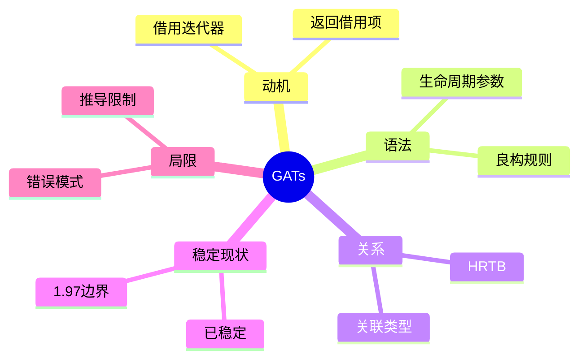
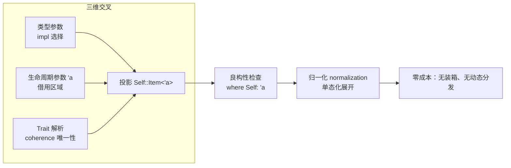
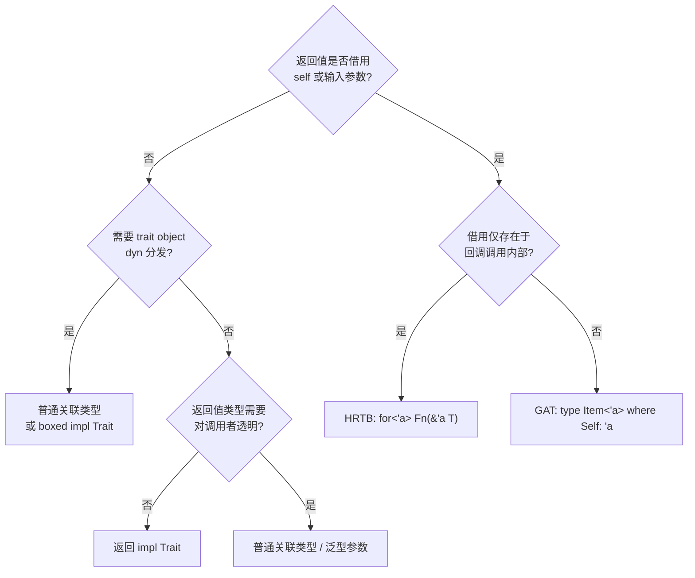

> **内容分级**: [综述级]
> **本节关键术语**: 泛型（Generics）关联类型 (Generic Associated Types, GATs) · 出借迭代器 (Lending Iterator) · 高阶 Trait 约束 (Higher-Ranked Trait Bound, HRTB) · 类型族 (Type Family) · 隐含约束 (Implied Bounds) — [完整对照表](../../00_meta/01_terminology/01_terminology_glossary.md)

# 泛型关联类型（Generic Associated Types, GATs）

> **EN**: Generic Associated Types (GATs)
> **Summary**: GATs let associated types carry their own generic parameters—most importantly lifetimes—enabling lending iterators, streaming parsers, and self-referential accessors on stable Rust since 1.65.
>
> **受众**: [进阶]
> **Bloom 层级**: L2-L4
> **权威来源**: 本文件为 `concept/` 权威页。`01_traits.md` §5.6、`04_advanced_traits.md` §1.2 与 `02_generics.md` §9.5/§11.5 中的 GAT 讨论均为摘要，以本页为准。
> **A/S/P 标记**: **S** — Structure
> **双维定位**: C×Ana — 分析类型参数 × Trait 解析 × 生命周期（Lifetimes）三维交叉的约束系统
> **定位**: 深入分析 Rust 1.65 稳定化的 **泛型关联类型（GATs）**——从 `LendingIterator` 动机、语法规则、与 HRTB 的表达力边界，到稳定化历程与 1.97 的已知限制，给出可操作的选型判定表。
> **前置概念**: [Traits](01_traits.md) · [Generics](../01_generics/01_generics.md) · [Lifetimes](../../01_foundation/01_ownership_borrow_lifetime/04_lifetimes_advanced.md)
> **后置概念**: [Async Cancellation Safety](../../03_advanced/01_async/05_async_cancellation_safety.md) · [Type Inference](../../04_formal/00_type_theory/03_type_inference.md)

---

> **Rust 版本**: 1.97.0+ (Edition 2024)
> **来源**: [RFC 1598 — Generic Associated Types](https://rust-lang.github.io/rfcs/1598-generic_associated_types.html) · [Rust Reference — Associated Items](https://doc.rust-lang.org/reference/items/associated-items.html#associated-types) · [Rust 1.65 Release Notes](https://blog.rust-lang.org/2022/11/03/Rust-1.65.0.html) · [Niko Matsakis — GATs stabilization push](https://smallcultfollowing.com/babysteps/blog/2022/06/27/many-modes-a-gats-pattern/) · [RFC 2289 — Associated Type Bounds](https://rust-lang.github.io/rfcs/2289-associated-type-bounds.html)
> **对应 Crate**: [`c04_generic`](../../crates/c04_generic)
> **对应练习**: [`exercises/src/generics/`](../../exercises/src/generics)

## 🧠 知识结构图



## 📑 目录

- [泛型关联类型（Generic Associated Types, GATs）](#泛型关联类型generic-associated-types-gats)
  - [🧠 知识结构图](#-知识结构图)
  - [📑 目录](#-目录)
  - [一、动机：`LendingIterator` 问题](#一动机lendingiterator-问题)
  - [二、语法与良构规则](#二语法与良构规则)
    - [2.1 完整语法](#21-完整语法)
    - [2.2 `where Self: 'a` 是**必需**的（required where clause）](#22-where-self-a-是必需的required-where-clause)
    - [2.3 实现侧规则](#23-实现侧规则)
  - [三、与 HRTB（`for<'a>`）的关系与边界](#三与-hrtbfora的关系与边界)
    - [3.1 GAT 替代 HRTB 的判定场景](#31-gat-替代-hrtb-的判定场景)
    - [3.2 与 `async fn` 的关系：GAT 是 async trait 的底层机制](#32-与-async-fn-的关系gat-是-async-trait-的底层机制)
  - [四、稳定化历程与 1.97 现状](#四稳定化历程与-197-现状)
  - [五、形式化：类型 × Trait × 生命周期三维交叉](#五形式化类型--trait--生命周期三维交叉)
    - [5.1 类型族视角](#51-类型族视角)
    - [5.2 良构性（Well-formedness）规则](#52-良构性well-formedness规则)
    - [5.3 为什么不是完整 HKT](#53-为什么不是完整-hkt)
  - [六、选型判定表：GAT vs 关联类型 vs HRTB vs `impl Trait`](#六选型判定表gat-vs-关联类型-vs-hrtb-vs-impl-trait)
  - [七、实质代码示例](#七实质代码示例)
    - [7.1 示例一：Lending Iterator —— 可变滑动窗口](#71-示例一lending-iterator--可变滑动窗口)
    - [7.2 示例二：流式解析器 —— 零拷贝 token 流](#72-示例二流式解析器--零拷贝-token-流)
    - [7.3 示例三：自引用借用 —— 数据库游标式访问](#73-示例三自引用借用--数据库游标式访问)
  - [八、已知局限与编译器错误模式](#八已知局限与编译器错误模式)
    - [8.1 高频错误模式对照](#81-高频错误模式对照)
    - [8.2 implied bounds 限制（1.97 仍在）](#82-implied-bounds-限制197-仍在)
    - [8.3 非对象安全与 async trait 的联动后果](#83-非对象安全与-async-trait-的联动后果)
    - [8.4 不应对 GAT 做的事](#84-不应对-gat-做的事)
  - [📋 关键属性](#-关键属性)
  - [🔗 概念关系](#-概念关系)
  - [九、来源](#九来源)
  - [嵌入式测验（Embedded Quiz）](#嵌入式测验embedded-quiz)
    - [测验 1：GAT 的本质（🟢 基础）](#测验-1gat-的本质-基础)
    - [测验 2：`where Self: 'a` 的必要性（🟡 进阶）](#测验-2where-self-a-的必要性-进阶)
    - [测验 3：LendingIterator 动机（🔴 专家）](#测验-3lendingiterator-动机-专家)

---

## 一、动机：`LendingIterator` 问题

标准库 `Iterator` 的关联类型 `Item` 是一个**不带参数的类型**：

```rust
pub trait Iterator {
    type Item;
    fn next(&mut self) -> Option<Self::Item>;
}
```

这隐含一条铁律：`next` 返回的值**不能借用自 `self`**。因为 `fn next(&mut self)` 中 `self` 的借用生命周期只存在于方法体内，而返回类型 `Self::Item` 在签名层面没有位置去"提及"这个生命周期。

于是下面的"滑动窗口迭代器（Iterator）"无法用普通 `Iterator` 表达：

```rust
// ❌ 无法编译：Item 需要借用 self，但 type Item 无法携带生命周期
struct WindowsMut<'t, T> {
    slice: &'t mut [T],
    size: usize,
}

// 期望每次 next 返回 &'a mut [T]，其中 'a 是本次调用对 self 的借用。
// 若返回 &'t mut [T]（原始切片的生命周期），两次调用会同时存活两个
// 重叠的可变借用——违反别名规则。所以返回值必须绑定到“本次借用的 'a”。
```

在 GATs 之前，工程上有三条出路，每条都有实质代价：

| 方案 | 做法 | 代价 |
|---|---|---|
| **所有权（Ownership）化** | `next` 返回 `Vec<T>` / `String` 等拥有所有权的值 | 每次迭代一次堆分配，零成本抽象（Zero-cost Abstraction）破灭 |
| **裸指针 + `unsafe`** | 返回 `'static` 化的引用或裸指针，人工保证不重叠 | 内存安全（Memory Safety）依赖人工审查，违背 Rust 核心承诺 |
| **回调倒置（`for_each` 风格）** | 用 `fn with_item<R>(&mut self, f: impl FnMut(&mut T) -> R)` | 控制流反转，无法使用 `for` 循环、`zip`、提前 `break` |

GATs 给出的答案是让关联类型自己携带生命周期参数：

```rust
trait LendingIterator {
    type Item<'a> where Self: 'a;
    fn next<'a>(&'a mut self) -> Option<Self::Item<'a>>;
}
```

`Self::Item<'a>` 读作"在 `Self` 至少活到 `'a` 的前提下，由实现者给出的、参数为 `'a` 的类型"。返回值的生命周期与**本次调用**的借用绑定，下一次 `next` 调用前上一个 `Item<'a>` 必须已被丢弃——编译器通过借用检查（Borrow Checking）自动强制这一点，无需 `unsafe`。

> **关键直觉**：普通关联类型是"每个实现者对应一个类型"；GAT 是"每个实现者对应一个**类型构造器（type constructor）**"——`Item` 不再是类型，而是"给定生命周期后产出类型"的函数。

---

## 二、语法与良构规则

GAT（Generic Associated Types，1.65 稳定）允许关联类型携带泛型参数——`type Item<'a>;` 即「类型族」：每个生命周期/类型参数值对应一个具体类型。三条良构规则：

1. **完整语法（2.1）**：`trait LendingIterator { type Item<'a> where Self: 'a; fn next<'a>(&'a mut self) -> Option<Self::Item<'a>>; }`——参数列表与 where 子句是必需部分；
2. **`where Self: 'a` 的必需性（2.2）**：编译器要求「关联类型的参数化版本在 Self 存活时才有意义」——这条 required where clause 是 GAT 健全性的核心，省略即编译错误；
3. **实现侧规则（2.3）**：impl 必须为**所有**参数值提供类型（`type Item<'a> = &'a mut [T];`），不能只对部分生命周期实现——这与 trait 方法的全量化语义一致。

良构规则的直觉：GAT 是「以参数索引的类型函数」，规则保证这个函数在定义域内处处有定义。

### 2.1 完整语法

```rust
trait Streaming {
    // 生命周期参数：最常用
    type Item<'a> where Self: 'a;

    // 类型参数：合法
    type Wrap<T>: Clone;

    // 常量参数：合法（受 const generics 规则约束）
    type Fixed<const N: usize>;

    // 混合参数与多个 where 子句
    type Row<'a, K> where Self: 'a, K: Ord;
}
```

### 2.2 `where Self: 'a` 是**必需**的（required where clause）

稳定版 GAT 有一条反直觉的硬规则：**只要 GAT 的生命周期参数可能出现在隐含约束不成立的位置，就必须显式写出 where 子句**。对生命周期参数，规则表现为"几乎所有借用自 `self` 的 GAT 都需要 `where Self: 'a`"。

```rust,compile_fail
// Bad：缺少 `where Self: 'a` 约束，编译报错（missing required bound on `Item`）
trait Bad {
    type Item<'a>;            // ❌ E0309 风格错误：missing required bound on `Item`
    fn get(&self) -> Self::Item<'_>;
}

trait Good {
    type Item<'a> where Self: 'a;  // ✅
    fn get(&self) -> Self::Item<'_>;
}
```

原因：编译器在检查 `fn get(&self) -> Self::Item<'_>` 时，需要知道 `Self` 活到 `'_` 时 `Item<'_>` 才是良构类型（well-formed）。`where Self: 'a` 把这个良构条件**显式化**，使每次使用 `Self::Item<'x>` 时编译器只需验证 `Self: 'x` 这一个局部条件，而不必反向推导实现体内部结构。这是稳定化时为"可判定性（decidability）"做出的刻意保守选择（见 §五）。

> **常见错误信息**：
> `error: missing required bound on`Item`` / `required by this bound in ...` —— 几乎总是补上 `where Self: 'a`（类型参数场景则补 `where T: ...`）。

### 2.3 实现侧规则

实现 GAT 时，`where` 子句**不需要重复**（从 trait 继承），但实现给出的类型必须对所有满足约束的 `'a` 成立：

```rust
trait LendingIterator {
    type Item<'a>
    where
        Self: 'a;
    fn next<'a>(&'a mut self) -> Option<Self::Item<'a>>;
}

struct ByteWindows<'t> {
    buf: &'t [u8],
    size: usize,
}

impl<'t> LendingIterator for ByteWindows<'t> {
    // 实现侧给出“类型构造器”的具体定义
    type Item<'a> = &'a [u8] where Self: 'a;

    fn next<'a>(&'a mut self) -> Option<Self::Item<'a>> {
        if self.buf.len() < self.size {
            return None;
        }
        let (head, tail) = self.buf.split_at(self.size);
        self.buf = tail;
        Some(head)
    }
}
```

注意实现中 `self.buf = tail` 的重赋值是合法的：`tail` 借用自 `'t`（原始切片（Slice）），而非 `'a`，因此它的存活期不阻塞下一次 `next` 调用。这正是借用检查器对 GAT 迭代器"每次借用独立"的精确表达。

---

## 三、与 HRTB（`for<'a>`）的关系与边界

GATs 与 HRTB 都涉及"对所有生命周期量化"，但量化的**位置**不同：

| | HRTB `for<'a>` | GAT `type Item<'a>` |
|---|---|---|
| 量化对象 | **Trait 约束**：`for<'a> F: Fn(&'a T) -> R` | **类型构造器**：`Self::Item<'a>` |
| 出现位置 | `where` 子句、函数签名 | Trait 定义体内 |
| 返回值能否依赖 `'a` | ❌ 不能（`R` 中无法提及 `'a`） | ✅ 可以（`Item<'a> = &'a T`） |
| 典型用途 | 回调、泛型函数参数 | 出借迭代器、流式 API、异步（Async） trait |

### 3.1 GAT 替代 HRTB 的判定场景

**场景 A：返回值需要借用输入** —— HRTB 无能为力，必须 GAT。

```rust
// ❌ HRTB 做不到：想让闭包返回 &'a str（借用输入的 'a），
// 但 R 无法提及 for<'a> 量化的 'a
fn bad_map<F, R>(f: F) where F: for<'a> Fn(&'a str) -> R { /* R 与 'a 无关 */ }

// ✅ 用 GAT trait 表达“输出借用输入”
trait RefMap {
    type Out<'a>;
    fn call<'a>(&self, input: &'a str) -> Self::Out<'a>;
}
```

**场景 B：回调只是消费引用、返回无关值** —— HRTB 更简单，不要用 GAT。

```rust
// ✅ HRTB 天然合适：返回 () 与生命周期无关
fn for_each_line<F>(f: F) where F: for<'a> FnMut(&'a str) { /* ... */ }
```

**场景 C：闭包（Closures） + HRTB 的推断死角** —— `for<'a> Fn(&'a T) -> &'a U` 这类签名中，闭包体推断经常失败（late-bound vs early-bound 生命周期问题）；若该 trait 是你自己定义的，改用 GAT 可绕开闭包推断问题，代价是失去自动的闭包实现，需要写具名结构体（Struct）。

> **经验法则**：**"借用出不去"用 HRTB，"借用要回家"用 GAT**。即：借用只在调用内部存在 → HRTB；借用要作为返回值交还给调用者 → GAT。

### 3.2 与 `async fn` 的关系：GAT 是 async trait 的底层机制

`async fn` in trait（Rust 1.75 稳定）在脱糖（desugaring）后正是 GAT：

```rust,ignore
// async fn in trait 与其 GAT 脱糖形式的等价示意（两个 Service 不能共存）
trait Service {
    async fn handle(&self, req: Request) -> Response;
}

// 等价于（概念脱糖）：
trait Service {
    type HandleFut<'a>: Future<Output = Response> where Self: 'a;
    fn handle<'a>(&'a self, req: Request) -> Self::HandleFut<'a>;
}
```

理解 GAT 就理解了 async trait 为什么不能直接做 trait object（`dyn Service`），以及为什么生态里 `async_trait` 宏（Macro）要改返回 `Pin<Box<dyn Future>>`——boxed future 擦掉了 `Item<'a>` 中的生命周期参数，把 GAT 退化回普通关联类型。

---

## 四、稳定化历程与 1.97 现状

| 时间 | 版本/事件 | 内容 |
|---|---|---|
| 2016-04 | RFC 1598 提出 | 以"associated type constructors"名义提出，定位为 HKT 的受限替代 |
| 2021 | 每日构建版 MVP 实现 | `generic_associated_types` feature 可用，但 implied bounds 等存在大量 ICE |
| 2022-11 | **Rust 1.65 稳定（MVP）** | 生命周期/类型/常量参数的 GAT 稳定；强制 `where` 子句规则；关联类型上的**约束（bounds）**仍受限 |
| 2023-06 | Rust 1.70 | 若干 GAT 相关的 trait solver 修复 |
| 2024-06 | Rust 1.79 | associated type bounds（`T: Iterator<Item: Display>`，RFC 2289）稳定——可与 GAT 组合 |
| 2024-2025 | 1.8x 系列 | `-Znext-solver` 持续推进，修复 GAT 归一化（normalization）长尾问题 |
| 1.97（当前） | stable | MVP 语义不变；下列限制仍在（见 §八） |

**1.97 中 GAT 的能力边界（精确表述）**：

1. ✅ 生命周期、类型、常量参数均可用于 GAT；
2. ✅ `where Self: 'a` 等必需 where 子句规则稳定；
3. ✅ 可与 associated type bounds 组合：`I: LendingIterator<Item<'_>: Debug>` 形式可用；
4. ⚠️ **implied bounds 限制**：`type Item<'a>: Trait<'a>` 形式的约束在使用点不总是自动可用，常需在使用处重复约束（见 §八）；
5. ⚠️ trait object：含 GAT 的 trait **不是 dyn-compatible（非对象安全）**；
6. ⚠️ GAT 上的 HRTB 组合（如 `for<'b> Self::Item<'a>: Trait<'b>`）部分场景仍触发求解器限制。

---

## 五、形式化：类型 × Trait × 生命周期三维交叉

本节聚焦「形式化：类型 × Trait × 生命周期三维交叉」，覆盖类型族视角、良构性（Well-formedness）规则与为什么不是完整 HKT。论述顺序由定义到边界：先明确「形式化：类型 × Trait × 生命周期三维交叉」在「泛型关联类型（Generic Associated Types, GATs）」中的确切含义与适用范围，再给出可核验的例证或数据，最后标注它与相邻主题的分界线。读完后应能用一句话复述「形式化：类型 × Trait × 生命周期三维交叉」的判定标准，并指出它在全页论证链中的位置。

### 5.1 类型族视角

在 System Fω 的片段中，普通关联类型 `<T as Trait>::Item` 是类型层面的函数应用：给定具体实现者 `T`，投影出唯一类型。GAT 把这个投影提升为**类型族（type family）**：

```
Item : impl → lifetime → type       -- 语法种类：* → * （以生命周期为索引）
Item(T, 'a) = <T as Trait>::Item<'a>
```

第三维是 **Trait 解析（trait resolution）**：`Item<'a>` 的含义只有在 trait solver 选定唯一 impl 后才确定。三个维度的交叉产生良构性问题：在尚未解析 impl 时，编译器凭什么相信 `Self::Item<'a>` 是合法类型？答案就是 §2.2 的 required where clause——它把良构条件从"检查所有可能 impl"（不可判定）降为"检查一条显式约束"（局部可判定）。

### 5.2 良构性（Well-formedness）规则

对 `trait Tr { type G<'a> where W(Self, 'a); }`，编译器维护两条规则：

1. **声明侧**：实现 `impl Tr for T { type G<'a> = U; }` 时，必须证明 `W(T, 'a) ⊢ U well-formed`；
2. **使用侧**：任何位置出现 `<X as Tr>::G<'b>` 时，必须证明 `W(X, 'b)`（即 `X: 'b` 等）成立，否则报 E0309/E0477 类错误。

### 5.3 为什么不是完整 HKT

RFC 1598 明确排除了：高阶 trait（`trait Foo<F<_>>`）、类型算子作为一等公民、`impl Trait for SomeConstructor` 形式的实现。GAT 的类型构造器永远绑定在某个具名 trait 的具名关联类型上——这是**去函数化（defunctionalization）**：类型层面的"函数"没有独立的语法实体，只能作为 trait 成员存在，从而保证：

- 每个类型构造器有唯一解析点（配合 coherence 规则可判定）；
- 归一化（normalization）不会引入无界递归之外的歧义；
- 单态化（monomorphization）成本可控，保持零成本抽象（Zero-Cost Abstraction）。



---

## 六、选型判定表：GAT vs 关联类型 vs HRTB vs `impl Trait`

| 需求 | 首选 | 理由 |
|---|---|---|
| 每个实现一个固定类型，不借用 self | 普通关联类型 `type Item;` | 最简单，`Iterator` 模式 |
| 返回 `impl Trait` 且类型与生命周期无关 | `-> impl Iterator<...>` | 隐藏实现，零成本 |
| 回调消费借用、返回值与借用无关 | HRTB `for<'a> Fn(&'a T)` | 闭包（Closures）自动实现，推断最顺 |
| **返回值借用 self / 输入** | **GAT** | 唯一在 stable 上类型安全的表达 |
| 流式/分块访问内部缓冲 | GAT（`type Chunk<'a> where Self: 'a`） | 零拷贝 |
| 需要 trait object 动态分发 | 放弃 GAT：box 返回值或所有权化 | GAT 非对象安全 |
| async trait 方法 | 原生 `async fn`（1.75+，底层即 GAT） | 无需手写 GAT |



---

## 七、实质代码示例

本节聚焦「实质代码示例」，覆盖示例一：Lending Iterator —— 可变滑动窗口、示例二：流式解析器 —— 零拷贝 token 流与示例三：自引用借用 —— 数据库游标式访问。论述顺序由定义到边界：先明确「实质代码示例」在「泛型关联类型（Generic Associated Types, GATs）」中的确切含义与适用范围，再给出可核验的例证或数据，最后标注它与相邻主题的分界线。读完后应能用一句话复述「实质代码示例」的判定标准，并指出它在全页论证链中的位置。

### 7.1 示例一：Lending Iterator —— 可变滑动窗口

```rust
/// 出借迭代器 trait：每次 next 返回借用 self 的元素。
pub trait LendingIterator {
    type Item<'a> where Self: 'a;
    fn next<'a>(&'a mut self) -> Option<Self::Item<'a>>;
}

/// 对切片产出互不重叠的可变窗口——普通 Iterator 无法安全表达。
pub struct WindowsMut<'t, T> {
    slice: &'t mut [T],
    size: usize,
}

impl<'t, T> LendingIterator for WindowsMut<'t, T> {
    type Item<'a> = &'a mut [T] where Self: 'a;

    fn next<'a>(&'a mut self) -> Option<Self::Item<'a>> {
        if self.slice.len() < self.size {
            return None;
        }
        // take + split_at_mut：把 &'a mut [T] 从 self 中“切下来”
        let slice = std::mem::take(&mut self.slice);
        let (head, tail) = slice.split_at_mut(self.size);
        self.slice = tail;
        Some(head)
    }
}

fn demo_windows_mut() {
    let mut data = [1, 2, 3, 4, 5, 6];
    let mut it = WindowsMut { slice: &mut data, size: 2 };
    while let Some(window) = it.next() {
        window[0] *= 10; // 可变借用，零拷贝
    }
    assert_eq!(data, [10, 20, 30, 40, 50, 60]);
}
```

**为什么安全**：每个 `window: &'a mut [T]` 的生命周期绑定到本次 `it.next()` 的借用；`window` 存活期间 `it` 被独占借用，循环下一次迭代前 `window` 必然已释放，因此不存在两个重叠的可变窗口。`std::mem::take` 把 `self.slice` 临时换成空切片，使 `split_at_mut` 产出的 `'a` 借用与原 `'t` 解耦。

### 7.2 示例二：流式解析器 —— 零拷贝 token 流

解析器维护内部缓冲区，每次产出借用缓冲区的 token；缓冲区在下一次 `advance` 时被复用，全程零分配。

```rust
pub trait StreamingParser {
    /// 产出的 token 借用解析器内部缓冲区
    type Token<'a> where Self: 'a;
    fn advance<'a>(&'a mut self) -> Option<Self::Token<'a>>;
}

pub struct LineScanner {
    buf: String,
    cursor: usize,
}

impl LineScanner {
    pub fn new(input: String) -> Self {
        Self { buf: input, cursor: 0 }
    }
}

impl StreamingParser for LineScanner {
    type Token<'a> = &'a str where Self: 'a;

    fn advance<'a>(&'a mut self) -> Option<Self::Token<'a>> {
        if self.cursor >= self.buf.len() {
            return None;
        }
        let rest = &self.buf[self.cursor..];
        let end = rest.find('\n').map(|i| self.cursor + i).unwrap_or(self.buf.len());
        let line = &self.buf[self.cursor..end];
        self.cursor = end + 1; // 跳过 '\n'；越界由下一次调用时的 len 检查拦截
        Some(line)
    }
}

fn demo_streaming() {
    let mut p = LineScanner::new("GET / HTTP/1.1\nHost: a.b\n".to_string());
    let mut count = 0;
    while let Some(line) = p.advance() {
        assert!(!line.is_empty());
        count += 1;
    }
    assert_eq!(count, 2);
}
```

**GAT 在此的价值**：`Token<'a> = &'a str` 明确表达"token 是缓冲区的视图"。若用普通关联类型，只能返回 `String`（每次拷贝一行）或退化为 `unsafe`。注意 `cursor` 的更新发生在借用 `line` 构造**之前**的顺序安排上：更新通过 `self.cursor`（`usize`，Copy）完成，不与 `&self.buf` 的不可变借用（Mutable Borrow）冲突——因为借用的是 `buf` 字段而修改的是 `cursor` 字段，字段级借用分离（disjoint field borrow）使这段代码通过检查。

### 7.3 示例三：自引用借用 —— 数据库游标式访问

模拟一个"持有连接、逐行借出"的存储游标：每行数据在游标内部解码缓冲中，调用者拿到的是借用视图。

```rust
pub trait Cursor {
    /// 当前行：借用游标内部解码缓冲
    type Row<'a> where Self: 'a;
    fn fetch_next<'a>(&'a mut self) -> Option<Self::Row<'a>>;
}

pub struct FakeDb {
    rows: Vec<Vec<u8>>,       // 原始数据
    decode_buf: Vec<String>,  // 复用的解码缓冲，避免每行分配
}

impl Cursor for FakeDb {
    type Row<'a> = &'a [String] where Self: 'a;

    fn fetch_next<'a>(&'a mut self) -> Option<Self::Row<'a>> {
        let raw = self.rows.pop()?;
        self.decode_buf.clear();
        // 解码进复用缓冲（演示：按字节切词）
        for word in raw.split(|b| *b == b' ') {
            self.decode_buf.push(String::from_utf8_lossy(word).into_owned());
        }
        Some(&self.decode_buf)
    }
}

fn demo_cursor() {
    let mut db = FakeDb {
        rows: vec![b"alice 30 sh".to_vec(), b"bob 25 bj".to_vec()],
        decode_buf: Vec::new(),
    };
    let mut seen = 0;
    while let Some(row) = db.fetch_next() {
        assert_eq!(row.len(), 3);
        seen += 1;
    }
    assert_eq!(seen, 2);
}
```

**设计要点**：`decode_buf` 复用意味着上一行的 `Row<'a>` 与下一次 `fetch_next` 的 `&mut self` 借用冲突——编译器强制调用者先放下旧行再取新行，这正是"自引用借用"模式想要的语义：缓冲复用由类型系统（Type System）保证无悬垂引用，无需运行时（Runtime）代价。

---

## 八、已知局限与编译器错误模式

GAT 的当前局限（1.97 仍在）与高频错误模式：

- **高频错误对照（8.1）**：缺 `where Self: 'a`（E0582 类）、impl 侧参数名不匹配、借用检查在 GAT 方法体中的过度保守（返回 `Self::Item<'a>` 时的生命周期连通性）；
- **implied bounds 限制（8.2）**：`type Item<'a>: Trait;` 形式的关联类型边界在使用处不自动隐含（需重复声明 `where T::Item<'a>: Trait`）——trait 求解的已知缺陷，新求解器（next-solver）逐步修复；
- **非对象安全（8.3）**：GAT 使 trait 不可 `dyn` 化——`Box<dyn LendingIterator>` 非法，需要动态分发时必须手写类型擦除包装（`Box<dyn FnMut() -> ...>` 模式）；
- **不应对 GAT 做的事（8.4）**：用 GAT 模拟完整 HKT（`type Wrap<T>` 无 where 约束的版本仍受限）、在不需要「借用 self 的返回类型」时用 GAT（普通关联类型更简单）。

判定准则：GAT 只解决一个问题——「返回类型需要借用 self」；其他需求用普通关联类型。

### 8.1 高频错误模式对照

| 错误 | 典型信息 | 根因 | 修正 |
|---|---|---|---|
| 缺 required bound | `missing required bound on`Item`` | GAT 生命周期参数未声明良构条件 | 补 `where Self: 'a` |
| E0107 | `struct takes 0 generic arguments but 1 was supplied` | 把 GAT 当泛型类型用：`Item<'a>` 写在非投影位置 | 用全投影形式 `<T as Tr>::Item<'a>` |
| E0309 / E0477 | `the parameter type ... may not live long enough` | 使用点未证明 `Self: 'a` | 在签名加 `T: 'a` 约束 |
| 闭包推断失败 | `implementation of FnOnce is not general enough` | 用闭包实现 GAT-like 签名时 late-bound 推断死角 | 写具名 struct + 显式 impl |
| 对象安全 | `the trait ... cannot be made into an object` | GAT 带泛型参数，`dyn` 无法实例化 | box 返回值 / 枚举（Enum）分发 / 所有权化 |

### 8.2 implied bounds 限制（1.97 仍在）

```rust
trait Producer {
    type Item<'a>: Iterator where Self: 'a;  // 声明侧约束
}

// ⚠️ 在泛型函数中，编译器不总能“隐含” <T as Producer>::Item<'a>: Iterator，
// 有时需在使用处显式重复约束：
fn use_it<T: Producer>(t: &mut T)
where
    for<'a> <T as Producer>::Item<'a>: Iterator,  // 可能必须显式写出
{
    let _ = t;
}
```

这是已知的 trait solver 限制（跟踪于 rust-lang/rust #87479 等 issue），`-Znext-solver` 目标之一就是消除此类手工重复。工程对策：在公共 trait 文档中注明"使用方需重复约束"，或把约束下沉到方法签名。

### 8.3 非对象安全与 async trait 的联动后果

```rust
trait Stream {
    type Chunk<'a> where Self: 'a;
    fn poll_chunk(&mut self) -> Option<Self::Chunk<'_>>;
}

// ❌ let s: Box<dyn Stream> = ...;  —— 带 GAT 的 trait 不可 object
```

绕过路径：(1) 返回 `Box<[u8]>` 等所有权类型使 `Chunk` 不再带参数；(2) 用 `enum` 做手工分发；(3) 仿照 `async_trait` 宏（Macro），把借用返回值装箱并擦除生命周期（引入堆分配，打破零成本）。

### 8.4 不应对 GAT 做的事

- 不要为"未来可能需要"而预先 GAT 化：GAT 增加 API 复杂度与文档成本，确认借用确实要越过调用边界再引入；
- 不要在 GAT 上堆叠多层 HRTB 约束来模拟完整 HKT——超出求解器能力的代码会以难解的错误信息失败，而非优雅降级；
- 库作者注意：给已发布 trait 的关联类型**增加**泛型参数是破坏性变更（breaking change）。

---

## 📋 关键属性

| 属性 | 取值 / 判定 | 依据 |
|---|---|---|
| 语法形态 | `type Item<'a> where Self: 'a;` — 关联类型携带泛型参数 | 本文 §2.1 |
| 必需约束 | 生命周期参数 GAT 必须写 `where Self: 'a`（required bound） | 本文 §2.2 |
| 稳定状态 | Rust 1.65 稳定；1.97 仍有 implied bounds 限制 | 本文 §四、§8.2 |
| 表达力 | 超出 HRTB：可按输入生命周期参数化输出类型 | 本文 §三 |
| 对象安全 | 含 GAT 的 trait 非对象安全，不能构造 `dyn Trait` | 本文 §8.3 |

## 🔗 概念关系

- **上位（is-a）**：[Traits](01_traits.md) 中关联类型的泛型化扩展。
- **下位（实例）**：`LendingIterator`、流式解析器、数据库游标式自引用借用（本文 §七）。
- **对偶**：GAT ⇄ HRTB（`for<'a>`）⇄ `impl Trait` 的选型判定（本文 §六）。
- **组合**：与 [生命周期进阶](../../01_foundation/01_ownership_borrow_lifetime/04_lifetimes_advanced.md)、[Async Trait 对象安全](../../03_advanced/01_async/13_async_trait_object_safety.md) 组合。
- **依赖**：依赖 [泛型](../01_generics/01_generics.md) 与 [生命周期基础](../../01_foundation/01_ownership_borrow_lifetime/03_lifetimes.md)。

---

## 九、来源

- [RFC 1598 — Generic Associated Types](https://rust-lang.github.io/rfcs/1598-generic_associated_types.html)（GAT 的设计文档，含类型族与 HKT 取舍论证）
- [Rust Reference — Associated Items: Associated Types](https://doc.rust-lang.org/reference/items/associated-items.html#associated-types)
- [Rust 1.65.0 Release — Stabilized GATs](https://blog.rust-lang.org/2022/11/03/Rust-1.65.0.html)
- [Niko Matsakis — "Many modes: a GATs report"](https://smallcultfollowing.com/babysteps/blog/2022/06/27/many-modes-a-gats-pattern/) 与 [GATs 系列博文](https://smallcultfollowing.com/babysteps/)（required where clause 与 implied bounds 的设计权衡）
- [RFC 2289 — Associated Type Bounds](https://rust-lang.github.io/rfcs/2289-associated-type-bounds.html)（`Trait<Assoc: Bound>` 语法，1.79 稳定；可与 GAT 组合）
- [rust-lang/rust #87479 — GAT implied bounds 跟踪](https://github.com/rust-lang/rust/issues/87479)
- [Weiss, Patterson, Matsakis & Ahmed: Oxide — The Essence of Rust（arXiv:1903.00982）](https://arxiv.org/abs/1903.00982)（P1 学术：Rust trait/类型系统的学术形式化基线，2026-07-12 验证 HTTP 200）
- 站内交叉引用：[高级 Trait 主题 §1.2](04_advanced_traits.md) · [Traits §5.6](01_traits.md) · [Generics §9.5](../01_generics/01_generics.md) · [Lifetimes 进阶](../../01_foundation/01_ownership_borrow_lifetime/04_lifetimes_advanced.md)

---

## 嵌入式测验（Embedded Quiz）

> W3-b 补充（2026-07-12）：本页原无嵌入式测验，按四级题型规范补 3 题（🟢🟡🔴 各 1 题，`<details>` 折叠答案），内容与本页正文严格一致。

### 测验 1：GAT 的本质（🟢 基础）

普通关联类型 `type Item;` 与 GAT `type Item<'a> where Self: 'a;` 的关键区别是？

- A. GAT 只是语法糖，语义完全相同
- B. 普通关联类型是"每个实现者对应一个类型"；GAT 是"每个实现者对应一个类型构造器"——关联类型自己携带生命周期参数
- C. GAT 只能用于 `Iterator`
- D. GAT 要求类型实现 `Copy`

<details>
<summary>✅ 答案</summary>

**B 正确**。按本页「关键直觉」：普通关联类型是"每个实现者对应一个类型"；GAT 是"每个实现者对应一个**类型构造器（type constructor）**"——`Item` 不再是类型，而是"给定生命周期后产出类型"的函数。

</details>

---

### 测验 2：`where Self: 'a` 的必要性（🟡 进阶）

GAT 声明 `type Item<'a> where Self: 'a;` 中的 where 子句是？

- A. 可选的风格标注
- B. **必需**的（required where clause），缺失会导致编译错误
- C. 只在 `impl` 侧需要，trait 声明侧可省略
- D. 用于约束 `'a` 必须等于 `'static`

<details>
<summary>✅ 答案</summary>

**B 正确**。按本页 §2.2：`where Self: 'a` 是**必需**的（required where clause）。`Self::Item<'a>` 读作"在 `Self` 至少活到 `'a` 的前提下，由实现者给出的、参数为 `'a` 的类型"——良构性规则要求显式声明这一前提。

</details>

---

### 测验 3：LendingIterator 动机（🔴 专家）

为什么"滑动窗口迭代器"无法用标准库 `Iterator` 表达？

- A. `Iterator` 不允许返回切片
- B. `fn next(&mut self)` 中 `self` 的借用生命周期只存在于方法体内，而 `type Item` 在签名层面没有位置"提及"这个生命周期——`next` 返回的值不能借用自 `self`
- C. `Iterator` 要求 `Item: 'static`
- D. 可变切片不能迭代

<details>
<summary>✅ 答案</summary>

**B 正确**。按本页 §一：标准库 `Iterator` 的关联类型 `Item` 是不带参数的类型，隐含铁律——`next` 返回的值**不能借用自 `self`**。若返回原始切片生命周期 `'t` 的 `&'t mut [T]`，两次调用会同时存活两个重叠的可变借用，违反别名规则。GAT 的答案是让返回值生命周期与**本次调用**的借用 `'a` 绑定，由借用检查自动强制"下一次 `next` 前上一个 `Item<'a>` 必须已丢弃"。

</details>
