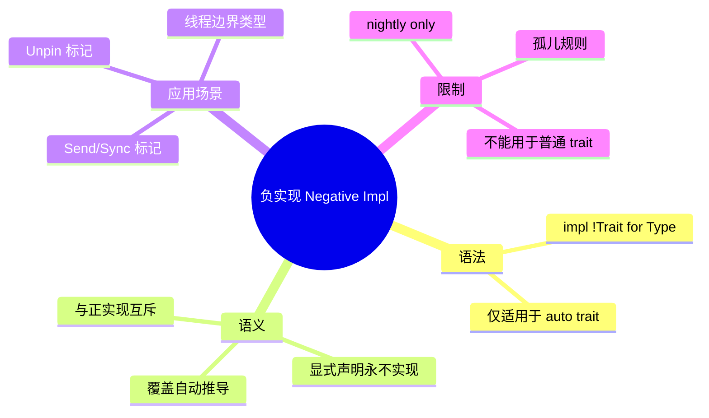

# 负实现（Negative Impls）

> **EN**: Negative Impls
> **Summary**: Negative impls (`impl !Trait for Type`) explicitly declare that a type will never implement a trait, used primarily for auto traits like `Send`, `Sync`, and `Unpin`; as of Rust 1.97.0, user-written negative impls remain unstable behind the `negative_impls` feature gate.
>
> **受众**: [专家]
> **Bloom 层级**: L3-L4
> **内容分级**: [综述级]
> **权威来源**: 本文件为 `concept/` 权威页。
> **Rust 版本**: 1.97.0+ (Edition 2024)
> **最后更新**: 2026-07-16
> **状态**: 用户代码 nightly only；标准库内部已使用
>
> **前置概念**: [Traits](01_traits.md) · [Ownership](../../01_foundation/01_ownership_borrow_lifetime/01_ownership.md) · [Send 与 Sync](../../03_advanced/00_concurrency/02_send_sync_auto_traits.md)
> **后置概念**: [Pin 与 Unpin](../../03_advanced/01_async/08_pin_unpin.md) · [Rust 1.98+ 前沿特性预览](../../07_future/00_version_tracking/rust_1_98_preview.md)
>
> **权威来源**:
> · [Rust Reference — Traits](https://doc.rust-lang.org/reference/items/traits.html) ·
> [Rust Unstable Book — negative_impls](https://doc.rust-lang.org/nightly/unstable-book/language-features/negative-impls.html) ·
> [RFC 19 — Associated Items](https://rust-lang.github.io/rfcs/0019-opt-in-builtin-traits.html) ·
> [Rust Internals — Negative impls](https://internals.rust-lang.org/)

---

> ⚠️ **不稳定特性警告**: 本文件包含 `#![feature(negative_impls)]` 标注的代码示例，需要 **nightly 工具链** 编译。
>
> **使用方式**: `rustup run nightly rustc ...` 或 `cargo +nightly ...`
> **状态查询**: <https://doc.rust-lang.org/nightly/unstable-book/index.html>
> **注意**: 不稳定特性可能在后续版本中变更或移除，生产代码应避免依赖。

---

## 🧠 知识结构图



## 📑 目录

- [负实现（Negative Impls）](#负实现negative-impls)
  - [🧠 知识结构图](#-知识结构图)
  - [📑 目录](#-目录)
  - [一、核心概念](#一核心概念)
    - [1.1 什么是负实现](#11-什么是负实现)
    - [1.2 语法与限制](#12-语法与限制)
    - [1.3 与 auto trait 的关系](#13-与-auto-trait-的关系)
  - [二、技术细节](#二技术细节)
    - [2.1 语义规则](#21-语义规则)
    - [2.2 与正实现的冲突](#22-与正实现的冲突)
    - [2.3 与泛型的交互](#23-与泛型的交互)
  - [三、应用场景](#三应用场景)
    - [3.1 标记 !Send / !Sync](#31-标记-send--sync)
    - [3.2 标记 !Unpin](#32-标记-unpin)
    - [3.3 毒化字段的替代方案](#33-毒化字段的替代方案)
  - [四、反命题与边界分析](#四反命题与边界分析)
    - [4.1 反命题树](#41-反命题树)
    - [4.2 常见错误](#42-常见错误)
  - [五、Stable 替代方案](#五stable-替代方案)
  - [六、来源与延伸阅读](#六来源与延伸阅读)

---

## 一、核心概念

### 1.1 什么是负实现

**负实现（negative impl）** 是一种显式声明「某个类型**永远不会**实现某个 trait」的机制：

```rust,ignore
impl !Trait for Type {}
```

与普通（正）实现 `impl Trait for Type` 相反，负实现**不引入任何方法或关联项**，它只向类型系统（Type System）添加一条**否定性事实**：该类型不满足该 trait 的约束。

在 Rust 1.97.0 中，负实现主要用于 **auto trait**（如 `Send`、`Sync`、`Unpin`）。标准库内部用它精确标记 `Rc<T>`、裸指针、OS 句柄等类型的线程安全边界：

```rust,ignore
// std 内部示意（实际在 core/alloc 中定义）
impl<T: ?Sized> !Send for Rc<T> {}
impl<T: ?Sized> !Sync for Rc<T> {}
```

这些负实现让编译器在类型检查阶段就能拒绝 `Rc` 跨线程传递的代码，而不是等到运行时（Runtime）出错。

### 1.2 语法与限制

负实现的语法极其简单，但限制严格：

```rust
#![feature(negative_impls)]

auto trait MyAuto {}

struct MainThreadOnly;

impl !MyAuto for MainThreadOnly {}

fn main() {}
```

| 限制 | 说明 |
|---|---|
| **仅 auto trait** | 普通 trait 不能写负实现；`impl !Display for Foo` 会报错 |
| **nightly only** | 用户代码需要 `#![feature(negative_impls)]` |
| **孤儿规则（Orphan Rule）** | 只能给本 crate 定义的类型写负实现（与正实现一致） |
| **互斥性** | 同一类型不能同时存在 `impl Trait for T` 和 `impl !Trait for T` |
| **无方法体** | 花括号内为空，不允许写方法或关联项 |

> **判定**: 若你在 stable Rust 中想让某个类型 `!Send`，应使用**毒化字段**（如 `PhantomData<*mut ()>`），参见 §5。

### 1.3 与 auto trait 的关系

Auto trait 的核心特性是**自动推导**：只要类型的所有字段都实现某 auto trait，该类型就自动实现它。负实现则是这条规则的**显式推翻**：

```rust
#![feature(negative_impls)]

auto trait NoCopy: Copy {} // auto trait 示例

struct Wrapper<T>(T);

// 显式声明 Wrapper<T> 永远不实现 NoCopy
impl<T> !NoCopy for Wrapper<T> {}

fn main() {}
```

没有负实现时，要让 `Wrapper<T>` 不实现 `NoCopy`，只能让它的某个字段不实现 `NoCopy`；负实现允许你**直接声明**这一事实，即使所有字段都满足条件。

---

## 二、技术细节

### 2.1 语义规则

负实现在类型系统中的语义可归纳为三条：

1. **否定性约束**：`impl !Trait for T` 表示 `T: Trait` 永远不成立。
2. **覆盖自动推导**：对 auto trait，负实现优先级高于自动推导结果。
3. **参与 trait 求解**：泛型约束求解时，负实现会被用来证明 `T: !Trait`（即 `T` 不满足 `Trait`）。

第三条是负实现最重要的形式化用途。例如，某些 API 可以利用 `T: !Send` 来保证某类型只能单线程使用：

```rust
#![feature(negative_impls)]

use std::marker::PhantomData;

struct SingleThreaded<T> {
    data: T,
    _marker: PhantomData<*mut ()>,
}

// 利用毒化字段 + 负实现语义（ nightly 可显式写）
unsafe impl<T> Send for SingleThreaded<T> {}
// 实际应写：
// impl<T> !Send for SingleThreaded<T> {}

fn main() {}
```

### 2.2 与正实现的冲突

同一类型不能同时存在正、负实现。若尝试：

```rust,compile_fail
#![feature(negative_impls)]

auto trait Marker {}
struct Foo;

impl Marker for Foo {}
impl !Marker for Foo {} // 错误：与正实现冲突
```

编译器会报错（类似 `E0751 found both positive and negative implementation`），因为这违反了逻辑一致性（Coherence）。

### 2.3 与泛型的交互

负实现可以是泛型的，并且与正泛型实现可以**互补**（针对不同类型参数）：

```rust
#![feature(negative_impls)]

auto trait Marker {}

struct Wrapper<T>(T);

impl Marker for Wrapper<i32> {}
impl<T> !Marker for Wrapper<*const T> {}

fn main() {}
```

这里 `Wrapper<i32>: Marker` 成立，而 `Wrapper<*const u8>: Marker` 不成立。编译器在求解时会选择最具体的实现。

---

## 三、应用场景

### 3.1 标记 !Send / !Sync

这是负实现最核心的用途。标准库用它在类型定义处就宣告某类型不可跨线程：

```rust,ignore
// std 内部
impl<T: ?Sized> !Send for Rc<T> {}
impl<T: ?Sized> !Sync for Rc<T> {}
```

对用户代码，nightly 可以写：

```rust
#![feature(negative_impls)]

struct GuiHandle(*mut ());

impl !Send for GuiHandle {}
impl !Sync for GuiHandle {}

fn main() {}
```

这样任何把 `GuiHandle` 传给 `std::thread::spawn` 的代码都会在编译期被拒绝。

### 3.2 标记 !Unpin

自引用（Reference）类型（self-referential structs）通常需要 `!Unpin` 来防止被移动：

```rust
#![feature(negative_impls)]

use std::marker::PhantomPinned;

struct SelfReferential {
    data: String,
    ptr: *const String,
}

impl !Unpin for SelfReferential {}

fn main() {}
```

> 在 stable 上，通常使用 `PhantomPinned` 字段来达到同样的效果。负实现让语义更直接。

### 3.3 毒化字段的替代方案

在 stable Rust 中，要让类型 `!Send`，常见做法是嵌入毒化字段：

```rust
use std::marker::PhantomData;

struct NotSend {
    _marker: PhantomData<*mut ()>,
}
```

负实现可以消除这种「技巧性」代码，使意图更明显：

```rust
#![feature(negative_impls)]

struct NotSend;
impl !Send for NotSend {}

fn main() {}
```

---

## 四、反命题与边界分析

### 4.1 反命题树

```
是否需要显式负实现？
├── 类型是本 crate 定义的？
│   ├── 否 → 不能用负实现（孤儿规则）
│   └── 是 → 继续
├── 目标 trait 是 auto trait？
│   ├── 否 → 不能用负实现（仅 auto trait 支持）
│   └── 是 → 继续
├── 是否已有正实现？
│   ├── 是 → 冲突，不能写负实现
│   └── 否 → 可以写负实现
└── 是否在 stable？
    ├── 是 → 需用毒化字段替代
    └── 否（nightly）→ 可写 #![feature(negative_impls)]
```

### 4.2 常见错误

| 错误 | 示例 | 说明 |
|---|---|---|
| 用于普通 trait | `impl !Display for Foo` | 仅 auto trait 支持负实现 |
| 与正实现共存 | `impl Trait for T` + `impl !Trait for T` | 逻辑冲突，报 E0751 |
| 违反孤儿规则 | 给外部类型写负实现 | 报 E0117 |
| 在 stable 使用 | 忘写 `#![feature(negative_impls)]` | 报 E0658 |

---

## 五、Stable 替代方案

由于用户代码在 stable 上不能写负实现，常用替代技术：

| 目标 | Stable 惯用法 |
|---|---|
| `!Send` | `PhantomData<*mut ()>` 或 `PhantomData<Rc<()>>` |
| `!Sync` | `PhantomData<Cell<()>>` 或 `PhantomData<RefCell<()>>` |
| `!Unpin` | `PhantomPinned` 字段 |
| 自定义 auto trait 的 opt-out | 无法直接实现；需重新设计类型 |

示例：

```rust
use std::marker::PhantomData;

struct NotSendNotSync {
    _marker: PhantomData<*const ()>, // *const T 是 !Send + !Sync
}

fn assert_not_send_sync<T: !Send + !Sync>() {}

fn main() {
    assert_not_send_sync::<NotSendNotSync>();
}
```

> 注意：`!Send` / `!Sync` 在 trait bound 中写为 `T: !Send` 需要 nightly 的 `negative_bounds` 特性；stable 上通常通过 `T: Send` 不成立来间接表达。

---

## 六、来源与延伸阅读

- [Rust Unstable Book — negative_impls](https://doc.rust-lang.org/nightly/unstable-book/language-features/negative-impls.html)
- [Rust Reference — Traits](https://doc.rust-lang.org/reference/items/traits.html)
- [RFC 19 — Opt-in builtin traits](https://rust-lang.github.io/rfcs/0019-opt-in-builtin-traits.html)
- [Send 与 Sync 权威页](../../03_advanced/00_concurrency/02_send_sync_auto_traits.md)
- [Pin 与 Unpin 权威页](../../03_advanced/01_async/08_pin_unpin.md)
