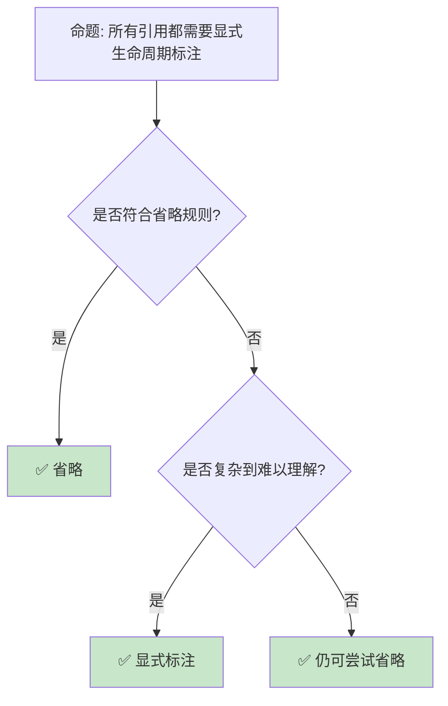

> **内容分级**: [综述级]
> **本节关键术语**: 高级生命周期 (Advanced Lifetimes) · HRTB · 生命周期省略（Lifetime Elision）规则 (Elision) · 子类型 (Subtyping) · 变型 (Variance) — [完整对照表](../../00_meta/01_terminology/terminology_glossary.md)
>
# 生命周期高级主题：从 HRTB 到自引用类型
>
> **EN**: Lifetimes
> **Summary**: Lifetimes. Core Rust concept covering mechanism analysis, in-depth analysis, lifetime semantics.
>
> **受众**: [进阶]
> **Bloom 层级**: 分析 → 评价
> **A/S/P 标记**: **S** — Structure
> **双维定位**: C×Ana — 分析高级生命周期（Lifetimes）的约束传播
> **定位**: 深入分析 Rust **生命周期**的高级主题——从高阶生命周期（HRTB）、生命周期省略（Lifetime Elision）规则到自引用（Reference）结构和 Pin，揭示生命周期系统如何处理最复杂的借用（Borrowing）场景。
> **前置概念**: [Lifetimes](../../01_foundation/01_ownership_borrow_lifetime/03_lifetimes.md) · [Traits](01_traits.md) · [Generics](../01_generics/02_generics.md)
> **后置概念**: [Pin](../../03_advanced/01_async/06_pin_unpin.md) · [NLL](../../03_advanced/02_unsafe/08_nll_and_polonius.md) · [RustBelt](../../04_formal/02_separation_logic/04_rustbelt.md)

---

> **来源**: [Rust Reference — Lifetimes](https://doc.rust-lang.org/reference/lifetime-elision.html) · · [Jung et al. — RustBelt: Securing the Foundations of Rust](https://plv.mpi-sws.org/rustbelt/popl18/) · [Itanium C++ ABI](https://itanium-cxx-abi.github.io/cxx-abi/abi.html)
> [TRPL — Advanced Lifetimes](https://doc.rust-lang.org/book/ch10-03-lifetime-syntax.html) · [Brown University Interactive Book](https://rust-book.cs.brown.edu/ch10-03-lifetime-syntax.html) ·
> [RFC 0387 — Higher-Ranked Trait Bounds](https://rust-lang.github.io/rfcs//0387-higher-ranked-trait-bounds.html) ·
> [The Rustonomicon — Subtyping and Variance](https://doc.rust-lang.org/nomicon/subtyping.html) ·
> [Wikipedia — Region-based Memory Management](https://en.wikipedia.org/wiki/Region-based_memory_management)

## 📑 目录

- [生命周期（Lifetimes）高级主题：从 HRTB 到自引用（Reference）类型](18_lifetimes_advanced.md)
  - [📑 目录](#-目录)
  - [一、核心概念](#一核心概念)
    - [1.1 高阶生命周期（HRTB）](#11-高阶生命周期hrtb)
    - [1.2 生命周期（Lifetimes）省略规则](#12-生命周期省略规则)
    - [1.3 变型（Variance）](#13-变型variance)
  - [二、技术细节](#二技术细节)
    - [2.1 HRTB 的实际应用](#21-hrtb-的实际应用)
    - [2.2 自引用（Reference）与 Pin](#22-自引用与-pin)
    - 2.3 生命周期（Lifetimes）与闭包（Closures）
  - [三、生命周期（Lifetimes）模式矩阵](#三生命周期模式矩阵)
  - [四、反命题与边界分析](#四反命题与边界分析)
    - [4.1 反命题树](#41-反命题树)
    - [4.2 边界极限](#42-边界极限)
  - [五、常见陷阱](#五常见陷阱)
  - [六、来源与延伸阅读](#六来源与延伸阅读)
  - [相关概念文件](#相关概念文件)
  - [逆向推理链（Backward Reasoning）](#逆向推理链backward-reasoning)
  - [权威来源索引](#权威来源索引)
  - [十、边界测试：高级生命周期（Lifetimes）的编译错误](#十边界测试高级生命周期的编译错误)
    - 10.1 边界测试：自引用（Reference）结构体（Struct）与 `Pin`（编译错误）
    - [10.2 边界测试：生命周期（Lifetimes）边界中的 `for<'a>` HRTB（编译错误）](#102-边界测试生命周期边界中的-fora-hrtb编译错误)
    - [10.5 边界测试：闭包（Closures）捕获引用（Reference）与 `Fn` trait 的生命周期（Lifetimes）约束（编译错误）](#105-边界测试闭包捕获引用与-fn-trait-的生命周期约束编译错误)
    - [10.6 边界测试：`impl Trait` 返回类型的生命周期（Lifetimes）捕获（编译错误）](#106-边界测试impl-trait-返回类型的生命周期捕获编译错误)
    - [10.3 边界测试：lifetime bounds 与 trait object 的交互（编译错误）](#103-边界测试lifetime-bounds-与-trait-object-的交互编译错误)
  - [实践](#实践)
  - [嵌入式测验（Embedded Quiz）](#嵌入式测验embedded-quiz)
    - [测验 1：变型（Variance）方向（理解层）](#测验-1变型variance方向理解层)
    - [测验 2：HRTB 与闭包（Closures）（应用层）](#测验-2hrtb-与闭包应用层)
    - [测验 3：`Pin` 与自引用（Reference）（分析层）](#测验-3pin-与自引用分析层)
    - [测验 4：生命周期（Lifetimes）边界中的 `+ 'a`（应用层）](#测验-4生命周期边界中的--a应用层)
    - [测验 5：生命周期省略（Lifetime Elision）规则的例外（分析层）](#测验-5生命周期省略规则的例外分析层)
  - [认知路径](#认知路径)
    - [核心推理链](#核心推理链)
    - [反命题与边界](#反命题与边界)

---

## 一、核心概念
>
>

### 1.1 高阶生命周期（HRTB）
>

```text
HRTB (Higher-Ranked Trait Bounds):

  问题场景:
  ├── 需要一个适用于"所有生命周期"的 Trait Bound
  ├── 普通泛型参数只绑定一个具体生命周期
  └── HRTB 允许"对所有生命周期成立"

  语法:
  for<'a> Trait<'a>  // 对所有生命周期 'a，Trait<'a> 成立

  对比:
  fn normal<F>(f: F)
  where F: Fn(&i32)  // F 接受某个特定生命周期的引用

  fn hrtb<F>(f: F)
  where F: for<'a> Fn(&'a i32)  // F 接受任意生命周期的引用

  经典示例:
  let closure = |x: &i32| println!("{}", x);

  // closure 的类型实际上是 for<'a> Fn(&'a i32)
  // 它可以被传入任何接受 &i32 的函数

  HRTB 的必要性:
  ├── 闭包自动实现 for<'a> Fn(&'a T)
  ├── 某些 trait 方法需要灵活的生命周期
  └── 否则泛型函数无法接受闭包
```

> **认知功能**: HRTB 是 Rust **泛型（Generics）与借用（Borrowing）结合**的关键机制——它使闭包（Closures）和回调可以接受任意生命周期的引用（Reference）。(Source: [RFC 0387 — HRTB](https://rust-lang.github.io/rfcs/0387-higher-ranked-trait-bounds.html))
> [来源: [RFC 0387 — HRTB](https://rust-lang.github.io/rfcs//0387-higher-ranked-trait-bounds.html)]

---

### 1.2 生命周期省略规则
>

```text
生命周期省略（Lifetime Elision）:

  规则 1: 每个引用参数获得独立生命周期
    fn foo(x: &i32)           →  fn foo<'a>(x: &'a i32)
    fn foo(x: &i32, y: &i32)  →  fn foo<'a, 'b>(x: &'a i32, y: &'b i32)

  规则 2: 单输入生命周期时，输出生命周期等于该唯一输入生命周期
    ├── 唯一输入: 函数签名中恰好只有一个引用类型的输入参数（即单一生命周期参数）
    ├── 输出等于输入: 返回值中的所有引用类型自动获得与该输入相同的生命周期参数
    ├── 形式化: 若输入仅含单一生命周期 'a，则输出自动绑定 'a
    ├── 示例: fn foo(x: &i32) -> &i32 推导为 fn foo<'a>(x: &'a i32) -> &'a i32
    ├── 关键: 输入端唯一生命周期 → 输出端自动复用该生命周期
    └── 边界: 若存在多个不同生命周期的引用参数，规则 2 不适用，需显式标注

  规则 3: 多个输入，但一个是 &self 或 &mut self，输出使用 self 的生命周期
    fn method(&self) -> &T     →  fn method<'a>(&'a self) -> &'a T
    fn method(&self, x: &T) -> &T  →  fn method<'a, 'b>(&'a self, x: &'b T) -> &'a T

  需要显式标注的情况:
  ├── 规则不适用时
  ├── 返回引用与输入无关（'static）
  ├── 复杂的多重引用关系
  └── 涉及多个生命周期的 trait bound

  示例:
  // 需要显式标注
  fn longest<'a>(x: &'a str, y: &'a str) -> &'a str {
      if x.len() > y.len() { x } else { y }
  }
  // 返回的生命周期必须 <= 两个输入的最小值
```

> **省略洞察**: 生命周期省略（Lifetime Elision）**不是可选特性**——它是使 Rust 代码可读的关键设计，覆盖了 90% 的常见模式。(Source: [Rust Reference — Lifetime Elision](https://doc.rust-lang.org/reference/lifetime-elision.html))
> [来源: [Rust Reference — Lifetime Elision](https://doc.rust-lang.org/reference/lifetime-elision.html)]

---

### 1.3 变型（Variance）
>

```text
变型: 子类型关系在泛型参数上的传播

  三种变型:
  ├── 协变（Covariant）: T <: U ⇒ Container<T> <: Container<U>
  │   └── &'a T（生命周期越长，类型越小）
  ├── 逆变（Contravariant）: T <: U ⇒ Container<U> <: Container<T>
  │   └── fn(T)（参数类型越宽，函数越窄）
  └── 不变（Invariant）: T <: U ⇏ Container<T> <: Container<U>
      └── &mut T, Cell<T>, Mutex<T>

  生命周期变型:
  ├── &'static T <: &'a T（'static 更长，是子类型）
  ├── 协变: 长生命周期可转为短生命周期
  └── fn(&'static str) 可传入 fn(&'a str)

  Rust 中的变型:
  ┌─────────────────┬─────────────────┐
  │ 类型构造器      │ 变型            │
  ├─────────────────┼─────────────────┤
  │ &T              │ 对 T 协变       │
  │ &mut T          │ 对 T 不变       │
  │ Box<T>          │ 对 T 协变       │
  │ Vec<T>          │ 对 T 协变       │
  │ Cell<T>         │ 对 T 不变       │
  │ fn(T) -> U      │ 对 T 逆变，对 U 协变│
  │ *const T        │ 对 T 协变       │
  │ *mut T          │ 对 T 不变       │
  └─────────────────┴─────────────────┘
> [来源: [TRPL](https://doc.rust-lang.org/book/ch10-03-lifetime-syntax.html)]

  变型的影响:
  ├── 协变允许放宽生命周期约束
  ├── 不变阻止危险的生命周期缩短
  └── 理解变型有助于解决生命周期错误
```

> **变型洞察**: **变型**是 Rust 类型系统（Type System）的**隐藏齿轮**——它解释了为什么某些生命周期转换合法而另一些不合法。
> [来源: [The Rustonomicon — Variance](https://doc.rust-lang.org/nomicon/subtyping.html)]

---

## 二、技术细节

### 2.1 HRTB 的实际应用
>

```rust,ignore
// HRTB 的实际应用

// 1. 接受任意生命周期的闭包
fn with_data<F>(f: F)
where
    F: for<'a> Fn(&'a str) -> usize,
{
    let s = "hello";
    f(s);
}

// 2. 泛型 trait bound
trait Parser<'a> {
    fn parse(&self, input: &'a str) -> Result<&'a str, Error>;
}

// HRTB 使 Parser 适用于所有生命周期
fn parse_any<P>(parser: P, input: &str) -> Result<&str, Error>
where
    P: for<'a> Parser<'a>,
{
    parser.parse(input)
}

// 3. 闭包作为回调
fn process_items<F>(items: &[i32], mut callback: F)
where
    F: for<'a> FnMut(&'a i32),
{
    for item in items {
        callback(item);
    }
}

// 使用:
process_items(&[1, 2, 3], |x| println!("{}", x));
// 闭包自动满足 for<'a> FnMut(&'a i32)

// 4. 与 'static 的区别
fn static_callback<F>(f: F)
where F: Fn(&'static str)
{
    f("hello");  // 只能接受 'static 字符串
}

fn any_callback<F>(f: F)
where F: for<'a> Fn(&'a str)
{
    let s = String::from("hello");
    f(&s);  // 可以接受任意生命周期
}
```

> **HRTB 洞察**: HRTB 的**核心应用场景**是**闭包（Closures）和回调**——它使泛型（Generics）代码可以灵活地接受临时引用（Reference）。
> [来源: [Rust Reference — HRTB](https://doc.rust-lang.org/reference/trait-bounds.html#higher-ranked-trait-bounds)]

---

### 2.2 自引用与 Pin
>

```rust,ignore
// 自引用结构: 结构体包含指向自身的引用

struct SelfReferential<'a> {
    data: String,
    pointer_to_data: &'a str,  // 指向 data 字段！
}

// 问题:
// ├── 移动结构体后 data 地址改变
// ├── pointer_to_data 成为悬空指针
// └── Rust 禁止这种结构（编译错误）

// 解决方案: Pin
use std::pin::Pin;
use std::marker::PhantomPinned;

struct SelfReferential {
    data: String,
    pointer_to_data: *const str,  // 使用原始指针
    _pin: PhantomPinned,           // 禁止移动
}

impl SelfReferential {
    fn new(data: String) -> Pin<Box<Self>> {
        let mut boxed = Box::new(Self {
            data,
            pointer_to_data: std::ptr::null(),
            _pin: PhantomPinned,
        });

        let ptr = &boxed.data as *const str;
        boxed.pointer_to_data = ptr;

        // Pin 保证内存位置不变
        Box::into_pin(boxed)
    }
}

// Pin 的关键保证:
// ├── Pin<P<T>> 阻止 T 被移动
// ├── 除非 T: Unpin（默认大多数类型实现 Unpin）
// ├── PhantomPinned 使类型 !Unpin
// └── 自引用结构必须 Pin 到堆上

// async/await 的内部:
// ├── Future 状态机是自引用结构
// ├── .await 点可能持有局部变量引用
// └── async fn 返回 Pin<Box<dyn Future>>
```

> **Pin 洞察**: `Pin` 是 Rust **自引用（Reference）类型的解决方案**——它为 async/await、生成器等高级特性提供了内存安全（Memory Safety）保证。
> [来源: [std::pin::Pin](https://doc.rust-lang.org/std/pin/struct.Pin.html)]

---

### 2.3 生命周期与闭包
>

```rust
// 闭包捕获与生命周期

fn closure_lifetimes() {
    let s = String::from("hello");

    // 1. 通过引用捕获
    let closure = |x: &str| -> String {
        format!("{} {}", s, x)  // s 被 &String 捕获
    };
    // closure 的生命周期与 s 绑定

    // 2. 通过 move 捕获
    let closure = move |x: &str| -> String {
        format!("{} {}", s, x)  // s 被 move 进闭包
    };
    // s 被消耗，closure 拥有数据

    // 3. 闭包作为返回值（需要 'static）
    fn make_closure() -> impl Fn(i32) -> i32 {
        let factor = 2;
        move |x| x * factor  // factor 被 move，闭包是 'static
    }

    // 4. 借用闭包（非 'static）
    fn make_borrowed_closure<'a>(s: &'a str) -> impl Fn() -> &'a str + 'a {
        move || s  // 返回借用的引用
    }
}

// 闭包 Trait:
// ├── Fn: 不可变借用捕获 (&T)
// ├── FnMut: 可变借用捕获 (&mut T)
// └── FnOnce: 移动捕获（T），只能调用一次

// 选择:
// ├── 需要多次调用 + 不可变 → Fn
// ├── 需要多次调用 + 可变 → FnMut
// └── 只需要一次/消耗数据 → FnOnce
```

> **闭包（Closures）洞察**: 闭包的**三种 Fn trait**对应三种借用（Borrowing）模式——它们是 Rust **所有权（Ownership）系统**在闭包上的自然延伸。
> [来源: [TRPL — Closures](https://doc.rust-lang.org/book/ch13-01-closures.html)]

---

## 三、生命周期模式矩阵

```text
场景 → 方案 → 代码模式

简单借用:
  → 生命周期省略
  → fn foo(x: &str) -> &str

多个输入一个输出:
  → 显式生命周期标注
  → fn longest<'a>(x: &'a str, y: &'a str) -> &'a str

泛型结构体借用:
  → 结构体生命周期参数
  → struct Parser<'a> { input: &'a str }

闭包回调:
  → HRTB
  → F: for<'a> Fn(&'a str)

自引用:
  → Pin + PhantomPinned
  → Pin<Box<MyStruct>>

异步生命周期:
  → 'static Future
  → async fn 自动处理
```

> **模式矩阵**: 生命周期是 Rust **最陡峭的学习曲线**——但一旦掌握，它成为编译期保证的强大工具。
> [来源: [Rust Lifetime Visualization](https://rustc-dev-guide.rust-lang.org/borrow_check/region_inference.html)]

---

## 四、反命题与边界分析

### 4.1 反命题树
>



> **认知功能**: **生命周期省略（Lifetime Elision）**覆盖大多数场景——只在编译器无法推断或需要明确文档时显式标注。
> [来源: [Rust API Guidelines — Lifetimes](https://rust-lang.github.io/api-guidelines//flexibility.html#c-seeker)]

---

### 4.2 边界极限
>

```text
边界 1: 生命周期传染性
├── 一个生命周期标注可能影响整个 API
├── 可能"感染"大量代码需要标注
├── 难以局部化
└── 缓解: 使用 owned 类型（String vs &str）

边界 2: 自引用限制
├── Rust 不直接支持自引用结构
├── 需要 Pin + unsafe 原始指针
├── API 复杂度增加
└── 缓解: 使用索引替代指针，或 Rc/Arc

边界 3: 复杂泛型约束
├── HRTB + 多个生命周期 + Trait Bound
├── 类型签名极长
├── 可读性下降
└── 缓解: type alias、where 子句换行

边界 4: NLL 的局限
├── NLL 改善了常见场景
├── 但某些安全代码仍被拒绝
├── Polonius 将进一步改善
└── 缓解: 重构代码结构，或 unsafe

边界 5: 闭包与生命周期交互
├── 闭包捕获的生命周期难以显式控制
├── move 闭包可能意外复制大对象
├── Fn trait 选择可能令人困惑
└── 缓解: 显式使用 move，理解三种 Fn
```

> **边界要点**: 生命周期高级主题的边界主要与**传染性**、**自引用（Reference）**、**复杂度**、**NLL 局限**和**闭包（Closures）交互**相关。
> [来源: [Rust Compiler — Polonius](https://rust-lang.github.io/compiler-team/working-groups/polonius/)]

---

## 五、常见陷阱

```text
陷阱 1: 返回局部引用
  ❌ fn bad() -> &str {
         let s = String::from("hello");
         &s  // s 在函数结束时被 drop
     }

  ✅ fn good() -> String {
         String::from("hello")  // 转移所有权
     }

陷阱 2: 生命周期标注不足
  ❌ fn bad(x: &str, y: &str) -> &str { x }
     // 编译错误：无法推断返回生命周期

  ✅ fn good<'a>(x: &'a str, y: &str) -> &'a str { x }

陷阱 3: 在结构体中存储引用
  ❌ struct Bad { data: &str }
     // 需要生命周期参数

  ✅ struct Good<'a> { data: &'a str }
     // 或 struct Good { data: String }

陷阱 4: HRTB 使用错误
  ❌ fn bad<F>(f: F) where F: Fn(&str) { }
     // 某些闭包不满足

  ✅ fn good<F>(f: F) where F: for<'a> Fn(&'a str) { }

陷阱 5: 忘记 move 闭包
  ❌ let s = String::from("hello");
     let c = || println!("{}", s);
     drop(s);  // 编译错误！s 被借用

  ✅ let c = move || println!("{}", s);
     // s 被 move 进闭包
```

> **陷阱总结**: 生命周期陷阱主要与**返回局部引用**、**标注不足**、**结构体（Struct）存储引用**、**HRTB**和**闭包（Closures）捕获**相关。
> [来源: [Common Lifetime Mistakes](https://doc.rust-lang.org/rust-by-example/scope/lifetime.html)]

---

## 六、来源与延伸阅读
>

| 来源 | 可信度 | 说明 |
|:---|:---:|:---|
| [Rust Reference — Lifetimes](https://doc.rust-lang.org/reference/lifetime-elision.html) | ✅ 一级 | 生命周期参考 |
| [TRPL — Advanced Lifetimes](https://doc.rust-lang.org/book/ch10-03-lifetime-syntax.html) | ✅ 一级 | 高级教程 |
| [RFC 0387 — HRTB](https://rust-lang.github.io/rfcs//0387-higher-ranked-trait-bounds.html) | ✅ 一级 | HRTB 设计 |
| [The Rustonomicon — Subtyping](https://doc.rust-lang.org/nomicon/subtyping.html) | ✅ 一级 | 变型详解 |
| [Pin and Suffering](https://blog.cloudflare.com/pin-and-unpin-in-rust/) | ✅ 二级 | Pin 深入讲解 |

---

## 相关概念文件

- [Lifetimes](../../01_foundation/01_ownership_borrow_lifetime/03_lifetimes.md) — 生命周期基础
- [Pin](../../03_advanced/01_async/06_pin_unpin.md) — Pin 与 Unpin
- [NLL](../../03_advanced/02_unsafe/08_nll_and_polonius.md) — NLL 与 Polonius
- [RustBelt](../../04_formal/02_separation_logic/04_rustbelt.md) — 形式化验证

---

> **权威来源**: [Rust Reference](https://doc.rust-lang.org/reference/introduction.html), [The Rust Programming Language](https://doc.rust-lang.org/book/ch10-03-lifetime-syntax.html)
>
> **权威来源对齐变更日志**: 2026-05-22 创建 [Authority Source Sprint Batch 10](../../00_meta/02_sources/international_authority_index.md)

**文档版本**: 1.0
**对应 Rust 版本**: 1.97.0+ (Edition 2024)
**最后更新**: 2026-05-22
**状态**: ✅ 概念文件创建完成

---

## 逆向推理链（Backward Reasoning）

> **从编译错误反推**：
>
> ```text
> 高级生命周期 ⟸ HRTB + 约束可满足
> ```
>
## 权威来源索引

>
>
>

---

> **补充来源**

## 十、边界测试：高级生命周期的编译错误

### 10.1 边界测试：自引用结构体与 `Pin`（编译错误）

```rust,compile_fail
struct SelfRef {
    data: String,
    ptr: &str, // ❌ 编译错误: expected named lifetime parameter
}

// 正确: 使用裸指针 + Pin
use std::pin::Pin;
use std::marker::PhantomPinned;

struct SelfRefFixed {
    data: String,
    ptr: *const str,
    _pin: PhantomPinned,
}

impl SelfRefFixed {
    fn new(data: String) -> Pin<Box<Self>> {
        let mut boxed = Box::new(SelfRefFixed {
            ptr: std::ptr::null(),
            data,
            _pin: PhantomPinned,
        });
        let ptr = &boxed.data[..] as *const str;
        boxed.ptr = ptr;
        Box::pin(boxed)
    }
}
```

> **修正**:
> 自引用结构体（Struct）（字段引用同一结构体的其他字段）在 Rust 的生命周期系统中无法表达，因为结构体的生命周期参数只能引用外部数据。
> 解决方案是使用裸指针（无生命周期约束）+ `Pin`（防止移动）+ `PhantomPinned`（标记为 !Unpin）。
> 这是 Rust 安全边界的典型突破——编译器无法证明的安全属性，由 unsafe 代码承担证明义务。
> [来源: [Rustonomicon](https://doc.rust-lang.org/nomicon/index.html)]

### 10.2 边界测试：生命周期边界中的 `for<'a>` HRTB（编译错误）

```rust,ignore
fn call_with_ref<F>(f: F)
where
    F: Fn(&i32),
{
    let x = 5;
    f(&x);
}

fn main() {
    // ❌ 编译错误: implementation of `Fn` is not general enough
    // 闭包 |x: &i32| 默认推断 x 为特定生命周期，而非对所有生命周期
    call_with_ref(|x: &i32| println!("{}", x));
}

// 正确: 显式使用 HRTB
fn call_with_ref_fixed<F>(f: F)
where
    for<'a> F: Fn(&'a i32), // ✅ HRTB
{
    let x = 5;
    f(&x);
}
```

> **修正**:
> 高阶 trait bound（HRTB）`for<'a>` 要求实现对所有可能的生命周期 `'a` 有效。
> 当闭包（Closures）作为参数传递时，默认的生命周期推断可能过于具体（绑定到特定作用域），
> 导致无法满足泛型（Generics）函数的 trait bound。HRTB 在回调函数、比较器、迭代器（Iterator）适配器等高阶函数场景中至关重要，是 Rust 类型系统（Type System）表达"多态生命周期"的关键机制。
> [来源: [Rust Reference](https://doc.rust-lang.org/reference/introduction.html)]

### 10.5 边界测试：闭包捕获引用与 `Fn` trait 的生命周期约束（编译错误）

```rust,compile_fail
fn make_callback<'a>(s: &'a str) -> impl Fn() + 'a {
    move || println!("{}", s)
}

fn main() {
    let callback;
    {
        let s = String::from("hello");
        callback = make_callback(&s);
        // ❌ 编译错误: callback 的生命周期与 s 绑定
        // s 在这里被释放，但 callback 仍被使用
    }
    // callback();
}
```

> **修正**:
> `impl Fn() + 'a` 表示闭包（Closures）本身的生命周期为 `'a`——闭包捕获的引用不能超越 `'a`。
> `make_callback(&s)` 返回的闭包与 `s` 同生命周期，因此 `s` 释放后闭包失效。
> 若需长生命周期的回调，必须拥有数据：`move || println!("{}", s.clone())` 或 `Arc<str>`。
> 这是 Rust 异步（Async）和事件驱动编程的核心约束：回调、future、stream 的生命周期与捕获数据绑定。
> 这与 C++ 的 `std::function`（可捕获引用，但悬垂是 UB）或 Java 的匿名类（捕获 final 引用（Reference），GC 管理生命周期）不同——Rust 在编译期防止了回调的悬垂引用。
> [来源: [The Rust Programming Language](https://doc.rust-lang.org/book/ch13-01-closures.html)] ·
> [来源: [Rust Reference — Closure Types](https://doc.rust-lang.org/reference/types/closure.html)]

### 10.6 边界测试：`impl Trait` 返回类型的生命周期捕获（编译错误）

```rust,compile_fail
fn make_ref<'a>(s: &'a str) -> impl Iterator<Item = &'a char> + 'a {
    s.chars().collect::<Vec<_>>().iter()
    // ❌ 编译错误: Vec 在函数内创建，iter() 返回的引用生命周期不够长
}
```

> **修正**:
> `impl Trait` 返回类型可捕获输入参数的生命周期（`+ 'a`），但不能延长局部变量的生命周期。
> 上述代码中，`Vec<char>` 在函数内创建，`iter()` 返回的 `&char` 与 `Vec` 同生命周期——函数返回后 `Vec` 被释放，引用悬垂。
> 解决方案：
>
> 1) 返回拥有数据的类型（`Vec<char>` 本身，或 `Chars` 迭代器（Iterator））；
> 2) 让调用者提供缓冲区；
> 3) 使用 `unsafe` 和 `ManuallyDrop`（不推荐）。
>
> 这与 `async fn` 的生命周期捕获类似：返回的 future 可引用输入参数，但不能引用局部变量。
> `impl Trait` 的生命周期规则是 Rust 类型系统（Type System）的核心——它确保返回的抽象不依赖已释放的数据。
> [来源: [The Rust Programming Language](https://doc.rust-lang.org/book/ch10-03-lifetime-syntax.html)] ·
> [来源: [Rust Reference — Impl Trait](https://doc.rust-lang.org/reference/types/impl-trait.html)]

### 10.3 边界测试：lifetime bounds 与 trait object 的交互（编译错误）

```rust,compile_fail
trait Processor<'a> {
    fn process(&self, data: &'a str) -> &'a str;
}

fn use_processor(p: &dyn Processor<'static>) {
    let s = String::from("temporary");
    // ❌ 编译错误: Processor<'static> 要求 &'static str，但 &s 不是 'static
    let _result = p.process(&s);
}

fn main() {}
```

> **修正**:
>
> Trait object `dyn Trait<'a>` 将生命周期参数**固化**为具体值。
> `dyn Processor<'static>` 要求所有输入输出都是 `'static`，不能处理临时字符串。
> 修复：
>
> 1) `fn use_processor<'a>(p: &dyn Processor<'a>, data: &'a str)` — 泛型（Generics）生命周期；
> 2) `dyn for<'a> Processor<'a>` — HRTB（Higher-Ranked Trait Bounds），接受任意生命周期。
> HRTB 的语法：`dyn for<'a> Fn(&'a str) -> &'a str` 表示闭包对所有 `'a` 有效。
> 这与 Java 的泛型（Generics）通配符（`? extends T`）或 C++ 的模板（无显式生命周期参数）不同——Rust 的 HRTB 允许 trait object 保持生命周期泛型，是高级类型系统（Type System）的核心特性。
> [来源: [Rust Reference — Trait Objects](https://doc.rust-lang.org/reference/types/trait-object.html)] ·
> [来源: [The Rust Programming Language](https://doc.rust-lang.org/book/ch10-03-lifetime-syntax.html)]

## 实践

> **相关资源**:
>
> - [crates/ 示例代码](../crates) — 与本文概念对应的可编译示例
> - [exercises/ 练习](../exercises) — 动手编程挑战
> - [MVP 学习路径](../../00_meta/04_navigation/learning_mvp_path.md) — 从零到多线程 CLI 的 40 小时路径
>
> **建议**: 阅读完本概念文件后，打开对应 crate 的示例代码，尝试修改并运行。完成至少 1 道相关练习以巩固理解。

## 嵌入式测验（Embedded Quiz）

### 测验 1：变型（Variance）方向（理解层）

对于 `&'a T`，若 `'static: 'a`（`'static` 比 `'a` 长），以下赋值是否合法？

```rust,ignore
let s: &'static str = "hello";
let r: &'a str = s;
```

- A. 不合法，生命周期不能缩短
- B. 合法，引用对生命周期是协变的
- C. 仅当 `T` 实现 `Copy` 时合法

<details>
<summary>✅ 答案</summary>

**B. 合法，引用对生命周期是协变的**。

Rust 中的变型规则：

- `&'a T`：对 `'a` **协变**（covariant）—— 可将长生命周期赋值给短生命周期期望
- `&'a mut T`：对 `'a` 协变，对 `T` 不变
- `Box<T>`、`Vec<T>`：对 `T` 协变
- `Cell<T>`、`RefCell<T>`：对 `T` 不变

协变意味着：若 `'static` 比 `'a` 长，则 `&'static T` 可视为 `&'a T` 的子类型。
</details>

---

### 测验 2：HRTB 与闭包（应用层）

以下代码为什么需要 `for<'a>`？

```rust
fn call<F>(f: F)
where
    F: for<'a> Fn(&'a str) -> &'a str,
{
    let s1 = String::from("a");
    let s2 = String::from("b");
    f(&s1);
    f(&s2);
}
```

- A. 允许闭包返回 `'static` 引用（Reference）
- B. 允许闭包接受任意生命周期的引用，不限定 `'static`
- C. 限制闭包只能接受局部变量引用

<details>
<summary>✅ 答案</summary>

**B. 允许闭包接受任意生命周期的引用，不限定 `'static`**。

没有 `for<'a>` 时，编译器会推断一个具体的生命周期（通常尽可能长）。若写成 `Fn(&str) -> &str`，编译器可能推断为 `Fn(&'static str) -> &'static str`，导致无法接受局部字符串引用。

`for<'a>` 表示"对所有生命周期 `'a` 成立"，这是处理闭包和引用时最强大的生命周期工具之一。
</details>

---

### 测验 3：`Pin` 与自引用（分析层）

`Pin<Box<T>>` 的主要用途是什么？

- A. 防止 `T` 被 `Drop`
- B. 保证 `T` 在内存中的地址不变，允许安全地自引用
- C. 使 `T` 线程安全

<details>
<summary>✅ 答案</summary>

**B. 保证 `T` 在内存中的地址不变，允许安全地自引用**。

自引用结构的问题：普通值可被 move（如函数返回、赋值），导致内部指针悬垂。`Pin` 与 `Unpin` trait 配合：

- `Pin<P<T>>` 承诺不移动 `T`（若 `T: !Unpin`）
- `Box::pin(value)` 在堆上分配并固定
- 异步（Async）状态机和自引用数据结构都依赖 `Pin`

注意：`Pin` 本身不保证地址不变，它通过 API 约束实现这一点。`!Unpin` 类型（如包含自引用的结构）才真正受保护。
</details>

---

### 测验 4：生命周期边界中的 `+ 'a`（应用层）

以下 trait bound 的含义是什么？

```rust,ignore
fn foo<T>(x: T)
where
    T: Trait + 'static,
{
}
```

- A. `T` 必须实现 `Trait` 且为 `'static` 类型
- B. `T` 必须实现 `Trait` 且所有引用都活至少 `'static`
- C. `T` 必须是 `static` 变量

<details>
<summary>✅ 答案</summary>

**B. `T` 必须实现 `Trait` 且所有引用都活至少 `'static`**。

`T: 'a` 是**生命周期（Lifetimes） bound**，表示"`T` 中不包含短于 `'a` 的引用"。因此：

- `T: 'static` 表示 `T` 可以安全地存活整个程序运行期
- `String: 'static`（它不含引用）
- `&'a str: 'static` 仅当 `'a` 是 `'static`

这与 `T: Trait` 不同：前者是生命周期约束，后者是 trait 约束。
</details>

---

### 测验 5：生命周期省略规则的例外（分析层）

以下函数签名中，编译器能否自动推断生命周期？

```rust,ignore
fn longest(x: &str, y: &str) -> &str
```

- A. 能，应用省略规则
- B. 不能，多个输入引用时输出引用的生命周期不明确
- C. 能，编译器选择较长的生命周期

<details>
<summary>✅ 答案</summary>

**B. 不能，多个输入引用时输出引用的生命周期不明确**。

生命周期省略（Lifetime Elision）规则：

1. 每个输入引用参数获得独立生命周期
2. 若只有一个输入生命周期，它赋给所有输出生命周期
3. 若有多个输入生命周期，规则 2 不适用

`longest` 有两个输入引用，编译器无法确定输出应与 `x` 还是 `y` 关联。必须显式标注：

```rust,ignore
fn longest<'a>(x: &'a str, y: &'a str) -> &'a str
```

</details>

---

## 认知路径

> **认知路径**: 从 L0 基础概念出发，经由本节的 **生命周期高级主题：从 HRTB 到自引用类型** 核心原理，通向 L2 进阶模式与 L3 工程实践。

### 核心推理链

| 定理 | 前提 | 结论 | 置信度 |
|:---|:---|:---|:---|
| 生命周期高级主题：从 HRTB 到自引用类型 基础定义 ⟹ 正确用法 | 理解语法与语义 | 能写出符合惯用法的代码 | 高 |
| 生命周期高级主题：从 HRTB 到自引用类型 正确用法 ⟹ 常见陷阱 | 忽略边界条件 | 编译错误或运行时（Runtime） bug | 高 |
| 生命周期高级主题：从 HRTB 到自引用类型 常见陷阱 ⟹ 深度掌握 | 系统学习反模式 | 能进行代码审查与优化 | 高 |

> 编译通过 ⟸ 生命周期标注正确 ⟸ 引用有效性
> 无悬垂引用 ⟸ 生命周期偏序关系 ⟸ 借用（Borrowing）规则
> **过渡**: 掌握 生命周期高级主题：从 HRTB 到自引用类型 的基础语法后，下一步需要理解其在类型系统（Type System）中的位置与与其他概念的交互关系。
> **过渡**: 在实践中应用 生命周期高级主题：从 HRTB 到自引用类型 时，务必关注边界条件与异常处理，这是从"能编译"到"能生产"的关键跃迁。
> **过渡**: 生命周期高级主题：从 HRTB 到自引用类型 的设计理念体现了 Rust 零成本抽象（Zero-Cost Abstraction）与安全保证的核心权衡，理解这一权衡有助于迁移到更高级的并发与形式化验证领域。

### 反命题与边界

> **反命题**: "生命周期高级主题：从 HRTB 到自引用类型 在所有场景下都是最佳选择" —— 错误。需要根据具体上下文权衡性能、可读性与安全性，某些场景下显式替代方案可能更优。
