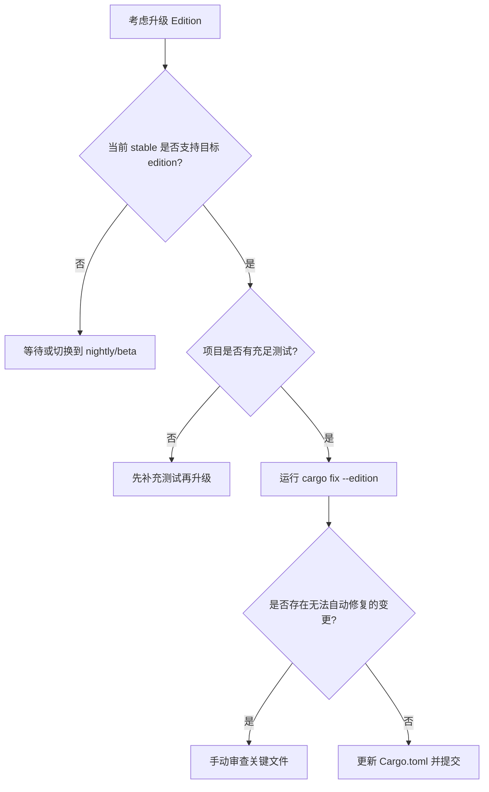

# Rust Editions（语言版本）

> **EN**: Rust Editions
> **Summary**: The Rust Edition mechanism: 2015, 2018, 2021, and 2024 editions, their key differences, how to choose and migrate using `cargo fix --edition`, and the relationship between edition and toolchain version.
>
> **受众**: [进阶]
> **内容分级**: [参考级]
> **Bloom 层级**: 理解 → 应用
> **A/S/P 标记**: **S** — Specification
> **双维定位**: S×App — 规范应用
> **前置依赖**: [Toolchain](../../06_ecosystem/00_toolchain/01_toolchain.md) · [Cargo Getting Started](../../06_ecosystem/01_cargo/80_cargo_getting_started.md) · [Module System](../05_modules_and_visibility/10_module_system.md)
> **后置概念**: [Async Advanced](../../03_advanced/01_async/25_async_advanced.md) · [Cargo 1.96 Features](../../06_ecosystem/01_cargo/76_cargo_196_features.md) · [Rust Release Process](33_rust_release_process.md) · [Edition Guide](../../07_future/01_edition_roadmap/44_edition_guide.md)
> **L1 基础依赖**: [Ownership](../../01_foundation/01_ownership_borrow_lifetime/01_ownership.md) · [Borrowing](../../01_foundation/01_ownership_borrow_lifetime/02_borrowing.md) · [Module System](../05_modules_and_visibility/10_module_system.md)
> **定理链**: Compiler Version → Edition → Syntax/Behavior → Migration
>
> **来源**: [The Rust Programming Language — Appendix E: Editions](https://doc.rust-lang.org/book/appendix-05-editions.html) · [Rust Edition Guide](https://doc.rust-lang.org/edition-guide/index.html) · [Rust Reference — Editions](https://doc.rust-lang.org/reference/items.html?search=edition)

---

---

## 认知路径

> **认知路径**: 本节从 "Rust Editions" 的核心问题出发，依次建立直观理解、形式化模型与工程实践之间的联系。

1. **问题识别**: 为什么 Rust 需要 Edition 机制？它与 C/C++ 大版本破坏性更新有何不同？
2. **概念建立**: 掌握 Edition 的定义、版本选择规则、`cargo fix` 迁移工具与 `rust-version` 字段的区别。
3. **机制推理**: 通过 ⟹ 定理链将编译器版本、Edition、语法行为、迁移路径串联起来。
4. **边界辨析**: 借助反命题/反例理解 Edition 与依赖混用、最低工具链要求等边界。
5. **迁移应用**: 将 Edition 知识与 [模块系统](../05_modules_and_visibility/10_module_system.md)、[async](../../03_advanced/01_async/25_async_advanced.md)、[发布流程](33_rust_release_process.md) 链接。

---

## 反命题决策树

> **反命题 1**: "Edition 会强制所有依赖同步升级" ⟹ 不成立。每个 crate 可独立选择 edition，同一编译单元内可混用不同 edition 的依赖。

> **反命题 2**: "设置 `edition = "2024"` 后旧代码一定能编译" ⟹ 不成立。Edition 引入非兼容语法变更，需通过 `cargo fix --edition` 或手动调整。

> **反命题 3**: "`rust-version` 与 `edition` 是同一回事" ⟹ 不成立。`edition` 控制语法/语义版本，`rust-version` 声明最低编译器版本，是不同维度的约束。

---

## 一、什么是 Edition

**Edition** 是 Rust 语言在保持向后兼容的前提下引入非兼容性语法/语义变更的机制。每个 crate 可独立选择 edition，同一编译单元内可混用不同 edition 的依赖。

关键原则：

- 同一 `rustc` 版本可编译多个 edition。
- 依赖的 edition 不影响当前 crate 的编译。
- 新 edition 大约每 2–3 年发布一次，随新的 stable 工具链启用。

---

## 二、主要 Edition 对比

| Edition | 稳定版本 | 主要变化 |
|:---|:---:|:---|
| 2015 | 1.0 | 初始版本；模块路径需要 `extern crate`；trait 对象可省略 `dyn` |
| 2018 | 1.31 | 模块系统简化（`mod` 自动解析）、路径统一为 `crate::`、NLL、`async`/await 语法准备、`dyn Trait` 必须显式 |
| 2021 | 1.56 | prelude 新增 `TryFrom`/`TryInto`/`FromIterator`、数组实现 `IntoIterator`、panic 宏（Macro）一致性、保留语法 |
| 2024 | 1.85+ | `if let` 临时作用域收窄、`gen` 关键字保留、异步闭包、`match` 人体工学改进、never type fallback |

### 代码示例对比

2015 Edition：

```rust
extern crate serde;
mod foo;

fn main() {
    let trait_obj: &Serialize = &1; // 可省略 dyn
}
```

2018+ Edition：

```rust
use serde::Serialize;

fn main() {
    let trait_obj: &dyn Serialize = &1;
}
```

2021 Edition：

```rust
fn main() {
    let arr = [1, 2, 3];
    for x in arr {
        // 2021: 按值迭代数组；2018: 默认按引用
        println!("{x}");
    }
}
```

---

## 三、选择 Edition

在 `Cargo.toml` 中声明：

```toml
[package]
name = "myproj"
version = "0.1.0"
edition = "2024"
rust-version = "1.85"
```

- 新推荐使用最新稳定 edition。
- 依赖 crate 的 edition 不影响当前 crate 的编译。
- `rust-version` 让 Cargo 在低于该版本的编译器上给出清晰错误。

---

## 四、迁移流程

```bash
# 1. 确保当前代码在最新 stable 上编译通过
rustup update stable

# 2. 预览将要应用的变更
cargo fix --edition --dry-run

# 3. 自动应用 edition 迁移
cargo fix --edition

# 4. 更新 Cargo.toml 中的 edition 字段
# edition = "2024"

# 5. 重新编译并检查测试
cargo test
```

迁移工具会：

1. 扫描需要调整的代码。
2. 应用机械式重写。
3. 对无法自动处理的部分给出警告。

---

## 五、Edition 与工具链版本的关系

| 维度 | `edition` | `rust-version` |
|:---|:---|:---|
| 控制内容 | 语法与语义版本 | 最低 `rustc` 版本 |
| 取值示例 | `"2015"` / `"2018"` / `"2021"` / `"2024"` | `"1.70"` / `"1.85"` |
| 是否影响依赖编译 | 否（仅当前 crate） | 否（仅提示信息） |
| 与编译器关系 | 一个 `rustc` 可编译多个 edition | 必须 >= 指定版本 |

---

## 六、何时升级 Edition



| 情况 | 建议 |
|:---|:---|
| 全新项目 | 直接使用最新稳定 edition |
| 维护期项目 | 在主要 release 或新功能开发期升级 |
| 大量 unsafe/宏 | 预留更多时间手动审查 |
| 依赖链老旧的 crate | 优先升级依赖，再升级自身 edition |

---

## 七、关联概念

| 概念 | 关系 |
|:---|:---|
| [Module System](../05_modules_and_visibility/10_module_system.md) | 2018 Edition 重大改进了模块路径 |
| [Async Advanced](../../03_advanced/01_async/25_async_advanced.md) | `async`/await 语法随 2018 Edition 引入 |
| [Rust Release Process](33_rust_release_process.md) | 新 edition 随 stable 版本发布 |
| [Edition Guide](../../07_future/01_edition_roadmap/44_edition_guide.md) | 详细的 edition 差异说明 |
| [Rust Version Tracking](../../07_future/00_version_tracking/05_rust_version_tracking.md) | 跟踪各版本与 edition 的对应关系 |
| [Cargo Getting Started](../../06_ecosystem/01_cargo/80_cargo_getting_started.md) | `Cargo.toml` 基础 |

---

> **权威来源**: [TRPL — Appendix E](https://doc.rust-lang.org/book/appendix-05-editions.html) · [Rust Edition Guide](https://doc.rust-lang.org/edition-guide/index.html)
> **内容分级**: [参考级]
