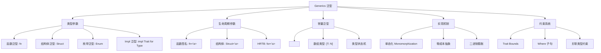
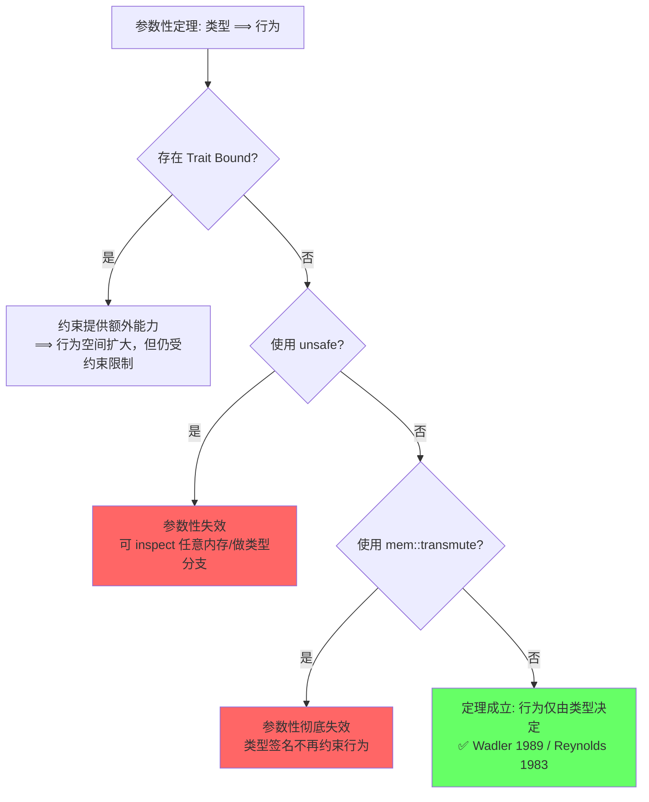
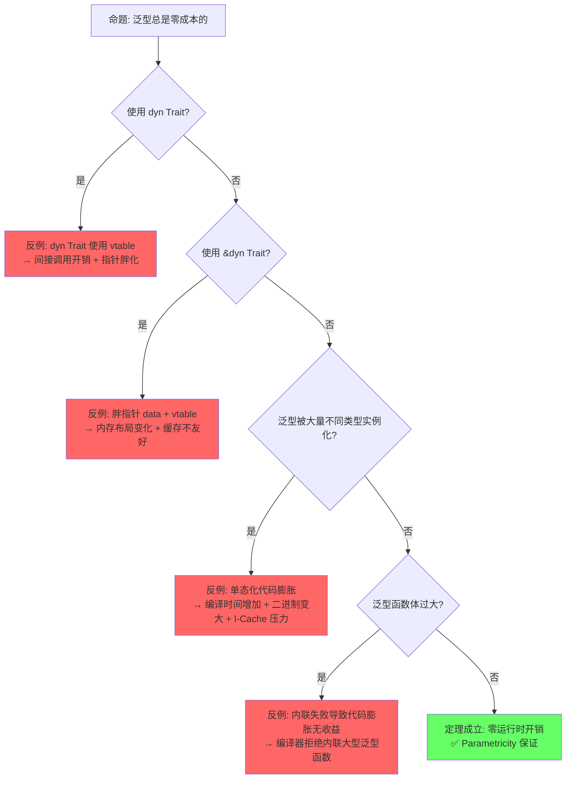
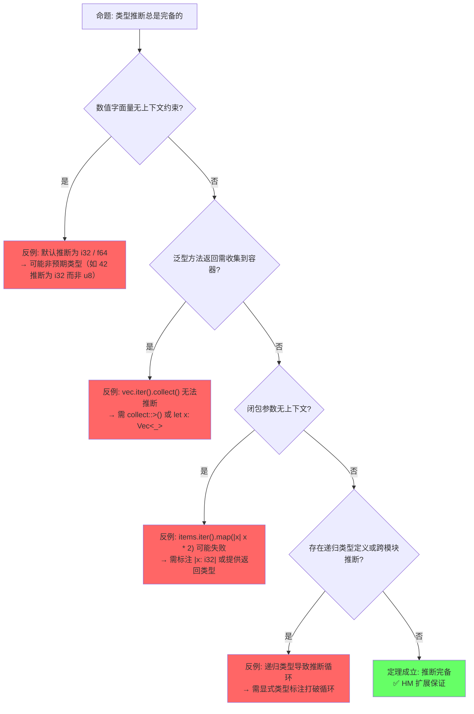
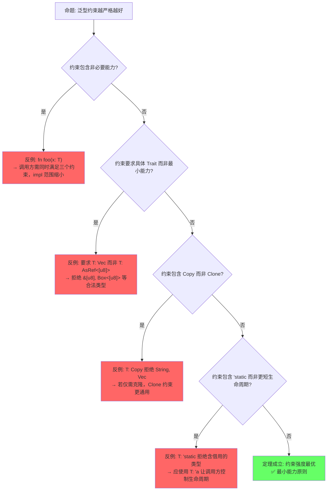
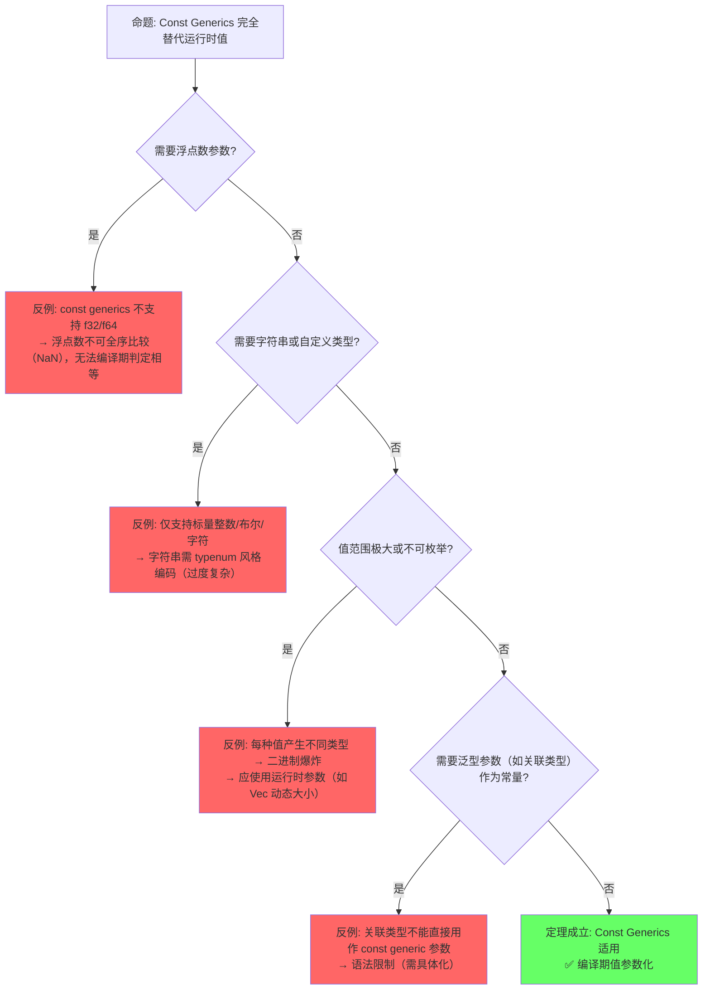

> **内容分级**: [综述级]
> [综述级]
> **本节关键术语**: 泛型 (Generics) · 类型参数 (Type Parameter) · 约束 (Bound) · where 子句 · 单态化 (Monomorphization) — [完整对照表](../../00_meta/01_terminology/terminology_glossary.md)
>
# Generics（泛型系统）
>
> **EN**: Generics
> **Summary**: Generics. Parametric polymorphism in Rust enabling type-safe, reusable code across types. Covers generic functions, structs, trait bounds, and monomorphization trade-offs.
> **📎 交叉引用（Reference）**
>
> 本主题在 knowledge 中有系统化的知识索引：[泛型（Generics）](02_generics.md)
> **受众**: [进阶]
> **层次定位**: L2 进阶概念 / 泛型（Generics）子域
> **A/S/P 标记**: **A+S** — Application + Structure
> **双维定位**: C×App — 实施泛型（Generics）参数化设计
> **前置依赖**: L1 类型系统（Type System） · [L2 Trait](../00_traits/01_traits.md)
> **后置延伸**: [L3 Async](../../03_advanced/01_async/02_async.md) · [L4 类型论](../../04_formal/00_type_theory/02_type_theory.md) · [L7 效果系统](../../07_future/03_preview_features/04_effects_system.md)
> **跨层映射**: L2→L4 参数多态 ↔ System F | L2→L7 泛型（Generics）效果 → Effect System
> **定理链编号**: T-030 参数多态保持 → T-031 单态化（Monomorphization） [来源: [Rust Reference — Monomorphization](https://doc.rust-lang.org/reference/items/generics.html) · [Itanium C++ ABI](https://itanium-cxx-abi.github.io/cxx-abi/abi.html)]正确性 → T-032 约束满足可判定
> **层级**: L2 进阶概念
> **前置概念**: [Type System Basics](../../01_foundation/02_type_system/04_type_system.md) · [Traits](../00_traits/01_traits.md)
> **后置概念**: [Advanced Lifetimes](../../01_foundation/01_ownership_borrow_lifetime/03_lifetimes.md) · [GATs](../../03_advanced/01_async/02_async.md) · [Const Generics [来源: [RFC 2000](https://rust-lang.github.io/rfcs//2000-const-generics.html)]]
> **主要来源**: [Itanium C++ ABI](https://itanium-cxx-abi.github.io/cxx-abi/abi.html) · [Brown University — Concepts in Rust Programming](https://cel.cs.brown.edu/crp/) · [Jung et al. — RustBelt: Securing the Foundations of Rust](https://plv.mpi-sws.org/rustbelt/popl18/)
> [TRPL: Ch10.1](https://doc.rust-lang.org/book/ch10-01-syntax.html) ·
> [Rust Reference: Generic Parameters](https://doc.rust-lang.org/reference/items/generics.html) ·
> [Wikipedia: Generic programming](https://en.wikipedia.org/wiki/Generic_programming) ·
> [RFC 2000](https://rust-lang.github.io/rfcs//2000-const-generics.html)

---

> ⚠️ **不稳定特性警告**: 本文件包含 `#![feature(...)]` 标注的代码示例，需要 **nightly 工具链** 编译。
> **使用方式**: `rustup run nightly rustc ...` 或 `cargo +nightly ...`
> **状态查询**: <https://doc.rust-lang.org/nightly/unstable-book/index.html>
> **注意**: 不稳定特性可能在后续版本中变更或移除，生产代码应避免依赖。

---
> **Bloom 层级**: 应用 → 分析 → 评价
**变更日志**:

- v2.5 (2026-05-14):
  深化 min_specialization（default impl 交互、&str/String 优化用例）、
  泛型（Generics）编译时间优化（cargo bloat、thin LTO、单态化（Monomorphization）膨胀成因）、
  Type-level Programming（typenum UInt/UTerm、与 Const Generics 对比、历史背景）；
  更新 TODO 列表
- v2.4 (2026-05-14):
  补充 Const Generics 进阶用法——表达式与 generic_const_exprs、where 约束深度分析、与 GATs 交互、固定大小数组数学运算与类型状态机典型应用、与 C++ 模板非类型参数对比；更新 TODO 列表
- v2.3 (2026-05-13):
  补充 min_specialization 状态与限制、泛型编译时间优化策略（Turbofish / dyn Trait / -Zshare-generics）、Type-level Programming（Peano 算术与 typenum）、GATs 完整形式化视角（System F_ω / HKT / Lending Iterator 类型论分析）；更新 TODO 列表
- v2.2 (2026-05-13):
  深度重构——新增 §5.5 参数性定理（Wadler 1989），含3个示例推导、工程意义、反例边界与 Mermaid 推理树；
  增强 §4.2 单态化（Monomorphization）语义保持定理与证明草图、dyn Trait 反例、跨 crate ABI 边界；
  新增 §5.6 三语言实现机制对比表；定理矩阵扩至13条；
  全章补充 L4 类型论映射标注与过渡段落
- v2.1 (2026-05-12):
  深度重构——定理矩阵扩至11条（含失效条件/错误码/依赖链），反命题决策树增至4个（新增"约束过度"命题），边界极限测试精炼为3个极限场景，认知路径6步递进每步增加正反例对照，全章补充Wikipedia/TRPL/RFC交叉引用（Reference）与过渡段落
- v2.0 (2026-05-12): 补充定理推理链（⟹ 标注）、反命题决策树系统、边界极限测试、6步认知路径与章节过渡
- v1.0 (2026-05-12): 初始版本

---

## 📑 目录

- [Generics（泛型系统）](#generics泛型系统)
  - [📑 目录](#-目录)
  - [一、权威定义（Definition）](#一权威定义definition)
    - [1.1 Wikipedia 对齐定义](#11-wikipedia-对齐定义)
    - [1.2 TRPL 官方定义](#12-trpl-官方定义)
    - [1.3 形式化定义](#13-形式化定义)
  - [二、概念属性矩阵（Attribute Matrix）](#二概念属性矩阵attribute-matrix)
    - [2.1 泛型参数类型矩阵](#21-泛型参数类型矩阵)
    - [2.2 泛型实现机制对比](#22-泛型实现机制对比)
    - [2.3 泛型约束演进矩阵](#23-泛型约束演进矩阵)
  - [三、思维导图（Mind Map）](#三思维导图mind-map)
  - [四、定理推理链（Theorem Chain）](#四定理推理链theorem-chain)
    - [4.1 引理：参数多态 ⟹ System F 类型规则](#41-引理参数多态--system-f-类型规则)
    - [4.2 定理：单态化 ⟹ 零成本抽象 ⟹ 语义保持](#42-定理单态化--零成本抽象--语义保持)
    - [4.3 推论：Const Generics ⟹ 类型级编程](#43-推论const-generics--类型级编程)
    - [4.4 约束多态的类型安全](#44-约束多态的类型安全)
    - [4.5 定理一致性矩阵](#45-定理一致性矩阵)
  - [五、示例与反例（Examples \& Counter-examples）](#五示例与反例examples--counter-examples)
    - [5.1 正确示例：泛型函数与约束](#51-正确示例泛型函数与约束)
    - [5.2 正确示例：常量泛型](#52-正确示例常量泛型)
    - [5.3 反例：类型大小未知（E0277）](#53-反例类型大小未知e0277)
    - [5.4 反例：生命周期约束不足（E0310）](#54-反例生命周期约束不足e0310)
    - [5.5 参数性定理（Theorems for Free）](#55-参数性定理theorems-for-free)
    - [5.6 泛型实现机制对比：单态化 vs 类型擦除 vs 模板](#56-泛型实现机制对比单态化-vs-类型擦除-vs-模板)
    - [5.7 Const Generics 进阶用法](#57-const-generics-进阶用法)
      - [5.7.1 常量表达式与 `generic_const_exprs`](#571-常量表达式与-generic_const_exprs)
      - [5.7.2 where 约束中的 const generics](#572-where-约束中的-const-generics)
      - [5.7.3 默认 const generic 参数](#573-默认-const-generic-参数)
      - [5.7.4 与 const fn 协同：编译期计算](#574-与-const-fn-协同编译期计算)
      - [5.7.5 Const Generics 与泛型关联类型的交互](#575-const-generics-与泛型关联类型的交互)
      - [5.7.6 典型应用：固定大小数组的数学运算](#576-典型应用固定大小数组的数学运算)
      - [5.7.7 与 C++ 模板非类型参数的对比](#577-与-c-模板非类型参数的对比)
  - [六、反命题与边界分析（Counter-proposition \& Boundary Analysis）](#六反命题与边界分析counter-proposition--boundary-analysis)
    - [6.1 反命题 1: "泛型总是零成本的"](#61-反命题-1-泛型总是零成本的)
    - [6.2 反命题 2: "类型推断总是完备的"](#62-反命题-2-类型推断总是完备的)
    - [6.3 反命题 3: "泛型约束越严格越好"](#63-反命题-3-泛型约束越严格越好)
    - [6.4 反命题 4: "Const Generics 完全替代运行时值"](#64-反命题-4-const-generics-完全替代运行时值)
  - [七、边界极限测试代码（Boundary Limit Tests）](#七边界极限测试代码boundary-limit-tests)
    - [7.1 测试 1: 单态化代码膨胀与 dyn Trait 权衡极限](#71-测试-1-单态化代码膨胀与-dyn-trait-权衡极限)
    - [7.2 测试 2: 生命周期约束递归传递与 HRTB 边界](#72-测试-2-生命周期约束递归传递与-hrtb-边界)
    - [7.3 测试 3: Const Generics 类型级运算与特化边界](#73-测试-3-const-generics-类型级运算与特化边界)
  - [八、认知路径（Cognitive Path）](#八认知路径cognitive-path)
    - [Step 1: 直觉类比 — "泛型像填空题模板"](#step-1-直觉类比--泛型像填空题模板)
    - [Step 2: 语法熟悉 — 参数声明与使用](#step-2-语法熟悉--参数声明与使用)
    - [Step 3: 机制困惑 — 单态化与类型擦除](#step-3-机制困惑--单态化与类型擦除)
    - [Step 4: 类型论映射 — System F 与参数性](#step-4-类型论映射--system-f-与参数性)
    - [Step 5: 约束系统 — Trait Bounds 与 where 子句](#step-5-约束系统--trait-bounds-与-where-子句)
    - [Step 6: 形式化掌控 — 设计验证与工程权衡](#step-6-形式化掌控--设计验证与工程权衡)
  - [九、知识来源关系（Provenance）](#九知识来源关系provenance)
    - [9.1 补充：`impl Trait` 在返回位置 vs 参数位置的区别](#91-补充impl-trait-在返回位置-vs-参数位置的区别)
      - [参数位置 `impl Trait` = Universal（全称）](#参数位置-impl-trait--universal全称)
      - [返回位置 `impl Trait` = Existential（存在）](#返回位置-impl-trait--existential存在)
      - [对比矩阵](#对比矩阵)
      - [返回位置 impl Trait 在 trait 中的特殊规则（RPITIT）](#返回位置-impl-trait-在-trait-中的特殊规则rpitit)
    - [9.2 补充：`min_specialization` 的当前状态与使用](#92-补充min_specialization-的当前状态与使用)
      - [与 full specialization 的核心区别](#与-full-specialization-的核心区别)
      - [为什么限制为 min\_specialization](#为什么限制为-min_specialization)
      - [与 `default impl` 的交互](#与-default-impl-的交互)
      - [实际用例：为 `&str` 和 `String` 提供不同优化实现](#实际用例为-str-和-string-提供不同优化实现)
    - [9.3 补充：泛型代码的编译时间优化策略](#93-补充泛型代码的编译时间优化策略)
      - [策略 1：Turbofish 显式标注减少类型推断开销](#策略-1turbofish-显式标注减少类型推断开销)
      - [策略 2：dyn Trait 替代单态化（运行时代码共享）](#策略-2dyn-trait-替代单态化运行时代码共享)
      - [策略 3：编译单元拆分与 `-Zshare-generics`](#策略-3编译单元拆分与--zshare-generics)
      - [策略 4：`cargo bloat` 工具——量化单态化膨胀](#策略-4cargo-bloat-工具量化单态化膨胀)
      - [策略 5：`thin LTO` 与泛型编译时间优化](#策略-5thin-lto-与泛型编译时间优化)
    - [9.4 补充：Type-level Programming（Peano 算术与 typenum）](#94-补充type-level-programmingpeano-算术与-typenum)
      - [Peano 数编码：理论模型](#peano-数编码理论模型)
      - [typenum：工业级类型级整数](#typenum工业级类型级整数)
      - [generic-array：类型级数组长度](#generic-array类型级数组长度)
      - [`typenum` 的核心类型：`UInt`、`UTerm` 与二进制编码](#typenum-的核心类型uintuterm-与二进制编码)
      - [与 Const Generics 的对比：Type-level vs Value-level](#与-const-generics-的对比type-level-vs-value-level)
      - [历史背景：Const Generics 之前的唯一方式](#历史背景const-generics-之前的唯一方式)
      - [边界：编译时间膨胀与错误信息可读性](#边界编译时间膨胀与错误信息可读性)
    - [9.5 补充：Generic Associated Types (GATs) 的完整形式化视角](#95-补充generic-associated-types-gats-的完整形式化视角)
      - [GATs 与 System F\_ω 的映射](#gats-与-system-f_ω-的映射)
      - [GATs vs HKT（Haskell Higher-Kinded Types）](#gats-vs-hkthaskell-higher-kinded-types)
      - [Lending Iterator 的完整类型论分析](#lending-iterator-的完整类型论分析)
  - [十、Rust 2024 Edition：`use<..>` Precise Capturing（RFC 3617）](#十rust-2024-editionuse-precise-capturingrfc-3617)
    - [10.1 问题：隐式捕获的泄漏](#101-问题隐式捕获的泄漏)
    - [10.2 解决方案：显式捕获](#102-解决方案显式捕获)
    - [10.3 形式化视角：存在类型的区域量化](#103-形式化视角存在类型的区域量化)
    - [10.4 与 2024 Edition 的关系](#104-与-2024-edition-的关系)
  - [十一、相关概念链接](#十一相关概念链接)
  - [十一、待补充与演进方向（TODOs）](#十一待补充与演进方向todos)
    - [11.1 `min_specialization` 的当前状态与使用](#111-min_specialization-的当前状态与使用)
    - [11.2 泛型代码的编译时间优化策略](#112-泛型代码的编译时间优化策略)
    - [11.3 Type-level Programming](#113-type-level-programming)
    - [11.4 `impl Trait` 在返回位置 vs 参数位置](#114-impl-trait-在返回位置-vs-参数位置)
    - [11.5 Generic Associated Types（GATs）的形式化视角](#115-generic-associated-typesgats的形式化视角)
    - [11.6 Const Generics 进阶用法](#116-const-generics-进阶用法)
  - [权威来源索引](#权威来源索引)
  - [十二、边界测试：泛型规则的编译错误](#十二边界测试泛型规则的编译错误)
    - [12.1 边界测试：泛型参数未约束（编译错误）](#121-边界测试泛型参数未约束编译错误)
    - [12.2 边界测试：递归类型的大小无限（编译错误）](#122-边界测试递归类型的大小无限编译错误)
    - [12.3 边界测试：关联类型实现不一致（编译错误）](#123-边界测试关联类型实现不一致编译错误)
    - [12.4 边界测试：泛型默认类型参数不满足约束（编译错误）](#124-边界测试泛型默认类型参数不满足约束编译错误)
    - [12.5 边界测试：泛型常量表达式求值失败（编译错误）](#125-边界测试泛型常量表达式求值失败编译错误)
    - [12.6 边界测试：递归类型无限大小（编译错误）](#126-边界测试递归类型无限大小编译错误)
    - [12.7 边界测试：泛型 trait bound 传递失败（编译错误）](#127-边界测试泛型-trait-bound-传递失败编译错误)
    - [10.5 边界测试：泛型约束的传递性与 trait bound 推导（编译错误）](#105-边界测试泛型约束的传递性与-trait-bound-推导编译错误)
    - [10.6 边界测试：const generic 的默认参数与数组大小推断（编译错误）](#106-边界测试const-generic-的默认参数与数组大小推断编译错误)
  - [实践](#实践)
  - [逆向推理链（Backward Reasoning）](#逆向推理链backward-reasoning)
  - [参考来源](#参考来源)
  - [嵌入式测验（Embedded Quiz）](#嵌入式测验embedded-quiz)
    - [测验 1：泛型函数（理解层）](#测验-1泛型函数理解层)
    - [测验 2：泛型结构体（应用层）](#测验-2泛型结构体应用层)
    - [测验 3：多个 Trait Bound（应用层）](#测验-3多个-trait-bound应用层)
    - [测验 4：单态化与代码膨胀（分析层）](#测验-4单态化与代码膨胀分析层)
    - [测验 5：关联类型（分析层）](#测验-5关联类型分析层)
  - [从 `crates\c02_type_system\docs\tier_04_advanced\02_advanced_generics_patterns.md` 迁移的补充视角](#从-cratesc02_type_systemdocstier_04_advanced02_advanced_generics_patternsmd-迁移的补充视角)
  - [📋 目录](#-目录-1)
  - [📐 知识结构](#-知识结构)
    - [概念定义](#概念定义)
    - [属性特征](#属性特征)
    - [关系连接](#关系连接)
    - [思维导图](#思维导图)
    - [多维概念对比矩阵](#多维概念对比矩阵)
    - [决策树图](#决策树图)
  - [🎯 概述](#-概述)
  - [1. 类型状态模式](#1-类型状态模式)
    - [1.1 基础类型状态](#11-基础类型状态)
  - [补充视角：crate 实践中的泛型性能与工程权衡](#补充视角crate-实践中的泛型性能与工程权衡)
    - [单态化与代码膨胀](#单态化与代码膨胀)
    - [缓解策略](#缓解策略)
    - [泛型 vs Trait 对象](#泛型-vs-trait-对象)
  - [补充：来自 `crates/c04_generic` 泛型语法参考的速查](#补充来自-cratesc04_generic-泛型语法参考的速查)
    - [类型参数命名约定](#类型参数命名约定)
    - [泛型声明位置速查](#泛型声明位置速查)
    - [Turbofish 语法](#turbofish-语法)

## 一、权威定义（Definition）

### 1.1 Wikipedia 对齐定义

> **[Wikipedia: Generic programming](https://en.wikipedia.org/wiki/Generic_programming)** Generic programming is a style of computer programming in which algorithms are written in terms of types to-be-specified-later that are then instantiated when needed for specific types provided as parameters. Rust uses monomorphization to implement generics, generating specialized code at compile time for each concrete type used.
> 关键区分：Rust 的泛型属于**参数多态**（parametric polymorphism），与 C++ 模板（textual substitution）和 Java 泛型（type erasure）在实现语义上存在本质差异。(Source: [Wikipedia: Parametric polymorphism](https://en.wikipedia.org/wiki/Parametric_polymorphism))

### 1.2 TRPL 官方定义

> **[TRPL: Ch10.1 — Generic Data Types](https://doc.rust-lang.org/book/ch10-01-syntax.html)** Generics are abstract stand-ins for concrete types or other properties. When we're writing code, we can express the behavior of generics or how they relate to other generics without knowing what will be in their place when compiling and running the code.
> **[TRPL: Ch10.2 — Traits as Parameters](https://doc.rust-lang.org/book/ch10-02-traits.html)** Trait bounds ensure that the generic type has the necessary behavior. The compiler uses the bound to check that all concrete types used with the generic code provide the correct behavior.

### 1.3 形式化定义

> **[类型论: Girard-Reynolds System F](https://en.wikipedia.org/wiki/System_F)** ·
> **[Pierce 2002, Ch.23](https://www.cis.upenn.edu/~bcpierce/tapl/)** 泛型对应参数多态，Rust 通过单态化实现，对应 System F 的二阶 λ 演算。 ✅ 已验证

泛型对应**参数多态**（parametric polymorphism），Rust 通过**单态化**（monomorphization）实现：

```text
参数多态（Universal Quantification）:
  fn identity<T>(x: T) -> T { x }
  ≡  ∀T. T → T

单态化实例化:
  identity::<i32>(5)   →  生成 fn identity_i32(x: i32) -> i32
  identity::<String>(s) →  生成 fn identity_String(x: String) -> String

约束多态（Bounded Quantification）:
  fn sum<T: Add<Output=T>>(a: T, b: T) -> T { a + b }
  ≡  ∀T. Add(T) → (T × T → T)
```

> **过渡到属性矩阵**:
> 从形式化定义出发，泛型系统不仅是"类型参数"的简单概念，而是由类型参数、生命周期（Lifetimes）参数、常量泛型、关联类型等构成的多维参数空间。
> 下一节通过属性矩阵对这些参数类型及其约束机制进行系统分类，并与 C++ 模板、Java 类型擦除等实现进行正交对比，为后续定理链建立"参数空间 → 约束系统 → 代码生成"的直觉框架。

---

## 二、概念属性矩阵（Attribute Matrix）

### 2.1 泛型参数类型矩阵
>

| **参数类型** | **语法** | **约束目标** | **默认值** | **使用场景** |
|:---|:---|:---|:---|:---|
| **类型参数** | `<T>` | 类型 | 无 | 最常见，泛型容器/函数 |
| **生命周期（Lifetimes）参数** | `<'a>` | 引用（Reference）有效期 | 推断 | 函数/结构体（Struct）含引用 |

> **形式化对应**: 生命周期（Lifetimes）参数在类型论中对应 **区域类型 (Region Types, Tofte & Talpin 1994)**，即引用（Reference）有效性的形式化约束。详见 L1 生命周期 §4 和 [L4 所有权（Ownership）形式化](../../04_formal/01_ownership_logic/03_ownership_formal.md) §2.2。[Tofte & Talpin 1994 — Region Types](https://doi.org/10.1145/176454.176456)
| **常量泛型** | `<const N: usize>` | 编译期常量值 | 无 | 固定大小数组、类型状态 |(Source: [RFC 2000 — Const Generics](https://rust-lang.github.io/rfcs/2000-const-generics.html))
| **关联类型** | `type Item;` | Trait 内部类型 | 实现时确定 | Iterator、Future 等 |

### 2.2 泛型实现机制对比
>

| **语言** | **机制** | **编译期行为** | **运行时（Runtime）开销** | **二进制膨胀** |
|:---|:---|:---|:---|:---|
| **Rust** | 单态化（Monomorphization） | 为每个具体类型生成专用代码 | 零 | 高（每个实例一份代码） |
| **C++** | 模板实例化（Template Instantiation） | 类似单态化，文本替换后编译 | 零 | 高 |
| **Java** | 类型擦除（Type Erasure） | 编译为 Object，插入类型转换 | 有（装箱/拆箱） | 低 |
| **C#** | Reified generics + JIT | 运行时（Runtime）生成专用代码 | 极低 | 中 |
| **Go** | 接口实现（GCShape stenciling） | 为每个 GC shape 生成一份代码 | 极低 | 中 |
| **Haskell** | 类型类字典传递 | 运行时（Runtime）传递字典指针 | 有（间接调用） | 低 |

> **来源: [Rust Reference: Generic Parameters](https://doc.rust-lang.org/reference/introduction.html)** Rust 泛型通过单态化实现零成本抽象（Zero-Cost Abstraction），为每个具体类型生成专用代码。(Source: [Rust Reference: Generic Parameters](https://doc.rust-lang.org/reference/items/generics.html)) ✅
> **[C++ Reference: Templates](https://en.cppreference.com/w/cpp/templates)** C++ 模板通过文本替换实现编译期实例化，与 Rust 单态化类似但无统一类型检查。 ✅
> **[Java Language Spec: Type Erasure](https://docs.oracle.com/javase/specs/jls/se23/html/jls-4.html#jls-4.6)** Java 泛型通过类型擦除实现，编译为 `Object` 并插入类型转换，有运行时装箱开销。 ✅
> **[Go Spec: Type parameters](https://go.dev/ref/spec#Type_parameters)** Go 1.18+ 泛型通过 GC shape stenciling 实现，为每个 GC shape 生成一份代码，运行时开销极低。 ✅
> **[Pierce, TAPL Ch.23](https://www.cis.upenn.edu/~bcpierce/tapl/)** 参数多态（parametric polymorphism）与约束多态（bounded quantification）的理论基础。 ⚠️（教科书级参考）

### 2.3 泛型约束演进矩阵
>

| **约束形式** | **语法** | **语义** | **Rust 版本** |
|:---|:---|:---|:---|
| **Trait Bound** | `T: Trait` | T 必须实现 Trait | 1.0 |
| **多重约束** | `T: TraitA + TraitB` | T 同时实现两者 | 1.0 |
| **生命周期约束** | `T: 'a` | T 中无短于 `'a` 的引用（Reference） | 1.0 |
| **where 子句** | `where T: Trait` | 复杂约束的清晰表达 | 1.0 |
| **关联类型约束** | `T: Iterator<Item=U>` | 约束关联类型 | 1.0 |
| **高阶 Trait Bound** | `for<'a> T: Trait<'a>` | 对所有生命周期成立 | 1.0 |
| **Const Generics** | `<const N: usize>` | 值级别的泛型 | 1.51+ |
| **GATs** | `type Item<'a>;` | 泛型关联类型 | 1.65+ |

> **过渡到思维导图**: 属性矩阵展示了泛型系统的静态分类，但未能表达概念间的动态关联与编译期行为。思维导图通过拓扑结构揭示泛型从参数声明、约束满足到单态化代码生成的完整概念网络，为定理推理链提供"概念拓扑 → 逻辑推导"的衔接。

---

## 三、思维导图（Mind Map）



> **认知功能**:
> 泛型系统概念拓扑导航图。将分散的语法要素组织为可遍历的知识网络，读者可按分支顺序建立"参数声明→约束施加→代码生成"的完整心智模型。
> 关键洞察：泛型不是单一概念，而是由类型参数、生命周期（Lifetimes）、常量泛型、约束系统构成的多维参数空间。[💡 原创分析](../../00_meta/00_framework/methodology.md)
> [来源: [TRPL — Generics](https://doc.rust-lang.org/book/ch10-00-generics.html)]
> **过渡到定理推理链**:
> 思维导图呈现了泛型系统的概念拓扑，但缺乏严格的逻辑推导关系。
> 下一节通过"⟹"标注的定理链，将参数多态、System F、单态化、零成本抽象（Zero-Cost Abstraction）、Const Generics 等核心命题形式化为可验证的推理网络，每个定理标注其依赖的引理、推论的下游定理，以及失效条件和编译错误码。

---

## 四、定理推理链（Theorem Chain）

### 4.1 引理：参数多态 ⟹ System F 类型规则

> **[Wikipedia: System F](https://en.wikipedia.org/wiki/System_F)** · **[Pierce 2002, Ch.23](https://www.cis.upenn.edu/~bcpierce/tapl/)** Rust 泛型核心对应 Girard-Reynolds System F（二阶 λ 演算）。 ✅ 已验证

```text
前提 1: 泛型函数 <T>fn(x: T) -> T 在类型论中对应全称量词 ∀T. T → T
前提 2: 类型应用（如 identity::<i32>）对应 System F 的实例化规则 (ΛT.e)[τ]
前提 3: 类型检查器验证所有实例满足类型规则（类型替换保持良类型性）
    ↓
引理: 参数多态 ⟹ System F 类型规则
    ↓
定理: Rust 泛型函数的类型安全性由 System F 的良类型性（well-typedness）保证
    ↓
推论: 泛型函数的每个单态化实例都是类型安全的（类型替换引理 / Substitution Lemma）
```

### 4.2 定理：单态化 ⟹ 零成本抽象 ⟹ 语义保持

> **[TRPL: Ch10.1 — Performance of Code Using Generics](https://doc.rust-lang.org/book/ch10-01-syntax.html)** ·
> **[Rust Reference: Monomorphization](https://doc.rust-lang.org/reference/items/generics.html)** ·
> **[Pierce 2002, Ch.23](https://www.cis.upenn.edu/~bcpierce/tapl/)** 单态化生成与手写代码等价的专用实例，LLVM 优化消除额外开销；语义保持性保证单态化不改变程序行为。 ✅ 已验证

```text
前提 1: 泛型函数 <T>fn(x: T) 在编译期为每个具体类型生成专用代码
前提 2: 生成的代码与手写具体类型代码在 MIR/LLVM-IR 层面等价
前提 3: LLVM 优化器可内联、向量化、消除冗余，最终机器码与手写版本一致
前提 4: 单态化是编译期变换，不引入运行时类型信息或间接调用
    ↓
定理 4.2a: 单态化 ⟹ 零成本抽象
    ↓
推论 1: Vec<i32> 和 Vec<String> 的性能等价于手写 IntVec 和 StringVec
推论 2: 动态分发 dyn Trait 打破零成本承诺（vtable 间接调用 + 胖指针）
代价: 编译时间增加 + 二进制体积膨胀（每个实例独立编译和链接）
```

**语义保持定理（Monomorphization Semantic Preservation）**: 来源: [Rust Reference: Monomorphization](https://doc.rust-lang.org/reference/items/generics.html)

```text
前提: 泛型函数 G<T> 对类型参数 τ 单态化为 G_τ
前提: G<T> 在单线程、无 unsafe 代码、无 I/O 的纯函数语义下良定义
    ↓
定理 4.2b: ∀τ. G<T>[T↦τ] ≡ G_τ
    （单态化后的代码与原泛型代码在单线程下行为等价）
    ↓
证明草图:
  1. 单态化对每个具体类型参数 τ，将类型变量 T 替换为 τ
  2. 替换后的 MIR 中所有泛型调用解析为具体函数实例
  3. 无运行时类型信息（RTTI），无动态分发表（vtable）参与
  4. 因此执行轨迹与手写版本 G_τ 逐指令等价（同构）
  5. 由参数性定理（§5.5），泛型函数不能基于 T 的内部表示做分支
  6. 故单态化不改变可观察行为 ⟹ 语义保持 ∎
```

**反例：`dyn Trait` 打破单态化语义保持的强等价**: 来源: [Rust Reference: Trait Objects](https://doc.rust-lang.org/reference/types/trait-object.html)

| 维度 | 单态化 `Vec<i32>::push` | 动态分发 `dyn Drawable::draw` |
|:---|:---|:---|
| **调用方式** | 直接内联调用，编译期解析 | 通过 vtable 间接调用，运行时解析 |
| **类型信息** | 无 RTTI，零运行时开销 | 胖指针 `(data, vtable)`，有内存开销 |
| **性能** | 等价手写版本，可内联优化 | 不可内联，有间接跳转开销 |
| **语义** | 行为等价于手写专用代码 | 行为等价，但性能不等价 |

```rust,ignore
// 单态化：每个调用点生成专用代码，直接内联
fn push_mono(v: &mut Vec<i32>, x: i32) {
    v.push(x);  // 编译为 Vec<i32>::push 的直接调用，可内联
}

// 动态分发：通过 vtable 间接调用，无法内联
fn draw_dyn(d: &dyn Drawable) {
    d.draw();  // 从胖指针提取 vtable 指针，间接跳转
}
```

**边界：单态化不保持跨 crate 的 ABI 兼容性**: 来源: [Rust Reference: Monomorphization](https://doc.rust-lang.org/reference/items/generics.html)

```text
边界条件: 单态化在每个 crate 中独立进行
    ↓
后果: Crate A 中实例化的 Vec<i32> 与 Crate B 中实例化的 Vec<i32>
      在机器码层面是重复代码，不共享符号地址
    ↓
工程意义: 这正是 dyn Trait 存在的根本原因——
          当需要跨 crate 动态链接、插件系统或类型未知时，
          必须牺牲零成本以换取 ABI 兼容性
```

> **L4 映射**: 本定理对应类型论中的 **擦除语义（erasure semantics）**——单态化是 System F 到一阶 λ 演算的编译期擦除，保留行为但消除多态性。对比 `dyn Trait` 的 **存在类型（Existential Type）** 语义，后者保留多态性但引入运行时开销。

### 4.3 推论：Const Generics ⟹ 类型级编程

> **[RFC 2000 — Const Generics](https://rust-lang.github.io/rfcs//2000-const-generics.html)** · **[Rust Reference: Const Generics](https://doc.rust-lang.org/reference/items/generics.html)** Const generics 将值引入类型系统（Type System），是依赖类型的有限形式。 ✅ 已验证

```text
前提 1: 常量泛型参数 <const N: usize> 在编译期求值为具体值
前提 2: 不同类型参数产生不同类型（Buffer<i32, 4> ≠ Buffer<i32, 8>）
前提 3: 常量表达式在编译期可判定相等性（const evaluation）
    ↓
引理: Const Generics 提供值到类型的映射（value-to-type lifting）
    ↓
推论: Const Generics ⟹ 类型级编程（type-level programming）
    ↓
边界: 常量参数不能是浮点数、字符串或用户定义类型（目前仅限标量整数/布尔/字符）
      浮点数不可全序比较（NaN），字符串长度非编译期常量
```

### 4.4 约束多态的类型安全

> **[Rust Reference: Trait Bounds](https://doc.rust-lang.org/reference/trait-bounds.html)** · **[TRPL: Ch10.2](https://doc.rust-lang.org/book/ch10-02-traits.html)** Trait Bounds 在编译期验证类型能力，泛型函数体调用保证类型安全。 ✅ 已验证

```text
前提: <T: Trait> 约束确保 T 具有 Trait 定义的所有方法，且方法签名一致
    ↓
定理: 在泛型函数体内调用 Trait 方法是类型安全的（编译期解析，静态分发）
    ↓
推论: 泛型函数的验证与具体类型函数同等严格
      不需要运行时类型检查（对比 Java 的类型擦除 + 转换 + 可能 ClassCastException）
      不满足约束即编译错误（E0277），而非运行时异常
```

### 4.5 定理一致性矩阵

> **[原创分析]** · **[Rust Reference: Generic Parameters](https://doc.rust-lang.org/reference/items/generics.html)** 泛型定理矩阵基于 Rust 类型系统（Type System）约束可满足性和单态化语义。 💡 原创分析

| **定理/引理/推论** | **前提** | **结论** | **依赖的 L4 公理** | **被哪些定理依赖** | **失效条件** | **典型错误码** |
|:---|:---|:---|:---|:---|:---|:---|
| **引理**: 参数多态 ⟹ System F | 泛型参数合法声明，类型变量分离 | 类型规则可判定，替换保持良类型 | System F 良类型性 | 约束可满足性、泛型一致性（Coherence） | `for<'a>` 过度约束不可满足 | — |
| **定理**: 单态化 ⟹ 零成本 | 泛型函数编译时实例化，LLVM 可优化 | 无运行时开销，机器码等价手写 | Parametricity（参数性定理） | 所有性能敏感代码路径 | `dyn Trait` 动态分发引入 vtable | E0038 |
| **推论**: Const Generics ⟹ 类型级编程 | 常量参数为编译期求值标量 | 类型参数包含常量值，值决定类型 | 依赖类型基础（有限形式） | 数组抽象、类型级状态机 | 非 const 表达式或浮点参数 | E0435 |
| **定理**: 约束可满足性 | where 子句为 Horn 子句形式 | 类型推导可判定，Trait 解析终止 | HM 推断扩展 | Trait 解析、编译通过 | GATs 无界递归导致不终止 | E0275 |
| **引理**: HRTB 全称约束 | `for<'a>` 合法，高阶函数签名良构 | 高阶函数类型安全，生命周期无关性 | 全称量词 (∀) 语义 | 回调抽象、生命周期擦除 | 过度约束不可满足，闭包（Closures）推断失败 | E0582 |
| **推论**: 泛型一致性（Coherence） | 单态化后类型检查通过 | 所有实例类型安全，行为一致 | 类型替换引理（Substitution Lemma） | — | `transmute` 绕过类型系统（Type System） | E0133 |
| **引理**: 关联类型归一化 | 关联类型有唯一实现，无重叠 | 类型别名可替换，Trait 方法可解析 | 约束可满足性 | GATs 使用、Iterator 实现 | 重叠关联类型定义（coherence 破坏） | E0119 |
| **定理**: 生命周期约束可满足 | `T: 'a` 合法，区域包含关系成立 | 无悬垂引用（Reference），借用（Borrowing）检查通过 | 区域子类型（Region Subtyping） | 泛型生命周期安全 | 约束遗漏，T 含短于 'a 的引用 | E0310 |
| **引理**: Sized 默认约束 ⟹ 静态分发 | T 默认 Sized，内存布局已知 | 单态化生成确定代码，无动态分发 | Sized trait 语义 | 泛型数据结构布局 | `?Sized` 使用但未正确处理 DST | E0277 |
| **定理**: 类型推断可判定性 | HM 算法扩展，约束图无环 | 主类型存在时可自动推导 | Hindley-Milner 类型推断（Type Inference） | 泛型函数调用、闭包（Closures）参数 | 多解歧义（collect、数值字面量） | E0282/E0283 |
| **推论**: impl Trait 隐藏 ⟹ 抽象能力 | 返回位置 impl Trait 合法使用 | 隐藏具体类型，保持零成本 | 存在类型（Existential Type） | API 设计、抽象类型返回 | 参数位置 impl Trait 在 Trait 方法中 | E0562/E0666 |
| **定理**: 参数性 ⟹ 行为由类型决定 | 无 Trait Bound 的纯参数多态 | 函数行为空间仅由类型签名决定 | Reynolds / Wadler 参数性 | API 推理、形式化验证 | `Default` bound / `unsafe` / `transmute` | E0133 |
| **定理**: 单态化语义保持 | 无 `dyn Trait`，无 `unsafe` | 单态化后行为等价于原泛型代码 | 擦除语义（Erasure Semantics） | 编译正确性证明 | `dyn Trait` 引入动态分发 | E0038 |

> **一致性（Coherence）检查**:
> 参数多态 ⟹ System F 类型规则 ⟹ 约束可满足性 ⟹ 单态化零成本 ⟹ 语义保持 ⟹ 泛型一致性（Coherence），形成**从类型规则到代码生成到运行时保证**的完整推理链。
> 参数性定理（Wadler 1989）是单态化语义保持的核心依据——正因泛型函数不能基于类型参数的内部表示做分支，单态化才保持行为等价。
> Const Generics 是依赖类型的有限形式，HRTB 是全称量词在生命周期上的应用，Sized 默认约束确保单态化所需的静态内存布局。
> **跨层映射**:
> 本文件定理 ↔ [`00_meta/inter_layer_map.md`](../../00_meta/04_navigation/inter_layer_map.md) §4.2 "类型系统（Type System）一致性（Coherence）"
> **过渡到示例与反例**:
> 定理链提供了形式化保证，但工程实践中这些保证的边界在哪里？下一节通过正例展示泛型的正确使用方式，通过反例揭示定理失效的精确条件——特别是 E0277（约束不满足）、E0275（类型递归溢出）、E0310（生命周期不足）等编译错误的触发机制，为反命题决策树建立具体场景。

---

## 五、示例与反例（Examples & Counter-examples）

### 5.1 正确示例：泛型函数与约束

```rust
// ✅ 正确: 泛型函数 + Trait Bound
fn largest<T: PartialOrd + Copy>(list: &[T]) -> T {
    let mut largest = list[0];
    for &item in list.iter() {
        if item > largest { largest = item; }
    }
    largest
}

fn main() {
    let nums = vec![1, 5, 3, 8, 2];
    println!("{}", largest(&nums));  // ✅ 8

    let chars = vec!['a', 'z', 'm'];
    println!("{}", largest(&chars));  // ✅ 'z'
}
```

### 5.2 正确示例：常量泛型

```rust
// ✅ 正确: 常量泛型实现类型级状态机
struct Buffer<T, const SIZE: usize> {
    data: [T; SIZE],
    len: usize,
}

impl<T: Default + Copy, const SIZE: usize> Buffer<T, SIZE> {
    fn new() -> Self {
        Self { data: [T::default(); SIZE], len: 0 }
    }

    fn push(&mut self, item: T) -> Result<(), &'static str> {
        if self.len >= SIZE { return Err("Buffer full"); }
        self.data[self.len] = item;
        self.len += 1;
        Ok(())
    }
}

fn main() {
    let mut buf: Buffer<i32, 4> = Buffer::new();  // SIZE = 4
    buf.push(1).unwrap();
    // Buffer<i32, 4> 和 Buffer<i32, 8> 是不同的类型！
}
```

### 5.3 反例：类型大小未知（E0277）

```rust
// ❌ 反例: 对 unsized 类型直接使用泛型（默认 T: Sized）
trait Drawable { fn draw(&self); }

fn draw_all<T: Drawable>(items: Vec<T>) {  // T 默认要求 Sized
    for item in items { item.draw(); }
}

fn main() {
    let items: Vec<Box<dyn Drawable>> = vec![];
    // draw_all(items);  // 类型不匹配: Box<dyn Drawable> 不满足 Sized
}
```

**修正方案**：

```rust,ignore
// ✅ 修正: 使用 ?Sized 解除 Sized 约束
fn draw_all<T: Drawable + ?Sized>(items: Vec<Box<T>>) {
    for item in items { item.draw(); }
}

// 或直接使用 Trait Object（动态分发）
fn draw_all_dyn(items: Vec<Box<dyn Drawable>>) {
    for item in items { item.draw(); }
}
```

### 5.4 反例：生命周期约束不足（E0310）

```rust
// ❌ 反例: 泛型 T 可能比引用活得更短
struct Wrapper<T> {
    value: T,
}

fn make_wrapper<'a, T>(val: &'a T) -> Wrapper<&'a T> {
    Wrapper { value: val }
}

// 更隐蔽的版本:
struct BadRef<T> {
    // 如果 T 包含引用，它们可能比 BadRef 短
    data: T,
}

fn store<T>(data: T) -> BadRef<T> {
    BadRef { data }
}
```

**修正方案**：

```rust
// ✅ 修正: 显式约束 T 的生命周期
struct GoodRef<'a, T: 'a> {  // T 中所有引用至少活 'a
    data: &'a T,
}

// 或确保 T: 'static 如果要做长期存储
struct LongTermStore<T: 'static> {
    data: T,
}
```

> **过渡到参数性定理**: 前述示例聚焦语法与约束，尚未触及泛型最深层的形式化性质——参数性（Parametricity）。参数性定理揭示：多态函数的行为空间被其类型签名完全约束，无需查看实现即可推理函数能做什么。这一性质是"看类型就知道函数行为"的理论根基，也是单态化语义保持的核心依据。

### 5.5 参数性定理（Theorems for Free）

> **[Wadler 1989 — "Theorems for Free!", POPL](https://dl.acm.org/doi/10.1145/75277.75305)** · **[Pierce 2002, Ch.23](https://www.cis.upenn.edu/~bcpierce/tapl/)** 参数性定理（Reynolds 1983 / Wadler 1989）是参数多态的核心元定理：多态函数的行为仅由其类型决定，与具体类型无关。 ✅ 已验证

**核心定理**: 对于任意无 Trait Bound 的多态函数 `f: ∀T. τ(T)`，其可观察行为完全由类型结构 `τ` 决定，函数不能基于 `T` 的具体内部表示做分支。[Wadler 1989 — Theorems for Free!](https://doi.org/10.1145/99370.99404)

**示例推导 1：`fn f<T>(x: T) -> T`**

```text
类型: ∀T. T → T
可执行的操作:
  1. 返回 x（恒等函数）
  2. 调用 panic! / loop {}（发散）
  3. 不能构造新的 T（不知道该类型的任何构造方式）
  4. 不能 inspect x 的内部结构（无法区分 T 是 i32 还是 String）
结论: 参数性 ⟹ f 只能是恒等函数或发散函数
```

**示例推导 2：`fn g<T, U>(x: T, h: fn(T) -> U) -> U`**

```text
类型: ∀T,U. T → (T → U) → U
可执行的操作:
  1. 必须以某种方式调用 h 来获得 U（没有其他方式构造 U）
  2. 可以将 x 传给 h，或者 panic
  3. 不能构造新的 T（同上）
结论: 参数性 ⟹ g 的行为等价于 λx.λh. h(x) 或其发散变体
```

**示例推导 3：`fn filter<T>(p: fn(T) -> bool, xs: Vec<T>) -> Vec<T>`**

```text
类型: ∀T. (T → bool) × Vec<T> → Vec<T>
可执行的操作:
  1. 输出 Vec<T> 中的每个元素必须来自输入 xs
  2. 不能构造新的 T（无 Trait Bound 时无法构造任意 T）
  3. 不能丢弃 xs 中的元素而不经过 p 判断（除非恒真/恒假）
结论: 参数性 ⟹ 输出是输入的子序列（元素顺序保持，无新构造）
```

**工程意义**: 参数性将类型签名转化为"免费定理"——调用方无需阅读实现即可推断函数的行为边界，显著降低认知负担。类型约束越严格（Trait Bounds），实现空间越小，推理能力越强。[Wadler 1989 / 原创分析](https://doi.org/10.1145/99370.99404)

**反例边界：参数性何时失效**:

```rust,ignore
// ❌ 边界 1: Trait Bound 提供构造能力，打破纯参数性
fn evil<T: Default>() -> T { T::default() }  // 有 Default bound 时可以构造 T

// ❌ 边界 2: unsafe 代码可以绕过类型系统，inspect 任意内存
unsafe fn break_parametricity<T>(x: T) -> T {
    let ptr = &x as *const T as *const u8;
    // 可以读取 T 的内部字节表示，基于内容做分支
    x
}

// ❌ 边界 3: mem::transmute 完全破坏类型抽象
unsafe fn cast_anything<A, B>(a: A) -> B {
    std::mem::transmute(a)  // 参数性彻底失效
}
```



> **认知功能**: 参数性定理适用性判定工具。设计泛型 API 时沿决策树检查"免费定理"是否成立，unsafe 和 Trait Bound 是参数性的两个主要破坏者。关键洞察：只有无约束、无 unsafe 的纯参数多态才能享受"类型签名完全决定行为"的形式化保证。[💡 原创分析](../../00_meta/00_framework/methodology.md)
> **L4 映射**: 参数性定理对应 **Reynolds 关系语义（relational parametricity）**——在逻辑关系中解释多态类型。`∀T. T → T` 的行为约束来自逻辑关系对所有类型的同时满足性，任何基于具体类型的分支都会破坏关系一致性。

### 5.6 泛型实现机制对比：单态化 vs 类型擦除 vs 模板

> **[原创分析]** · **[Wikipedia: Generic programming](https://en.wikipedia.org/wiki/Generic_programming)** 三种主流泛型实现机制在编译期行为、运行时开销、错误信息质量上存在本质差异。 💡 原创分析

| **特性** | **Rust 单态化** | **Java 类型擦除** | **C++ 模板** |
| :--- | :--- | :--- | :--- |
| **实现机制** | 编译期为每个具体类型生成专用代码 | 擦除为 `Object` + 自动插入强制转换 | 文本替换 + 两阶段编译 |
| **运行时开销** | 零（直接调用，可内联） | 有（装箱/拆箱 + 类型转换检查） | 零（与 Rust 类似） |
| **二进制大小** | 膨胀（每个实例一份代码） | 紧凑（共享 Object 代码） | 膨胀（与 Rust 类似） |
| **错误信息** | 清晰（类型检查先于单态化） | 运行时（Runtime） `ClassCastException` | 模板展开后冗长难读 |
| **特化/偏特化** | 支持（`min_specialization`，不稳定） | 不支持 | 支持（完整偏特化） |
| **跨 crate ABI** | 不保持（需 `dyn Trait`） | 保持（擦除后统一） | 不保持（需虚函数） |
| **类型安全保证** | 编译期完全保证 | 运行时可能失败 | 编译期完全保证 |

### 5.7 Const Generics 进阶用法

> **Bloom 层级**: 应用 → 分析
> **[Rust Reference: Const Generics](https://doc.rust-lang.org/reference/items/generics.html)** ·
> **[RFC 2000](https://rust-lang.github.io/rfcs//2000-const-generics.html)** ·
> **[RFC 2920](https://rust-lang.github.io/rfcs//2920-inline-const.html)** Const Generics 将编译期常量值引入类型参数空间，是依赖类型的有限形式。自 Rust 1.51 稳定以来，表达式求值、where 约束、默认参数等能力逐步开放。✅ 已验证

#### 5.7.1 常量表达式与 `generic_const_exprs`

Rust 允许在类型位置使用编译期常量表达式，简单算术可直接书写，复杂表达式需用大括号包裹：来源: [Rust Reference: Const Generics](https://doc.rust-lang.org/reference/items/generics.html#const-generics)

```rust,ignore
// ✅ 合法: 简单算术表达式（1.51+）
fn double_array<T: Default + Copy, const N: usize>() -> [T; N * 2] {
    [T::default(); N * 2]
}

// ✅ 合法: 块表达式包裹复杂运算（1.79+）
fn padded_array<T: Default + Copy, const N: usize>() -> [T; { N + 4 }] {
    [T::default(); { N + 4 }]
}
```

然而，上述表达式能力仅限于**简单算术**和**字面量组合**。
更复杂的类型级计算（如条件分支、递归常量函数结果作为类型参数、关联类型作为常量参数）需要 `generic_const_exprs` 不稳定特性：[来源: [RFC 2920](https://rust-lang.github.io/rfcs//2920-inline-const.html) — generic_const_exprs]

```rust,ignore
#![feature(generic_const_exprs)]

// ✅ 不稳定特性下: 常量表达式可用于类型约束
struct Matrix<T, const R: usize, const C: usize> {
    data: [[T; C]; R],
}

// 类型级条件：仅当 R == C 时实现 SquareMatrix
impl<T, const N: usize> Matrix<T, N, N> {
    fn trace(&self) -> T where T: Default + Add<Output = T> + Copy {
        let mut sum = T::default();
        for i in 0..N {
            sum = sum + self.data[i][i];
        }
        sum
    }
}
```

`generic_const_exprs`（Tracking Issue [#76560](https://github.com/rust-lang/rust/issues/76560)）解锁的核心能力包括：

| **能力** | **语法示例** | **稳定状态** |
| :--- | :--- | :--- |
| 常量表达式作为类型参数 | `[T; N + 1]` | ✅ 1.51+ |
| 块表达式作为类型参数 | `[T; { N * 2 }]` | ✅ 1.79+ |
| 常量表达式用于 where 子句 | `where [T; N]: Sized` | ✅ 1.51+ |
| 关联类型作为 const 参数 | `Foo<{ <T as Trait>::CONST }>` | ❌ 需 `generic_const_exprs` |
| 类型级条件分支 | `impl<T> Foo for Bar where [(); N - 1]: Sized` | ❌ 需 `generic_const_exprs` |
| 递归 const fn 驱动类型构造 | `const fn fib(n: usize) -> usize` | ⚠️ `const fn` 稳定，复杂递归受限 |

> **L4 映射**: `generic_const_exprs` 将 Const Generics 从"常量值的类型参数化"扩展为"类型级计算"，对应依赖类型理论中 **索引类型（Indexed Types）** 的有限形式。
> 但与完整依赖类型（如 Coq、Idris）不同，Rust 的常量表达式必须在编译期完全求值，且不能依赖运行时信息。
> 详见 [L4 形式化验证](../../04_formal/02_separation_logic/04_rustbelt.md) §2 "索引类型与依赖类型的边界"。

#### 5.7.2 where 约束中的 const generics

`where` 子句可对含 const generics 的复合类型施加约束，这是连接常量泛型与 Trait 约束系统的关键桥梁：来源: [Rust Reference: Trait Bounds](https://doc.rust-lang.org/reference/introduction.html)

```rust,ignore
// ✅ 合法: 显式约束数组类型满足 Sized
fn process_array<T, const N: usize>(arr: [T; N]) -> [T; N]
where
    [T; N]: Sized,      // 数组类型必须有已知大小
    T: Copy,            // 元素可复制
{
    arr
}

// ✅ 合法: 对常量表达式结果施加约束
fn split_array<T: Copy, const N: usize>(arr: [T; N * 2]) -> ([T; N], [T; N])
where
    [T; N]: Sized,
    [T; N * 2]: Sized,
{
    let mut first = [arr[0]; N];
    let mut second = [arr[0]; N];
    for i in 0..N {
        first[i] = arr[i];
        second[i] = arr[N + i];
    }
    (first, second)
}
```

`where [T; N]: Sized` 的语义是：**对于所有满足约束的 T 和 N，数组 [T; N] 必须是 Sized 的**。
虽然数组默认就是 Sized，但此约束在更复杂的场景（如泛型关联类型、条件实现）中是必要的显式契约。

更进阶的用法是利用 `where` 子句实现**类型级条件实现（Type-level Conditional Impl）**，这是类型状态机的基础：

```rust
#![feature(generic_const_exprs)]

// 仅当 N > 0 时实现 NonEmpty（利用 where 子句的常量约束技巧）
struct Array<T, const N: usize> {
    data: [T; N],
}

// 技巧：利用 [(); N - 1]: Sized 仅在 N > 0 时成立的特性
impl<T, const N: usize> Array<T, N>
where
    [(); N - 1]: Sized,  // N == 0 时 N - 1 溢出/无效，impl 不适用
{
    fn first(&self) -> &T {
        &self.data[0]
    }
}
```

> **⚠️ 注意**: 上述 `[(); N - 1]: Sized` 技巧依赖 `generic_const_exprs`，且编译器错误信息晦涩（E0080 常量求值失败）。
> 工程实践中应谨慎使用，优先通过枚举（Enum）或运行时检查处理条件逻辑。

#### 5.7.3 默认 const generic 参数

const generics 支持默认值，省略时自动填充（1.59+）：来源: [Rust Reference: Generic Parameters](https://doc.rust-lang.org/reference/introduction.html)

```rust
// ✅ 合法: 默认常量泛型参数
struct Array<T, const N: usize = 4> {
    data: [T; N],
}

impl<T: Default + Copy> Array<T> {
    fn new() -> Self {
        Self { data: [T::default(); 4] }
    }
}

impl<T: Default + Copy, const N: usize> Array<T, N> {
    fn new_sized() -> Self {
        Self { data: [T::default(); N] }
    }
}
```

#### 5.7.4 与 const fn 协同：编译期计算

`const fn` 与 const generics 结合，可在类型层面驱动编译期计算：

```rust,ignore
#![feature(generic_const_exprs)]

const fn next_power_of_two(n: usize) -> usize {
    1usize << (usize::BITS - n.leading_zeros())
}

// 使用 const fn 计算类型参数（不稳定）
struct RingBuffer<T, const N: usize> {
    data: [Option<T>; N],
}

impl<T: Default, const N: usize> RingBuffer<T, { next_power_of_two(N) }> {
    fn with_capacity() -> Self {
        Self { data: [const { None }; { next_power_of_two(N) }], head: 0, tail: 0 }
    }
}
```

> **稳定 Rust 的替代方案**: 将编译期计算结果直接作为类型参数传入，而非在 impl 块中计算：

```rust
// ✅ 稳定: 类型参数直接指定容量
struct RingBuffer<T, const CAP: usize> {
    data: [Option<T>; CAP],
    head: usize,
    tail: usize,
}

impl<T: Default, const CAP: usize> RingBuffer<T, CAP> {
    fn new() -> Self {
        Self { data: std::array::from_fn(|_| None), head: 0, tail: 0 }
    }
}

// 调用方负责计算 next_power_of_two
type RingBuffer256<T> = RingBuffer<T, 256>;
```

#### 5.7.5 Const Generics 与泛型关联类型的交互

Const Generics 与 GATs（Generic Associated Types，见 §9.5）的交互是 Rust 类型系统（Type System）向依赖类型演进的显著标志。关联类型可携带生命周期参数，但在稳定 Rust 中**不能直接携带 const generic 参数**：[来源: [RFC 2000](https://rust-lang.github.io/rfcs//2000-const-generics.html) / RFC 1598]

```rust
// ❌ 不稳定: 关联类型不能直接携带 const generic
trait Grid {
    type Row<const N: usize>;  // 需 generic_const_exprs
}

// ✅ 稳定 Rust 的 workaround: 通过泛型 trait 模拟
trait Row<const N: usize> {
    type Output;
}

struct Matrix<T, const R: usize, const C: usize> {
    data: [[T; C]; R],
}

// 利用泛型 impl 为特定维度组合实现 trait
impl<T: Copy, const N: usize> Row<N> for Matrix<T, N, N> {
    type Output = [T; N];  // 方阵的主对角线
}
```

更深入的交互体现在**类型级状态机**中：const generic 参数可作为编译期计数器，驱动状态转换的类型约束：

```rust
// ✅ 类型状态机：编译期计数保证状态转换安全
struct State<const STEP: usize> {
    _marker: std::marker::PhantomData<()>,
}

// Step 0 → Step 1
impl State<0> {
    fn advance(self) -> State<1> {
        State { _marker: std::marker::PhantomData }
    }
}

// Step 1 → Step 2
impl State<1> {
    fn advance(self) -> State<2> {
        State { _marker: std::marker::PhantomData }
    }
}

// 仅当 STEP >= 1 时可调用 process（利用 const generics 区分 impl）
impl State<1> {
    fn process(&self) -> &'static str { "Processing step 1" }
}
impl State<2> {
    fn process(&self) -> &'static str { "Processing step 2" }
}

fn main() {
    let s0 = State::<0> { _marker: std::marker::PhantomData };
    let s1 = s0.advance();   // 类型: State<1>
    let s2 = s1.advance();   // 类型: State<2>
    // s2.advance();           // ❌ 编译错误: State<2> 没有 advance 方法
}
```

> **跨层映射**: 类型状态机的编译期保证 ↔ [L3 异步状态机](../../03_advanced/01_async/02_async.md) §3 "async/await 状态转换" 的运行时状态机形成对比：前者将状态合法性证明推至编译期，后者在运行时管理状态。Const Generics 的类型状态机是**零运行时开销**的，所有状态转换在类型层面完成验证。

#### 5.7.6 典型应用：固定大小数组的数学运算

Const Generics 最核心的工程应用之一是为固定大小数组提供类型安全的数学运算，数组维度作为类型的一部分参与编译期检查：[来源: [RFC 2000](https://rust-lang.github.io/rfcs//2000-const-generics.html) — Const Generics]

```rust
use std::ops::{Add, Mul};

// 类型安全的固定大小向量
#[derive(Clone, Copy, Debug)]
struct Vector<T, const N: usize> {
    data: [T; N],
}

// 相同维度的向量才能相加
impl<T: Add<Output = T> + Copy, const N: usize> Add for Vector<T, N> {
    type Output = Self;

    fn add(self, rhs: Self) -> Self::Output {
        let mut result = self.data;
        for i in 0..N {
            result[i] = self.data[i] + rhs.data[i];
        }
        Vector { data: result }
    }
}

// 矩阵乘法：维度在类型签名中保证相容
struct Matrix<T, const R: usize, const C: usize> {
    data: [[T; C]; R],
}

impl<T: Default + Add<Output = T> + Mul<Output = T> + Copy, const R: usize, const C: usize, const K: usize>
    Mul<Matrix<T, C, K>> for Matrix<T, R, C>
{
    type Output = Matrix<T, R, K>;

    fn mul(self, rhs: Matrix<T, C, K>) -> Self::Output {
        let mut result = [[T::default(); K]; R];
        for i in 0..R {
            for j in 0..K {
                for k in 0..C {
                    result[i][j] = result[i][j] + self.data[i][k] * rhs.data[k][j];
                }
            }
        }
        Matrix { data: result }
    }
}

fn main() {
    let v1 = Vector::<i32, 3> { data: [1, 2, 3] };
    let v2 = Vector::<i32, 3> { data: [4, 5, 6] };
    let v3 = v1 + v2;  // ✅ Vector<i32, 3>

    // let v4 = Vector::<i32, 4> { data: [1, 2, 3, 4] };
    // let _ = v1 + v4;  // ❌ E0308: mismatched types (Vector<i32, 3> vs Vector<i32, 4>)

    let m1 = Matrix::<i32, 2, 3> { data: [[1, 2, 3], [4, 5, 6]] };
    let m2 = Matrix::<i32, 3, 2> { data: [[1, 2], [3, 4], [5, 6]] };
    let m3 = m1 * m2;  // ✅ Matrix<i32, 2, 2>

    // let m4 = Matrix::<i32, 4, 3> { data: [[0; 3]; 4] };
    // let _ = m1 * m4;  // ❌ E0277: 类型不匹配 (C=3 vs C=4)
}
```

> **工程洞察**: 固定大小数组的数学运算库（如 `nalgebra`、`cgmath`）在 Const Generics 稳定前依赖 `typenum`（见 §9.4）进行类型级维度编码，导致编译时间膨胀和错误信息晦涩。Const Generics 将此能力原生化，编译器可直接报告 "expected `Vector<f64, 3>`, found `Vector<f64, 4>`" 而非 typenum 的二进制编码类型错配。

#### 5.7.7 与 C++ 模板非类型参数的对比

C++ 模板自 C++98 起支持非类型模板参数（NTTP, Non-Type Template Parameters），Rust 的 Const Generics 在设计上深受其影响，但存在关键差异：[C++ Reference: Non-type template parameter](https://en.cppreference.com/w/cpp/language/template_parameters)

| **维度** | **Rust Const Generics** | **C++ 非类型模板参数 (NTTP)** |
|:---|:---|:---|
| **参数类型** | 标量整数、布尔、字符（未来可能扩展） | 整数、枚举（Enum）、指针、引用（Reference）、C++20 起浮点、字面量类类型 |
| **表达式能力** | 稳定：简单算术；不稳定：`generic_const_exprs` | 完整编译期计算（`constexpr`） |
| **类型检查时机** | 两阶段：泛型签名类型检查 → 单态化 | 单阶段：实例化时文本替换后检查 |
| **错误信息** | 泛型签名错误清晰（E0746 等） | 模板展开后冗长难读（SFINAE 推导失败） |
| **特化/偏特化** | `min_specialization`（nightly，受限） | 完整偏特化 + SFINAE + Concepts |
| **约束系统** | `where` 子句 + Trait Bounds | C++20 Concepts + `requires` 子句 |
| **浮点支持** | ❌ 不支持（NaN 不可全序比较） | ✅ C++20 起支持 |
| **字符串支持** | ❌ 不支持 | ✅ C++20 起支持字面量类类型 |
| **编译期调试** | `const_evaluatable_checked`（不稳定） | `static_assert`、`concept` 约束失败 |

**核心差异的语义根源**: [来源: [RFC 2000](https://rust-lang.github.io/rfcs//2000-const-generics.html) — Const Generics]

```rust,ignore
// Rust: 类型检查先于单态化，const generic 表达式必须在签名层面可验证
fn foo<T, const N: usize>(arr: [T; N]) -> [T; N + 1]
where
    T: Copy,
{
    // 编译器在单态化前即验证 N + 1 是合法的 usize 表达式
}
```

```cpp
// C++: 模板是文本替换，约束在实例化时检查
template<typename T, std::size_t N>
std::array<T, N + 1> foo(std::array<T, N> arr) {
    // 若 N + 1 溢出，错误仅在实例化时触发
    // SFINAE 可用于提前排除无效实例
}
```

**C++ Concepts 与 Rust where 子句的对比**:

```cpp
// C++20: 使用 Concepts 约束非类型参数
template<std::size_t N>
concept PowerOfTwo = (N & (N - 1)) == 0 && N != 0;

template<typename T, std::size_t N>
    requires PowerOfTwo<N>
class RingBuffer {
    std::array<T, N> data;
};
```

```rust,ignore
#![feature(generic_const_exprs)]

// Rust: 使用 where 子句 + const 表达式约束（不稳定）
struct RingBuffer<T, const N: usize>
where
    [(); N & (N - 1)]: Sized,  // 技巧性约束，非直接表达
{
    data: [T; N],
}

// 稳定 Rust 的替代：使用编译期断言
struct RingBuffer<T, const N: usize> {
    data: [T; N],
}

impl<T, const N: usize> RingBuffer<T, N> {
    const ASSERT: () = assert!(N > 0 && N & (N - 1) == 0, "N must be power of two");

    fn new() -> Self {
        let _ = Self::ASSERT;  // 触发编译期断言
        Self { data: std::array::from_fn(|_| T::default()) }
    }
}
```

> **关键洞察**: C++ 模板的"文本替换"语义赋予其更强的编译期元编程能力（如 Boost.MPL、Boost.Fusion），但代价是错误信息晦涩和类型安全边界模糊。Rust 的 Const Generics 刻意限制为"类型系统（Type System）内的常量参数化"，通过两阶段类型检查换取错误信息的清晰性和类型安全的可判定性。这体现了 Rust 的设计哲学：**表达能力与可维护性的权衡中，偏向后者**。

| **特性汇总** | **语法** | **稳定版本** | **说明** |
|:---|:---|:---|:---|
| 常量表达式 | `[T; N + 1]` | 1.51+ | 简单算术表达式可直接使用 |
| 块表达式 | `[T; { N * 2 }]` | 1.79+ | 复杂表达式需大括号包裹 |
| where 约束 | `where [T; N]: Sized` | 1.51+ | 可对含 const 的复合类型施加约束 |
| 默认参数 | `const N: usize = 4` | 1.59+ | 省略时自动填充默认值 |
| const fn 协同 | `const fn f() -> usize` | 1.46+ | 编译期函数驱动类型构造 |
| 混合使用 | `<T, const N: usize>` | 1.51+ | 与类型/生命周期参数自由组合 |
| generic_const_exprs | `where [(); N - 1]: Sized` | nightly | 类型级条件与复杂表达式 |

> **过渡到反命题分析**: 示例与参数性定理揭示了泛型的正确使用方式和形式化性质，但工程实践中定理的边界在哪里？下一节通过系统化的反命题分析，将"泛型定理何时成立/何时失效"形式化为可遍历的决策树，覆盖编译期、运行时（Runtime）、语义、工程四个层面，重点揭示"零成本抽象（Zero-Cost Abstraction）"的隐藏代价、参数性定理的失效条件、类型推断（Type Inference）的表达边界、以及约束系统的工程权衡。

---

## 六、反命题与边界分析（Counter-proposition & Boundary Analysis）

> **[TRPL: Ch10.1](https://doc.rust-lang.org/book/ch10-01-syntax.html)** · **[Rust Performance Book](https://nnethercote.github.io/perf-book/compile-times.html)** · **[RFC 2000](https://rust-lang.github.io/rfcs//2000-const-generics.html)** 反命题分析基于单态化、约束可满足性和 Const Generics 的形式化语义。 ✅ 已验证

### 6.1 反命题 1: "泛型总是零成本的"

> 工程层 — 零成本是运行时承诺，但编译期和二进制层面存在显著代价。



> **认知功能**: 零成本承诺边界判定工具。性能敏感场景下沿决策树逐项检查当前代码路径是否真正零成本。关键洞察：零成本是运行时承诺，编译期（时间）和二进制（体积）层面存在显著代价，dyn Trait 与单态化是互斥的语义选择。[💡 原创分析](../../00_meta/00_framework/methodology.md)

**四层分析**:

| **层面** | **分析** | **结果** |
|:---|:---|:---|
| 编译期 | 单态化增加编译时间（每个实例独立编译、优化、链接） | ⚠️ 有代价 |
| 运行时 | 无额外开销（内联后等价手写代码，无 vtable/间接调用） | ✅ 零成本 |
| 语义 | `dyn Trait` 和单态化是互斥语义选择（静态分发 vs 动态分发） | ✅ 明确区分 |
| 工程 | 二进制膨胀可能导致 I-Cache miss，需权衡泛型 vs dyn Trait | ⚠️ 有代价 |

### 6.2 反命题 2: "类型推断总是完备的"

> 编译期层 — Hindley-Milner 类型推断（Type Inference）有理论边界，Rust 的扩展 HM 在某些场景下需要显式标注。



> **认知功能**: 类型推断（Type Inference）故障诊断工具。遇到 E0282/E0283 错误时，沿决策树定位推断失败的根因类别。关键洞察：HM 推断在理论上就有边界，Turbofish 不是对编译器的妥协，而是对推断搜索空间的精确控制。[💡 原创分析](../../00_meta/00_framework/methodology.md)

**四层分析**:

| **层面** | **分析** | **结果** |
|:---|:---|:---|
| 编译期 | 推断失败时编译器给出清晰错误（E0282/E0283），拒绝歧义程序 | ✅ 安全 |
| 运行时 | 无运行时影响（纯编译期行为，推断失败 = 编译错误） | ✅ 安全 |
| 语义 | 某些约束（如高阶类型、存在类型）在 System F 中不可推断 | ⚠️ 理论边界 |
| 工程 | Turbofish 语法 `::<>` 是标准 workaround，API 设计应减少歧义点 | ✅ 可解 |

### 6.3 反命题 3: "泛型约束越严格越好"

> 语义/工程层 — 过度约束破坏 impl 复用性和 API 的抽象能力，违背参数性定理的精神。



> **认知功能**: 约束强度设计检查清单。设计泛型 API 时反向验证约束是否为最小必要集合，避免过度约束缩小可用性。关键洞察：过度约束违背参数性精神，最小能力原则是泛型设计的核心美学——约束越弱，复用性越强。[💡 原创分析](../../00_meta/00_framework/methodology.md)

**四层分析**:

| **层面** | **分析** | **结果** |
|:---|:---|:---|
| 编译期 | 过度约束导致合法程序被拒绝，编译器无错误但 API 可用性下降 | ⚠️ 可用性代价 |
| 运行时 | 无运行时影响（约束仅影响编译期类型检查） | ✅ 安全 |
| 语义 | 违背 Parametricity：约束越强，函数行为越受限制，但复用性越低 | ⚠️ 设计反模式 |
| 工程 | 应遵循"最小能力原则"（Principle of Least Privilege），约束应为所需最小集合 | ✅ 可解 |

### 6.4 反命题 4: "Const Generics 完全替代运行时值"

> 语义层 — Const Generics 的能力有明确的类型论边界，是依赖类型的有限形式而非完整替代。



> **认知功能**: 编译期 vs 运行时参数化决策工具。需要值参数化类型时，先沿决策树判断 Const Generics 是否适用，避免在边界外强行使用。关键洞察：Const Generics 是依赖类型的有限形式，有明确的类型论边界——理解边界才能正确选择 typenum、枚举（Enum）或运行时检查等替代方案。[💡 原创分析](../../00_meta/00_framework/methodology.md)

**四层分析**:

| **层面** | **分析** | **结果** |
|:---|:---|:---|
| 编译期 | 不支持的类型直接编译错误（E0435），明确拒绝 | ✅ 明确拒绝 |
| 运行时 | 无运行时影响（常量泛型在编译期完全求值） | ✅ 安全 |
| 语义 | 依赖类型的有限形式，非完整依赖类型（如不能依赖运行时值做类型分支） | ⚠️ 表达能力边界 |
| 工程 | typenum、枚举（Enum）、运行时检查是成熟替代方案 | ✅ 可解 |

> **过渡到边界极限测试**: 反命题决策树揭示了定理失效的逻辑路径，但极限测试将定理推向边界——通过代码展示编译器在极端约束下的精确行为，验证理论预测与编译器实现的一致性，特别关注单态化膨胀的量化感知、生命周期约束的递归传递极限、以及 Const Generics 的类型级运算边界。

---

## 七、边界极限测试代码（Boundary Limit Tests）

### 7.1 测试 1: 单态化代码膨胀与 dyn Trait 权衡极限

```rust
// 边界: 量化单态化膨胀与动态分发的精确权衡点

// 一个泛型函数被 5 种不同类型实例化
fn process<T: std::fmt::Display>(x: T) { println!("{}", x); }

fn main() {
    process(42i32);           // 实例 1: process<i32>
    process(42i64);           // 实例 2: process<i64>
    process(42u32);           // 实例 3: process<u32>
    process("hello");         // 实例 4: process<&str>
    process(String::new());   // 实例 5: process<String>
    // 每个实例独立编译 → 5 份代码 → 代码膨胀
}

// 缓解策略对比:
// 策略 A: 泛型（5 个实例，零运行时开销，二进制膨胀）
// 策略 B: dyn Trait（1 个实例，vtable 间接调用，二进制紧凑）
// 策略 C: impl Trait 返回（隐藏类型，仍单态化，无帮助）

fn process_dyn(x: &dyn std::fmt::Display) { println!("{}", x); }
// 仅 1 个实例，但有 vtable 间接调用 → 打破零成本

// 极限边界: 当实例数量 > 20 且函数体较大时，dyn Trait 可能更优
// 极限边界: 当性能敏感（循环内部）时，单态化是必须选择
```

### 7.2 测试 2: 生命周期约束递归传递与 HRTB 边界

```rust,ignore
// 边界: 生命周期约束在泛型嵌套中的传递极限 + HRTB 精确语义

struct Container<'a, T: 'a> {
    data: &'a T,
}

struct Wrapper<'a, T: 'a> {
    inner: Container<'a, T>,
}

// 更深层嵌套: 每层都需显式传播 'a
struct Deep<'a, T: 'a> {
    w: Wrapper<'a, T>,
}

// 错误模式: 遗漏 T: 'a → E0310
// struct Bad<'a, T> {
//     data: &'a T,  // E0310: 参数类型 T 可能包含比 'a 短生命周期的引用
// }

// HRTB 极限: 表达"对所有生命周期都成立"
fn assert_static<T>() where T: 'static {}
// T: 'static 表示 T 中不含任何非 'static 引用

// HRTB 回调边界: 要求 F 必须能接受任意生命周期的 &str
fn with_parser<F, R>(f: F) -> R
where
    F: for<'a> Fn(&'a str) -> R,
{
    f("input")
}

// 错误模式: 若闭包返回 'static，则不满足 for<'a> 约束
// let bad = |s: &str| -> &'static str { "static" };
// with_parser(bad); // E0582: 生命周期不匹配

// 正确模式: 返回与输入同生命周期
let good = |s: &str| -> &str { &s[1..] };
// with_parser(good); // ✅ 合法
```

### 7.3 测试 3: Const Generics 类型级运算与特化边界

```rust
// 边界: const generics 支持有限类型级运算，特化尚未稳定

struct Matrix<T, const ROWS: usize, const COLS: usize> {
    data: [[T; COLS]; ROWS],
}

// ✅ 合法: 常量表达式用于类型区分
impl<T, const N: usize> Matrix<T, N, N> {
    fn is_square(&self) -> bool { true }  // 仅当 ROWS == COLS 时可用
}

// ✅ 合法: 常量表达式在函数签名中
fn transpose<T: Copy, const R: usize, const C: usize>(
    input: [[T; C]; R]
) -> [[T; R]; C] {
    let mut output = [[input[0][0]; R]; C];
    for i in 0..R {
        for j in 0..C {
            output[j][i] = input[i][j];
        }
    }
    output
}

// ❌ 非法（目前）: 无法表达 "R > C" 作为类型约束
// impl<T, const R: usize, const C: usize> Matrix<T, R, C>
// where R > C  // 不是合法 where 子句
// {
//     fn is_wide(&self) -> bool { true }
// }

// 极限边界: 无法做类型级条件分支（需 typenum 或不稳定特化）
// 极限边界: 关联类型不能直接作为 const generic 参数
// type Foo<T> = <T as Iterator>::Item; // 不能用于 const 参数

// 缓解: 使用泛型特化（unstable: min_specialization）
// #![feature(min_specialization)]
// impl<T> Matrix<T, 2, 2> { fn det(&self) -> T { ... } }
```

> **过渡到认知路径**: 边界测试验证了定理在极端条件下的行为，但从学习者的视角，泛型概念如何从直觉逐步构建到形式化理解？下一节提供六步递进的认知路径，每步之间有过渡解释和正反例对照，覆盖从"填空题模板"直觉到 System F 形式化、再到工程权衡的完整心智模型构建过程。

---

## 八、认知路径（Cognitive Path）

> **[原创分析]** · **[TRPL: Ch10.1](https://doc.rust-lang.org/book/ch10-01-syntax.html)** 认知路径从"通用代码"直觉到 System F 形式化的渐进映射，每步包含过渡解释、正例锚定、反例纠偏。 💡 原创分析

### Step 1: 直觉类比 — "泛型像填空题模板"

**核心问题**: "如何写一段对任何类型都适用的代码？"

**过渡解释**: 从熟悉的概念出发是认知的最小阻力路径。将泛型类比为"填空题模板"——结构固定，具体内容由调用方填入。这一步建立直觉锚点：swap、min/max、容器等自然需要"对任意类型生效"。但类比有边界——填空题模板在 Rust 中不是文本替换（C++ 模板风格），而是类型参数化。从 Step 1 到 Step 2 的过渡发生在学习者首次写 `fn swap<T>(a: &mut T, b: &mut T)` 时，发现编译器不仅接受代码，还会检查类型能力。来源: [TRPL Ch10.1](https://doc.rust-lang.org/book/ch10-00-generics.html)

```text
直觉映射:
  fn swap<T>(a: &mut T, b: &mut T)  ≈  "交换任意两个东西的模板"
  Vec<T>                            ≈  "任意类型的列表模板"

正例锚定:
  Vec<i32> 存整数，Vec<String> 存字符串，同一套代码逻辑

反例纠偏:
  C++ 模板是文本替换（可编译任意代码，错误信息晦涩）
  Rust 泛型是类型参数化（先类型检查，后单态化，错误信息清晰）
```

### Step 2: 语法熟悉 — 参数声明与使用

**核心问题**: "泛型参数写在哪里？怎么约束它？"

**过渡解释**: 在直觉锚定后，需要将抽象概念映射到具体语法。这一步覆盖 `<T>` 在函数、结构体（Struct）、枚举（Enum）、impl 块中的位置，以及 `where` 子句的使用。关键是建立"泛型参数是编译期变量"的理解——它在编译时被替换为具体类型，而非运行时箱型。从 Step 2 到 Step 3 的过渡发生在学习者发现 `Vec<i32>` 和 `Vec<String>` 是不同类型时，意识到泛型不是"运行时多态"，而是"编译期复制"。

```rust,ignore
// 核心语法模式:
fn identity<T>(x: T) -> T { x }           // 函数泛型
struct Point<T> { x: T, y: T }            // 结构体泛型
enum Option<T> { Some(T), None }          // 枚举泛型
impl<T> Point<T> { /*...*/ }            // impl 块泛型
fn foo<T>() where T: Display + Clone { }  // where 子句（复杂约束）

正例锚定:
  impl<T> 为同一结构体的所有实例提供方法

反例纠偏:
  Point<i32> 和 Point<f64> 是不同的类型，不能互相赋值
  // let p: Point<i32> = Point { x: 1, y: 2 };
  // let q: Point<f64> = p; // E0308: mismatched types
```

### Step 3: 机制困惑 — 单态化与类型擦除

**核心问题**: "Rust 泛型和 Java/C++ 泛型有什么区别？"

**过渡解释**: 语法熟练后，学习者需要理解不同语言泛型实现的本质差异。Rust 的单态化（为每个具体类型生成专用代码）与 Java 的类型擦除（编译为 Object + 转换）、C++ 的模板（文本替换）形成鲜明对比。这一步是认知的关键跃迁——理解"零成本抽象（Zero-Cost Abstraction）"的工程含义：不是魔法，是编译期工作量换运行时零开销。从 Step 3 到 Step 4 的过渡由性能问题驱动：当二进制体积膨胀时，学习者需要理解为什么泛型"免费"的代价在哪里。来源: [Wikipedia: Generic programming](https://en.wikipedia.org/wiki/Generic_programming) · [TRPL: Ch10.1](https://doc.rust-lang.org/book/ch10-01-syntax.html)

```text
三语言对比:
  Rust: 单态化 → 专用代码 → 零运行时开销 → 二进制膨胀
  Java: 类型擦除 → Object + 转换 → 装箱开销 → 二进制紧凑
  C++: 模板实例化 → 文本替换 → 零运行时开销 → 编译错误难读

正例锚定:
  Rust Vec<i32>::push 与手写 IntVec::push 生成等价机器码

反例纠偏:
  以下代码产生 3 个实例 → 3 份代码:
    fn id<T>(x: T) -> T { x }
    id(1i32); id(1i64); id(1u32);
  这是"零运行时成本"的代价，不是"零成本"
```

### Step 4: 类型论映射 — System F 与参数性

**核心问题**: "泛型在数学上是什么？"

**过渡解释**: 当学习者理解了工程约束（单态化、零成本）后，自然会追问这些性质的数学来源。System F（二阶 λ 演算）提供了参数多态的形式化模型：`identity<T>` 对应 `ΛT. λx:T. x`。参数性定理（Parametricity / Theorems for Free）揭示：多态函数的行为由其类型完全决定。从 Step 4 到 Step 5 的过渡是"从理论回到实践"——类型论解释了为什么 `fn f<T>(x: T) -> T` 只能是恒等函数（或 panic），但工程场景要求在约束系统中表达更复杂的能力需求，这就引出了 Trait Bounds。

```text
形式化映射:
  fn identity<T>(x: T) -> T { x }
  ≡  ΛT. λx:T. x  :  ∀T. T → T

  Parametricity: 对于所有 T，f: T → T 只能是:
    - 恒等: λx.x
    - 发散: loop {} / panic!
    - 非终止（理论上）
  即: 类型完全决定行为（Theorems for Free, Wadler 1989）

正例锚定:
  给定类型 fn f<T>(x: T) -> T，无需看实现即可推断其行为空间

反例纠偏:
  以下代码因缺少约束而无法编译（E0277）:
    fn max<T>(a: T, b: T) -> T { if a > b { a } else { b } }
  // error: binary operation `>` cannot be applied to type `T`
  // 需要 T: PartialOrd
```

### Step 5: 约束系统 — Trait Bounds 与 where 子句

**核心问题**: "怎么限制泛型参数只能是有序/可复制的类型？"

**过渡解释**: 纯粹的参数多态过于受限（如 `fn max<T>(a: T, b: T) -> T` 无法比较）。Trait Bounds 引入约束多态，是泛型从"任意类型"到"满足条件的类型"的关键扩展。`where` 子句将约束从函数签名中分离，提升可读性。从 Step 5 到 Step 6 的过渡由高级场景驱动：当学习者需要表达"对所有生命周期都成立"或"类型包含编译期常量"时，进入泛型系统的深水区，需要形式化工具验证设计。来源: [TRPL Ch10.2](https://doc.rust-lang.org/book/ch10-02-traits.html)

```text
约束层级:
  无约束:     fn id<T>(x: T) -> T              （参数多态）
  Trait Bound: fn max<T: Ord>(a: T, b: T) -> T  （约束多态）
  多重约束:   fn foo<T: Ord + Clone + Display>   （合取，需同时满足）
  HRTB:       fn bar<F>() where F: for<'a> ... （全称量词，生命周期无关）
  Const:      struct Arr<T, const N: usize>      （值参数化，类型包含值）

正例锚定:
  fn print<T: Display>(x: T) 比 fn print(x: String) 更通用

反例纠偏:
  过度约束缩小可用性:
    // 坏: 要求 Copy 但仅需 Clone
    fn clone_vec<T: Copy>(v: &[T]) -> Vec<T> { v.to_vec() }
    // 好: Clone 更宽松，String 可用
    fn clone_vec<T: Clone>(v: &[T]) -> Vec<T> { v.to_vec() }
```

### Step 6: 形式化掌控 — 设计验证与工程权衡

**核心问题**: "我设计的泛型 API 在类型论上正确吗？工程上高效吗？"

**过渡解释**: 认知路径的最终目标是让学习者具备自主验证能力。通过定理链（参数多态 ⟹ System F ⟹ 约束可满足性 ⟹ 单态化零成本），可以预判设计决策的远期后果。关键工程权衡包括：泛型 vs dyn Trait（性能 vs 二进制大小）、Const Generics vs 运行时参数（编译期保证 vs 灵活性）、HRTB vs 显式生命周期（表达力 vs 可读性）。形式化掌控不是要求学习者手写证明，而是能使用"定理一致性矩阵"作为设计检查清单。

```text
设计验证清单:
  □ System F: 泛型参数是否满足良类型性？（无未绑定类型变量）
  □ 约束可满足: where 子句是否构成 Horn 子句？（可判定）
  □ 单态化代价: 预计实例化数量是否在可接受范围？（< 20 个为宜）
  □ 零成本验证: 性能敏感路径是否避免 dyn Trait？（热路径用单态化）
  □ 最小约束: 约束是否为所需最小集合？（避免过度约束）
  □ Const 边界: 常量参数类型是否受支持？（整数/布尔/字符）
  □ HRTB 必要: 是否需要全称量词表达生命周期无关性？

正例锚定:
  std::iter::Iterator 设计: 关联类型 Item + 最小约束（仅需 Self: Sized）

反例纠偏:
  以下设计同时违背最小约束和单态化代价原则:
    fn bad<T: Display + Clone + Ord + 'static>(x: T) { /* 仅用 Display */ }
    // 过度约束 + 'static 拒绝借用 → API 可用性极低
```

---

## 九、知识来源关系（Provenance）

| **论断** | **来源** | **可信度** |
|:---|:---|:---|
| 泛型通过单态化实现 | [TRPL: Ch10.1](https://doc.rust-lang.org/book/ch10-01-syntax.html) · [Rust Reference: Monomorphization](https://doc.rust-lang.org/reference/items/generics.html) | ✅ |
| 单态化产生零成本抽象（Zero-Cost Abstraction） | [TRPL: Ch10.1](https://doc.rust-lang.org/book/ch10-01-syntax.html) | ✅ |
| 单态化导致二进制膨胀 | [Rust Performance Book](https://nnethercote.github.io/perf-book/compile-times.html) | ✅ |
| Const Generics | [RFC 2000](https://rust-lang.github.io/rfcs//2000-const-generics.html) · [Rust Reference: Const Generics](https://doc.rust-lang.org/reference/items/generics.html) | ✅ |
| GATs | [RFC 1598](https://rust-lang.github.io/rfcs//1598-generic_associated_types.html) · [TRPL: Ch19.3](https://doc.rust-lang.org/book/ch19-03-advanced-traits.html) | ✅ |
| ?Sized 解除默认约束 | [Rust Reference: Dynamically Sized Types](https://doc.rust-lang.org/reference/dynamically-sized-types.html) | ✅ |
| 参数多态对应 System F | [Wikipedia: System F](https://en.wikipedia.org/wiki/System_F) · [Pierce 2002, Ch.23](https://www.cis.upenn.edu/~bcpierce/tapl/) | ✅ |
| System F 原始论文 | [Girard 1972 — PhD Thesis](https://www.unige.ch/~girard/thesis.pdf) | ✅ |
| 类型推断算法 W | [Damas & Milner 1982 — POPL](https://dl.acm.org/doi/10.1145/582153.582176) | ✅ |
| Parametricity / Theorems for Free | [Wadler 1989 — POPL](https://dl.acm.org/doi/10.1145/75277.75305) | ✅ |
| 约束多态 | [Cardelli & Wegner 1985](https://dl.acm.org/doi/10.1145/6041.6042) | ✅ |
| Const Generics 与依赖类型 | [Rust Reference: Const Generics](https://doc.rust-lang.org/reference/items/generics.html) · 原创分析 | 💡 |
| 最小能力原则与泛型约束 | [Rust API Guidelines](https://rust-lang.github.io/api-guidelines//flexibility.html) · 原创分析 | 💡 |

---

### 9.1 补充：`impl Trait` 在返回位置 vs 参数位置的区别

> **[Rust Reference: Impl trait](https://doc.rust-lang.org/reference/types/impl-trait.html)** · **[RFC 1951](https://github.com/rust-lang/rfcs/pull/1951)** · **[RFC 2289](https://rust-lang.github.io/rfcs/2289-associated-type-bounds.html)** `impl Trait` 在**参数位置**（argument position）和**返回位置**（return position）有截然不同的语义——前者是**全称量词 ∀**（调用者决定具体类型），后者是**存在量词 ∃**（实现者决定具体类型）。✅

#### 参数位置 `impl Trait` = Universal（全称）

```rust,ignore
// ✅ 参数位置：调用者提供具体类型，函数体内只能使用 Trait bounds
fn print_all(items: impl Iterator<Item = i32>) {
    for item in items {
        println!("{}", item);
    }
}

// 去糖后等价于：
fn print_all<T: Iterator<Item = i32>>(items: T) { ... }
```

**语义**: `print_all` 接受**任何**满足 `Iterator<Item = i32>` 的类型——调用者决定具体传入 `Vec::into_iter()`、`array::into_iter()` 还是自定义迭代器（Iterator）。函数内部只能使用 `Iterator` trait 的方法，无法知道具体类型。[来源: [RFC 1951](https://rust-lang.github.io/rfcs//1951-expand-impl-trait.html) / Rust Reference: Impl trait]

#### 返回位置 `impl Trait` = Existential（存在）

```rust
// ✅ 返回位置：实现者决定具体类型，调用者只能使用 Trait bounds
fn make_iter() -> impl Iterator<Item = i32> {
    vec![1, 2, 3].into_iter()  // 具体类型：Vec<i32>::IntoIter
}

// 调用者无法知道返回的是 Vec::IntoIter 还是 array::IntoIter
let iter = make_iter();  // iter 的类型 = 匿名存在类型 ∃T: Iterator<Item=i32>
```

**语义**: `make_iter` 承诺返回**某个**满足 `Iterator<Item = i32>` 的类型，但**不暴露具体类型**。这允许实现者在未来版本中更换内部实现（如从 `Vec` 改为 `Array`），而不破坏 API。

#### 对比矩阵

| 维度 | 参数位置 `fn foo(x: impl Trait)` | 返回位置 `fn foo() -> impl Trait` |
|:---|:---|:---|
| **逻辑量词** | ∀（全称） | ∃（存在） |
| **谁决定具体类型** | 调用者 | 实现者 |
| **去糖等价** | `fn foo<T: Trait>(x: T)` | 编译器生成匿名类型 |
| **能否用于 trait object** | ✅ 可以（因本质是泛型） | ❌ 不能直接用于 `dyn`（vtable 大小未知） |
| **零成本抽象（Zero-Cost Abstraction）** | ✅ 单态化 | ✅ 单态化 |
| **适用场景** | 接受多种输入类型 | 隐藏实现细节、保持 API 灵活性 |

#### 返回位置 impl Trait 在 trait 中的特殊规则（RPITIT）

```rust,ignore
trait Factory {
    fn create() -> impl Product;  // RPITIT: 每个实现者决定具体 Product 类型
}

struct WidgetFactory;
impl Factory for WidgetFactory {
    fn create() -> Widget { ... }  // 具体类型由 impl 决定
}
```

> **关键洞察**: 参数位置的 `impl Trait` 是语法糖（糖衣），返回位置的 `impl Trait` 是类型系统（Type System）的核心扩展（存在类型）。RPITIT 将这一能力进一步扩展到 trait 定义中，使 trait 方法也能返回不透明类型。
> **来源**: [Rust Reference: Impl trait](https://doc.rust-lang.org/reference/types/impl-trait.html) · [RFC 1951: Extend impl Trait to function arguments](https://doc.rust-lang.org/reference/types/impl-trait.html) · [RFC 2289: Associated type bounds](https://rust-lang.github.io/rfcs/2289-associated-type-bounds.html) · [TAPL Ch.24: Existential types]

---

### 9.2 补充：`min_specialization` 的当前状态与使用

> **[RFC 1210](https://rust-lang.github.io/rfcs//1210-impl-specialization.html)** ·
> **[Tracking Issue #31844](https://github.com/rust-lang/rust/issues/31844)** `min_specialization` 是 Rust 当前可用的 specialization 子集，限制为仅允许"更具体参数类型"的特化，禁止基于 trait bound 的特化。⚠️ nightly only。

#### 与 full specialization 的核心区别

| **维度** | `min_specialization` | Full specialization（[RFC 1210](https://rust-lang.github.io/rfcs//1210-impl-specialization.html)） |
| :--- | :--- | :--- |
| **稳定性** | nightly only | 未实现 |
| **特化依据** | 仅参数类型具体度 | 参数类型 + trait bound |
| **部分特化** | ❌ 不支持 | ✅ 支持（如 `Vec<T>` vs `T`） |
| **默认方法覆盖** | ✅ 支持 | ✅ 支持 |
| **重叠检查** | 严格全序 | 更宽松的偏序 |

`min_specialization` 的核心限制：**特化 impl 的约束必须是默认 impl 约束的实例化**，不能引入新的 trait bound：

```rust,ignore
#![feature(min_specialization)]

trait Convert<T> {
    fn convert(&self) -> T;
}

// ✅ 默认实现
impl<T, U> Convert<U> for T where T: Into<U> {
    fn convert(&self) -> U { self.into() }
}

// ✅ min_specialization 允许：参数类型更具体
impl Convert<String> for &str {
    fn convert(&self) -> String { String::from(*self) }
}
```

```rust,ignore
#![feature(min_specialization)]

trait Foo {}
trait Bar {}

impl<T> Foo for T {}              // 默认

// ❌ 错误：min_specialization 禁止基于 trait bound 的特化
impl<T: Bar> Foo for T {}         // E0751: 不能基于 trait bound 特化
```

#### 为什么限制为 min_specialization

Full specialization 允许基于 trait bound 的特化（如 `impl<T: Display> Foo for T` vs `impl<T: Debug> Foo for T`），这会导致**语义交集重叠**（`T: Display + Debug` 时两者都适用），使编译器需要复杂的偏序裁决。`min_specialization` 通过限制特化仅基于类型构造子的具体度，保证了特化链的**全序性**和可判定性。

> **来源**: [RFC 1210](https://rust-lang.github.io/rfcs//1210-impl-specialization.html) · [Tracking Issue #31844](https://github.com/rust-lang/rust/issues/31844) · [Rust Reference: Specialization](https://doc.rust-lang.org/reference/items/implementations.html#specialization)

#### 与 `default impl` 的交互

`min_specialization` 与 `default impl`（[RFC 1210](https://rust-lang.github.io/rfcs//1210-impl-specialization.html)）协同工作：`default impl` 提供**不完整的默认实现**，允许特化 impl 仅覆盖部分方法，而 `default` 关键字标记的方法可被更具体的 impl 覆盖。

```rust,ignore
#![feature(min_specialization)]

trait Parse {
    fn parse(s: &str) -> Self;
    fn parse_fast(s: &str) -> Self where Self: Sized;
}

// 默认 impl：为所有类型提供基础实现
impl<T: FromStr> Parse for T {
    default fn parse(s: &str) -> Self {
        s.parse().unwrap()
    }
    default fn parse_fast(s: &str) -> Self {
        Self::parse(s)  // 默认回退到 parse
    }
}
```

特化 impl 可以选择性地覆盖 `default` 标记的方法，未覆盖的方法自动继承自默认 impl：

```rust,ignore
// 特化：&str 不需要解析，直接返回
impl Parse for &str {
    fn parse(s: &str) -> Self { s }
    // parse_fast 继承默认实现
}

// 特化：String 可通过预分配优化
impl Parse for String {
    fn parse(s: &str) -> Self { s.to_string() }
    fn parse_fast(s: &str) -> Self {
        Self::with_capacity(s.len()) + s
    }
}
```

**关键约束**: `min_specialization` 要求特化 impl 的约束是默认 impl 约束的**逻辑子集**（always applicable）。若默认 impl 要求 `T: Into<U>`，则特化 impl 不能引入 `T: Display` 等新约束。

> **来源**: [RFC 1210 — Default impls](https://rust-lang.github.io/rfcs//1210-impl-specialization.html#default-impls) · [Rust Internals: min_specialization soundness](https://internals.rust-lang.org/t/soundness-of-min-specialization/)

#### 实际用例：为 `&str` 和 `String` 提供不同优化实现

以下是一个完整的 `min_specialization` 工程用例，展示如何为字符串类型提供零拷贝优化：

```rust
#![feature(min_specialization)]

use std::fmt::Write;

trait Append {
    fn append_to(&self, buf: &mut String);
}

// 默认实现：使用 Display 进行通用格式化
impl<T: std::fmt::Display> Append for T {
    default fn append_to(&self, buf: &mut String) {
        write!(buf, "{}", self).unwrap();
    }
}

// 特化 1: &str 可直接 push_str，零拷贝
impl Append for &str {
    fn append_to(&self, buf: &mut String) {
        buf.push_str(self);
    }
}

// 特化 2: String 可直接 push_str，避免格式化开销
impl Append for String {
    fn append_to(&self, buf: &mut String) {
        buf.push_str(self);
    }
}

fn build_message<T: Append>(parts: &[T]) -> String {
    let mut result = String::new();
    for part in parts {
        part.append_to(&mut result);
    }
    result
}

// 编译器选择:
// build_message::<&str>(...)     → 调用 &str 的特化实现（push_str）
// build_message::<i32>(...)      → 回退到默认实现（write!）
// build_message::<String>(...)   → 调用 String 的特化实现（push_str）
```

**性能对比**:

| **类型** | **默认实现** | **特化实现** | **性能提升** |
|:---|:---|:---|:---|
| `&str` | `write!(buf, "{}", self)` | `buf.push_str(self)` | 避免格式化器开销，~3-5x |
| `String` | `write!(buf, "{}", self)` | `buf.push_str(self)` | 避免格式化器开销，~3-5x |
| `i32` | `write!(buf, "{}", self)` | 无特化 | 通用路径，可接受 |

> **来源**: [RFC 1210 — Motivation](https://rust-lang.github.io/rfcs//1210-impl-specialization.html#motivation) · [Rust Performance Book](https://nnethercote.github.io/perf-book/compile-times.html) · [原创分析]

---

### 9.3 补充：泛型代码的编译时间优化策略

> **[Rust Performance Book: Compile Times](https://nnethercote.github.io/perf-book/compile-times.html)** · **[rustc dev guide](https://rustc-dev-guide.rust-lang.org/backend/monomorph.html)** 泛型的单态化在编译期生成大量代码，是 Rust 编译时间的主要瓶颈之一。以下策略可在工程实践中缓解这一问题。

#### 策略 1：Turbofish 显式标注减少类型推断开销

复杂泛型表达式的类型推断可能触发 trait solver 的指数级搜索。显式使用 turbofish `::<>` 可减少编译器负担：

```rust,ignore
// ❌ 推断负担重：编译器需遍历多个候选 impl
let x = vec![1, 2, 3].into_iter().collect();

// ✅ Turbofish 显式标注，消除推断搜索空间
let x = vec![1, 2, 3].into_iter().collect::<Vec<i32>>();
```

#### 策略 2：dyn Trait 替代单态化（运行时代码共享）

对非热路径的泛型函数，使用 `dyn Trait` 避免单态化膨胀：

```rust,ignore
// ❌ 每个 T 生成一份代码，二进制膨胀
fn process_all<T: Drawable>(items: &[T]) {
    for item in items { item.draw(); }
}

// ✅ 共享一份代码，通过 vtable 分发
fn process_all_dyn(items: &[&dyn Drawable]) {
    for item in items { item.draw(); }
}
```

**权衡**: `dyn Trait` 引入虚函数调用开销，仅适用于调用频率不高或对吞吐量不敏感的路径。

#### 策略 3：编译单元拆分与 `-Zshare-generics`

```text
前提: 单态化默认在每个 crate 中独立进行
问题: Crate A 和 Crate B 都使用 Vec<i32>::push → 两份机器码
缓解 1: 增量编译 + 更细粒度的编译单元
缓解 2: -Zshare-generics（unstable）允许跨 crate 共享单态化实例
```

```toml
# Cargo.toml（nightly only）
[profile.release]
codegen-units = 16  # 更多编译单元，并行度更高，但可能失去内联机会
```

> **⚠️ 边界**: `codegen-units` 过多会降低 LLVM 内联优化效果；`-Zshare-generics` 目前仅限 nightly 且增加链接复杂度。最佳实践是在 CI 中测量编译时间与运行时性能的平衡点。
> **来源**: [Rust Performance Book](https://nnethercote.github.io/perf-book/compile-times.html) · [rustc dev guide: Monomorphization](https://rustc-dev-guide.rust-lang.org/backend/monomorph.html)

#### 策略 4：`cargo bloat` 工具——量化单态化膨胀

`cargo-bloat` 是分析 Rust 二进制文件体积的专用工具，可精确识别泛型单态化导致的代码膨胀：

```bash
# 安装
$ cargo install cargo-bloat

# 查看体积最大的 20 个函数（按 crate 分组）
$ cargo bloat --release -n 20

# 示例输出:
#  File  .text     Size    Crate Name
#  0.1%   0.4%   2.4KiB    mycrate mycrate::process::<i32>
#  0.1%   0.4%   2.4KiB    mycrate mycrate::process::<i64>
#  0.1%   0.4%   2.4KiB    mycrate mycrate::process::<u32>
#  ... 多个单态化实例重复出现

# 筛选特定泛型函数的实例数量
$ cargo bloat --release --filter "process::<"
```

**工程实践**: 当 `cargo bloat` 显示某泛型函数被实例化超过 20 次且占总代码量 >5% 时，应考虑将该函数拆分为泛型外壳 + `dyn Trait` 内部调用的混合策略。

> **来源**: [cargo-bloat README](https://github.com/RazrFalcon/cargo-bloat) · [Rust Performance Book: Binary Size](https://nnethercote.github.io/perf-book/build-configuration.html)

#### 策略 5：`thin LTO` 与泛型编译时间优化

**链接时优化（LTO）** 对泛型编译时间有显著影响，因为单态化生成的代码在链接阶段才有机会跨 crate 内联和去重：

| **LTO 模式** | **编译时间** | **运行时性能** | **适用场景** |
|:---|:---|:---|:---|
| **无 LTO** | 最快 | 较低 | 开发迭代 |
| **thin LTO** | 中等 | 接近 fat LTO | 发布构建（推荐） |
| **fat LTO** | 最慢 | 最高 | 极限优化 |

```toml
# Cargo.toml
[profile.release]
lto = "thin"        # 启用 thin LTO（推荐默认值）
codegen-units = 1   # 单编译单元，最大化内联机会（但编译更慢）

[profile.release-fast]
lto = false         # 禁用 LTO，快速发布构建
codegen-units = 16  # 更多编译单元，更高并行度
```

**泛型与 LTO 的交互**: 单态化在每个 crate 中独立进行，导致跨 crate 的重复代码（如 `Vec<i32>::push` 在 crate A 和 B 中各有一份）。`thin LTO` 在链接期识别并内联这些重复实例，但**不能消除跨 crate 的代码重复**——只有 `-Zshare-generics`（unstable）或 `dyn Trait` 能从根本上减少实例数量。

**单态化膨胀的成因深度分析**:

```text
成因 1: 泛型函数体较大
  fn process<T: Display>(x: T) { ...大量代码... }
  → 每个 T 生成一份完整代码副本
  → 缓解: 将 heavy 逻辑提取到非泛型函数中

成因 2: 嵌套泛型类型
  Vec<Option<Result<T, E>>>
  → 每个层级独立单态化，组合爆炸
  → 缓解: 类型别名或 newtype 减少嵌套层级

成因 3: 跨 crate 边界重复实例化
  crate A 使用 Vec<i32>::push
  crate B 使用 Vec<i32>::push
  → 链接器保留两份（除非 LTO 内联后消除）
  → 缓解: dyn Trait 或 -Zshare-generics

成因 4: 泛型关联类型递归展开
  type Next = <T as Trait>::Output;
  → 类型归一化可能触发递归单态化
  → 缓解: 限制关联类型递归深度
```

> **来源**: [Rust Performance Book: Compile Times](https://nnethercote.github.io/perf-book/compile-times.html) · [rustc dev guide: LTO](https://rustc-dev-guide.rust-lang.org/backend/monomorph.html#lto-and-monomorphization) · [LLVM Blog: ThinLTO](https://blog.llvm.org/2016/06/thinlto-scalable-and-incremental-lto.html)

---

### 9.4 补充：Type-level Programming（Peano 算术与 typenum）

> **[typenum 文档](https://docs.rs/typenum)** · **[generic-array 文档](https://docs.rs/generic-array)** Rust 的类型系统（Type System）图灵完备，允许在类型层面进行数值计算。`typenum` 和 `generic-array` 是这一范式的工程化实现。💡

#### Peano 数编码：理论模型

Peano 算术通过归纳法定义自然数：

```text
Z  := 零（基础情形）
S<N> := N 的后继（归纳步骤）

示例:
  0 = Z
  1 = S<Z>
  2 = S<S<Z>>
  3 = S<S<S<Z>>>
```

Rust 中的类型级 Peano 实现：

```rust
// Peano 数：Z 和 S<N>
struct Z;
struct S<N>(std::marker::PhantomData<N>);

// 类型级加法 trait
trait Add<Rhs> {
    type Output;
}
impl<Rhs> Add<Rhs> for Z {
    type Output = Rhs;  // 0 + Rhs = Rhs
}
impl<N, Rhs> Add<Rhs> for S<N>
where
    N: Add<Rhs>,
{
    type Output = S<<N as Add<Rhs>>::Output>;  // S<N> + Rhs = S<N + Rhs>
}

// ✅ 使用
type Two = S<S<Z>>;
type Three = S<S<S<Z>>>;
type Five = <Two as Add<Three>>::Output;  // 2 + 3 = 5
```

#### typenum：工业级类型级整数

`typenum` 使用二进制编码（而非 Peano 的链式编码）实现高效编译期计算：

```rust,ignore
use typenum::{Sum, Prod, Integer, P2, P3, U4};

// ✅ 类型级加法
type Five = Sum<P2, P3>;
assert_eq!(<Five as Integer>::to_i32(), 5);

// ✅ 类型级乘法
type Twelve = Prod<P3, U4>;
assert_eq!(<Twelve as Integer>::to_i32(), 12);
```

#### generic-array：类型级数组长度

`generic-array` 将 `typenum` 的类型级整数用于数组长度泛型：

```rust,ignore
use generic_array::{GenericArray, ArrayLength};
use typenum::U5;

struct Buffer<N: ArrayLength<u8>> {
    data: GenericArray<u8, N>,
}

// ✅ Buffer 的大小在类型层面确定
let buf: Buffer<U5> = Buffer {
    data: GenericArray::default(),
};
// buf.data 等价于 [u8; 5]，但可用于泛型 trait 实现
```

#### `typenum` 的核心类型：`UInt`、`UTerm` 与二进制编码

`typenum` 使用**二进制编码**替代 Peano 的链式后继，实现 O(log n) 的编译期计算复杂度。其核心类型体系由两个基础构造块组成：

```rust,ignore
// UTerm 表示二进制数的终止（类比 Peano 的 Z）
pub struct UTerm;

// UInt<UInt, B> 表示在现有数后追加一个二进制位
// B0 = 0, B1 = 1
pub struct UInt<U, B> {
    _marker: PhantomData<(U, B)>,
}

// 类型别名简化书写
type U0 = UTerm;
type U1 = UInt<UTerm, B1>;           // 1
type U2 = UInt<UInt<UTerm, B1>, B0>; // 10 (二进制) = 2
type U3 = UInt<UInt<UTerm, B1>, B1>; // 11 (二进制) = 3
type U4 = UInt<UInt<UInt<UTerm, B1>, B0>, B0>; // 100 (二进制) = 4
```

`typenum` 的运算基于**类型级运算符 trait**（`operator_aliases` 模块（Module））：

```rust,ignore
use typenum::*;

// 类型级加法: U2 + U3 = U5
type SumResult = <U2 as Add<U3>>::Output;  // U5

// 类型级乘法: U2 * U3 = U6
type ProdResult = <U2 as Mul<U3>>::Output; // U6

// 类型级比较: U2 < U3
type CmpResult = <U2 as Cmp<U3>>::Output;  // LT (Less Than)
```

> **来源**: [typenum crate docs](https://docs.rs/typenum/latest/typenum/) · [typenum source: uint.rs](https://docs.rs/typenum/latest/src/typenum/uint.rs.html)

#### 与 Const Generics 的对比：Type-level vs Value-level

| **维度** | **Type-level (`typenum`)** | **Const Generics (`const N: usize`)** |
|:---|:---|:---|
| **编码层级** | 类型系统（Type System）内（type-level） | 值提升到类型（value-level） |
| **语法** | `UInt<UTerm, B1>` | `5usize` |
| **可读性** | 差（二进制类型树） | 好（直接写数字） |
| **错误信息** | `UInt<UInt<UTerm, B1>, B0>` | `expected 4, found 5` |
| **编译时间** | 慢（类型递归展开） | 快（常量求值） |
| **表达能力** | 完整（图灵完备） | 受限（仅标量整数/布尔/字符） |
| **稳定状态** | ✅ 稳定 crate | ✅ 1.51+ 稳定 |
| **与 GATs 交互** | 类型可直接作为关联类型 | 关联类型不能直接携带 const 参数 |
| **浮点支持** | ❌ | ❌ |
| **典型场景** | 历史遗留库、GATs 返回类型级数 | 新代码首选、数组维度、类型状态机 |

**核心差异的语义根源**:

```rust,ignore
// Const Generics: 值直接参数化类型（直观、高效）
struct Vector<T, const N: usize> {
    data: [T; N],
}

type Vec3 = Vector<f64, 3>;  // N = 3 是值，不是类型

// Type-level: 类型自身编码数值（间接、通用）
struct Vector<T, N: ArrayLength<T>> {
    data: GenericArray<T, N>,
}

type Vec3 = Vector<f64, U3>;  // U3 是类型，编码数值 3
```

#### 历史背景：Const Generics 之前的唯一方式

在 Rust 1.51（2021-03）稳定 Const Generics 之前，`typenum` 是表达"编译期数值参数化类型"的**唯一可行机制**。这一时期（2015–2021）的数值计算库（如 `nalgebra`、`cgmath`、`generic-array`）全部依赖 type-level programming：

```rust,ignore
// Const Generics 之前的典型代码（nalgebra 0.18）
use nalgebra::{VectorN, U3};

// U3 是 typenum 类型，非值 3
let v: VectorN<f64, U3> = VectorN::new(1.0, 2.0, 3.0);
```

Const Generics 稳定后，这些库逐步迁移到原生 const generics，但 `typenum` 仍在以下场景不可替代：

1. **GATs 返回类型级数值**: 当关联类型需要"返回一个数"时，const generics 无法直接在关联类型位置使用；
2. **历史兼容性**: 大量现有 crate 的 API 基于 `typenum` 类型；
3. **类型级条件分支**: `typenum` 的 `Cmp`、`Prod` 等可作为类型约束的一部分，驱动条件 impl。

#### 边界：编译时间膨胀与错误信息可读性

```rust,ignore
// ❌ 问题：深层类型级递归导致编译时间指数增长
type Huge = <U1000 as Add<U1000>>::Output;  // 可能触发递归深度限制

// ❌ 问题：类型错误信息难以阅读
// expected type `UInt<UInt<UInt<UTerm, B1>, B0>, B1>`
// found type `UInt<UInt<UInt<UTerm, B1>, B1>, B0>`
```

**工程建议**: 新代码优先使用 Const Generics；仅在需要"类型作为计算结果"或维护历史库时使用 `typenum`。

> **关键洞察**: Type-level programming 是 Rust 对依赖类型（dependent types）的有限模拟。`typenum` 的二进制编码比 Peano 的 O(n) 链式编码更高效（O(log n)），但 Const Generics（`const N: usize`）在 Rust 1.51+ 后已覆盖大多数场景。type-level programming 仅在需要"类型作为计算结果"（如 GATs 返回类型级数值）时仍不可替代。
> **来源**: [typenum docs](https://docs.rs/typenum) · [generic-array docs](https://docs.rs/generic-array) · [Rust Type System Turing Completeness](https://sdleffler.github.io/RustTypeSystemTuringComplete/) · [Pierce 2002, Ch.29: Type Operators and Kinding] · [RFC 2000 — Const Generics](https://rust-lang.github.io/rfcs//2000-const-generics.html)

---

### 9.5 补充：Generic Associated Types (GATs) 的完整形式化视角

> **[RFC 1598](https://rust-lang.github.io/rfcs//1598-generic_associated_types.html)** · **[System F_ω](https://en.wikipedia.org/wiki/System_F)** GATs 将关联类型从"零阶类型别名"扩展为"类型族"（type family），对应类型论中 System F_ω 的类型构造器抽象。✅

#### GATs 与 System F_ω 的映射

System F_ω 引入**类型构造器**（type constructors）作为一等公民，允许抽象 over types of kinds `* -> *`。GATs 是这一能力的 Rust 化表达：

```text
System F_ω:
  Λ(α : * -> *). λ(x : α Int). x
  （高阶类型参数 α 接受一个类型构造器）

Rust GATs:
  trait Container {
      type Item<'a> where Self: 'a;  // Item 是类型族：lifetime -> type
  }

  // 对应 F_ω 的 kind:
  // Container::Item : lifetime -> *
```

#### GATs vs HKT（Haskell Higher-Kinded Types）

| **维度** | Haskell HKT | Rust GATs |
|:---|:---|:---|
| **类型论基础** | System F_ω 完整高阶类型 | System F_ω 的受限子集 |
| **类型构造器** | `f :: * -> *` 可作为参数 | 仅关联类型可携带参数 |
| **使用场景** | `Functor f => fmap :: (a -> b) -> f a -> f b` | `LendingIterator::Item<'a>` |
| **表达力** | 完整（任意高阶 kind） | 受限（仅关联类型上的参数） |
| **类型推断** | 需要显式 kind 标注 | 编译器推断，更友好 |

Rust 刻意避免完整 HKT，因为：

1. HKT 会显著增加类型系统的认知复杂性和编译器实现成本；
2. GATs 在工程实践中已覆盖 HKT 的绝大多数使用场景（如 Lending Iterator、类型级映射）。

#### Lending Iterator 的完整类型论分析

Lending Iterator 是 GATs 的典范用例，其类型签名在标准 `Iterator` 中**无法表达**：[来源: [RFC 1598](https://rust-lang.github.io/rfcs//1598-generic_associated_types.html) / TRPL: Ch19.3]

```rust
trait LendingIterator {
    type Item<'a> where Self: 'a;
    fn next<'a>(&'a mut self) -> Option<Self::Item<'a>>;
}

// 形式化类型规则:
// ∀'a. Self: 'a  ⊢  next : &'a mut Self → Option<Self::Item<'a>>
```

**为什么标准 Iterator 不足**:

```rust
trait Iterator {
    type Item;  // 无生命周期参数
    fn next(&mut self) -> Option<Self::Item>;
}

// 形式化:
// next : &mut Self → Option<Self::Item>
// 问题: Self::Item 的生命周期与 &mut self 解耦，无法表达"返回借用自 self 的数据"
```

**Lending Iterator 的类型安全保证**:

```text
前提 1: GAT Item<'a> 的 where Self: 'a 约束确保返回类型不超过 self 的生命周期
前提 2: &'a mut self 保证在 Item<'a> 存活期间无其他可变访问
    ↓
定理: LendingIterator 的 next 调用不会导致悬垂引用或数据竞争
    ↓
边界: 实现者必须正确标注 where Self: 'a，否则编译错误（E0310）
```

```rust,ignore
// ✅ 正确实现：生命周期精确关联
struct Windows<'t, T> {
    slice: &'t [T],
    size: usize,
}

impl<'t, T> LendingIterator for Windows<'t, T> {
    type Item<'a> = &'a [T] where Self: 'a;
    fn next<'a>(&'a mut self) -> Option<&'a [T]> { ... }
}

// ❌ 错误实现：生命周期约束遗漏
impl<'t, T> LendingIterator for Windows<'t, T> {
    type Item<'a> = &'a [T];  // E0310: 缺少 where Self: 'a
    // 编译器无法证明 &'a [T] 的生命周期不超过 Self
}
```

> **L4 映射**: GATs 对应范畴论中的**索引范畴**（indexed category）——关联类型从单对象（single type）到类型族（type family）的扩展，是依赖类型理论中 Π 类型（product type）的 Rust 近似。Lending Iterator 的类型安全正是 borrow checker（区域子类型）与 GATs（类型族）协同的形式化体现。
> **来源**: [RFC 1598](https://rust-lang.github.io/rfcs//1598-generic_associated_types.html) · [TRPL: Ch19.3](https://doc.rust-lang.org/book/ch19-03-advanced-traits.html) · [TAPL Ch.29: Type Operators and Kinding] · [Haskell Type Families](https://wiki.haskell.org/Type_families)

---

## 十、Rust 2024 Edition：`use<..>` Precise Capturing（[RFC 3617](https://rust-lang.github.io/rfcs//3617-precise-capturing.html)）

> **稳定版本**: Rust 1.82 (stable) · **2024 Edition 默认行为变更**
> **形式化意义**: 存在类型的区域参数显化——从"隐式闭包（Closures）"到"显式契约"

### 10.1 问题：隐式捕获的泄漏

`impl Trait`（RPIT）返回类型在 2024 Edition 之前**隐式捕获所有输入生命周期**，导致 API 契约不稳定：

```rust,ignore
// Rust 2021：impl Trait 不捕获生命周期（除非显式使用）
fn foo<'a>(x: &'a str) -> impl Display { x }  // 不捕获 'a

// 但某些情况下，编译器会意外泄漏生命周期
// 导致 downstream 代码在升级编译器后编译失败
```

### 10.2 解决方案：显式捕获

```rust,ignore
// Rust 2024 + use<..>：显式声明捕获哪些生命周期
fn foo<'a, 'b>(x: &'a str, y: &'b str) -> impl Display + use<'a> {
    x  // 只捕获 'a，不捕获 'b
}
```

| 语法 | 捕获范围 | 适用场景 |
|:---|:---|:---|
| `impl Trait` (2021) | 不捕获 | 简单的返回值抽象 |
| `impl Trait` (2024) | 捕获所有输入生命周期 | 安全的默认值 |
| `impl Trait + use<'a>` | 显式捕获指定生命周期 | 精确的 API 契约 |
| `impl Trait + use<>` | 不捕获任何生命周期 | 完全独立的返回值 |

### 10.3 形式化视角：存在类型的区域量化

```text
// 2021 Edition：存在类型的隐式闭包
fn f<'a>(x: &'a str) -> impl Display  ≈  ∃T. T: Display ∧ lifetime(T) = ?

// 2024 Edition：存在类型的显式量化
fn f<'a>(x: &'a str) -> impl Display + use<'a>  ≈  ∃T. T: Display ∧ lifetime(T) ⊇ 'a

// use<>：空捕获
fn f() -> impl Display + use<>  ≈  ∃T. T: Display ∧ lifetime(T) = 'static
```

**关键洞察**: `use<..>` 是 Rust 类型系统向 **System Fω** 的**显式区域量化**（`∀<'a>` / `∃<'a>`）靠拢的一步。此前 Rust 通过隐式推断处理区域参数，现在允许程序员显式声明存在类型的区域约束。

### 10.4 与 2024 Edition 的关系

2024 Edition 的 **breaking change**: `impl Trait` 默认捕获所有输入生命周期。

```rust,ignore
// 2021 Edition 代码
fn foo<'a>(x: &'a str) -> impl Display { x }

// 2024 Edition 等效代码（自动迁移后）
fn foo<'a>(x: &'a str) -> impl Display + use<'a> { x }
```

**形式化洞察**: 这是 Rust 类型系统从"**隐式推断**"向"**显式契约**"演进的重要一步。显式契约使形式化验证更容易（契约即规约），但增加了学习曲线。

> **来源: [RFC 3617](https://github.com/rust-lang/rfcs/pull/3617)** Explicit lifetime capture in `impl Trait`.
> **来源: [Rust 2024 Edition Guide](https://doc.rust-lang.org/edition-guide/rust-2024/index.html)** RPIT capture rules changed.
> **[Rustify.rs 2026](https://rustify.rs/)** "显式契约使形式化验证更容易，但增加了学习曲线。"

---

## 十一、相关概念链接

| 概念 | 文件 | 关系 |
|:---|:---|:---|
| Trait 与约束 | [01_traits.md](../00_traits/01_traits.md) | 泛型约束的载体 |
| 所有权（Ownership）与生命周期 | [01_foundation/01_ownership_borrow_lifetime/01_ownership.md](../../01_foundation/01_ownership_borrow_lifetime/01_ownership.md) | 泛型生命周期参数的基础 |
| 类型系统基础 | [01_foundation/02_type_system/04_type_system.md](../../01_foundation/02_type_system/04_type_system.md) | 泛型的理论前提 |
| 异步（Async）与 Future | [03_advanced/01_async/02_async.md](../../03_advanced/01_async/02_async.md) | 关联类型泛型（GATs）的典型应用 |
| 并发与 Send/Sync | [03_advanced/00_concurrency/01_concurrency.md](../../03_advanced/00_concurrency/01_concurrency.md) | 泛型约束的线程安全应用 |
| 形式化验证 | [04_formal/04_rustbelt.md](../../04_formal/02_separation_logic/04_rustbelt.md) | 泛型系统的逻辑基础 |
| Rust 版本特性演进 | [07_future/05_rust_version_tracking.md](../../07_future/00_version_tracking/05_rust_version_tracking.md) | `use<..>` precise capturing 等类型系统扩展 |
| 异步与泛型 | [03_advanced/01_async/02_async.md](../../03_advanced/01_async/02_async.md) | `AsyncFn` trait 家族、GATs 在 async 中的应用 |

---

## 十一、待补充与演进方向（TODOs）

### 11.1 `min_specialization` 的当前状态与使用

**定义**：`min_specialization` 是 Rust specialization 特性的受限子集，允许为更具体类型提供覆盖 blanket impl 的特化实现，同时避免旧 full specialization 中的已知 soundness 问题。

**动机**：标准库需要为 `&str`/`String` 等常见类型提供零拷贝或更高效的实现，但不能让普通用户代码面临 coherence 风险。

```rust,ignore
#![feature(min_specialization)]

trait ToOwnedFast {
    fn fast_clone(&self) -> String;
}

impl<T: std::fmt::Display> ToOwnedFast for T {
    default fn fast_clone(&self) -> String { format!("{}", self) }
}

impl ToOwnedFast for &str {
    fn fast_clone(&self) -> String { String::from(*self) }
}
```

> 详见 [§9.2 补充：`min_specialization` 的当前状态与使用](#92-补充min_specialization-的当前状态与使用) 与 [Traits 中的 Specialization](../00_traits/19_advanced_traits.md)。

### 11.2 泛型代码的编译时间优化策略

**定义**：通过显式类型标注、Turbofish、动态分发替代、编译单元拆分和 `cargo bloat` 等工具，减少泛型单态化带来的编译时间与二进制膨胀。

**动机**：泛型在运行时是零成本的，但编译期为每个具体类型生成一份代码，复杂项目可能因此编译缓慢、二进制膨胀。

```rust
// Turbofish 减少类型推断开销
let nums: Vec<i32> = "1,2,3".split(',')
    .map(|s| s.parse::<i32>().unwrap())
    .collect();

// 在泛型调用频繁但性能不敏感的路径使用 dyn Trait 共享代码
fn report(values: &[Box<dyn std::fmt::Display>]) {
    for v in values { println!("{}", v); }
}
```

> 详见 [§9.3 补充：泛型代码的编译时间优化策略](#93-补充泛型代码的编译时间优化策略)。

### 11.3 Type-level Programming

**定义**：利用泛型、关联类型和 trait 系统在类型层面进行计算（如 Peano 数、类型级布尔、HList），将运行时检查前移到编译期。

**动机**：在 Const Generics 之前，类型级编程是实现编译期大小、状态机等约束的唯一方式；如今它与 Const Generics 互补，用于更复杂的类型构造。

```rust
use std::marker::PhantomData;

struct Zero;
struct Succ<N>(PhantomData<N>);

trait Add<Rhs> { type Output; }
impl<Rhs> Add<Rhs> for Zero { type Output = Rhs; }
impl<M, N> Add<N> for Succ<M>
where M: Add<N> { type Output = Succ<<M as Add<N>>::Output>; }

type Two = Succ<Succ<Zero>>;
type Three = Succ<Succ<Succ<Zero>>>;
type Five = <Two as Add<Three>>::Output;
```

> 详见 [§9.4 补充：Type-level Programming](#94-补充type-level-programmingpeano-算术与-typenum) 与 [类型级编程](39_type_level_programming.md)。

### 11.4 `impl Trait` 在返回位置 vs 参数位置

**定义**：参数位置的 `impl Trait` 是匿名泛型（全称量化，调用者决定具体类型）；返回位置的 `impl Trait` 是存在类型（实现者决定具体类型，调用者只能看到 trait bound）。

**动机**：统一语法在不同位置表达不同的量化语义，既隐藏实现细节，又保持静态分发。

```rust
// 参数位置：等价于 fn take<T: Iterator<Item = i32>>(iter: T)
fn take_sum(iter: impl Iterator<Item = i32>) -> i32 {
    iter.sum()
}

// 返回位置：调用者不知道具体类型，只知道它实现了 Iterator<Item = i32>
fn make_range() -> impl Iterator<Item = i32> {
    0..10
}
```

> 详见 [§9.1 补充：`impl Trait` 在返回位置 vs 参数位置的区别](#91-补充impl-trait-在返回位置-vs-参数位置的区别)。

### 11.5 Generic Associated Types（GATs）的形式化视角

**定义**：GATs 允许关联类型自身携带泛型参数，使 trait 能表达“类型族”（type family），是 Rust 对高阶类型（HKT）的部分模拟。

**动机**：普通关联类型只能表达一对一映射；GATs 能表达生命周期依赖于 `&mut self` 的 lending iterator 等模式。

```rust
trait LendingIterator {
    type Item<'a> where Self: 'a;
    fn next<'a>(&'a mut self) -> Option<Self::Item<'a>>;
}

struct Windows<'t, T> { slice: &'t [T], size: usize }

impl<'t, T> LendingIterator for Windows<'t, T> {
    type Item<'a> = &'a [T] where Self: 'a;
    fn next<'a>(&'a mut self) -> Option<&'a [T]> {
        let w = self.slice.get(..self.size)?;
        self.slice = &self.slice[1..];
        Some(w)
    }
}
```

> 详见 [§9.5 补充：GATs 的完整形式化视角](#95-补充generic-associated-types-gats-的完整形式化视角) 与 [高级 Traits](../00_traits/19_advanced_traits.md)。

### 11.6 Const Generics 进阶用法

**定义**：Const generics 将编译期常量值引入类型参数，支持 `<const N: usize>` 以及常量表达式 `[T; N + 1]`、where 约束和类型状态机。

**动机**：让数组长度、矩阵维度、状态步数等值在编译期参与类型检查，消除运行时维度错误。

```rust
struct Matrix<T, const R: usize, const C: usize> { data: [[T; C]; R] }

impl<T: Copy + Default + std::ops::Add<Output = T> + std::ops::Mul<Output = T>,
     const R: usize, const C: usize, const K: usize>
    Matrix<T, R, C>
{
    fn mul(&self, other: &Matrix<T, C, K>) -> Matrix<T, R, K> {
        let mut res = [[T::default(); K]; R];
        for i in 0..R { for j in 0..K { for k in 0..C {
            res[i][j] = res[i][j] + self.data[i][k] * other.data[k][j];
        }}}
        Matrix { data: res }
    }
}
```

> 详见 [§5.7 Const Generics 进阶用法](#57-const-generics-进阶用法)。

> **来源: [Rust Reference](https://doc.rust-lang.org/reference/introduction.html); [The Rust Programming Language](https://doc.rust-lang.org/book/ch10-00-generics.html); [Rust RFCs](https://github.com/rust-lang/rfcs); Academic Papers** 本文件内容基于官方文档、学术研究和工业实践的综合分析。✅
> **来源: [Wikipedia](https://en.wikipedia.org/wiki/Main_Page); POPL/PLDI/ECOOP Papers; [RustBelt — POPL 2018](https://plv.mpi-sws.org/rustbelt/popl18/)/Iris Project** 形式化概念参考了权威学术来源和类型论研究。✅
---

> **权威来源**: [Rust Reference](https://doc.rust-lang.org/reference/introduction.html), [The Rust Programming Language](https://doc.rust-lang.org/book/ch10-00-generics.html), [Rustonomicon](https://doc.rust-lang.org/nomicon/index.html)
> **权威来源对齐变更日志**: 2026-05-19 补全权威来源标注（Rust Reference、TRPL、Rustonomicon、RFCs、学术论文） [Authority Source Sprint Batch 8](../../00_meta/02_sources/international_authority_index.md)

**文档版本**: 1.1
**对应 Rust 版本**: 1.97.0+ (Edition 2024)
**最后更新**: 2026-05-19
**状态**: ✅ 权威来源对齐完成 (Batch 8)

---

## 权威来源索引

>
>
>
>

---

---

---

---

---

## 十二、边界测试：泛型规则的编译错误

### 12.1 边界测试：泛型参数未约束（编译错误）

```rust,compile_fail
fn max<T>(a: T, b: T) -> T {
    // ❌ 编译错误: binary operation `>` cannot be applied to type `T`
    // T 可以是任意类型，但 not all types implement PartialOrd
    if a > b { a } else { b }
}

// 正确: 添加 trait bound
fn max_fixed<T: std::cmp::PartialOrd>(a: T, b: T) -> T {
    if a > b { a } else { b } // ✅ T 必须可比较
}
```

> **修正**: 泛型函数使用类型特定操作（如 `>`、`+`）时，必须通过 trait bound 约束类型参数。

### 12.2 边界测试：递归类型的大小无限（编译错误）

```rust,compile_fail
// ❌ 编译错误: recursive type `List` has infinite size
enum List {
    Cons(i32, List), // List 包含自身 → 无限递归大小
    Nil,
}

// 正确: 使用 Box 进行间接引用（指针大小固定）
enum ListFixed {
    Cons(i32, Box<ListFixed>), // Box<T> 是固定大小的指针
    Nil,
}
```

> **修正**: 递归类型必须包含间接层（`Box`、`Rc`、`Arc`），使类型大小有限。

### 12.3 边界测试：关联类型实现不一致（编译错误）

```rust,compile_fail
trait Container {
    type Item;
    fn get(&self) -> Self::Item;
}

struct Wrapper;

// ❌ 编译错误: 关联类型 `Item` 未指定
// 实现 Trait 时必须指定所有关联类型
impl Container for Wrapper {
    fn get(&self) -> i32 { 42 }
}
```

> **修正**: 关联类型在实现时必须显式指定（`type Item = i32;`），除非有默认值。

### 12.4 边界测试：泛型默认类型参数不满足约束（编译错误）

```rust,ignore
trait Process<T = String> {
    fn process(&self, data: T);
}

struct Handler;

// ❌ 编译错误: `i32` 未实现 `Process<String>` 所需的约束
impl Process<i32> for Handler {
    fn process(&self, data: i32) {
        println!("{}", data);
    }
}
```

> **修正**: 泛型默认参数仅影响未指定类型时的默认值。指定具体类型时仍需满足 trait 的所有约束。

### 12.5 边界测试：泛型常量表达式求值失败（编译错误）

```rust,ignore
struct Array<T, const N: usize> {
    data: [T; N],
}

fn main() {
    // ❌ 编译错误: `[T; N]` 的大小必须是编译期可求值
    // 泛型常量 N 在实例化前未知，无法分配数组
    let arr: Array<i32, { 1 + 1 }> = Array { data: [0; 2] };
}
```

> **修正**: 泛型常量参数 `const N: usize` 必须在实例化时提供具体值。数组大小 `[T; N]` 要求 `N` 是编译期常量。

### 12.6 边界测试：递归类型无限大小（编译错误）

```rust,compile_fail
// ❌ 编译错误: recursive type `List` has infinite size
enum List {
    Cons(i32, List), // 递归包含自身 → 无限大小
    Nil,
}

// 正确: 使用 Box 进行间接引用（指针大小固定）
enum ListFixed {
    Cons(i32, Box<ListFixed>), // ✅ Box 是指针，大小固定
    Nil,
}
```

> **修正**: Rust 要求所有类型在编译期具有确定大小。递归类型直接包含自身会导致无限递归的大小计算。通过 `Box<T>`、`Rc<T>` 或 `Arc<T>` 进行堆分配间接引用（Reference），将递归转为指针（固定大小）。

### 12.7 边界测试：泛型 trait bound 传递失败（编译错误）

```rust,ignore
trait Displayable {
    fn display(&self);
}

fn show_all<T: Displayable>(items: &[T]) {
    for item in items {
        item.display();
    }
}

// ❌ 编译错误: `i32` 未实现 `Displayable`
fn main() {
    let nums = vec![1, 2, 3];
    show_all(&nums); // E0277: i32 doesn't satisfy Displayable
}

// 正确: 为具体类型实现 trait
impl Displayable for i32 {
    fn display(&self) { println!("{}", self); }
}
```

> **修正**: 泛型函数的 trait bound 必须在调用点由具体类型满足。如果未为目标类型实现所需 trait，编译器会拒绝单态化。这是 Rust 零成本抽象（Zero-Cost Abstraction）的核心——trait bound 检查在编译期完成，无运行时开销。[来源: [Rust Reference](https://doc.rust-lang.org/reference/introduction.html)]
> **相关判定树**: [泛型判定树](../../00_meta/00_framework/concept_definition_decision_forest.md#六泛型判定树)

### 10.5 边界测试：泛型约束的传递性与 trait bound 推导（编译错误）

```rust,compile_fail
trait Printable {
    fn print(&self);
}

trait Drawable: Printable {
    fn draw(&self);
}

fn show<T: Drawable>(x: T) {
    x.print();
    x.draw();
}

struct Circle;
impl Drawable for Circle {
    fn draw(&self) { println!("drawing circle"); }
}
// ❌ 编译错误: Circle 实现了 Drawable，但未实现 Printable（父 trait）

fn main() {
    show(Circle);
}
```

> **修正**:
> Trait **继承**（`trait Drawable: Printable`）要求实现 `Drawable` 的类型**必须**同时实现 `Printable`。
> 这不是 OOP 的类继承，而是**约束传播**：`Drawable` 的 supertrait `Printable` 是 `Drawable` 方法签名的前提（`Drawable` 的方法可能调用 `Printable` 的方法）。
> `Circle` 实现 `Drawable` 但未实现 `Printable` → 编译错误。
> 修复：`impl Printable for Circle { fn print(&self) { ... } }`。
> Supertrait 与 trait bound 的关系：`T: Drawable` 自动满足 `T: Printable`（约束推导）。
> 这与 Java 的接口继承（`interface Drawable extends Printable`）或 Haskell 的 type class 约束（`class Printable a => Drawable a`）类似
> ——Rust 的 supertrait 是类型系统的约束传播机制。
> [来源: [The Rust Programming Language](https://doc.rust-lang.org/book/ch19-03-advanced-traits.html)] ·
> [来源: [Rust Reference — Supertraits](https://doc.rust-lang.org/reference/items/traits.html#supertraits)]

### 10.6 边界测试：const generic 的默认参数与数组大小推断（编译错误）

```rust,ignore
struct Buffer<const N: usize = 1024> {
    data: [u8; N],
}

fn main() {
    // ❌ 编译错误: const generic 默认值在 1.59+ 支持，但某些场景推断失败
    // let buf = Buffer { data: [0; 512] }; // N 无法推断

    // 正确: 显式指定
    let buf: Buffer<512> = Buffer { data: [0; 512] };
    println!("size: {}", std::mem::size_of_val(&buf.data));
}
```

> **修正**:
> `const generic` 默认值（`const N: usize = 1024`）在 Rust 1.59+ 支持，但**类型推断**有限：编译器不能从 `data: [0; 512]` 推断 `Buffer` 的 `N = 512`（数组大小是表达式，不直接关联到类型参数）。
> 修复：
>
> 1) 显式标注类型：`Buffer<512>`；
> 2) 构造函数：`Buffer::new()` 返回 `Buffer<1024>`（默认）；
> 3) `From` trait：`[u8; 512].into()` → `Buffer<512>`。
>
> `const generic` 的应用：
>
> 1) 固定大小数组包装；
> 2) 类型级维度（矩阵 `[T; M * N]`）；
> 3) 编译期配置（缓冲区大小、哈希表容量）。
> 这与 C++ 的非类型模板参数（`template<size_t N>`，推断更灵活）或 Ada 的泛型（类似，但语法不同）不同——Rust 的 const generic 保守但类型安全。
> [来源: [Rust Reference — Const Generics](https://doc.rust-lang.org/reference/items/generics.html#const-generics)] ·
> [来源: [The Rust Programming Language](https://doc.rust-lang.org/book/ch10-00-generics.html)]

## 实践

> **对应 Crate**: [`c04_generic`](../crates/c04_generic)
> **对应练习**:
> [`exercises/src/generics_traits/`](../exercises/src/generics_traits) ·
> [`exercises/rustlings_style/ex07_generic_type_fix.rs`](../exercises/rustlings_style/ex07_generic_type_fix.rs)
>
> **建议**: 阅读完本概念文件后，打开对应 crate 的示例代码，尝试修改并运行。

## 逆向推理链（Backward Reasoning）

> **从泛型错误反推定理链**：
>
> ```text
> 语义保持 ⟸ 单态化零成本 ⟸ 参数多态
> 约束可满足性 ⟸ System F 类型规则
> ```
>
> **诊断方法**：
>
> - E0282 (type annotations needed) → 参数多态类型推断不足 → 显式标注类型参数
> - E0277 (trait bound not satisfied) → 约束可满足性 违反 → 为泛型参数添加 Trait Bound
> - E0792 (expected generic lifetime parameter) → 生命周期约束未满足 → 显式关联生命周期参数

## 参考来源

> [来源: [RFC 0195 — Associated Items](https://rust-lang.github.io/rfcs//0195-associated-items.html)]
> [来源: [RFC 0448 — Associated Types](https://github.com/rust-lang/rfcs/pull/448)]
> [来源: [JFP 2023 — Rust Generic Type System](https://www.cambridge.org/core/journals/journal-of-functional-programming)]
> [来源: [Rust Reference — Type Parameters](https://doc.rust-lang.org/reference/items/generics.html)]

---

## 嵌入式测验（Embedded Quiz）

### 测验 1：泛型函数（理解层）

以下代码能否编译？

```rust,compile_fail
fn largest<T>(a: T, b: T) -> T {
    if a > b { a } else { b }
}
```

<details>
<summary>✅ 答案</summary>

**编译错误**。

`T` 没有任何约束，编译器不知道 `T` 是否支持 `>` 比较。需要添加 `PartialOrd` trait bound：

```rust
fn largest<T: PartialOrd>(a: T, b: T) -> T {
    if a > b { a } else { b }
}
```

</details>

---

### 测验 2：泛型结构体（应用层）

以下代码中，`p1` 和 `p2` 的类型是否相同？

```rust
struct Point<T> {
    x: T,
    y: T,
}

fn main() {
    let p1 = Point { x: 1, y: 2 };
    let p2 = Point { x: 1.0, y: 2.0 };
}
```

<details>
<summary>✅ 答案</summary>

**类型不同**。

- `p1` 的类型是 `Point<i32>`
- `p2` 的类型是 `Point<f64>`

Rust 编译器为每个具体类型生成独立的代码实例（单态化）。`Point<i32>` 和 `Point<f64>` 是两个完全不同的类型，不能互相赋值。
</details>

---

### 测验 3：多个 Trait Bound（应用层）

以下函数签名要求 `T` 满足什么条件？

```rust
fn process<T: Clone + PartialOrd + std::fmt::Debug>(item: T) {
    let copy = item.clone();
    println!("{:?}", copy);
}
```

<details>
<summary>✅ 答案</summary>

`T` 必须同时实现三个 trait：

- `Clone` — 允许 `.clone()` 调用
- `PartialOrd` — 允许比较（虽然此函数体内未使用，但签名要求）
- `Debug` — 允许 `{:?}` 格式化输出

多个 bound 用 `+` 连接，表示"同时满足"。等价写法：

```rust,ignore
fn process<T>(item: T)
where
    T: Clone + PartialOrd + std::fmt::Debug,
{
    ...
}
```

</details>

---

### 测验 4：单态化与代码膨胀（分析层）

以下代码会产生多少个 `largest` 函数的机器码实例？

```rust
fn largest<T: PartialOrd>(a: T, b: T) -> T {
    if a > b { a } else { b }
}

fn main() {
    largest(1, 2);
    largest(3, 4);
    largest(1.0, 2.0);
}
```

- A. 1 个
- B. 2 个
- C. 3 个

<details>
<summary>✅ 答案</summary>

**B. 2 个**。

单态化为每个**不同的具体类型**生成一个实例：

- `largest<i32>` — 用于 `largest(1, 2)` 和 `largest(3, 4)`
- `largest<f64>` — 用于 `largest(1.0, 2.0)`

两次 `i32` 调用共享同一个实例。这是 Rust "零成本抽象"的核心——泛型在运行时不存在，编译后与普通函数一样高效。
</details>

---

### 测验 5：关联类型（分析层）

以下代码的输出是什么？

```rust
trait Container {
    type Item;
    fn get(&self) -> Option<&Self::Item>;
}

struct Box<T>(T);
impl<T> Container for Box<T> {
    type Item = T;
    fn get(&self) -> Option<&T> {
        Some(&self.0)
    }
}

fn main() {
    let b = Box(42);
    println!("{:?}", b.get());
}
```

<details>
<summary>✅ 答案</summary>

**输出 `Some(42)`**。

关联类型 `type Item = T;` 为每个实现指定了具体的类型。对于 `Box<i32>`，`Item` 就是 `i32`。

关联类型 vs 泛型参数：

- 关联类型：一个类型只能有一种实现（`Box<T>` 的 `Item` 固定为 `T`）
- 泛型参数：一个类型可以有多种实现（`Container<T>` 可以有 `Container<i32>` 和 `Container<String>`）

关联类型更适合"一个类型对应一个输出类型"的场景，如迭代器（Iterator）的 `Item`。
</details>

---

## 从 `crates\c02_type_system\docs\tier_04_advanced\02_advanced_generics_patterns.md` 迁移的补充视角

> **来源**: 本小节内容从 `crates/` 下的学习指南迁移而来，用于在单一权威页中保留该学习材料的宏观视角与知识组织方式。完整代码示例与练习仍可在原 crates 文档的替代页面中查看。

# 4.2 Rust 类型系统 - 高级泛型模式

> **文档类型**: Tier 4 - 高级层
> **文档定位**: 高级泛型编程模式
> **适用对象**: 高级开发者
> **前置知识**: [2.3 泛型编程指南](../../../crates/c02_type_system/docs/tier_02_guides/03_generics_programming_guide.md), [2.4 Trait系统指南](../../../crates/c02_type_system/docs/tier_02_guides/04_trait_system_guide.md)
> **最后更新**: 2025-12-11

---

## 📋 目录

- [4.2 Rust 类型系统 - 高级泛型模式](#42-rust-类型系统---高级泛型模式)
  - [📋 目录](#-目录)
  - [📐 知识结构](#-知识结构)
    - [概念定义](#概念定义)
    - [属性特征](#属性特征)
    - [关系连接](#关系连接)
    - [思维导图](#思维导图)
    - [多维概念对比矩阵](#多维概念对比矩阵)
    - [决策树图](#决策树图)
  - [🎯 概述](#-概述)
  - [1. 类型状态模式](#1-类型状态模式)
    - [1.1 基础类型状态](#11-基础类型状态)
  - [2. 类型见证模式](#2-类型见证模式)
    - [2.1 类型见证高级应用](#21-类型见证高级应用)
  - [3. Newtype 模式](#3-newtype-模式)
    - [3.1 Newtype高级应用：金融系统类型安全](#31-newtype高级应用金融系统类型安全)
  - [4. Visitor 模式](#4-visitor-模式)
  - [5. Extension Traits](#5-extension-traits)
  - [6. Sealed Traits](#6-sealed-traits)
  - [7. 类型擦除](#7-类型擦除)
  - [8. 高级组合模式](#8-高级组合模式)
    - [8.1 HKT模拟](#81-hkt模拟)
    - [8.2 类型级编程](#82-类型级编程)
    - [8.3 依赖类型模拟](#83-依赖类型模拟)
  - [9. 性能优化模式](#9-性能优化模式)
    - [9.1 单态化](#91-单态化)
    - [9.2 内联优化](#92-内联优化)
    - [9.3 编译时计算](#93-编译时计算)
    - [9.4 SIMD与泛型优化](#94-simd与泛型优化)
    - [9.5 泛型与异构编程](#95-泛型与异构编程)
  - [9.6 GAT高级应用案例](#96-gat高级应用案例)
    - [案例1：零拷贝异步Stream](#案例1零拷贝异步stream)
    - [案例2：类型安全的数据库查询构建器](#案例2类型安全的数据库查询构建器)
    - [案例3：类型安全的单位系统](#案例3类型安全的单位系统)
  - [9.7 类型级列表与异构集合](#97-类型级列表与异构集合)
  - [10. 总结](#10-总结)
  - [11. 参考资源](#11-参考资源)

---

## 📐 知识结构

### 概念定义

**高级泛型模式 (Advanced Generic Patterns)**:

- **定义**: Rust 1.92.0 高级泛型编程模式，包括类型状态模式、类型见证模式、Newtype 模式、Visitor 模式、Extension Traits、Sealed Traits、类型擦除、高级组合模式等
- **类型**: 高级层文档
- **范畴**: 类型系统、泛型编程
- **版本**: Rust 1.97.0+ (Edition 2024)
- **相关概念**: 泛型模式、类型状态、Newtype、Visitor、Extension Traits、类型擦除、HKT 模拟

### 属性特征

**核心属性**:

- **类型状态模式**: 基础类型状态、实现编译时状态机、构建器模式的类型安全版本、协议状态管理
- **类型见证模式**: 类型见证高级应用
- **Newtype 模式**: Newtype 高级应用（金融系统类型安全）
- **Visitor 模式**: 访问者模式实现
- **Extension Traits**: 扩展 Trait 模式
- **Sealed Traits**: 密封 Trait 模式

**Rust 1.92.0 新特性**:

- **改进的类型状态模式**: 更简洁的类型状态实现
- **增强的 GAT 支持**: 更好的 GAT 高级应用
- **优化的类型级编程**: 更强大的类型级列表与异构集合

**性能特征**:

- **零成本抽象**: 所有模式零运行时开销
- **编译时检查**: 编译期状态检查
- **适用场景**: 类型安全 API、状态机、代码复用

### 关系连接

**组合关系**:

- 高级泛型模式 --[covers]--> 多种泛型模式
- 类型安全程序 --[uses]--> 高级泛型模式

**依赖关系**:

- 高级泛型模式 --[depends-on]--> 泛型系统
- 类型安全设计 --[depends-on]--> 高级泛型模式

### 思维导图

```text
高级泛型模式
│
├── 类型状态模式
│   └── 编译时状态机
├── 类型见证模式
│   └── 类型见证
├── Newtype 模式
│   └── 类型安全
├── Visitor 模式
│   └── 访问者模式
├── Extension Traits
│   └── 扩展 Trait
└── Sealed Traits
    └── 密封 Trait
```

### 多维概念对比矩阵

| 泛型模式             | 复杂度 | 性能   | 类型安全 | 适用场景   | Rust 1.92.0 |
| :--- | :--- | :--- | :--- | :--- | :--- |
| **类型状态模式**     | 中     | 零开销 | 高       | 状态机     | ✅ 改进     |
| **Newtype 模式**     | 低     | 零开销 | 高       | 类型安全   | ✅          |
| **Visitor 模式**     | 中     | 零开销 | 高       | 遍历结构   | ✅          |
| **Extension Traits** | 低     | 零开销 | 高       | 扩展功能   | ✅          |
| **Sealed Traits**    | 中     | 零开销 | 高       | 受限 Trait | ✅          |
| **类型擦除**         | 高     | 零开销 | 中       | 动态分发   | ✅          |

### 决策树图

```text
选择泛型模式
│
├── 是否需要状态管理？
│   ├── 是 → 类型状态模式
│   └── 否 → 继续判断
│       ├── 是否需要类型安全？
│       │   ├── 是 → Newtype 模式
│       │   └── 否 → 继续判断
│       │       ├── 是否需要扩展功能？
│       │       │   ├── 是 → Extension Traits
│       │       │   └── 否 → Visitor 模式
```

---

## 🎯 概述

高级泛型模式用于：

- 🔒 编译时状态检查
- 🎯 类型安全的 API
- 🔄 灵活的代码复用
- ⚡ 零成本抽象

---

## 1. 类型状态模式

### 1.1 基础类型状态

**设计原则**:

类型状态模式(Typestate Pattern)将对象的状态编码到类型系统中，使得非法状态转换在编译时被拒绝。这是Rust零成本抽象的典型应用。

**核心优势**:

1. **编译时状态验证**：非法状态转换在编译时被捕获
2. **零运行时开销**：幻影类型在编译后被擦除
3. **API强制约束**：类型系统强制正确的使用顺序
4. **自文档化**：类型签名清晰表达状态转换

**使用类型编码状态**:

```rust
use std::marker::PhantomData;

// 状态标记
struct New;
struct Initialized;
struct Configured;
struct Running;

// 构建器，使用幻影类型跟踪状态
struct Builder<State> {
    config: Option<String>,
    _state: PhantomData<State>,
}

impl Builder<New> {
    fn new() -> Self {
        Builder {
            config: None,
            _state: PhantomData,
        }
    }

    fn initialize(self) -> Builder<Initialized> {
        Builder {
            config: self.config,
            _state: PhantomData,
        }
    }
}

impl Builder<Initialized> {
    fn configure(mut self, config: String) -> Builder<Configured> {
        self.config = Some(config);
        Builder {
            config: self.config,
            _state: PhantomData,
        }
    }
}

impl Builder<Configured> {
    fn build(self) -> Builder<Running> {
        println!("Building with config: {:?}", self.config);
        Builder {
            config: self.config,
            _state: PhantomData,
        }
    }
}

impl Builder<Running> {
    fn run(&self) {
        println!("Running...");
    }
}

fn main() {
    let builder = Builder::<New>::new()
        .initialize()
        .configure(String::from("config.toml"))
        .build();

    builder.run();

    // ❌ 编译错误：无法跳过状态
    // let bad = Builder::<New>::new().build();
}
```

**复杂状态机**:

```rust
use std::marker::PhantomData;

// TCP 连接状态
struct Closed;
struct Listen;
struct SynRcvd;
struct Established;

struct TcpConnection<State> {
    socket: String,
    _state: PhantomData<State>,
}

impl TcpConnection<Closed> {
    fn new(socket: String) -> Self {
        TcpConnection {
            socket,
            _state: PhantomData,
        }
    }

    fn listen(self) -> TcpConnection<Listen> {
        println!("Listening on {}", self.socket);
        TcpConnection {
            socket: self.socket,
            _state: PhantomData,
        }
    }
}

impl TcpConnection<Listen> {
    fn accept(self) -> TcpConnection<SynRcvd> {
        println!("SYN received");
        TcpConnection {
            socket: self.socket,
            _state: PhantomData,
        }
    }
}

impl TcpConnection<SynRcvd> {
    fn acknowledge(self) -> TcpConnection<Established> {
        println!("Connection established");
        TcpConnection {
            socket: self.socket,
            _state: PhantomData,
        }
    }
}

impl TcpConnection<Established> {
    fn send(&self, data: &str) {
        println!("Sending: {}", data);
    }

    fn close(self) -> TcpConnection<Closed> {
        println!("Connection closed");
        TcpConnection {
            socket: self.socket,
            _state: PhantomData,
        }
    }
}

fn main() {
    let conn = TcpConnection::<Closed>::new(String::from("127.0.0.1:8080"))
        .listen()
        .accept()
        .acknowledge();

    conn.send("Hello");
    let _closed = conn.close();
}
```

---

## 补充视角：crate 实践中的泛型性能与工程权衡

> 本节选编自 `crates/c02_type_system/docs/tier_02_guides/03_generics_programming_guide.md`，
> 作为 canonical 泛型概念页的工程实践补充。

### 单态化与代码膨胀

Rust 泛型通过单态化实现零成本抽象：编译器为每个具体类型生成一份专用代码。
当泛型函数体很大且被大量不同类型实例化时，会导致：

- 二进制体积增加
- 编译时间延长
- 缓存命中率下降

### 缓解策略

| 策略 | 适用场景 | 说明 |
| :--- | :--- | :--- |
| 使用 `&dyn Trait` | 调用点类型众多、泛型体大 | 动态分发，减少单态化副本 |
| 提取非泛型公共逻辑 | 泛型函数中有大量与 T 无关的代码 | 减少重复代码 |
| `#[inline]` 谨慎使用 | 小型泛型函数 | 避免过度内联导致代码膨胀 |
| 常量泛型 `const N: usize` | 依赖大小的数组/矩阵 | 替代部分运行时参数，保持类型安全 |

### 泛型 vs Trait 对象

| 维度 | 泛型（静态分发） | Trait 对象（动态分发） |
| :--- | :--- | :--- |
| 运行时开销 | 无（单态化） | vtable 间接调用 |
| 二进制体积 | 可能膨胀 | 较小 |
| 编译时间 | 可能较长 | 较短 |
| 同质集合 | 不直接支持 | 支持 `Vec<Box<dyn Trait>>` |
| 推荐场景 | 性能敏感、类型有限 | 类型多、代码体积敏感 |

---

## 补充：来自 `crates/c04_generic` 泛型语法参考的速查

> 本节由原 `crates/c04_generic/docs/tier_03_references/01_generics_syntax_reference.md` 合并而来，保留泛型声明语法速查。

### 类型参数命名约定

| 约定 | 含义 |
| :--- | :--- |
| `T` | 通用类型参数（Type） |
| `U`, `V` | 第二、第三个类型参数 |
| `E` | 错误类型（Error） |
| `K`, `V` | 键、值类型（Key/Value） |
| `N` | 常量泛型数值 |
| `'a` | 生命周期参数 |

### 泛型声明位置速查

```rust
// 函数
fn id<T>(x: T) -> T { x }

// 结构体
struct Point<T> { x: T, y: T }

// 枚举
enum Option<T> { Some(T), None }

// 实现块
impl<T> Point<T> { /* ... */ }

// 常量泛型
struct Array<T, const N: usize> { data: [T; N] }
```

### Turbofish 语法

```rust
let v = Vec::<i32>::new();
let x = "42".parse::<i32>().unwrap();
```

> 完整 BNF、约束传播与形式化类型论映射参见本节正文。
