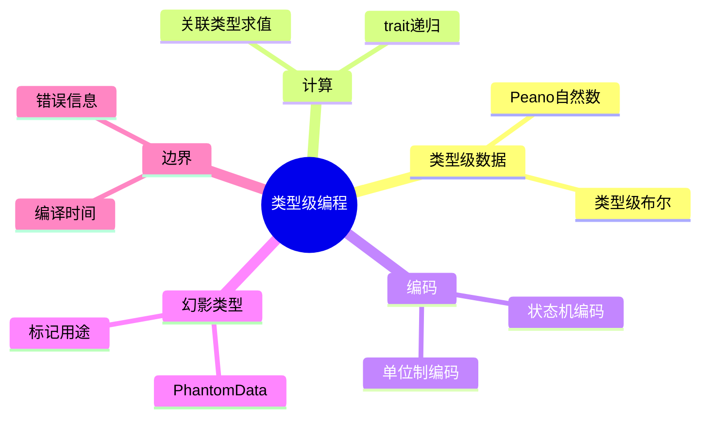

> **内容分级**: [专家级]
> **本节关键术语**: 类型级自然数 (Peano Numbers) · 类型级布尔 (Type-Level Boolean) · 异构列表 (HList) · 高阶类型 (HKT) · 类型状态模式 (Typestate Pattern) — [完整对照表](../../00_meta/01_terminology/01_terminology_glossary.md)
>

# 类型级编程 (Type-Level Programming)
>
> **EN**: Type-Level Programming
> **Summary**: Using Rust's type system as a compile-time language: Peano numbers, type-level booleans, HLists, HKT simulation, and type-level state machines.
> **Rust 版本**: 1.97.0+ (Edition 2024)
> **受众**: [进阶]
> **Bloom 层级**: L4-L5
> **权威来源**: 本文件为 `concept/` 权威页。
> **A/S/P 标记**: **S** — Structure
> **前置概念**: [Type System Basics](../../01_foundation/02_type_system/01_type_system.md) · [Traits](../../02_intermediate/00_traits/01_traits.md) · [Generics](01_generics.md)
> **后置概念**: [Performance Optimization](../../06_ecosystem/10_performance/01_performance_optimization.md)
> **Const Generics 权威页**: 常量泛型（`<const N: usize>`）的语法与 stable 边界见 [02_const_generics.md](02_const_generics.md)；本页保留 Peano/typenum 等类型级编码技术。
> **主要来源**: [The Rust Programming Language](https://doc.rust-lang.org/book/title-page.html) · [Rust Reference](https://doc.rust-lang.org/reference/introduction.html)

---

> **来源**: 本文档由 `crates/*/docs/` 合规整改迁移而来。原始 crate 文档现为摘要页，指向本权威页：
> **权威来源**: [concept/02_intermediate/01_generics/03_type_level_programming.md](03_type_level_programming.md)

---

# 04 类型级编程

> **文档类型**: Tier 4 - 高级主题
> **目标读者**: 专家级开发者
> **预计学习时间**: 6-8 小时
> **前置知识**: 深厚的类型系统（Type System）理解、编译时计算、形式逻辑

**最后更新**: 2025-12-11
**适用版本**: Rust 1.97.0+
**难度等级**: ⭐⭐⭐⭐⭐

---

## 🧠 知识结构图



## 📋 目录

- [类型级编程 (Type-Level Programming)](#类型级编程-type-level-programming)
- [04 类型级编程](#04-类型级编程)
  - [🧠 知识结构图](#-知识结构图)
  - [📋 目录](#-目录)
  - [🎯 什么是类型级编程？](#-什么是类型级编程)
  - [1️⃣ 类型级自然数 (Peano Numbers)](#1️⃣-类型级自然数-peano-numbers)
    - [基础定义](#基础定义)
    - [类型级加法](#类型级加法)
    - [类型级乘法](#类型级乘法)
  - [2️⃣ 类型级布尔逻辑](#2️⃣-类型级布尔逻辑)
    - [布尔类型](#布尔类型)
  - [3️⃣ 类型级列表](#3️⃣-类型级列表)
    - [HList (Heterogeneous List)](#hlist-heterogeneous-list)
  - [4️⃣ Higher-Kinded Types (HKT) 模拟](#4️⃣-higher-kinded-types-hkt-模拟)
    - [什么是 HKT？](#什么是-hkt)
    - [使用关联类型模拟 HKT](#使用关联类型模拟-hkt)
  - [5️⃣ 类型级状态机](#5️⃣-类型级状态机)
    - [编译时验证的协议](#编译时验证的协议)
  - [6️⃣ 类型级证明](#6️⃣-类型级证明)
    - [编译时验证不变量](#编译时验证不变量)
  - [🎯 实战项目](#-实战项目)
    - [项目 1: 类型安全的 SQL DSL](#项目-1-类型安全的-sql-dsl)
    - [项目 2: 编译时验证的状态机框架](#项目-2-编译时验证的状态机框架)
  - [📚 延伸阅读](#-延伸阅读)
  - [🎓 学习检验](#-学习检验)
  - [认知路径](#认知路径)
  - [定理链](#定理链)
  - [反命题](#反命题)
  - [反向推理](#反向推理)
  - [过渡段](#过渡段)
  - [嵌入式测验（Embedded Quiz）](#嵌入式测验embedded-quiz)
    - [测验 1：类型级 Peano 数（🟢 基础）](#测验-1类型级-peano-数-基础)
    - [测验 2：类型级布尔与条件选择（🟡 进阶）](#测验-2类型级布尔与条件选择-进阶)
    - [测验 3：类型级编程的边界（🔴 专家，联动「反命题」节）](#测验-3类型级编程的边界-专家联动反命题节)

本章探讨 Rust 中最前沿的编程技术 - 类型级编程，将类型系统（Type System）作为一种编程语言来使用。

**核心主题**:

- 类型级自然数（Peano 数）
- 类型级布尔逻辑
- 类型级列表和递归
- Higher-Kinded Types (HKT) 模拟
- 类型级状态机
- 编译时证明和验证

---

## 🎯 什么是类型级编程？

类型级编程是在类型系统层面进行计算和推理，所有计算在编译时完成，运行时（Runtime）零开销。
(Source: [Rust Reference: Traits](https://doc.rust-lang.org/reference/items/traits.html))

**核心概念**:

- 类型作为值
- Trait 作为函数
- 关联类型作为返回值
- 编译时求值

---

## 1️⃣ 类型级自然数 (Peano Numbers)

「1️⃣ 类型级自然数 (Peano Numbers)」涉及基础定义、类型级加法与类型级乘法，本节逐一说明其要点。

### 基础定义

```rust
use std::marker::PhantomData;

// 零
struct Zero;

// 后继（n + 1）
struct Succ<N>(PhantomData<N>);

// 类型别名
type One = Succ<Zero>;
type Two = Succ<One>;
type Three = Succ<Two>;
type Four = Succ<Three>;
type Five = Succ<Four>;

// 编译时验证
fn type_level_numbers() {
    let _zero: Zero;
    let _one: One;
    let _two: Two;
}
```

### 类型级加法

```rust
# use std::marker::PhantomData;
# struct Zero;
# struct Succ<N>(PhantomData<N>);
# type One = Succ<Zero>;
# type Two = Succ<One>;
# type Three = Succ<Two>;
# type Four = Succ<Three>;
# type Five = Succ<Four>;
// 加法 trait
trait Add<N> {
    type Output;
}

// 零 + N = N
impl<N> Add<N> for Zero {
    type Output = N;
}

// (Succ<M>) + N = Succ<(M + N)>
impl<M, N> Add<N> for Succ<M>
where
    M: Add<N>,
{
    type Output = Succ<<M as Add<N>>::Output>;
}

// 使用示例
type Sum1 = <Two as Add<Three>>::Output;  // Five

// 验证
fn verify_addition() {
    let _: Sum1 = Succ(PhantomData::<Four>);  // Two + Three = Five
}
```

### 类型级乘法

```rust
# use std::marker::PhantomData;
# struct Zero;
# struct Succ<N>(PhantomData<N>);
# type One = Succ<Zero>;
# type Two = Succ<One>;
# type Three = Succ<Two>;
# trait Add<N> { type Output; }
# impl<N> Add<N> for Zero { type Output = N; }
# impl<M, N> Add<N> for Succ<M> where M: Add<N> { type Output = Succ<<M as Add<N>>::Output>; }
// 乘法 trait
trait Mul<N> {
    type Output;
}

// 零 * N = 零
impl<N> Mul<N> for Zero {
    type Output = Zero;
}

// (Succ<M>) * N = N + (M * N)
impl<M, N> Mul<N> for Succ<M>
where
    M: Mul<N>,
    N: Add<<M as Mul<N>>::Output>,
{
    type Output = <N as Add<<M as Mul<N>>::Output>>::Output;
}

// 使用示例
type Product = <Two as Mul<Three>>::Output;  // Six = Two * Three
```

---

## 2️⃣ 类型级布尔逻辑

「2️⃣ 类型级布尔逻辑」部分的核心主题是布尔类型，本节展开说明。

### 布尔类型

```rust
struct True;
struct False;

// NOT 运算
trait Not {
    type Output;
}

impl Not for True {
    type Output = False;
}

impl Not for False {
    type Output = True;
}

// AND 运算
trait And<Rhs> {
    type Output;
}

impl And<True> for True {
    type Output = True;
}

impl And<False> for True {
    type Output = False;
}

impl And<True> for False {
    type Output = False;
}

impl And<False> for False {
    type Output = False;
}

// OR 运算
trait Or<Rhs> {
    type Output;
}

impl Or<True> for True {
    type Output = True;
}

impl Or<False> for True {
    type Output = True;
}

impl Or<True> for False {
    type Output = True;
}

impl Or<False> for False {
    type Output = False;
}

// 使用示例
type Result1 = <True as And<False>>::Output;  // False
type Result2 = <True as Or<False>>::Output;   // True
type Result3 = <False as Not>::Output;        // True
```

---

## 3️⃣ 类型级列表

本节聚焦「3️⃣ 类型级列表」，核心内容为 HList (Heterogeneous List)。

### HList (Heterogeneous List)

```rust
# use std::marker::PhantomData;
# struct Zero;
# struct Succ<N>(PhantomData<N>);
// 空列表
struct HNil;

// 非空列表
struct HCons<H, T> {
    head: H,
    tail: T,
}

// 创建 HList
fn create_hlist() {
    let list = HCons {
        head: 42,
        tail: HCons {
            head: "hello",
            tail: HCons {
                head: 3.14,
                tail: HNil,
            },
        },
    };

    // 类型: HCons<i32, HCons<&str, HCons<f64, HNil>>>
}

// HList 长度（类型级）
trait Len {
    type Output;
}

impl Len for HNil {
    type Output = Zero;
}

impl<H, T> Len for HCons<H, T>
where
    T: Len,
{
    type Output = Succ<<T as Len>::Output>;
}

// HList 索引访问
trait At<N> {
    type Output;
    fn at(&self) -> &Self::Output;
}

impl<H, T> At<Zero> for HCons<H, T> {
    type Output = H;
    fn at(&self) -> &H {
        &self.head
    }
}

impl<H, T, N> At<Succ<N>> for HCons<H, T>
where
    T: At<N>,
{
    type Output = <T as At<N>>::Output;
    fn at(&self) -> &Self::Output {
        self.tail.at()
    }
}

// 使用示例
fn hlist_operations() {
    let list = HCons {
        head: 42,
        tail: HCons {
            head: "hello",
            tail: HNil,
        },
    };

    // 编译时类型安全的索引
    let first: &i32 = list.at::<Zero>();     // Index 0
    let second: &str = list.tail.at::<Zero>();  // Index 1

    println!("{} {}", first, second);
}
```

---

## 4️⃣ Higher-Kinded Types (HKT) 模拟

「4️⃣ Higher-Kinded Types (HKT)…」部分包含什么是 HKT？ 与 使用关联类型模拟 HKT 两条主线，本节依次说明。

### 什么是 HKT？

HKT 允许对类型构造器进行抽象。Rust 原生不支持，但可以模拟。(Source: [RFC 1598 — GATs](https://rust-lang.github.io/rfcs/1598-generic_associated_types.html))

### 使用关联类型模拟 HKT

```rust
// HKT trait
trait HKT {
    type Applied<T>;
}

// Option 实现
struct OptionHKT;
impl HKT for OptionHKT {
    type Applied<T> = Option<T>;
}

// Vec 实现
struct VecHKT;
impl HKT for VecHKT {
    type Applied<T> = Vec<T>;
}

// Functor trait（使用 HKT）
trait Functor: HKT {
    fn map<A, B, F>(fa: Self::Applied<A>, f: F) -> Self::Applied<B>
    where
        F: FnMut(A) -> B;
}

impl Functor for OptionHKT {
    fn map<A, B, F>(fa: Option<A>, f: F) -> Option<B>
    where
        F: FnMut(A) -> B,
    {
        fa.map(f)
    }
}

impl Functor for VecHKT {
    fn map<A, B, F>(fa: Vec<A>, f: F) -> Vec<B>
    where
        F: FnMut(A) -> B,
    {
        fa.into_iter().map(f).collect()
    }
}

// 通用函数
fn transform<F, A, B>(fa: F::Applied<A>, f: fn(A) -> B) -> F::Applied<B>
where
    F: Functor,
{
    F::map(fa, f)
}
```

---

## 5️⃣ 类型级状态机

本节聚焦「5️⃣ 类型级状态机」，核心内容为编译时验证的协议。

### 编译时验证的协议

```rust
use std::marker::PhantomData;

// 协议状态
struct Init;
struct Handshake;
struct Ready;
struct Closed;

// 协议消息类型
trait Message {}

struct SynMessage;
struct AckMessage;
struct DataMessage;
struct FinMessage;

impl Message for SynMessage {}
impl Message for AckMessage {}
impl Message for DataMessage {}
impl Message for FinMessage {}

// 协议状态机
struct Protocol<State> {
    _state: PhantomData<State>,
}

// 状态转换 trait
trait Transition<M: Message> {
    type NextState;
    fn transition(self, message: M) -> Protocol<Self::NextState>;
}

// Init --[SYN]--> Handshake
impl Transition<SynMessage> for Protocol<Init> {
    type NextState = Handshake;

    fn transition(self, _message: SynMessage) -> Protocol<Handshake> {
        println!("Init -> Handshake");
        Protocol { _state: PhantomData }
    }
}

// Handshake --[ACK]--> Ready
impl Transition<AckMessage> for Protocol<Handshake> {
    type NextState = Ready;

    fn transition(self, _message: AckMessage) -> Protocol<Ready> {
        println!("Handshake -> Ready");
        Protocol { _state: PhantomData }
    }
}

// Ready --[DATA]--> Ready
impl Transition<DataMessage> for Protocol<Ready> {
    type NextState = Ready;

    fn transition(self, _message: DataMessage) -> Protocol<Ready> {
        println!("Ready -> Ready (data sent)");
        self
    }
}

// Ready --[FIN]--> Closed
impl Transition<FinMessage> for Protocol<Ready> {
    type NextState = Closed;

    fn transition(self, _message: FinMessage) -> Protocol<Closed> {
        println!("Ready -> Closed");
        Protocol { _state: PhantomData }
    }
}

// 使用示例
fn protocol_example() {
    let protocol = Protocol::<Init> { _state: PhantomData };

    let protocol = protocol.transition(SynMessage);
    let protocol = protocol.transition(AckMessage);
    let protocol = protocol.transition(DataMessage);
    let protocol = protocol.transition(DataMessage);
    let _protocol = protocol.transition(FinMessage);

    // 编译错误：不能从 Init 直接发送 ACK
    // let protocol = Protocol::<Init> { _state: PhantomData };
    // protocol.transition(AckMessage);
}
```

---

## 6️⃣ 类型级证明

本节聚焦「6️⃣ 类型级证明」，核心内容为编译时验证不变量。

### 编译时验证不变量

```rust,ignore
// `[(); (I < N) as usize]:` 需 generic_const_exprs（nightly），stable 1.97 不可编译
use std::marker::PhantomData;

// 非零自然数证明
trait NonZero {}

impl<N> NonZero for Succ<N> {}

// 除法（要求除数非零）
trait Div<N: NonZero> {
    type Output;
}

impl<M, N> Div<N> for M
where
    N: NonZero,
{
    type Output = Zero;  // 简化实现
}

// 使用示例
fn safe_division() {
    type Result = <Five as Div<Two>>::Output;  // OK: Two 是非零的

    // 编译错误：不能除以零
    // type Invalid = <Five as Div<Zero>>::Output;
}

// 范围证明
trait InRange<const N: usize> {}

struct Index<const I: usize>;

// 编译时范围检查
impl<const I: usize, const N: usize> InRange<N> for Index<I>
where
    [(); (I < N) as usize]:,
{
}

struct Array<T, const N: usize> {
    data: [T; N],
}

impl<T, const N: usize> Array<T, N> {
    fn get<const I: usize>(&self) -> &T
    where
        Index<I>: InRange<N>,
    {
        &self.data[I]
    }
}
```

---

## 🎯 实战项目

本节从项目 1: 类型安全的 SQL DSL 与 项目 2: 编译时验证的状态机框架 两个层面剖析「实战项目」。

### 项目 1: 类型安全的 SQL DSL

使用类型级编程实现编译时验证的 SQL 查询构建器。

**要求**:

- 编译时验证 SQL 语法
- 类型安全的列名和表名
- 防止 SQL 注入
- 零运行时（Runtime）开销

### 项目 2: 编译时验证的状态机框架

实现一个通用的类型级状态机框架。

**要求**:

- 支持任意状态和转换
- 编译时验证所有路径
- 生成状态转换图
- 零运行时开销

---

## 📚 延伸阅读

**推荐资源**:

1. [Type-Level Programming in Rust](https://willcrichton.net/rust-api-type-patterns/)
2. [HList in Rust](https://beachape.com/frunk/)
3. [Type-Level Computation](https://arxiv.org/abs/2105.08532)

**相关 Crates**:

- [`frunk`](https://crates.io/crates/frunk) - HList 和类型级工具
- [`typenum`](https://crates.io/crates/typenum) - 类型级数值
- [`generic-array`](https://crates.io/crates/generic-array) - 泛型（Generics）长度数组

---

## 🎓 学习检验

1. **Peano 数**: 实现类型级减法和比较
2. **HList**: 实现 HList 的连接操作
3. **HKT**: 实现 Monad 的类型类
4. **状态机**: 设计一个类型安全的工作流引擎

---

**返回**: Tier 4 索引 | **上一章**: 03\_零成本抽象 | **下一章**: 05\_设计模式进阶

---

> **权威来源**: [Rust Reference](https://doc.rust-lang.org/reference/), [The Rust Programming Language](https://doc.rust-lang.org/book/), [Rust Standard Library](https://doc.rust-lang.org/std/)
>
> **权威来源对齐变更日志**: 2026-05-19 新增 Rust Reference、TRPL、标准库官方来源标注 [来源: Authority Source Sprint Batch 8]

**文档版本**: 1.1
**最后更新**: 2026-05-19
**状态**: ✅ 权威来源对齐完成 (Batch 8)

## 认知路径

1. **问题识别**: 识别在类型系统中编码计算与状态的需求场景。
2. **概念建立**: 掌握 Peano 数、类型级布尔、HList、HKT 模拟与 typestate 模式。
3. **机制推理**: 通过类型级数据 ⟹ trait 约束 ⟹ 编译期计算的定理链利用类型系统能力。
4. **边界辨析**: 辨析“类型级编程总是更好”等反命题，理解复杂性与编译时间成本。
5. **迁移应用**: 将类型级编程与泛型（Generics）、trait、性能优化主题链接。

## 定理链

| 定理 | 前提 | 结论 |
|:---|:---|:---|
| 类型级 Peano 数 ⟹ 编译期算术 | 通过递归类型与 trait 实现 | 可在编译期表达长度等约束 |
| 类型级布尔 ⟹ 条件类型选择 | 利用关联类型实现 if/else | 编译期根据类型状态选择实现 |
| Typestate ⟹ 状态机编码于类型 | 状态转换由类型系统保证 | 运行时状态转换错误可被编译器拦截 |

## 反命题

> **反命题 1**: "类型级编程总是比普通代码好" ⟹ 不成立。过度复杂化会降低可读性并拖慢编译时间。
>
> **反命题 2**: "Rust 拥有完整的高阶类型（HKT）" ⟹ 不成立。Rust 只能通过关联类型与 trait 模拟部分 HKT 能力。
>
> **反命题 3**: "复杂类型不会影响编译时间" ⟹ 不成立。类型级递归和大量约束可能显著增加编译耗时。
>
## 反向推理

> **反向推理 1**: 运行时发现 API 被误用 ⟸ 说明可以通过 typestate 将状态约束前移到编译期。
>
> **反向推理 2**: 泛型代码编译时间急剧增长 ⟸ 说明类型级计算可能过度递归，需要简化约束或改用值级方案。
>
## 过渡段

> **过渡**: 从泛型与 trait 过渡到类型级数据，可以理解类型系统本身也是一种编程语言。
>
> **过渡**: 从类型级数据过渡到 trait 约束，可以建立“类型即证明、约束即规则”的编程模型。
>
> **过渡**: 从编译期计算过渡到 typestate，可以将状态机安全性从运行时前移到编译期。
>

---

## 嵌入式测验（Embedded Quiz）

> W3-b 补充（2026-07-13）：本页原无嵌入式测验，按四级题型规范补 3 题（🟢🟡🔴 各 1 题，`<details>` 折叠答案），内容与本页正文严格一致；测验 3 与本页「反命题」节直接联动。

### 测验 1：类型级 Peano 数（🟢 基础）

以下类型级自然数加法实现中，`Add` 的递归结构如何工作？

```rust,ignore
trait Add<N> { type Output; }
impl<N> Add<N> for Zero { type Output = N; }
impl<M, N> Add<N> for Succ<M> where M: Add<N> {
    type Output = Succ<<M as Add<N>>::Output>;
}
```

- A. 运行时在堆上构造数轴并计算
- B. 编译期通过 trait 递归求解关联类型：`Zero + N = N`，`Succ<M> + N = Succ<M + N>`
- C. 需要 nightly 的 `generic_const_exprs` 才能编译
- D. `Succ` 是标准库类型

<details>
<summary>✅ 答案</summary>

**B 正确**。按本页「类型级自然数 (Peano Numbers)」：用零类型 `Zero` 与后继 `Succ<N>`（配 `PhantomData`）把自然数编码进类型系统，加法经 `Add` trait 的关联类型 `Output` 在**编译期**递归求值——基例 `Zero` 与递归例 `Succ<M>` 对应 Peano 公理。A 错（纯编译期，无运行时数据）；C 错（min const generics 之前的经典技术，stable 可用）；D 错（用户自定义标记类型）。

</details>

---

### 测验 2：类型级布尔与条件选择（🟡 进阶）

本页「类型级布尔逻辑」中 `Not`/`And` 的实现机制是？

```rust,ignore
struct True; struct False;
trait Not { type Output; }
impl Not for True  { type Output = False; }
impl Not for False { type Output = True; }
```

- A. 利用关联类型 `Output` 为每个布尔标记类型给出唯一实现，编译期完成真值表查表
- B. 运行时 `if` 分支选择
- C. 依赖 `const fn` 求值
- D. 必须使用 `Box<dyn Not>` 动态分发

<details>
<summary>✅ 答案</summary>

**A 正确**。按本页 §2：布尔值编码为单元结构体 `True`/`False`，逻辑运算编码为带关联类型的 trait，每个输入类型的 `impl` 给出唯一 `Output`——编译器在单态化时完成"真值表查表"，结果是一个**类型**而非值。B/C/D 均把编译期类型级计算误置为运行时机制。

</details>

---

### 测验 3：类型级编程的边界（🔴 专家，联动「反命题」节）

按本页「反命题」节，下列说法正确的有？（选出所有正确项）

- A. "类型级编程总是比普通代码好"不成立：过度复杂化降低可读性并拖慢编译时间
- B. Rust 拥有完整的高阶类型（HKT）
- C. "复杂类型不会影响编译时间"不成立：类型级递归和大量约束可能显著增加编译耗时
- D. Rust 只能通过关联类型与 trait 模拟部分 HKT 能力

<details>
<summary>✅ 答案</summary>

**A、C、D 正确**。按本页「反命题」节：反命题 1（类型级编程非银弹，可读性与编译时间是代价）、反命题 2（Rust **没有**完整 HKT，只能经关联类型与 trait 模拟部分能力——B 错）、反命题 3（类型级递归显著增加编译耗时）。工程结论与本页「认知路径」第 4 步一致：类型级技术应用于状态机（typestate）等收益明确的场景，而非默认选择。

</details>
