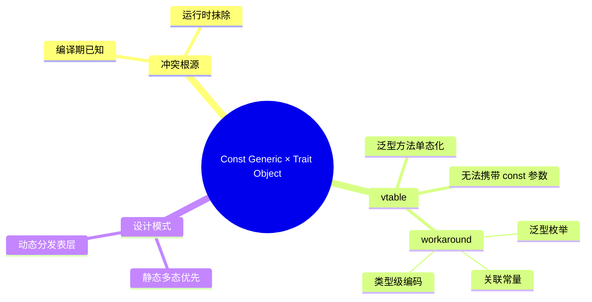
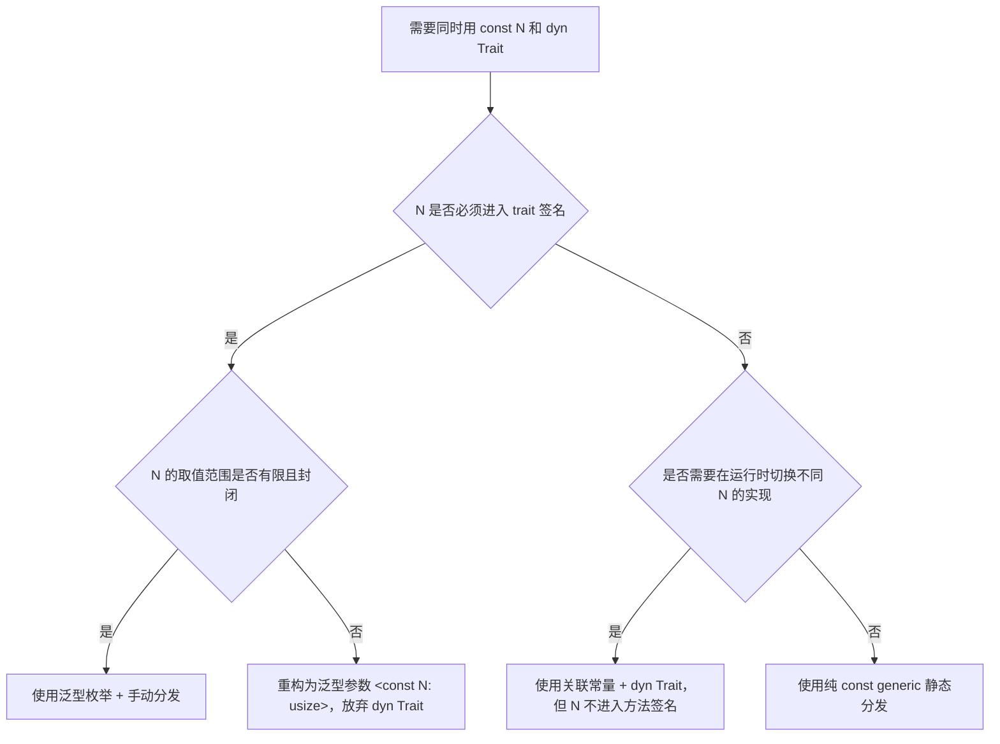

> **内容分级**: [专家级]
>
> **Rust 版本**: 1.97.0+ (Edition 2024)
> **本节关键术语**: const generic · trait object · dyn Trait · monomorphization · vtable · 单态化 — [完整对照表](../../00_meta/01_terminology/01_terminology_glossary.md)

# 常量泛型与 Trait 对象：静态分发与动态分发的交叉边界

> **EN**: Const Generics and Trait Objects
> **Summary**: The interaction between const generics and `dyn Trait`: where the compiler can and cannot erase type parameters, and how to design APIs that combine compile-time constants with runtime polymorphism.
> **受众**: [进阶-专家]
> **Bloom 层级**: L3-L4
> **权威来源**: 本文件为 `concept/` 权威页。
> **A/S/P 标记**: **S** — Structure
> **双维定位**: C×Ana — 分析 const generic 与 trait object 的结构性冲突
> **定位**: 解释 Rust 中 `const N: usize` 等编译期常量参数与 `dyn Trait` 动态分发之间的限制、 workaround 与设计模式。const generic 要求编译期已知，而 trait object 要求运行时抹除类型信息，两者在 vtable 层面存在根本张力。
> **前置概念**: [Generics](01_generics.md) · [Const Generics](02_const_generics.md) · [Traits](../00_traits/01_traits.md) · [Dispatch Mechanisms](../00_traits/02_dispatch_mechanisms.md) · [类型系统基础](../../01_foundation/02_type_system/01_type_system.md)
> **后置概念**: [Generic Associated Types](../00_traits/07_generic_associated_types.md) · [Type-Level Programming](03_type_level_programming.md)

---

> **来源**: [Rust Reference — Const Generics](https://doc.rust-lang.org/reference/items/generics.html#const-generics) · [Rust Reference — Trait Objects](https://doc.rust-lang.org/reference/types/trait-object.html) · [RFC 2000 — Const Generics](https://rust-lang.github.io/rfcs/2000-const-generics.html)

---

## 🧠 知识结构图



## 📑 目录

- [常量泛型与 Trait 对象：静态分发与动态分发的交叉边界](#常量泛型与-trait-对象静态分发与动态分发的交叉边界)
  - [🧠 知识结构图](#-知识结构图)
  - [📑 目录](#-目录)
  - [一、权威定义](#一权威定义)
  - [二、冲突根源](#二冲突根源)
  - [三、为什么 `dyn Trait<{N}>` 不工作](#三为什么-dyn-traitn-不工作)
    - [3.1 尝试与编译错误](#31-尝试与编译错误)
    - [3.2 判定条件](#32-判定条件)
  - [四、Workaround 与设计模式](#四workaround-与设计模式)
    - [4.1 用关联类型/方法替代 const generic](#41-用关联类型方法替代-const-generic)
    - [4.2 用泛型枚举做封闭类型集](#42-用泛型枚举做封闭类型集)
    - [4.3 类型级编码（Type-Level Programming）](#43-类型级编码type-level-programming)
  - [五、判定树](#五判定树)
  - [六、反例与失效模式](#六反例与失效模式)
  - [七、相关概念](#七相关概念)

---

## 一、权威定义

> **Rust Reference**: A const generic is a generic parameter which is bound to a constant value rather than a type.

> **Rust Reference**: A trait object is an opaque value of another type that implements a given set of traits. The set of traits is made up of an object safe base trait plus any number of auto traits.

**Const Generic × Trait Object 交叉定义**：在需要同时满足“编译期常量参数”（const generic）与“运行时类型擦除/动态分发”（trait object）的场景中，Rust 类型系统表现出的限制与可用模式。核心矛盾在于：vtable 无法携带 const generic 参数的具体值。

---

## 二、冲突根源

| 机制 | 关键特性 | 与另一机制的冲突 |
|---|---|---|
| **Const Generic** | 参数值在编译期已知，参与类型身份 | `dyn Trait<N>` 要求在运行时确定 `N`，但 vtable 没有位置存 `N` |
| **Trait Object** | 类型被擦除，通过 vtable 动态分发 | vtable 只能承载方法指针，不能承载 const 值；const 值影响类型布局 |

直观理解：`Vec<T>` 的大小不依赖 `T` 的具体类型，但 `[T; N]` 的大小依赖 `N`。如果 `N` 进入 trait object，编译器无法在不知道 `N` 的情况下确定对象大小和布局。

---

## 三、为什么 `dyn Trait<{N}>` 不工作

### 3.1 尝试与编译错误

```rust
trait Buffer<const N: usize> {
    fn data(&self) -> &[u8; N];
}

fn use_buffer(b: &dyn Buffer<16>) {
    let _ = b.data();
}
```

**错误**：`the trait`Buffer`cannot be made into an object`。

**原因**：

1. `Buffer<const N: usize>` 的方法签名依赖 `N`；
2. vtable 中每个方法只能有一个固定签名，无法为每个 `N` 单独生成条目；
3. 即使指定 `Buffer<16>`，当前 Rust（1.97）也不支持在 trait object 路径中携带 const generic 参数。

### 3.2 判定条件

trait 要成为 object-safe 并支持 const generic，必须满足：

- const generic 不直接影响 vtable 方法的签名；
- const generic 不决定 `Self` 的大小或布局；
- 当前 Rust 版本（1.97）仍要求 trait 本身不含 const generic 参数才能 object-safe。

---

## 四、Workaround 与设计模式

### 4.1 用关联类型/方法替代 const generic

```rust
trait Buffer {
    fn size(&self) -> usize;
    fn data(&self) -> &[u8];
}

struct Buf16([u8; 16]);
impl Buffer for Buf16 {
    fn size(&self) -> usize { 16 }
    fn data(&self) -> &[u8] { &self.0 }
}

fn use_buffer(b: &dyn Buffer) {
    let _size = b.size(); // 通过方法调用获取尺寸，trait object 保持 object-safe
}
```

### 4.2 用泛型枚举做封闭类型集

```rust
enum DynBuffer {
    B16(Buf16),
    B32(Buf32),
    B64(Buf64),
}

impl DynBuffer {
    fn data(&self) -> &[u8] {
        match self {
            DynBuffer::B16(b) => b.data(),
            DynBuffer::B32(b) => b.data(),
            DynBuffer::B64(b) => b.data(),
        }
    }
}
```

### 4.3 类型级编码（Type-Level Programming）

```rust
struct N16;
struct N32;

trait Size {
    const VALUE: usize;
}
impl Size for N16 { const VALUE: usize = 16; }
impl Size for N32 { const VALUE: usize = 32; }
```

---

## 五、判定树



---

## 六、反例与失效模式

| 失效模式 | 根因 | 修复方向 |
|---|---|---|
| `dyn Trait<{N}>` 编译错误 | const generic 使 trait 非 object-safe | 用关联常量或泛型枚举 |
| trait object 上访问关联常量混淆 | `<dyn Trait as Trait>::CONST` 无具体类型 | 通过 downcast 或枚举分发 |
| 为每个 N 单态化导致代码膨胀 | 过度使用 const generic + 动态集合 | 改用枚举或 Box<dyn Trait> |
| vtable 方法签名含 `&[u8; N]` | N 进入方法签名，无法擦除 | 改为 `&[u8]` 并在运行期校验长度 |

---

## 七、相关概念

- [Generics](01_generics.md)
- [Const Generics](02_const_generics.md)
- [Traits](../00_traits/01_traits.md)
- [Dispatch Mechanisms](../00_traits/02_dispatch_mechanisms.md)
- [Generic Associated Types](../00_traits/07_generic_associated_types.md)
- [Type-Level Programming](03_type_level_programming.md)

---

> **权威来源**: [Rust Reference — Const Generics](https://doc.rust-lang.org/reference/items/generics.html#const-generics) · [Rust Reference — Trait Objects](https://doc.rust-lang.org/reference/types/trait-object.html) · [RFC 2000 — Const Generics](https://rust-lang.github.io/rfcs/2000-const-generics.html)
