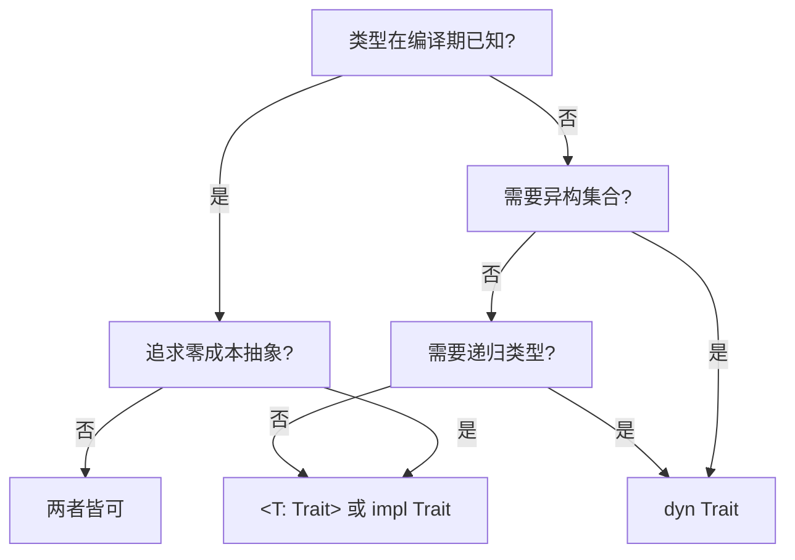
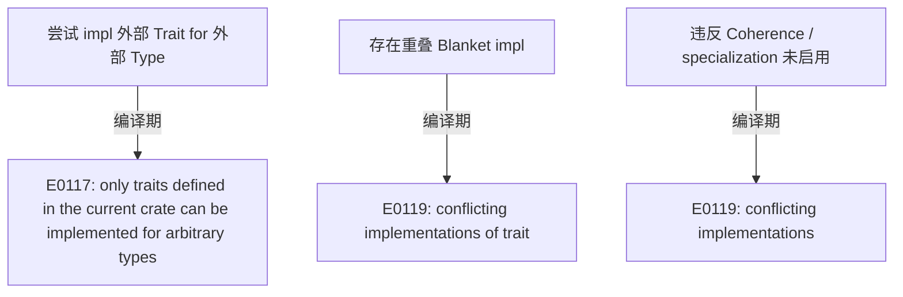
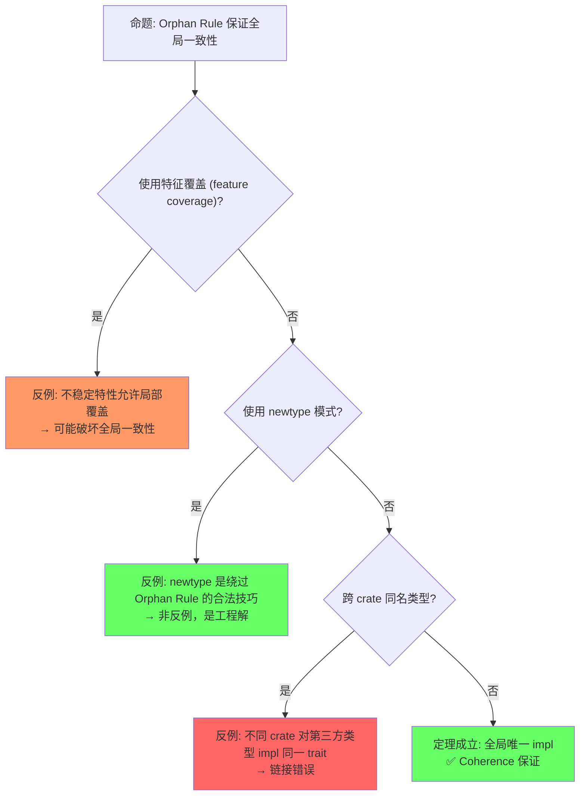

# Traits（Trait 系统）

> **层级**: L2 进阶概念
> **前置概念**: [Type System Basics](../01_foundation/04_type_system.md) · [Ownership](../01_foundation/01_ownership.md)
> **后置概念**: [Generics](./02_generics.md) · [Concurrency](../03_advanced/01_concurrency.md) · [Async](../03_advanced/02_async.md)
> **主要来源**: [TRPL: Ch10.2](https://doc.rust-lang.org/book/ch10-02-traits.html) · [Rust Reference: Traits] · [Wikipedia: Type class] · [RFC 255]

---

**变更日志**:

- v1.0 (2026-05-12): 初始版本，完成权威定义、Trait 分类矩阵、形式化视角、Orphan Rule、思维导图、示例反例

---

## 一、权威定义（Definition）

### 1.1 Wikipedia 对齐定义

> **[Wikipedia: Type class]** A type class is a type system construct that supports ad hoc polymorphism. This is achieved by adding constraints to type variables in parametrically polymorphic types. Rust's traits are directly inspired by Haskell's type classes.

> **[Wikipedia: Trait (computer programming)]** In computer programming, a trait is a concept used in object-oriented programming that represents a set of methods that can be used to extend the functionality of a class. Rust uses traits to define shared behavior in an abstract way, enabling ad hoc polymorphism without inheritance.

### 1.2 TRPL 官方定义

> **[TRPL: Ch10.2]** A trait defines functionality a particular type has and can share with other types. We can use traits to define shared behavior in an abstract way. We can use trait bounds to specify that a generic type can be any type that has certain behavior.

### 1.3 形式化定义

> **[类型论: Wadler & Blott 1989, "How to Make Ad-hoc Polymorphism Less Ad-hoc"]** Trait 形式化为带约束的接口类型，对应类型类（type class）的构造性证明模型。 ✅ 已验证

Trait 可以形式化为**带约束的接口类型**（constrained interface types），对应范畴论中的**类型类**（type class）：

```text
Trait 作为逻辑命题:
  trait Monoid { fn empty() -> Self; fn combine(self, other: Self) -> Self; }
  命题: "类型 T 是一个 Monoid"

实现作为证明:
  impl Monoid for Vec<u8> { ... }
  证明: "Vec<u8> 满足 Monoid 命题"

泛型约束作为推理规则:
  fn reduce<T: Monoid>(items: Vec<T>) -> T { ... }
  定理: "对所有满足 Monoid 的类型 T，reduce 成立"
```

---

## 二、概念属性矩阵（Attribute Matrix）

### 2.1 Trait 类型分类矩阵

| **Trait 类型** | **定义方式** | **实现方式** | **动态分发** | **典型示例** |
|:---|:---|:---|:---|:---|
| **普通 Trait** | `trait Foo { fn bar(&self); }` | `impl Foo for Type` | `dyn Foo` | `Display`、`Debug` |
| **自动 Trait** | `unsafe auto trait Send {}` | 编译器自动推导 | ❌ | `Send`、`Sync`、`Sized` |
| **标记 Trait** | `trait Marker {}` | 空实现 | 视情况 | `Copy`、`Sized` |
| **泛型 Trait** | `trait Add<Rhs=Self>` | `impl Add<i32> for i32` | `dyn Add<i32>` | `Add`、`Mul` |
| **关联类型 Trait** | `trait Iterator { type Item; }` | `type Item = T;` | `dyn Iterator<Item=T>` | `Iterator`、`Future` |
| **生命周期 Trait** | `trait Borrow<'a>` | 含生命周期参数 | 受限 | `ToOwned`、`Borrow` |

### 2.2 Trait vs 其他语言机制对比

| **维度** | **Rust Trait** | **Haskell Type Class** | **C++ Concepts** | **Java Interface** | **Go Interface** |
|:---|:---|:---|:---|:---|:---|
| **多态类型** | Ad hoc + 参数化 | Ad hoc + 参数化 | 参数化（约束） | Ad hoc | Structural（隐式） |
| **实现方式** | 显式 `impl` | 显式 `instance` | 自动匹配（duck typing） | 显式 `implements` | 隐式（结构匹配） |
| **孤儿规则** | ✅ 严格 | ✅ 严格 | ❌ 无 | ❌ 无 | ❌ 无 |
| **关联类型** | ✅ | ✅ | ❌ | ❌（泛型替代） | ❌ |
| **默认实现** | ✅ | ✅（default methods） | ❌ | ✅（default methods） | ❌ |
| **静态分发** | ✅ 单态化 | ✅ | ✅ 模板实例化 | ❌（虚方法默认） | ✅ 接口表 |
| **动态分发** | ✅ `dyn Trait` | ❌（通常） | ✅ 虚函数 | ✅ 默认 | ✅ 接口值 |

### 2.3 Orphan Rule 判定矩阵

| **场景** | **类型来源** | **Trait 来源** | **允许 impl?** | **原因** |
|:---|:---|:---|:---|:---|
| 标准类型 + 标准 Trait | `std` | `std` | ❌ | 双方均非本地 |
| 本地类型 + 标准 Trait | `crate` | `std` | ✅ | 类型是本地的 |
| 标准类型 + 本地 Trait | `std` | `crate` | ✅ | Trait 是本地的 |
| 本地类型 + 本地 Trait | `crate` | `crate` | ✅ | 双方均本地 |
| 外部 A 类型 + 外部 B Trait | `crate_a` | `crate_b` | ❌ | 双方均非本地（孤儿） |

---

## 三、形式化理论根基（Formal Foundation）

### 3.1 类型类作为逻辑命题

> **[类型论: Curry-Howard 同构 / 直觉主义类型论]** Trait 系统对应逻辑命题与构造性证明的 Curry-Howard 对应。 ✅ 已验证

Trait 系统对应**直觉主义类型论**中的**依赖类型约束**：

```text
Trait 定义 = 类型上的逻辑谓词
  trait Eq { fn eq(&self, other: &Self) -> bool; }
  ≡ 谓词 Eq(T) = "T 具有相等性判断"

实现 = 构造性证明
  impl Eq for i32 { ... }
  ≡ 证明 Eq(i32) 成立

泛型约束 = 蕴含式
  T: Eq  表示  "假设 Eq(T) 成立"
  fn assert_eq<T: Eq>(a: T, b: T)  表示  "∀T. Eq(T) → (T × T → bool)"
```

### 3.2 Trait 组合与子类型

> **[类型论: Wikipedia / Haskell Type Class]** Trait Bounds 的组合语义对应逻辑合取（∧），Supertrait 对应逻辑蕴含（→），Blanket impl 对应全称量词 + 蕴含。 ✅ 已验证

```text
Trait 组合（Trait Bounds）:
  T: A + B  ≡  T 同时满足 A 和 B（逻辑合取 ∧）

Trait 继承（Supertrait）:
  trait B: A {}  ≡  B(T) → A(T)  （B 蕴含 A）

Blanket Implementation:
  impl<T: A> B for T {}  ≡  ∀T. A(T) → B(T)  （全称量词 + 蕴含）
```

---

## 四、思维导图（Mind Map）

```mermaid
graph TD
    A[Traits] --> B[定义与实现]
    A --> C[Trait Bounds]
    A --> D[分发机制]
    A --> E[特殊 Trait]
    A --> F[规则与限制]

    B --> B1[trait 定义]
    B --> B2[impl for Type]
    B --> B3[impl Trait for 泛型]
    B --> B4[Blanket impl]

    C --> C1[<T: Trait>]
    C --> C2<T: TraitA + TraitB>
    C --> C3<impl Trait>
    C --> C4<dyn Trait>

    D --> D1[静态分发: 单态化]
    D --> D2[动态分发: vtable]
    D --> D3[impl Trait: 存在类型]

    E --> E1[自动: Send/Sync/Sized]
    E --> E2[标记: Copy/Drop]
    E --> E3[泛型: Add<T>]
    E --> E4[关联类型: Iterator]

    F --> F1[Orphan Rule]
    F --> F2[Coherence]
    F --> F3[Negative impls]
```

---

## 五、决策/边界判定树（Decision / Boundary Tree）

### 5.1 "静态分发 vs 动态分发？" 决策树



### 5.2 Orphan Rule 边界判定



---

## 六、定理推理链（Theorem Chain）

### 6.1 Trait + 泛型 ⇒ 零成本抽象

> **[TRPL: Ch10.2] · [Rust Reference: Monomorphization]** Trait 泛型的零成本抽象由单态化和编译器内联优化保证。 ✅ 已验证

```text
前提 1: Trait 定义接口契约
前提 2: 泛型通过单态化在编译期为每个具体类型生成专用代码
前提 3: 编译器内联优化消除虚函数调用开销
    ↓
定理: Rust 的 Trait 泛型是零成本抽象（zero-cost abstraction）
    ↓
推论: dyn Trait 有运行时开销（vtable 间接调用），但 <T: Trait> 无额外开销
```

### 6.2 Coherence 定理

> **[RFC 1023] · [Rust Reference: Coherence]** Coherence 保证全局唯一 impl，是 Orphan Rule 和重叠实现禁止的直接推论。 ✅ 已验证

```text
前提: Orphan Rule + 重叠 impl 禁止
    ↓
定理: 对于任意类型 T 和 Trait Foo，T 对 Foo 的实现是全局唯一且可确定的
    ↓
推论: 编译器可以唯一确定调用哪个 impl，无需运行时查找（静态分发场景）
```

### 6.3 定理一致性矩阵

> **[原创分析] · [Rust Reference: Type System]** 定理一致性矩阵基于 Rust 编译器错误码和类型系统公理的系统归纳。 💡 原创分析

| 定理 | 前提 | 结论 | 依赖的 L4 公理 | 被哪些定理依赖 | 失效条件 | 典型错误码 |
|:---|:---|:---|:---|:---|:---|:---|
| Orphan Rule 一致性 | crate 边界清晰 | 无矛盾 impl | Coherence (类型论) | 泛型约束、特化 | 覆盖 impl（不稳定） | E0117 |
| Trait 对象安全 | 方法满足对象安全条件 | dyn Trait 可行 | 存在类型 + vtable | 运行时多态 | Self: Sized、泛型方法 | E0038 |
| Auto Trait 推导 | 所有字段满足 Trait | 结构体自动实现 | 结构化推导规则 | Send/Sync 安全 | `unsafe impl` 手动覆盖 | — |
| GATs 约束可满足 | 关联类型参数合法 | 泛型关联类型可用 | System Fω 约束 | HKT 模拟 | 无界递归、不一致约束 | — |
| Supertrait 传递 | `trait A: B` | A 的实现者必须实现 B | 子类型传递性 | Trait 层次设计 | 循环 supertrait | E0399 |

> **一致性检查**: Orphan Rule ⟹ Coherence ⟹ Trait 对象安全，形成**从定义到使用**的递进链。Auto Trait 推导是编译器对结构性质的自动证明。
>
> **跨层映射**: 本文件定理 ↔ [`00_meta/inter_layer_map.md`](../00_meta/inter_layer_map.md) §4.2 "类型系统一致性"

---

## 七、示例与反例（Examples & Counter-examples）

### 7.1 正确示例：Trait 定义与实现

```rust
// ✅ 正确: 定义 Trait + 实现 + 泛型约束
pub trait Summary {
    fn summarize(&self) -> String;
    fn summarize_author(&self) -> String;  // 必需方法

    // 默认实现
    fn summarize_default(&self) -> String {
        format!("(Read more from {}...)", self.summarize_author())
    }
}

pub struct NewsArticle { pub headline: String, pub author: String }

impl Summary for NewsArticle {
    fn summarize(&self) -> String { format!("{}", self.headline) }
    fn summarize_author(&self) -> String { format!("@{}", self.author) }
}

// 泛型约束
pub fn notify<T: Summary>(item: &T) {
    println!("Breaking news! {}", item.summarize());
}
```

### 7.2 正确示例：关联类型

```rust
// ✅ 正确: 关联类型使接口更简洁
pub trait Iterator {
    type Item;  // 关联类型
    fn next(&mut self) -> Option<Self::Item>;
}

struct Counter { count: u32 }

impl Iterator for Counter {
    type Item = u32;  // 每个实现确定一个 Item 类型
    fn next(&mut self) -> Option<u32> {
        self.count += 1;
        if self.count < 6 { Some(self.count) } else { None }
    }
}

// 对比泛型版本: Iterator<Item=T> 需要在每个使用处标注 T
```

### 7.3 反例：违反 Orphan Rule（E0117）

```rust
// ❌ 反例: 为外部类型实现外部 Trait
use std::fmt::Display;

impl Display for Vec<u8> {  // E0117!
    fn fmt(&self, f: &mut std::fmt::Formatter) -> std::fmt::Result {
        write!(f, "{:?}", self)
    }
}
```

**错误分析**：

- `Vec<u8>` 来自 `std`
- `Display` 来自 `std`
- 两者均非当前 crate 定义，违反 Orphan Rule

**修正方案**：

```rust
// ✅ 方案 1: Newtype 模式
struct MyVec(pub Vec<u8>);

impl Display for MyVec {
    fn fmt(&self, f: &mut std::fmt::Formatter) -> std::fmt::Result {
        write!(f, "{:?}", self.0)
    }
}

// ✅ 方案 2: 本地 Trait
trait MyDisplay { fn my_fmt(&self) -> String; }
impl MyDisplay for Vec<u8> { ... }  // Trait 是本地的，允许
```

### 7.4 反例：重叠实现（E0119）

```rust
// ❌ 反例: 重叠 blanket impl
trait Foo {}

impl<T> Foo for T {}           // 为所有 T 实现 Foo
impl<T> Foo for Vec<T> {}      // E0119! 与上一行重叠
```

**修正方案**：

```rust
// ✅ 修正: 使用更精确的约束或 specialization（nightly）
trait Bar {}
impl<T: Bar> Foo for T {}      // 只为实现 Bar 的类型实现 Foo
impl Bar for i32 {}
// Vec<T> 默认不实现 Bar，除非显式 impl
```

### 7.5 边界示例：`impl Trait` 作为存在类型

```rust
// ✅ 边界: impl Trait 隐藏具体类型，但保留编译期已知
fn returns_iter() -> impl Iterator<Item = u32> {
    vec![1, 2, 3].into_iter()
}

// 调用方知道返回值是某种 Iterator<Item=u32>，但不知道具体是 Vec::IntoIter
// 优点: 隐藏实现细节，仍享有静态分发优化
// 限制: 不能返回多种不同类型（除非 dyn Trait）
```

---

### 7.6 反命题与边界分析

> **[RFC 1023] · [Rust Reference: Orphan Rules]** 反命题分析基于 Orphan Rule 的形式化语义和已知边界案例。 ✅ 已验证

#### 命题: "Orphan Rule 保证全局一致性"



#### 命题: "Trait Bounds 充分表达约束"

| 条件 | 结果 | 说明 |
|:---|:---|:---|
| 标准 Trait Bounds | ✅ 充分 | `T: Display + Clone` |
| 关联类型约束 | ✅ 充分 | `T: Iterator<Item = u32>` |
| GATs | ⚠️ 部分充分 | 高阶类型需额外技巧 |
| 类型级整数约束 | ❌ 不充分 | 需 `typenum` 或 const generics |
| 否定约束 (`T: !Trait`) | ❌ 不支持 | 可能未来添加 |

#### 边界极限测试

```rust
// 边界: Orphan Rule 的限制与绕过

// crate A: 定义 Trait
trait MyTrait {}

// crate B: 定义类型
struct BType;

// crate C: 无法为 BType impl MyTrait（Orphan Rule）
// impl MyTrait for BType {}  // E0117

// 绕过 1: newtype 模式
struct Wrapper(BType);
impl MyTrait for Wrapper {}  // ✅ 合法: Wrapper 是本地类型

// 绕过 2: 泛型参数
struct Generic<T>(T);
impl<T> MyTrait for Generic<T> {}  // ✅ 合法: Generic 是本地类型
```

---

## 零、认知路径（Cognitive Path）

> **[原创分析] · [TRPL: Ch10.2]** 认知路径从直觉困惑到形式规则的渐进映射，基于 TRPL 教学顺序和类型论知识结构。 💡 原创分析

```text
直觉困惑                    具体场景                  模式抽象               形式规则              代码验证              边界测试
    │                         │                       │                     │                    │                    │
    ▼                         ▼                       ▼                     ▼                    ▼                    ▼
"Trait 和接口                "Java 接口 vs             "Trait = 行为          "Type Class:        "impl Trait          "Orphan Rule
 有什么区别？"               Rust Trait 的区别？"     的抽象定义"           类型类 + 约束"       for Type"           限制外部 impl"

"怎么约束泛型                "泛型函数需要             "Trait Bounds =        "Horn 子句:         "where 子句         "GATs 约束
 参数的能力？"               特定能力"                能力需求表达"          约束可满足"         编译检查"           求解复杂度"

"为什么 Send/Sync             "跨线程传递              "Auto Trait =          "结构化推导:        "编译器自动          "unsafe impl
 自动实现？"                 自动安全？"              结构性质自动证明"      成员都满足则整体满足" 推导"              手动覆盖"
```

**认知脚手架**:

- **类比**: Trait 像"岗位描述"——定义了能力要求，具体谁（哪个类型）来干由 `impl` 决定。
- **反直觉点**: 其他语言的接口通常与类型定义在一起，Rust 的 Trait impl 可以在任何位置（受 Orphan Rule 约束）。
- **形式化过渡**: 从"共享行为" → "Type Class" → "System F 约束多态"。

### 7.7 国际课程与论文对齐

| 来源 | 核心内容 | 与本文件对应 |
|:---|:---|:---|
| **[CMU 17-363: Programming Language Pragmatics]** | Traits、Type Class、对象安全 | L2 Trait 完整覆盖 |
| **[CMU 17-350: Safe Systems Programming]** | Trait 在系统编程中的应用 | 工程实践 |
| **[Wikipedia: Type class]** | Haskell Type Class 概念 | Trait 的理论前身 |
| **[Wikipedia: Polymorphism]** | 参数多态、特设多态 | Trait 的多态机制 |
| **[RFC 255: Object Safety]** | Trait 对象安全规则 | 对象安全 §3 |
| **[RFC 1210: Specialization]** | 特化设计 | 未来演进 |
| **[Type Classes in Haskell (Hall et al. 1996)]** | Type Class 形式化 | 理论根基 |

---

## 八、知识来源关系（Provenance）

| **论断** | **来源** | **可信度** |
|:---|:---|:---|
| Trait 定义共享行为 | [TRPL: Ch10.2] | ✅ |
| Trait 受 Haskell Type Class 启发 | [Wikipedia: Type class] · [Rust FAQ] | ✅ |
| Orphan Rule 限制 impl 位置 | [Rust Reference: Orphan Rules] · [RFC 1023] | ✅ |
| 单态化实现零成本抽象 | [TRPL: Ch10.2] · [Rust Reference: Monomorphization] | ✅ |
| Coherence 保证全局唯一性 | [RFC 1023] | ✅ |
| 关联类型对比泛型参数 | [TRPL: Ch19.3] | ✅ |
| Trait 作为逻辑命题 | [Category Theory for Programmers] · 原创分析 | 💡 |
| Type Classes 原始论文 | [Wadler & Blott 1989 — How to make ad-hoc polymorphism less ad hoc, POPL] | ✅ |
| 参数化类型类 | [Jones 1993 — POPL] | ✅ |

---

## 九、待补充与演进方向（TODOs）

### 补充章节：Specialization（特化）

#### 动机

```text
问题: Blanket impl 为所有类型提供默认实现，但某些类型需要特殊处理

impl<T: Clone> MyTrait for T {
    fn method(&self) { /* 默认: 克隆 */ }
}

impl MyTrait for String {
    fn method(&self) { /* 特殊: 直接访问内部 */ }
}
// ❌ 编译错误: 重叠实现（Coherence 冲突）
```

#### 特化语法（不稳定，nightly）

```rust
#![feature(specialization)]

trait MyTrait {
    fn method(&self) -> String;
}

// 默认实现（最泛化）
default impl<T> MyTrait for T {
    default fn method(&self) -> String {
        format!("default: {:?}", self)
    }
}

// 为 String 特化
impl MyTrait for String {
    fn method(&self) -> String {
        format!("specialized: {}", self)
    }
}

// 为 Copy 类型特化
default impl<T: Copy> MyTrait for T {
    default fn method(&self) -> String {
        format!("copyable: {:?}", self)
    }
}
```

#### 当前状态与替代方案

> **[RFC 1210] · [Rust Reference: Specialization]** Specialization 因 soundness 问题尚未稳定，min_specialization 已部分稳定。 ⚠️ 存在争议

```text
状态: Specialization 自 2016 年以来在 nightly，尚未稳定
      设计复杂性（soundness 问题）是主要障碍

稳定替代方案:
  1. 宏生成（为每个类型手动 impl）
  2. 运行时 dispatch（dyn Trait）
  3. min_specialization（已部分稳定，限制更强）
```

---

- [x] **TODO**: 补充 `Specialization`（特化）的完整分析 —— 优先级: 高 —— 已完成 v1.1

### 补充章节：Generic Associated Types (GATs)

#### 动机：关联类型的泛型化

```text
问题: 标准 Iterator trait 的 Item 不能带生命周期参数

// 之前（无 GATs）: 无法表达返回引用的 Iterator
trait LendingIterator {
    type Item<'a>;  // ❌ 之前不允许关联类型带泛型参数
    fn next<'a>(&'a mut self) -> Option<Self::Item<'a>>;
}

// 有 GATs 后:
trait LendingIterator {
    type Item<'a> where Self: 'a;  // ✅ 关联类型可带生命周期参数
    fn next<'a>(&'a mut self) -> Option<Self::Item<'a>>;
}
```

#### GATs 核心语法

```rust
// ✅ GATs 定义
trait StreamingIterator {
    type Item<'a> where Self: 'a;
    fn next<'a>(&'a mut self) -> Option<Self::Item<'a>>;
}

// 实现: 返回切片引用的迭代器
struct WindowIter<'a, T> {
    data: &'a [T],
    pos: usize,
    size: usize,
}

impl<'a, T> StreamingIterator for WindowIter<'a, T> {
    type Item<'b> = &'b [T] where Self: 'b;

    fn next<'b>(&'b mut self) -> Option<Self::Item<'b>> {
        if self.pos + self.size > self.data.len() { return None; }
        let window = &self.data[self.pos..self.pos + self.size];
        self.pos += 1;
        Some(window)
    }
}
```

#### GATs 在标准库中的应用

```rust
// ✅ std::future::Future 已使用 GATs
trait Future {
    type Output;
    fn poll(self: Pin<&mut Self>, cx: &mut Context<'_>) -> Poll<Self::Output>;
}

// ✅ std::iter::Iterator 目前仍使用无泛型 Item
// 但 LendingIterator 实验性 trait 使用 GATs
```

#### GATs 与 HRTB 的交互

```rust
// ✅ HRTB + GATs: 表达"对所有生命周期都成立"
fn process_all<I>(iter: &mut I)
where
    I: for<'a> LendingIterator<Item<'a> = &'a [u8]>,
{
    while let Some(item) = iter.next() {
        println!("{:?}", item);
    }
}
```

---

- [x] **TODO**: 补充 `Generic Associated Types (GATs)` —— 优先级: 高 —— 已完成 v1.1
- [ ] **TODO**: 补充 `impl Trait` 在 `trait` 定义中的使用（存在类型 + 高阶） —— 优先级: 中 —— 预计: Phase 3
- [ ] **TODO**: 补充 `Const Trait` / `~const` 实验特性 —— 优先级: 低 —— 预计: Phase 4
- [ ] **TODO**: 补充 `#[fundamental]` attribute 与 Orphan Rule 例外 —— 优先级: 低 —— 预计: Phase 4

### 补充章节：Auto Trait 的自动推导机制

#### 什么是 Auto Trait？

```text
Auto trait = 编译器自动为类型推导实现的标记 trait
关键特征:
  - 用 unsafe auto trait 声明
  - 无必需方法（仅作标记）
  - 默认自动实现，除非类型包含非该 trait 的字段

标准库中的 auto trait:
  - Send: 可跨线程转移
  - Sync: 可跨线程共享引用
  - Sized: 编译期大小已知
  - Unpin: 可安全移动（Pin 语境）
```

#### Send/Sync 的自动推导规则

> **[Rust Reference: Auto Traits] · [TRPL: Ch16]** Send/Sync 的自动推导基于结构成员递归检查，原始指针为保守假设。 ✅ 已验证

```text
编译器推导算法（简化）:

  struct MyStruct<T> { a: T, b: Vec<u8> }

  MyStruct<T>: Send  当且仅当  T: Send 且 Vec<u8>: Send
  MyStruct<T>: Sync  当且仅当  T: Sync 且 Vec<u8>: Sync

  即: 复合类型的 Send/Sync 由其字段的 Send/Sync 决定

特殊规则:
  - 原始指针 *const T / *mut T: 总是 Send + Sync（只是地址）
  - 引用 &T: Send 若 T: Sync；&mut T: Send 若 T: Send
  - 裸指针的自动推导是保守的（地址值本身总是安全的）
```

```rust
// ✅ 自动推导示例
use std::rc::Rc;
use std::sync::Arc;
use std::cell::RefCell;

struct Good<T> { data: Arc<T> }
// Good<T>: Send + Sync（若 T: Send + Sync）
// 因为 Arc<T> 是 Send + Sync（当 T: Send + Sync）

struct Bad<T> { data: Rc<T> }
// Bad<T>: !Send, !Sync
// 因为 Rc<T> 不是 Send 也不是 Sync

struct Mixed<T> { good: Arc<T>, bad: RefCell<T> }
// Mixed<T>: Send（若 T: Send）, !Sync
// 因为 RefCell<T> 不是 Sync
```

#### 手动覆盖（Negative impl）

```rust
// 阻止自动推导（不稳定）
#![feature(negative_impls)]

struct RawHandle(*mut u8);

// 即使原始指针是 Send+Sync，我们手动标记不是
impl !Send for RawHandle {}
impl !Sync for RawHandle {}
```

---

- [x] **TODO**: 补充 Auto trait 的自动推导机制（Send/Sync 判定规则） —— 优先级: 高 —— 已完成 v1.1
