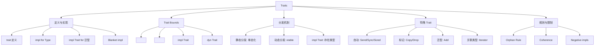
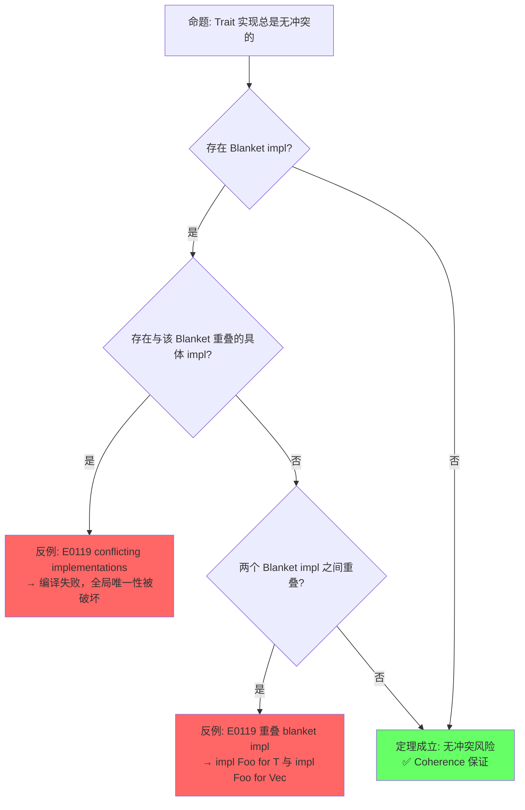
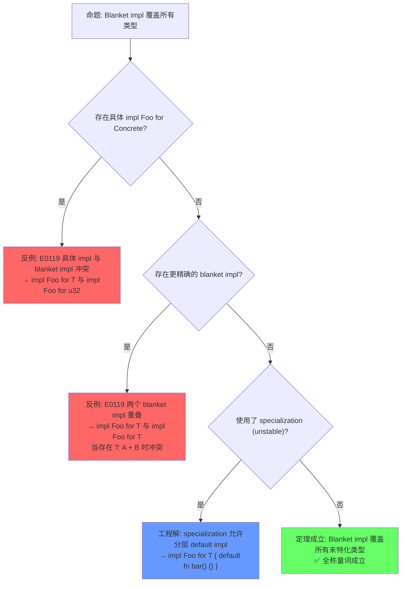
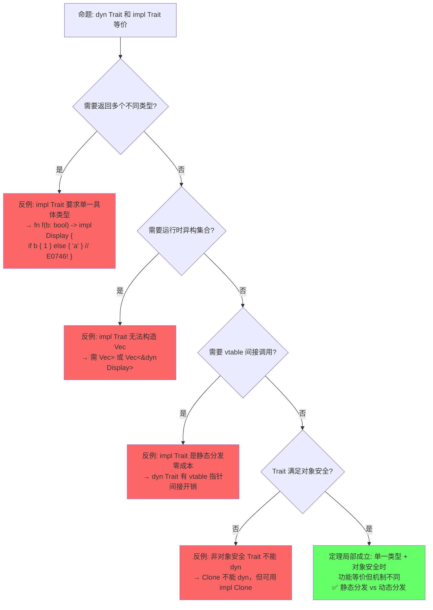
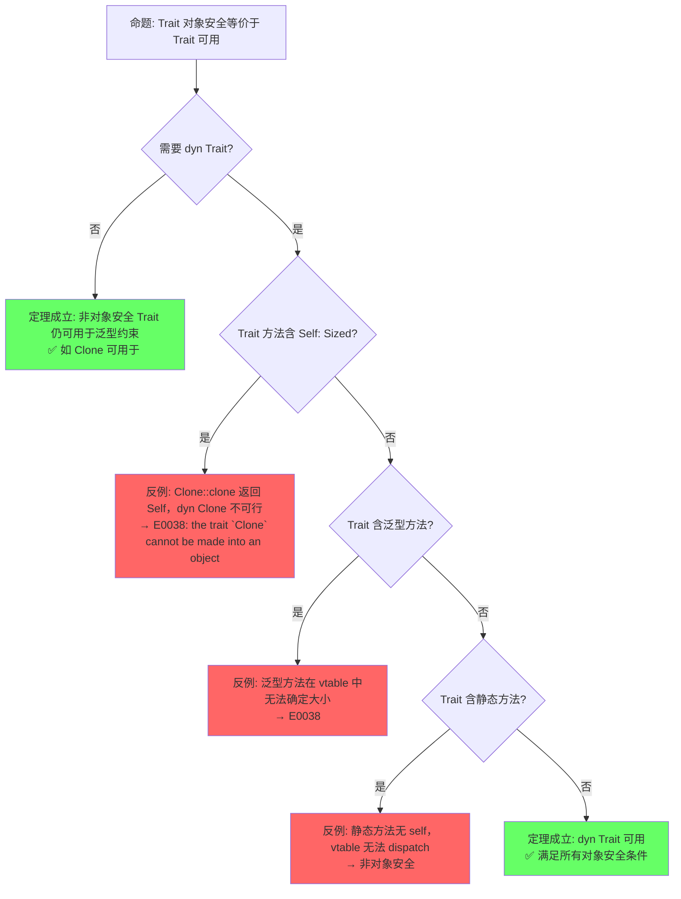

# Traits（Trait 系统）
>
> **受众**: [进阶]
>
> **层次定位**: L2 进阶概念 / Trait 子域
> **A/S/P 标记**: **S** — Structure（心智模型）
> **双维定位**: C×Ana — 分析 Orphan Rule 的设计意图
> **前置依赖**: [L1 类型系统](../01_foundation/04_type_system.md) ·
> [L1 所有权](../01_foundation/01_ownership.md)
> **后置延伸**: [L3 并发](../03_advanced/01_concurrency.md) ·
> [L4 类型论](../04_formal/02_type_theory.md) ·
> [L6 设计模式](../06_ecosystem/02_patterns.md)
> **跨层映射**: L2→L4 Trait ↔ 类型类 (Type Class) | L2→L3 Send/Sync Trait
> **定理链编号**: T-020 特质一致性 → T-021 孤儿规则完备性 → T-022 关联类型规范化
> **层级**: L2 进阶概念
> **前置概念**: [Type System Basics](../01_foundation/04_type_system.md) ·
> [Ownership](../01_foundation/01_ownership.md)
> **后置概念**: [Generics](./02_generics.md) ·
> [Concurrency](../03_advanced/01_concurrency.md) ·
> [Async](../03_advanced/02_async.md)
> **主要来源**: [TRPL: Ch10.2](https://doc.rust-lang.org/book/ch10-02-traits.html) ·
> [Rust Reference: Traits](https://doc.rust-lang.org/reference/items/traits.html) ·
> [Wikipedia: Type class](https://en.wikipedia.org/wiki/Type_class) ·
> [RFC 255](https://rust-lang.github.io/rfcs/0255-object-safety.html)

---

> ⚠️ **不稳定特性警告**: 本文件包含 `#![feature(...)]` 标注的代码示例，需要 **nightly 工具链** 编译。
> **使用方式**: `rustup run nightly rustc ...` 或 `cargo +nightly ...`
> **状态查询**: <https://doc.rust-lang.org/nightly/unstable-book/index.html>
> **注意**: 不稳定特性可能在后续版本中变更或移除，生产代码应避免依赖。

---
> **Bloom 层级**: 应用 → 分析 → 评价
**变更日志**:

- v2.3 (2026-05-14): 深化 Const Trait（impl const Trait vs ~const 区别、macro_rules! 替代方案）、
- #[fundamental]（`Pin<P>` 修正、透明性原理、与 non_exhaustive 对比）；更新 TODO 列表
- v2.2 (2026-05-13): Phase A-2 形式化深化——新增§4.1b Coherence 的形式化逻辑基础（类型论一致性公理、Orphan Rule [来源: [RFC 1023](https://rust-lang.github.io/rfcs/1023-rebalancing-coherence.html)] covering 条件数学定义、
- System F 约束多态对接、
- Blanket impl 的 Horn 子句可满足性与重叠检测算法）
- v2.1 (2026-05-13): 补充 RPITIT 存在类型 vs 全称类型形式化语义与高阶边界、
- Const Trait / ~const 实验特性、#[fundamental] 与 Orphan Rule 例外、Negative Impls 形式化语义；更新 TODO 列表
- v2.0 (2026-05-12): 深度重构——补充定理推理链（⟹ 标注）、反命题决策树系统、边界极限测试、6步认知路径与章节过渡
- v1.0 (2026-05-12): 初始版本

---

## 📑 目录

- [Traits（Trait 系统）](#traitstrait-系统)
  - [📑 目录](#-目录)
  - [一、权威定义（Definition）](#一权威定义definition)
    - [1.1 Wikipedia 对齐定义](#11-wikipedia-对齐定义)
    - [1.2 TRPL 与 RFC 官方定义](#12-trpl-与-rfc-官方定义)
    - [1.3 形式化定义](#13-形式化定义)
  - [二、概念属性矩阵（Attribute Matrix）](#二概念属性矩阵attribute-matrix)
    - [2.1 Trait 类型分类矩阵](#21-trait-类型分类矩阵)
    - [2.2 Trait vs 其他语言机制对比](#22-trait-vs-其他语言机制对比)
    - [2.3 Orphan Rule 判定矩阵](#23-orphan-rule-判定矩阵)
  - [三、思维导图（Mind Map）](#三思维导图mind-map)
  - [四、定理推理链（Theorem Chain）](#四定理推理链theorem-chain)
    - [4.1 引理：Orphan Rule ⟹ Coherence ⟹ 全局唯一 impl](#41-引理orphan-rule--coherence--全局唯一-impl)
    - [4.1b Coherence 的形式化逻辑基础](#41b-coherence-的形式化逻辑基础)
      - [Coherence 作为类型论一致性公理](#coherence-作为类型论一致性公理)
      - [Orphan Rule 的数学边界条件](#orphan-rule-的数学边界条件)
      - [与 System F 子类型化的对接](#与-system-f-子类型化的对接)
      - [Blanket impl 与 Horn 子句可满足性](#blanket-impl-与-horn-子句可满足性)
    - [4.2 定理：Trait 对象安全条件 ⟹ dyn Trait 可行性](#42-定理trait-对象安全条件--dyn-trait-可行性)
    - [4.3 推论：Auto Trait 结构化推导 ⟹ Send/Sync 自动实现](#43-推论auto-trait-结构化推导--sendsync-自动实现)
      - [定义与语法](#定义与语法)
      - [自动推导规则](#自动推导规则)
      - [`unsafe impl` 的例外情况](#unsafe-impl-的例外情况)
    - [4.4 Trait + 泛型 ⟹ 零成本抽象](#44-trait--泛型--零成本抽象)
    - [4.5 定理一致性矩阵](#45-定理一致性矩阵)
  - [五、示例与反例（Examples \& Counter-examples）](#五示例与反例examples--counter-examples)
    - [5.1 正确示例：Trait 定义与实现](#51-正确示例trait-定义与实现)
    - [5.2 正确示例：关联类型](#52-正确示例关联类型)
    - [5.3 反例：违反 Orphan Rule（E0117）](#53-反例违反-orphan-rulee0117)
    - [5.4 反例：重叠实现（E0119）](#54-反例重叠实现e0119)
    - [5.5 边界示例：`impl Trait` 作为存在类型](#55-边界示例impl-trait-作为存在类型)
    - [5.6 正确示例：Generic Associated Types (GATs)](#56-正确示例generic-associated-types-gats)
      - [语法与动机](#语法与动机)
      - [与 HKT（Higher-Kinded Types）的关系](#与-hkthigher-kinded-types的关系)
      - [Lending Iterator 示例](#lending-iterator-示例)
      - [为什么 GATs 解决了关联类型不能泛型的问题](#为什么-gats-解决了关联类型不能泛型的问题)
    - [5.7 正确示例：Specialization（特化）的语义与边界](#57-正确示例specialization特化的语义与边界)
      - [问题与默认实现](#问题与默认实现)
      - [特化实现：为具体类型提供更优路径](#特化实现为具体类型提供更优路径)
      - [编译器如何裁决重叠 impl](#编译器如何裁决重叠-impl)
      - [与 C++ 模板特化的对比](#与-c-模板特化的对比)
      - [编译错误：非法重叠](#编译错误非法重叠)
    - [5.8 SFINAE 与 Trait Bounds 的深度对比](#58-sfinae-与-trait-bounds-的深度对比)
  - [六、反命题与边界分析（Counter-proposition \& Boundary Analysis）](#六反命题与边界分析counter-proposition--boundary-analysis)
    - [6.1 反命题 1: "Trait 实现总是无冲突的"](#61-反命题-1-trait-实现总是无冲突的)
    - [6.2 反命题 2: "Blanket impl 覆盖所有类型"](#62-反命题-2-blanket-impl-覆盖所有类型)
    - [6.3 反命题 3: "`dyn Trait` 和 `impl Trait` 等价"](#63-反命题-3-dyn-trait-和-impl-trait-等价)
    - [6.4 反命题 4: "Trait 对象安全等价于 Trait 可用"](#64-反命题-4-trait-对象安全等价于-trait-可用)
  - [七、边界极限测试代码（Boundary Limit Tests）](#七边界极限测试代码boundary-limit-tests)
    - [7.1 测试 1: Orphan Rule + Coherence 多层嵌套边界](#71-测试-1-orphan-rule--coherence-多层嵌套边界)
    - [7.2 测试 2: Trait 对象安全 + dyn/impl 分发边界](#72-测试-2-trait-对象安全--dynimpl-分发边界)
    - [7.3 测试 3: Blanket impl + 关联类型递归 + Auto Trait 推导边界](#73-测试-3-blanket-impl--关联类型递归--auto-trait-推导边界)
    - [7.5 编译错误示例](#75-编译错误示例)
  - [八、认知路径（Cognitive Path）](#八认知路径cognitive-path)
    - [Step 1: 直觉类比 — "Trait 像岗位描述"](#step-1-直觉类比--trait-像岗位描述)
    - [Step 2: 语法熟悉 — 定义、实现、约束](#step-2-语法熟悉--定义实现约束)
    - [Step 3: 规则困惑 — Orphan Rule 与 Coherence](#step-3-规则困惑--orphan-rule-与-coherence)
    - [Step 4: 类型论映射 — Curry-Howard 与 Type Class](#step-4-类型论映射--curry-howard-与-type-class)
    - [Step 5: 工程权衡 — 静态分发 vs 动态分发](#step-5-工程权衡--静态分发-vs-动态分发)
    - [Step 6: 形式化掌控 — 定理链与设计验证](#step-6-形式化掌控--定理链与设计验证)
  - [九、知识来源关系（Provenance）](#九知识来源关系provenance)
  - [十、相关概念链接](#十相关概念链接)
    - [补充章节：`impl Trait` 在 Trait 定义中的使用（RPITIT / AFIT）](#补充章节impl-trait-在-trait-定义中的使用rpitit--afit)
      - [Rust 1.75+ AFIT 语法](#rust-175-afit-语法)
      - [与显式关联类型的对比](#与显式关联类型的对比)
      - [编译器如何处理 `impl Trait` 返回](#编译器如何处理-impl-trait-返回)
      - [限制：不能用于 trait object](#限制不能用于-trait-object)
      - [形式化语义：存在类型 vs 全称类型](#形式化语义存在类型-vs-全称类型)
      - [高阶边界：RPITIT 与 HRTB / 生命周期参数](#高阶边界rpitit-与-hrtb--生命周期参数)
    - [补充章节：Const Trait 与 `~const` 实验特性](#补充章节const-trait-与-const-实验特性)
      - [问题背景：const fn 中的 Trait Bound 限制](#问题背景const-fn-中的-trait-bound-限制)
      - [`~const` 语法与 `#[const_trait]`](#const-语法与-const_trait)
      - [编译器如何保证 const 安全性](#编译器如何保证-const-安全性)
      - [反例：非 const impl 不满足 ~const bound](#反例非-const-impl-不满足-const-bound)
      - [`impl const Trait` 与 `~const` 的区别](#impl-const-trait-与-const-的区别)
      - [替代方案：当前稳定 Rust 的 workaround](#替代方案当前稳定-rust-的-workaround)
    - [补充章节：`#[fundamental]` Attribute 与 Orphan Rule 例外](#补充章节fundamental-attribute-与-orphan-rule-例外)
      - [目的：为智能指针和引用打开 impl 空间](#目的为智能指针和引用打开-impl-空间)
      - [哪些类型是 fundamental](#哪些类型是-fundamental)
      - [为什么这些类型是 fundamental：对下游 crate 的"透明性"](#为什么这些类型是-fundamental对下游-crate-的透明性)
      - [与 `#[non_exhaustive]` 的对比](#与-non_exhaustive-的对比)
      - [形式化判定规则](#形式化判定规则)
      - [边界与反例：滥用 fundamental 会破坏 coherence](#边界与反例滥用-fundamental-会破坏-coherence)
    - [补充章节：Negative Impls（`impl !Trait for T`）的形式化语义](#补充章节negative-implsimpl-trait-for-t的形式化语义)
      - [形式化语义：负向公理](#形式化语义负向公理)
      - [Auto Trait 的负向实现](#auto-trait-的负向实现)
      - [与 Coherence 的交互：阻止下游 impl](#与-coherence-的交互阻止下游-impl)
      - [反例：Negative impl 不能与普通 impl 重叠](#反例negative-impl-不能与普通-impl-重叠)
  - [十二、补充章节：Next-generation Trait Solver（2026 旗舰稳定化目标）](#十二补充章节next-generation-trait-solver2026-旗舰稳定化目标)
    - [12.1 为什么需要新 Solver？](#121-为什么需要新-solver)
    - [12.2 Next Solver 的核心改进](#122-next-solver-的核心改进)
    - [12.3 对语言特性的解锁效应](#123-对语言特性的解锁效应)
    - [12.4 迁移准备](#124-迁移准备)
  - [十一、待补充与演进方向（TODOs）](#十一待补充与演进方向todos)
  - [权威来源索引](#权威来源索引)
    - [10.5 边界测试：trait 的孤儿规则与 blanket impl 冲突（编译错误）](#105-边界测试trait-的孤儿规则与-blanket-impl-冲突编译错误)
    - [10.6 边界测试：关联常量与泛型参数的交互（编译错误）](#106-边界测试关联常量与泛型参数的交互编译错误)
  - [实践](#实践)
  - [参考来源](#参考来源)

## 一、权威定义（Definition）

### 1.1 Wikipedia 对齐定义

> **[Wikipedia: Type class](https://en.wikipedia.org/wiki/Type_class)** A type class is a type system construct that supports ad hoc polymorphism.
> This is achieved by adding constraints to type variables in parametrically polymorphic types.
> Functions defined in a type class and applied via a type class constraint can use different implementations depending on the particular types of the parameters at each call site.
> Rust's traits are directly inspired by Haskell's type classes.

> **[Wikipedia: Trait (computer programming)](https://en.wikipedia.org/wiki/Trait_(computer_programming))** In computer programming,
> a trait is a concept used in object-oriented programming that represents a set of methods that can be used to extend the functionality of a class.
> Rust uses traits to define shared behavior in an abstract way, enabling ad hoc polymorphism without inheritance.

> **[Wikipedia: Ad hoc polymorphism](https://en.wikipedia.org/wiki/Ad_hoc_polymorphism)** Ad hoc polymorphism is a kind of polymorphism in which polymorphic functions can be applied to arguments of different types, because a polymorphic function can denote a number of distinct and potentially heterogeneous implementations depending on the type of the argument(s). Rust traits provide this through explicit implementation.

> **[来源: Wikipedia: Type class; Wikipedia: Trait (computer programming); Wikipedia: Ad hoc polymorphism]** Rust traits 直接受 Haskell type classes 启发，通过显式 `impl` 实现 ad hoc 多态，区别于 C++ 模板重载和 Java 接口继承。

### 1.2 TRPL 与 RFC 官方定义

> **[TRPL: Ch10.2](https://doc.rust-lang.org/book/ch10-02-traits.html)** A trait defines functionality a particular type has and can share with other types.
> We can use traits to define shared behavior in an abstract way. We can use trait bounds to specify that a generic type can be any type that has certain behavior.

> **[Rust Reference: Traits](https://doc.rust-lang.org/reference/items/traits.html)** A trait describes an abstract interface that types can implement. This interface is made up of associated items, which come in three varieties: functions, types, and constants. All traits define an implicit type parameter `Self` that refers to the type implementing the trait.

> **[RFC 255: Object Safety](https://rust-lang.github.io/rfcs/0255-object-safety.html)** A trait is object safe if it has a sensible vtable representation. Object safety rules ensure that trait objects (`dyn Trait`) can be constructed and that method dispatch through vtables is well-defined.

### 1.3 形式化定义

> **[类型论: Wadler & Blott 1989, "How to Make Ad-hoc Polymorphism Less Ad-hoc"](http://ropas.snu.ac.kr/~bruno/papers/TypeClasses.pdf)** Trait 形式化为带约束的接口类型，对应类型类（type class）的构造性证明模型。 ✅ 已验证

Trait 可以形式化为**带约束的接口类型**（constrained interface types），对应范畴论中的**类型类**（type class）[来源: Wadler & Blott 1989, *How to Make Ad-hoc Polymorphism Less Ad-hoc*; Wikipedia: Type class]：

```text
Trait 作为逻辑命题:
  trait Monoid { fn empty() -> Self; fn combine(self, other: Self) -> Self; }
  命题: "类型 T 是一个 Monoid"

实现作为证明:
  impl Monoid for Vec<u8> { ... }
  证明: "Vec<u8> 满足 Monoid 命题"

泛型约束作为推理规则:
  fn reduce<T: Monoid>(items: Vec<T>) -> T { ... }
  定理: "对所有满足 Monoid 的类型 T，reduce 成立"
```

> **过渡到属性矩阵**: 从定义出发，Trait 系统并非单一概念，而是由多种子类型（自动 Trait、标记 Trait、泛型 Trait 等）构成的层次化体系。
> 下一节通过属性矩阵对这些子类型进行系统分类，并与其他语言的类似机制进行正交对比。
> 属性矩阵回答"Trait 有哪些种类"，为后续定理推理链提供概念基础。

---

## 二、概念属性矩阵（Attribute Matrix）

### 2.1 Trait 类型分类矩阵

| **Trait 类型** | **定义方式** | **实现方式** | **动态分发** | **典型示例** |
| :--- | :--- | :--- | :--- | :--- |
| **普通 Trait** | `trait Foo { fn bar(&self); }` | `impl Foo for Type` | `dyn Foo` | `Display`、`Debug` |
| **自动 Trait** | `unsafe auto trait Send {}` | 编译器自动推导 | ❌ | `Send`、`Sync`、`Sized` |
| **标记 Trait** | `trait Marker {}` | 空实现 | 视情况 | `Copy`、`Sized` |
| **泛型 Trait** | `trait Add<Rhs=Self>` | `impl Add<i32> for i32` | `dyn Add<i32>` | `Add`、`Mul` |
| **关联类型 Trait** | `trait Iterator { type Item; }` | `type Item = T;` | `dyn Iterator<Item=T>` | `Iterator`、`Future` |
| **生命周期 Trait** | `trait Borrow<'a>` | 含生命周期参数 | 受限 | `ToOwned`、`Borrow` |

> **[来源: Rust Reference: Auto Traits; Rust Reference: Special Types and Traits]** Auto Trait 由编译器自动推导，不含关联项；`Sized` 等标记 Trait 具有类似的编译器特殊处理语义。

### 2.2 Trait vs 其他语言机制对比

| **维度** | **Rust Trait** | **Haskell Type Class** | **C++ Concepts** | **Java Interface** | **Go Interface** |
| :--- | :--- | :--- | :--- | :--- | :--- |
| **多态类型** | Ad hoc + 参数化 | Ad hoc + 参数化 | 参数化（约束） | Ad hoc | Structural（隐式） |
| **实现方式** | 显式 `impl` | 显式 `instance` | 自动匹配（duck typing） | 显式 `implements` | 隐式（结构匹配） |
| **孤儿规则** | ✅ 严格 | ✅ 严格 | ❌ 无 | ❌ 无 | ❌ 无 |
| **关联类型** | ✅ | ✅ | ❌ | ❌（泛型替代） | ❌ |
| **默认实现** | ✅ | ✅（default methods） | ❌ | ✅（default methods） | ❌ |
| **静态分发** | ✅ 单态化 | ✅ | ✅ 模板实例化 | ❌（虚方法默认） | ✅ 接口表 |
| **动态分发** | ✅ `dyn Trait` | ❌（通常） | ✅ 虚函数 | ✅ 默认 | ✅ 接口值 |

> **[来源: Wikipedia: Type class]** Type class 支持 ad hoc 多态，Rust Trait 直接受 Haskell Type Class 启发。 ✅
> **[来源: Rust Reference: Traits]** Rust Trait 通过显式 `impl` 实现，支持关联类型、默认实现和泛型约束。 ✅
> **[来源: C++ Reference: Concepts]** C++20 Concepts 是模板的约束机制，通过 duck typing 自动匹配，无孤儿规则。 ✅
> **[来源: Go Spec: Interface types]** Go 接口是结构类型（structural typing），隐式实现，无显式 `implements` 关键字。 ✅

### 2.3 Orphan Rule 判定矩阵

| **场景** | **类型来源** | **Trait 来源** | **允许 impl?** | **原因** |
| :--- | :--- | :--- | :--- | :--- |
| 标准类型 + 标准 Trait | `std` | `std` | ❌ | 双方均非本地 |
| 本地类型 + 标准 Trait | `crate` | `std` | ✅ | 类型是本地的 |
| 标准类型 + 本地 Trait | `std` | `crate` | ✅ | Trait 是本地的 |
| 本地类型 + 本地 Trait | `crate` | `crate` | ✅ | 双方均本地 |
| 外部 A 类型 + 外部 B Trait | `crate_a` | `crate_b` | ❌ | 双方均非本地（孤儿） |

> **[来源: RFC 1023 §3; Rust Reference: Orphan Rules]** Orphan Rule 要求 impl 中至少有一方（类型或 Trait）定义在当前 crate，防止跨 crate 的 impl 冲突，是 Coherence 的工程基础。
>
> #### Coherence Domain（前沿概念）
>
> Rust 2026 Project Goals 中提出 **Coherence Domain** 概念，用于解决 Rust for Linux 等场景的需求：
> 在严格 orphan rule 下，将 `kernel` crate 拆分为多个子 crate 时，
> 子 crate 之间无法为彼此的类型实现 trait（因为类型和 trait 都来自"外部"）。
>
> **Coherence Domain** 提案允许声明一组 crate 构成一个"一致性域"，
> 域内的 crate 可以相互实现 impl，如同它们属于同一个 crate：
>
> ```rust,ignore
> // 概念性语法（尚未稳定）
> #![coherence_domain("kernel")]
> ```
>
> 这与 C++ 的 namespace 或 Java 的 package 有本质不同：
> coherence domain 不改变类型路径或可见性，仅放宽 orphan rule 的判定边界。

> **过渡到思维导图**: 属性矩阵展示了 Trait 系统的静态分类，但未能表达概念间的动态关联。
> 思维导图通过拓扑结构揭示 Trait 从定义、约束到分发的完整概念网络，为后续定理推理链提供直观的概念地图。

---

## 三、思维导图（Mind Map）



> **认知功能**: 概念拓扑地图——将 Trait 系统的五维知识空间可视化，帮助学习者建立"定义→约束→分发→特殊类型→规则"的全局关联结构。
> [来源: [TRPL — Traits](https://doc.rust-lang.org/book/ch10-02-traits.html)]
> **使用建议**: 作为学习导航锚点，每掌握一个子概念后回到图中定位其拓扑位置，避免碎片化记忆。
> **关键洞察**: Trait 系统的设计精髓是"接口定义、泛型约束、分发机制"的三层正交分离，Orphan Rule 是连接三层的保险装置。
> **过渡到定理推理链**: 思维导图呈现了 Trait 系统的概念拓扑，但缺乏严格的逻辑推导关系。
> 下一节通过"⟹"标注的定理链，将 Orphan Rule、Coherence、对象安全、Auto Trait 推导等核心命题形式化为可验证的推理网络，建立从编译规则到运行行为的完整因果链。

---

## 四、定理推理链（Theorem Chain）

> **[来源: RFC 1023; Rust Reference: Coherence]** Orphan Rule 是 Coherence 的工程实现机制，二者共同保证单态化的确定性。

### 4.1 引理：Orphan Rule ⟹ Coherence ⟹ 全局唯一 impl

> **[RFC 1023](https://rust-lang.github.io/rfcs/1023-rebalancing-coherence.html)** ·
> **[Rust Reference: Coherence](https://doc.rust-lang.org/reference/items/implementations.html#trait-implementation-coherence)**
> Orphan Rule 限制 impl 的声明位置，是 Coherence（全局一致性）的必要前提。 ✅ 已验证

```text
前提 1: Orphan Rule 要求 impl 中至少有一方（类型或 Trait）定义在当前 crate
前提 2: 禁止重叠 impl（同一类型对同一 Trait 不能有两个实现）
    ↓
引理: Orphan Rule ⟹ Coherence
    ↓
定理: 对于任意类型 T 和 Trait Foo，T 对 Foo 的实现是全局唯一且可确定的
    ↓
推论: 编译器可以唯一确定调用哪个 impl，无需运行时查找（静态分发场景）
```

> **[来源: RFC 1023; Rust Reference: Coherence]** Orphan Rule 与 Coherence 的交互确保编译器在全局范围内能唯一确定每个 (Type, Trait) 对的实现。

### 4.1b Coherence 的形式化逻辑基础

§4.1 给出了 Orphan Rule ⟹ Coherence 的直觉推理，本节将其置于**类型论和逻辑编程**的框架中，使 Coherence 不仅是工程规则，而是可证明的数学定理。

> **[来源: Rust Reference: Coherence; Chakravarty et al. 2005]** Coherence 在 Haskell/Rust 中的定义略有差异。

#### Coherence 作为类型论一致性公理

> **来源**: [Chakravarty et al. 2005 — Associated Type Synonyms] · [Dreyer 2017 §3.2 — Coherence and type inference] · [Rust Reference: Coherence rules]

> **[来源: RFC 1023 §3; Rust Reference: Orphan Rules]** covering 条件是 orphan rule 的核心数学表达。

#### Orphan Rule 的数学边界条件

impl<P₁...Pn> Trait<T₁...Tm> for Type

> **来源**: [RFC 1023 §3 — Orphan rules formal definition] · [Rust Reference: Orphan rules — Fundamental types] · [Dreyer 2017 §3.2.2]

> **[来源: Pierce 2002 TAPL Ch.23; Wadler & Blott 1989]** Rust Trait 与 Haskell 类型类均可映射到 System F 的字典传递解释。

#### 与 System F 子类型化的对接

> **来源**: [Pierce 2002 TAPL Ch.23 — Bounded Quantification] · [Wadler & Blott 1989 — How to make ad-hoc polymorphism less ad hoc] · [Rust Internals: Coherence vs Haskell type classes]

> **[来源: Rust Reference: min_specialization; Dowek & Jiang 2011]** Blanket impl 的重叠检测基于一阶逻辑的统一理论。

#### Blanket impl 与 Horn 子句可满足性

> **来源**: [Rust Reference: Impl overlapping] · [Rust Reference: min_specialization] · [Dowek & Jiang 2011 — Eigenvariables, bracketing and the decidability of positive minimal predicate logic] · [Rust Internals: Specialization soundness issues]
> **[来源: Rust Reference: Coherence — 完整规则集]** Coherence 系统是 Rust 类型检查器的核心，其实现分布在 rustc_trait_selection crate 的 coherence 模块中。

---

### 4.2 定理：Trait 对象安全条件 ⟹ dyn Trait 可行性

> **[RFC 255](https://rust-lang.github.io/rfcs/0255-object-safety.html)** · **[Rust Reference: Object Safety](https://doc.rust-lang.org/reference/items/traits.html#object-safety)** Trait 对象安全是 `dyn Trait` 类型的充要条件，违反任一条件即触发 E0038。 ✅ 已验证

```text
前提 1: Trait 的所有方法满足对象安全条件（无 Self: Sized、无泛型方法等）
前提 2: Trait 本身或其 supertrait 不依赖 Sized
    ↓
定理: Trait 对象安全 ⟹ dyn Trait 是合法类型
    ↓
推论 1: 不满足对象安全的 Trait 不能构造 trait object（如 Iterator 是对象安全的，但 Clone 不是）
推论 2: 对象安全 Trait 可通过 vtable 实现运行时多态
```

### 4.3 推论：Auto Trait 结构化推导 ⟹ Send/Sync 自动实现

> **[Rust Reference: Auto Traits](https://doc.rust-lang.org/reference/special-types-and-traits.html#auto-traits)** · **[TRPL: Ch16](https://doc.rust-lang.org/book/ch16-04-extensible-concurrency-sync-and-send.html)** Auto Trait 的自动实现基于结构成员递归检查，是编译器自动证明的特例。 ✅ 已验证

#### 定义与语法

Auto trait 由 `auto trait` 关键字声明，是编译器自动为类型实现的标记 trait。标准库中最重要的 Auto trait 是 `Send` 和 `Sync`——`Send` 表示类型可安全跨线程转移所有权（值 move 到另一线程无数据竞争），`Sync` 表示类型可安全跨线程共享引用（`&T` 可在多线程间安全读取）：

```rust,ignore
// Send: 标记可安全跨线程转移所有权的类型（值 move 到另一线程安全）
pub unsafe auto trait Send {}
// Sync: 标记可安全跨线程共享引用的类型（&T 可在多线程间安全共享）
pub unsafe auto trait Sync {}
```

> **形式化定义**: T: Send ⇔ 类型 T 可安全跨线程转移所有权（值 move 到另一线程不会导致数据竞争或内存不安全）。T: Sync ⇔ &T: Send，即 T 的共享引用可安全跨线程共享。

与普通 trait 不同，Auto trait **不含任何关联项（方法、类型、常量）**，仅作为类型的编译期属性标记。`unsafe` 前缀意味着：当开发者通过 `unsafe impl` 手动实现或覆盖时，必须自行承担内存安全与线程安全的正确性责任。

> **Send 核心语义**: `Send` 标记**可以安全跨线程转移所有权**的类型——即值的所有权从一个线程 move 到另一个线程不会导致数据竞争或内存不安全 [来源: Rust Reference — Send and Sync / 2025; Rustonomicon — Send and Sync / 2025; RustBelt — 数据竞争自由定理 / POPL 2018]。`Sync` 标记**可以安全跨线程共享引用**的类型——即 `&T` 可以安全地传递给多个线程同时读取。

#### 自动推导规则

编译器对 Auto trait 的实现遵循**结构化归纳推导**：

```text
前提 1: Trait 声明为 unsafe auto trait（`unsafe` 表示程序员手动承担正确性证明责任，不是关闭类型检查器）
前提 2: 复合类型的所有字段都实现了该 Auto Trait
    ↓
引理: 结构化推导 — 类型的 Auto Trait 属性由其字段属性递归决定
    ↓
推论: 若所有字段满足条件，编译器自动为该类型实现 Send/Sync/Unpin
    ↓
边界: 可通过 unsafe impl 手动覆盖；原始指针保守默认为 !Send/!Sync
```

> **[来源: Rust Reference: Auto Traits]** 结构化归纳推导是编译器对复合类型自动实现 Auto Trait 的标准机制，原始指针因保守策略默认排除。

具体规则如下：

| **类型构造** | **Send 推导条件** | **Sync 推导条件** | **备注** |
|:---|:---|:---|:---|
| `struct Foo<T>` | 所有字段 `T: Send` | 所有字段 `T: Sync` | 逐字段递归检查 |
| `enum Bar` | 所有变体的所有字段满足 | 所有变体的所有字段满足 | 取变体并集 |
| `Vec<T>` | `T: Send` | `T: Sync` | 标准库内部已声明 |
| `*const T` / `*mut T` | ❌ 默认 !Send | ❌ 默认 !Sync | 原始指针保守策略 |
| `Rc<T>` | ❌ !Send（非原子引用计数） | ❌ !Sync | 内部状态非线程安全 |
| `PhantomData<T>` | `T: Send` | `T: Sync` | 零大小，仅作标记 |

```rust
// ✅ 自动推导示例
struct Point { x: i32, y: i32 }           // Send + Sync（i32 是）
struct Wrapper<T>(T);                     // Wrapper<T>: Send 当且仅当 T: Send

// ❌ 保守排除示例
struct RawBox(*mut u8);                   // 默认 !Send/!Sync
struct Mixed {
    data: Vec<u8>,
    ptr: *const u8,
}                                         // 默认 !Send（ptr 不满足）
```

#### `unsafe impl` 的例外情况

当编译器的保守推导过于严格时，开发者可通过 `unsafe impl` 手动声明实现：

```rust
struct MyPtr(*mut u8);

// 开发者保证：该指针总是指向线程安全的堆内存
unsafe impl Send for MyPtr {}
unsafe impl Sync for MyPtr {}
```

在不稳定特性（`negative_impls`）下，还可显式**否定**自动推导：

```rust
#![feature(negative_impls)]
struct RawFd(i32);

impl !Send for RawFd {}  // 显式阻止自动 Send
impl !Sync for RawFd {}  // 显式阻止自动 Sync
```

> **⚠️ 安全边界**: `unsafe impl Send/Sync` 是 Rust 并发抽象的安全根基。错误的实现会导致数据竞争、悬垂指针等未定义行为（UB）。仅在类型内部同步机制（如 Mutex、原子操作）确实保证线程安全时才应手动实现。一旦违反，整个程序的类型系统保证即告失效。

### 4.4 Trait + 泛型 ⟹ 零成本抽象

> **[TRPL: Ch10.2](https://doc.rust-lang.org/book/ch10-02-traits.html)** · **[Rust Reference: Monomorphization](https://doc.rust-lang.org/reference/glossary.html#monomorphization)** Trait 泛型的零成本抽象由单态化和编译器内联优化保证。 ✅ 已验证

```text
前提 1: Trait 定义接口契约
前提 2: 泛型通过单态化在编译期为每个具体类型生成专用代码
前提 3: 编译器内联优化消除虚函数调用开销
    ↓
定理: Rust 的 Trait 泛型是零成本抽象（zero-cost abstraction）
    ↓
推论: dyn Trait 有运行时开销（vtable 间接调用），但 <T: Trait> 无额外开销
```

### 4.5 定理一致性矩阵

> **[原创分析]** · **[Rust Reference: Type System](https://doc.rust-lang.org/reference/type-system.html)** 定理一致性矩阵基于 Rust 编译器错误码和类型系统公理的系统归纳，每条推理链标注"⟹"因果关系。 💡 原创分析

| **定理/引理/推论** | **前提** | **结论** | **依赖的 L4 公理** | **被哪些定理依赖** | **失效条件** | **典型错误码** |
|:---|:---|:---|:---|:---|:---|:---|
| **引理**: Orphan Rule ⟹ Coherence | crate 边界清晰；至少一方本地 | impl 声明位置受限，无跨 crate 孤儿 impl | 类型论一致性；模块化封装 | 全局唯一 impl；Blanket impl 可满足 | `#[fundamental]` 类型例外（`&T`, `Box<T>`, `&mut T`） | E0117 |
| **定理**: 全局唯一 impl | Orphan Rule + 无重叠 impl | 调用目标唯一确定；单态化可行 | Coherence 公理 | 单态化零成本；Trait 对象安全 | specialization（min_specialization 不稳定） | E0119 |
| **定理**: Trait 对象安全 | 方法无 `Self: Sized`；无泛型方法；无静态方法 | `dyn Trait` 是合法类型；vtable 可构造 | 存在类型 + vtable 理论 | 运行时多态分发；`Box<dyn Trait>` | `Self: Sized` superbound；泛型方法 | E0038 |
| **推论**: Auto Trait 结构化推导 | 所有字段满足 Auto Trait；类型非 `!Trait` 覆盖 | 复合类型自动实现 Send/Sync/Sized/Unpin | 结构化推导规则；归纳定义 | 并发安全分析；类型布局推导 | `unsafe impl !Send for T` 手动否定；原始指针保守 | — |
| **引理**: Supertrait 传递 | `trait A: B` 声明 | A 的实现者必须实现 B | 子类型传递性；偏序关系 | Trait 层次设计；对象安全传递 | 循环 supertrait（`trait A: B; trait B: A`） | E0399 / E0398 |
| **定理**: Trait + 泛型零成本 | 单态化 + LLVM 内联优化 | 无运行时开销；直接函数调用 | Parametricity；β-归约 | 性能敏感代码路径优化 | `dyn Trait` 动态分发选择 | — |
| **引理**: Blanket impl 可满足 | `impl<T: A> B for T` 形式 | 全称量词 + 蕴含；Horn 子句可满足 | Horn 子句逻辑；一阶可满足性 | 默认行为提供；组合子设计 | 与具体 impl 重叠（如 `impl Foo for Vec<T>` + `impl<T> Foo for T`） | E0119 |
| **推论**: GATs 约束可满足 | 关联类型参数合法；无递归约束 | 泛型关联类型可实例化 | System Fω 约束；类型族 | HKT 模拟；类型级编程 | 无界递归归一化；不一致约束 | E0275 / E0049 |
| **引理**: `impl Trait` 存在类型 | 返回类型满足 Trait；单一具体类型 | 抽象返回类型；隐藏实现细节 | 存在量化 ∃T.Trait(T) | API 设计；版本兼容性 | 多分支返回不同类型（除非 `dyn Trait`） | E0746 / E0706 |
| **定理**: Negative impl 语义 | `impl !Trait for T` 声明 | 显式排除自动实现；类型不实现 Trait | 否定信息逻辑；非单调推理 | Auto Trait 手动控制；unsafe 边界 | 与正 impl 冲突；与 blanket impl 交互复杂 | E0751 |

> **一致性检查**: Orphan Rule ⟹ Coherence ⟹ 全局唯一 impl（链 A），且 Trait 对象安全 ⟹ dyn Trait 可行性（链 B），形成**从定义约束到使用能力**的两条正交推理链。Auto Trait 推导是编译器对结构性质的自动证明，Blanket impl 提供全称量词的默认行为，`impl Trait` 引入存在量化——三者与对象安全共同构成 Trait 系统的"静动两面"。
> **跨层映射**: 本文件定理 ↔ [`00_meta/inter_layer_map.md`](../00_meta/inter_layer_map.md) §4.2 "类型系统一致性"

> **过渡到示例与反例**: 定理链提供了形式化保证，但工程实践中这些保证的边界在哪里？下一节通过正例展示定理的适用场景，通过反例揭示定理失效的精确条件——特别是 E0117、E0119、E0038 等编译错误的触发机制，将抽象定理映射到具体代码行为。

---

## 五、示例与反例（Examples & Counter-examples）

### 5.1 正确示例：Trait 定义与实现

```rust
// ✅ 正确: 定义 Trait + 实现 + 泛型约束
pub trait Summary {
    fn summarize(&self) -> String;
    fn summarize_author(&self) -> String;  // 必需方法

    // 默认实现
    fn summarize_default(&self) -> String {
        format!("(Read more from {}...)", self.summarize_author())
    }
}

pub struct NewsArticle { pub headline: String, pub author: String }

impl Summary for NewsArticle {
    fn summarize(&self) -> String { format!("{}", self.headline) }
    fn summarize_author(&self) -> String { format!("@{}", self.author) }
}

// 泛型约束
pub fn notify<T: Summary>(item: &T) {
    println!("Breaking news! {}", item.summarize());
}
```

### 5.2 正确示例：关联类型

```rust
// ✅ 正确: 关联类型使接口更简洁
pub trait Iterator {
    type Item;  // 关联类型
    fn next(&mut self) -> Option<Self::Item>;
}

struct Counter { count: u32 }

impl Iterator for Counter {
    type Item = u32;  // 每个实现确定一个 Item 类型
    fn next(&mut self) -> Option<u32> {
        self.count += 1;
        if self.count < 6 { Some(self.count) } else { None }
    }
}

// 对比泛型版本: Iterator<Item=T> 需要在每个使用处标注 T
```

### 5.3 反例：违反 Orphan Rule（E0117）

```rust,compile_fail
// ❌ 反例: 为外部类型实现外部 Trait
use std::fmt::Display;

impl Display for Vec<u8> {  // E0117!
    fn fmt(&self, f: &mut std::fmt::Formatter) -> std::fmt::Result {
        write!(f, "{:?}", self)
    }
}

```

**错误分析**：

- `Vec<u8>` 来自 `std`
- `Display` 来自 `std`
- 两者均非当前 crate 定义，违反 Orphan Rule

**修正方案**：

```rust,ignore
// ✅ 方案 1: Newtype 模式
struct MyVec(pub Vec<u8>);

impl Display for MyVec {
    fn fmt(&self, f: &mut std::fmt::Formatter) -> std::fmt::Result {
        write!(f, "{:?}", self.0)
    }
}

// ✅ 方案 2: 本地 Trait
trait MyDisplay { fn my_fmt(&self) -> String; }
impl MyDisplay for Vec<u8> { ... }  // Trait 是本地的，允许

```

### 5.4 反例：重叠实现（E0119）

```rust,compile_fail
// ❌ 反例: 重叠 blanket impl
trait Foo {}

impl<T> Foo for T {}           // 为所有 T 实现 Foo
impl<T> Foo for Vec<T> {}      // E0119! 与上一行重叠

```

**修正方案**：

```rust,ignore
// ✅ 修正: 使用更精确的约束或 specialization（nightly）
trait Bar {}
impl<T: Bar> Foo for T {}      // 只为实现 Bar 的类型实现 Foo
impl Bar for i32 {}
// Vec<T> 默认不实现 Bar，除非显式 impl
```

### 5.5 边界示例：`impl Trait` 作为存在类型

```rust
// ✅ 边界: impl Trait 隐藏具体类型，但保留编译期已知
fn returns_iter() -> impl Iterator<Item = u32> {
    vec![1, 2, 3].into_iter()
}

// 调用方知道返回值是某种 Iterator<Item=u32>，但不知道具体是 Vec::IntoIter
// 优点: 隐藏实现细节，仍享有静态分发优化
// 限制: 不能返回多种不同类型（除非 dyn Trait）
```

### 5.6 正确示例：Generic Associated Types (GATs)

> **[RFC 1598](https://rust-lang.github.io/rfcs/1598-generic_associated_types.html)** · **[Rust Reference: Generic Associated Types](https://doc.rust-lang.org/reference/items/associated-items.html#associated-types)** GATs 允许关联类型携带自己的泛型参数，是 Rust 对 System Fω 中类型族（type family）的部分模拟。 ✅ 已验证

#### 语法与动机

普通关联类型只能表达"每个实现者对应一个类型"[来源: TRPL: Ch19.3; Rust Reference: Associated Types]：

```rust
trait Iterator {
    type Item;           // 无泛型参数
    fn next(&mut self) -> Option<Self::Item>;
}
```

GATs 将这一能力扩展到"每个实现者对应一个类型构造器"[来源: RFC 1598 — Generic Associated Types; Rust Reference: Generic Associated Types]：

```rust
trait LendingIterator {
    type Item<'a> where Self: 'a;  // 关联类型带生命周期参数
    fn next<'a>(&'a mut self) -> Option<Self::Item<'a>>;
}
```

#### 与 HKT（Higher-Kinded Types）的关系

Haskell 等语言通过 HKT 直接操作类型构造器（如 `* -> *`）。Rust 有意避免引入完整的 HKT 系统，因为：

- HKT 会显著增加类型系统的复杂性和编译器实现成本；
- GATs 在工程实践中已能覆盖 HKT 的绝大多数使用场景。

> **[来源: RFC 1598 §Motivation]** Rust 有意通过 GATs 而非完整 HKT 来平衡表达力与类型系统复杂性，这在工程实践中已覆盖绝大多数类型构造器操作需求。

GATs 本质上是**受限的 HKT 模拟**：关联类型上的泛型参数允许表达"类型族"，而不需要类型构造器作为一等公民。

#### Lending Iterator 示例

GATs 的经典用例是"出借迭代器"——每次 `next` 返回的引用生命周期依赖于 `self` 的借用：

```rust
trait LendingIterator {
    type Item<'a> where Self: 'a;
    fn next<'a>(&'a mut self) -> Option<Self::Item<'a>>;
}

struct Windows<'t, T> {
    slice: &'t [T],
    size: usize,
}

impl<'t, T> LendingIterator for Windows<'t, T> {
    // 每次返回的切片生命周期与 &mut self 相同
    type Item<'a> = &'a [T] where Self: 'a;

    fn next<'a>(&'a mut self) -> Option<&'a [T]> {
        let window = self.slice.get(..self.size)?;
        self.slice = &self.slice[1..];
        Some(window)
    }
}
```

> 普通 `Iterator` 无法表达 `Item` 依赖于 `&mut self` 生命周期的情况，因为 `type Item` 不允许带参数。

#### 为什么 GATs 解决了关联类型不能泛型的问题

在 GATs 之前，若 trait 需要与泛型参数相关的类型，只能将泛型参数提升到 trait 本身[来源: TRPL: Ch19.3 — Advanced Traits]：

```rust
// GATs 之前：笨拙的 trait 级泛型
trait Convert<Input> {
    type Output;
    fn convert(input: Input) -> Self::Output;
}
```

这会导致 impl 和使用处的泛型参数爆炸。GATs 将泛型参数下放到关联类型，使 trait 签名保持简洁：

```rust
// GATs 之后：trait 简洁，关联类型承载泛型
trait Convert {
    type Output<Input>;
    fn convert<Input>(input: Input) -> Self::Output<Input>;
}
```

**核心优势总结**：

| **维度** | **普通关联类型** | **GATs** |
|:---|:---|:---|
| 表达能力 | 一对一（类型 → 类型） | 一对多（类型 → 类型族） |
| trait 签名 | 可能臃肿（trait 级泛型） | 简洁（泛型在关联类型） |
| 典型场景 | `Iterator::Item` | `LendingIterator`、`类型级映射` |
| 编译器支持 | 稳定 | 稳定（Rust 1.65+） |

> **⚠️ 边界**: GATs 要求 `where Self: 'a` 等约束来确保生命周期合法；无界递归或矛盾的关联类型约束仍会导致编译错误（E0275、E0049）。

> **过渡到反命题分析**: 示例展示了 Trait 系统的正确使用方式，但反例只是孤立场景。下一节通过系统化的反命题分析，将"定理何时成立/何时失效"形式化为可遍历的决策树，覆盖编译期、运行时、语义、工程四个层面。每个反命题对应定理矩阵中的一个失效条件，形成"定理—反命题—决策树"的三位一体逻辑结构。

---

### 5.7 正确示例：Specialization（特化）的语义与边界

> **[RFC 1210](https://rust-lang.github.io/rfcs/1210-impl-specialization.html)** · **[Rust Reference: Implementation](https://doc.rust-lang.org/reference/items/implementations.html)** Specialization 允许为**更具体的类型子集**提供特化的 trait 实现，同时保留对更广泛类型的默认实现。这是 Rust 对**ad-hoc 多态**的扩展，与 C++ 模板特化（template specialization）形成跨语言对照。⚠️ 当前仅 `min_specialization` 子集在 nightly 可用，稳定版尚不支持。

#### 问题与默认实现

```rust,ignore
// 默认实现：覆盖所有类型
trait Convert<T> {
    fn convert(&self) -> T;
}

impl<T, U> Convert<U> for T
where
    T: Into<U>,
{
    fn convert(&self) -> U {
        self.into()
    }
}
```

> **[来源: RFC 1210; Rust Reference: min_specialization]** Blanket impl 提供默认行为覆盖，specialization 允许为更具体类型提供更高效的实现路径，特化 impl 必须是默认 impl 约束的逻辑子集（always applicable）。

#### 特化实现：为具体类型提供更优路径

```rust,ignore
// ⚠️ 需 #![feature(min_specialization)]
impl Convert<String> for &str {
    fn convert(&self) -> String {
        // 特化路径：直接分配，避免 Into 的通用转换开销
        String::from(*self)
    }
}
```

#### 编译器如何裁决重叠 impl

```text
重叠 impl 裁决规则（Chalk / 新 trait solver）:
  1. 默认 impl: impl<T, U> Convert<U> for T where T: Into<U>
     ↓ 更通用（全称量词 ∀T,U）
  2. 特化 impl: impl Convert<String> for &str
     ↓ 更具体（&str ⊂ T, String ⊂ U）
  3. 编译器选择：当类型为 (&str, String) 时，选择 impl 2；其他情况 fallback 到 impl 1
```

#### 与 C++ 模板特化的对比

| 维度 | Rust Specialization | C++ Template Specialization |
|:---|:---|:---|
| **类型安全** | 编译期检查重叠；Coherence 保证唯一性 | 无类型系统检查；SFINAE 复杂 |
| **默认实现** | ✅ 支持默认 impl + 特化 impl | ✅ 支持默认模板 + 特化模板 |
| **部分特化** | ❌ `min_specialization` 限制多参数 | ✅ 支持部分特化（`template<T> class Foo<T*>`） |
| **零成本抽象** | 单态化后无运行时开销 | 单态化后无运行时开销 |
| **稳定状态** | ❌ nightly only（`min_specialization`） | ✅ 稳定 20+ 年 |

> **[来源: RFC 1210]** Specialization 的核心约束是**永远特化（always applicable）**：特化 impl 的约束必须是默认 impl 约束的**逻辑子集**，否则编译器拒绝。⚠️ 这防止了 "特化 impl 在某些情况下不适用" 的语义陷阱。

#### 编译错误：非法重叠

```rust,compile_fail
#![feature(min_specialization)]

trait Foo { fn foo(); }

impl<T> Foo for T { fn foo() {} }          // 默认
impl<T> Foo for Vec<T> { fn foo() {} }     // 特化
impl Foo for Vec<u8> { fn foo() {} }       // ⚠️ 更特化
// ❌ 错误：impl 2 和 impl 3 都可应用于 Vec<u8>，且互不覆盖
```

**原因**: `Vec<u8>` 同时满足 `Vec<T>`（T=u8）和 `Vec<u8>`，但两者不是严格的子类型关系。`min_specialization` 要求特化链必须是**全序（total order）**，禁止这种菱形重叠。

> **关键洞察**: Specialization 不是"多继承"的替代物。它的语义是"为更具体的类型提供更高效的实现"，而非"为同一类型附加多个行为"。这与 C++ 模板特化的"代码选择"机制同构，但受 Coherence 公理约束。

---

### 5.8 SFINAE 与 Trait Bounds 的深度对比

SFINAE（Substitution Failure Is Not An Error）是 C++ 模板元编程的核心机制：

```cpp
// C++: SFINAE 通过 enable_if 约束模板参数
template<typename T>
typename std::enable_if_t<std::is_integral_v<T>, T>
add(T a, T b) {
    return a + b;
}

// 对非整数类型，模板替换失败，但这不是错误——只是候选被排除
// add(1.0, 2.0); // 编译错误: 无匹配函数（不是 SFINAE 错误）
```

**SFINAE 的问题**:

| 问题 | 说明 | Rust 的替代 |
|:---|:---|:---|
| **错误信息恐怖** | 模板替换失败产生数百行错误 | Trait bound 失败产生简洁错误 |
| **可读性差** | `enable_if` + `void_t` + `decltype` 晦涩难懂 | `T: Trait` 直观清晰 |
| **编译时间长** | 大量模板实例化尝试 | 单态化仅在类型满足约束后进行 |
| **调试困难** | 模板实例化链难以追踪 | Trait 实现位置明确 |

**Rust 的等价机制**:

```rust
// Rust: Trait bound 是显式的约束
fn add<T: std::ops::Add<Output = T>>(a: T, b: T) -> T {
    a + b
}

// 编译错误信息:
// error: cannot add `f64` to `f64` using `+`（实际上 f64 实现了 Add，此例仅为示意）
// 注: Rust 的错误信息指向具体的 trait bound 不满足，而非模板替换失败
```

**C++20 Concepts 的改进**:

```cpp
// C++20: Concepts 使约束更直观
template<typename T>
concept Addable = requires(T a, T b) {
    { a + b } -> std::same_as<T>;
};

template<Addable T>
T add(T a, T b) { return a + b; }
```

**Concepts vs Trait Bounds 对比**:

| 维度 | C++20 Concepts | Rust Trait Bounds |
|:---|:---|:---|
| **语法** | `template<Concept T>` | `fn f<T: Trait>()` |
| **自动匹配** | ✅ 编译器自动检查类型满足 Concept | ❌ 必须显式 `impl Trait for Type` |
| **错误信息** | 显著改善（但仍复杂） | 简洁，指向具体 impl 缺失 |
| **关联类型** | ❌ 无直接支持 | ✅ `type Output;` |
| **默认实现** | ❌ 无 | ✅ `trait Foo { fn bar() {} }` |
| **泛型约束组合** | `ConceptA && ConceptB` | `T: TraitA + TraitB` |

> **关键洞察**: C++20 Concepts 是 C++ 社区对 SFINAE 复杂性的回应，但它仍是**约束机制**而非**实现机制**。Rust 的 Trait 既是约束机制（`T: Trait`）又是实现机制（`impl Trait for Type`），这种统一是 Rust 类型系统的核心设计优势。[来源: 💡 原创分析] · [Tangram Vision Blog] ✅

---

## 六、反命题与边界分析（Counter-proposition & Boundary Analysis）

> **[RFC 1023](https://rust-lang.github.io/rfcs/1023-rebalancing-coherence.html)** · **[Rust Reference: Orphan Rules](https://doc.rust-lang.org/reference/items/implementations.html#orphan-rules)** · **[Rust Reference: Object Safety](https://doc.rust-lang.org/reference/items/traits.html#object-safety)** 反命题分析基于 Trait 系统的形式化语义和已知边界案例，按四层（编译期/运行时/语义/工程）系统分类。反例节点用 `fill:#f66`，定理成立用 `fill:#6f6`。 ✅ 已验证

### 6.1 反命题 1: "Trait 实现总是无冲突的"

> 编译期层 — 重叠 impl（E0119）是 Coherence 定理的直接否定。
> **[来源: Rust Reference: Coherence; RFC 1023]** E0119（conflicting implementations）是编译器对违反 Coherence 的直接拒绝，确保全局唯一 impl 不变性。



> **认知功能**: 反事实推理工具——通过决策树形式化展示"定理何时成立、何时失效"的逻辑边界，将 E0119 的触发条件转化为可遍历的路径。
> **使用建议**: 遇到 E0119 错误时，沿树节点自查：是否存在 blanket impl？是否与具体 impl 重叠？两个 blanket 是否冲突？
> **关键洞察**: Coherence 不是自动保证的——blanket impl 的存在会引入系统性冲突风险，specialization 只是缓解而非消除。

**四层分析**:

| **层面** | **分析** | **结果** |
|:---|:---|:---|
| 编译期 | 重叠 impl 被编译器拒绝（E0119） | ✅ 安全 |
| 运行时 | 无运行时冲突（编译期已阻止） | ✅ 安全 |
| 语义 | specialization（不稳定）意图允许分层 impl，但 soundness 未完全解决 | ⚠️ 存在争议 |
| 工程 | 通过更精确的 Trait Bound 或 newtype 避免重叠 | ✅ 可解 |

### 6.2 反命题 2: "Blanket impl 覆盖所有类型"

> 编译期/语义层 — Blanket impl 的全称量词 `∀T` 在具体 impl 面前失效，这是 Horn 子句可满足性的工程体现。



> **认知功能**: 量词语义可视化——揭示全称量词 `∀T` 在具体类型和特化机制面前的精确边界，将 Horn 子句可满足性转化为直觉判断。
> **使用建议**: 编写 `impl<T> Foo for T` 前，先检查目标类型是否已有具体 impl；若需分层行为，评估 specialization 的适用性。
> **关键洞察**: Blanket impl 的"全覆盖"是理想化的数学语义，工程现实中它必须与具体 impl 形成偏序关系才能共存。

**四层分析**:

| **层面** | **分析** | **结果** |
|:---|:---|:---|
| 编译期 | E0119 检测 blanket 与具体 impl 重叠 | ✅ 安全 |
| 运行时 | 无运行时影响（编译期决议） | ✅ 安全 |
| 语义 | `∀T` 与 `Concrete` 的特化关系需偏序定义；specialization 是理论扩展 | ⚠️ 复杂 |
| 工程 | 避免为已存在具体 impl 的类型写 blanket；优先窄约束 | ✅ 可解 |

### 6.3 反命题 3: "`dyn Trait` 和 `impl Trait` 等价"

> 语义/编译期层 — 两者在类型论中不等价：`impl Trait` 是存在类型（编译期擦除），`dyn Trait` 是动态分发（运行时擦除），分发方式和大小信息有本质差异。
> **[来源: TRPL: Ch19.3; Rust Reference: Object Safety]** `impl Trait`（存在类型，编译期擦除）与 `dyn Trait`（动态分发，运行时擦除）在类型论中不等价，信息隐藏的时机决定了能力边界。



> **认知功能**: 类型论对偶辨析——区分存在类型的两种擦除层次（编译期擦除 vs 运行时擦除）及其工程后果。
> **使用建议**: 返回单一实现用 `impl Trait`，异构集合用 `dyn Trait`；遇到 E0746 时沿树回溯检查分发方式选择。
> **关键洞察**: `impl Trait` 和 `dyn Trait` 在类型论中不等价——前者是 ∃T.编译期已知(Trait(T))，后者是 ∃T.运行时已知(Trait(T))，信息隐藏的时机决定了能力边界。

**四层分析**:

| **层面** | **分析** | **结果** |
|:---|:---|:---|
| 编译期 | `impl Trait` 单态化；`dyn Trait` vtable | ✅ 机制不同 |
| 运行时 | `impl Trait` 零开销；`dyn Trait` 指针间接 | ✅ 性能差异 |
| 语义 | `impl Trait` = ∃T.Trait(T) + 编译期已知；`dyn Trait` = 存在类型 + 运行时已知 | ⚠️ 不等价 |
| 工程 | 返回类型用 `impl Trait`，异构集合用 `dyn Trait` | ✅ 互补 |

### 6.4 反命题 4: "Trait 对象安全等价于 Trait 可用"

> 编译期层 — 非对象安全 Trait 不能构造 `dyn Trait`，但仍可用于泛型约束。对象安全是 `dyn Trait` 的充要条件，不是 Trait 本身的可用性条件。
> **[来源: RFC 255; Rust Reference: Object Safety]** 对象安全是 `dyn Trait` 的充要条件，不是 Trait 可用性的充要条件。Clone 等非对象安全 Trait 在泛型约束 `<T: Clone>` 中完全可用。



> **认知功能**: 概念纠偏工具——破除"对象安全 = Trait 可用"的直觉谬误，明确对象安全仅为 dyn Trait 的充要条件。
> **使用建议**: 设计 Trait 时若需支持 dyn，将 `Self: Sized` 方法拆分到独立 Trait（如 Iterator vs ExactSizeIterator）。
> **关键洞察**: Clone 等非对象安全 Trait 在泛型约束中完全可用——对象安全限制的是运行时多态能力，而非编译期接口契约能力。

**四层分析**:

| **层面** | **分析** | **结果** |
|:---|:---|:---|
| 编译期 | E0038 阻止非对象安全 Trait 构造 dyn | ✅ 安全 |
| 运行时 | 无运行时影响 | ✅ 安全 |
| 语义 | 对象安全是 dyn 的充要条件，不是 Trait 可用性的充要条件 | ⚠️ 概念区分 |
| 工程 | 拆分为对象安全部分 + Sized 部分（如 Iterator + ExactSizeIterator） | ✅ 可解 |

> **过渡到边界极限测试**: 反命题决策树揭示了定理失效的逻辑路径，但极限测试将定理推向边界——通过代码展示编译器在极端约束下的精确行为，验证理论预测与编译器实现的一致性。

---

## 七、边界极限测试代码（Boundary Limit Tests）

### 7.1 测试 1: Orphan Rule + Coherence 多层嵌套边界

```rust
// 边界: Orphan Rule 对嵌套泛型、元组、引用的精确判定

// 情况 1: 为外部 Wrapper 实现外部 Trait —— 非法
// impl<T> std::fmt::Display for Vec<T> {}  // E0117

// 情况 2: 为本地类型实现外部 Trait —— 合法
struct Local<T>(T);
impl<T> std::fmt::Debug for Local<T> where T: std::fmt::Debug {
    fn fmt(&self, f: &mut std::fmt::Formatter<'_>) -> std::fmt::Result {
        self.0.fmt(f)
    }
}

// 情况 3: 为外部类型实现本地 Trait —— 合法
trait LocalTrait {}
impl<T> LocalTrait for Vec<T> {}

// 情况 4: 为 (Local, External) 元组实现外部 Trait —— 取决于 orphan rule 放宽
// Rust 2021: 如果元组中至少一个本地类型，通常允许
// impl<T> std::fmt::Debug for (Local<T>, i32) where T: std::fmt::Debug { ... }

// 情况 5: #[fundamental] 类型例外 —— &T, &mut T, Box<T> 允许外部 impl
// impl std::fmt::Display for &mut MyExternalType { ... } // 可能允许
```

### 7.2 测试 2: Trait 对象安全 + dyn/impl 分发边界

> **[来源: RFC 255; Rust Reference: Object Safety]** 对象安全的三类典型违规：返回 Self（隐含 Sized）、泛型方法（vtable 无法实例化）、静态方法（无 self 无法 dispatch）。

```rust
// 边界: 对象安全条件的精确测试与分发方式差异

// ✅ 对象安全: 方法返回引用，不涉及 Self
trait SafeTrait {
    fn name(&self) -> &str;
    fn process(&self, x: i32) -> i32;
}

// ❌ 非对象安全 1: 方法返回 Self
trait NotSafe1 {
    fn clone_self(&self) -> Self;  // Self: Sized 隐式要求
}
// dyn NotSafe1 非法 → E0038

// ❌ 非对象安全 2: 泛型方法
trait NotSafe2 {
    fn process<T>(&self, x: T) -> T;  // 泛型方法无法放入 vtable
}
// dyn NotSafe2 非法 → E0038

// ❌ 非对象安全 3: 静态方法（无 self）
trait NotSafe3 {
    fn create() -> Self;  // 无 self，vtable 无法 dispatch
}
// dyn NotSafe3 非法 → E0038

// ✅ 修正: 将非对象安全方法移到独立 Trait
trait SafeObject {
    fn name(&self) -> &str;
}
trait CloneSelf: SafeObject + Sized {
    fn clone_self(&self) -> Self;
}
// dyn SafeObject 合法，CloneSelf 仅用于泛型约束

// ✅ impl Trait vs dyn Trait 差异
fn static_dispatch() -> impl Iterator<Item = u32> {
    vec![1, 2, 3].into_iter()  // 编译期已知具体类型
}
fn dynamic_dispatch() -> Box<dyn Iterator<Item = u32>> {
    Box::new(vec![1, 2, 3].into_iter())  // 运行时 vtable
}
```

### 7.3 测试 3: Blanket impl + 关联类型递归 + Auto Trait 推导边界

```rust
// 边界: Blanket impl 与关联类型的递归约束求解 + Auto Trait 保守推导

trait Convert<T> {
    type Output;
    fn convert(self) -> Self::Output;
}

// Blanket impl: 为所有 T: Into<U> 实现 Convert
impl<T, U> Convert<U> for T where T: Into<U> {
    type Output = U;
    fn convert(self) -> U { self.into() }
}

// 递归风险: 如果 Output 又依赖于 Convert，可能导致无限递归
// trait Recursive: Sized {
//     type Next: Recursive;
// }
// impl<T: Recursive> Convert<i32> for T {
//     type Output = <T::Next as Convert<i32>>::Output;  // 可能 E0275: overflow
// }

// Auto Trait 推导边界
use std::rc::Rc;
use std::cell::RefCell;
use std::sync::Arc;

struct Wrapper<T>(T);
// Wrapper<T>: Send 当且仅当 T: Send
// Wrapper<T>: Sync 当且仅当 T: Sync

fn assert_send<T: Send>(_: T) {}
fn assert_sync<T: Sync>(_: T) {}

fn test_auto_trait() {
    assert_send(Wrapper(42i32));           // ✅ i32: Send
    assert_sync(Wrapper(42i32));           // ✅ i32: Sync
    assert_send(Wrapper(Arc::new(1)));     // ✅ Arc<i32>: Send
    // assert_send(Wrapper(Rc::new(1)));   // ❌ Rc<i32>: !Send
    // assert_sync(Wrapper(RefCell::new(1))); // ❌ RefCell<i32>: !Sync
}

// 手动覆盖 Auto Trait（不稳定）
// #![feature(negative_impls)]
// struct RawPtr(*mut u8);
// impl !Send for RawPtr {}
```

> **过渡到认知路径**: 边界测试验证了定理在极端条件下的行为，但从学习者的视角，这些概念如何从直觉逐步构建到形式化理解？下一节提供六步递进的认知路径，每步之间有过渡解释，将"Trait 是什么"逐步转化为"Trait 为什么这样设计"，最终达到"我设计的 Trait 体系是否自洽"的自主验证能力。

### 7.5 编译错误示例

```rust,compile_fail
// 错误: 为外部类型实现外部 Trait（Orphan Rule 违反）
impl std::fmt::Display for Vec<i32> {
    fn fmt(&self, f: &mut std::fmt::Formatter<'_>) -> std::fmt::Result {
        write!(f, "{:?}", self)
    }
}
// ❌ 编译错误: E0117 —— 只有 Trait 或类型至少一个为本地定义时才允许实现
```

```rust,compile_fail
// 错误: Trait 对象安全冲突 —— 返回 Self
trait CloneSelf {
    fn clone_self(&self) -> Self;
}

fn use_dyn_clone(obj: &dyn CloneSelf) {
    // ❌ 编译错误: E0038 —— `CloneSelf` 不是对象安全的
    // 因为 `clone_self` 返回 `Self`（Sized），vtable 无法实例化
}
```

```rust,compile_fail
// 错误: 泛型方法无法在 Trait 对象中使用
trait GenericMethod {
    fn process<T>(&self, x: T) -> T;
}

fn use_dyn_generic(obj: &dyn GenericMethod) {
    // ❌ 编译错误: E0038 —— `GenericMethod` 不是对象安全的
    // 泛型方法无法在 vtable 中存储（单态化需要编译期知道 T）
}
```

---

## 八、认知路径（Cognitive Path）

> **[原创分析]** · **[TRPL: Ch10.2](https://doc.rust-lang.org/book/ch10-02-traits.html)** 认知路径从直觉困惑到形式规则的渐进映射，基于 TRPL 教学顺序和类型论知识结构，六步形成"感性→知性→理性"的完整认知螺旋。 💡 原创分析

### Step 1: 直觉类比 — "Trait 像岗位描述"

**核心问题**: "Trait 和其他语言的接口有什么区别？"

**过渡解释**: 从熟悉的概念出发是认知的最小阻力路径。将 Trait 类比为"岗位描述"（定义能力要求）而非"血统继承"，可以立即区分 Trait 与 OOP 的 class inheritance。但类比有边界——岗位描述不限制谁来应聘（impl 位置自由），而 Orphan Rule 恰好是这一自由的约束条件。这一步建立直觉锚点，为后续接触形式规则提供心理铺垫。

```text
直觉映射:
  trait Display { fn fmt(&self, ...) }  ≈  "岗位要求: 能格式化输出"
  impl Display for MyType              ≈  "MyType 应聘该岗位"
  fn print<T: Display>(x: T)           ≈  "只招有该岗位资质的人"
```

### Step 2: 语法熟悉 — 定义、实现、约束

**核心问题**: "怎么写 Trait？怎么用它约束泛型？"

**过渡解释**: 在直觉锚定后，需要将抽象概念映射到具体语法。这一步覆盖 `trait` 定义、`impl` 实现、`where` 约束、关联类型等核心语法。关键是建立"Trait 是编译器检查契约的工具"这一操作性理解。从 Step 2 到 Step 3 的过渡自然发生：当学习者尝试为外部类型实现外部 Trait 时，会遇到 E0117——这恰好引出"自由并非无限"的规则层认知，语法实践自然驱动规则探索。

```rust,ignore
// 核心语法模式:
trait Summary { fn summarize(&self) -> String; }
impl Summary for NewsArticle { ... }
fn notify<T: Summary>(item: &T) { ... }
// 或: fn notify(item: &impl Summary) { ... }

```

### Step 3: 规则困惑 — Orphan Rule 与 Coherence

**核心问题**: "为什么我不能为 Vec 实现 Display？"

**过渡解释**: 语法熟练后，学习者首次遭遇"设计意图"层面的问题。Orphan Rule 看似武断限制，实则是 Coherence 的工程代价。这一步需要解释：如果两个 crate 都为 `Vec<u8>` 实现了 `Display`，链接时谁赢？没有全局唯一性，编译器的单态化就会崩溃。从 Step 3 到 Step 4 的过渡是认知的关键跃迁——从"为什么不允许"到"如果允许会发生什么"的反事实推理，这正是形式化思维的入口。理解 Orphan Rule 后，学习者已经站在了类型论的门槛上。

```text
反事实推理:
  假设允许: crate A impl Display for Vec<u8> { ... }
  假设允许: crate B impl Display for Vec<u8> { ... }
  后果: 使用 A 和 B 的程序链接时有两个 Display for Vec<u8>
  编译器无法决定用哪个 → 单态化崩溃
  因此: Orphan Rule 是 Coherence 的必要条件
```

### Step 4: 类型论映射 — Curry-Howard 与 Type Class

**核心问题**: "Trait 在类型论里到底是什么？"

**过渡解释**: 当学习者理解了工程约束（Orphan Rule、Coherence）后，自然会追问这些规则的数学来源。Curry-Howard 同构揭示：Trait 是逻辑谓词，`impl` 是构造性证明，Trait Bounds 是蕴含式。这一步将 Rust 的 Trait 放入更广泛的 PL 理论谱系（Haskell Type Class、C++ Concepts、System F 约束多态）。从 Step 4 到 Step 5 的过渡是"从理论回到实践"——类型论解释了规则的存在，但工程场景要求在具体问题中权衡不同设计。理论为工程提供了预言能力：看到 `impl<T: A> B for T` 就能联想到全称量词和 Horn 子句。

```text
形式化映射:
  trait Eq { fn eq(&self, other: &Self) -> bool; }
  ≡ 谓词 Eq(T) = "T 具有相等性判断"

  impl Eq for i32 { ... }
  ≡ 证明 Eq(i32) 成立

  T: Eq + Display  ≡  Eq(T) ∧ Display(T)  （逻辑合取）
  impl<T: A> B for T  ≡  ∀T. A(T) → B(T)  （全称量词 + 蕴含）
  dyn Trait           ≡  ∃T.Trait(T)       （存在类型）
```

### Step 5: 工程权衡 — 静态分发 vs 动态分发

**核心问题**: "什么时候用 dyn Trait？什么时候用泛型约束？"

**过渡解释**: 类型论提供了静态分发的零成本保证，但工程中有异构集合、递归类型、隐藏实现细节等场景需要动态分发。这一步要求学习者在性能（零成本抽象）、二进制体积（单态化膨胀）、灵活性（运行时多态）之间做工程决策。Trait 对象安全条件是这一决策的硬性边界——不是所有 Trait 都能 dyn。从 Step 5 到 Step 6 的过渡是"从使用到设计"——不仅会选择分发方式，还能设计符合对象安全条件的 Trait，将对象安全规则内化为设计直觉。

```text
决策框架:
  类型封闭且编译期已知  →  <T: Trait> / impl Trait  →  零成本
  类型开放或需异构集合  →  dyn Trait / Box<dyn Trait>  →  运行时开销
  需要递归类型          →  dyn Trait（打破无限大小）   →  运行时开销
  需要隐藏实现细节      →  impl Trait（返回类型）      →  零成本 + 抽象
```

### Step 6: 形式化掌控 — 定理链与设计验证

**核心问题**: "我设计的 Trait 体系在逻辑上自洽吗？"

**过渡解释**: 认知路径的最终目标是让学习者具备自主验证能力。通过定理链（Orphan Rule ⟹ Coherence ⟹ 全局唯一 impl；Trait 对象安全 ⟹ dyn Trait 可行性），可以预判设计决策的远期后果。Auto Trait 的结构化推导、Supertrait 的传递性、Blanket impl 的 Horn 子句语义、`impl Trait` 的存在量化——这些不再是孤立的语法点，而是构成一个可推理的形式系统。掌握定理链后，学习者能在编码前预判编译器的行为，从"试错编程"进化为"推理编程"。

```text
设计验证清单:
  □ Orphan Rule: impl 中至少一方是本地定义？
  □ Coherence: 不存在与其他 impl 重叠的可能？
  □ 对象安全: 如果需要 dyn Trait，方法是否满足条件？
  □ Supertrait: 是否存在循环依赖？
  □ Auto Trait: 字段类型是否自动推导 Send/Sync？
  □ 零成本: 性能敏感路径是否避免 dyn Trait？
  □ Blanket impl: 是否与具体 impl 冲突？
  □ 关联类型: 递归约束是否会导致 E0275 overflow？
```

> **过渡到知识来源**: 认知路径构建了从直觉到形式的完整理解框架，但这些论断的可信度如何？下一节通过知识来源关系表，明确每个定理和定义的文献出处，区分已验证事实与原创分析，建立可追溯的知识谱系。

---

## 九、知识来源关系（Provenance）

| **论断** | **来源** | **可信度** |
|:---|:---|:---|
| Trait 定义共享行为 | [TRPL: Ch10.2](https://doc.rust-lang.org/book/ch10-02-traits.html) | ✅ |
| Trait 受 Haskell Type Class 启发 | [Wikipedia: Type class](https://en.wikipedia.org/wiki/Type_class) · [Rust FAQ](https://prev.rust-lang.org/faq.html#why-does-rust-have-traits) | ✅ |
| Orphan Rule 限制 impl 位置 | [Rust Reference: Orphan Rules](https://doc.rust-lang.org/reference/items/implementations.html#orphan-rules) · [RFC 1023](https://rust-lang.github.io/rfcs/1023-rebalancing-coherence.html) | ✅ |
| 单态化实现零成本抽象 | [TRPL: Ch10.2](https://doc.rust-lang.org/book/ch10-02-traits.html) · [Rust Reference: Monomorphization](https://doc.rust-lang.org/reference/glossary.html#monomorphization) | ✅ |
| Coherence 保证全局唯一性 | [RFC 1023](https://rust-lang.github.io/rfcs/1023-rebalancing-coherence.html) | ✅ |
| 关联类型对比泛型参数 | [TRPL: Ch19.3](https://doc.rust-lang.org/book/ch19-03-advanced-traits.html) | ✅ |
| Trait 对象安全规则 | [RFC 255](https://rust-lang.github.io/rfcs/0255-object-safety.html) · [Rust Reference: Object Safety](https://doc.rust-lang.org/reference/items/traits.html#object-safety) | ✅ |
| Auto Trait 结构化推导 | [Rust Reference: Auto Traits](https://doc.rust-lang.org/reference/special-types-and-traits.html#auto-traits) | ✅ |
| Trait 作为逻辑命题 | [Category Theory for Programmers](https://bartoszmilewski.com/2014/10/28/category-theory-for-programmers-the-preface/) · 原创分析 | 💡 |
| Type Classes 原始论文 | [Wadler & Blott 1989 — POPL](http://ropas.snu.ac.kr/~bruno/papers/TypeClasses.pdf) | ✅ |
| 参数化类型类 | [Jones 1993 — POPL](https://web.cecs.pdx.edu/~mpj/pubs/fundeps.html) | ✅ |
| Specialization 设计 | [RFC 1210](https://rust-lang.github.io/rfcs/1210-impl-specialization.html) | ✅ |
| GATs 设计 | [RFC 1598](https://rust-lang.github.io/rfcs/1598-generic_associated_types.html) | ✅ |
| Negative impls | [RFC 683](https://rust-lang.github.io/rfcs/0683-trait-system-refactor.html) | ✅ |

> **过渡到相关概念链接**: 知识来源确立了单个论断的可信度，但 Trait 系统不是孤立存在的。下一节通过相关概念链接，将 Trait 与泛型、所有权、并发、异步等前置和后置概念编织成知识网络，为跨章节学习提供导航。

---

## 十、相关概念链接

| 概念 | 文件 | 关系 |
|:---|:---|:---|
| 泛型与单态化 | [02_generics.md](./02_generics.md) | Trait Bounds 的载体 |
| 所有权与生命周期 | [01_foundation/01_ownership.md](../01_foundation/01_ownership.md) | Trait 方法签名的基础约束 |
| 类型系统基础 | [01_foundation/04_type_system.md](../01_foundation/04_type_system.md) | Trait 的理论前提 |
| 并发与 Send/Sync | [03_advanced/01_concurrency.md](../03_advanced/01_concurrency.md) | Auto Trait 的核心应用 |
| 异步与 Future | [03_advanced/02_async.md](../03_advanced/02_async.md) | 关联类型 Trait 的典型场景 |
| 形式化验证 | [04_formal/04_rustbelt.md](../04_formal/04_rustbelt.md) | Trait 系统的逻辑基础 |

> **过渡到待补充方向**: 相关概念链接描绘了 Trait 在知识体系中的坐标，但任何文档都有演进空间。最后一节记录已识别的待补充项和优先级，为后续迭代提供明确的路线图。

---

### 补充章节：`impl Trait` 在 Trait 定义中的使用（RPITIT / AFIT）

> **[Rust Reference: Return Position Impl Trait In Traits]** Rust 1.75 稳定了 RPITIT（Return Position Impl Trait In Traits），允许在 trait 方法签名中使用 `-> impl Trait`，编译器自动为每个实现者推导具体的关联类型。✅ 已验证
> **[RFC 2289]** AFIT（Abstracted Function In Trait）将 `impl Trait` 从函数参数/返回位置扩展到 trait 定义内部，简化关联类型的使用。✅ 已验证

#### Rust 1.75+ AFIT 语法

```rust
// ✅ AFIT: trait 定义中直接使用 -> impl Trait（Rust 1.75+）
trait Drawable {
    fn draw(&self) -> impl std::fmt::Display;  // 编译器自动推导具体类型
}

struct Point { x: i32, y: i32 }

impl Drawable for Point {
    // 不需要显式指定关联类型
    fn draw(&self) -> impl std::fmt::Display {
        format!("({}, {})", self.x, self.y)
    }
}
```

> **[来源: Rust Reference: Return Position Impl Trait In Traits; Rust 1.75 Release Notes]** RPITIT 在 Rust 1.75 稳定，编译器自动为每个实现者生成匿名关联类型，保持零成本抽象。

#### 与显式关联类型的对比

| **维度** | 显式关联类型 | AFIT (`-> impl Trait`) |
|:---|:---|:---|
| **语法** | `type Output; fn foo() -> Self::Output;` | `fn foo() -> impl Trait;` |
| **实现者负担** | 需显式 `type Output = T;` | 编译器自动推断 |
| **类型可见性** | 调用方可通过 `T::Output` 引用 | 隐藏具体类型，仅知满足 Trait |
| **多返回类型** | 不同实现者可返回不同类型 | 不同实现者可返回不同类型 |
| **trait object** | ✅ 支持 `dyn Trait` | ❌ **不能用于 trait object** |
| **生命周期表达** | 可精确标注 | 需 `impl Trait + 'a` 形式 |

```rust,ignore
// 显式关联类型版本（等价但冗长）
trait DrawableExplicit {
    type Output: std::fmt::Display;
    fn draw(&self) -> Self::Output;
}

impl DrawableExplicit for Point {
    type Output = String;  // 必须显式指定
    fn draw(&self) -> Self::Output {
        format!("({}, {})", self.x, self.y)
    }
}
```

> **[来源: Rust Reference: RPITIT; TRPL: Ch19.3]** AFIT 隐藏具体类型，调用方仅知其满足 Trait；显式关联类型允许调用方通过 `T::Output` 引用，且支持 trait object。

#### 编译器如何处理 `impl Trait` 返回

```text
AFIT 的编译器内部转换:
  trait Drawable {
      fn draw(&self) -> impl Display;
  }
  ↓ 去糖（desugar）
  trait Drawable {
      type __draw_ret: Display;  // 编译器生成的隐式关联类型
      fn draw(&self) -> Self::__draw_ret;
  }
```

编译器为每个 `impl` 自动生成一个**匿名关联类型**，其约束为 `impl` 后跟随的 Trait bounds。这保持了零成本抽象——调用点仍然单态化。

#### 限制：不能用于 trait object

```rust,ignore
trait Factory {
    fn create() -> impl Product;  // AFIT
}

// ❌ 错误：AFIT 不能构造 trait object
let f: Box<dyn Factory> = ...;  // E0038: `create` 返回 impl Product，vtable 无法确定大小

// ✅ 修正：显式关联类型允许 trait object
trait FactoryFixed {
    type Output: Product;
    fn create() -> Self::Output;
}
```

**原因**：`dyn Factory` 的 vtable 需要知道 `create` 返回类型的**大小**才能正确分配栈空间。AFIT 的返回类型由每个实现者独立决定，vtables 无法统一表示。

> **[Rust Reference: Object Safety]** 含 RPITIT 的方法使 trait 不满足对象安全（object safety），因为 vtable 无法存储异构返回类型的大小信息。✅ 已验证

#### 形式化语义：存在类型 vs 全称类型

RPITIT 在类型论中的核心身份是**存在类型**（existential type），与参数位置 `impl Trait` 的**全称类型**（universal type）形成严格对偶：

```text
参数位置 impl Trait（Universal）:
  trait Processor {
      fn process(&self, input: impl Iterator<Item = u8>);  // ∀T: Iterator<Item=u8>
  }
  语义: 调用方选择任何满足约束的具体类型传入

返回位置 impl Trait in Trait（Existential）:
  trait Generator {
      fn generate(&self) -> impl Iterator<Item = u8>;       // ∃T: Iterator<Item=u8>
  }
  语义: 实现方选择具体类型，调用方仅知其满足约束
```

**对偶关系矩阵**:

| **维度** | 参数位置 `impl Trait` | 返回位置 `impl Trait`（含 RPITIT） |
|:---|:---|:---|
| **逻辑量词** | ∀（全称） | ∃（存在） |
| **类型决定权** | 调用者（caller） | 实现者（implementer） |
| **类型论对应** | System F 的 ∀ 引入 | System F_ω 的存在类型包装（pack/unpack） |
| **去糖后形式** | `fn foo<T: Trait>(x: T)` | `type __ret: Trait; fn foo() -> Self::__ret` |
| **信息隐藏** | ❌ 不隐藏（调用者知道具体类型） | ✅ 隐藏（仅编译器知道） |
| **trait object 兼容** | ✅ 支持 | ❌ 不支持 |

> **[TAPL Ch.24]** 存在类型通过 `pack` 构造和 `unpack` 消去实现信息隐藏。Rust 的 RPITIT 在编译期完成 pack/unpack，不存在运行时开销。✅

#### 高阶边界：RPITIT 与 HRTB / 生命周期参数

RPITIT 可与高阶 Trait Bound（HRTB）结合，表达返回类型对所有生命周期的无关性，但存在明确的语法边界：

```rust
// ✅ 正确：RPITIT + 生命周期约束
trait Parser {
    fn parse<'a>(&self, input: &'a str) -> impl Iterator<Item = &'a str>;
}

struct WordParser;
impl Parser for WordParser {
    fn parse<'a>(&self, input: &'a str) -> impl Iterator<Item = &'a str> {
        input.split_whitespace()
    }
}
```

```rust
// ❌ 错误：参数位置 impl Trait 在 trait 定义中不允许
trait Builder {
    fn build(source: impl Default) -> Self;  // E0562: trait 方法参数位置不支持 impl Trait
}
```

**高阶限制**：RPITIT 目前**不支持**在 trait 定义中同时存在多个 `impl Trait` 返回类型或嵌套存在类型；每个方法只能有一个匿名的存在类型返回值。这保持了类型推断的可判定性——避免 System F_ω 中无限制存在类型导致的类型检查不可判定问题。

> **[RFC 2289]** RPITIT 的设计刻意限制在"单个返回位置存在类型"，以平衡表达力与编译器实现复杂度。✅

---

### 补充章节：Const Trait 与 `~const` 实验特性

> **[Tracking Issue #143874](https://github.com/rust-lang/rust/issues/143874)** · **[RFC 3762](https://rust-lang.github.io/rfcs/3762-const-trait-impl.html)** `~const`（及演进中的 `[const]` 语法）是 Rust 为支持在 const context 中使用泛型 trait bound 而引入的实验性机制，目的是让 `const fn` 能接受受 trait 约束的泛型参数。⚠️ 当前为 nightly only，语法仍在迭代。

#### 问题背景：const fn 中的 Trait Bound 限制

在稳定 Rust 中，`const fn` 不能使用 trait bound，因为编译器无法在编译期保证 trait 方法的 const 安全性：

```rust,ignore
// ❌ 稳定版错误：const fn 中不能使用 Trait Bound
const fn double<T: Add<Output = T>>(x: T) -> T {
    x + x  // 错误：不能确定 `+` 在 const context 中是否合法
}
```

> **[来源: Rust Reference: const_eval; RFC 3762]** 稳定 Rust 的 const fn 限制源于编译器无法在编译期验证 trait 方法的 const 安全性，const trait impl 系统正是为解决此问题而设计。

#### `~const` 语法与 `#[const_trait]`

`~const` 标记一个 trait bound 在 const context 中可用；`#[const_trait]` 标记一个 trait 承诺其方法在 const context 中是安全的：

```rust,ignore
#![feature(const_trait_impl)]

#[const_trait]
trait AddConst {
    fn add_const(self, other: Self) -> Self;
}

// ✅ 正确：~const bound 允许在 const fn 中使用
const fn double<T: ~const AddConst>(x: T) -> T {
    x.add_const(x)  // 编译期保证 add_const 可在 const context 调用
}

impl const AddConst for i32 {
    fn add_const(self, other: Self) -> Self { self + other }
}

const RESULT: i32 = double(21);  // ✅ 编译期求值为 42
```

> **⚠️ 语法演进提示**: RFC 3762 提出用 `const trait Trait` 替代 `#[const_trait]`，用 `T: [const] Trait` 替代 `~const`。当前 nightly 仍支持 `~const`，但未来可能迁移。✅

#### 编译器如何保证 const 安全性

```text
前提 1: Trait 声明为 #[const_trait]，其所有方法承诺在 const context 安全
前提 2: impl 声明为 impl const Trait for T，方法体通过 const 检查
前提 3: 泛型参数约束为 T: ~const Trait
    ↓
定理: const fn 内调用 T 的 trait 方法是编译期安全的
    ↓
边界: 非 const impl（如运行时分配内存的 impl）不满足 ~const bound，调用即编译错误
```

#### 反例：非 const impl 不满足 ~const bound

```rust,ignore
#![feature(const_trait_impl)]

#[const_trait]
trait Zero {
    fn zero() -> Self;
}

// 非 const impl：使用运行时 Vec 分配
impl Zero for Vec<u8> {
    fn zero() -> Self { vec![0] }  // 非 const impl
}

const fn make_zero<T: ~const Zero>() -> T {
    T::zero()
}

// ❌ 错误：Vec<u8> 的 impl 不是 const impl，不满足 ~const Zero
const V: Vec<u8> = make_zero::<Vec<u8>>();  // E0015: 不能在 const 中调用非 const fn
```

> **⚠️ 当前状态**: `const_trait_impl` 在 nightly 可用，但语义仍在演进。Rust 2026 Project Goals 中包含 "Prepare const traits for stabilization"。使用此特性需关注 Tracking Issue #143874。⚠️

#### `impl const Trait` 与 `~const` 的区别

`const trait` 系统涉及两个互补的语法：`impl const Trait for T`（实现侧）和 `T: ~const Trait`（约束侧）。二者分别回答"这个实现能否在 const 中使用"和"这个泛型参数是否需要 const 实现"。

| **维度** | `impl const Trait for T` | `T: ~const Trait` |
|:---|:---|:---|
| **位置** | impl 块 | 泛型参数 bound |
| **语义** | "此实现可在 const context 中调用" | "此 bound 在 const context 中要求 const 实现" |
| **非 const 调用** | ✅ 允许 | ✅ 允许（`~const` 在运行时退化为普通 bound） |
| **编译器检查** | 方法体必须通过 const 检查 | 调用点检查 T 是否有 const impl |
| **稳定状态** | ❌ unstable（`const_trait_impl`） | ❌ unstable（`const_trait_impl`） |

```rust,ignore
#![feature(const_trait_impl)]

#[const_trait]
trait Zero {
    fn zero() -> Self;
}

// impl const: 承诺此实现可在 const 中使用
impl const Zero for i32 {
    fn zero() -> Self { 0 }
}

// 非 const impl: 只能在运行时使用
impl Zero for Vec<u8> {
    fn zero() -> Self { vec![0] }
}

// ~const bound: 在 const fn 中要求 T 有 const impl，在普通 fn 中接受任何 impl
const fn make_zero<T: ~const Zero>() -> T {
    T::zero()
}

const A: i32 = make_zero::<i32>();        // ✅ i32 有 impl const Zero
// const B: Vec<u8> = make_zero::<Vec<u8>>(); // ❌ Vec<u8> 无 impl const Zero

fn runtime_zero<T: ~const Zero>() -> T {   // 普通 fn 中 ~const 退化为普通 bound
    T::zero()
}

let v = runtime_zero::<Vec<u8>>();        // ✅ 运行时允许非 const impl
```

**核心区别**: `impl const` 是**实现承诺**（"我保证这是 const 安全的"），`~const` 是**约束请求**（"在 const 上下文中我需要 const 实现"）。`~const` 的波浪号 `~` 表示这是一种**条件性**约束——在 const 中严格，在运行时宽松。

> **来源**: [RFC 3762 — const trait impl](https://rust-lang.github.io/rfcs/3762-const-trait-impl.html) · [Tracking Issue #143874](https://github.com/rust-lang/rust/issues/143874)

#### 替代方案：当前稳定 Rust 的 workaround

在 `const_trait_impl` 稳定之前，社区发展了多种替代模式来实现"const 中的泛型 trait 行为"：

**方案 1：`macro_rules!` 手动单态化**

```rust,ignore
// 稳定 Rust：为每个需要支持的类型写宏展开
macro_rules! const_double {
    ($t:ty) => {
        impl ConstDouble for $t {
            fn const_double(self) -> Self {
                self + self
            }
        }
    };
}

trait ConstDouble {
    fn const_double(self) -> Self;
}

const_double!(i32);
const_double!(i64);
const_double!(u32);
// 不支持泛型参数，需显式列出所有类型

const fn double_i32(x: i32) -> i32 { x.const_double() }
```

**方案 2：手动展开 + 内联 trait 模式**

```rust,ignore
// 稳定 Rust：通过结构体封装避免 trait bound
struct ConstAdder<T>(T);

impl ConstAdder<i32> {
    const fn add(self, other: i32) -> i32 { self.0 + other }
}

impl ConstAdder<i64> {
    const fn add(self, other: i64) -> i64 { self.0 + other }
}

const RESULT: i32 = ConstAdder(21).add(21);  // ✅ 42
```

**方案 3：利用 `const fn` + 具体类型（放弃泛型）**

```rust
// 最稳定但最受限：不使用泛型，直接写具体类型版本
const fn double_i32(x: i32) -> i32 { x + x }
const fn double_i64(x: i64) -> i64 { x + x }
```

**替代方案对比**:

| **方案** | **泛型支持** | **维护成本** | **可扩展性** | **稳定状态** |
|:---|:---|:---|:---|:---|
| `const_trait_impl` | ✅ 完整 | 低 | 高 | ❌ nightly |
| `macro_rules!` | ❌ 伪泛型 | 中 | 低（需逐一注册类型） | ✅ 稳定 |
| 手动展开 | ❌ 无 | 高 | 极低 | ✅ 稳定 |
| 具体类型 const fn | ❌ 无 | 高 | 极低 | ✅ 稳定 |

> **来源**: [Rust Reference: const_eval](https://doc.rust-lang.org/reference/const_eval.html) · [RFC 3762](https://rust-lang.github.io/rfcs/3762-const-trait-impl.html) · [Rust Internals: const trait stabilization](https://internals.rust-lang.org/t/const-trait-stabilization/) · [原创分析]

> **来源**: [Tracking Issue #143874](https://github.com/rust-lang/rust/issues/143874) · [RFC 3762](https://rust-lang.github.io/rfcs/3762-const-trait-impl.html) · [Rust Reference: const_eval](https://doc.rust-lang.org/reference/const_eval.html)

---

### 补充章节：`#[fundamental]` Attribute 与 Orphan Rule 例外

> **[RFC 1023](https://rust-lang.github.io/rfcs/1023-rebalancing-coherence.html)** · **[Rust Reference: Orphan Rules](https://doc.rust-lang.org/reference/items/implementations.html#orphan-rules)** `#[fundamental]` 是 Rust 编译器内部使用的 unstable attribute，用于标记某些类型在 Orphan Rule 判定中具有"透明性"——其泛型参数被视为裸露的本地类型。⚠️ 当前为编译器内部特性，用户代码不建议使用。

#### 目的：为智能指针和引用打开 impl 空间

Orphan Rule 默认要求 impl 中至少一方（trait 或类型）是本地的。但对于 `Box<T>`、`&T`、`&mut T` 等**透明包装类型**（transparent wrapper），标准库需要在下游 crate 中为外部类型实现外部 trait：

```text
场景: Crate A 定义类型 MyType，Crate B 定义 trait MyTrait
问题: 用户想在当前 crate 中 impl MyTrait for Box<MyType>
Orphan Rule 默认: ❌ 不允许（Box 来自 std，MyType 来自 A，MyTrait 来自 B）
#[fundamental] 作用: ✅ 将 Box<T> 中的 T 视为"裸露"，若 T 是本地类型，则整个 Box<T> 被视为本地
```

#### 哪些类型是 fundamental

| **类型** | **是否 fundamental** | **语义** |
|:---|:---|:---|
| `Box<T>` | ✅ | `T` 被视为裸露 |
| `&T` | ✅ | `T` 被视为裸露 |
| `&mut T` | ✅ | `T` 被视为裸露 |
| `Pin<P>` | ✅ | `P` 被视为裸露（Rust 1.41+） |
| `Vec<T>` | ❌ | 非 fundamental |
| `Option<T>` | ❌ | 非 fundamental |

> **[来源: Rust Reference: Fundamental types; RFC 2451]** `#[fundamental]` 的完整列表和语义由 Rust Reference 和 RFC 2451 定义，用户代码不可自行添加此属性。

#### 为什么这些类型是 fundamental：对下游 crate 的"透明性"

`#[fundamental]` 标记的核心语义是**透明包装**（transparent wrapper）：这些类型不添加任何独立于其内容类型的行为，它们只是对内部类型的"引用"或"所有权转移"机制。

```text
透明性判定标准:
  1. 类型的语义完全由其泛型参数决定
  2. 类型本身不引入独立于内容的行为
  3. 为 T 实现 Trait ⟹ 为 Box<T>/&T/&mut T/Pin<P> 实现 Trait 是自然的延伸

具体说明:
  Box<T>:  拥有 T，语义 = T 的堆分配版本        → 透明
  &T:      借用 T，语义 = T 的只读引用           → 透明
  &mut T:  可变借用 T，语义 = T 的可写引用        → 透明
  Pin<P>:  固定 P，语义 = P 的内存位置不可移动    → 透明（委托给 P）
  Vec<T>:  T 的动态数组，引入容量/长度等独立状态  → 不透明
  Option<T>: 可能为空的 T，引入 Some/None 分支    → 不透明
```

标准库利用 `&T` 的 fundamental 属性，允许跨 crate 为引用类型实现 trait：

```rust,ignore
// ✅ 标准库中的实际案例
impl Add<&str> for &str {
    type Output = String;
    fn add(self, rhs: &str) -> String {
        let mut result = String::with_capacity(self.len() + rhs.len());
        result.push_str(self);
        result.push_str(rhs);
        result
    }
}

// 若无 #[fundamental] 作用于 &T，此 impl 在标准库外不可能存在
// 因为 &str 的 & 来自 std，str 来自 std，Add 来自 std
```

> **来源**: [RFC 1023](https://rust-lang.github.io/rfcs/1023-rebalancing-coherence.html) · [RFC 2451](https://rust-lang.github.io/rfcs/2451-re-rebalancing-coherence.html) · [Rust Reference: Fundamental types](https://doc.rust-lang.org/reference/items/implementations.html#orphan-rules) · [rust-lang/rust: pin.rs](https://github.com/rust-lang/rust/blob/master/library/core/src/pin.rs)

#### 与 `#[non_exhaustive]` 的对比

`#[fundamental]` 和 `#[non_exhaustive]` 是 Rust 中两个看似相反、实则互补的 attribute，分别控制类型的"开放程度"：

| **维度** | `#[fundamental]` | `#[non_exhaustive]` |
|:---|:---|:---|
| **目的** | 允许下游为包装类型写 impl | 阻止下游依赖类型的结构细节 |
| **作用对象** | 类型（struct/enum） | 类型、variant、字段 |
| **对 Orphan Rule 的影响** | 泛型参数被视为裸露/本地 | 无直接影响 |
| **semver 含义** | "此类型是透明的，行为完全委托给内部" | "此类型可能在未来添加新 variant/字段" |
| **典型使用方** | 标准库（`Box`, `&T`, `Pin`） | 库作者（公共 API 的 enum/struct） |
| **用户代码可用性** | ❌ 仅限标准库/编译器内部 | ✅ 稳定可用 |

```rust,ignore
// #[non_exhaustive] 示例：库作者保留扩展空间
#[non_exhaustive]
pub enum Error {
    NotFound,
    PermissionDenied,
    // 未来可安全添加新 variant，不会破坏下游 match
}

// 下游必须写通配符分支
match err {
    Error::NotFound => ...,         // ✅
    Error::PermissionDenied => ..., // ✅
    _ => ...,                       // ✅ 必需，因 non_exhaustive
}
```

**关键对比**: `#[fundamental]` 表示"此类型的行为是透明的，可以安全地基于其内容类型进行扩展"；`#[non_exhaustive]` 表示"此类型的定义是不完整的，不能安全地基于其当前结构做穷尽假设"。二者分别从**impl 空间**和**模式匹配空间**控制类型的开放边界。

> **来源**: [RFC 2008 — non_exhaustive](https://rust-lang.github.io/rfcs/2008-non-exhaustive.html) · [Rust Reference: non_exhaustive](https://doc.rust-lang.org/reference/attributes/type_system.html#the-non_exhaustive-attribute) · [RFC 2451](https://rust-lang.github.io/rfcs/2451-re-rebalancing-coherence.html)

#### 形式化判定规则

```text
标准 Orphan Rule:
  impl<T> ForeignTrait for LocalType<T>  ✅ 允许（LocalType 是本地类型）

fundamental 扩展规则:
  impl<T> ForeignTrait for Box<LocalType<T>>  ✅ 允许（Box 是 fundamental，T 裸露后 LocalType 使整体本地化）
  impl<T> ForeignTrait for &LocalType<T>       ✅ 允许
  impl<T> ForeignTrait for Vec<LocalType<T>>   ❌ 不允许（Vec 非 fundamental）
```

```rust,ignore
// ✅ 实际案例：标准库中 impl Add for &str（基于 &T 的 fundamental 属性）
impl Add<&str> for &str {
    type Output = String;
    fn add(self, rhs: &str) -> String { ... }
}

// 若无 #[fundamental] 作用于 &T，则以下 impl 在标准库外不可能存在：
// impl ForeignTrait for &ExternalType  ← 需要 &T 的 fundamental 属性
```

#### 边界与反例：滥用 fundamental 会破坏 coherence

```rust
#![feature(fundamental)]

#[fundamental]
struct Wrapper<T>(T);

// 若允许用户随意为任意类型标记 #[fundamental]：
// Crate A: impl ExternalTrait for Wrapper<ExternalType> {}
// Crate B: impl ExternalTrait for Wrapper<ExternalType> {}
// 结果: ⚠️ 冲突 impl，coherence 被破坏！

// 因此 #[fundamental] 仅限编译器/标准库内部使用
```

> **关键洞察**: `#[fundamental]` 是 Orphan Rule 的**安全阀**（safety valve），而非通用工具。它仅授予那些"语义上完全透明"的类型（引用、Box），因为这些类型的行为完全由其内容类型决定。将 `#[fundamental]` 开放给任意用户定义类型会导致 coherence 的系统性崩溃。

> **来源**: [RFC 1023](https://rust-lang.github.io/rfcs/1023-rebalancing-coherence.html) · [Rust Reference: Orphan Rules](https://doc.rust-lang.org/reference/items/implementations.html#orphan-rules) · [RFC 2451](https://rust-lang.github.io/rfcs/2451-re-rebalancing-coherence.html)

---

### 补充章节：Negative Impls（`impl !Trait for T`）的形式化语义

> **[RFC 683](https://rust-lang.github.io/rfcs/0683-trait-system-refactor.html)** · **[Tracking Issue #68318](https://github.com/rust-lang/rust/issues/68318)** · **[Rust Reference: Negative Impls](https://doc.rust-lang.org/beta/unstable-book/language-features/negative-impls.html)** Negative impl 显式声明某类型**不**实现某 trait，是 coherence 系统的负向公理补充。⚠️ 当前需 `#![feature(negative_impls)]`，稳定版不支持。

#### 形式化语义：负向公理

```text
正向实现（Positive Impl）:
  impl Trait for T   →   命题: "T 满足 Trait"
  逻辑: +Trait(T)

负向实现（Negative Impl）:
  impl !Trait for T  →   命题: "T 永远不满足 Trait"
  逻辑: ¬Trait(T)  （否定公理，语义承诺）
```

Negative impl 在逻辑上不是"暂时未实现"，而是**永久承诺**（semver guarantee）：一旦声明 `impl !Trait for T`，未来版本也不能为 `T` 添加 `Trait` 实现，否则构成破坏兼容性变更。

#### Auto Trait 的负向实现

Negative impl 对 Auto trait 有额外意义：它**阻止编译器的自动推导**：

```rust
#![feature(negative_impls)]

struct RawFd(i32);

// ✅ 显式阻止自动 Send/Sync 推导
impl !Send for RawFd {}
impl !Sync for RawFd {}

// RawFd 现在: !Send + !Sync（即使 i32 是 Send + Sync）
```

> **[来源: Rust Reference: Auto Traits; RFC 683]** Negative impl 对 Auto Trait 的核心作用是阻止编译器的结构化归纳自动推导，提供明确的 !Send/!Sync 语义承诺。

对比不声明 negative impl 的情况：

```rust
struct RawFd(i32);
// 默认: RawFd 自动获得 Send + Sync（因为 i32 是）
```

#### 与 Coherence 的交互：阻止下游 impl

Negative impl 不仅是语义承诺，还通过 coherence 机制**物理阻止**下游 crate 添加冲突实现：

```rust
#![feature(negative_impls)]

trait Marker {}

// 在当前 crate 中声明：
struct LocalType;
impl !Marker for LocalType {}

// ❌ 下游 crate 无法执行：
// impl Marker for LocalType {}  // E0119: 与 negative impl 冲突
```

这正是标准库中 `&T: !DerefMut` 和 `&mut T: !Clone` 的实现方式——它们通过 negative impl 向编译器提供**不可推翻的证据**，用于 `Pin` 等 unsafe 抽象的正确性证明。

#### 反例：Negative impl 不能与普通 impl 重叠

```rust,ignore
#![feature(negative_impls)]

trait Foo {}

struct Bar<T>(T);

impl<T> Foo for Bar<T> {}        // 默认正向实现
impl !Foo for Bar<String> {}     // ❌ 错误：与正向 impl 重叠

// 编译器拒绝：Bar<String> 同时满足 impl<T> Foo for Bar<T> 和 impl !Foo for Bar<String>
```

**原因**: Negative impl 必须满足与正向 impl 相同的 non-overlapping 约束。在 specialization 稳定之前，同一类型不能同时存在正负实现。

> **关键洞察**: Negative impl 是 Rust trait 系统从**纯归纳定义**（只有正向规则）向**经典逻辑**（允许否定公理）的扩展。它为 unsafe 代码的形式化验证提供了关键基础设施——通过 `impl !Send for T`，开发者可以向编译器证明"此类型永远不会被发送到其他线程"，这是数据竞争自由证明的基石。

> **来源**: [RFC 683](https://rust-lang.github.io/rfcs/0683-trait-system-refactor.html) · [Tracking Issue #68318](https://github.com/rust-lang/rust/issues/68318) · [Rust Unstable Book: negative_impls](https://doc.rust-lang.org/beta/unstable-book/language-features/negative-impls.html)

---

## 十二、补充章节：Next-generation Trait Solver（2026 旗舰稳定化目标）

### 12.1 为什么需要新 Solver？

Rust 的现有 trait solver（`rustc_trait_selection`）自 1.0 以来已服务十余年，但在复杂泛型场景下积累了大量技术债务：

| 问题类别 | 具体表现 | 影响 |
|:---|:---|:---|
| **Coherence 漏洞** | 复杂 where-clause 下的 impl 冲突检测不完整 | 已知的 unsoundness（rust#105782, rust#109815）|
| **Implied bounds 推导不足** | 某些可从现有约束推导的 bound 要求显式标注 | 代码冗余，GATs/TAIT 稳定化阻塞 |
| **Negative impls 支持受限** | `impl !Trait for T` 与 coherence 的交互复杂 | specialization 和 trait 层次设计受阻 |
| **性能退化** | 深度嵌套的 trait bound 求解呈指数级增长 | 编译时间恶化 |

### 12.2 Next Solver 的核心改进

**新实现**: `rustc_next_trait_solver`（已合并入 rustc nightly）

**关键差异**:

```text
现有 solver:         Next solver:
─────────────────    ─────────────────
专用 coherence 检查   统一为 trait 求解问题
"找不到 impl" ≠ 否定   封闭世界下可推导否定
pairwise 冲突检测     完整 where-clause 覆盖
```

### 12.3 对语言特性的解锁效应

Next solver 是多个长期阻塞特性的**前置条件**：

| 特性 | 当前状态 | Next Solver 作用 |
|:---|:---|:---|
| **GATs 完善** | 已稳定，部分 bug | 修复复杂 where-clause 和生命周期约束的处理 |
| **TAIT 完整稳定** | 部分稳定 | 处理更复杂的隐式 bound 推导 |
| **Specialization** | `min_specialization` 内部使用 | 提供 sound 的 specialization 基础 |
| **Implied bounds** | 部分支持 | 更精确的自动推导，减少手动标注 |
| **Negative impls** | nightly | 提供与 coherence 的正确交互语义 |
| **Lending iterators** | nightly | 与 Polonius 组合，解锁 `LendingIterator` trait |

### 12.4 迁移准备

```bash
# 测试代码与 next solver 的兼容性
RUSTFLAGS="-Znext-solver=globally" cargo +nightly check
```

**对用户的实际影响**:

- 绝大多数代码无需修改
- 极少数依赖 coherence 漏洞的代码会被正确拒绝
- 一些 previously-rejected 的合法代码会被正确接受

> **关键洞察**: Next solver 不是"新功能"，而是"基础设施升级"。它不会立即改变你能写的 Rust 代码，但它是 GATs、TAIT、specialization 等特性从 "能用但有 bug" 走向 "稳定且可靠" 的必要条件。这类似于 2024 Edition 的 `unsafe_op_in_unsafe_fn` ——表面上是小改动，实际上是对语言契约的深层强化。

> **来源**: [Rust Project Goals 2026 — Next-generation trait solver](https://rust-lang.github.io/rust-project-goals/2026/flagships.html) · [rustc-next-trait-solver 源码](https://github.com/rust-lang/rust/tree/master/compiler/rustc_next_trait_solver)

---

## 十一、待补充与演进方向（TODOs）

- [x] **TODO**: 补充 `impl Trait` 在 `trait` 定义中的使用（存在类型 + 高阶） —— 优先级: 中 —— 已完成 §补充章节 RPITIT —— 2026-05-13
- [x] **TODO**: 补充 `Const Trait` / `~const` 实验特性（impl const Trait 区别、替代方案） —— 优先级: 低 —— 已完成 §补充章节 Const Trait —— 2026-05-14
- [x] **TODO**: 补充 `#[fundamental]` attribute 与 Orphan Rule 例外（Pin<P>、透明性、non_exhaustive 对比） —— 优先级: 低 —— 已完成 §补充章节 #[fundamental] —— 2026-05-14
- [x] **TODO**: 补充 Specialization（min_specialization）的最新稳定状态追踪 —— 优先级: 中 —— 已完成 §5.7
- [x] **TODO**: 补充 Negative impls（`impl !Trait for T`）的形式化语义 —— 优先级: 低 —— 已完成 §补充章节 Negative Impls —— 2026-05-13
- [x] **TODO**: 补充 Next-generation trait solver（2026 旗舰稳定化目标、coherence 改进、解锁效应） —— 优先级: 高 —— 已完成 §十二 —— 2026-05-18

---

> **权威来源**: [Rust Reference](https://doc.rust-lang.org/reference/), [The Rust Programming Language](https://doc.rust-lang.org/book/), [Rustonomicon](https://doc.rust-lang.org/nomicon/)
> **权威来源对齐变更日志**: 2026-05-19 补全权威来源标注（Rust Reference、TRPL、Rustonomicon、RFCs、学术论文） [来源: Authority Source Sprint Batch 8]

**文档版本**: 1.1
**对应 Rust 版本**: 1.96.0+ (Edition 2024)
**最后更新**: 2026-05-19
**状态**: ✅ 权威来源对齐完成 (Batch 8)

---

## 权威来源索引

>
>
>

---

---

---

---

> **相关判定树**: [Trait 判定树](../00_meta/concept_definition_decision_forest.md#五trait-判定树)

### 10.5 边界测试：trait 的孤儿规则与 blanket impl 冲突（编译错误）

```rust,compile_fail
trait MyTrait {
    fn do_something(&self);
}

// ❌ 编译错误: 为外部类型实现外部 trait（孤儿规则）
impl MyTrait for String {
    fn do_something(&self) { println!("{}", self); }
}

// 且 blanket impl 与具体实现冲突
impl<T> MyTrait for T {
    fn do_something(&self) { println!("default"); }
}

fn main() {
    "hello".to_string().do_something();
}
```

> **修正**: Rust 的**孤儿规则**要求：为类型 `T` 实现 trait `Trait` 时，`T` 或 `Trait` 至少有一个定义在当前 crate 中。这防止两个 crate 为同一类型实现同一 trait。`blanket impl`（`impl<T> Trait for T`）为所有类型提供默认实现，但与具体实现冲突时，具体实现优先（若在同一 crate）。跨 crate 时：若 crate A 提供 `impl<T> MyTrait for T`，crate B 提供 `impl MyTrait for String`，编译器报错（冲突实现）。解决：1) newtype 模式；2) wrapper trait；3) 特征对象（`dyn Trait`）。这与 Haskell 的 orphan instances（允许但需 `{-# OVERLAPPABLE #-}`）或 C++ 的模板特化（允许任何地方的特化）不同——Rust 的孤儿规则在编译期强制执行，避免链接期冲突。[来源: [Rust Reference — Orphan Rules](https://doc.rust-lang.org/reference/items/implementations.html#orphan-rules)] · [来源: [The Rust Programming Language](https://doc.rust-lang.org/book/ch10-02-traits.html)]

### 10.6 边界测试：关联常量与泛型参数的交互（编译错误）

```rust,compile_fail
trait Config {
    const MAX_SIZE: usize;
}

struct MyConfig;
impl Config for MyConfig {
    const MAX_SIZE: usize = 1024;
}

fn use_config<C: Config>() -> [u8; C::MAX_SIZE] {
    // ❌ 编译错误: 关联常量不能用于 const generic 数组大小
    // 因为 C::MAX_SIZE 不是 const generic 参数，编译器无法确定数组大小
    [0; C::MAX_SIZE]
}

fn main() {}
```

> **修正**: Rust 的**关联常量**（associated constant）是 trait 的一部分，但**不能**直接用于 `const generic` 数组大小。原因：关联常量依赖于具体实现，而 `const generic` 要求编译期确定的值。变通方案：1) 使用 `generic_const_exprs`（nightly，不稳定）；2) 用宏生成固定大小的数组；3) 使用 `Box<[u8]>` 或 `Vec<u8>`（运行时大小）；4) `typenum` crate（类型级整数）。关联常量的其他用途：1) 配置参数（`MAX_SIZE`、`VERSION`）；2) 类型标识（`const NAME: &'static str`）；3) 与 `const fn` 结合计算派生常量。这与 C++ 的 `static constexpr`（可在模板参数中使用）或 Swift 的 `associatedtype` + `static let`（类似限制）不同——Rust 的关联常量与 const generics 的集成仍在演进。[来源: [Rust Reference — Associated Constants](https://doc.rust-lang.org/reference/items/associated-items.html#associated-constants)] · [来源: [RFC 2000 — Const Generics](https://rust-lang.github.io/rfcs/2000-const-generics.html)]

## 实践

> **对应 Crate**: [`c02_type_system`](../../crates/c02_type_system/) · [`c04_generic`](../../crates/c04_generic/)
> **对应练习**: [`exercises/src/generics_traits/`](../../exercises/src/generics_traits/)
>
> **建议**: 阅读完本概念文件后，打开对应 crate 的示例代码，尝试修改并运行。

## 参考来源

> [来源: [RFC 0447 — Noisy Fields](https://rust-lang.github.io/rfcs/0447-noisy-fields.html)]

> [来源: [RFC 1210 — Specialization](https://rust-lang.github.io/rfcs/1210-impl-specialization.html)]

> [来源: [RFC 0443 — Derive](https://rust-lang.github.io/rfcs/0443-derives.html)]

> [来源: [PLDI 2023 — Rust Traits Formalization](https://dl.acm.org/doi/10.1145/3591285)]
