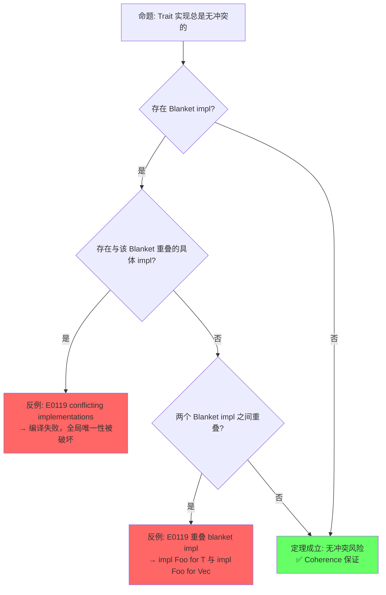
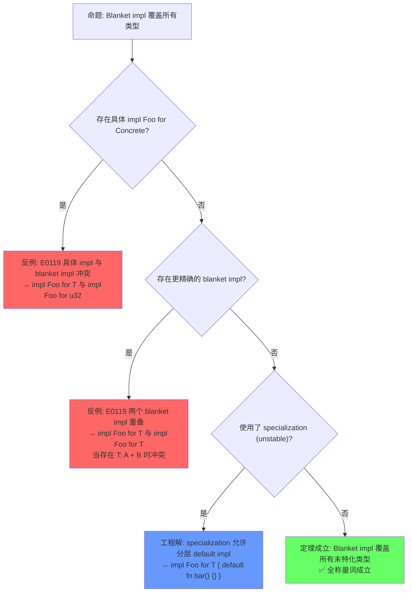
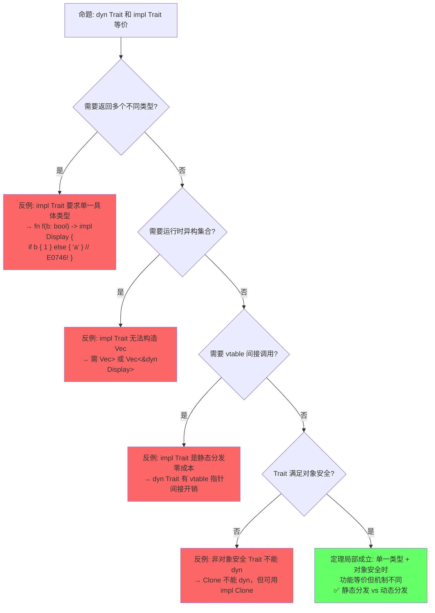
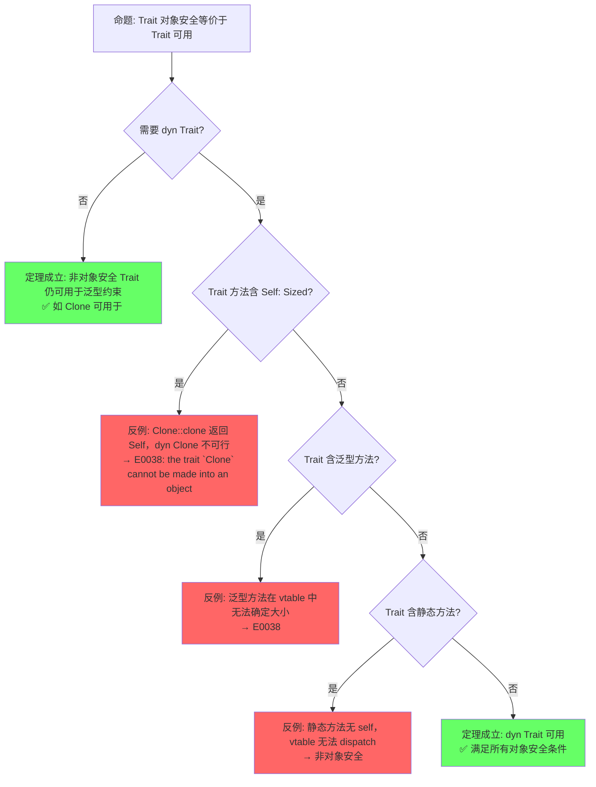

# Traits（Trait 系统）

> **层级**: L2 进阶概念
> **前置概念**: [Type System Basics](../01_foundation/04_type_system.md) · [Ownership](../01_foundation/01_ownership.md)
> **后置概念**: [Generics](./02_generics.md) · [Concurrency](../03_advanced/01_concurrency.md) · [Async](../03_advanced/02_async.md)
> **主要来源**: [TRPL: Ch10.2](https://doc.rust-lang.org/book/ch10-02-traits.html) · [Rust Reference: Traits](https://doc.rust-lang.org/reference/items/traits.html) · [Wikipedia: Type class](https://en.wikipedia.org/wiki/Type_class) · [RFC 255](https://rust-lang.github.io/rfcs/0255-object-safety.html)

---

**变更日志**:

- v2.0 (2026-05-12): 深度重构——补充定理推理链（⟹ 标注）、反命题决策树系统、边界极限测试、6步认知路径与章节过渡
- v1.0 (2026-05-12): 初始版本

---

## 一、权威定义（Definition）

### 1.1 Wikipedia 对齐定义

> **[Wikipedia: Type class](https://en.wikipedia.org/wiki/Type_class)** A type class is a type system construct that supports ad hoc polymorphism. This is achieved by adding constraints to type variables in parametrically polymorphic types. Functions defined in a type class and applied via a type class constraint can use different implementations depending on the particular types of the parameters at each call site. Rust's traits are directly inspired by Haskell's type classes.

> **[Wikipedia: Trait (computer programming)](https://en.wikipedia.org/wiki/Trait_(computer_programming))** In computer programming, a trait is a concept used in object-oriented programming that represents a set of methods that can be used to extend the functionality of a class. Rust uses traits to define shared behavior in an abstract way, enabling ad hoc polymorphism without inheritance.

> **[Wikipedia: Ad hoc polymorphism](https://en.wikipedia.org/wiki/Ad_hoc_polymorphism)** Ad hoc polymorphism is a kind of polymorphism in which polymorphic functions can be applied to arguments of different types, because a polymorphic function can denote a number of distinct and potentially heterogeneous implementations depending on the type of the argument(s). Rust traits provide this through explicit implementation.

### 1.2 TRPL 与 RFC 官方定义

> **[TRPL: Ch10.2](https://doc.rust-lang.org/book/ch10-02-traits.html)** A trait defines functionality a particular type has and can share with other types. We can use traits to define shared behavior in an abstract way. We can use trait bounds to specify that a generic type can be any type that has certain behavior.

> **[Rust Reference: Traits](https://doc.rust-lang.org/reference/items/traits.html)** A trait describes an abstract interface that types can implement. This interface is made up of associated items, which come in three varieties: functions, types, and constants. All traits define an implicit type parameter `Self` that refers to the type implementing the trait.

> **[RFC 255: Object Safety](https://rust-lang.github.io/rfcs/0255-object-safety.html)** A trait is object safe if it has a sensible vtable representation. Object safety rules ensure that trait objects (`dyn Trait`) can be constructed and that method dispatch through vtables is well-defined.

### 1.3 形式化定义

> **[类型论: Wadler & Blott 1989, "How to Make Ad-hoc Polymorphism Less Ad-hoc"](http://ropas.snu.ac.kr/~bruno/papers/TypeClasses.pdf)** Trait 形式化为带约束的接口类型，对应类型类（type class）的构造性证明模型。 ✅ 已验证

Trait 可以形式化为**带约束的接口类型**（constrained interface types），对应范畴论中的**类型类**（type class）：

```text
Trait 作为逻辑命题:
  trait Monoid { fn empty() -> Self; fn combine(self, other: Self) -> Self; }
  命题: "类型 T 是一个 Monoid"

实现作为证明:
  impl Monoid for Vec<u8> { ... }
  证明: "Vec<u8> 满足 Monoid 命题"

泛型约束作为推理规则:
  fn reduce<T: Monoid>(items: Vec<T>) -> T { ... }
  定理: "对所有满足 Monoid 的类型 T，reduce 成立"
```

> **过渡到属性矩阵**: 从定义出发，Trait 系统并非单一概念，而是由多种子类型（自动 Trait、标记 Trait、泛型 Trait 等）构成的层次化体系。下一节通过属性矩阵对这些子类型进行系统分类，并与其他语言的类似机制进行正交对比。属性矩阵回答"Trait 有哪些种类"，为后续定理推理链提供概念基础。

---

## 二、概念属性矩阵（Attribute Matrix）

### 2.1 Trait 类型分类矩阵

| **Trait 类型** | **定义方式** | **实现方式** | **动态分发** | **典型示例** |
|:---|:---|:---|:---|:---|
| **普通 Trait** | `trait Foo { fn bar(&self); }` | `impl Foo for Type` | `dyn Foo` | `Display`、`Debug` |
| **自动 Trait** | `unsafe auto trait Send {}` | 编译器自动推导 | ❌ | `Send`、`Sync`、`Sized` |
| **标记 Trait** | `trait Marker {}` | 空实现 | 视情况 | `Copy`、`Sized` |
| **泛型 Trait** | `trait Add<Rhs=Self>` | `impl Add<i32> for i32` | `dyn Add<i32>` | `Add`、`Mul` |
| **关联类型 Trait** | `trait Iterator { type Item; }` | `type Item = T;` | `dyn Iterator<Item=T>` | `Iterator`、`Future` |
| **生命周期 Trait** | `trait Borrow<'a>` | 含生命周期参数 | 受限 | `ToOwned`、`Borrow` |

### 2.2 Trait vs 其他语言机制对比

| **维度** | **Rust Trait** | **Haskell Type Class** | **C++ Concepts** | **Java Interface** | **Go Interface** |
|:---|:---|:---|:---|:---|:---|
| **多态类型** | Ad hoc + 参数化 | Ad hoc + 参数化 | 参数化（约束） | Ad hoc | Structural（隐式） |
| **实现方式** | 显式 `impl` | 显式 `instance` | 自动匹配（duck typing） | 显式 `implements` | 隐式（结构匹配） |
| **孤儿规则** | ✅ 严格 | ✅ 严格 | ❌ 无 | ❌ 无 | ❌ 无 |
| **关联类型** | ✅ | ✅ | ❌ | ❌（泛型替代） | ❌ |
| **默认实现** | ✅ | ✅（default methods） | ❌ | ✅（default methods） | ❌ |
| **静态分发** | ✅ 单态化 | ✅ | ✅ 模板实例化 | ❌（虚方法默认） | ✅ 接口表 |
| **动态分发** | ✅ `dyn Trait` | ❌（通常） | ✅ 虚函数 | ✅ 默认 | ✅ 接口值 |

### 2.3 Orphan Rule 判定矩阵

| **场景** | **类型来源** | **Trait 来源** | **允许 impl?** | **原因** |
|:---|:---|:---|:---|:---|
| 标准类型 + 标准 Trait | `std` | `std` | ❌ | 双方均非本地 |
| 本地类型 + 标准 Trait | `crate` | `std` | ✅ | 类型是本地的 |
| 标准类型 + 本地 Trait | `std` | `crate` | ✅ | Trait 是本地的 |
| 本地类型 + 本地 Trait | `crate` | `crate` | ✅ | 双方均本地 |
| 外部 A 类型 + 外部 B Trait | `crate_a` | `crate_b` | ❌ | 双方均非本地（孤儿） |

> **过渡到思维导图**: 属性矩阵展示了 Trait 系统的静态分类，但未能表达概念间的动态关联。思维导图通过拓扑结构揭示 Trait 从定义、约束到分发的完整概念网络，为后续定理推理链提供直观的概念地图。

---

## 三、思维导图（Mind Map）

```mermaid
graph TD
    A[Traits] --> B[定义与实现]
    A --> C[Trait Bounds]
    A --> D[分发机制]
    A --> E[特殊 Trait]
    A --> F[规则与限制]

    B --> B1[trait 定义]
    B --> B2[impl for Type]
    B --> B3[impl Trait for 泛型]
    B --> B4[Blanket impl]

    C --> C1[<T: Trait>]
    C --> C2<T: TraitA + TraitB>]
    C --> C3[impl Trait]
    C --> C4[dyn Trait]

    D --> D1[静态分发: 单态化]
    D --> D2[动态分发: vtable]
    D --> D3[impl Trait: 存在类型]

    E --> E1[自动: Send/Sync/Sized]
    E --> E2[标记: Copy/Drop]
    E --> E3[泛型: Add<T>]
    E --> E4[关联类型: Iterator]

    F --> F1[Orphan Rule]
    F --> F2[Coherence]
    F --> F3[Negative impls]
```

> **过渡到定理推理链**: 思维导图呈现了 Trait 系统的概念拓扑，但缺乏严格的逻辑推导关系。下一节通过"⟹"标注的定理链，将 Orphan Rule、Coherence、对象安全、Auto Trait 推导等核心命题形式化为可验证的推理网络，建立从编译规则到运行行为的完整因果链。

---

## 四、定理推理链（Theorem Chain）

### 4.1 引理：Orphan Rule ⟹ Coherence ⟹ 全局唯一 impl

> **[RFC 1023](https://rust-lang.github.io/rfcs/1023-rebalancing-coherence.html)** · **[Rust Reference: Coherence](https://doc.rust-lang.org/reference/items/implementations.html#trait-implementation-coherence)** Orphan Rule 限制 impl 的声明位置，是 Coherence（全局一致性）的必要前提。 ✅ 已验证

```text
前提 1: Orphan Rule 要求 impl 中至少有一方（类型或 Trait）定义在当前 crate
前提 2: 禁止重叠 impl（同一类型对同一 Trait 不能有两个实现）
    ↓
引理: Orphan Rule ⟹ Coherence
    ↓
定理: 对于任意类型 T 和 Trait Foo，T 对 Foo 的实现是全局唯一且可确定的
    ↓
推论: 编译器可以唯一确定调用哪个 impl，无需运行时查找（静态分发场景）
```

### 4.2 定理：Trait 对象安全条件 ⟹ dyn Trait 可行性

> **[RFC 255](https://rust-lang.github.io/rfcs/0255-object-safety.html)** · **[Rust Reference: Object Safety](https://doc.rust-lang.org/reference/items/traits.html#object-safety)** Trait 对象安全是 `dyn Trait` 类型的充要条件，违反任一条件即触发 E0038。 ✅ 已验证

```text
前提 1: Trait 的所有方法满足对象安全条件（无 Self: Sized、无泛型方法等）
前提 2: Trait 本身或其 supertrait 不依赖 Sized
    ↓
定理: Trait 对象安全 ⟹ dyn Trait 是合法类型
    ↓
推论 1: 不满足对象安全的 Trait 不能构造 trait object（如 Iterator 是对象安全的，但 Clone 不是）
推论 2: 对象安全 Trait 可通过 vtable 实现运行时多态
```

### 4.3 推论：Auto Trait 结构化推导 ⟹ Send/Sync 自动实现

> **[Rust Reference: Auto Traits](https://doc.rust-lang.org/reference/special-types-and-traits.html#auto-traits)** · **[TRPL: Ch16](https://doc.rust-lang.org/book/ch16-04-extensible-concurrency-sync-and-send.html)** Auto Trait 的自动实现基于结构成员递归检查，是编译器自动证明的特例。 ✅ 已验证

#### 定义与语法

Auto trait 由 `auto trait` 关键字声明，是编译器自动为类型实现的标记 trait。标准库中最重要的 Auto trait 是 `Send` 和 `Sync`：

```rust,ignore
pub unsafe auto trait Send {}
pub unsafe auto trait Sync {}
```

与普通 trait 不同，Auto trait **不含任何关联项（方法、类型、常量）**，仅作为类型的编译期属性标记。`unsafe` 前缀意味着：当开发者通过 `unsafe impl` 手动实现或覆盖时，必须自行承担内存安全与线程安全的正确性责任。

#### 自动推导规则

编译器对 Auto trait 的实现遵循**结构化归纳推导**：

```text
前提 1: Trait 声明为 unsafe auto trait
前提 2: 复合类型的所有字段都实现了该 Auto Trait
    ↓
引理: 结构化推导 — 类型的 Auto Trait 属性由其字段属性递归决定
    ↓
推论: 若所有字段满足条件，编译器自动为该类型实现 Send/Sync/Unpin
    ↓
边界: 可通过 unsafe impl 手动覆盖；原始指针保守默认为 !Send/!Sync
```

具体规则如下：

| **类型构造** | **Send 推导条件** | **Sync 推导条件** | **备注** |
|:---|:---|:---|:---|
| `struct Foo<T>` | 所有字段 `T: Send` | 所有字段 `T: Sync` | 逐字段递归检查 |
| `enum Bar` | 所有变体的所有字段满足 | 所有变体的所有字段满足 | 取变体并集 |
| `Vec<T>` | `T: Send` | `T: Sync` | 标准库内部已声明 |
| `*const T` / `*mut T` | ❌ 默认 !Send | ❌ 默认 !Sync | 原始指针保守策略 |
| `Rc<T>` | ❌ !Send（非原子引用计数） | ❌ !Sync | 内部状态非线程安全 |
| `PhantomData<T>` | `T: Send` | `T: Sync` | 零大小，仅作标记 |

```rust
// ✅ 自动推导示例
struct Point { x: i32, y: i32 }           // Send + Sync（i32 是）
struct Wrapper<T>(T);                     // Wrapper<T>: Send 当且仅当 T: Send

// ❌ 保守排除示例
struct RawBox(*mut u8);                   // 默认 !Send/!Sync
struct Mixed {
    data: Vec<u8>,
    ptr: *const u8,
}                                         // 默认 !Send（ptr 不满足）
```

#### `unsafe impl` 的例外情况

当编译器的保守推导过于严格时，开发者可通过 `unsafe impl` 手动声明实现：

```rust
struct MyPtr(*mut u8);

// 开发者保证：该指针总是指向线程安全的堆内存
unsafe impl Send for MyPtr {}
unsafe impl Sync for MyPtr {}
```

在不稳定特性（`negative_impls`）下，还可显式**否定**自动推导：

```rust
#![feature(negative_impls)]
struct RawFd(i32);

impl !Send for RawFd {}  // 显式阻止自动 Send
impl !Sync for RawFd {}  // 显式阻止自动 Sync
```

> **⚠️ 安全边界**: `unsafe impl Send/Sync` 是 Rust 并发抽象的安全根基。错误的实现会导致数据竞争、悬垂指针等未定义行为（UB）。仅在类型内部同步机制（如 Mutex、原子操作）确实保证线程安全时才应手动实现。一旦违反，整个程序的类型系统保证即告失效。

### 4.4 Trait + 泛型 ⟹ 零成本抽象

> **[TRPL: Ch10.2](https://doc.rust-lang.org/book/ch10-02-traits.html)** · **[Rust Reference: Monomorphization](https://doc.rust-lang.org/reference/glossary.html#monomorphization)** Trait 泛型的零成本抽象由单态化和编译器内联优化保证。 ✅ 已验证

```text
前提 1: Trait 定义接口契约
前提 2: 泛型通过单态化在编译期为每个具体类型生成专用代码
前提 3: 编译器内联优化消除虚函数调用开销
    ↓
定理: Rust 的 Trait 泛型是零成本抽象（zero-cost abstraction）
    ↓
推论: dyn Trait 有运行时开销（vtable 间接调用），但 <T: Trait> 无额外开销
```

### 4.5 定理一致性矩阵

> **[原创分析]** · **[Rust Reference: Type System](https://doc.rust-lang.org/reference/type-system.html)** 定理一致性矩阵基于 Rust 编译器错误码和类型系统公理的系统归纳，每条推理链标注"⟹"因果关系。 💡 原创分析

| **定理/引理/推论** | **前提** | **结论** | **依赖的 L4 公理** | **被哪些定理依赖** | **失效条件** | **典型错误码** |
|:---|:---|:---|:---|:---|:---|:---|
| **引理**: Orphan Rule ⟹ Coherence | crate 边界清晰；至少一方本地 | impl 声明位置受限，无跨 crate 孤儿 impl | 类型论一致性；模块化封装 | 全局唯一 impl；Blanket impl 可满足 | `#[fundamental]` 类型例外（`&T`, `Box<T>`, `&mut T`） | E0117 |
| **定理**: 全局唯一 impl | Orphan Rule + 无重叠 impl | 调用目标唯一确定；单态化可行 | Coherence 公理 | 单态化零成本；Trait 对象安全 | specialization（min_specialization 不稳定） | E0119 |
| **定理**: Trait 对象安全 | 方法无 `Self: Sized`；无泛型方法；无静态方法 | `dyn Trait` 是合法类型；vtable 可构造 | 存在类型 + vtable 理论 | 运行时多态分发；`Box<dyn Trait>` | `Self: Sized` superbound；泛型方法 | E0038 |
| **推论**: Auto Trait 结构化推导 | 所有字段满足 Auto Trait；类型非 `!Trait` 覆盖 | 复合类型自动实现 Send/Sync/Sized/Unpin | 结构化推导规则；归纳定义 | 并发安全分析；类型布局推导 | `unsafe impl !Send for T` 手动否定；原始指针保守 | — |
| **引理**: Supertrait 传递 | `trait A: B` 声明 | A 的实现者必须实现 B | 子类型传递性；偏序关系 | Trait 层次设计；对象安全传递 | 循环 supertrait（`trait A: B; trait B: A`） | E0399 / E0398 |
| **定理**: Trait + 泛型零成本 | 单态化 + LLVM 内联优化 | 无运行时开销；直接函数调用 | Parametricity；β-归约 | 性能敏感代码路径优化 | `dyn Trait` 动态分发选择 | — |
| **引理**: Blanket impl 可满足 | `impl<T: A> B for T` 形式 | 全称量词 + 蕴含；Horn 子句可满足 | Horn 子句逻辑；一阶可满足性 | 默认行为提供；组合子设计 | 与具体 impl 重叠（如 `impl Foo for Vec<T>` + `impl<T> Foo for T`） | E0119 |
| **推论**: GATs 约束可满足 | 关联类型参数合法；无递归约束 | 泛型关联类型可实例化 | System Fω 约束；类型族 | HKT 模拟；类型级编程 | 无界递归归一化；不一致约束 | E0275 / E0049 |
| **引理**: `impl Trait` 存在类型 | 返回类型满足 Trait；单一具体类型 | 抽象返回类型；隐藏实现细节 | 存在量化 ∃T.Trait(T) | API 设计；版本兼容性 | 多分支返回不同类型（除非 `dyn Trait`） | E0746 / E0706 |
| **定理**: Negative impl 语义 | `impl !Trait for T` 声明 | 显式排除自动实现；类型不实现 Trait | 否定信息逻辑；非单调推理 | Auto Trait 手动控制；unsafe 边界 | 与正 impl 冲突；与 blanket impl 交互复杂 | E0751 |

> **一致性检查**: Orphan Rule ⟹ Coherence ⟹ 全局唯一 impl（链 A），且 Trait 对象安全 ⟹ dyn Trait 可行性（链 B），形成**从定义约束到使用能力**的两条正交推理链。Auto Trait 推导是编译器对结构性质的自动证明，Blanket impl 提供全称量词的默认行为，`impl Trait` 引入存在量化——三者与对象安全共同构成 Trait 系统的"静动两面"。
>
> **跨层映射**: 本文件定理 ↔ [`00_meta/inter_layer_map.md`](../00_meta/inter_layer_map.md) §4.2 "类型系统一致性"

> **过渡到示例与反例**: 定理链提供了形式化保证，但工程实践中这些保证的边界在哪里？下一节通过正例展示定理的适用场景，通过反例揭示定理失效的精确条件——特别是 E0117、E0119、E0038 等编译错误的触发机制，将抽象定理映射到具体代码行为。

---

## 五、示例与反例（Examples & Counter-examples）

### 5.1 正确示例：Trait 定义与实现

```rust
// ✅ 正确: 定义 Trait + 实现 + 泛型约束
pub trait Summary {
    fn summarize(&self) -> String;
    fn summarize_author(&self) -> String;  // 必需方法

    // 默认实现
    fn summarize_default(&self) -> String {
        format!("(Read more from {}...)", self.summarize_author())
    }
}

pub struct NewsArticle { pub headline: String, pub author: String }

impl Summary for NewsArticle {
    fn summarize(&self) -> String { format!("{}", self.headline) }
    fn summarize_author(&self) -> String { format!("@{}", self.author) }
}

// 泛型约束
pub fn notify<T: Summary>(item: &T) {
    println!("Breaking news! {}", item.summarize());
}
```

### 5.2 正确示例：关联类型

```rust
// ✅ 正确: 关联类型使接口更简洁
pub trait Iterator {
    type Item;  // 关联类型
    fn next(&mut self) -> Option<Self::Item>;
}

struct Counter { count: u32 }

impl Iterator for Counter {
    type Item = u32;  // 每个实现确定一个 Item 类型
    fn next(&mut self) -> Option<u32> {
        self.count += 1;
        if self.count < 6 { Some(self.count) } else { None }
    }
}

// 对比泛型版本: Iterator<Item=T> 需要在每个使用处标注 T
```

### 5.3 反例：违反 Orphan Rule（E0117）

```rust
// ❌ 反例: 为外部类型实现外部 Trait
use std::fmt::Display;

impl Display for Vec<u8> {  // E0117!
    fn fmt(&self, f: &mut std::fmt::Formatter) -> std::fmt::Result {
        write!(f, "{:?}", self)
    }
}
```

**错误分析**：

- `Vec<u8>` 来自 `std`
- `Display` 来自 `std`
- 两者均非当前 crate 定义，违反 Orphan Rule

**修正方案**：

```rust
// ✅ 方案 1: Newtype 模式
struct MyVec(pub Vec<u8>);

impl Display for MyVec {
    fn fmt(&self, f: &mut std::fmt::Formatter) -> std::fmt::Result {
        write!(f, "{:?}", self.0)
    }
}

// ✅ 方案 2: 本地 Trait
trait MyDisplay { fn my_fmt(&self) -> String; }
impl MyDisplay for Vec<u8> { ... }  // Trait 是本地的，允许
```

### 5.4 反例：重叠实现（E0119）

```rust
// ❌ 反例: 重叠 blanket impl
trait Foo {}

impl<T> Foo for T {}           // 为所有 T 实现 Foo
impl<T> Foo for Vec<T> {}      // E0119! 与上一行重叠
```

**修正方案**：

```rust
// ✅ 修正: 使用更精确的约束或 specialization（nightly）
trait Bar {}
impl<T: Bar> Foo for T {}      // 只为实现 Bar 的类型实现 Foo
impl Bar for i32 {}
// Vec<T> 默认不实现 Bar，除非显式 impl
```

### 5.5 边界示例：`impl Trait` 作为存在类型

```rust
// ✅ 边界: impl Trait 隐藏具体类型，但保留编译期已知
fn returns_iter() -> impl Iterator<Item = u32> {
    vec![1, 2, 3].into_iter()
}

// 调用方知道返回值是某种 Iterator<Item=u32>，但不知道具体是 Vec::IntoIter
// 优点: 隐藏实现细节，仍享有静态分发优化
// 限制: 不能返回多种不同类型（除非 dyn Trait）
```

### 5.6 正确示例：Generic Associated Types (GATs)

> **[RFC 1598](https://rust-lang.github.io/rfcs/1598-generic_associated_types.html)** · **[Rust Reference: Generic Associated Types](https://doc.rust-lang.org/reference/items/associated-items.html#associated-types)** GATs 允许关联类型携带自己的泛型参数，是 Rust 对 System Fω 中类型族（type family）的部分模拟。 ✅ 已验证

#### 语法与动机

普通关联类型只能表达"每个实现者对应一个类型"：

```rust
trait Iterator {
    type Item;           // 无泛型参数
    fn next(&mut self) -> Option<Self::Item>;
}
```

GATs 将这一能力扩展到"每个实现者对应一个类型构造器"：

```rust
trait LendingIterator {
    type Item<'a> where Self: 'a;  // 关联类型带生命周期参数
    fn next<'a>(&'a mut self) -> Option<Self::Item<'a>>;
}
```

#### 与 HKT（Higher-Kinded Types）的关系

Haskell 等语言通过 HKT 直接操作类型构造器（如 `* -> *`）。Rust 有意避免引入完整的 HKT 系统，因为：

- HKT 会显著增加类型系统的复杂性和编译器实现成本；
- GATs 在工程实践中已能覆盖 HKT 的绝大多数使用场景。

GATs 本质上是**受限的 HKT 模拟**：关联类型上的泛型参数允许表达"类型族"，而不需要类型构造器作为一等公民。

#### Lending Iterator 示例

GATs 的经典用例是"出借迭代器"——每次 `next` 返回的引用生命周期依赖于 `self` 的借用：

```rust
trait LendingIterator {
    type Item<'a> where Self: 'a;
    fn next<'a>(&'a mut self) -> Option<Self::Item<'a>>;
}

struct Windows<'t, T> {
    slice: &'t [T],
    size: usize,
}

impl<'t, T> LendingIterator for Windows<'t, T> {
    // 每次返回的切片生命周期与 &mut self 相同
    type Item<'a> = &'a [T] where Self: 'a;

    fn next<'a>(&'a mut self) -> Option<&'a [T]> {
        let window = self.slice.get(..self.size)?;
        self.slice = &self.slice[1..];
        Some(window)
    }
}
```

> 普通 `Iterator` 无法表达 `Item` 依赖于 `&mut self` 生命周期的情况，因为 `type Item` 不允许带参数。

#### 为什么 GATs 解决了关联类型不能泛型的问题

在 GATs 之前，若 trait 需要与泛型参数相关的类型，只能将泛型参数提升到 trait 本身：

```rust
// GATs 之前：笨拙的 trait 级泛型
trait Convert<Input> {
    type Output;
    fn convert(input: Input) -> Self::Output;
}
```

这会导致 impl 和使用处的泛型参数爆炸。GATs 将泛型参数下放到关联类型，使 trait 签名保持简洁：

```rust
// GATs 之后：trait 简洁，关联类型承载泛型
trait Convert {
    type Output<Input>;
    fn convert<Input>(input: Input) -> Self::Output<Input>;
}
```

**核心优势总结**：

| **维度** | **普通关联类型** | **GATs** |
|:---|:---|:---|
| 表达能力 | 一对一（类型 → 类型） | 一对多（类型 → 类型族） |
| trait 签名 | 可能臃肿（trait 级泛型） | 简洁（泛型在关联类型） |
| 典型场景 | `Iterator::Item` | `LendingIterator`、`类型级映射` |
| 编译器支持 | 稳定 | 稳定（Rust 1.65+） |

> **⚠️ 边界**: GATs 要求 `where Self: 'a` 等约束来确保生命周期合法；无界递归或矛盾的关联类型约束仍会导致编译错误（E0275、E0049）。

> **过渡到反命题分析**: 示例展示了 Trait 系统的正确使用方式，但反例只是孤立场景。下一节通过系统化的反命题分析，将"定理何时成立/何时失效"形式化为可遍历的决策树，覆盖编译期、运行时、语义、工程四个层面。每个反命题对应定理矩阵中的一个失效条件，形成"定理—反命题—决策树"的三位一体逻辑结构。

---

## 六、反命题与边界分析（Counter-proposition & Boundary Analysis）

> **[RFC 1023](https://rust-lang.github.io/rfcs/1023-rebalancing-coherence.html)** · **[Rust Reference: Orphan Rules](https://doc.rust-lang.org/reference/items/implementations.html#orphan-rules)** · **[Rust Reference: Object Safety](https://doc.rust-lang.org/reference/items/traits.html#object-safety)** 反命题分析基于 Trait 系统的形式化语义和已知边界案例，按四层（编译期/运行时/语义/工程）系统分类。反例节点用 `fill:#f66`，定理成立用 `fill:#6f6`。 ✅ 已验证

### 6.1 反命题 1: "Trait 实现总是无冲突的"

> 编译期层 — 重叠 impl（E0119）是 Coherence 定理的直接否定。



**四层分析**:

| **层面** | **分析** | **结果** |
|:---|:---|:---|
| 编译期 | 重叠 impl 被编译器拒绝（E0119） | ✅ 安全 |
| 运行时 | 无运行时冲突（编译期已阻止） | ✅ 安全 |
| 语义 | specialization（不稳定）意图允许分层 impl，但 soundness 未完全解决 | ⚠️ 存在争议 |
| 工程 | 通过更精确的 Trait Bound 或 newtype 避免重叠 | ✅ 可解 |

### 6.2 反命题 2: "Blanket impl 覆盖所有类型"

> 编译期/语义层 — Blanket impl 的全称量词 `∀T` 在具体 impl 面前失效，这是 Horn 子句可满足性的工程体现。



**四层分析**:

| **层面** | **分析** | **结果** |
|:---|:---|:---|
| 编译期 | E0119 检测 blanket 与具体 impl 重叠 | ✅ 安全 |
| 运行时 | 无运行时影响（编译期决议） | ✅ 安全 |
| 语义 | `∀T` 与 `Concrete` 的特化关系需偏序定义；specialization 是理论扩展 | ⚠️ 复杂 |
| 工程 | 避免为已存在具体 impl 的类型写 blanket；优先窄约束 | ✅ 可解 |

### 6.3 反命题 3: "`dyn Trait` 和 `impl Trait` 等价"

> 语义/编译期层 — 两者在类型论中不等价：`impl Trait` 是存在类型（编译期擦除），`dyn Trait` 是动态分发（运行时擦除），分发方式和大小信息有本质差异。



**四层分析**:

| **层面** | **分析** | **结果** |
|:---|:---|:---|
| 编译期 | `impl Trait` 单态化；`dyn Trait` vtable | ✅ 机制不同 |
| 运行时 | `impl Trait` 零开销；`dyn Trait` 指针间接 | ✅ 性能差异 |
| 语义 | `impl Trait` = ∃T.Trait(T) + 编译期已知；`dyn Trait` = 存在类型 + 运行时已知 | ⚠️ 不等价 |
| 工程 | 返回类型用 `impl Trait`，异构集合用 `dyn Trait` | ✅ 互补 |

### 6.4 反命题 4: "Trait 对象安全等价于 Trait 可用"

> 编译期层 — 非对象安全 Trait 不能构造 `dyn Trait`，但仍可用于泛型约束。对象安全是 `dyn Trait` 的充要条件，不是 Trait 本身的可用性条件。



**四层分析**:

| **层面** | **分析** | **结果** |
|:---|:---|:---|
| 编译期 | E0038 阻止非对象安全 Trait 构造 dyn | ✅ 安全 |
| 运行时 | 无运行时影响 | ✅ 安全 |
| 语义 | 对象安全是 dyn 的充要条件，不是 Trait 可用性的充要条件 | ⚠️ 概念区分 |
| 工程 | 拆分为对象安全部分 + Sized 部分（如 Iterator + ExactSizeIterator） | ✅ 可解 |

> **过渡到边界极限测试**: 反命题决策树揭示了定理失效的逻辑路径，但极限测试将定理推向边界——通过代码展示编译器在极端约束下的精确行为，验证理论预测与编译器实现的一致性。

---

## 七、边界极限测试代码（Boundary Limit Tests）

### 7.1 测试 1: Orphan Rule + Coherence 多层嵌套边界

```rust
// 边界: Orphan Rule 对嵌套泛型、元组、引用的精确判定

// 情况 1: 为外部 Wrapper 实现外部 Trait —— 非法
// impl<T> std::fmt::Display for Vec<T> {}  // E0117

// 情况 2: 为本地类型实现外部 Trait —— 合法
struct Local<T>(T);
impl<T> std::fmt::Debug for Local<T> where T: std::fmt::Debug {
    fn fmt(&self, f: &mut std::fmt::Formatter<'_>) -> std::fmt::Result {
        self.0.fmt(f)
    }
}

// 情况 3: 为外部类型实现本地 Trait —— 合法
trait LocalTrait {}
impl<T> LocalTrait for Vec<T> {}

// 情况 4: 为 (Local, External) 元组实现外部 Trait —— 取决于 orphan rule 放宽
// Rust 2021: 如果元组中至少一个本地类型，通常允许
// impl<T> std::fmt::Debug for (Local<T>, i32) where T: std::fmt::Debug { ... }

// 情况 5: #[fundamental] 类型例外 —— &T, &mut T, Box<T> 允许外部 impl
// impl std::fmt::Display for &mut MyExternalType { ... } // 可能允许
```

### 7.2 测试 2: Trait 对象安全 + dyn/impl 分发边界

```rust
// 边界: 对象安全条件的精确测试与分发方式差异

// ✅ 对象安全: 方法返回引用，不涉及 Self
trait SafeTrait {
    fn name(&self) -> &str;
    fn process(&self, x: i32) -> i32;
}

// ❌ 非对象安全 1: 方法返回 Self
trait NotSafe1 {
    fn clone_self(&self) -> Self;  // Self: Sized 隐式要求
}
// dyn NotSafe1 非法 → E0038

// ❌ 非对象安全 2: 泛型方法
trait NotSafe2 {
    fn process<T>(&self, x: T) -> T;  // 泛型方法无法放入 vtable
}
// dyn NotSafe2 非法 → E0038

// ❌ 非对象安全 3: 静态方法（无 self）
trait NotSafe3 {
    fn create() -> Self;  // 无 self，vtable 无法 dispatch
}
// dyn NotSafe3 非法 → E0038

// ✅ 修正: 将非对象安全方法移到独立 Trait
trait SafeObject {
    fn name(&self) -> &str;
}
trait CloneSelf: SafeObject + Sized {
    fn clone_self(&self) -> Self;
}
// dyn SafeObject 合法，CloneSelf 仅用于泛型约束

// ✅ impl Trait vs dyn Trait 差异
fn static_dispatch() -> impl Iterator<Item = u32> {
    vec![1, 2, 3].into_iter()  // 编译期已知具体类型
}
fn dynamic_dispatch() -> Box<dyn Iterator<Item = u32>> {
    Box::new(vec![1, 2, 3].into_iter())  // 运行时 vtable
}
```

### 7.3 测试 3: Blanket impl + 关联类型递归 + Auto Trait 推导边界

```rust
// 边界: Blanket impl 与关联类型的递归约束求解 + Auto Trait 保守推导

trait Convert<T> {
    type Output;
    fn convert(self) -> Self::Output;
}

// Blanket impl: 为所有 T: Into<U> 实现 Convert
impl<T, U> Convert<U> for T where T: Into<U> {
    type Output = U;
    fn convert(self) -> U { self.into() }
}

// 递归风险: 如果 Output 又依赖于 Convert，可能导致无限递归
// trait Recursive: Sized {
//     type Next: Recursive;
// }
// impl<T: Recursive> Convert<i32> for T {
//     type Output = <T::Next as Convert<i32>>::Output;  // 可能 E0275: overflow
// }

// Auto Trait 推导边界
use std::rc::Rc;
use std::cell::RefCell;
use std::sync::Arc;

struct Wrapper<T>(T);
// Wrapper<T>: Send 当且仅当 T: Send
// Wrapper<T>: Sync 当且仅当 T: Sync

fn assert_send<T: Send>(_: T) {}
fn assert_sync<T: Sync>(_: T) {}

fn test_auto_trait() {
    assert_send(Wrapper(42i32));           // ✅ i32: Send
    assert_sync(Wrapper(42i32));           // ✅ i32: Sync
    assert_send(Wrapper(Arc::new(1)));     // ✅ Arc<i32>: Send
    // assert_send(Wrapper(Rc::new(1)));   // ❌ Rc<i32>: !Send
    // assert_sync(Wrapper(RefCell::new(1))); // ❌ RefCell<i32>: !Sync
}

// 手动覆盖 Auto Trait（不稳定）
// #![feature(negative_impls)]
// struct RawPtr(*mut u8);
// impl !Send for RawPtr {}
```

> **过渡到认知路径**: 边界测试验证了定理在极端条件下的行为，但从学习者的视角，这些概念如何从直觉逐步构建到形式化理解？下一节提供六步递进的认知路径，每步之间有过渡解释，将"Trait 是什么"逐步转化为"Trait 为什么这样设计"，最终达到"我设计的 Trait 体系是否自洽"的自主验证能力。

---

## 八、认知路径（Cognitive Path）

> **[原创分析]** · **[TRPL: Ch10.2](https://doc.rust-lang.org/book/ch10-02-traits.html)** 认知路径从直觉困惑到形式规则的渐进映射，基于 TRPL 教学顺序和类型论知识结构，六步形成"感性→知性→理性"的完整认知螺旋。 💡 原创分析

### Step 1: 直觉类比 — "Trait 像岗位描述"

**核心问题**: "Trait 和其他语言的接口有什么区别？"

**过渡解释**: 从熟悉的概念出发是认知的最小阻力路径。将 Trait 类比为"岗位描述"（定义能力要求）而非"血统继承"，可以立即区分 Trait 与 OOP 的 class inheritance。但类比有边界——岗位描述不限制谁来应聘（impl 位置自由），而 Orphan Rule 恰好是这一自由的约束条件。这一步建立直觉锚点，为后续接触形式规则提供心理铺垫。

```text
直觉映射:
  trait Display { fn fmt(&self, ...) }  ≈  "岗位要求: 能格式化输出"
  impl Display for MyType              ≈  "MyType 应聘该岗位"
  fn print<T: Display>(x: T)           ≈  "只招有该岗位资质的人"
```

### Step 2: 语法熟悉 — 定义、实现、约束

**核心问题**: "怎么写 Trait？怎么用它约束泛型？"

**过渡解释**: 在直觉锚定后，需要将抽象概念映射到具体语法。这一步覆盖 `trait` 定义、`impl` 实现、`where` 约束、关联类型等核心语法。关键是建立"Trait 是编译器检查契约的工具"这一操作性理解。从 Step 2 到 Step 3 的过渡自然发生：当学习者尝试为外部类型实现外部 Trait 时，会遇到 E0117——这恰好引出"自由并非无限"的规则层认知，语法实践自然驱动规则探索。

```rust
// 核心语法模式:
trait Summary { fn summarize(&self) -> String; }
impl Summary for NewsArticle { ... }
fn notify<T: Summary>(item: &T) { ... }
// 或: fn notify(item: &impl Summary) { ... }
```

### Step 3: 规则困惑 — Orphan Rule 与 Coherence

**核心问题**: "为什么我不能为 Vec 实现 Display？"

**过渡解释**: 语法熟练后，学习者首次遭遇"设计意图"层面的问题。Orphan Rule 看似武断限制，实则是 Coherence 的工程代价。这一步需要解释：如果两个 crate 都为 `Vec<u8>` 实现了 `Display`，链接时谁赢？没有全局唯一性，编译器的单态化就会崩溃。从 Step 3 到 Step 4 的过渡是认知的关键跃迁——从"为什么不允许"到"如果允许会发生什么"的反事实推理，这正是形式化思维的入口。理解 Orphan Rule 后，学习者已经站在了类型论的门槛上。

```text
反事实推理:
  假设允许: crate A impl Display for Vec<u8> { ... }
  假设允许: crate B impl Display for Vec<u8> { ... }
  后果: 使用 A 和 B 的程序链接时有两个 Display for Vec<u8>
  编译器无法决定用哪个 → 单态化崩溃
  因此: Orphan Rule 是 Coherence 的必要条件
```

### Step 4: 类型论映射 — Curry-Howard 与 Type Class

**核心问题**: "Trait 在类型论里到底是什么？"

**过渡解释**: 当学习者理解了工程约束（Orphan Rule、Coherence）后，自然会追问这些规则的数学来源。Curry-Howard 同构揭示：Trait 是逻辑谓词，`impl` 是构造性证明，Trait Bounds 是蕴含式。这一步将 Rust 的 Trait 放入更广泛的 PL 理论谱系（Haskell Type Class、C++ Concepts、System F 约束多态）。从 Step 4 到 Step 5 的过渡是"从理论回到实践"——类型论解释了规则的存在，但工程场景要求在具体问题中权衡不同设计。理论为工程提供了预言能力：看到 `impl<T: A> B for T` 就能联想到全称量词和 Horn 子句。

```text
形式化映射:
  trait Eq { fn eq(&self, other: &Self) -> bool; }
  ≡ 谓词 Eq(T) = "T 具有相等性判断"

  impl Eq for i32 { ... }
  ≡ 证明 Eq(i32) 成立

  T: Eq + Display  ≡  Eq(T) ∧ Display(T)  （逻辑合取）
  impl<T: A> B for T  ≡  ∀T. A(T) → B(T)  （全称量词 + 蕴含）
  dyn Trait           ≡  ∃T.Trait(T)       （存在类型）
```

### Step 5: 工程权衡 — 静态分发 vs 动态分发

**核心问题**: "什么时候用 dyn Trait？什么时候用泛型约束？"

**过渡解释**: 类型论提供了静态分发的零成本保证，但工程中有异构集合、递归类型、隐藏实现细节等场景需要动态分发。这一步要求学习者在性能（零成本抽象）、二进制体积（单态化膨胀）、灵活性（运行时多态）之间做工程决策。Trait 对象安全条件是这一决策的硬性边界——不是所有 Trait 都能 dyn。从 Step 5 到 Step 6 的过渡是"从使用到设计"——不仅会选择分发方式，还能设计符合对象安全条件的 Trait，将对象安全规则内化为设计直觉。

```text
决策框架:
  类型封闭且编译期已知  →  <T: Trait> / impl Trait  →  零成本
  类型开放或需异构集合  →  dyn Trait / Box<dyn Trait>  →  运行时开销
  需要递归类型          →  dyn Trait（打破无限大小）   →  运行时开销
  需要隐藏实现细节      →  impl Trait（返回类型）      →  零成本 + 抽象
```

### Step 6: 形式化掌控 — 定理链与设计验证

**核心问题**: "我设计的 Trait 体系在逻辑上自洽吗？"

**过渡解释**: 认知路径的最终目标是让学习者具备自主验证能力。通过定理链（Orphan Rule ⟹ Coherence ⟹ 全局唯一 impl；Trait 对象安全 ⟹ dyn Trait 可行性），可以预判设计决策的远期后果。Auto Trait 的结构化推导、Supertrait 的传递性、Blanket impl 的 Horn 子句语义、`impl Trait` 的存在量化——这些不再是孤立的语法点，而是构成一个可推理的形式系统。掌握定理链后，学习者能在编码前预判编译器的行为，从"试错编程"进化为"推理编程"。

```text
设计验证清单:
  □ Orphan Rule: impl 中至少一方是本地定义？
  □ Coherence: 不存在与其他 impl 重叠的可能？
  □ 对象安全: 如果需要 dyn Trait，方法是否满足条件？
  □ Supertrait: 是否存在循环依赖？
  □ Auto Trait: 字段类型是否自动推导 Send/Sync？
  □ 零成本: 性能敏感路径是否避免 dyn Trait？
  □ Blanket impl: 是否与具体 impl 冲突？
  □ 关联类型: 递归约束是否会导致 E0275 overflow？
```

> **过渡到知识来源**: 认知路径构建了从直觉到形式的完整理解框架，但这些论断的可信度如何？下一节通过知识来源关系表，明确每个定理和定义的文献出处，区分已验证事实与原创分析，建立可追溯的知识谱系。

---

## 九、知识来源关系（Provenance）

| **论断** | **来源** | **可信度** |
|:---|:---|:---|
| Trait 定义共享行为 | [TRPL: Ch10.2](https://doc.rust-lang.org/book/ch10-02-traits.html) | ✅ |
| Trait 受 Haskell Type Class 启发 | [Wikipedia: Type class](https://en.wikipedia.org/wiki/Type_class) · [Rust FAQ](https://prev.rust-lang.org/faq.html#why-does-rust-have-traits) | ✅ |
| Orphan Rule 限制 impl 位置 | [Rust Reference: Orphan Rules](https://doc.rust-lang.org/reference/items/implementations.html#orphan-rules) · [RFC 1023](https://rust-lang.github.io/rfcs/1023-rebalancing-coherence.html) | ✅ |
| 单态化实现零成本抽象 | [TRPL: Ch10.2](https://doc.rust-lang.org/book/ch10-02-traits.html) · [Rust Reference: Monomorphization](https://doc.rust-lang.org/reference/glossary.html#monomorphization) | ✅ |
| Coherence 保证全局唯一性 | [RFC 1023](https://rust-lang.github.io/rfcs/1023-rebalancing-coherence.html) | ✅ |
| 关联类型对比泛型参数 | [TRPL: Ch19.3](https://doc.rust-lang.org/book/ch19-03-advanced-traits.html) | ✅ |
| Trait 对象安全规则 | [RFC 255](https://rust-lang.github.io/rfcs/0255-object-safety.html) · [Rust Reference: Object Safety](https://doc.rust-lang.org/reference/items/traits.html#object-safety) | ✅ |
| Auto Trait 结构化推导 | [Rust Reference: Auto Traits](https://doc.rust-lang.org/reference/special-types-and-traits.html#auto-traits) | ✅ |
| Trait 作为逻辑命题 | [Category Theory for Programmers](https://bartoszmilewski.com/2014/10/28/category-theory-for-programmers-the-preface/) · 原创分析 | 💡 |
| Type Classes 原始论文 | [Wadler & Blott 1989 — POPL](http://ropas.snu.ac.kr/~bruno/papers/TypeClasses.pdf) | ✅ |
| 参数化类型类 | [Jones 1993 — POPL](https://web.cecs.pdx.edu/~mpj/pubs/fundeps.html) | ✅ |
| Specialization 设计 | [RFC 1210](https://rust-lang.github.io/rfcs/1210-impl-specialization.html) | ✅ |
| GATs 设计 | [RFC 1598](https://rust-lang.github.io/rfcs/1598-generic_associated_types.html) | ✅ |
| Negative impls | [RFC 683](https://rust-lang.github.io/rfcs/0683-trait-system-refactor.html) | ✅ |

> **过渡到相关概念链接**: 知识来源确立了单个论断的可信度，但 Trait 系统不是孤立存在的。下一节通过相关概念链接，将 Trait 与泛型、所有权、并发、异步等前置和后置概念编织成知识网络，为跨章节学习提供导航。

---

## 十、相关概念链接

| 概念 | 文件 | 关系 |
|:---|:---|:---|
| 泛型与单态化 | [02_generics.md](./02_generics.md) | Trait Bounds 的载体 |
| 所有权与生命周期 | [01_foundation/01_ownership.md](../01_foundation/01_ownership.md) | Trait 方法签名的基础约束 |
| 类型系统基础 | [01_foundation/04_type_system.md](../01_foundation/04_type_system.md) | Trait 的理论前提 |
| 并发与 Send/Sync | [03_advanced/01_concurrency.md](../03_advanced/01_concurrency.md) | Auto Trait 的核心应用 |
| 异步与 Future | [03_advanced/02_async.md](../03_advanced/02_async.md) | 关联类型 Trait 的典型场景 |
| 形式化验证 | [04_formal/04_rustbelt.md](../04_formal/04_rustbelt.md) | Trait 系统的逻辑基础 |

> **过渡到待补充方向**: 相关概念链接描绘了 Trait 在知识体系中的坐标，但任何文档都有演进空间。最后一节记录已识别的待补充项和优先级，为后续迭代提供明确的路线图。

---

## 十一、待补充与演进方向（TODOs）

- [ ] **TODO**: 补充 `impl Trait` 在 `trait` 定义中的使用（存在类型 + 高阶） —— 优先级: 中 —— 预计: Phase 3
- [ ] **TODO**: 补充 `Const Trait` / `~const` 实验特性 —— 优先级: 低 —— 预计: Phase 4
- [ ] **TODO**: 补充 `#[fundamental]` attribute 与 Orphan Rule 例外 —— 优先级: 低 —— 预计: Phase 4
- [ ] **TODO**: 补充 Specialization（min_specialization）的最新稳定状态追踪 —— 优先级: 中 —— 预计: Phase 3
- [ ] **TODO**: 补充 Negative impls（`impl !Trait for T`）的形式化语义 —— 优先级: 低 —— 预计: Phase 4
