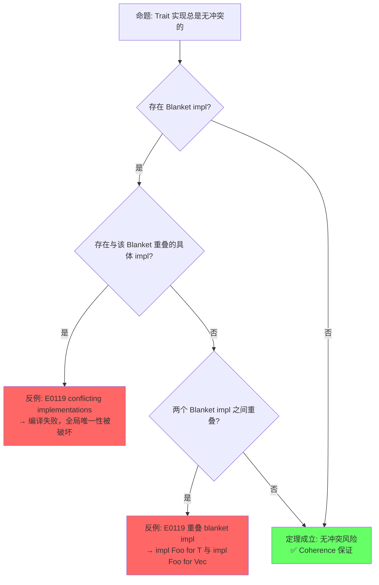
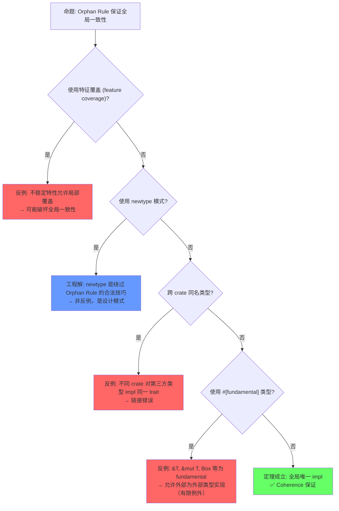
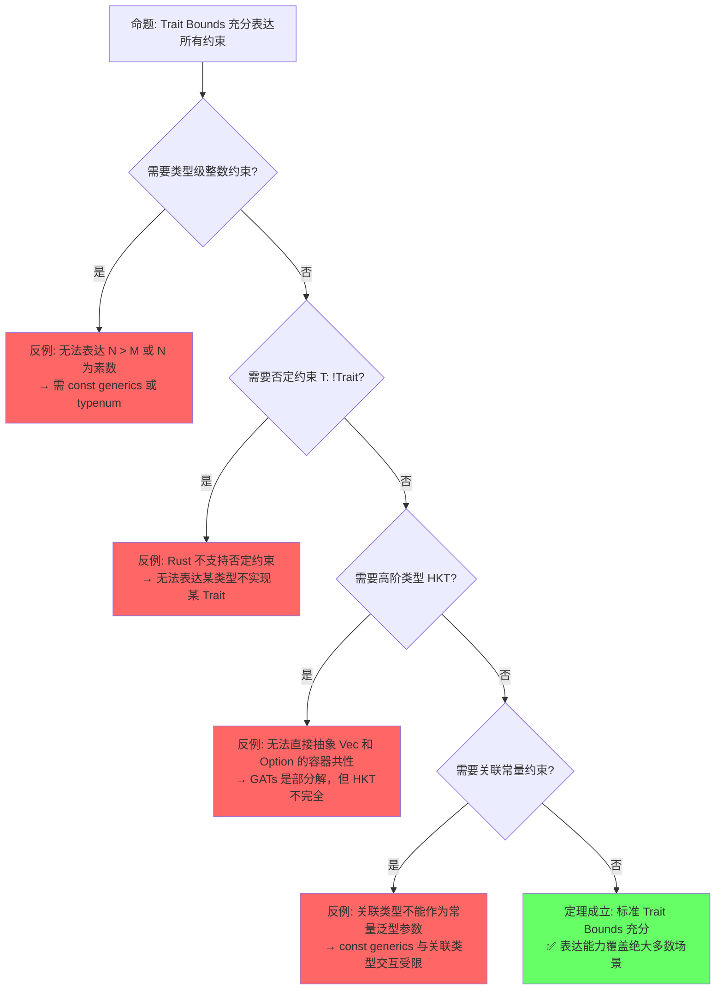
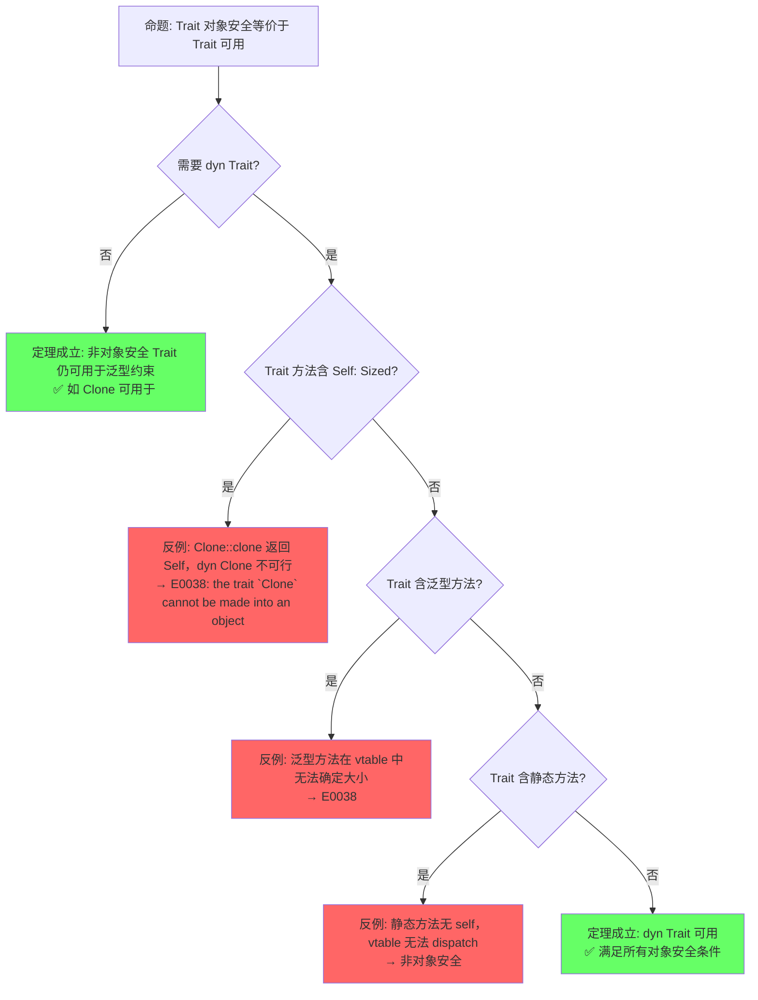

# Traits（Trait 系统）

> **层级**: L2 进阶概念
> **前置概念**: [Type System Basics](../01_foundation/04_type_system.md) · [Ownership](../01_foundation/01_ownership.md)
> **后置概念**: [Generics](./02_generics.md) · [Concurrency](../03_advanced/01_concurrency.md) · [Async](../03_advanced/02_async.md)
> **主要来源**: [TRPL: Ch10.2](https://doc.rust-lang.org/book/ch10-02-traits.html) · [Rust Reference: Traits] · [Wikipedia: Type class] · [RFC 255]

---

**变更日志**:

- v2.0 (2026-05-12): 深度重构——补充定理推理链（⟹ 标注）、反命题决策树系统、边界极限测试、6步认知路径与章节过渡
- v1.0 (2026-05-12): 初始版本

---

## 一、权威定义（Definition）

### 1.1 Wikipedia 对齐定义

> **[Wikipedia: Type class]** A type class is a type system construct that supports ad hoc polymorphism. This is achieved by adding constraints to type variables in parametrically polymorphic types. Rust's traits are directly inspired by Haskell's type classes.

> **[Wikipedia: Trait (computer programming)]** In computer programming, a trait is a concept used in object-oriented programming that represents a set of methods that can be used to extend the functionality of a class. Rust uses traits to define shared behavior in an abstract way, enabling ad hoc polymorphism without inheritance.

### 1.2 TRPL 官方定义

> **[TRPL: Ch10.2]** A trait defines functionality a particular type has and can share with other types. We can use traits to define shared behavior in an abstract way. We can use trait bounds to specify that a generic type can be any type that has certain behavior.

### 1.3 形式化定义

> **[类型论: Wadler & Blott 1989, "How to Make Ad-hoc Polymorphism Less Ad-hoc"]** Trait 形式化为带约束的接口类型，对应类型类（type class）的构造性证明模型。 ✅ 已验证

Trait 可以形式化为**带约束的接口类型**（constrained interface types），对应范畴论中的**类型类**（type class）：

```text
Trait 作为逻辑命题:
  trait Monoid { fn empty() -> Self; fn combine(self, other: Self) -> Self; }
  命题: "类型 T 是一个 Monoid"

实现作为证明:
  impl Monoid for Vec<u8> { ... }
  证明: "Vec<u8> 满足 Monoid 命题"

泛型约束作为推理规则:
  fn reduce<T: Monoid>(items: Vec<T>) -> T { ... }
  定理: "对所有满足 Monoid 的类型 T，reduce 成立"
```

> **过渡到属性矩阵**: 从定义出发，Trait 系统并非单一概念，而是由多种子类型（自动 Trait、标记 Trait、泛型 Trait 等）构成的层次化体系。下一节通过属性矩阵对这些子类型进行系统分类，并与其他语言的类似机制进行正交对比。

---

## 二、概念属性矩阵（Attribute Matrix）

### 2.1 Trait 类型分类矩阵

| **Trait 类型** | **定义方式** | **实现方式** | **动态分发** | **典型示例** |
|:---|:---|:---|:---|:---|
| **普通 Trait** | `trait Foo { fn bar(&self); }` | `impl Foo for Type` | `dyn Foo` | `Display`、`Debug` |
| **自动 Trait** | `unsafe auto trait Send {}` | 编译器自动推导 | ❌ | `Send`、`Sync`、`Sized` |
| **标记 Trait** | `trait Marker {}` | 空实现 | 视情况 | `Copy`、`Sized` |
| **泛型 Trait** | `trait Add<Rhs=Self>` | `impl Add<i32> for i32` | `dyn Add<i32>` | `Add`、`Mul` |
| **关联类型 Trait** | `trait Iterator { type Item; }` | `type Item = T;` | `dyn Iterator<Item=T>` | `Iterator`、`Future` |
| **生命周期 Trait** | `trait Borrow<'a>` | 含生命周期参数 | 受限 | `ToOwned`、`Borrow` |

### 2.2 Trait vs 其他语言机制对比

| **维度** | **Rust Trait** | **Haskell Type Class** | **C++ Concepts** | **Java Interface** | **Go Interface** |
|:---|:---|:---|:---|:---|:---|
| **多态类型** | Ad hoc + 参数化 | Ad hoc + 参数化 | 参数化（约束） | Ad hoc | Structural（隐式） |
| **实现方式** | 显式 `impl` | 显式 `instance` | 自动匹配（duck typing） | 显式 `implements` | 隐式（结构匹配） |
| **孤儿规则** | ✅ 严格 | ✅ 严格 | ❌ 无 | ❌ 无 | ❌ 无 |
| **关联类型** | ✅ | ✅ | ❌ | ❌（泛型替代） | ❌ |
| **默认实现** | ✅ | ✅（default methods） | ❌ | ✅（default methods） | ❌ |
| **静态分发** | ✅ 单态化 | ✅ | ✅ 模板实例化 | ❌（虚方法默认） | ✅ 接口表 |
| **动态分发** | ✅ `dyn Trait` | ❌（通常） | ✅ 虚函数 | ✅ 默认 | ✅ 接口值 |

### 2.3 Orphan Rule 判定矩阵

| **场景** | **类型来源** | **Trait 来源** | **允许 impl?** | **原因** |
|:---|:---|:---|:---|:---|
| 标准类型 + 标准 Trait | `std` | `std` | ❌ | 双方均非本地 |
| 本地类型 + 标准 Trait | `crate` | `std` | ✅ | 类型是本地的 |
| 标准类型 + 本地 Trait | `std` | `crate` | ✅ | Trait 是本地的 |
| 本地类型 + 本地 Trait | `crate` | `crate` | ✅ | 双方均本地 |
| 外部 A 类型 + 外部 B Trait | `crate_a` | `crate_b` | ❌ | 双方均非本地（孤儿） |

> **过渡到思维导图**: 属性矩阵展示了 Trait 系统的静态分类，但未能表达概念间的动态关联。思维导图通过拓扑结构揭示 Trait 从定义、约束到分发的完整概念网络，为后续定理推理链提供直观的概念地图。

---

## 三、思维导图（Mind Map）

```mermaid
graph TD
    A[Traits] --> B[定义与实现]
    A --> C[Trait Bounds]
    A --> D[分发机制]
    A --> E[特殊 Trait]
    A --> F[规则与限制]

    B --> B1[trait 定义]
    B --> B2[impl for Type]
    B --> B3[impl Trait for 泛型]
    B --> B4[Blanket impl]

    C --> C1[<T: Trait>]
    C --> C2<T: TraitA + TraitB>
    C --> C3<impl Trait>
    C --> C4<dyn Trait>

    D --> D1[静态分发: 单态化]
    D --> D2[动态分发: vtable]
    D --> D3[impl Trait: 存在类型]

    E --> E1[自动: Send/Sync/Sized]
    E --> E2[标记: Copy/Drop]
    E --> E3[泛型: Add<T>]
    E --> E4[关联类型: Iterator]

    F --> F1[Orphan Rule]
    F --> F2[Coherence]
    F --> F3[Negative impls]
```

> **过渡到定理推理链**: 思维导图呈现了 Trait 系统的概念拓扑，但缺乏严格的逻辑推导关系。下一节通过"⟹"标注的定理链，将 Orphan Rule、Coherence、对象安全、Auto Trait 推导等核心命题形式化为可验证的推理网络。

---

## 四、定理推理链（Theorem Chain）

### 4.1 引理：Orphan Rule ⟹ Coherence ⟹ 全局唯一 impl

> **[RFC 1023] · [Rust Reference: Coherence]** Orphan Rule 限制 impl 的声明位置，是 Coherence（全局一致性）的必要前提。 ✅ 已验证

```text
前提 1: Orphan Rule 要求 impl 中至少有一方（类型或 Trait）定义在当前 crate
前提 2: 禁止重叠 impl（同一类型对同一 Trait 不能有两个实现）
    ↓
引理: Orphan Rule ⟹ Coherence
    ↓
定理: 对于任意类型 T 和 Trait Foo，T 对 Foo 的实现是全局唯一且可确定的
    ↓
推论: 编译器可以唯一确定调用哪个 impl，无需运行时查找（静态分发场景）
```

### 4.2 定理：Trait 对象安全条件 ⟹ dyn Trait 可行性

> **[RFC 255] · [Rust Reference: Object Safety]** Trait 对象安全是 `dyn Trait` 类型的充要条件，违反任一条件即触发 E0038。 ✅ 已验证

```text
前提 1: Trait 的所有方法满足对象安全条件（无 Self: Sized、无泛型方法等）
前提 2: Trait 本身或其 supertrait 不依赖 Sized
    ↓
定理: Trait 对象安全 ⟹ dyn Trait 是合法类型
    ↓
推论 1: 不满足对象安全的 Trait 不能构造 trait object（如 Iterator 是对象安全的，但 Clone 不是）
推论 2: 对象安全 Trait 可通过 vtable 实现运行时多态
```

### 4.3 推论：Auto Trait 结构化推导 ⟹ Send/Sync 自动实现

> **[Rust Reference: Auto Traits] · [TRPL: Ch16]** Auto Trait 的自动实现基于结构成员递归检查，是编译器自动证明的特例。 ✅ 已验证

```text
前提 1: Auto trait 声明为 unsafe auto trait
前提 2: 类型的所有字段都实现了该 Auto Trait
    ↓
引理: 结构化推导 — 复合类型的属性由其字段属性决定
    ↓
推论: 编译器自动为符合条件的类型实现 Send/Sync/Sized/Unpin
    ↓
边界: 可通过 unsafe impl 手动覆盖（负向实现 unstable），原始指针保守默认为 Send+Sync
```

### 4.4 Trait + 泛型 ⟹ 零成本抽象

> **[TRPL: Ch10.2] · [Rust Reference: Monomorphization]** Trait 泛型的零成本抽象由单态化和编译器内联优化保证。 ✅ 已验证

```text
前提 1: Trait 定义接口契约
前提 2: 泛型通过单态化在编译期为每个具体类型生成专用代码
前提 3: 编译器内联优化消除虚函数调用开销
    ↓
定理: Rust 的 Trait 泛型是零成本抽象（zero-cost abstraction）
    ↓
推论: dyn Trait 有运行时开销（vtable 间接调用），但 <T: Trait> 无额外开销
```

### 4.5 定理一致性矩阵

> **[原创分析] · [Rust Reference: Type System]** 定理一致性矩阵基于 Rust 编译器错误码和类型系统公理的系统归纳。 💡 原创分析

| **定理/引理/推论** | **前提** | **结论** | **依赖的 L4 公理** | **被哪些定理依赖** | **失效条件** | **典型错误码** |
|:---|:---|:---|:---|:---|:---|:---|
| **引理**: Orphan Rule ⟹ Coherence | crate 边界清晰 | 无矛盾 impl | 类型论一致性 | 全局唯一 impl | `#[fundamental]` 例外（不稳定） | E0117 |
| **定理**: 全局唯一 impl | Orphan Rule + 无重叠 impl | 调用目标唯一确定 | Coherence | 单态化零成本 | specialization（不稳定） | E0119 |
| **定理**: Trait 对象安全 | 方法满足对象安全条件 | `dyn Trait` 可行 | 存在类型 + vtable | 运行时多态 | `Self: Sized`、泛型方法 | E0038 |
| **推论**: Auto Trait 结构化推导 | 所有字段满足 Trait | 结构体自动实现 | 结构化推导规则 | Send/Sync 安全 | `unsafe impl` 手动覆盖 | — |
| **引理**: Supertrait 传递 | `trait A: B` | A 的实现者必须实现 B | 子类型传递性 | Trait 层次设计 | 循环 supertrait | E0399 |
| **定理**: Trait + 泛型零成本 | 单态化 + 内联 | 无运行时开销 | Parametricity | 性能敏感代码 | `dyn Trait` 动态分发 | — |
| **引理**: Blanket impl 可满足 | `impl<T: A> B for T` | 全称量词 + 蕴含 | Horn 子句可满足 | 默认行为提供 | 与具体 impl 重叠 | E0119 |
| **推论**: GATs 约束可满足 | 关联类型参数合法 | 泛型关联类型可用 | System Fω 约束 | HKT 模拟 | 无界递归、不一致约束 | — |

> **一致性检查**: Orphan Rule ⟹ Coherence ⟹ 全局唯一 impl，且 Trait 对象安全 ⟹ dyn Trait 可行性，形成**从定义约束到使用能力**的两条正交推理链。Auto Trait 推导是编译器对结构性质的自动证明，与对象安全共同构成 Trait 系统的"静动两面"。
>
> **跨层映射**: 本文件定理 ↔ [`00_meta/inter_layer_map.md`](../00_meta/inter_layer_map.md) §4.2 "类型系统一致性"

> **过渡到示例与反例**: 定理链提供了形式化保证，但工程实践中这些保证的边界在哪里？下一节通过正例展示定理的适用场景，通过反例揭示定理失效的精确条件——特别是 E0117、E0119、E0038 等编译错误的触发机制。

---

## 五、示例与反例（Examples & Counter-examples）

### 5.1 正确示例：Trait 定义与实现

```rust
// ✅ 正确: 定义 Trait + 实现 + 泛型约束
pub trait Summary {
    fn summarize(&self) -> String;
    fn summarize_author(&self) -> String;  // 必需方法

    // 默认实现
    fn summarize_default(&self) -> String {
        format!("(Read more from {}...)", self.summarize_author())
    }
}

pub struct NewsArticle { pub headline: String, pub author: String }

impl Summary for NewsArticle {
    fn summarize(&self) -> String { format!("{}", self.headline) }
    fn summarize_author(&self) -> String { format!("@{}", self.author) }
}

// 泛型约束
pub fn notify<T: Summary>(item: &T) {
    println!("Breaking news! {}", item.summarize());
}
```

### 5.2 正确示例：关联类型

```rust
// ✅ 正确: 关联类型使接口更简洁
pub trait Iterator {
    type Item;  // 关联类型
    fn next(&mut self) -> Option<Self::Item>;
}

struct Counter { count: u32 }

impl Iterator for Counter {
    type Item = u32;  // 每个实现确定一个 Item 类型
    fn next(&mut self) -> Option<u32> {
        self.count += 1;
        if self.count < 6 { Some(self.count) } else { None }
    }
}

// 对比泛型版本: Iterator<Item=T> 需要在每个使用处标注 T
```

### 5.3 反例：违反 Orphan Rule（E0117）

```rust
// ❌ 反例: 为外部类型实现外部 Trait
use std::fmt::Display;

impl Display for Vec<u8> {  // E0117!
    fn fmt(&self, f: &mut std::fmt::Formatter) -> std::fmt::Result {
        write!(f, "{:?}", self)
    }
}
```

**错误分析**：

- `Vec<u8>` 来自 `std`
- `Display` 来自 `std`
- 两者均非当前 crate 定义，违反 Orphan Rule

**修正方案**：

```rust
// ✅ 方案 1: Newtype 模式
struct MyVec(pub Vec<u8>);

impl Display for MyVec {
    fn fmt(&self, f: &mut std::fmt::Formatter) -> std::fmt::Result {
        write!(f, "{:?}", self.0)
    }
}

// ✅ 方案 2: 本地 Trait
trait MyDisplay { fn my_fmt(&self) -> String; }
impl MyDisplay for Vec<u8> { ... }  // Trait 是本地的，允许
```

### 5.4 反例：重叠实现（E0119）

```rust
// ❌ 反例: 重叠 blanket impl
trait Foo {}

impl<T> Foo for T {}           // 为所有 T 实现 Foo
impl<T> Foo for Vec<T> {}      // E0119! 与上一行重叠
```

**修正方案**：

```rust
// ✅ 修正: 使用更精确的约束或 specialization（nightly）
trait Bar {}
impl<T: Bar> Foo for T {}      // 只为实现 Bar 的类型实现 Foo
impl Bar for i32 {}
// Vec<T> 默认不实现 Bar，除非显式 impl
```

### 5.5 边界示例：`impl Trait` 作为存在类型

```rust
// ✅ 边界: impl Trait 隐藏具体类型，但保留编译期已知
fn returns_iter() -> impl Iterator<Item = u32> {
    vec![1, 2, 3].into_iter()
}

// 调用方知道返回值是某种 Iterator<Item=u32>，但不知道具体是 Vec::IntoIter
// 优点: 隐藏实现细节，仍享有静态分发优化
// 限制: 不能返回多种不同类型（除非 dyn Trait）
```

> **过渡到反命题分析**: 示例展示了 Trait 系统的正确使用方式，但反例只是孤立场景。下一节通过系统化的反命题分析，将"定理何时成立/何时失效"形式化为可遍历的决策树，覆盖编译期、运行时、语义、工程四个层面。

---

## 六、反命题与边界分析（Counter-proposition & Boundary Analysis）

> **[RFC 1023] · [Rust Reference: Orphan Rules] · [Rust Reference: Object Safety]** 反命题分析基于 Trait 系统的形式化语义和已知边界案例，按四层（编译期/运行时/语义/工程）系统分类。 ✅ 已验证

### 6.1 反命题 1: "Trait 实现总是无冲突的"

> 编译期层 — 重叠 impl（E0119）是 Coherence 定理的直接否定。



**四层分析**:

| **层面** | **分析** | **结果** |
|:---|:---|:---|
| 编译期 | 重叠 impl 被编译器拒绝（E0119） | ✅ 安全 |
| 运行时 | 无运行时冲突（编译期已阻止） | ✅ 安全 |
| 语义 | specialization（不稳定）意图允许分层 impl，但 soundness 未解决 | ⚠️ 存在争议 |
| 工程 | 通过更精确的 Trait Bound 或 newtype 避免重叠 | ✅ 可解 |

### 6.2 反命题 2: "Orphan Rule 保证全局一致性"

> 工程层 — Orphan Rule 在绝大多数情况下保证 Coherence，但存在合法绕过和例外。



**四层分析**:

| **层面** | **分析** | **结果** |
|:---|:---|:---|
| 编译期 | E0117 阻止非法 impl | ✅ 安全 |
| 运行时 | 无运行时影响（纯编译期规则） | ✅ 安全 |
| 语义 | `#[fundamental]` 是语义例外 | ⚠️ 有限例外 |
| 工程 | newtype 模式是工程标准解 | ✅ 可解 |

### 6.3 反命题 3: "Trait Bounds 充分表达所有约束"

> 语义层 — 当前 Trait Bounds 系统存在表达能力边界，某些约束无法直接编码。



**四层分析**:

| **层面** | **分析** | **结果** |
|:---|:---|:---|
| 编译期 | 不支持的约束直接编译错误 | ✅ 明确拒绝 |
| 运行时 | 无运行时影响 | ✅ 安全 |
| 语义 | HKT、否定约束、类型级整数是已知理论缺口 | ⚠️ 表达能力边界 |
| 工程 | typenum、const generics、宏是 workaround | ✅ 可解 |

### 6.4 反命题 4: "Trait 对象安全等价于 Trait 可用"

> 编译期层 — 非对象安全 Trait 不能构造 dyn Trait，但仍可用于泛型约束。



> **过渡到边界极限测试**: 反命题决策树揭示了定理失效的逻辑路径，但极限测试将定理推向边界——通过代码展示编译器在极端约束下的精确行为，验证理论预测与编译器实现的一致性。

---

## 七、边界极限测试代码（Boundary Limit Tests）

### 7.1 测试 1: Orphan Rule 多层嵌套边界

```rust
// 边界: Orphan Rule 对嵌套泛型的精确判定
// crate A: struct Wrapper<T>(T);
// crate B: trait MyTrait {}

// 情况 1: 为外部 Wrapper 实现外部 Trait —— 非法
// impl<T> MyTrait for Wrapper<T> {}  // E0117

// 情况 2: 为本地类型实现外部 Trait —— 合法
struct Local<T>(T);
impl<T> std::fmt::Debug for Local<T> where T: std::fmt::Debug {
    fn fmt(&self, f: &mut std::fmt::Formatter<'_>) -> std::fmt::Result {
        self.0.fmt(f)
    }
}

// 情况 3: 为外部类型实现本地 Trait —— 合法
trait LocalTrait {}
impl<T> LocalTrait for Vec<T> {}

// 情况 4: 为 (Local, External) 元组实现外部 Trait —— 取决于 orphan rule 放宽规则
// Rust 2021: 如果元组中至少一个本地类型，通常允许
// 但具体取决于 RFC 2451 的实现细节
```

### 7.2 测试 2: Trait 对象安全边界

```rust
// 边界: 对象安全条件的精确测试

// ✅ 对象安全: 方法返回引用，不涉及 Self
trait SafeTrait {
    fn name(&self) -> &str;
    fn process(&self, x: i32) -> i32;
}

// ❌ 非对象安全 1: 方法返回 Self
trait NotSafe1 {
    fn clone_self(&self) -> Self;  // Self: Sized 隐式要求
}
// dyn NotSafe1 非法 → E0038

// ❌ 非对象安全 2: 泛型方法
trait NotSafe2 {
    fn process<T>(&self, x: T) -> T;  // 泛型方法无法放入 vtable
}
// dyn NotSafe2 非法 → E0038

// ❌ 非对象安全 3: 静态方法（无 self）
trait NotSafe3 {
    fn create() -> Self;  // 无 self，vtable 无法 dispatch
}
// dyn NotSafe3 非法 → E0038

// ✅ 修正: 将非对象安全方法移到独立 Trait
trait SafeObject {
    fn name(&self) -> &str;
}
trait CloneSelf: SafeObject + Sized {
    fn clone_self(&self) -> Self;
}
// dyn SafeObject 合法，CloneSelf 仅用于泛型约束
```

### 7.3 测试 3: Blanket impl + 关联类型递归约束

```rust
// 边界: Blanket impl 与关联类型的递归约束求解

trait Convert<T> {
    type Output;
    fn convert(self) -> Self::Output;
}

// Blanket impl: 为所有 T: Into<U> 实现 Convert
impl<T, U> Convert<U> for T where T: Into<U> {
    type Output = U;
    fn convert(self) -> U { self.into() }
}

// 递归风险: 如果 Output 又依赖于 Convert，可能导致无限递归
// trait Recursive: Sized {
//     type Next: Recursive;
// }
// impl<T: Recursive> Convert<i32> for T {
//     type Output = <T::Next as Convert<i32>>::Output;  // 可能 E0275: overflow
// }

// 编译器限制: 关联类型归一化 (normalization) 深度有限
// 递归过深 → E0275: overflow evaluating the requirement
```

### 7.4 测试 4: Auto Trait 推导的保守边界

```rust
use std::rc::Rc;
use std::cell::RefCell;
use std::sync::Arc;

// 边界: Auto Trait 推导对泛型参数的精确行为
struct Wrapper<T>(T);

// Wrapper<T>: Send 当且仅当 T: Send
// Wrapper<T>: Sync 当且仅当 T: Sync

fn assert_send<T: Send>(_: T) {}
fn assert_sync<T: Sync>(_: T) {}

fn test() {
    assert_send(Wrapper(42i32));      // ✅ i32: Send
    assert_sync(Wrapper(42i32));      // ✅ i32: Sync

    assert_send(Wrapper(Rc::new(1))); // ❌ Rc<i32>: !Send
    // assert_sync(Wrapper(RefCell::new(1))); // ❌ RefCell<i32>: !Sync
}

// 手动覆盖 Auto Trait（不稳定）
// #![feature(negative_impls)]
// struct RawPtr(*mut u8);
// impl !Send for RawPtr {}
```

> **过渡到认知路径**: 边界测试验证了定理在极端条件下的行为，但从学习者的视角，这些概念如何从直觉逐步构建到形式化理解？下一节提供六步递进的认知路径，每步之间有过渡解释，将"Trait 是什么"逐步转化为"Trait 为什么这样设计"。

---

## 八、认知路径（Cognitive Path）

> **[原创分析] · [TRPL: Ch10.2]** 认知路径从直觉困惑到形式规则的渐进映射，基于 TRPL 教学顺序和类型论知识结构。 💡 原创分析

### Step 1: 直觉类比 — "Trait 像岗位描述"

**核心问题**: "Trait 和其他语言的接口有什么区别？"

**过渡解释**: 从熟悉的概念出发是认知的最小阻力路径。将 Trait 类比为"岗位描述"（定义能力要求）而非"血统继承"，可以立即区分 Trait 与 OOP 的 class inheritance。但类比有边界——岗位描述不限制谁来应聘（impl 位置自由），而 Orphan Rule 恰好是这一自由的约束条件。这一步建立直觉锚点，为后续接触形式规则提供心理铺垫。

```text
直觉映射:
  trait Display { fn fmt(&self, ...) }  ≈  "岗位要求: 能格式化输出"
  impl Display for MyType              ≈  "MyType 应聘该岗位"
  fn print<T: Display>(x: T)           ≈  "只招有该岗位资质的人"
```

### Step 2: 语法熟悉 — 定义、实现、约束

**核心问题**: "怎么写 Trait？怎么用它约束泛型？"

**过渡解释**: 在直觉锚定后，需要将抽象概念映射到具体语法。这一步覆盖 `trait` 定义、`impl` 实现、`where` 约束、关联类型等核心语法。关键是建立"Trait 是编译器检查契约的工具"这一操作性理解。从 Step 2 到 Step 3 的过渡自然发生：当学习者尝试为外部类型实现外部 Trait 时，会遇到 E0117——这恰好引出"自由并非无限"的规则层认知。

```rust
// 核心语法模式:
trait Summary { fn summarize(&self) -> String; }
impl Summary for NewsArticle { ... }
fn notify<T: Summary>(item: &T) { ... }
// 或: fn notify(item: &impl Summary) { ... }
```

### Step 3: 规则困惑 — Orphan Rule 与 Coherence

**核心问题**: "为什么我不能为 Vec 实现 Display？"

**过渡解释**: 语法熟练后，学习者首次遭遇"设计意图"层面的问题。Orphan Rule 看似武断限制，实则是 Coherence 的工程代价。这一步需要解释：如果两个 crate 都为 `Vec<u8>` 实现了 `Display`，链接时谁赢？没有全局唯一性，编译器的单态化就会崩溃。从 Step 3 到 Step 4 的过渡是认知的关键跃迁——从"为什么不允许"到"如果允许会发生什么"的反事实推理，这正是形式化思维的入口。

```text
反事实推理:
  假设允许: crate A impl Display for Vec<u8> { ... }
  假设允许: crate B impl Display for Vec<u8> { ... }
  后果: 使用 A 和 B 的程序链接时有两个 Display for Vec<u8>
  编译器无法决定用哪个 → 单态化崩溃
  因此: Orphan Rule 是 Coherence 的必要条件
```

### Step 4: 类型论映射 — Curry-Howard 与 Type Class

**核心问题**: "Trait 在类型论里到底是什么？"

**过渡解释**: 当学习者理解了工程约束（Orphan Rule、Coherence）后，自然会追问这些规则的数学来源。Curry-Howard 同构揭示：Trait 是逻辑谓词，`impl` 是构造性证明，Trait Bounds 是蕴含式。这一步将 Rust 的 Trait 放入更广泛的 PL 理论谱系（Haskell Type Class、C++ Concepts、System F 约束多态）。从 Step 4 到 Step 5 的过渡是"从理论回到实践"——类型论解释了规则的存在，但工程场景要求在具体问题中权衡不同设计。

```text
形式化映射:
  trait Eq { fn eq(&self, other: &Self) -> bool; }
  ≡ 谓词 Eq(T) = "T 具有相等性判断"

  impl Eq for i32 { ... }
  ≡ 证明 Eq(i32) 成立

  T: Eq + Display  ≡  Eq(T) ∧ Display(T)  （逻辑合取）
  impl<T: A> B for T  ≡  ∀T. A(T) → B(T)  （全称量词 + 蕴含）
```

### Step 5: 工程权衡 — 静态分发 vs 动态分发

**核心问题**: "什么时候用 dyn Trait？什么时候用泛型约束？"

**过渡解释**: 类型论提供了静态分发的零成本保证，但工程中有异构集合、递归类型等场景需要动态分发。这一步要求学习者在性能（零成本抽象）、二进制体积（单态化膨胀）、灵活性（运行时多态）之间做工程决策。Trait 对象安全条件是这一决策的硬性边界——不是所有 Trait 都能 dyn。从 Step 5 到 Step 6 的过渡是"从使用到设计"——不仅会选择分发方式，还能设计符合对象安全条件的 Trait。

```text
决策框架:
  类型封闭且编译期已知  →  <T: Trait> / impl Trait  →  零成本
  类型开放或需异构集合  →  dyn Trait / Box<dyn Trait>  →  运行时开销
  需要递归类型          →  dyn Trait（打破无限大小）   →  运行时开销
```

### Step 6: 形式化掌控 — 定理链与设计验证

**核心问题**: "我设计的 Trait 体系在逻辑上自洽吗？"

**过渡解释**: 认知路径的最终目标是让学习者具备自主验证能力。通过定理链（Orphan Rule ⟹ Coherence ⟹ 全局唯一 impl；Trait 对象安全 ⟹ dyn Trait 可行性），可以预判设计决策的远期后果。Auto Trait 的结构化推导、Supertrait 的传递性、Blanket impl 的 Horn 子句语义——这些不再是孤立的语法点，而是构成一个可推理的形式系统。

```text
设计验证清单:
  □ Orphan Rule: impl 中至少一方是本地定义？
  □ Coherence: 不存在与其他 impl 重叠的可能？
  □ 对象安全: 如果需要 dyn Trait，方法是否满足条件？
  □ Supertrait: 是否存在循环依赖？
  □ Auto Trait: 字段类型是否自动推导 Send/Sync？
  □ 零成本: 性能敏感路径是否避免 dyn Trait？
```

---

## 九、知识来源关系（Provenance）

| **论断** | **来源** | **可信度** |
|:---|:---|:---|
| Trait 定义共享行为 | [TRPL: Ch10.2] | ✅ |
| Trait 受 Haskell Type Class 启发 | [Wikipedia: Type class] · [Rust FAQ] | ✅ |
| Orphan Rule 限制 impl 位置 | [Rust Reference: Orphan Rules] · [RFC 1023] | ✅ |
| 单态化实现零成本抽象 | [TRPL: Ch10.2] · [Rust Reference: Monomorphization] | ✅ |
| Coherence 保证全局唯一性 | [RFC 1023] | ✅ |
| 关联类型对比泛型参数 | [TRPL: Ch19.3] | ✅ |
| Trait 对象安全规则 | [RFC 255] · [Rust Reference: Object Safety] | ✅ |
| Auto Trait 结构化推导 | [Rust Reference: Auto Traits] | ✅ |
| Trait 作为逻辑命题 | [Category Theory for Programmers] · 原创分析 | 💡 |
| Type Classes 原始论文 | [Wadler & Blott 1989 — POPL] | ✅ |
| 参数化类型类 | [Jones 1993 — POPL] | ✅ |
| Specialization 设计 | [RFC 1210] | ✅ |
| GATs 设计 | [RFC 1598] | ✅ |

---

## 十、相关概念链接

| 概念 | 文件 | 关系 |
|:---|:---|:---|
| 泛型与单态化 | [02_generics.md](./02_generics.md) | Trait Bounds 的载体 |
| 所有权与生命周期 | [01_foundation/01_ownership.md](../01_foundation/01_ownership.md) | Trait 方法签名的基础约束 |
| 类型系统基础 | [01_foundation/04_type_system.md](../01_foundation/04_type_system.md) | Trait 的理论前提 |
| 并发与 Send/Sync | [03_advanced/01_concurrency.md](../03_advanced/01_concurrency.md) | Auto Trait 的核心应用 |
| 异步与 Future | [03_advanced/02_async.md](../03_advanced/02_async.md) | 关联类型 Trait 的典型场景 |
| 形式化验证 | [04_formal/04_rustbelt.md](../04_formal/04_rustbelt.md) | Trait 系统的逻辑基础 |

---

## 十一、待补充与演进方向（TODOs）

- [ ] **TODO**: 补充 `impl Trait` 在 `trait` 定义中的使用（存在类型 + 高阶） —— 优先级: 中 —— 预计: Phase 3
- [ ] **TODO**: 补充 `Const Trait` / `~const` 实验特性 —— 优先级: 低 —— 预计: Phase 4
- [ ] **TODO**: 补充 `#[fundamental]` attribute 与 Orphan Rule 例外 —— 优先级: 低 —— 预计: Phase 4
- [ ] **TODO**: 补充 Specialization（min_specialization）的最新稳定状态追踪 —— 优先级: 中 —— 预计: Phase 3
- [ ] **TODO**: 补充 Negative impls（`impl !Trait for T`）的形式化语义 —— 优先级: 低 —— 预计: Phase 4
