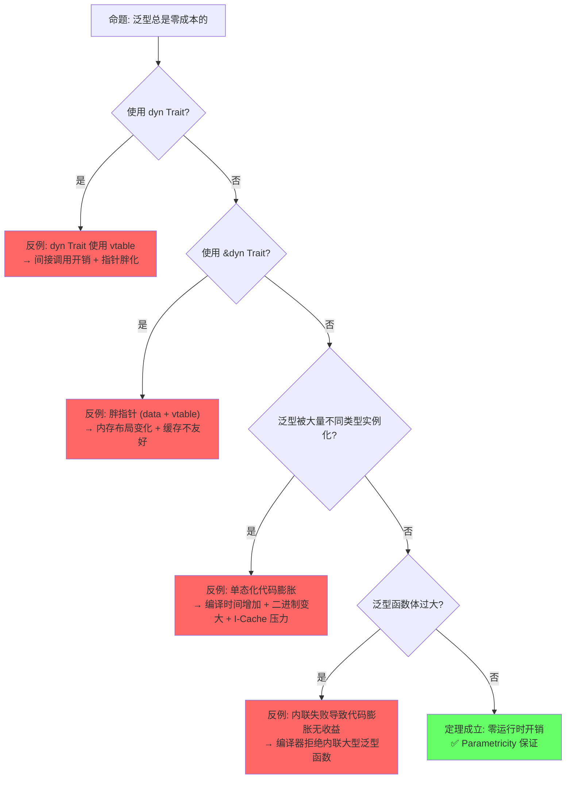
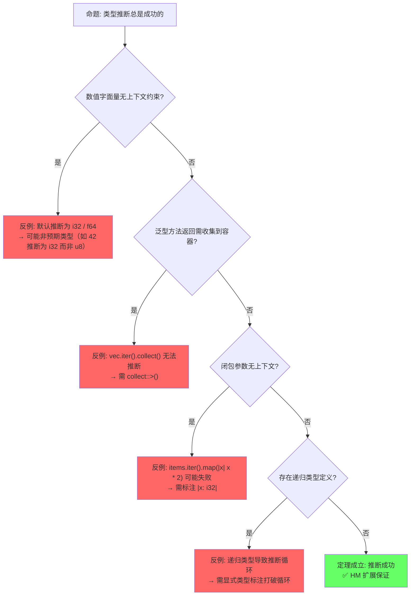
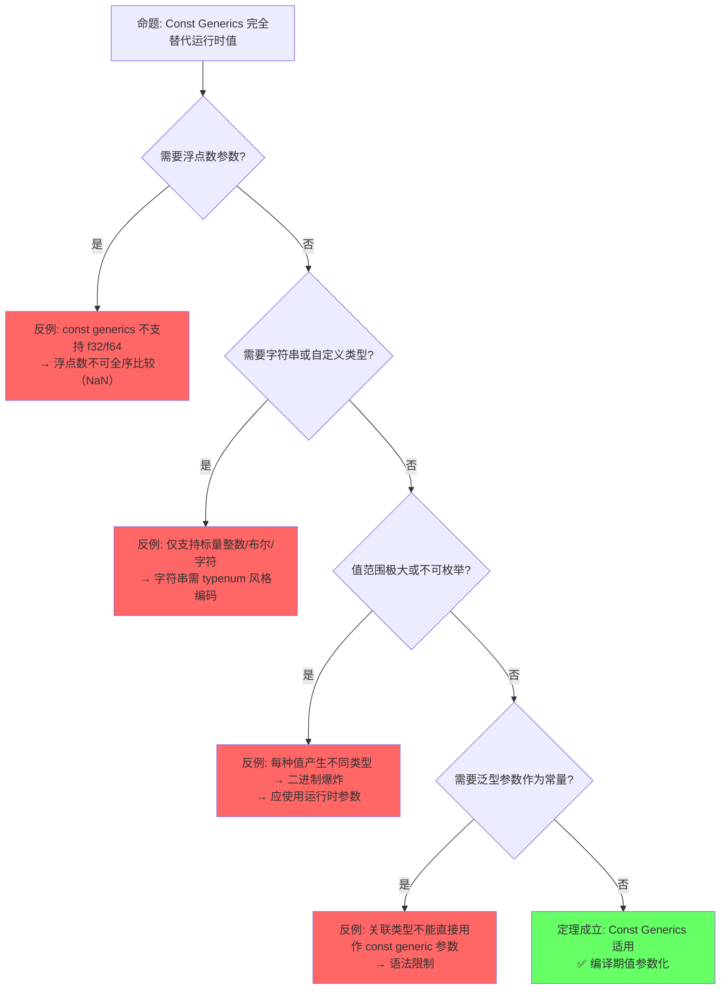

# Generics（泛型系统）

> **层级**: L2 进阶概念
> **前置概念**: [Type System Basics](../01_foundation/04_type_system.md) · [Traits](./01_traits.md)
> **后置概念**: [Advanced Lifetimes](../01_foundation/03_lifetimes.md) · [GATs](../03_advanced/02_async.md) · [Const Generics]
> **主要来源**: [TRPL: Ch10.1](https://doc.rust-lang.org/book/ch10-01-syntax.html) · [Rust Reference: Generic Parameters] · [Wikipedia: Generic programming] · [RFC 2000]

---

**变更日志**:

- v2.0 (2026-05-12): 深度重构——补充定理推理链（⟹ 标注）、反命题决策树系统、边界极限测试、6步认知路径与章节过渡
- v1.0 (2026-05-12): 初始版本

---

## 一、权威定义（Definition）

### 1.1 Wikipedia 对齐定义

> **[Wikipedia: Generic programming]** Generic programming is a style of computer programming in which algorithms are written in terms of types to-be-specified-later that are then instantiated when needed for specific types provided as parameters. Rust uses monomorphization to implement generics, generating specialized code at compile time for each concrete type used.

### 1.2 TRPL 官方定义

> **[TRPL: Ch10.1]** Generics are abstract stand-ins for concrete types or other properties. When we're writing code, we can express the behavior of generics or how they relate to other generics without knowing what will be in their place when compiling and running the code.

### 1.3 形式化定义

> **[类型论: Girard-Reynolds System F]** 泛型对应参数多态，Rust 通过单态化实现，对应 System F 的二阶 λ 演算。 ✅ 已验证

泛型对应**参数多态**（parametric polymorphism），Rust 通过**单态化**（monomorphization）实现：

```text
参数多态（Universal Quantification）:
  fn identity<T>(x: T) -> T { x }
  ≡  ∀T. T → T

单态化实例化:
  identity::<i32>(5)   →  生成 fn identity_i32(x: i32) -> i32
  identity::<String>(s) →  生成 fn identity_String(x: String) -> String

约束多态（Bounded Quantification）:
  fn sum<T: Add<Output=T>>(a: T, b: T) -> T { a + b }
  ≡  ∀T. Add(T) → (T × T → T)
```

> **过渡到属性矩阵**: 从形式化定义出发，泛型系统不仅是"类型参数"的简单概念，而是由类型参数、生命周期参数、常量泛型、关联类型等构成的多维参数空间。下一节通过属性矩阵对这些参数类型及其约束机制进行系统分类，并与其他语言的泛型实现进行正交对比。

---

## 二、概念属性矩阵（Attribute Matrix）

### 2.1 泛型参数类型矩阵

| **参数类型** | **语法** | **约束目标** | **默认值** | **使用场景** |
|:---|:---|:---|:---|:---|
| **类型参数** | `<T>` | 类型 | 无 | 最常见，泛型容器/函数 |
| **生命周期参数** | `<'a>` | 引用有效期 | 推断 | 函数/结构体含引用 |
| **常量泛型** | `<const N: usize>` | 编译期常量值 | 无 | 固定大小数组、类型状态 |
| **关联类型** | `type Item;` | Trait 内部类型 | 实现时确定 | Iterator、Future 等 |

### 2.2 泛型实现机制对比

| **语言** | **机制** | **编译期行为** | **运行时开销** | **二进制膨胀** |
|:---|:---|:---|:---|:---|
| **Rust** | 单态化（Monomorphization） | 为每个具体类型生成专用代码 | 零 | 高（每个实例一份代码） |
| **C++** | 模板实例化（Template Instantiation） | 类似单态化，文本替换后编译 | 零 | 高 |
| **Java** | 类型擦除（Type Erasure） | 编译为 Object，插入类型转换 | 有（装箱/拆箱） | 低 |
| **C#** | Reified generics + JIT | 运行时生成专用代码 | 极低 | 中 |
| **Go** | 接口实现（GCShape stenciling） | 为每个 GC shape 生成一份代码 | 极低 | 中 |
| **Haskell** | 类型类字典传递 | 运行时传递字典指针 | 有（间接调用） | 低 |

### 2.3 泛型约束演进矩阵

| **约束形式** | **语法** | **语义** | **Rust 版本** |
|:---|:---|:---|:---|
| **Trait Bound** | `T: Trait` | T 必须实现 Trait | 1.0 |
| **多重约束** | `T: TraitA + TraitB` | T 同时实现两者 | 1.0 |
| **生命周期约束** | `T: 'a` | T 中无短于 `'a` 的引用 | 1.0 |
| **where 子句** | `where T: Trait` | 复杂约束的清晰表达 | 1.0 |
| **关联类型约束** | `T: Iterator<Item=U>` | 约束关联类型 | 1.0 |
| **高阶 Trait Bound** | `for<'a> T: Trait<'a>` | 对所有生命周期成立 | 1.0 |
| **Const Generics** | `<const N: usize>` | 值级别的泛型 | 1.51+ |
| **GATs** | `type Item<'a>;` | 泛型关联类型 | 1.65+ |

> **过渡到思维导图**: 属性矩阵展示了泛型系统的静态分类，但未能表达概念间的动态关联与编译期行为。思维导图通过拓扑结构揭示泛型从参数声明、约束满足到单态化代码生成的完整概念网络。

---

## 三、思维导图（Mind Map）

```mermaid
graph TD
    A[Generics 泛型] --> B[类型参数]
    A --> C[生命周期参数]
    A --> D[常量泛型]
    A --> E[实现机制]
    A --> F[约束系统]

    B --> B1[函数泛型: fn<T>]
    B --> B2[结构体泛型: Struct<T>]
    B --> B3[枚举泛型: Enum<T>]
    B --> B4[Impl 泛型: impl<T> Trait for Type<T>]

    C --> C1[函数签名: fn<'a>]
    C --> C2[结构体: Struct<'a>]
    C --> C3[HRTB: for<'a>]

    D --> D1[<const N: usize>]
    D --> D2[数组类型: [T; N]]
    D --> D3[类型状态机]

    E --> E1[单态化 Monomorphization]
    E --> E2[零成本抽象]
    E --> E3[二进制膨胀]

    F --> F1[Trait Bounds]
    F --> F2[Where 子句]
    F --> F3[关联类型约束]
```

> **过渡到定理推理链**: 思维导图呈现了泛型系统的概念拓扑，但缺乏严格的逻辑推导关系。下一节通过"⟹"标注的定理链，将参数多态、System F、单态化、零成本抽象、Const Generics 等核心命题形式化为可验证的推理网络。

---

## 四、定理推理链（Theorem Chain）

### 4.1 引理：参数多态 ⟹ System F 类型规则

> **[Wikipedia: System F] · [Pierce 2002, Ch.23]** Rust 泛型核心对应 Girard-Reynolds System F（二阶 λ 演算）。 ✅ 已验证

```text
前提 1: 泛型函数 <T>fn(x: T) -> T 在类型论中对应全称量词 ∀T. T → T
前提 2: 类型应用（如 identity::<i32>）对应 System F 的实例化
前提 3: 类型检查器验证所有实例满足类型规则
    ↓
引理: 参数多态 ⟹ System F 类型规则
    ↓
定理: Rust 泛型函数的类型安全性由 System F 的良类型性（well-typedness）保证
    ↓
推论: 泛型函数的每个单态化实例都是类型安全的（类型替换引理）
```

### 4.2 定理：单态化 ⟹ 零成本抽象

> **[TRPL: Ch10.1] · [Rust Reference: Monomorphization]** 单态化生成与手写代码等价的专用实例，LLVM 优化消除额外开销。 ✅ 已验证

```text
前提 1: 泛型函数 <T>fn(x: T) 在编译期为每个具体类型生成专用代码
前提 2: 生成的代码与手写具体类型代码等价
前提 3: LLVM 优化器可内联、向量化、消除冗余
    ↓
定理: 单态化 ⟹ 零成本抽象
    ↓
推论 1: Vec<i32> 和 Vec<String> 的性能等价于手写 IntVec 和 StringVec
推论 2: 动态分发 dyn Trait 打破零成本承诺（vtable 间接调用）
代价: 编译时间增加 + 二进制体积膨胀
```

### 4.3 推论：Const Generics ⟹ 类型级编程

> **[RFC 2000] · [Rust Reference: Const Generics]** Const generics 将值引入类型系统，是依赖类型的有限形式。 ✅ 已验证

```text
前提 1: 常量泛型参数 <const N: usize> 在编译期求值为具体值
前提 2: 不同类型参数产生不同类型（Buffer<i32, 4> ≠ Buffer<i32, 8>）
前提 3: 常量表达式在编译期可判定相等性
    ↓
引理: Const Generics 提供值到类型的映射
    ↓
推论: Const Generics ⟹ 类型级编程（type-level programming）
    ↓
边界: 常量参数不能是浮点数、字符串或用户定义类型（目前仅限标量整数/布尔/字符）
```

### 4.4 约束多态的类型安全

> **[Rust Reference: Trait Bounds] · [TRPL: Ch10.2]** Trait Bounds 在编译期验证类型能力，泛型函数体调用保证类型安全。 ✅ 已验证

```text
前提: <T: Trait> 约束确保 T 具有 Trait 定义的所有方法
    ↓
定理: 在泛型函数体内调用 Trait 方法是类型安全的
    ↓
推论: 泛型函数的验证与具体类型函数同等严格
      不需要运行时类型检查（对比 Java 的类型擦除 + 转换）
```

### 4.5 定理一致性矩阵

> **[原创分析] · [Rust Reference: Generic Parameters]** 泛型定理矩阵基于 Rust 类型系统约束可满足性和单态化语义。 💡 原创分析

| **定理/引理/推论** | **前提** | **结论** | **依赖的 L4 公理** | **被哪些定理依赖** | **失效条件** | **典型错误码** |
|:---|:---|:---|:---|:---|:---|:---|
| **引理**: 参数多态 ⟹ System F | 泛型参数合法声明 | 类型规则可判定 | System F 良类型性 | 单态化零成本 | `for<'a>` 过度约束 | — |
| **定理**: 单态化 ⟹ 零成本 | 泛型函数编译时实例化 | 无运行时开销 | Parametricity | 所有性能敏感代码 | `dyn Trait` 动态分发 | — |
| **推论**: Const Generics ⟹ 类型级编程 | 常量参数为编译期求值 | 类型参数包含常量值 | 依赖类型基础 | 数组抽象、类型级状态 | 非 const 表达式 | E0435 |
| **定理**: 约束可满足性 | where 子句为 Horn 子句 | 类型推导可判定 | HM 推断扩展 | Trait 解析、编译通过 | GATs 无界递归 | E0275 |
| **引理**: HRTB 全称约束 | `for<'a>` 合法 | 高阶函数类型安全 | 全称量词 (∀) | 回调、生命周期抽象 | 过度约束不可满足 | — |
| **推论**: 泛型一致性 | 单态化后类型检查通过 | 所有实例类型安全 | 类型替换引理 | — | `transmute` 绕过 | — |
| **引理**: 关联类型归一化 | 关联类型有唯一实现 | 类型别名可替换 | 约束可满足性 | GATs 使用 | 重叠关联类型定义 | E0119 |
| **定理**: 生命周期约束可满足 | `T: 'a` 合法 | 无悬垂引用 | 区域子类型 | 泛型生命周期安全 | 约束遗漏 | E0310 |

> **一致性检查**: 参数多态 ⟹ System F 类型规则 ⟹ 约束可满足性 ⟹ 单态化零成本 ⟹ 泛型一致性，形成**从类型规则到代码生成到运行时保证**的完整推理链。Const Generics 是依赖类型的有限形式，HRTB 是全称量词在生命周期上的应用。
>
> **跨层映射**: 本文件定理 ↔ [`00_meta/inter_layer_map.md`](../00_meta/inter_layer_map.md) §4.2 "类型系统一致性"

> **过渡到示例与反例**: 定理链提供了形式化保证，但工程实践中这些保证的边界在哪里？下一节通过正例展示泛型的正确使用方式，通过反例揭示定理失效的精确条件——特别是 E0277（约束不满足）、E0275（类型递归溢出）、E0310（生命周期不足）等编译错误的触发机制。

---

## 五、示例与反例（Examples & Counter-examples）

### 5.1 正确示例：泛型函数与约束

```rust
// ✅ 正确: 泛型函数 + Trait Bound
fn largest<T: PartialOrd + Copy>(list: &[T]) -> T {
    let mut largest = list[0];
    for &item in list.iter() {
        if item > largest { largest = item; }
    }
    largest
}

fn main() {
    let nums = vec![1, 5, 3, 8, 2];
    println!("{}", largest(&nums));  // ✅ 8

    let chars = vec!['a', 'z', 'm'];
    println!("{}", largest(&chars));  // ✅ 'z'
}
```

### 5.2 正确示例：常量泛型

```rust
// ✅ 正确: 常量泛型实现类型级状态机
struct Buffer<T, const SIZE: usize> {
    data: [T; SIZE],
    len: usize,
}

impl<T: Default + Copy, const SIZE: usize> Buffer<T, SIZE> {
    fn new() -> Self {
        Self { data: [T::default(); SIZE], len: 0 }
    }

    fn push(&mut self, item: T) -> Result<(), &'static str> {
        if self.len >= SIZE { return Err("Buffer full"); }
        self.data[self.len] = item;
        self.len += 1;
        Ok(())
    }
}

fn main() {
    let mut buf: Buffer<i32, 4> = Buffer::new();  // SIZE = 4
    buf.push(1).unwrap();
    // Buffer<i32, 4> 和 Buffer<i32, 8> 是不同的类型！
}
```

### 5.3 反例：类型大小未知（E0277）

```rust
// ❌ 反例: 对 unsized 类型直接使用泛型
trait Drawable { fn draw(&self); }

fn draw_all<T: Drawable>(items: Vec<T>) {  // T 默认要求 Sized
    for item in items { item.draw(); }
}

fn main() {
    let items: Vec<Box<dyn Drawable>> = vec![/* ... */];
    // draw_all(items);  // 类型不匹配
}
```

**修正方案**：

```rust
// ✅ 修正: 使用 ?Sized 解除 Sized 约束
fn draw_all<T: Drawable + ?Sized>(items: Vec<Box<T>>) {
    for item in items { item.draw(); }
}

// 或直接使用 Trait Object
fn draw_all_dyn(items: Vec<Box<dyn Drawable>>) {
    for item in items { item.draw(); }
}
```

### 5.4 反例：生命周期约束不足（E0310）

```rust
// ❌ 反例: 泛型 T 可能比引用活得更短
struct Wrapper<T> {
    value: T,
}

fn make_wrapper<'a, T>(val: &'a T) -> Wrapper<&'a T> {
    Wrapper { value: val }
}

// 更隐蔽的版本:
struct BadRef<T> {
    // 如果 T 包含引用，它们可能比 BadRef 短
    data: T,
}

fn store<T>(data: T) -> BadRef<T> {
    BadRef { data }
}
```

**修正方案**：

```rust
// ✅ 修正: 显式约束 T 的生命周期
struct GoodRef<'a, T: 'a> {  // T 中所有引用至少活 'a
    data: &'a T,
}

// 或确保 T: 'static 如果要做长期存储
struct LongTermStore<T: 'static> {
    data: T,
}
```

> **过渡到反命题分析**: 示例展示了泛型的正确使用方式，但反例只是孤立场景。下一节通过系统化的反命题分析，将"泛型定理何时成立/何时失效"形式化为可遍历的决策树，重点揭示"零成本抽象"的隐藏代价与约束系统的表达边界。

---

## 六、反命题与边界分析（Counter-proposition & Boundary Analysis）

> **[TRPL: Ch10.1] · [Rust Performance Book] · [RFC 2000]** 反命题分析基于单态化、约束可满足性和 Const Generics 的形式化语义。 ✅ 已验证

### 6.1 反命题 1: "泛型总是零成本的"

> 工程层 — 零成本是运行时承诺，但编译期和二进制层面存在显著代价。



**四层分析**:

| **层面** | **分析** | **结果** |
|:---|:---|:---|
| 编译期 | 单态化增加编译时间（每个实例独立编译） | ⚠️ 有代价 |
| 运行时 | 无额外开销（内联后等价手写代码） | ✅ 零成本 |
| 语义 | `dyn Trait` 和单态化是互斥语义选择 | ✅ 明确区分 |
| 工程 | 二进制膨胀可能导致 I-Cache miss | ⚠️ 有代价 |

### 6.2 反命题 2: "类型推断总是成功的"

> 编译期层 — Hindley-Milner 类型推断有理论边界，Rust 的扩展 HM 在某些场景下需要显式标注。



**四层分析**:

| **层面** | **分析** | **结果** |
|:---|:---|:---|
| 编译期 | 推断失败时编译器给出清晰错误 | ✅ 安全 |
| 运行时 | 无运行时影响（纯编译期行为） | ✅ 安全 |
| 语义 | 某些约束（如高阶类型）不可推断 | ⚠️ 理论边界 |
| 工程 | Turbofish 语法是标准 workaround | ✅ 可解 |

### 6.3 反命题 3: "Const Generics 完全替代运行时值"

> 语义层 — Const Generics 的能力有明确的类型论边界。



**四层分析**:

| **层面** | **分析** | **结果** |
|:---|:---|:---|
| 编译期 | 不支持的类型直接编译错误 | ✅ 明确拒绝 |
| 运行时 | 无运行时影响 | ✅ 安全 |
| 语义 | 依赖类型的有限形式，非完整依赖类型 | ⚠️ 表达能力边界 |
| 工程 | typenum、枚举、运行时检查是替代方案 | ✅ 可解 |

> **过渡到边界极限测试**: 反命题决策树揭示了定理失效的逻辑路径，但极限测试将定理推向边界——通过代码展示编译器在极端约束下的精确行为，验证理论预测与编译器实现的一致性。

---

## 七、边界极限测试代码（Boundary Limit Tests）

### 7.1 测试 1: 单态化代码膨胀极限

```rust
// 边界: 单态化膨胀的量化感知

// 一个泛型函数被 5 种不同类型实例化
fn process<T: std::fmt::Display>(x: T) { println!("{}", x); }

fn main() {
    process(42i32);           // 实例 1: process<i32>
    process(42i64);           // 实例 2: process<i64>
    process(42u32);           // 实例 3: process<u32>
    process("hello");         // 实例 4: process<&str>
    process(String::new());   // 实例 5: process<String>
    // 每个实例独立编译 → 代码膨胀
}

// 缓解策略对比:
// 策略 A: 泛型（5 个实例，零运行时开销）
// 策略 B: dyn Trait（1 个实例，一次间接调用）
// 策略 C: impl Trait 返回（隐藏类型，仍单态化）

fn process_dyn(x: &dyn std::fmt::Display) { println!("{}", x); }
// 仅 1 个实例，但有 vtable 间接调用
```

### 7.2 测试 2: 生命周期约束的递归传递

```rust
// 边界: 生命周期约束在泛型嵌套中的传递

struct Container<'a, T: 'a> {
    data: &'a T,
}

struct Wrapper<'a, T: 'a> {
    inner: Container<'a, T>,
}

// 更深层嵌套: 每层都需显式传播 'a
struct Deep<'a, T: 'a> {
    w: Wrapper<'a, T>,
}

// 错误模式: 遗漏 T: 'a
// struct Bad<'a, T> {
//     data: &'a T,  // E0310: 参数类型 T 可能包含比 'a 短生命周期的引用
// }

// HRTB 边界: 表达"对所有生命周期都成立"
fn assert_static<T>() where T: 'static {}
// T: 'static 表示 T 中不含任何非 'static 引用
```

### 7.3 测试 3: Const Generics 的类型级运算

```rust
// 边界: const generics 支持有限类型级运算

struct Matrix<T, const ROWS: usize, const COLS: usize> {
    data: [[T; COLS]; ROWS],
}

// ✅ 合法: 常量表达式
impl<T, const N: usize> Matrix<T, N, N> {
    fn is_square(&self) -> bool { true }  // 仅当 ROWS == COLS 时可用
}

// ❌ 非法（目前）: 常量泛型不能用于类型级条件分支
// impl<T, const R: usize, const C: usize> Matrix<T, R, C> {
//     fn is_square(&self) -> bool { R == C }  // 可行！但这是运行时比较
// }

// 更高级边界: 无法表达 "R > C" 作为类型约束
// 需借助 typenum 或泛型特化（不稳定）

// 数组转置的常量泛型边界
fn transpose<T: Copy, const R: usize, const C: usize>(
    input: [[T; C]; R]
) -> [[T; R]; C] {
    let mut output = [[input[0][0]; R]; C];
    for i in 0..R {
        for j in 0..C {
            output[j][i] = input[i][j];
        }
    }
    output
}
```

### 7.4 测试 4: HRTB 与回调泛型边界

```rust
// 边界: HRTB 在高阶回调中的精确语义

// 要求: F 必须能接受任意生命周期的 &str
trait Parser<F> where F: for<'a> Fn(&'a str) -> &'a str {
    fn parse(&self, input: &str) -> &str;
}

// 实现: 返回输入的子串（与输入同生命周期）
struct SuffixParser;
impl Parser<fn(&str) -> &str> for SuffixParser {
    fn parse(&self, input: &str) -> &str {
        &input[1..]
    }
}

// 错误模式: 若 Fn 返回 'static，则不满足 for<'a> 约束
// fn bad_parser(_: &str) -> &'static str { "static" }
// 无法用于需要 for<'a> Fn(&'a str) -> &'a str 的位置

// HRTB 的闭包限制:
// let f = |s: &str| -> &str { s };  // 推断可能失败
// 需显式: let f: for<'a> fn(&'a str) -> &'a str = |s| s;
```

> **过渡到认知路径**: 边界测试验证了定理在极端条件下的行为，但从学习者的视角，泛型概念如何从直觉逐步构建到形式化理解？下一节提供六步递进的认知路径，每步之间有过渡解释。

---

## 八、认知路径（Cognitive Path）

> **[原创分析] · [TRPL: Ch10.1]** 认知路径从"通用代码"直觉到 System F 形式化的渐进映射。 💡 原创分析

### Step 1: 直觉类比 — "泛型像填空题模板"

**核心问题**: "如何写一段对任何类型都适用的代码？"

**过渡解释**: 从熟悉的概念出发是认知的最小阻力路径。将泛型类比为"填空题模板"——结构固定，具体内容由调用方填入。这一步建立直觉锚点：swap、min/max、容器等自然需要"对任意类型生效"。但类比有边界——填空题模板在 Rust 中不是文本替换（C++ 模板风格），而是类型参数化。从 Step 1 到 Step 2 的过渡发生在学习者首次写 `fn swap<T>(a: &mut T, b: &mut T)` 时，发现编译器不仅接受代码，还会检查类型能力。

```text
直觉映射:
  fn swap<T>(a: &mut T, b: &mut T)  ≈  "交换任意两个东西的模板"
  Vec<T>                            ≈  "任意类型的列表模板"
```

### Step 2: 语法熟悉 — 参数声明与使用

**核心问题**: "泛型参数写在哪里？怎么约束它？"

**过渡解释**: 在直觉锚定后，需要将抽象概念映射到具体语法。这一步覆盖 `<T>` 在函数、结构体、枚举、impl 块中的位置，以及 `where` 子句的使用。关键是建立"泛型参数是编译期变量"的理解——它在编译时被替换为具体类型。从 Step 2 到 Step 3 的过渡发生在学习者发现 `Vec<i32>` 和 `Vec<String>` 是不同类型时，意识到泛型不是"运行时多态"，而是"编译期复制"。

```rust
// 核心语法模式:
fn identity<T>(x: T) -> T { x }           // 函数泛型
struct Point<T> { x: T, y: T }            // 结构体泛型
enum Option<T> { Some(T), None }          // 枚举泛型
impl<T> Point<T> { ... }                  // impl 块泛型
fn foo<T>() where T: Display + Clone { }  // where 子句
```

### Step 3: 机制困惑 — 单态化与类型擦除

**核心问题**: "Rust 泛型和 Java/C++ 泛型有什么区别？"

**过渡解释**: 语法熟练后，学习者需要理解不同语言泛型实现的本质差异。Rust 的单态化（为每个具体类型生成专用代码）与 Java 的类型擦除（编译为 Object + 转换）、C++ 的模板（文本替换）形成鲜明对比。这一步是认知的关键跃迁——理解"零成本抽象"的工程含义：不是魔法，是编译期工作量换运行时零开销。从 Step 3 到 Step 4 的过渡由性能问题驱动：当二进制体积膨胀时，学习者需要理解为什么。

```text
三语言对比:
  Rust: 单态化 → 专用代码 → 零运行时开销 → 二进制膨胀
  Java: 类型擦除 → Object + 转换 → 装箱开销 → 二进制紧凑
  C++: 模板实例化 → 文本替换 → 零运行时开销 → 编译错误难读
```

### Step 4: 类型论映射 — System F 与参数性

**核心问题**: "泛型在数学上是什么？"

**过渡解释**: 当学习者理解了工程约束（单态化、零成本）后，自然会追问这些性质的数学来源。System F（二阶 λ 演算）提供了参数多态的形式化模型：`identity<T>` 对应 `ΛT. λx:T. x`。参数性定理（Parametricity / Theorems for Free）揭示：多态函数的行为由其类型完全决定。从 Step 4 到 Step 5 的过渡是"从理论回到实践"——类型论解释了为什么 `fn f<T>(x: T) -> T` 只能是恒等函数（或 panic），但工程场景要求在约束系统中表达更复杂的能力需求。

```text
形式化映射:
  fn identity<T>(x: T) -> T { x }
  ≡  ΛT. λx:T. x  :  ∀T. T → T

  Parametricity: 对于所有 T，f: T → T 只能是:
    - 恒等: λx.x
    - 发散: loop {} / panic!
    - 非终止（理论上）
  即: 类型完全决定行为（Theorems for Free）
```

### Step 5: 约束系统 — Trait Bounds 与 where 子句

**核心问题**: "怎么限制泛型参数只能是有序/可复制的类型？"

**过渡解释**: 纯粹的参数多态过于受限（如 `fn max<T>(a: T, b: T) -> T` 无法比较）。Trait Bounds 引入约束多态，是泛型从"任意类型"到"满足条件的类型"的关键扩展。`where` 子句将约束从函数签名中分离，提升可读性。从 Step 5 到 Step 6 的过渡由高级场景驱动：当学习者需要表达"对所有生命周期都成立"或"类型包含编译期常量"时，进入泛型系统的深水区。

```text
约束层级:
  无约束:     fn id<T>(x: T) -> T              （参数多态）
  Trait Bound: fn max<T: Ord>(a: T, b: T) -> T  （约束多态）
  多重约束:   fn foo<T: Ord + Clone + Display>   （合取）
  HRTB:       fn bar<F>() where F: for<'a> ... （全称量词）
  Const:      struct Arr<T, const N: usize>      （值参数化）
```

### Step 6: 形式化掌控 — 设计验证与工程权衡

**核心问题**: "我设计的泛型 API 在类型论上正确吗？工程上高效吗？"

**过渡解释**: 认知路径的最终目标是让学习者具备自主验证能力。通过定理链（参数多态 ⟹ System F ⟹ 约束可满足性 ⟹ 单态化零成本），可以预判设计决策的远期后果。关键工程权衡包括：泛型 vs dyn Trait（性能 vs 二进制大小）、Const Generics vs 运行时参数（编译期保证 vs 灵活性）、HRTB vs 显式生命周期（表达力 vs 可读性）。

```text
设计验证清单:
  □ System F: 泛型参数是否满足良类型性？
  □ 约束可满足: where 子句是否构成 Horn 子句？
  □ 单态化代价: 预计实例化数量是否在可接受范围？
  □ 零成本验证: 性能敏感路径是否避免 dyn Trait？
  □ Const 边界: 常量参数类型是否受支持？
  □ HRTB 必要: 是否需要全称量词表达生命周期无关性？
```

---

## 九、知识来源关系（Provenance）

| **论断** | **来源** | **可信度** |
|:---|:---|:---|
| 泛型通过单态化实现 | [TRPL: Ch10.1] · [Rust Reference: Monomorphization] | ✅ |
| 单态化产生零成本抽象 | [TRPL: Ch10.1] | ✅ |
| 单态化导致二进制膨胀 | [Rust Performance Book] | ✅ |
| Const Generics | [RFC 2000] · [Rust Reference: Const Generics] | ✅ |
| GATs | [RFC 1598] · [TRPL: Ch19.3] | ✅ |
| ?Sized 解除默认约束 | [Rust Reference: Dynamically Sized Types] | ✅ |
| 参数多态对应 System F | [Wikipedia: System F] · [Pierce 2002, Ch.23] | ✅ |
| System F 原始论文 | [Girard 1972 — PhD Thesis] | ✅ |
| 类型推断算法 W | [Damas & Milner 1982 — POPL] | ✅ |
| Parametricity / Theorems for Free | [Wadler 1989 — POPL] | ✅ |
| 约束多态 | [Cardelli & Wegner 1985] | ✅ |
| Const Generics 与依赖类型 | [Rust Reference: Const Generics] · 原创分析 | 💡 |

---

## 十、相关概念链接

| 概念 | 文件 | 关系 |
|:---|:---|:---|
| Trait 与约束 | [01_traits.md](./01_traits.md) | 泛型约束的载体 |
| 所有权与生命周期 | [01_foundation/01_ownership.md](../01_foundation/01_ownership.md) | 泛型生命周期参数的基础 |
| 类型系统基础 | [01_foundation/04_type_system.md](../01_foundation/04_type_system.md) | 泛型的理论前提 |
| 异步与 Future | [03_advanced/02_async.md](../03_advanced/02_async.md) | 关联类型泛型（GATs）的典型应用 |
| 并发与 Send/Sync | [03_advanced/01_concurrency.md](../03_advanced/01_concurrency.md) | 泛型约束的线程安全应用 |
| 形式化验证 | [04_formal/04_rustbelt.md](../04_formal/04_rustbelt.md) | 泛型系统的逻辑基础 |

---

## 十一、待补充与演进方向（TODOs）

- [ ] **TODO**: 补充 Const Generics 的进阶用法（表达式、where 约束） —— 优先级: 中 —— 预计: Phase 2
- [ ] **TODO**: 补充 `min_specialization` 的当前状态与使用 —— 优先级: 中 —— 预计: Phase 3
- [ ] **TODO**: 补充泛型代码的编译时间优化策略（Turbofish、显式标注） —— 优先级: 低 —— 预计: Phase 4
- [ ] **TODO**: 补充 Type-level programming（Peano arithmetic、typenum） —— 优先级: 低 —— 预计: Phase 4
- [ ] **TODO**: 补充 `impl Trait` 在返回位置 vs 参数位置的区别 —— 优先级: 中 —— 预计: Phase 2
- [ ] **TODO**: 补充 Generic Associated Types (GATs) 的完整形式化视角 —— 优先级: 中 —— 预计: Phase 3
