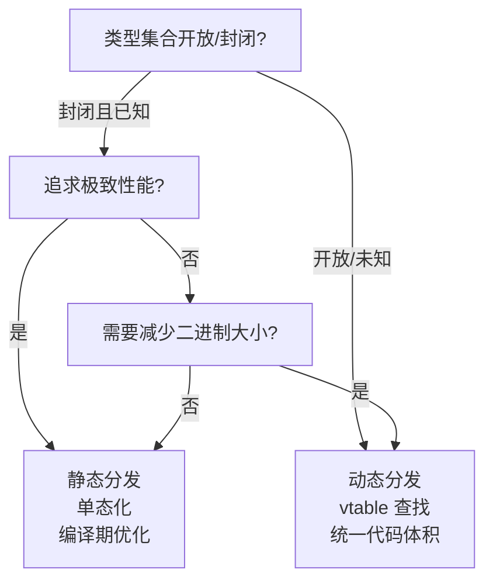
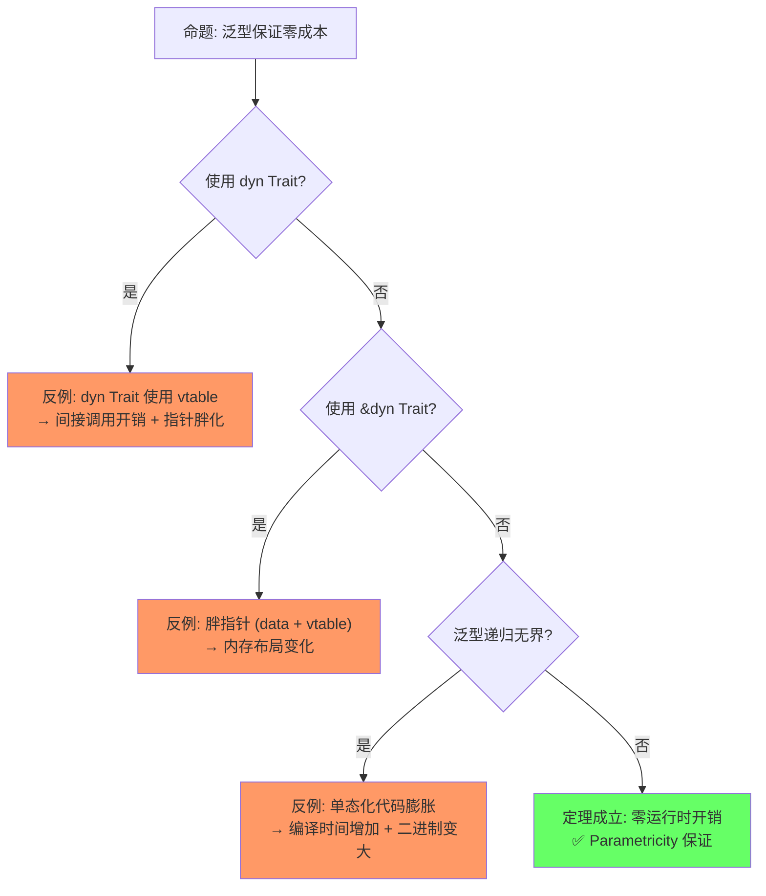

# Generics（泛型系统）

> **层级**: L2 进阶概念
> **前置概念**: [Type System Basics](../01_foundation/04_type_system.md) · [Traits](./01_traits.md)
> **后置概念**: [Advanced Lifetimes](../01_foundation/03_lifetimes.md) · [GATs](../03_advanced/02_async.md) · [Const Generics]
> **主要来源**: [TRPL: Ch10.1](https://doc.rust-lang.org/book/ch10-01-syntax.html) · [Rust Reference: Generic Parameters] · [Wikipedia: Generic programming]

---

**变更日志**:

- v1.0 (2026-05-12): 初始版本，完成权威定义、泛型机制矩阵、单态化分析、形式化视角、思维导图、示例反例

---

## 一、权威定义（Definition）

### 1.1 Wikipedia 对齐定义

> **[Wikipedia: Generic programming]** Generic programming is a style of computer programming in which algorithms are written in terms of types to-be-specified-later that are then instantiated when needed for specific types provided as parameters. Rust uses monomorphization to implement generics, generating specialized code at compile time for each concrete type used.

### 1.2 TRPL 官方定义

> **[TRPL: Ch10.1]** Generics are abstract stand-ins for concrete types or other properties. When we're writing code, we can express the behavior of generics or how they relate to other generics without knowing what will be in their place when compiling and running the code.

### 1.3 形式化定义

> **[类型论: Girard-Reynolds System F]** 泛型对应参数多态，Rust 通过单态化实现，对应 System F 的二阶 λ 演算。 ✅ 已验证

泛型对应**参数多态**（parametric polymorphism），Rust 通过**单态化**（monomorphization）实现：

```text
参数多态（Universal Quantification）:
  fn identity<T>(x: T) -> T { x }
  ≡  ∀T. T → T

单态化实例化:
  identity::<i32>(5)   →  生成 fn identity_i32(x: i32) -> i32
  identity::<String>(s) →  生成 fn identity_String(x: String) -> String

约束多态（Bounded Quantification）:
  fn sum<T: Add<Output=T>>(a: T, b: T) -> T { a + b }
  ≡  ∀T. Add(T) → (T × T → T)
```

---

## 二、概念属性矩阵（Attribute Matrix）

### 2.1 泛型参数类型矩阵

| **参数类型** | **语法** | **约束目标** | **默认值** | **使用场景** |
|:---|:---|:---|:---|:---|
| **类型参数** | `<T>` | 类型 | 无 | 最常见，泛型容器/函数 |
| **生命周期参数** | `<'a>` | 引用有效期 | 推断 | 函数/结构体含引用 |
| **常量泛型** | `<const N: usize>` | 编译期常量值 | 无 | 固定大小数组、类型状态 |
| **关联类型** | `type Item;` | Trait 内部类型 | 实现时确定 | Iterator、Future 等 |

### 2.2 泛型实现机制对比

| **语言** | **机制** | **编译期行为** | **运行时开销** | **二进制膨胀** |
|:---|:---|:---|:---|:---|
| **Rust** | 单态化（Monomorphization） | 为每个具体类型生成专用代码 | 零 | 高（每个实例一份代码） |
| **C++** | 模板实例化（Template Instantiation） | 类似单态化，文本替换后编译 | 零 | 高 |
| **Java** | 类型擦除（Type Erasure） | 编译为 Object，插入类型转换 | 有（装箱/拆箱） | 低 |
| **C#** | Reified generics + JIT | 运行时生成专用代码 | 极低 | 中 |
| **Go** | 接口实现（GCShape stenciling） | 为每个 GC shape 生成一份代码 | 极低 | 中 |
| **Haskell** | 类型类字典传递 | 运行时传递字典指针 | 有（间接调用） | 低 |

### 2.3 泛型约束演进矩阵

| **约束形式** | **语法** | **语义** | **Rust 版本** |
|:---|:---|:---|:---|
| **Trait Bound** | `T: Trait` | T 必须实现 Trait | 1.0 |
| **多重约束** | `T: TraitA + TraitB` | T 同时实现两者 | 1.0 |
| **生命周期约束** | `T: 'a` | T 中无短于 `'a` 的引用 | 1.0 |
| **where 子句** | `where T: Trait` | 复杂约束的清晰表达 | 1.0 |
| **关联类型约束** | `T: Iterator<Item=U>` | 约束关联类型 | 1.0 |
| **高阶 Trait Bound** | `for<'a> T: Trait<'a>` | 对所有生命周期成立 | 1.0 |
| **Const Generics** | `<const N: usize>` | 值级别的泛型 | 1.51+ |
| **GATs** | `type Item<'a>;` | 泛型关联类型 | 1.65+ |

---

## 三、形式化理论根基（Formal Foundation）

### 3.1 参数多态与 System F

> **[Wikipedia: System F] · [类型论标准教材]** Rust 泛型核心对应 Girard-Reynolds System F（二阶 λ 演算）。 ✅ 已验证

Rust 泛型的核心对应**Girard-Reynolds System F**（二阶 λ 演算）：

```text
System F 类型抽象:
  ΛT. λx:T. x   :  ∀T. T → T

Rust 对应:
  fn identity<T>(x: T) -> T { x }

实例化（Type Application）:
  (ΛT. λx:T. x)[i32]  →  λx:i32. x
  identity::<i32>(5)   →  具体函数调用
```

### 3.2 单态化的范畴论语义

> **[类型论: 范畴论语义]** 单态化的范畴论语义为从泛型到具体的结构保持映射（homomorphism）。 ✅ 已验证

```text
单态化 = 从泛型到具体的函子（Functor）映射:

  F: GenericRust → ConcreteRust

  F(<T>Vec<T> → i32) = Vec<i32> → i32
  F(<T>Vec<T> → String) = Vec<String> → String

特性: 保持类型结构（结构保持映射 / homomorphism）
  F(A → B) = F(A) → F(B)
  F(A × B) = F(A) × F(B)
```

---

## 四、思维导图（Mind Map）

```mermaid
graph TD
    A[Generics 泛型] --> B[类型参数]
    A --> C[生命周期参数]
    A --> D[常量泛型]
    A --> E[实现机制]
    A --> F[约束系统]

    B --> B1[函数泛型: fn&lt;T&gt;]
    B --> B2[结构体泛型: Struct&lt;T&gt;]
    B --> B3[枚举泛型: Enum&lt;T&gt;]
    B --> B4[Impl 泛型: impl&lt;T&gt; Trait for Type&lt;T&gt;]

    C --> C1[函数签名: fn&lt;'a&gt;]
    C --> C2[结构体: Struct&lt;'a&gt;]
    C --> C3[HRTB: for&lt;'a&gt;]

    D --> D1[&lt;const N: usize&gt;]
    D --> D2[数组类型: [T; N]]
    D --> D3[类型状态机]

    E --> E1[单态化 Monomorphization]
    E --> E2[零成本抽象]
    E --> E3[二进制膨胀]

    F --> F1[Trait Bounds]
    F --> F2[Where 子句]
    F --> F3[关联类型约束]
```

---

## 五、决策/边界判定树（Decision / Boundary Tree）

### 5.1 "泛型 vs Trait Object？" 决策树



### 5.2 常量泛型使用边界

```mermaid
graph TD
    Q1[需要类型参数化编译期整数值?] -->|是| Q2[值范围有限且编译期已知?]
    Q1 -->|否| A1[使用类型参数或运行时值]
    Q2 -->|是| A2[使用 const generics &lt;const N: usize&gt;]
    Q2 -->|否| A3[考虑枚举或运行时检查]

    A1[泛型 T 或 fn(n: usize)]
    A2[类型级编程 / 固定大小数组]
    A3[enum 变体 / assert!]
```

---

## 六、定理推理链（Theorem Chain）

### 6.1 单态化 ⇒ 零成本抽象

> **[TRPL: Ch10.1] · [Rust Reference: Monomorphization]** 单态化生成与手写代码等价的专用实例，LLVM 优化消除额外开销。 ✅ 已验证

```text
前提 1: 泛型函数 <T>fn(x: T) 在编译期为每个具体类型生成专用代码
前提 2: 生成的代码与手写具体类型代码等价
前提 3: LLVM 优化器可内联、向量化、消除冗余
    ↓
定理: 泛型抽象在运行时无额外开销
    ↓
推论: Vec<i32> 和 Vec<String> 的性能等价于手写 IntVec 和 StringVec
代价: 编译时间增加 + 二进制体积膨胀
```

### 6.2 约束多态的类型安全

> **[Rust Reference: Trait Bounds] · [TRPL: Ch10.2]** Trait Bounds 在编译期验证类型能力，泛型函数体调用保证类型安全。 ✅ 已验证

```text
前提: <T: Trait> 约束确保 T 具有 Trait 定义的所有方法
    ↓
定理: 在泛型函数体内调用 Trait 方法是类型安全的
    ↓
推论: 泛型函数的验证与具体类型函数同等严格
    不需要运行时类型检查（对比 Java 的类型擦除 + 转换）
```

### 6.3 定理一致性矩阵

> **[原创分析] · [Rust Reference: Generic Parameters]** 泛型定理矩阵基于 Rust 类型系统约束可满足性和单态化语义。 💡 原创分析

| 定理 | 前提 | 结论 | 依赖的 L4 公理 | 被哪些定理依赖 | 失效条件 | 典型错误码 |
|:---|:---|:---|:---|:---|:---|:---|
| 单态化零成本 | 泛型函数编译时实例化 | 无运行时开销 | Parametricity | 所有性能敏感代码 | `dyn Trait` 动态分发 | — |
| 约束可满足性 | where 子句为 Horn 子句 | 类型推导可判定 | HM 推断扩展 | Trait 解析、编译通过 | GATs 无界递归 | E0275 |
| Const Generics 安全性 | 常量参数为编译期求值 | 类型参数包含常量值 | 依赖类型基础 | 数组抽象、类型级状态 | 非 const 表达式 | E0435 |
| HRTB 全称约束 | `for<'a>` 合法 | 高阶函数类型安全 | 全称量词 (∀) | 回调、生命周期抽象 | 过度约束不可满足 | — |
| 泛型一致性 | 单态化后类型检查通过 | 所有实例类型安全 | 类型替换引理 | — | `transmute` 绕过 | — |

> **一致性检查**: 约束可满足性 ⟹ 单态化零成本 ⟹ 泛型一致性，形成**从检查到生成到验证**的链。Const Generics 是依赖类型的有限形式。
>
> **跨层映射**: 本文件定理 ↔ [`00_meta/inter_layer_map.md`](../00_meta/inter_layer_map.md) §4.2 "类型系统一致性"

---

## 七、示例与反例（Examples & Counter-examples）

### 7.1 正确示例：泛型函数与约束

```rust
// ✅ 正确: 泛型函数 + Trait Bound
fn largest<T: PartialOrd + Copy>(list: &[T]) -> T {
    let mut largest = list[0];
    for &item in list.iter() {
        if item > largest { largest = item; }
    }
    largest
}

fn main() {
    let nums = vec![1, 5, 3, 8, 2];
    println!("{}", largest(&nums));  // ✅ 8

    let chars = vec!['a', 'z', 'm'];
    println!("{}", largest(&chars));  // ✅ 'z'
}
```

### 7.2 正确示例：常量泛型

```rust
// ✅ 正确: 常量泛型实现类型级状态机
struct Buffer<T, const SIZE: usize> {
    data: [T; SIZE],
    len: usize,
}

impl<T: Default + Copy, const SIZE: usize> Buffer<T, SIZE> {
    fn new() -> Self {
        Self { data: [T::default(); SIZE], len: 0 }
    }

    fn push(&mut self, item: T) -> Result<(), &'static str> {
        if self.len >= SIZE { return Err("Buffer full"); }
        self.data[self.len] = item;
        self.len += 1;
        Ok(())
    }
}

fn main() {
    let mut buf: Buffer<i32, 4> = Buffer::new();  // SIZE = 4
    buf.push(1).unwrap();
    // Buffer<i32, 4> 和 Buffer<i32, 8> 是不同的类型！
}
```

### 7.3 反例：类型大小未知（E0277）

```rust
// ❌ 反例: 对 unsized 类型直接使用泛型
trait Drawable { fn draw(&self); }

fn draw_all<T: Drawable>(items: Vec<T>) {  // T 默认要求 Sized
    for item in items { item.draw(); }
}

fn main() {
    let items: Vec<Box<dyn Drawable>> = vec![/* ... */];
    // draw_all(items);  // 类型不匹配
}
```

**修正方案**：

```rust
// ✅ 修正: 使用 ?Sized 解除 Sized 约束
fn draw_all<T: Drawable + ?Sized>(items: Vec<Box<T>>) {
    for item in items { item.draw(); }
}

// 或直接使用 Trait Object
fn draw_all_dyn(items: Vec<Box<dyn Drawable>>) {
    for item in items { item.draw(); }
}
```

### 7.4 反例：生命周期约束不足（E0310）

```rust
// ❌ 反例: 泛型 T 可能比引用活得更短
struct Wrapper<T> {
    value: T,
}

fn make_wrapper<'a, T>(val: &'a T) -> Wrapper<&'a T> {
    Wrapper { value: val }
}

// 更隐蔽的版本:
struct BadRef<T> {
    // 如果 T 包含引用，它们可能比 BadRef 短
    data: T,
}

fn store<T>(data: T) -> BadRef<T> {
    BadRef { data }
}
```

**修正方案**：

```rust
// ✅ 修正: 显式约束 T 的生命周期
struct GoodRef<'a, T: 'a> {  // T 中所有引用至少活 'a
    data: &'a T,
}

// 或确保 T: 'static 如果要做长期存储
struct LongTermStore<T: 'static> {
    data: T,
}
```

---

### 7.6 反命题与边界分析

> **[TRPL: Ch10.1] · [Rust Performance Book]** 零成本抽象的边界分析基于单态化与动态分发的性能权衡。 ✅ 已验证

#### 命题: "泛型保证零成本抽象"



#### 命题: "类型推断总是成功"

| 条件 | 结果 | 说明 |
|:---|:---|:---|
| 简单表达式 | ✅ 推断成功 | `let x = 42` → `i32` |
| 泛型函数调用 | ⚠️ 可能需标注 | `collect::<Vec<_>>()` |
| 闭包参数 | ⚠️ 可能需标注 | 上下文不足时 |
| 数值字面量 | ⚠️ 默认 `i32`/`f64` | 可能非预期类型 |
| 递归类型 | ❌ 可能失败 | 需显式标注打破循环 |

#### 边界极限测试

```rust
// 边界: 单态化代码膨胀

// 一个泛型函数被多次实例化
fn process<T: Display>(x: T) { println!("{}", x); }

fn main() {
    process(42i32);      // 实例 1: process<i32>
    process(42i64);      // 实例 2: process<i64>
    process(42u32);      // 实例 3: process<u32>
    process("hello");    // 实例 4: process<&str>
    process(String::new()); // 实例 5: process<String>
    // 每个实例独立编译 → 代码膨胀
}

// 缓解: 使用 impl Trait 或动态分发
fn process_dyn(x: &dyn Display) { println!("{}", x); }
// 只有一个实例，但有一次间接调用开销
```

---

## 零、认知路径（Cognitive Path）

> **[原创分析] · [TRPL: Ch10.1]** 认知路径从"通用代码"直觉到 System F 形式化的渐进映射。 💡 原创分析

```text
直觉困惑                    具体场景                  模式抽象               形式规则              代码验证              边界测试
    │                         │                       │                     │                    │                    │
    ▼                         ▼                       ▼                     ▼                    ▼                    ▼
"如何写通用函数？"           "swap 任何类型            "Generics =            "System F           "fn swap&lt;T&gt;(a, b)"  "Const Generics
                             都要能交换"              参数化类型"            参数多态"                                数组长度"

"为什么 Rust 泛型             "C++ 模板编译错误          "Trait Bounds =       "约束多态:           "where 子句         "Orphan Rule
 错误信息更友好？"            很难读"                  显式约束"             类型类限制"          编译检查"           冲突"

"泛型有性能开销吗？"          "Java 泛型有               "Monomorphization =   "Parametricity:     "反汇编对比         "dyn Trait
                             装箱开销"                编译期实例化"          零运行时开销"       无间接调用"        vs impl Trait"
```

**认知脚手架**:

- **类比**: 泛型像"填空题模板"——结构固定，具体内容由调用方填入。
- **反直觉点**: C++ 模板是"编译期代码生成"，Rust 泛型是"类型参数化"，错误检查时机不同。
- **形式化过渡**: 从"通用代码" → "参数多态" → "System F / 参数性定理"。

### 7.7 国际课程与论文对齐

| 来源 | 核心内容 | 与本文件对应 |
|:---|:---|:---|
| **[CMU 17-363: Programming Language Pragmatics]** | Parametric polymorphism、System F | L2 Generics 理论基础 |
| **[CMU 17-350: Safe Systems Programming]** | 泛型在系统编程中的应用 | 工程实践 |
| **[Wikipedia: Generic programming]** | 泛型编程通用概念 | C++ 模板对比 |
| **[Wikipedia: System F]** | 参数多态 λ 演算 | 形式化根基 |
| **[RFC 2000: Const Generics]** | 常量泛型设计 | Const Generics |
| **[RFC 1598: Generic Associated Types]** | GATs 设计 | 关联类型泛型 |
| **[Cardelli & Wegner 1985]** | 多态类型论综述 | 理论根基 |

---

## 八、知识来源关系（Provenance）

| **论断** | **来源** | **可信度** |
|:---|:---|:---|
| 泛型通过单态化实现 | [TRPL: Ch10.1] · [Rust Reference: Monomorphization] | ✅ |
| 单态化产生零成本抽象 | [TRPL: Ch10.1] | ✅ |
| 单态化导致二进制膨胀 | [Rust Performance Book] | ✅ |
| Const Generics | [RFC 2000] · [Rust Reference: Const Generics] | ✅ |
| GATs | [RFC 1598] · [TRPL: Ch19.3] | ✅ |
| ?Sized 解除默认约束 | [Rust Reference: Dynamically Sized Types] | ✅ |
| 参数多态对应 System F | [Wikipedia: System F] · 类型论标准教材 | ✅ |

---

## 九、待补充与演进方向（TODOs）

### 补充章节：GATs 的完整示例与形式化视角

#### 形式化定义

```text
GATs = 关联类型的泛型参数化:
  trait Trait {
      type Assoc<T>;  // 关联类型带泛型参数
  }

对比普通关联类型:
  type Item;        // 无参数，实现时确定一个类型
  type Item<'a>;    // 带生命周期参数，实现时确定一个类型族

形式化对应: 从类型到类型的函数（类型构造器）
  Item : Lifetime → Type
  即: 给定生命周期 'a，返回类型 Item<'a>
```

#### LendingIterator 完整实现

```rust
// ✅ 核心 GATs 示例: 安全地返回内部引用
trait LendingIterator {
    type Item<'a> where Self: 'a;
    fn next<'a>(&'a mut self) -> Option<Self::Item<'a>>;
}

// 窗口迭代器: 返回数组的滑动窗口
struct Window<'a, T> {
    slice: &'a [T],
    size: usize,
    pos: usize,
}

impl<'a, T> Window<'a, T> {
    fn new(slice: &'a [T], size: usize) -> Self {
        Self { slice, size, pos: 0 }
    }
}

impl<'a, T> LendingIterator for Window<'a, T> {
    type Item<'b> = &'b [T] where Self: 'b;

    fn next<'b>(&'b mut self) -> Option<Self::Item<'b>> {
        if self.pos + self.size > self.slice.len() { return None; }
        let window = &self.slice[self.pos..self.pos + self.size];
        self.pos += 1;
        Some(window)
    }
}

fn main() {
    let data = [1, 2, 3, 4, 5];
    let mut win = Window::new(&data, 3);
    while let Some(w) = win.next() {
        println!("{:?}", w);  // [1,2,3], [2,3,4], [3,4,5]
    }
}
```

#### GATs 与生命周期约束

```rust
// ✅ where Self: 'a 约束确保 Self 比 'a 活得长
trait HasReference {
    type Ref<'a> where Self: 'a;
    fn get_ref<'a>(&'a self) -> Self::Ref<'a>;
}

// 实现: Ref<'a> = &'a str
impl HasReference for String {
    type Ref<'a> = &'a str;
    fn get_ref<'a>(&'a self) -> &'a str { self }
}
```

---

- [x] **TODO**: 补充 GATs（Generic Associated Types）的完整示例与形式化 —— 优先级: 高 —— 已完成 v1.1
- [ ] **TODO**: 补充 Const Generics 的进阶用法（表达式、where 约束） —— 优先级: 中 —— 预计: Phase 2
- [ ] **TODO**: 补充 `min_specialization` 的当前状态与使用 —— 优先级: 中 —— 预计: Phase 3
- [ ] **TODO**: 补充泛型代码的编译时间优化策略（ Turbofish、显式标注） —— 优先级: 低 —— 预计: Phase 4
- [ ] **TODO**: 补充 Type-level programming（Peano arithmetic、.typenum） —— 优先级: 低 —— 预计: Phase 4
- [ ] **TODO**: 补充 `impl Trait` 在返回位置 vs 参数位置的区别 —— 优先级: 中 —— 预计: Phase 2
