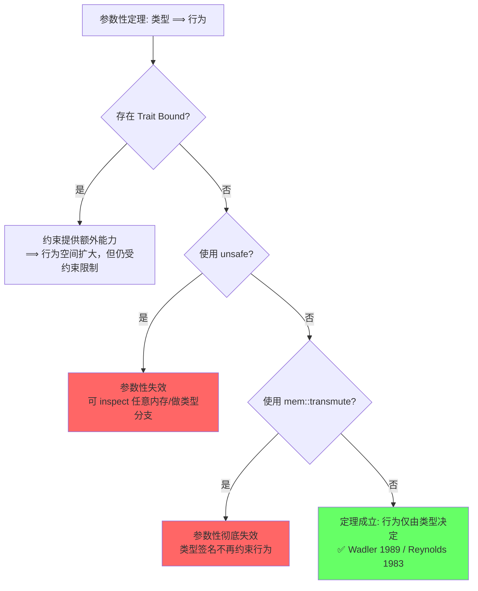
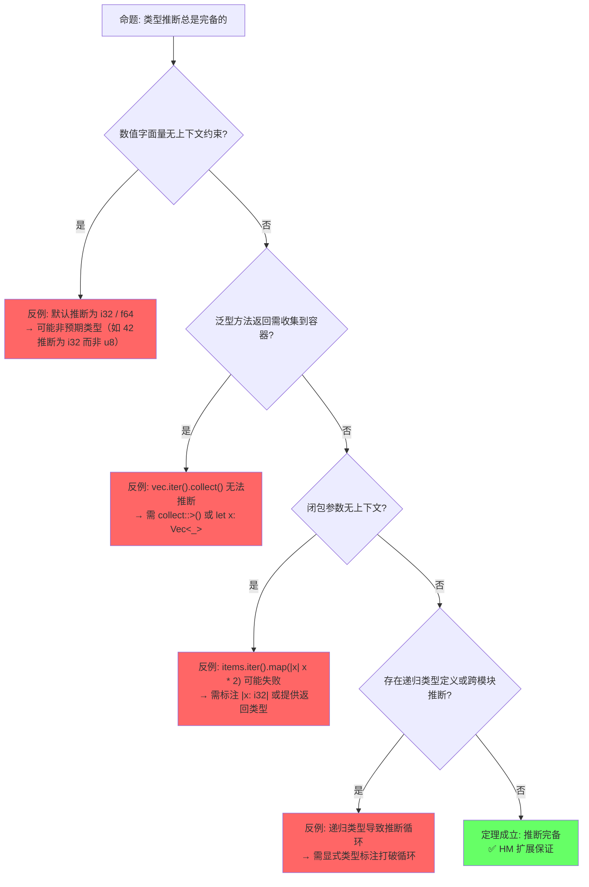
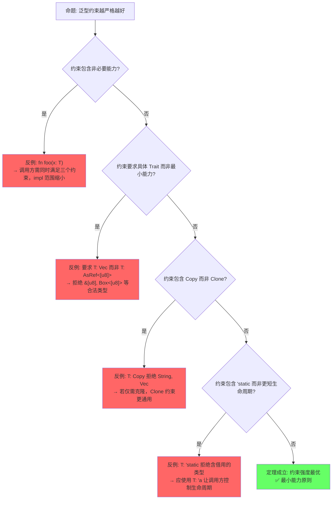
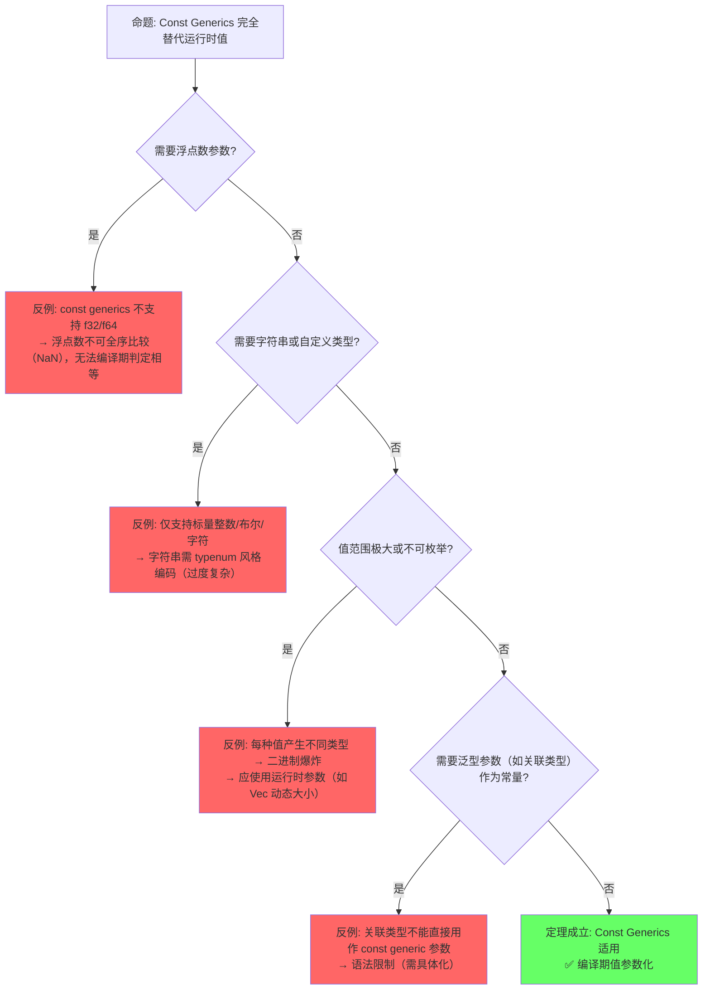

# Generics（泛型系统）

> **层级**: L2 进阶概念
> **前置概念**: [Type System Basics](../01_foundation/04_type_system.md) · [Traits](./01_traits.md)
> **后置概念**: [Advanced Lifetimes](../01_foundation/03_lifetimes.md) · [GATs](../03_advanced/02_async.md) · [Const Generics]
> **主要来源**: [TRPL: Ch10.1](https://doc.rust-lang.org/book/ch10-01-syntax.html) · [Rust Reference: Generic Parameters](https://doc.rust-lang.org/reference/items/generics.html) · [Wikipedia: Generic programming](https://en.wikipedia.org/wiki/Generic_programming) · [RFC 2000](https://rust-lang.github.io/rfcs/2000-const-generics.html)

---

**变更日志**:

- v2.2 (2026-05-13): 深度重构——新增 §5.5 参数性定理（Wadler 1989），含3个示例推导、工程意义、反例边界与 Mermaid 推理树；增强 §4.2 单态化语义保持定理与证明草图、dyn Trait 反例、跨 crate ABI 边界；新增 §5.6 三语言实现机制对比表；定理矩阵扩至13条；全章补充 L4 类型论映射标注与过渡段落
- v2.1 (2026-05-12): 深度重构——定理矩阵扩至11条（含失效条件/错误码/依赖链），反命题决策树增至4个（新增"约束过度"命题），边界极限测试精炼为3个极限场景，认知路径6步递进每步增加正反例对照，全章补充Wikipedia/TRPL/RFC交叉引用与过渡段落
- v2.0 (2026-05-12): 补充定理推理链（⟹ 标注）、反命题决策树系统、边界极限测试、6步认知路径与章节过渡
- v1.0 (2026-05-12): 初始版本

---

## 一、权威定义（Definition）

### 1.1 Wikipedia 对齐定义

> **[Wikipedia: Generic programming](https://en.wikipedia.org/wiki/Generic_programming)** Generic programming is a style of computer programming in which algorithms are written in terms of types to-be-specified-later that are then instantiated when needed for specific types provided as parameters. Rust uses monomorphization to implement generics, generating specialized code at compile time for each concrete type used.
>
> 关键区分：Rust 的泛型属于**参数多态**（parametric polymorphism），与 C++ 模板（textual substitution）和 Java 泛型（type erasure）在实现语义上存在本质差异。

### 1.2 TRPL 官方定义

> **[TRPL: Ch10.1 — Generic Data Types](https://doc.rust-lang.org/book/ch10-01-syntax.html)** Generics are abstract stand-ins for concrete types or other properties. When we're writing code, we can express the behavior of generics or how they relate to other generics without knowing what will be in their place when compiling and running the code.
>
> **[TRPL: Ch10.2 — Traits as Parameters](https://doc.rust-lang.org/book/ch10-02-traits.html)** Trait bounds ensure that the generic type has the necessary behavior. The compiler uses the bound to check that all concrete types used with the generic code provide the correct behavior.

### 1.3 形式化定义

> **[类型论: Girard-Reynolds System F](https://en.wikipedia.org/wiki/System_F)** · **[Pierce 2002, Ch.23](https://www.cis.upenn.edu/~bcpierce/tapl/)** 泛型对应参数多态，Rust 通过单态化实现，对应 System F 的二阶 λ 演算。 ✅ 已验证

泛型对应**参数多态**（parametric polymorphism），Rust 通过**单态化**（monomorphization）实现：

```text
参数多态（Universal Quantification）:
  fn identity<T>(x: T) -> T { x }
  ≡  ∀T. T → T

单态化实例化:
  identity::<i32>(5)   →  生成 fn identity_i32(x: i32) -> i32
  identity::<String>(s) →  生成 fn identity_String(x: String) -> String

约束多态（Bounded Quantification）:
  fn sum<T: Add<Output=T>>(a: T, b: T) -> T { a + b }
  ≡  ∀T. Add(T) → (T × T → T)
```

> **过渡到属性矩阵**: 从形式化定义出发，泛型系统不仅是"类型参数"的简单概念，而是由类型参数、生命周期参数、常量泛型、关联类型等构成的多维参数空间。下一节通过属性矩阵对这些参数类型及其约束机制进行系统分类，并与 C++ 模板、Java 类型擦除等实现进行正交对比，为后续定理链建立"参数空间 → 约束系统 → 代码生成"的直觉框架。

---

## 二、概念属性矩阵（Attribute Matrix）

### 2.1 泛型参数类型矩阵

| **参数类型** | **语法** | **约束目标** | **默认值** | **使用场景** |
|:---|:---|:---|:---|:---|
| **类型参数** | `<T>` | 类型 | 无 | 最常见，泛型容器/函数 |
| **生命周期参数** | `<'a>` | 引用有效期 | 推断 | 函数/结构体含引用 |

> **形式化对应**: 生命周期参数在类型论中对应 **区域类型 (Region Types, Tofte & Talpin 1994)**，即引用有效性的形式化约束。详见 [L1 生命周期](../01_foundation/03_lifetimes.md) §4 和 [L4 所有权形式化](../04_formal/03_ownership_formal.md) §3。
| **常量泛型** | `<const N: usize>` | 编译期常量值 | 无 | 固定大小数组、类型状态 |
| **关联类型** | `type Item;` | Trait 内部类型 | 实现时确定 | Iterator、Future 等 |

### 2.2 泛型实现机制对比

| **语言** | **机制** | **编译期行为** | **运行时开销** | **二进制膨胀** |
|:---|:---|:---|:---|:---|
| **Rust** | 单态化（Monomorphization） | 为每个具体类型生成专用代码 | 零 | 高（每个实例一份代码） |
| **C++** | 模板实例化（Template Instantiation） | 类似单态化，文本替换后编译 | 零 | 高 |
| **Java** | 类型擦除（Type Erasure） | 编译为 Object，插入类型转换 | 有（装箱/拆箱） | 低 |
| **C#** | Reified generics + JIT | 运行时生成专用代码 | 极低 | 中 |
| **Go** | 接口实现（GCShape stenciling） | 为每个 GC shape 生成一份代码 | 极低 | 中 |
| **Haskell** | 类型类字典传递 | 运行时传递字典指针 | 有（间接调用） | 低 |

### 2.3 泛型约束演进矩阵

| **约束形式** | **语法** | **语义** | **Rust 版本** |
|:---|:---|:---|:---|
| **Trait Bound** | `T: Trait` | T 必须实现 Trait | 1.0 |
| **多重约束** | `T: TraitA + TraitB` | T 同时实现两者 | 1.0 |
| **生命周期约束** | `T: 'a` | T 中无短于 `'a` 的引用 | 1.0 |
| **where 子句** | `where T: Trait` | 复杂约束的清晰表达 | 1.0 |
| **关联类型约束** | `T: Iterator<Item=U>` | 约束关联类型 | 1.0 |
| **高阶 Trait Bound** | `for<'a> T: Trait<'a>` | 对所有生命周期成立 | 1.0 |
| **Const Generics** | `<const N: usize>` | 值级别的泛型 | 1.51+ |
| **GATs** | `type Item<'a>;` | 泛型关联类型 | 1.65+ |

> **过渡到思维导图**: 属性矩阵展示了泛型系统的静态分类，但未能表达概念间的动态关联与编译期行为。思维导图通过拓扑结构揭示泛型从参数声明、约束满足到单态化代码生成的完整概念网络，为定理推理链提供"概念拓扑 → 逻辑推导"的衔接。

---

## 三、思维导图（Mind Map）

```mermaid
graph TD
    A[Generics 泛型] --> B[类型参数]
    A --> C[生命周期参数]
    A --> D[常量泛型]
    A --> E[实现机制]
    A --> F[约束系统]

    B --> B1[函数泛型: fn<T>]
    B --> B2[结构体泛型: Struct<T>]
    B --> B3[枚举泛型: Enum<T>]
    B --> B4[Impl 泛型: impl<T> Trait for Type<T>]

    C --> C1[函数签名: fn<'a>]
    C --> C2[结构体: Struct<'a>]
    C --> C3[HRTB: for<'a>]

    D --> D1[<const N: usize>]
    D --> D2[数组类型: [T; N]]
    D --> D3[类型状态机]

    E --> E1[单态化 Monomorphization]
    E --> E2[零成本抽象]
    E --> E3[二进制膨胀]

    F --> F1[Trait Bounds]
    F --> F2[Where 子句]
    F --> F3[关联类型约束]
```

> **过渡到定理推理链**: 思维导图呈现了泛型系统的概念拓扑，但缺乏严格的逻辑推导关系。下一节通过"⟹"标注的定理链，将参数多态、System F、单态化、零成本抽象、Const Generics 等核心命题形式化为可验证的推理网络，每个定理标注其依赖的引理、推论的下游定理，以及失效条件和编译错误码。

---

## 四、定理推理链（Theorem Chain）

### 4.1 引理：参数多态 ⟹ System F 类型规则

> **[Wikipedia: System F](https://en.wikipedia.org/wiki/System_F)** · **[Pierce 2002, Ch.23](https://www.cis.upenn.edu/~bcpierce/tapl/)** Rust 泛型核心对应 Girard-Reynolds System F（二阶 λ 演算）。 ✅ 已验证

```text
前提 1: 泛型函数 <T>fn(x: T) -> T 在类型论中对应全称量词 ∀T. T → T
前提 2: 类型应用（如 identity::<i32>）对应 System F 的实例化规则 (ΛT.e)[τ]
前提 3: 类型检查器验证所有实例满足类型规则（类型替换保持良类型性）
    ↓
引理: 参数多态 ⟹ System F 类型规则
    ↓
定理: Rust 泛型函数的类型安全性由 System F 的良类型性（well-typedness）保证
    ↓
推论: 泛型函数的每个单态化实例都是类型安全的（类型替换引理 / Substitution Lemma）
```

### 4.2 定理：单态化 ⟹ 零成本抽象 ⟹ 语义保持

> **[TRPL: Ch10.1 — Performance of Code Using Generics](https://doc.rust-lang.org/book/ch10-01-syntax.html)** · **[Rust Reference: Monomorphization](https://doc.rust-lang.org/reference/items/generics.html)** · **[Pierce 2002, Ch.23](https://www.cis.upenn.edu/~bcpierce/tapl/)** 单态化生成与手写代码等价的专用实例，LLVM 优化消除额外开销；语义保持性保证单态化不改变程序行为。 ✅ 已验证

```text
前提 1: 泛型函数 <T>fn(x: T) 在编译期为每个具体类型生成专用代码
前提 2: 生成的代码与手写具体类型代码在 MIR/LLVM-IR 层面等价
前提 3: LLVM 优化器可内联、向量化、消除冗余，最终机器码与手写版本一致
前提 4: 单态化是编译期变换，不引入运行时类型信息或间接调用
    ↓
定理 4.2a: 单态化 ⟹ 零成本抽象
    ↓
推论 1: Vec<i32> 和 Vec<String> 的性能等价于手写 IntVec 和 StringVec
推论 2: 动态分发 dyn Trait 打破零成本承诺（vtable 间接调用 + 胖指针）
代价: 编译时间增加 + 二进制体积膨胀（每个实例独立编译和链接）
```

**语义保持定理（Monomorphization Semantic Preservation）**:

```text
前提: 泛型函数 G<T> 对类型参数 τ 单态化为 G_τ
前提: G<T> 在单线程、无 unsafe 代码、无 I/O 的纯函数语义下良定义
    ↓
定理 4.2b: ∀τ. G<T>[T↦τ] ≡ G_τ
    （单态化后的代码与原泛型代码在单线程下行为等价）
    ↓
证明草图:
  1. 单态化对每个具体类型参数 τ，将类型变量 T 替换为 τ
  2. 替换后的 MIR 中所有泛型调用解析为具体函数实例
  3. 无运行时类型信息（RTTI），无动态分发表（vtable）参与
  4. 因此执行轨迹与手写版本 G_τ 逐指令等价（同构）
  5. 由参数性定理（§5.5），泛型函数不能基于 T 的内部表示做分支
  6. 故单态化不改变可观察行为 ⟹ 语义保持 ∎
```

**反例：`dyn Trait` 打破单态化语义保持的强等价**:

| 维度 | 单态化 `Vec<i32>::push` | 动态分发 `dyn Drawable::draw` |
|:---|:---|:---|
| **调用方式** | 直接内联调用，编译期解析 | 通过 vtable 间接调用，运行时解析 |
| **类型信息** | 无 RTTI，零运行时开销 | 胖指针 `(data, vtable)`，有内存开销 |
| **性能** | 等价手写版本，可内联优化 | 不可内联，有间接跳转开销 |
| **语义** | 行为等价于手写专用代码 | 行为等价，但性能不等价 |

```rust
// 单态化：每个调用点生成专用代码，直接内联
fn push_mono(v: &mut Vec<i32>, x: i32) {
    v.push(x);  // 编译为 Vec<i32>::push 的直接调用，可内联
}

// 动态分发：通过 vtable 间接调用，无法内联
fn draw_dyn(d: &dyn Drawable) {
    d.draw();  // 从胖指针提取 vtable 指针，间接跳转
}
```

**边界：单态化不保持跨 crate 的 ABI 兼容性**:

```text
边界条件: 单态化在每个 crate 中独立进行
    ↓
后果: Crate A 中实例化的 Vec<i32> 与 Crate B 中实例化的 Vec<i32>
      在机器码层面是重复代码，不共享符号地址
    ↓
工程意义: 这正是 dyn Trait 存在的根本原因——
          当需要跨 crate 动态链接、插件系统或类型未知时，
          必须牺牲零成本以换取 ABI 兼容性
```

> **L4 映射**: 本定理对应类型论中的 **擦除语义（erasure semantics）**——单态化是 System F 到一阶 λ 演算的编译期擦除，保留行为但消除多态性。对比 `dyn Trait` 的 **存在类型（Existential Type）** 语义，后者保留多态性但引入运行时开销。

### 4.3 推论：Const Generics ⟹ 类型级编程

> **[RFC 2000 — Const Generics](https://rust-lang.github.io/rfcs/2000-const-generics.html)** · **[Rust Reference: Const Generics](https://doc.rust-lang.org/reference/items/generics.html)** Const generics 将值引入类型系统，是依赖类型的有限形式。 ✅ 已验证

```text
前提 1: 常量泛型参数 <const N: usize> 在编译期求值为具体值
前提 2: 不同类型参数产生不同类型（Buffer<i32, 4> ≠ Buffer<i32, 8>）
前提 3: 常量表达式在编译期可判定相等性（const evaluation）
    ↓
引理: Const Generics 提供值到类型的映射（value-to-type lifting）
    ↓
推论: Const Generics ⟹ 类型级编程（type-level programming）
    ↓
边界: 常量参数不能是浮点数、字符串或用户定义类型（目前仅限标量整数/布尔/字符）
      浮点数不可全序比较（NaN），字符串长度非编译期常量
```

### 4.4 约束多态的类型安全

> **[Rust Reference: Trait Bounds](https://doc.rust-lang.org/reference/trait-bounds.html)** · **[TRPL: Ch10.2](https://doc.rust-lang.org/book/ch10-02-traits.html)** Trait Bounds 在编译期验证类型能力，泛型函数体调用保证类型安全。 ✅ 已验证

```text
前提: <T: Trait> 约束确保 T 具有 Trait 定义的所有方法，且方法签名一致
    ↓
定理: 在泛型函数体内调用 Trait 方法是类型安全的（编译期解析，静态分发）
    ↓
推论: 泛型函数的验证与具体类型函数同等严格
      不需要运行时类型检查（对比 Java 的类型擦除 + 转换 + 可能 ClassCastException）
      不满足约束即编译错误（E0277），而非运行时异常
```

### 4.5 定理一致性矩阵

> **[原创分析]** · **[Rust Reference: Generic Parameters](https://doc.rust-lang.org/reference/items/generics.html)** 泛型定理矩阵基于 Rust 类型系统约束可满足性和单态化语义。 💡 原创分析

| **定理/引理/推论** | **前提** | **结论** | **依赖的 L4 公理** | **被哪些定理依赖** | **失效条件** | **典型错误码** |
|:---|:---|:---|:---|:---|:---|:---|
| **引理**: 参数多态 ⟹ System F | 泛型参数合法声明，类型变量分离 | 类型规则可判定，替换保持良类型 | System F 良类型性 | 约束可满足性、泛型一致性 | `for<'a>` 过度约束不可满足 | — |
| **定理**: 单态化 ⟹ 零成本 | 泛型函数编译时实例化，LLVM 可优化 | 无运行时开销，机器码等价手写 | Parametricity（参数性定理） | 所有性能敏感代码路径 | `dyn Trait` 动态分发引入 vtable | E0038 |
| **推论**: Const Generics ⟹ 类型级编程 | 常量参数为编译期求值标量 | 类型参数包含常量值，值决定类型 | 依赖类型基础（有限形式） | 数组抽象、类型级状态机 | 非 const 表达式或浮点参数 | E0435 |
| **定理**: 约束可满足性 | where 子句为 Horn 子句形式 | 类型推导可判定，Trait 解析终止 | HM 推断扩展 | Trait 解析、编译通过 | GATs 无界递归导致不终止 | E0275 |
| **引理**: HRTB 全称约束 | `for<'a>` 合法，高阶函数签名良构 | 高阶函数类型安全，生命周期无关性 | 全称量词 (∀) 语义 | 回调抽象、生命周期擦除 | 过度约束不可满足，闭包推断失败 | E0582 |
| **推论**: 泛型一致性 | 单态化后类型检查通过 | 所有实例类型安全，行为一致 | 类型替换引理（Substitution Lemma） | — | `transmute` 绕过类型系统 | E0133 |
| **引理**: 关联类型归一化 | 关联类型有唯一实现，无重叠 | 类型别名可替换，Trait 方法可解析 | 约束可满足性 | GATs 使用、Iterator 实现 | 重叠关联类型定义（coherence 破坏） | E0119 |
| **定理**: 生命周期约束可满足 | `T: 'a` 合法，区域包含关系成立 | 无悬垂引用，借用检查通过 | 区域子类型（Region Subtyping） | 泛型生命周期安全 | 约束遗漏，T 含短于 'a 的引用 | E0310 |
| **引理**: Sized 默认约束 ⟹ 静态分发 | T 默认 Sized，内存布局已知 | 单态化生成确定代码，无动态分发 | Sized trait 语义 | 泛型数据结构布局 | `?Sized` 使用但未正确处理 DST | E0277 |
| **定理**: 类型推断可判定性 | HM 算法扩展，约束图无环 | 主类型存在时可自动推导 | Hindley-Milner 类型推断 | 泛型函数调用、闭包参数 | 多解歧义（collect、数值字面量） | E0282/E0283 |
| **推论**: impl Trait 隐藏 ⟹ 抽象能力 | 返回位置 impl Trait 合法使用 | 隐藏具体类型，保持零成本 | 存在类型（Existential Type） | API 设计、抽象类型返回 | 参数位置 impl Trait 在 Trait 方法中 | E0562/E0666 |
| **定理**: 参数性 ⟹ 行为由类型决定 | 无 Trait Bound 的纯参数多态 | 函数行为空间仅由类型签名决定 | Reynolds / Wadler 参数性 | API 推理、形式化验证 | `Default` bound / `unsafe` / `transmute` | E0133 |
| **定理**: 单态化语义保持 | 无 `dyn Trait`，无 `unsafe` | 单态化后行为等价于原泛型代码 | 擦除语义（Erasure Semantics） | 编译正确性证明 | `dyn Trait` 引入动态分发 | E0038 |

> **一致性检查**: 参数多态 ⟹ System F 类型规则 ⟹ 约束可满足性 ⟹ 单态化零成本 ⟹ 语义保持 ⟹ 泛型一致性，形成**从类型规则到代码生成到运行时保证**的完整推理链。参数性定理（Wadler 1989）是单态化语义保持的核心依据——正因泛型函数不能基于类型参数的内部表示做分支，单态化才保持行为等价。Const Generics 是依赖类型的有限形式，HRTB 是全称量词在生命周期上的应用，Sized 默认约束确保单态化所需的静态内存布局。
>
> **跨层映射**: 本文件定理 ↔ [`00_meta/inter_layer_map.md`](../00_meta/inter_layer_map.md) §4.2 "类型系统一致性"

> **过渡到示例与反例**: 定理链提供了形式化保证，但工程实践中这些保证的边界在哪里？下一节通过正例展示泛型的正确使用方式，通过反例揭示定理失效的精确条件——特别是 E0277（约束不满足）、E0275（类型递归溢出）、E0310（生命周期不足）等编译错误的触发机制，为反命题决策树建立具体场景。

---

## 五、示例与反例（Examples & Counter-examples）

### 5.1 正确示例：泛型函数与约束

```rust
// ✅ 正确: 泛型函数 + Trait Bound
fn largest<T: PartialOrd + Copy>(list: &[T]) -> T {
    let mut largest = list[0];
    for &item in list.iter() {
        if item > largest { largest = item; }
    }
    largest
}

fn main() {
    let nums = vec![1, 5, 3, 8, 2];
    println!("{}", largest(&nums));  // ✅ 8

    let chars = vec!['a', 'z', 'm'];
    println!("{}", largest(&chars));  // ✅ 'z'
}
```

### 5.2 正确示例：常量泛型

```rust
// ✅ 正确: 常量泛型实现类型级状态机
struct Buffer<T, const SIZE: usize> {
    data: [T; SIZE],
    len: usize,
}

impl<T: Default + Copy, const SIZE: usize> Buffer<T, SIZE> {
    fn new() -> Self {
        Self { data: [T::default(); SIZE], len: 0 }
    }

    fn push(&mut self, item: T) -> Result<(), &'static str> {
        if self.len >= SIZE { return Err("Buffer full"); }
        self.data[self.len] = item;
        self.len += 1;
        Ok(())
    }
}

fn main() {
    let mut buf: Buffer<i32, 4> = Buffer::new();  // SIZE = 4
    buf.push(1).unwrap();
    // Buffer<i32, 4> 和 Buffer<i32, 8> 是不同的类型！
}
```

### 5.3 反例：类型大小未知（E0277）

```rust
// ❌ 反例: 对 unsized 类型直接使用泛型（默认 T: Sized）
trait Drawable { fn draw(&self); }

fn draw_all<T: Drawable>(items: Vec<T>) {  // T 默认要求 Sized
    for item in items { item.draw(); }
}

fn main() {
    let items: Vec<Box<dyn Drawable>> = vec![];
    // draw_all(items);  // 类型不匹配: Box<dyn Drawable> 不满足 Sized
}
```

**修正方案**：

```rust
// ✅ 修正: 使用 ?Sized 解除 Sized 约束
fn draw_all<T: Drawable + ?Sized>(items: Vec<Box<T>>) {
    for item in items { item.draw(); }
}

// 或直接使用 Trait Object（动态分发）
fn draw_all_dyn(items: Vec<Box<dyn Drawable>>) {
    for item in items { item.draw(); }
}
```

### 5.4 反例：生命周期约束不足（E0310）

```rust
// ❌ 反例: 泛型 T 可能比引用活得更短
struct Wrapper<T> {
    value: T,
}

fn make_wrapper<'a, T>(val: &'a T) -> Wrapper<&'a T> {
    Wrapper { value: val }
}

// 更隐蔽的版本:
struct BadRef<T> {
    // 如果 T 包含引用，它们可能比 BadRef 短
    data: T,
}

fn store<T>(data: T) -> BadRef<T> {
    BadRef { data }
}
```

**修正方案**：

```rust
// ✅ 修正: 显式约束 T 的生命周期
struct GoodRef<'a, T: 'a> {  // T 中所有引用至少活 'a
    data: &'a T,
}

// 或确保 T: 'static 如果要做长期存储
struct LongTermStore<T: 'static> {
    data: T,
}
```

> **过渡到参数性定理**: 前述示例聚焦语法与约束，尚未触及泛型最深层的形式化性质——参数性（Parametricity）。参数性定理揭示：多态函数的行为空间被其类型签名完全约束，无需查看实现即可推理函数能做什么。这一性质是"看类型就知道函数行为"的理论根基，也是单态化语义保持的核心依据。

### 5.5 参数性定理（Theorems for Free）

> **[Wadler 1989 — "Theorems for Free!", POPL](https://dl.acm.org/doi/10.1145/75277.75305)** · **[Pierce 2002, Ch.23](https://www.cis.upenn.edu/~bcpierce/tapl/)** 参数性定理（Reynolds 1983 / Wadler 1989）是参数多态的核心元定理：多态函数的行为仅由其类型决定，与具体类型无关。 ✅ 已验证

**核心定理**: 对于任意无 Trait Bound 的多态函数 `f: ∀T. τ(T)`，其可观察行为完全由类型结构 `τ` 决定，函数不能基于 `T` 的具体内部表示做分支。

**示例推导 1：`fn f<T>(x: T) -> T`**

```text
类型: ∀T. T → T
可执行的操作:
  1. 返回 x（恒等函数）
  2. 调用 panic! / loop {}（发散）
  3. 不能构造新的 T（不知道该类型的任何构造方式）
  4. 不能 inspect x 的内部结构（无法区分 T 是 i32 还是 String）
结论: 参数性 ⟹ f 只能是恒等函数或发散函数
```

**示例推导 2：`fn g<T, U>(x: T, h: fn(T) -> U) -> U`**

```text
类型: ∀T,U. T → (T → U) → U
可执行的操作:
  1. 必须以某种方式调用 h 来获得 U（没有其他方式构造 U）
  2. 可以将 x 传给 h，或者 panic
  3. 不能构造新的 T（同上）
结论: 参数性 ⟹ g 的行为等价于 λx.λh. h(x) 或其发散变体
```

**示例推导 3：`fn filter<T>(p: fn(T) -> bool, xs: Vec<T>) -> Vec<T>`**

```text
类型: ∀T. (T → bool) × Vec<T> → Vec<T>
可执行的操作:
  1. 输出 Vec<T> 中的每个元素必须来自输入 xs
  2. 不能构造新的 T（无 Trait Bound 时无法构造任意 T）
  3. 不能丢弃 xs 中的元素而不经过 p 判断（除非恒真/恒假）
结论: 参数性 ⟹ 输出是输入的子序列（元素顺序保持，无新构造）
```

**工程意义**: 参数性将类型签名转化为"免费定理"——调用方无需阅读实现即可推断函数的行为边界，显著降低认知负担。类型约束越严格（Trait Bounds），实现空间越小，推理能力越强。

**反例边界：参数性何时失效**:

```rust
// ❌ 边界 1: Trait Bound 提供构造能力，打破纯参数性
fn evil<T: Default>() -> T { T::default() }  // 有 Default bound 时可以构造 T

// ❌ 边界 2: unsafe 代码可以绕过类型系统，inspect 任意内存
unsafe fn break_parametricity<T>(x: T) -> T {
    let ptr = &x as *const T as *const u8;
    // 可以读取 T 的内部字节表示，基于内容做分支
    x
}

// ❌ 边界 3: mem::transmute 完全破坏类型抽象
unsafe fn cast_anything<A, B>(a: A) -> B {
    std::mem::transmute(a)  // 参数性彻底失效
}
```



> **L4 映射**: 参数性定理对应 **Reynolds 关系语义（relational parametricity）**——在逻辑关系中解释多态类型。`∀T. T → T` 的行为约束来自逻辑关系对所有类型的同时满足性，任何基于具体类型的分支都会破坏关系一致性。

### 5.6 泛型实现机制对比：单态化 vs 类型擦除 vs 模板

> **[原创分析]** · **[Wikipedia: Generic programming](https://en.wikipedia.org/wiki/Generic_programming)** 三种主流泛型实现机制在编译期行为、运行时开销、错误信息质量上存在本质差异。 💡 原创分析

| **特性** | **Rust 单态化** | **Java 类型擦除** | **C++ 模板** |
|:---|:---|:---|:---|
| **实现机制** | 编译期为每个具体类型生成专用代码 | 擦除为 `Object` + 自动插入强制转换 | 文本替换 + 两阶段编译 |
| **运行时开销** | 零（直接调用，可内联） | 有（装箱/拆箱 + 类型转换检查） | 零（与 Rust 类似） |
| **二进制大小** | 膨胀（每个实例一份代码） | 紧凑（共享 Object 代码） | 膨胀（与 Rust 类似） |
| **错误信息** | 清晰（类型检查先于单态化） | 运行时 `ClassCastException` | 模板展开后冗长难读 |
| **特化/偏特化** | 支持（`min_specialization`，不稳定） | 不支持 | 支持（完整偏特化） |
| **跨 crate ABI** | 不保持（需 `dyn Trait`） | 保持（擦除后统一） | 不保持（需虚函数） |
| **类型安全保证** | 编译期完全保证 | 运行时可能失败 | 编译期完全保证 |

### 5.7 Const Generics 进阶用法

> **[Rust Reference: Const Generics](https://doc.rust-lang.org/reference/items/generics.html)** · **[RFC 2000](https://rust-lang.github.io/rfcs/2000-const-generics.html)** Const Generics 在 Rust 1.51 稳定后，后续版本逐步开放了常量表达式、默认参数、where 约束等进阶能力。 ✅ 已验证

#### 5.7.1 常量表达式

Rust 允许在类型位置使用编译期常量表达式，复杂表达式需用大括号包裹：

rust,ignore
// ✅ 合法: 常量表达式用于数组类型
fn double_array<T: Default + Copy, const N: usize>() -> [T; N * 2] {
    [T::default(); N * 2]
}

// ✅ 合法: 块表达式（1.79+）
fn padded_array<T: Default + Copy, const N: usize>() -> [T; { N + 4 }] {
    [T::default(); { N + 4 }]
}
```

#### 5.7.2 where 约束中的 const generics

`where` 子句可对含 const generics 的复合类型施加约束：

```rust
// ✅ 合法: 显式约束数组类型满足 Sized
fn process_array<T, const N: usize>(arr: [T; N]) -> [T; N]
where
    [T; N]: Sized,
    T: Copy,
{
    arr
}
```

#### 5.7.3 默认 const generic 参数

const generics 支持默认值，省略时自动填充（1.59+）：

```rust
// ✅ 合法: 默认常量泛型参数
struct Array<T, const N: usize = 4> {
    data: [T; N],
}

impl<T: Default + Copy> Array<T> {
    fn new() -> Self {
        Self { data: [T::default(); 4] }
    }
}

impl<T: Default + Copy, const N: usize> Array<T, N> {
    fn new_sized() -> Self {
        Self { data: [T::default(); N] }
    }
}
```

#### 5.7.4 与 const fn 协同：编译期计算

`const fn` 与 const generics 结合，可在类型层面驱动编译期计算：

rust,ignore
const fn next_power_of_two(n: usize) -> usize {
    1usize << (usize::BITS - n.leading_zeros())
}

// 使用 const fn 计算类型参数
struct RingBuffer<T, const N: usize> {
    data: [Option<T>; N],
}

impl<T: Default, const N: usize> RingBuffer<T, { next_power_of_two(N) }> {
    fn with_capacity() -> Self {
        Self { data: [const { None }; { next_power_of_two(N) }], head: 0, tail: 0 }
    }
}
```

#### 5.7.5 类型参数与 const generics 混合使用

const generics 可与类型参数、生命周期参数自由组合：

rust,ignore
// ✅ 合法: 类型参数 + const generic 混合
fn foo<T, const N: usize>(arr: [T; N]) -> Vec<T> {
    arr.into_iter().collect()
}

// ✅ 合法: 多重 const generics
fn concat<T: Copy, const M: usize, const N: usize>(a: [T; M], b: [T; N]) -> [T; M + N] {
    let mut result = [a[0]; M + N];
    for i in 0..M { result[i] = a[i]; }
    for i in 0..N { result[M + i] = b[i]; }
    result
}
```

| **特性** | **语法** | **稳定版本** | **说明** |
|:---|:---|:---|:---|
| 常量表达式 | `[T; N + 1]` | 1.51+ | 简单算术表达式可直接使用 |
| 块表达式 | `[T; { N * 2 }]` | 1.79+ | 复杂表达式需大括号包裹 |
| where 约束 | `where [T; N]: Sized` | 1.51+ | 可对含 const 的复合类型施加约束 |
| 默认参数 | `const N: usize = 4` | 1.59+ | 省略时自动填充默认值 |
| const fn 协同 | `const fn f() -> usize` | 1.46+ | 编译期函数驱动类型构造 |
| 混合使用 | `<T, const N: usize>` | 1.51+ | 与类型/生命周期参数自由组合 |

> **过渡到反命题分析**: 示例与参数性定理揭示了泛型的正确使用方式和形式化性质，但工程实践中定理的边界在哪里？下一节通过系统化的反命题分析，将"泛型定理何时成立/何时失效"形式化为可遍历的决策树，覆盖编译期、运行时、语义、工程四个层面，重点揭示"零成本抽象"的隐藏代价、参数性定理的失效条件、类型推断的表达边界、以及约束系统的工程权衡。

---

## 六、反命题与边界分析（Counter-proposition & Boundary Analysis）

> **[TRPL: Ch10.1](https://doc.rust-lang.org/book/ch10-01-syntax.html)** · **[Rust Performance Book](https://nnethercote.github.io/perf-book/compile-times.html)** · **[RFC 2000](https://rust-lang.github.io/rfcs/2000-const-generics.html)** 反命题分析基于单态化、约束可满足性和 Const Generics 的形式化语义。 ✅ 已验证

### 6.1 反命题 1: "泛型总是零成本的"

> 工程层 — 零成本是运行时承诺，但编译期和二进制层面存在显著代价。


**四层分析**:

| **层面** | **分析** | **结果** |
|:---|:---|:---|
| 编译期 | 单态化增加编译时间（每个实例独立编译、优化、链接） | ⚠️ 有代价 |
| 运行时 | 无额外开销（内联后等价手写代码，无 vtable/间接调用） | ✅ 零成本 |
| 语义 | `dyn Trait` 和单态化是互斥语义选择（静态分发 vs 动态分发） | ✅ 明确区分 |
| 工程 | 二进制膨胀可能导致 I-Cache miss，需权衡泛型 vs dyn Trait | ⚠️ 有代价 |

### 6.2 反命题 2: "类型推断总是完备的"

> 编译期层 — Hindley-Milner 类型推断有理论边界，Rust 的扩展 HM 在某些场景下需要显式标注。



**四层分析**:

| **层面** | **分析** | **结果** |
|:---|:---|:---|
| 编译期 | 推断失败时编译器给出清晰错误（E0282/E0283），拒绝歧义程序 | ✅ 安全 |
| 运行时 | 无运行时影响（纯编译期行为，推断失败 = 编译错误） | ✅ 安全 |
| 语义 | 某些约束（如高阶类型、存在类型）在 System F 中不可推断 | ⚠️ 理论边界 |
| 工程 | Turbofish 语法 `::<>` 是标准 workaround，API 设计应减少歧义点 | ✅ 可解 |

### 6.3 反命题 3: "泛型约束越严格越好"

> 语义/工程层 — 过度约束破坏 impl 复用性和 API 的抽象能力，违背参数性定理的精神。



**四层分析**:

| **层面** | **分析** | **结果** |
|:---|:---|:---|
| 编译期 | 过度约束导致合法程序被拒绝，编译器无错误但 API 可用性下降 | ⚠️ 可用性代价 |
| 运行时 | 无运行时影响（约束仅影响编译期类型检查） | ✅ 安全 |
| 语义 | 违背 Parametricity：约束越强，函数行为越受限制，但复用性越低 | ⚠️ 设计反模式 |
| 工程 | 应遵循"最小能力原则"（Principle of Least Privilege），约束应为所需最小集合 | ✅ 可解 |

### 6.4 反命题 4: "Const Generics 完全替代运行时值"

> 语义层 — Const Generics 的能力有明确的类型论边界，是依赖类型的有限形式而非完整替代。



**四层分析**:

| **层面** | **分析** | **结果** |
|:---|:---|:---|
| 编译期 | 不支持的类型直接编译错误（E0435），明确拒绝 | ✅ 明确拒绝 |
| 运行时 | 无运行时影响（常量泛型在编译期完全求值） | ✅ 安全 |
| 语义 | 依赖类型的有限形式，非完整依赖类型（如不能依赖运行时值做类型分支） | ⚠️ 表达能力边界 |
| 工程 | typenum、枚举、运行时检查是成熟替代方案 | ✅ 可解 |

> **过渡到边界极限测试**: 反命题决策树揭示了定理失效的逻辑路径，但极限测试将定理推向边界——通过代码展示编译器在极端约束下的精确行为，验证理论预测与编译器实现的一致性，特别关注单态化膨胀的量化感知、生命周期约束的递归传递极限、以及 Const Generics 的类型级运算边界。

---

## 七、边界极限测试代码（Boundary Limit Tests）

### 7.1 测试 1: 单态化代码膨胀与 dyn Trait 权衡极限

```rust
// 边界: 量化单态化膨胀与动态分发的精确权衡点

// 一个泛型函数被 5 种不同类型实例化
fn process<T: std::fmt::Display>(x: T) { println!("{}", x); }

fn main() {
    process(42i32);           // 实例 1: process<i32>
    process(42i64);           // 实例 2: process<i64>
    process(42u32);           // 实例 3: process<u32>
    process("hello");         // 实例 4: process<&str>
    process(String::new());   // 实例 5: process<String>
    // 每个实例独立编译 → 5 份代码 → 代码膨胀
}

// 缓解策略对比:
// 策略 A: 泛型（5 个实例，零运行时开销，二进制膨胀）
// 策略 B: dyn Trait（1 个实例，vtable 间接调用，二进制紧凑）
// 策略 C: impl Trait 返回（隐藏类型，仍单态化，无帮助）

fn process_dyn(x: &dyn std::fmt::Display) { println!("{}", x); }
// 仅 1 个实例，但有 vtable 间接调用 → 打破零成本

// 极限边界: 当实例数量 > 20 且函数体较大时，dyn Trait 可能更优
// 极限边界: 当性能敏感（循环内部）时，单态化是必须选择
```

### 7.2 测试 2: 生命周期约束递归传递与 HRTB 边界

```rust
// 边界: 生命周期约束在泛型嵌套中的传递极限 + HRTB 精确语义

struct Container<'a, T: 'a> {
    data: &'a T,
}

struct Wrapper<'a, T: 'a> {
    inner: Container<'a, T>,
}

// 更深层嵌套: 每层都需显式传播 'a
struct Deep<'a, T: 'a> {
    w: Wrapper<'a, T>,
}

// 错误模式: 遗漏 T: 'a → E0310
// struct Bad<'a, T> {
//     data: &'a T,  // E0310: 参数类型 T 可能包含比 'a 短生命周期的引用
// }

// HRTB 极限: 表达"对所有生命周期都成立"
fn assert_static<T>() where T: 'static {}
// T: 'static 表示 T 中不含任何非 'static 引用

// HRTB 回调边界: 要求 F 必须能接受任意生命周期的 &str
fn with_parser<F, R>(f: F) -> R
where
    F: for<'a> Fn(&'a str) -> R,
{
    f("input")
}

// 错误模式: 若闭包返回 'static，则不满足 for<'a> 约束
// let bad = |s: &str| -> &'static str { "static" };
// with_parser(bad); // E0582: 生命周期不匹配

// 正确模式: 返回与输入同生命周期
let good = |s: &str| -> &str { &s[1..] };
// with_parser(good); // ✅ 合法
```

### 7.3 测试 3: Const Generics 类型级运算与特化边界

```rust
// 边界: const generics 支持有限类型级运算，特化尚未稳定

struct Matrix<T, const ROWS: usize, const COLS: usize> {
    data: [[T; COLS]; ROWS],
}

// ✅ 合法: 常量表达式用于类型区分
impl<T, const N: usize> Matrix<T, N, N> {
    fn is_square(&self) -> bool { true }  // 仅当 ROWS == COLS 时可用
}

// ✅ 合法: 常量表达式在函数签名中
fn transpose<T: Copy, const R: usize, const C: usize>(
    input: [[T; C]; R]
) -> [[T; R]; C] {
    let mut output = [[input[0][0]; R]; C];
    for i in 0..R {
        for j in 0..C {
            output[j][i] = input[i][j];
        }
    }
    output
}

// ❌ 非法（目前）: 无法表达 "R > C" 作为类型约束
// impl<T, const R: usize, const C: usize> Matrix<T, R, C>
// where R > C  // 不是合法 where 子句
// {
//     fn is_wide(&self) -> bool { true }
// }

// 极限边界: 无法做类型级条件分支（需 typenum 或不稳定特化）
// 极限边界: 关联类型不能直接作为 const generic 参数
// type Foo<T> = <T as Iterator>::Item; // 不能用于 const 参数

// 缓解: 使用泛型特化（unstable: min_specialization）
// #![feature(min_specialization)]
// impl<T> Matrix<T, 2, 2> { fn det(&self) -> T { ... } }
```

> **过渡到认知路径**: 边界测试验证了定理在极端条件下的行为，但从学习者的视角，泛型概念如何从直觉逐步构建到形式化理解？下一节提供六步递进的认知路径，每步之间有过渡解释和正反例对照，覆盖从"填空题模板"直觉到 System F 形式化、再到工程权衡的完整心智模型构建过程。

---

## 八、认知路径（Cognitive Path）

> **[原创分析]** · **[TRPL: Ch10.1](https://doc.rust-lang.org/book/ch10-01-syntax.html)** 认知路径从"通用代码"直觉到 System F 形式化的渐进映射，每步包含过渡解释、正例锚定、反例纠偏。 💡 原创分析

### Step 1: 直觉类比 — "泛型像填空题模板"

**核心问题**: "如何写一段对任何类型都适用的代码？"

**过渡解释**: 从熟悉的概念出发是认知的最小阻力路径。将泛型类比为"填空题模板"——结构固定，具体内容由调用方填入。这一步建立直觉锚点：swap、min/max、容器等自然需要"对任意类型生效"。但类比有边界——填空题模板在 Rust 中不是文本替换（C++ 模板风格），而是类型参数化。从 Step 1 到 Step 2 的过渡发生在学习者首次写 `fn swap<T>(a: &mut T, b: &mut T)` 时，发现编译器不仅接受代码，还会检查类型能力。

```text
直觉映射:
  fn swap<T>(a: &mut T, b: &mut T)  ≈  "交换任意两个东西的模板"
  Vec<T>                            ≈  "任意类型的列表模板"

正例锚定:
  Vec<i32> 存整数，Vec<String> 存字符串，同一套代码逻辑

反例纠偏:
  C++ 模板是文本替换（可编译任意代码，错误信息晦涩）
  Rust 泛型是类型参数化（先类型检查，后单态化，错误信息清晰）
```

### Step 2: 语法熟悉 — 参数声明与使用

**核心问题**: "泛型参数写在哪里？怎么约束它？"

**过渡解释**: 在直觉锚定后，需要将抽象概念映射到具体语法。这一步覆盖 `<T>` 在函数、结构体、枚举、impl 块中的位置，以及 `where` 子句的使用。关键是建立"泛型参数是编译期变量"的理解——它在编译时被替换为具体类型，而非运行时箱型。从 Step 2 到 Step 3 的过渡发生在学习者发现 `Vec<i32>` 和 `Vec<String>` 是不同类型时，意识到泛型不是"运行时多态"，而是"编译期复制"。

rust,ignore
// 核心语法模式:
fn identity<T>(x: T) -> T { x }           // 函数泛型
struct Point<T> { x: T, y: T }            // 结构体泛型
enum Option<T> { Some(T), None }          // 枚举泛型
impl<T> Point<T> { /* ... */ }            // impl 块泛型
fn foo<T>() where T: Display + Clone { }  // where 子句（复杂约束）

正例锚定:
  impl<T> 为同一结构体的所有实例提供方法

反例纠偏:
  Point<i32> 和 Point<f64> 是不同的类型，不能互相赋值
  // let p: Point<i32> = Point { x: 1, y: 2 };
  // let q: Point<f64> = p; // E0308: mismatched types
```

### Step 3: 机制困惑 — 单态化与类型擦除

**核心问题**: "Rust 泛型和 Java/C++ 泛型有什么区别？"

**过渡解释**: 语法熟练后，学习者需要理解不同语言泛型实现的本质差异。Rust 的单态化（为每个具体类型生成专用代码）与 Java 的类型擦除（编译为 Object + 转换）、C++ 的模板（文本替换）形成鲜明对比。这一步是认知的关键跃迁——理解"零成本抽象"的工程含义：不是魔法，是编译期工作量换运行时零开销。从 Step 3 到 Step 4 的过渡由性能问题驱动：当二进制体积膨胀时，学习者需要理解为什么泛型"免费"的代价在哪里。

```text
三语言对比:
  Rust: 单态化 → 专用代码 → 零运行时开销 → 二进制膨胀
  Java: 类型擦除 → Object + 转换 → 装箱开销 → 二进制紧凑
  C++: 模板实例化 → 文本替换 → 零运行时开销 → 编译错误难读

正例锚定:
  Rust Vec<i32>::push 与手写 IntVec::push 生成等价机器码

反例纠偏:
  以下代码产生 3 个实例 → 3 份代码:
    fn id<T>(x: T) -> T { x }
    id(1i32); id(1i64); id(1u32);
  这是"零运行时成本"的代价，不是"零成本"
```

### Step 4: 类型论映射 — System F 与参数性

**核心问题**: "泛型在数学上是什么？"

**过渡解释**: 当学习者理解了工程约束（单态化、零成本）后，自然会追问这些性质的数学来源。System F（二阶 λ 演算）提供了参数多态的形式化模型：`identity<T>` 对应 `ΛT. λx:T. x`。参数性定理（Parametricity / Theorems for Free）揭示：多态函数的行为由其类型完全决定。从 Step 4 到 Step 5 的过渡是"从理论回到实践"——类型论解释了为什么 `fn f<T>(x: T) -> T` 只能是恒等函数（或 panic），但工程场景要求在约束系统中表达更复杂的能力需求，这就引出了 Trait Bounds。

```text
形式化映射:
  fn identity<T>(x: T) -> T { x }
  ≡  ΛT. λx:T. x  :  ∀T. T → T

  Parametricity: 对于所有 T，f: T → T 只能是:
    - 恒等: λx.x
    - 发散: loop {} / panic!
    - 非终止（理论上）
  即: 类型完全决定行为（Theorems for Free, Wadler 1989）

正例锚定:
  给定类型 fn f<T>(x: T) -> T，无需看实现即可推断其行为空间

反例纠偏:
  以下代码因缺少约束而无法编译（E0277）:
    fn max<T>(a: T, b: T) -> T { if a > b { a } else { b } }
  // error: binary operation `>` cannot be applied to type `T`
  // 需要 T: PartialOrd
```

### Step 5: 约束系统 — Trait Bounds 与 where 子句

**核心问题**: "怎么限制泛型参数只能是有序/可复制的类型？"

**过渡解释**: 纯粹的参数多态过于受限（如 `fn max<T>(a: T, b: T) -> T` 无法比较）。Trait Bounds 引入约束多态，是泛型从"任意类型"到"满足条件的类型"的关键扩展。`where` 子句将约束从函数签名中分离，提升可读性。从 Step 5 到 Step 6 的过渡由高级场景驱动：当学习者需要表达"对所有生命周期都成立"或"类型包含编译期常量"时，进入泛型系统的深水区，需要形式化工具验证设计。

```text
约束层级:
  无约束:     fn id<T>(x: T) -> T              （参数多态）
  Trait Bound: fn max<T: Ord>(a: T, b: T) -> T  （约束多态）
  多重约束:   fn foo<T: Ord + Clone + Display>   （合取，需同时满足）
  HRTB:       fn bar<F>() where F: for<'a> ... （全称量词，生命周期无关）
  Const:      struct Arr<T, const N: usize>      （值参数化，类型包含值）

正例锚定:
  fn print<T: Display>(x: T) 比 fn print(x: String) 更通用

反例纠偏:
  过度约束缩小可用性:
    // 坏: 要求 Copy 但仅需 Clone
    fn clone_vec<T: Copy>(v: &[T]) -> Vec<T> { v.to_vec() }
    // 好: Clone 更宽松，String 可用
    fn clone_vec<T: Clone>(v: &[T]) -> Vec<T> { v.to_vec() }
```

### Step 6: 形式化掌控 — 设计验证与工程权衡

**核心问题**: "我设计的泛型 API 在类型论上正确吗？工程上高效吗？"

**过渡解释**: 认知路径的最终目标是让学习者具备自主验证能力。通过定理链（参数多态 ⟹ System F ⟹ 约束可满足性 ⟹ 单态化零成本），可以预判设计决策的远期后果。关键工程权衡包括：泛型 vs dyn Trait（性能 vs 二进制大小）、Const Generics vs 运行时参数（编译期保证 vs 灵活性）、HRTB vs 显式生命周期（表达力 vs 可读性）。形式化掌控不是要求学习者手写证明，而是能使用"定理一致性矩阵"作为设计检查清单。

```text
设计验证清单:
  □ System F: 泛型参数是否满足良类型性？（无未绑定类型变量）
  □ 约束可满足: where 子句是否构成 Horn 子句？（可判定）
  □ 单态化代价: 预计实例化数量是否在可接受范围？（< 20 个为宜）
  □ 零成本验证: 性能敏感路径是否避免 dyn Trait？（热路径用单态化）
  □ 最小约束: 约束是否为所需最小集合？（避免过度约束）
  □ Const 边界: 常量参数类型是否受支持？（整数/布尔/字符）
  □ HRTB 必要: 是否需要全称量词表达生命周期无关性？

正例锚定:
  std::iter::Iterator 设计: 关联类型 Item + 最小约束（仅需 Self: Sized）

反例纠偏:
  以下设计同时违背最小约束和单态化代价原则:
    fn bad<T: Display + Clone + Ord + 'static>(x: T) { /* 仅用 Display */ }
    // 过度约束 + 'static 拒绝借用 → API 可用性极低
```

---

## 九、知识来源关系（Provenance）

| **论断** | **来源** | **可信度** |
|:---|:---|:---|
| 泛型通过单态化实现 | [TRPL: Ch10.1](https://doc.rust-lang.org/book/ch10-01-syntax.html) · [Rust Reference: Monomorphization](https://doc.rust-lang.org/reference/items/generics.html) | ✅ |
| 单态化产生零成本抽象 | [TRPL: Ch10.1](https://doc.rust-lang.org/book/ch10-01-syntax.html) | ✅ |
| 单态化导致二进制膨胀 | [Rust Performance Book](https://nnethercote.github.io/perf-book/compile-times.html) | ✅ |
| Const Generics | [RFC 2000](https://rust-lang.github.io/rfcs/2000-const-generics.html) · [Rust Reference: Const Generics](https://doc.rust-lang.org/reference/items/generics.html) | ✅ |
| GATs | [RFC 1598](https://rust-lang.github.io/rfcs/1598-generic_associated_types.html) · [TRPL: Ch19.3](https://doc.rust-lang.org/book/ch19-03-advanced-traits.html) | ✅ |
| ?Sized 解除默认约束 | [Rust Reference: Dynamically Sized Types](https://doc.rust-lang.org/reference/dynamically-sized-types.html) | ✅ |
| 参数多态对应 System F | [Wikipedia: System F](https://en.wikipedia.org/wiki/System_F) · [Pierce 2002, Ch.23](https://www.cis.upenn.edu/~bcpierce/tapl/) | ✅ |
| System F 原始论文 | [Girard 1972 — PhD Thesis](https://www.unige.ch/~girard/thesis.pdf) | ✅ |
| 类型推断算法 W | [Damas & Milner 1982 — POPL](https://dl.acm.org/doi/10.1145/582153.582176) | ✅ |
| Parametricity / Theorems for Free | [Wadler 1989 — POPL](https://dl.acm.org/doi/10.1145/75277.75305) | ✅ |
| 约束多态 | [Cardelli & Wegner 1985](https://dl.acm.org/doi/10.1145/6041.6042) | ✅ |
| Const Generics 与依赖类型 | [Rust Reference: Const Generics](https://doc.rust-lang.org/reference/items/generics.html) · 原创分析 | 💡 |
| 最小能力原则与泛型约束 | [Rust API Guidelines](https://rust-lang.github.io/api-guidelines/flexibility.html) · 原创分析 | 💡 |

---

## 十、相关概念链接

| 概念 | 文件 | 关系 |
|:---|:---|:---|
| Trait 与约束 | [01_traits.md](./01_traits.md) | 泛型约束的载体 |
| 所有权与生命周期 | [01_foundation/01_ownership.md](../01_foundation/01_ownership.md) | 泛型生命周期参数的基础 |
| 类型系统基础 | [01_foundation/04_type_system.md](../01_foundation/04_type_system.md) | 泛型的理论前提 |
| 异步与 Future | [03_advanced/02_async.md](../03_advanced/02_async.md) | 关联类型泛型（GATs）的典型应用 |
| 并发与 Send/Sync | [03_advanced/01_concurrency.md](../03_advanced/01_concurrency.md) | 泛型约束的线程安全应用 |
| 形式化验证 | [04_formal/04_rustbelt.md](../04_formal/04_rustbelt.md) | 泛型系统的逻辑基础 |

---

## 十一、待补充与演进方向（TODOs）

- [ ] **TODO**: 补充 `min_specialization` 的当前状态与使用 —— 优先级: 中 —— 预计: Phase 3
- [ ] **TODO**: 补充泛型代码的编译时间优化策略（Turbofish、显式标注） —— 优先级: 低 —— 预计: Phase 4
- [ ] **TODO**: 补充 Type-level programming（Peano arithmetic、typenum） —— 优先级: 低 —— 预计: Phase 4
- [ ] **TODO**: 补充 `impl Trait` 在返回位置 vs 参数位置的区别 —— 优先级: 中 —— 预计: Phase 2
- [ ] **TODO**: 补充 Generic Associated Types (GATs) 的完整形式化视角 —— 优先级: 中 —— 预计: Phase 3
