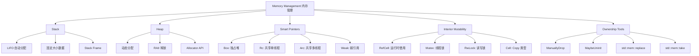
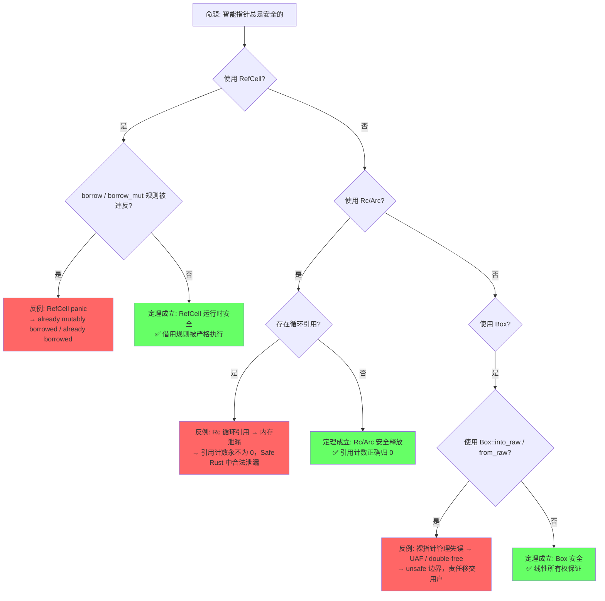
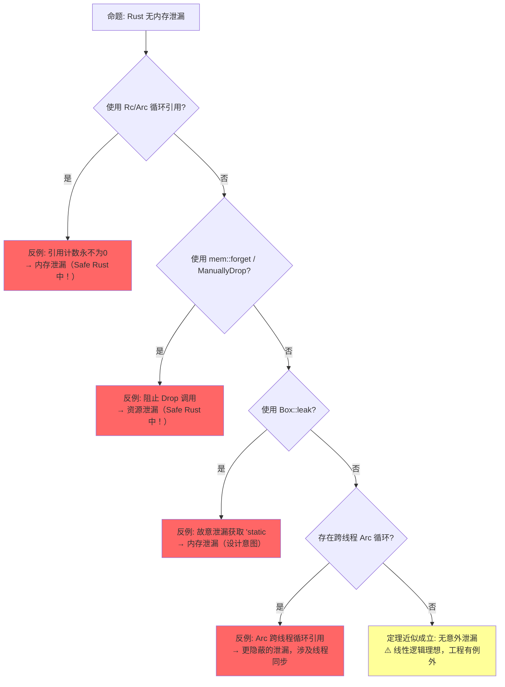
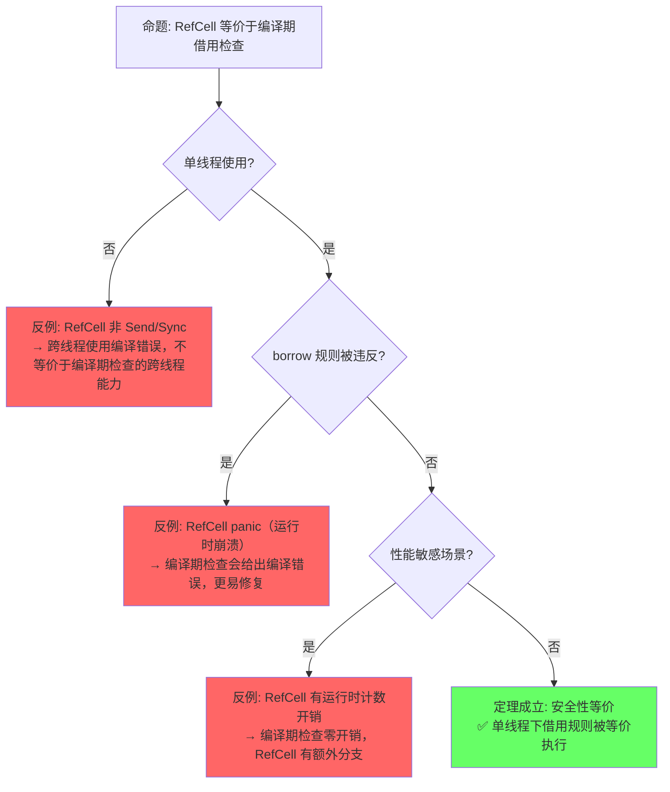
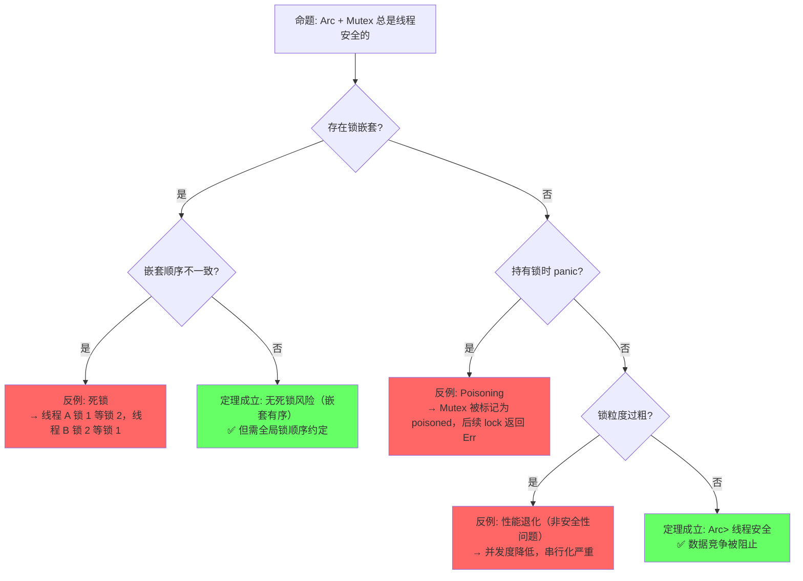

> **内容分级**: [综述级]
> **本节关键术语**: 内存管理 (Memory Management) · 堆 (Heap) · 栈 (Stack) · Drop · RAII · 内存布局 (Memory Layout) — [完整对照表](../../00_meta/01_terminology/terminology_glossary.md)
>
# Memory Management（内存管理）
>
> **EN**: Memory Management
> **Summary**: Memory Management. Rust's compile-time memory safety through ownership, borrowing, and lifetimes. Covers stack vs heap, RAII, smart pointers, and zero-cost abstractions.
> **受众**: [进阶]
> **权威来源**: 本文件为 `concept/` 权威页。
> **层级**: L2 进阶概念
> **A/S/P 标记**: **S+P** — Structure + Procedure
> **双维定位**: C×Eva — 评价不同指针类型的适用场景
> **前置概念**: [Ownership](../../01_foundation/01_ownership_borrow_lifetime/01_ownership.md) ·
> [Borrowing](../../01_foundation/01_ownership_borrow_lifetime/02_borrowing.md) ·
> [Type System](../../01_foundation/02_type_system/04_type_system.md)
> **后置概念**: [Unsafe Rust](../../03_advanced/02_unsafe/03_unsafe.md) ·
> [Concurrency](../../03_advanced/00_concurrency/01_concurrency.md) ·
> [Async](../../03_advanced/01_async/02_async.md)
> **主要来源**: [TRPL: Ch4.1-4.3](https://doc.rust-lang.org/book/ch04-01-what-is-ownership.html) · [Brown University — Concepts in Rust Programming](https://cel.cs.brown.edu/crp/) · [Brown Interactive Rust Book](https://rust-book.cs.brown.edu/) · [Itanium C++ ABI](https://itanium-cxx-abi.github.io/cxx-abi/abi.html)
> [TRPL: Ch15](https://doc.rust-lang.org/book/ch15-00-smart-pointers.html) ·
> [Rust Reference: Memory Model](https://doc.rust-lang.org/reference/introduction.html) ·
> [Wikipedia: Memory management](https://en.wikipedia.org/wiki/Memory_management)
> (Source: [TRPL — What is Ownership?](https://doc.rust-lang.org/book/ch04-01-what-is-ownership.html))

---

> ⚠️ **不稳定特性警告**: 本文件包含实验特性门（feature gate）标注的代码示例，需要**每日构建版工具链**编译。
>
> **使用方式**: 通过 `rustup` 安装每日构建版工具链后，以 `cargo +<每日构建版工具链> ...` 运行
> **状态查询**: Rust 实验特性手册（随每日构建版发布）
> **注意**: 不稳定特性可能在后续版本中变更或移除，生产代码应避免依赖。

---
> **Bloom 层级**: L2-L4
**变更日志**:

- v2.0 (2026-05-12): 深度重构——补充定理推理链（⟹ 标注）、反命题决策树系统、边界极限测试、6步认知路径与章节过渡
- v1.0 (2026-05-12): 初始版本

---

## 📑 目录

- [Memory Management（内存管理）](#memory-management内存管理)
  - [📑 目录](#-目录)
  - [一、权威定义（Definition）](#一权威定义definition)
    - [1.1 Wikipedia 对齐定义](#11-wikipedia-对齐定义)
    - [1.2 TRPL 官方定义](#12-trpl-官方定义)
    - [1.3 形式化定义](#13-形式化定义)
  - [二、概念属性矩阵（Attribute Matrix）](#二概念属性矩阵attribute-matrix)
    - [2.1 Stack vs Heap 对比矩阵](#21-stack-vs-heap-对比矩阵)
    - [2.2 智能指针对比矩阵](#22-智能指针对比矩阵)
    - [2.3 内部可变性模式矩阵](#23-内部可变性模式矩阵)
  - [三、思维导图（Mind Map）](#三思维导图mind-map)
  - [四、定理推理链（Theorem Chain）](#四定理推理链theorem-chain)
    - [4.1 引理：Box ⟹ 堆分配 + 唯一所有权](#41-引理box--堆分配--唯一所有权)
    - [4.2 定理：Rc/Arc ⟹ 共享所有权安全（引用计数）](#42-定理rcarc--共享所有权安全引用计数)
    - [4.3 推论：RefCell ⟹ 内部可变性运行时检查](#43-推论refcell--内部可变性运行时检查)
    - [4.4 RAII + 所有权 ⟹ 确定性释放](#44-raii--所有权--确定性释放)
    - [4.5 定理一致性矩阵](#45-定理一致性矩阵)
  - [五、示例与反例（Examples \& Counter-examples）](#五示例与反例examples--counter-examples)
    - [5.1 正确示例：Box 堆分配](#51-正确示例box-堆分配)
    - [5.2 正确示例：Rc 共享所有权](#52-正确示例rc-共享所有权)
    - [5.3 正确示例：用 Weak 打破循环引用](#53-正确示例用-weak-打破循环引用)
    - [5.4 反例：Rc 循环引用导致泄漏](#54-反例rc-循环引用导致泄漏)
    - [5.5 反例：RefCell 运行时借用冲突（panic）](#55-反例refcell-运行时借用冲突panic)
    - [5.5 补充：`Pin<&mut T>` 的堆内存语义与自引用安全](#55-补充pinmut-t-的堆内存语义与自引用安全)
      - [栈 Pin vs 堆 Pin](#栈-pin-vs-堆-pin)
      - [自引用结构的形式化保证](#自引用结构的形式化保证)
      - [形式化语义：location stability](#形式化语义location-stability)
    - [5.6 补充：`Vec<T>` / `String` / `HashMap` 的内存布局与扩容策略](#56-补充vect--string--hashmap-的内存布局与扩容策略)
      - [`Vec<T>`：连续内存与指数扩容](#vect连续内存与指数扩容)
      - [`String`：UTF-8 字节数组的特化](#stringutf-8-字节数组的特化)
      - [`HashMap<K, V>`：Robin Hood 哈希 + 开放寻址](#hashmapk-vrobin-hood-哈希--开放寻址)
  - [六、反命题与边界分析（Counter-proposition \& Boundary Analysis）](#六反命题与边界分析counter-proposition--boundary-analysis)
    - [6.1 反命题 1: "智能指针总是安全的"](#61-反命题-1-智能指针总是安全的)
    - [6.2 反命题 2: "Rust 无内存泄漏"](#62-反命题-2-rust-无内存泄漏)
    - [6.3 反命题 3: "RefCell 等价于编译期借用检查"](#63-反命题-3-refcell-等价于编译期借用检查)
    - [6.4 反命题 4: "Arc + Mutex 总是线程安全的"](#64-反命题-4-arc--mutex-总是线程安全的)
  - [七、边界极限测试代码（Boundary Limit Tests）](#七边界极限测试代码boundary-limit-tests)
    - [7.1 测试 1: Rc\<RefCell\> 循环引用极限](#71-测试-1-rcrefcell-循环引用极限)
    - [7.2 测试 2: RefCell 嵌套借用边界](#72-测试-2-refcell-嵌套借用边界)
    - [7.3 测试 3: Box::leak 与 ManuallyDrop 边界](#73-测试-3-boxleak-与-manuallydrop-边界)
    - [7.4 测试 4: Arc 跨线程原子序边界](#74-测试-4-arc-跨线程原子序边界)
  - [八、认知路径（Cognitive Path）](#八认知路径cognitive-path)
    - [Step 1: 直觉类比 — "内存像房产"](#step-1-直觉类比--内存像房产)
    - [Step 2: 语法熟悉 — 堆分配与智能指针](#step-2-语法熟悉--堆分配与智能指针)
    - [Step 3: 规则困惑 — 借用检查与内部可变性](#step-3-规则困惑--借用检查与内部可变性)
    - [Step 4: 并发扩展 — Arc 与线程安全](#step-4-并发扩展--arc-与线程安全)
    - [Step 5: 边界认知 — 泄漏、循环与 unsafe 边界](#step-5-边界认知--泄漏循环与-unsafe-边界)
    - [Step 6: 形式化掌控 — 线性逻辑与设计验证](#step-6-形式化掌控--线性逻辑与设计验证)
  - [九、知识来源关系（Provenance）](#九知识来源关系provenance)
  - [判定表：内存管理策略判定](#判定表内存管理策略判定)
  - [十、相关概念链接](#十相关概念链接)
    - [补充章节：`MaybeUninit<T>` 的内存安全边界](#补充章节maybeuninitt-的内存安全边界)
      - [用途：未初始化内存的安全抽象](#用途未初始化内存的安全抽象)
      - [与 `mem::uninitialized` 的区别](#与-memuninitialized-的区别)
      - [`assume_init` 的安全契约](#assume_init-的安全契约)
      - [数组初始化示例](#数组初始化示例)
    - [5.7 补充：自定义 Allocator（`#[global_allocator]`）](#57-补充自定义-allocatorglobal_allocator)
      - [替换全局分配器](#替换全局分配器)
      - [`Allocator` trait（每日构建版，实验性）](#allocator-trait每日构建版实验性)
    - [5.8 补充：`ManuallyDrop<T>` 与 `mem::forget` 的形式化分析](#58-补充manuallydropt-与-memforget-的形式化分析)
      - [形式化对比：`mem::forget` vs `ManuallyDrop`](#形式化对比memforget-vs-manuallydrop)
      - [`mem::forget` 的安全用例：FFI 边界](#memforget-的安全用例ffi-边界)
    - [5.9 `Vec<T>` / `String` / `HashMap` 的内存布局与扩容策略](#59-vect--string--hashmap-的内存布局与扩容策略)
      - [`Vec<T>` 的内存布局与扩容](#vect-的内存布局与扩容)
      - [`String` 的 UTF-8 不变性与内存布局](#string-的-utf-8-不变性与内存布局)
      - [`HashMap<K, V>` 的 SwissTable 算法](#hashmapk-v-的-swisstable-算法)
    - [5.10 `std::alloc::System` vs `jemalloc` vs `mimalloc` 对比](#510-stdallocsystem-vs-jemalloc-vs-mimalloc-对比)
  - [十一、补充章节：Field Projections（Beyond the `&` 旗舰主题）](#十一补充章节field-projectionsbeyond-the--旗舰主题)
    - [11.1 问题定义：智能指针的"最后一公里"](#111-问题定义智能指针的最后一公里)
    - [11.2 Pin 投影：当前最成熟的 Field Projection](#112-pin-投影当前最成熟的-field-projection)
    - [11.3 Field Projections 提案设计](#113-field-projections-提案设计)
    - [11.4 形式化语义：Projection 作为类型构造子](#114-形式化语义projection-作为类型构造子)
    - [11.5 与 In-place Initialization 的协同](#115-与-in-place-initialization-的协同)
    - [11.6 演进路线与跟踪](#116-演进路线与跟踪)
  - [十二、待补充与演进方向（TODOs）](#十二待补充与演进方向todos)
    - [12.1 自定义 Allocator（`#[global_allocator]`）](#121-自定义-allocatorglobal_allocator)
    - [12.2 `ManuallyDrop<T>` 与 `mem::forget` 的形式化分析](#122-manuallydropt-与-memforget-的形式化分析)
    - [12.3 `Vec<T>` / `String` / `HashMap` 的内存布局与扩容策略](#123-vect--string--hashmap-的内存布局与扩容策略)
    - [12.4 `std::alloc::System` vs `jemalloc` vs `mimalloc`](#124-stdallocsystem-vs-jemalloc-vs-mimalloc)
    - [12.5 `MaybeUninit<T>` 与 `MaybeDangling` 的边界分析](#125-maybeuninitt-与-maybedangling-的边界分析)
    - [12.6 `Pin<Box<T>>` 与自引用结构的形式化语义](#126-pinboxt-与自引用结构的形式化语义)
    - [12.7 Field Projections（Pin 投影与 In-place Initialization）](#127-field-projectionspin-投影与-in-place-initialization)
  - [Wikipedia 概念对齐](#wikipedia-概念对齐)
  - [逆向推理链（Backward Reasoning）](#逆向推理链backward-reasoning)
  - [权威来源索引](#权威来源索引)
  - [十三、边界测试：内存管理的编译错误](#十三边界测试内存管理的编译错误)
    - [13.1 边界测试：Box::into\_raw 后双重释放（运行时 UB）](#131-边界测试boxinto_raw-后双重释放运行时-ub)
    - [13.2 边界测试：Vec 索引越界（编译错误 vs 运行时 panic）](#132-边界测试vec-索引越界编译错误-vs-运行时-panic)
    - [13.3 边界测试：Pin 误用（编译错误）](#133-边界测试pin-误用编译错误)
    - [3.4 边界测试：`ManuallyDrop` 后重复访问（运行时 UB）](#34-边界测试manuallydrop-后重复访问运行时-ub)
    - [3.5 边界测试：对齐要求不满足的 `alloc::alloc`（运行时 UB）](#35-边界测试对齐要求不满足的-allocalloc运行时-ub)
    - [10.3 边界测试：`Box::leak` 的永久泄漏（逻辑错误）](#103-边界测试boxleak-的永久泄漏逻辑错误)
    - [10.4 边界测试：`Rc<RefCell<T>>` 的循环引用（运行时 panic/内存泄漏）](#104-边界测试rcrefcellt-的循环引用运行时-panic内存泄漏)
    - [10.3 边界测试：`Box::into_raw` 后双重释放（运行时 UB）](#103-边界测试boxinto_raw-后双重释放运行时-ub)
    - [10.4 边界测试：Box::leak 后的可变借用与原始 Box 的关系（编译错误）](#104-边界测试boxleak-后的可变借用与原始-box-的关系编译错误)
    - [10.3 边界测试：返回局部变量的悬垂引用](#103-边界测试返回局部变量的悬垂引用)
  - [嵌入式测验（Embedded Quiz）](#嵌入式测验embedded-quiz)
    - [测验 1：Stack vs Heap（理解层）](#测验-1stack-vs-heap理解层)
    - [测验 2：Drop 与 RAII（应用层）](#测验-2drop-与-raii应用层)
    - [测验 3：Box 与递归类型（应用层）](#测验-3box-与递归类型应用层)
    - [测验 4：内存布局对齐（分析层）](#测验-4内存布局对齐分析层)
    - [测验 5：内存泄漏与 `Rc` 循环（分析层）](#测验-5内存泄漏与-rc-循环分析层)
  - [实践](#实践)
  - [参考来源](#参考来源)
  - [`ManuallyDrop` 模式匹配（Rust 1.96）](#manuallydrop-模式匹配rust-196)

> [来源: [Rust Reference](https://doc.rust-lang.org/reference/introduction.html)]
> [来源: [The Rust Programming Language — Ch15](https://doc.rust-lang.org/book/ch15-00-smart-pointers.html)]
> [来源: [Rustonomicon](https://doc.rust-lang.org/nomicon/index.html)]
> [来源: [Wikipedia — Memory Management](https://en.wikipedia.org/wiki/Memory_management)]
> [来源: [Wikipedia — Smart Pointer](https://en.wikipedia.org/wiki/Smart_pointer)]
> [来源: [Wikipedia — Reference Counting](https://en.wikipedia.org/wiki/Reference_counting)]
> [来源: [RFC 1857 — Non-Lexical Lifetimes](https://rust-lang.github.io/rfcs//1857-stabilize-drop-order.html)]
> [来源: [RFC 2094 — NLL](https://rust-lang.github.io/rfcs//2094-nll.html)])

## 一、权威定义（Definition）

### 1.1 Wikipedia 对齐定义
>
> **[Wikipedia: Memory management](https://en.wikipedia.org/wiki/Memory_management)** Memory management is a form of resource management applied to computer memory. The essential requirement of memory management is to provide ways to dynamically allocate portions of memory to programs at their request, and free it for reuse when no longer needed.
> **[Wikipedia: Rust](https://en.wikipedia.org/wiki/Rust)** Rust achieves memory safety without garbage collection by using an ownership model, where each value has a unique owner, and the value is dropped when the owner goes out of scope. Values can be immutably borrowed by any number of references or mutably borrowed by exactly one reference at a time.

### 1.2 TRPL 官方定义
>
> **[TRPL Ch4.1](https://doc.rust-lang.org/book/ch04-01-what-is-ownership.html)** The stack stores values in the order it gets them and removes the values in the opposite order. This is referred to as last in, first out. The heap is less organized: when you put data on the heap, you request a certain amount of space. The memory allocator finds an empty spot in the heap that is big enough, marks it as being in use, and returns a pointer.
> **[TRPL Ch15](https://doc.rust-lang.org/book/ch15-00-smart-pointers.html)** A smart pointer is a data structure that acts like a pointer but also has additional metadata and capabilities. The concept of smart pointers isn't unique to Rust: smart pointers originated in C++ and exist in other languages as well. In Rust, smart pointers own the data they point to.
> **[Wikipedia: Smart pointer](https://en.wikipedia.org/wiki/Smart_pointer)** `Box<T>` provides the simplest form of heap-allocated smart pointer with unique ownership, analogous to `std::unique_ptr` in C++. ✅ 已验证
> (Source: [TRPL — Smart Pointers](https://doc.rust-lang.org/book/ch15-00-smart-pointers.html))

### 1.3 形式化定义
>
> **[Rustonomicon: Ownership](https://doc.rust-lang.org/nomicon/ownership.html) · [线性逻辑]** Rust 内存模型形式化为栈帧自动管理 + 堆分配显式所有权（Ownership）的组合。 ✅ 已验证
> (Source: [Rustonomicon — Ownership](https://doc.rust-lang.org/nomicon/ownership.html))

Rust 的内存模型可以形式化为**栈帧自动管理 + 堆分配显式所有权**的组合：

```text
栈语义（操作语义简化）:
  进入作用域:  stack.push(Frame { vars: {} })
  变量声明:    frame.vars[name] = Value::Uninitialized
  赋值:        frame.vars[name] = value
  离开作用域:  for v in frame.vars.values() { drop(v) }; stack.pop()

堆语义:
  let p = Box::new(x)  →  heap.alloc(size_of(x)).write(x); Own(p)
  drop(Box)            →  heap.dealloc(p); Own(p) 消耗
```

> **过渡到属性矩阵**: 从形式化定义出发，内存管理不仅是"堆 vs 栈"的二元区分，而是由多种所有权模型（独占、共享、弱引用（Reference））和可变性模式（编译期检查、运行时（Runtime）检查、原子操作（Atomic Operations））构成的多维空间。下一节通过属性矩阵对这些机制进行系统分类。

---

## 二、概念属性矩阵（Attribute Matrix）
>
>

### 2.1 Stack vs Heap 对比矩阵
>

| **维度** | **Stack** | **Heap** |
|:---|:---|:---|
| **分配时机** | 编译期确定 | 运行时动态请求 |
| **分配速度** | 极快（指针移动） | 较慢（分配器查找） |
| **布局** | 连续、LIFO | 可能碎片化 |
| **大小限制** | 通常较小（~8MB 默认） | 受系统内存限制 |
| **生命周期（Lifetimes）** | 与作用域绑定（自动） | 与所有者绑定（手动/RAII） |
| **访问模式** | CPU 缓存友好 | 可能缓存不友好（碎片化） |
| **典型类型** | 标量、元组、数组、引用（Reference） | `Box<T>`、`Vec<T>`、`String` |
| **溢出后果** | Stack overflow（panic/segfault） | OOM（panic） |

### 2.2 智能指针对比矩阵
>
> **[TRPL Ch15](https://doc.rust-lang.org/book/ch15-00-smart-pointers.html)** The following smart pointer comparison matrix summarizes ownership, mutability, and thread-safety trade-offs covered in TRPL Chapter 15. ✅ 已验证

| **智能指针（Smart Pointer）** | **所有权模型** | **可变性** | **线程安全** | **典型用途** |
|:---|:---|:---|:---|:---|
| `Box<T>` | 独占 | 通过 `&mut` / `T` 内部可变 | 若 `T: Send` | 堆分配、递归类型、trait object |
| `Rc<T>` | 共享引用计数 | 不可变（需 `RefCell`） | ❌ 非 Send | 单线程共享所有权 |
| `Arc<T>` | 共享原子计数 | 不可变（需 `Mutex`/`RwLock`） | 若 `T: Send+Sync` | 多线程共享所有权 |
| `RefCell<T>` | 运行时借用（Borrowing）检查 | 内部可变性 | 若 `T: Send`，❌ !Sync | 单线程内部可变 |
| `Mutex<T>` | 锁保护 | 内部可变性 | ✅ Send | 多线程互斥访问 |
| `RwLock<T>` | 读写锁 | 内部可变性 | ✅ Send | 多读单写 |
| `Weak<T>` | 弱引用（不增加计数） | 不可变 | 视 `Rc`/`Arc` | 打破循环引用 |

### 2.3 内部可变性模式矩阵
>
> **[TRPL Ch15](https://doc.rust-lang.org/book/ch15-00-smart-pointers.html) · [std docs: Cell/RefCell/Mutex/RwLock]** 内部可变性模式将编译期借用检查移至运行时或硬件层，是所有权系统的重要扩展。 ✅

| **组合** | **线程安全** | **运行时检查** | **使用场景** |
|:---|:---|:---|:---|
| `RefCell<T>` | 单线程 | 运行时借用检查（panic） | 单线程内部可变 |
| `Mutex<T>` | 多线程 | 互斥锁（阻塞/死锁风险） | 多线程互斥修改 |
| `RwLock<T>` | 多线程 | 读写锁 | 多读少写场景 |
| `AtomicT` | 多线程 | 硬件原子操作（Atomic Operations） | 简单计数器、标志 |
| `Cell<T>` | 单线程 | 无（仅 `Copy` 类型） | 单线程简单内部可变 |

> **过渡到思维导图**: 属性矩阵展示了内存管理机制的静态分类，但未能表达概念间的动态关联与使用场景。思维导图通过拓扑结构揭示内存管理从栈/堆分配、所有权传递到智能指针（Smart Pointer）组合的完整概念网络。

---

## 三、思维导图（Mind Map）



> **认知功能**: 概念拓扑图——将内存管理的多维机制（所有权模型 × 可变性模式）可视化为层次化概念网络。读者应将其作为"认知地图"，在面临具体设计问题时快速定位所需机制（如"需要共享+可变"→ `Rc<RefCell<T>>`）。关键洞察：Stack/Heap 只是起点，真正的设计决策发生在智能指针与内部可变性的交叉组合空间。[💡 原创分析](../../00_meta/00_framework/methodology.md)
> [来源: [TRPL — Memory Management](https://doc.rust-lang.org/book/ch04-00-understanding-ownership.html)]
> **过渡到定理推理链**: 思维导图呈现了内存管理的概念拓扑，但缺乏严格的逻辑推导关系。下一节通过"⟹"标注的定理链，将 Box 所有权（Ownership）、Rc/Arc 共享安全、RefCell 运行时检查等核心命题形式化为可验证的推理网络。

---

## 四、定理推理链（Theorem Chain）

### 4.1 引理：Box<T> ⟹ 堆分配 + 唯一所有权
>
> **[TRPL Ch15](https://doc.rust-lang.org/book/ch15-00-smart-pointers.html) · [Rust Reference: Box](https://doc.rust-lang.org/reference/introduction.html)** Box<T> 的语义是堆分配与唯一所有权的组合，对应线性逻辑中的资源唯一拥有。 ✅ 已验证

```text
前提 1: Box::new(x) 在堆上分配 size_of::<T>() 字节并写入 x
前提 2: Box<T> 实现 Deref/DerefMut，但保持唯一所有权
前提 3: Box<T> 离开作用域时调用 Drop，释放堆内存
    ↓
引理: Box<T> ⟹ 堆分配 + 唯一所有权
    ↓
定理: 通过 Box<T> 访问的堆内存不会出现 use-after-free 或 double-free
    ↓
推论: Box::leak 故意放弃所有权获取 &'static T，是定理的合法例外
边界: Box::into_raw / from_raw 将所有权管理移交给用户（unsafe 边界）
```

### 4.2 定理：Rc/Arc ⟹ 共享所有权安全（引用计数）
>
> **[TRPL Ch15](https://doc.rust-lang.org/book/ch15-00-smart-pointers.html) · [std docs: Rc/Arc]** Rc（单线程）和 Arc（多线程）通过引用计数实现共享所有权的安全释放。 ✅ 已验证
> **[Wikipedia: Reference counting](https://en.wikipedia.org/wiki/Reference_counting)** Reference counting enables multiple owners of heap-allocated data; `Arc` extends this with atomic operations for thread-safe concurrent access. ✅ 已验证

```text
前提 1: Rc::new 创建时强引用计数 = 1
前提 2: Rc::clone 增加引用计数（不复制数据）
前提 3: Rc 离开作用域时减少引用计数，若归零则释放堆内存
前提 4: Arc 使用原子操作保证多线程安全（内存序: Relaxed/Release-Acquire）
    ↓
定理: Rc/Arc ⟹ 共享所有权安全（引用计数）
    ↓
推论 1: Rc 单线程共享无需锁，Arc 多线程共享通过原子计数
推论 2: 循环引用导致引用计数永不为零 → 内存泄漏（Safe Rust 的已知边界）
边界: Weak 引用不增加强引用计数，是打破循环引用的标准解
```

### 4.3 推论：RefCell ⟹ 内部可变性运行时检查

> **[TRPL Ch15](https://doc.rust-lang.org/book/ch15-00-smart-pointers.html) · [std docs: RefCell]** RefCell 在单线程运行时检查借用规则，提供与编译期检查等价的安全性。 ✅ 已验证
> **[Rust Reference: Interior mutability](https://doc.rust-lang.org/reference/interior-mutability.html)** `RefCell<T>` implements the interior mutability pattern by deferring borrow checking to runtime, allowing mutation through shared references in single-threaded contexts. ✅ 已验证

```text
前提 1: RefCell<T> 在运行时维护 borrow/borrow_mut 状态机
前提 2: borrow() 检查当前无可变借用；borrow_mut() 检查当前无任何借用
前提 3: 违反规则时立即 panic（而非编译错误）
    ↓
引理: RefCell 的运行时检查与编译期借用检查逻辑等价
    ↓
推论: RefCell ⟹ 内部可变性运行时检查
    ↓
边界 1: 跨线程使用 RefCell 是 unsafe（未实现 Send/Sync）
边界 2: panic 是不可恢复的运行时错误（对比编译期错误的可修复性）
边界 3: RefCell + Rc 组合是循环引用的经典陷阱场景
```

### 4.4 RAII + 所有权 ⟹ 确定性释放

> **[TRPL Ch4.1](https://doc.rust-lang.org/book/ch04-01-what-is-ownership.html) · [TRPL Ch15](https://doc.rust-lang.org/book/ch15-00-smart-pointers.html) · [Rust Reference: Drop](https://doc.rust-lang.org/reference/special-types-and-traits.html#drop)** RAII 确定性释放由所有权规则和 Drop trait 自动调用保证。 ✅ 已验证

```text
前提 1: 每个堆分配值由唯一所有者管理（Box）或引用计数管理（Rc/Arc）
前提 2: 所有者离开作用域时自动调用 Drop
前提 3: Rc/Arc 的 Drop 在计数归零时释放内存
    ↓
定理: Rust 堆内存的释放时机是确定性的（无 GC 停顿）
    ↓
推论: 适用于实时系统、嵌入式、游戏引擎等延迟敏感场景
例外: 循环引用导致的泄漏（Rc 限制）、panic 时的资源清理（通常仍安全）
```

### 4.5 定理一致性矩阵

> **[原创分析] · [std docs] · [Rustonomicon](https://doc.rust-lang.org/nomicon/index.html)** 运行时内存管理定理基于 std 文档和 Rustonomicon 的运行时语义。 💡 原创分析

| **定理/引理/推论** | **前提** | **结论** | **依赖的 L4 公理** | **被哪些定理依赖** | **失效条件** | **典型场景** |
|:---|:---|:---|:---|:---|:---|:---|
| **引理**: Box ⟹ 堆分配 + 唯一所有权 | 单线程 | 堆内存安全（Memory Safety）释放 | 线性逻辑 ⊗ | 所有堆分配场景 | `Box::leak`、`mem::forget` | — |
| **定理**: Rc 共享安全 | 单线程 | 共享所有权无 UAF | 引用计数不变式 | 图结构、共享状态 | 循环引用 | 内存泄漏 |
| **定理**: Arc 跨线程共享 | 多线程 | 原子引用计数安全 | 原子操作（Atomic Operations）语义 | 并发共享状态 | 循环引用 + 跨线程 | 内存泄漏 |
| **推论**: RefCell 运行时借用 | 单线程 | 运行时检测借用违规 | —（运行时机制） | 内部可变性模式 | 已借出时再次借用 | panic |
| **引理**: Cell 无检查可变 | 单线程 + T: Copy | 无运行时检查的内部可变 | Copy 语义 | 简单计数器 | 非 Copy 类型 | 编译错误 |
| **定理**: Mutex 互斥安全 | 多线程 | 互斥访问无数据竞争 | 锁不变式 | 并发修改 | 死锁、 poisoning | 阻塞/panic |
| **推论**: Weak 打破循环 | Rc/Arc 存在 | 不阻止强引用释放 | 引用计数不变式 | 树/图结构 | upgrade 返回 None | 安全解引用 |
| **引理**: Pin 不动性 | `!Unpin` 类型 | 内存地址恒定 | —（部分形式化） | 自引用结构、async | 实现 `Unpin` 错误 | UB |

> **一致性（Coherence）检查**: Box（独占）⟹ Rc（单线程共享）⟹ Arc（多线程共享）⟹ RefCell（内部可变），形成**从严格到宽松**的能力递进链。Pin 是独立维度（位置稳定性），Weak 是共享所有权的补充（不拥有）。
> **关键洞察**: Rc/Arc/RefCell 的定理**不在 L4 形式化范围内**（运行时机制），是工程折衷而非编译期证明。Box 的所有权可由线性逻辑完全编码。
> **跨层映射**: 本文件定理 ↔ [`00_meta/inter_layer_map.md`](../../00_meta/04_navigation/inter_layer_map.md) §4.1 "内存安全（Memory Safety）完备性"
> **过渡到示例与反例**: 定理链提供了形式化与工程保证，但实践中这些保证的边界在哪里？下一节通过正例展示智能指针的正确使用方式，通过反例揭示定理失效的精确条件——特别是 Rc 循环引用、RefCell panic、内存泄漏等边界场景。

---

## 五、示例与反例（Examples & Counter-examples）

### 5.1 正确示例：Box 堆分配

```rust
// ✅ 正确: Box 提供堆分配 + 自动释放
fn main() {
    let b = Box::new(5);  // 5 被分配到堆上
    println!("{}", b);     // 解引用访问
} // b 在这里离开作用域，堆内存自动释放（drop）
```

### 5.2 正确示例：Rc 共享所有权

```rust
// ✅ 正确: Rc 实现单线程共享所有权
use std::rc::Rc;

fn main() {
    let data = Rc::new(String::from("shared"));
    let data2 = Rc::clone(&data);  // 引用计数 +1
    let data3 = Rc::clone(&data);  // 引用计数 +1

    println!("count = {}", Rc::strong_count(&data));  // 3
    println!("{}, {}, {}", data, data2, data3);
} // 三个 Rc 依次 drop，最后一个释放堆内存
```

### 5.3 正确示例：用 Weak 打破循环引用

```rust
// ✅ 正确: Weak 引用不增加计数，打破循环
use std::rc::{Rc, Weak};
use std::cell::RefCell;

struct Node {
    value: i32,
    parent: RefCell<Weak<Node>>,     // Weak: 不拥有子节点
    children: RefCell<Vec<Rc<Node>>>, // Rc: 拥有子节点
}

fn main() {
    let leaf = Rc::new(Node {
        value: 3,
        parent: RefCell::new(Weak::new()),
        children: RefCell::new(vec![]),
    });

    let branch = Rc::new(Node {
        value: 5,
        parent: RefCell::new(Weak::new()),
        children: RefCell::new(vec![Rc::clone(&leaf)]),
    });

    *leaf.parent.borrow_mut() = Rc::downgrade(&branch);
    // leaf ↔ branch 的循环被 Weak 打破
} // 正常释放，无泄漏
```

### 5.4 反例：Rc 循环引用导致泄漏

```rust
// ❌ 反例: Rc 循环引用导致内存泄漏
use std::rc::Rc;
use std::cell::RefCell;

struct BadNode {
    value: i32,
    next: RefCell<Option<Rc<BadNode>>>,
}

fn main() {
    let a = Rc::new(BadNode { value: 1, next: RefCell::new(None) });
    let b = Rc::new(BadNode { value: 2, next: RefCell::new(None) });

    *a.next.borrow_mut() = Some(Rc::clone(&b));
    *b.next.borrow_mut() = Some(Rc::clone(&a));

    // a 的计数 = 2（a 变量 + b.next）
    // b 的计数 = 2（b 变量 + a.next）
    // 离开作用域后: a 变量 drop → a 计数 = 1（不释放）
    //              b 变量 drop → b 计数 = 1（不释放）
    // 结果: 内存泄漏！（Rust 中 leaks 不被视为 unsafe）
}
```

### 5.5 反例：RefCell 运行时借用冲突（panic）

```rust
// ❌ 反例: RefCell 运行时 panic
use std::cell::RefCell;

fn main() {
    let c = RefCell::new(String::from("hello"));
    let _borrow = c.borrow_mut();   // 可变借用
    let _borrow2 = c.borrow();      // already mutably borrowed
    // thread 'main' panicked at 'already mutably borrowed: BorrowError'
}
```

**修正方案**：

```rust
// ✅ 修正: 确保借用不重叠（编译期或运行时）
use std::cell::RefCell;

fn main() {
    let c = RefCell::new(String::from("hello"));
    {
        let mut borrow = c.borrow_mut();
        borrow.push_str(" world");
    } // 可变借用在这里结束
    let borrow2 = c.borrow();  // ✅ 现在可以不可变借用
    println!("{}", borrow2);
}
```

> **过渡到反命题分析**: 示例展示了内存管理的正确使用方式，但反例只是孤立场景。下一节通过系统化的反命题分析，将"智能指针安全定理何时成立/何时失效"形式化为可遍历的决策树，覆盖编译期、运行时（Runtime）、语义、工程四个层面。

---

### 5.5 补充：`Pin<&mut T>` 的堆内存语义与自引用安全

> **[Rust Reference: Pin](https://doc.rust-lang.org/std/pin/index.html)** · **[RFC 2349](https://rust-lang.github.io/rfcs//2349-pin.html)** `Pin<P>` 是对指针类型 `P` 的包装，提供**地址不变性（address stability）**保证：当 `T: !Unpin` 时，`Pin<P<T>>` 确保 `T` 的内存地址不会被移动。这是自引用结构（self-referential structs）在 Safe Rust 中安全表达的关键。✅ 已验证

#### 栈 Pin vs 堆 Pin

```rust
use std::pin::Pin;

// ❌ 栈 Pin：生命周期受限，地址保证仅在当前作用域有效
let mut data = String::from("hello");
let pin = Pin::new(&mut data);  // Pin<&mut String>
// data 离开作用域后，pin 的地址保证自动失效

// ✅ 堆 Pin：'static 或长期地址保证
let pin: Pin<Box<String>> = Box::pin(String::from("hello"));
// String 在堆上分配，Pin 保证其地址不变，直到 Box 被 drop
```

> **[Rust Reference: Pin](https://doc.rust-lang.org/std/pin/struct.Pin.html) · [RFC 2349](https://rust-lang.github.io/rfcs/2349-pin.html)** 栈 `Pin<&mut T>` 的生命周期（Lifetimes）受借用约束，堆 `Pin<Box<T>>` 通过 `Box::pin` 获得长期地址稳定性。 ✅

| 维度 | 栈 `Pin<&mut T>` | 堆 `Pin<Box<T>>` |
|:---|:---|:---|
| **地址保证范围** | 当前借用生命周期（Lifetimes） `'a` | `Box` 存活期间（可 `'static`） |
| **适用场景** | 临时自引用（async 状态机内部） | 长期自引用（链表节点、协程句柄） |
| **构造方式** | `Pin::new(&mut T)` 或 `pin!()` 宏（Macro） | `Box::pin(T)` |
| **移动风险** | 底层数据仍在栈上，但 `Pin` 禁止通过 safe API 移动 | 堆分配本身可移动指针，但 `Pin` 禁止解包移动内部 `T` |
| **与 async 关系** | `poll(self: Pin<&mut Self>)` 的调用参数 | `Future` 对象通常存于 `Pin<Box<dyn Future>>` |

#### 自引用结构的形式化保证

```rust,ignore
use std::pin::Pin;
use std::marker::PhantomPinned;

struct SelfReferential {
    data: String,
    ptr: *const String,  // 指向 self.data
    _pin: PhantomPinned, // 标记为 !Unpin，禁止自动移动
}

impl SelfReferential {
    fn new(data: String) -> Pin<Box<Self>> {
        let mut boxed = Box::new(SelfReferential {
            data,
            ptr: std::ptr::null(),
            _pin: PhantomPinned,
        });
        // 修正 ptr 指向 data
        let ptr = &boxed.data as *const String;
        boxed.ptr = ptr;
        // Pin 到堆上，保证地址不变
        let pinned = Pin::new(boxed); // 实际应为 unsafe Pin::new_unchecked
        pinned
    }
}
```

> **⚠️ 安全契约**: `Pin::new_unchecked` 要求调用者保证：1) `T` 确实不会被移动；2) `T` 的地址稳定性由外部机制（如堆分配）维护。违反契约会导致自引用指针悬垂（UB）。

#### 形式化语义：location stability

```text
定理（Pin 地址不变性）:
  前提: Pin<P<T>> 已构造，且 T: !Unpin
  前提: P 是指针类型（&mut T / Box<T> / Rc<T> 等）
    ↓
  结论: Safe API 无法从 Pin 中提取 &mut T 并移动 T 的值
    ↓
  ⟹ 自引用字段（如 ptr: *const String）始终指向有效地址
```

> **来源: [RFC 2349](https://rust-lang.github.io/rfcs/2349-pin.html)** `PhantomPinned` 是一个零大小类型，仅用于将包含它的类型标记为 `!Unpin`。这不是运行时标记，而是类型系统（Type System）标记——编译器在 trait 自动推导时将 `PhantomPinned` 视为"不可安全移动"的信号。✅
> **[PLDI 2024 · RefinedRust](https://arxiv.org/abs/2404.03613)** Pin 的形式化语义对应于分离逻辑中的 "location stability"：地址一旦被分配，就在该对象的整个生命周期（Lifetimes）内保持不变。这与 Rust 的 `&mut T` 可移动形成对比——`Pin` 通过类型系统（Type System）剥夺了 `&mut T` 的移动能力。

---

### 5.6 补充：`Vec<T>` / `String` / `HashMap` 的内存布局与扩容策略

> **[Rust Reference: Vec](https://doc.rust-lang.org/std/vec/struct.Vec.html)** · **[Rust Reference: String](https://doc.rust-lang.org/std/string/struct.String.html)** · **[std::collections::HashMap]** · **[Wikipedia: Dynamic array](https://en.wikipedia.org/wiki/Dynamic_array)** 理解标准库容器的内存布局是系统编程的核心能力。Rust 的标准库容器在设计上追求**缓存友好**与**摊还 O(1) 性能**的平衡。✅

#### `Vec<T>`：连续内存与指数扩容

```rust
use std::mem;

// ✅ Vec 内存布局（简化）
struct Vec<T> {
    ptr: *mut T,      // 指向堆分配数组的指针
    len: usize,       // 当前元素数量
    capacity: usize,  // 已分配容量（可存放元素数）
}

// 64 位系统下 Vec<i32> 的元数据大小 = 24 字节
assert_eq!(mem::size_of::<Vec<i32>>(), 24);
```

| 操作 | 时间复杂度 | 触发条件 | 内存行为 |
|:---|:---|:---|:---|
| `push` | 摊还 O(1) | `len < capacity` | 在末尾写入，len += 1 |
| `push`（扩容）| O(n) | `len == capacity` | 分配 2×capacity 新内存，move 所有元素，释放旧内存 |
| `pop` | O(1) | `len > 0` | len -= 1，不立即释放内存 |
| `shrink_to_fit` | O(n) | 显式调用 | 重新分配到 `len == capacity` 的精确大小 |

**扩容因子**: Rust `Vec` 的扩容因子约为 **1.5–2×**（具体实现依赖分配器策略）。这保证了连续 `push` 的摊还时间复杂度为 O(1)：

```text
总复制次数 = n + n/2 + n/4 + ... ≈ 2n
摊还每次 push 成本 = O(2n)/n = O(1)
```

> **[Wikipedia: Dynamic array](https://en.wikipedia.org/wiki/Dynamic_array) · [Rust Reference: Vec](https://doc.rust-lang.org/std/vec/struct.Vec.html)** 动态数组的指数扩容策略是均摊 O(1) 的标准实现，扩容因子通常在 1.5–2× 之间。 ✅

#### `String`：UTF-8 字节数组的特化

> **[Rust Reference: String](https://doc.rust-lang.org/std/string/struct.String.html)** `String` 是 `Vec<u8>` 的包装，保证内部字节始终为合法 UTF-8。 ✅

```rust,ignore
// ✅ String 本质上是 Vec<u8> 的包装，附加 UTF-8 有效性不变式
struct String {
    vec: Vec<u8>,  // 内部就是 Vec<u8>
}

assert_eq!(mem::size_of::<String>(), 24);  // 同 Vec<u8>
```

| 特性 | String | Vec<u8> |
|:---|:---|:---|
| 内存布局 | 同 Vec<u8> | 连续字节数组 |
| 有效性约束 | 必须是合法 UTF-8 | 任意字节 |
| `push` | 追加一个 UTF-8 字符（1-4 字节） | 追加单个字节 |
| `capacity` | 按字节计 | 按字节计 |

> **关键洞察**: `String` 不是"字符数组"，而是**合法 UTF-8 字节序列**。`String::len()` 返回字节数而非字符数，因为 Unicode 标量值（Unicode scalar value）的长度可变（1-4 字节）。这与 Java/C# 的 `String`（UTF-16）形成对比。

#### `HashMap<K, V>`：Robin Hood 哈希 + 开放寻址

> **[Wikipedia: Hash table](https://en.wikipedia.org/wiki/Hash_table) · [std docs: HashMap]** Rust `HashMap` 采用 Robin Hood 哈希 + 线性探测，将探测距离的方差控制在较低水平。 ✅

```rust,ignore
// ✅ HashMap 内存布局（Rust std，2024 实现）
struct HashMap<K, V> {
    base: RawTable<(K, V)>,  // 底层表：控制字节 + 键值对数组
    hash_builder: DefaultHashBuilder,
}
```

| 特性 | Rust HashMap | C++ `std::unordered_map` |
|:---|:---|:---|
| **冲突解决** | Robin Hood 哈希 + 线性探测 | 链地址法（bucket + 链表） |
| **内存布局** | 单一连续数组（控制字节 + 键值对） | 离散节点分配 |
| **缓存友好性** | 高（数据局部性好） | 低（指针跳转） |
| **扩容触发** | 负载因子 > 0.875 | 负载因子 > 1.0（通常） |
| **默认 hasher** | SipHash 1-3（抗 HashDoS） | 通常不抗 HashDoS |

**Robin Hood 哈希**: 当插入时发现已有元素离其"理想位置"更近（probe distance 更短），则**交换**两者位置。这使得所有元素的 probe distance 保持较小且方差低，查询性能稳定。

> **来源**: [Rust Reference: Vec](https://doc.rust-lang.org/std/vec/struct.Vec.html) · [Rust Reference: String](https://doc.rust-lang.org/std/string/struct.String.html) · [std::collections::HashMap] · [Wikipedia: Dynamic array](https://en.wikipedia.org/wiki/Dynamic_array) · [Wikipedia: Hash table](https://en.wikipedia.org/wiki/Hash_table) · [Rust HashMap 源码分析]

---

## 六、反命题与边界分析（Counter-proposition & Boundary Analysis）

> **[Rust Reference: Safety](https://doc.rust-lang.org/reference/unsafe-blocks.html) · [TRPL Ch15](https://doc.rust-lang.org/book/ch15-00-smart-pointers.html) · [Rustonomicon](https://doc.rust-lang.org/nomicon/index.html)** 反命题分析基于内存管理的形式化语义和已知边界案例。 ✅ 已验证

### 6.1 反命题 1: "智能指针总是安全的"

> 运行时层 — 智能指针在正确使用下安全，但误用会导致 panic 或泄漏。



> **认知功能**: 反命题诊断树——通过分类决策将"智能指针安全性"拆解为可遍历的检查路径。读者可按实际使用的指针类型逐层排查：用 RefCell 时检查借用规则、用 Rc 时检查循环引用、用 Box 时检查是否触及 unsafe 边界。关键洞察：没有一种智能指针是"绝对安全"的，安全保证的层级随抽象降低而递减。[💡 原创分析](../../00_meta/00_framework/methodology.md)

**四层分析**:

> **[TRPL Ch15](https://doc.rust-lang.org/book/ch15-00-smart-pointers.html) · [Rustonomicon: Ownership](https://doc.rust-lang.org/nomicon/ownership.html)** 反命题分析覆盖编译期、运行时（Runtime）、语义和工程四个层面。 ✅

| **层面** | **分析** | **结果** |
|:---|:---|:---|
| 编译期 | RefCell 借用违规编译通过（运行时检查） | ⚠️ 延迟发现 |
| 运行时 | 违规时 panic（非 UB），循环引用时泄漏 | ⚠️ 有边界 |
| 语义 | Rust 不将泄漏视为 unsafe（设计决策） | ✅ 语义明确 |
| 工程 | Weak 打破循环、避免 borrow 嵌套是标准实践 | ✅ 可解 |

### 6.2 反命题 2: "Rust 无内存泄漏"

> 语义层 — Rust 保证无 UAF/double-free，但不保证无泄漏。



> **认知功能**: 语义边界标定器——精确标定 Rust "内存安全（Memory Safety）"与"无内存泄漏"之间的语义鸿沟。读者应以此纠正直觉误区：Rust 保证无 use-after-free 和 double-free，但循环引用、`mem::forget`、`Box::leak` 均为 Safe Rust 中的合法泄漏。关键洞察：泄漏是设计取舍而非缺陷——排除泄漏需要 GC 或更强的类型约束，Rust 选择将泄漏排除在 unsafe 定义之外。[💡 原创分析](../../00_meta/00_framework/methodology.md)

**四层分析**:

> **[TRPL Ch15](https://doc.rust-lang.org/book/ch15-00-smart-pointers.html) · [Rust Reference: Safety](https://doc.rust-lang.org/reference/unsafe-blocks.html) · [Rustonomicon](https://doc.rust-lang.org/nomicon/index.html)** Rust 不将内存泄漏视为 unsafe，这是明确的设计决策。 ✅

| **层面** | **分析** | **结果** |
|:---|:---|:---|
| 编译期 | 泄漏场景均编译通过（非编译错误） | ⚠️ 无编译期阻止 |
| 运行时 | 循环引用和 forget 导致实际泄漏 | ❌ 可能泄漏 |
| 语义 | Rust 安全定义排除泄漏（仅排除 UAF/DF） | ✅ 语义明确 |
| 工程 | clippy 有 `mem_forget` lint，Weak 是标准解 | ✅ 可缓解 |

### 6.3 反命题 3: "RefCell 等价于编译期借用检查"

> 运行时层 — RefCell 与编译期检查在安全性上等价，但在错误处理（Error Handling）方式和性能上不同。



> **认知功能**: 等价性辨析图——揭示 RefCell 与编译期借用检查在"安全性等价"背后的多维差异。读者在编译失败考虑回退到 RefCell 时，应评估：是否单线程、性能是否敏感、错误是否可承受 panic。关键洞察：RefCell 是"安全的妥协"而非"免费的替代"——它以运行时 panic 风险和计数开销换取编译期无法证明的灵活性。[💡 原创分析](../../00_meta/00_framework/methodology.md)

**四层分析**:

> **TRPL Ch15 · [std docs: RefCell]** RefCell 与编译期借用检查在安全性上等价，但在错误处理（Error Handling）时机和运行时开销上有本质差异。 ✅

| **层面** | **分析** | **结果** |
|:---|:---|:---|
| 编译期 | RefCell 借用违规编译通过 | ⚠️ 延迟发现 |
| 运行时 | 违规时 panic（非 UB），性能有计数开销 | ⚠️ 有代价 |
| 语义 | 单线程下逻辑等价（互斥/共享规则一致） | ✅ 语义等价 |
| 工程 | 优先使用编译期检查，RefCell 是回退方案 | ✅ 有指导原则 |

### 6.4 反命题 4: "Arc + Mutex 总是线程安全的"

> 工程层 — Arc+Mutex 提供内存安全（Memory Safety），但不提供死锁自由。



> **认知功能**: 并发安全（Concurrency Safety）决策树——区分"内存安全（Memory Safety）"（无数据竞争）与"并发正确性"（无死锁、无 poisoning）两个层次。读者设计多线程共享状态时，应以此图为检查清单：排查锁嵌套顺序、panic 处理策略、锁粒度合理性。关键洞察：Arc<Mutex<T>> 的线程安全是有条件的——它阻止数据竞争，但死锁属于不可编译期判定（Halting Problem）的工程问题，需通过锁顺序约定与 try_lock 来缓解。[💡 原创分析](../../00_meta/00_framework/methodology.md)

**四层分析**:

> **[TRPL Ch16](https://doc.rust-lang.org/book/ch16-00-concurrency.html) · [std docs: Mutex/Arc]** `Arc<Mutex<T>>` 阻止数据竞争，但不阻止死锁或 poisoning——后者属于并发正确性而非内存安全（Memory Safety）范畴。 ✅

| **层面** | **分析** | **结果** |
|:---|:---|:---|
| 编译期 | 死锁不可编译期检测（Halting Problem） | ❌ 不可判定 |
| 运行时 | 死锁时永久阻塞，poisoning 可检测 panic | ⚠️ 部分保护 |
| 语义 | 内存安全保证成立（无数据竞争） | ✅ 安全 |
| 工程 | 锁顺序约定、锁粒度设计、try_lock 是实践标准 | ✅ 可缓解 |

> **过渡到边界极限测试**: 反命题决策树揭示了定理失效的逻辑路径，但极限测试将定理推向边界——通过代码展示极端场景下的精确行为，验证理论预测与实现的一致性（Coherence）。

---

## 七、边界极限测试代码（Boundary Limit Tests）

### 7.1 测试 1: Rc<RefCell<T>> 循环引用极限

```rust
use std::rc::Rc;
use std::cell::RefCell;

// 边界: Rc<RefCell<T>> 循环引用的精确计数

struct Node {
    value: i32,
    next: Option<Rc<RefCell<Node>>>,
}

fn main() {
    let a = Rc::new(RefCell::new(Node { value: 1, next: None }));
    let b = Rc::new(RefCell::new(Node { value: 2, next: None }));

    // 建立循环前
    println!("a count = {}", Rc::strong_count(&a)); // 1
    println!("b count = {}", Rc::strong_count(&b)); // 1

    a.borrow_mut().next = Some(b.clone());
    b.borrow_mut().next = Some(a.clone());

    // 建立循环后
    println!("a count = {}", Rc::strong_count(&a)); // 2
    println!("b count = {}", Rc::strong_count(&b)); // 2

    // 离开作用域: a 变量 drop → a 计数 = 1（不释放）
    //             b 变量 drop → b 计数 = 1（不释放）
    // 结果: 内存泄漏！
}

// 解决: 使用 Weak 打破循环
use std::rc::Weak;

struct NodeFixed {
    value: i32,
    next: Option<Weak<RefCell<NodeFixed>>>,  // Weak 不增加强引用计数
}
```

### 7.2 测试 2: RefCell 嵌套借用边界

```rust
use std::cell::RefCell;

// 边界: RefCell 嵌套借用的精确行为

fn main() {
    let c = RefCell::new(vec![1, 2, 3]);

    // ✅ 合法: 多次不可变借用
    let b1 = c.borrow();
    let b2 = c.borrow();
    println!("{:?} {:?}", b1, b2);
    drop(b1); drop(b2);

    // ✅ 合法: 单次可变借用
    let mut b3 = c.borrow_mut();
    b3.push(4);
    drop(b3);

    // ❌ 非法: 可变借用期间不可变借用
    // let mut b4 = c.borrow_mut();
    // let b5 = c.borrow();  // panic!

    // ❌ 非法: 两次可变借用
    // let b6 = c.borrow_mut();
    // let b7 = c.borrow_mut();  // panic!

    // 边界: RefCell 的 borrow_count 在运行时维护
    // 实现细节: 正数 = 不可变借用数，-1 = 可变借用，0 = 空闲
}
```

### 7.3 测试 3: Box::leak 与 ManuallyDrop 边界

```rust
use std::mem::ManuallyDrop;

// 边界: 故意放弃所有权的两种机制

fn box_leak_boundary() {
    let s = Box::new(String::from("leaked"));
    let leaked: &'static str = Box::leak(s);  // 故意泄漏，获取 'static
    // leaked 将永远存在，直到程序结束
    println!("{}", leaked);
}

fn manually_drop_boundary() {
    let mut b = ManuallyDrop::new(Box::new(42));

    // ✅ 合法: 获取内部值而不调用 Drop
    let inner = unsafe { ManuallyDrop::take(&mut b) };
    println!("{}", inner);

    // ❌ 危险: b 现在处于未定义状态，再次 drop 会导致 UAF
    // drop(b);  // UB! 已被 take

    // ✅ 安全: 使用 into_inner（如果值未被 take）
    // let b2 = ManuallyDrop::new(Box::new(100));
    // let inner2 = ManuallyDrop::into_inner(b2);  // 安全，因为未 take
}

fn forget_boundary() {
    let b = Box::new(String::from("forgotten"));
    std::mem::forget(b);  // 不调用 Drop，内存泄漏（但安全）
    // 用途: FFI 边界传递所有权给 C 代码
}
```

### 7.4 测试 4: Arc 跨线程原子序边界

```rust
use std::sync::Arc;
use std::thread;

// 边界: Arc 原子操作与内存序

fn arc_thread_safety() {
    let data = Arc::new(42);
    let mut handles = vec![];

    for _ in 0..10 {
        let cloned = Arc::clone(&data);
        handles.push(thread::spawn(move || {
            println!("{}", *cloned);  // 安全: Arc 保证数据同步可见
        }));
    }

    for h in handles { h.join().unwrap(); }
    println!("final count = {}", Arc::strong_count(&data)); // 1
}

// 边界: Arc 内部可变性需要 Mutex/RwLock
// Arc<RefCell<T>> 不能跨线程（RefCell: !Sync）
// Arc<Mutex<T>> 可以跨线程（Mutex<T>: Send）

fn arc_interior_mutability() {
    let data = Arc::new(std::sync::Mutex::new(0));
    let mut handles = vec![];

    for _ in 0..10 {
        let cloned = Arc::clone(&data);
        handles.push(thread::spawn(move || {
            let mut guard = cloned.lock().unwrap();
            *guard += 1;
        }));
    }

    for h in handles { h.join().unwrap(); }
    println!("{}", *data.lock().unwrap());  // 10
}
```

> **过渡到认知路径**: 边界测试验证了定理在极端条件下的行为，但从学习者的视角，内存管理概念如何从直觉逐步构建到形式化理解？下一节提供六步递进的认知路径，每步之间有过渡解释。

---

## 八、认知路径（Cognitive Path）

> **[原创分析] · [TRPL Ch4.1](https://doc.rust-lang.org/book/ch04-01-what-is-ownership.html) · [TRPL Ch15](https://doc.rust-lang.org/book/ch15-00-smart-pointers.html)** 认知路径从所有权直觉到线性逻辑形式化的渐进映射。 💡 原创分析

### Step 1: 直觉类比 — "内存像房产"

**核心问题**: "Rust 怎么管理内存？没有 GC 怎么保证安全？"

**过渡解释**: 从熟悉的概念出发建立直觉锚点。将内存管理类比为房产交易：`Box<T>` 是"独家产权"（一人拥有，可安全处置）；`Rc<T>` 是"联名产权"（多人共有，最后一人处置）；`&T` 是"租赁合同"（只读使用，不拥有）；`&mut T` 是"独占租赁"（一人使用，可修改）。这个类比帮助学习者快速区分不同机制的所有权语义。从 Step 1 到 Step 2 的过渡发生在学习者写第一个 `Box::new` 时，发现堆内存确实"自动释放"——这引出 RAII 机制。

```text
直觉映射:
  Box<T>      ≈  独家拥有的房子（卖/拆由你决定）
  Rc<T>       ≈  联名产权房（所有人都放弃后才处置）
  &T          ≈  租赁合同（只看不住）
  &mut T      ≈  短期独占租约（暂时住进去改装修）
  RefCell<T>  ≈  灵活租赁协议（运行时检查是否冲突）
```

### Step 2: 语法熟悉 — 堆分配与智能指针

> **[TRPL Ch15](https://doc.rust-lang.org/book/ch15-00-smart-pointers.html) · [std docs: Box/Rc/RefCell]** 智能指针的核心语法覆盖堆分配、共享所有权和内部可变性三种基本模式。 ✅

**核心问题**: "怎么用 Box/Rc/RefCell？它们的 API 长什么样？"

**过渡解释**: 在直觉锚定后，需要将抽象概念映射到具体语法。这一步覆盖 `Box::new`、`Rc::clone`、`RefCell::borrow/borrow_mut` 等核心 API。关键是建立"智能指针拥有数据，Drop 自动释放"的操作性理解。从 Step 2 到 Step 3 的过渡由困惑驱动：当学习者发现可以 `Rc::clone` 出多个所有者时，会问"如果两个人同时修改怎么办？"——这自然引出内部可变性模式。

```rust,ignore
// 核心语法模式:
let b = Box::new(5);                  // 堆分配
let r = Rc::new(vec![1, 2, 3]);      // 共享所有权
let c = RefCell::new(String::new());  // 内部可变性

Rc::clone(&r);                        // 增加引用计数
c.borrow_mut().push_str("hello");     // 运行时检查的可变借用
```

### Step 3: 规则困惑 — 借用检查与内部可变性

> **[TRPL Ch15](https://doc.rust-lang.org/book/ch15-00-smart-pointers.html) · [Rustonomicon: Interior Mutability](https://doc.rust-lang.org/nomicon/index.html)** 编译期检查是静态证明（零开销但保守），RefCell 是动态监控（运行时开销但更灵活）。 ✅

**核心问题**: "编译期不让我可变借用（Mutable Borrow），RefCell 为什么可以？"

**过渡解释**: 语法熟练后，学习者遭遇编译期借用检查与 RefCell 运行时检查的矛盾。关键在于解释：编译期检查是"静态证明"（零运行时开销，但保守），RefCell 是"动态监控"（运行时开销，但更灵活）。这是 Rust 内存安全哲学的核心折衷——安全是多层次的，不是所有安全都能在编译期证明。从 Step 3 到 Step 4 的过渡由追问驱动："如果 Rc 让多人共享，RefCell 让运行时可变借用（Mutable Borrow），那跨线程怎么办？"——引出 Arc/Mutex。

```text
可变性光谱:
  编译期可变:   &mut T（零开销，最严格）
  运行时可变:   RefCell<T>（panic 边界，单线程）
  线程安全可变: Mutex<T> / RwLock<T>（锁开销，多线程）
  原子可变:     AtomicT（硬件支持，仅限标量）
```

### Step 4: 并发扩展 — Arc 与线程安全

> **[TRPL Ch16](https://doc.rust-lang.org/book/ch16-00-concurrency.html) · [std docs: Arc/Mutex]** `Arc<T>` 是 `Rc<T>` 的线程安全版本（原子计数），`Mutex<T>` 是 `RefCell<T>` 的线程安全版本（互斥锁）。 ✅

**核心问题**: "怎么在多线程间共享数据？"

**过渡解释**: 当学习者理解了单线程的共享所有权（Rc）和内部可变性（RefCell）后，自然的下一步是跨线程场景。`Arc<T>` 是 `Rc<T>` 的线程安全版本（原子计数），`Mutex<T>` 是 `RefCell<T>` 的线程安全版本（互斥锁）。关键是理解 `Send` 和 `Sync` 这两个 Auto Trait 如何决定类型能否跨线程。从 Step 4 到 Step 5 的过渡由问题驱动："如果 Rc 可以循环引用，会有什么问题？"——引出内存泄漏概念。

```text
线程安全映射:
  Rc<T>     →  Arc<T>      (引用计数原子化)
  RefCell<T> → Mutex<T>    (借用检查锁化)
  Cell<T>   →  AtomicT     (Copy 类型硬件原子化)
  Send:     T 可以跨线程转移所有权
  Sync:     &T 可以跨线程共享
```

### Step 5: 边界认知 — 泄漏、循环与 unsafe 边界

> **[Rust Reference: Safety](https://doc.rust-lang.org/reference/unsafe-blocks.html) · [Rustonomicon: Leaking](https://doc.rust-lang.org/nomicon/index.html)** Rust 的安全保证明确排除内存泄漏——防止泄漏需要 GC 或更强的类型约束，Rust 选择将其排除在 unsafe 定义之外。 ✅

**核心问题**: "Rust 真的完全安全吗？泄漏是怎么回事？"

**过渡解释**: 学习者在前四步建立了对 Rust 内存安全的信任，这一步需要精确校准这种信任。Rust 的安全保证是：无 UAF、无 double-free、无数据竞争。但 Rust **不保证**无内存泄漏——Rc 循环引用和 `mem::forget` 都是 Safe Rust 中的合法泄漏。这不是缺陷，而是设计决策：防止泄漏需要运行时 GC 或限制性极强的类型系统（Type System），Rust 选择将泄漏排除在 unsafe 之外。从 Step 5 到 Step 6 的过渡是"从现象到原理"——理解为什么 Rust 做这种取舍。

```text
安全边界精确表述:
  ✅ 保证: 无 use-after-free
  ✅ 保证: 无 double-free
  ✅ 保证: 无数据竞争
  ❌ 不保证: 无内存泄漏（Rc 循环、forget、leak）
  ❌ 不保证: 无死锁（Mutex 嵌套）
  ❌ 不保证: 无 panic（RefCell 违规、数组越界）
```

### Step 6: 形式化掌控 — 线性逻辑与设计验证

**核心问题**: "我设计的内存管理策略在逻辑上自洽吗？"

**过渡解释**: 认知路径的最终目标是让学习者具备自主验证能力。通过定理链（Box ⟹ 唯一所有权 ⟹ 无 UAF；Rc/Arc ⟹ 引用计数 ⟹ 共享安全；RefCell ⟹ 运行时检查 ⟹ 内部可变），可以预判设计决策的远期后果。线性逻辑提供了形式化框架：Box 是线性资源（必须恰好使用一次），Rc 是仿射资源的扩展（ weakening 规则被显式编码为 clone/drop 计数）。

```text
设计验证清单:
  □ 独占所有权: 是否需要 Box（递归类型、大对象、trait object）？
  □ 共享需求:   单线程用 Rc，多线程用 Arc
  □ 可变性需求: 编译期 &mut → RefCell → Mutex（按开销递增）
  □ 循环风险:   图结构是否使用 Weak 打破循环？
  □ 死锁风险:   Mutex 嵌套是否有全局锁顺序？
  □ 泄漏风险:   是否有 Rc/Arc 循环或 forget 使用？
  □ unsafe 边界: 是否涉及裸指针、ManuallyDrop、MaybeUninit？
```

---

## 九、知识来源关系（Provenance）

| **论断** | **来源** | **可信度** |
|:---|:---|:---|
| Stack LIFO，Heap 动态分配 | [TRPL Ch4.1](https://doc.rust-lang.org/book/ch04-01-what-is-ownership.html) | ✅ |
| 智能指针拥有数据 | [TRPL Ch15](https://doc.rust-lang.org/book/ch15-00-smart-pointers.html) | ✅ |
| Rc 单线程，Arc 多线程 | [TRPL Ch15](https://doc.rust-lang.org/book/ch15-00-smart-pointers.html) · [Rust Reference](https://doc.rust-lang.org/reference/introduction.html) | ✅ |
| RefCell 运行时借用检查 | [TRPL Ch15](https://doc.rust-lang.org/book/ch15-00-smart-pointers.html) | ✅ |
| Weak 打破循环引用 | [TRPL Ch15](https://doc.rust-lang.org/book/ch15-00-smart-pointers.html) | ✅ |
| Rust 泄漏不被视为 unsafe | [Rust Reference: Safety](https://doc.rust-lang.org/reference/unsafe-blocks.html) | ✅ |
| 内存分配器 API | [Rust Reference: GlobalAlloc](https://doc.rust-lang.org/reference/introduction.html) | ✅ |
| 线性逻辑与所有权 | [Girard 1987 — Linear Logic] | ✅ |
| 分离逻辑与 Rust | [Reynolds 2002 — Separation Logic] | ✅ |
| 区域类型内存管理 | [Tofte & Talpin 1994 — POPL] | ✅ |
| 分数权限理论 | [Boyland 2003 — Checking Interference with Fractional Permissions] | ✅ |
| 智能指针形式化 | [Rustonomicon](https://doc.rust-lang.org/nomicon/index.html) · 原创分析 | 💡 |

---

## 判定表：内存管理策略判定

| 场景/条件 | 判定结论 | 依据（定理/规则） | 反例或失效条件 |
|:---|:---|:---|:---|
| 小数据、生命周期短 | 栈分配 | §2.1 Stack vs Heap 对比矩阵 | 大型数组 ⟹ 栈溢出，改 `Box`/`Vec` |
| 堆上独占所有权 | `Box<T>` | 引理 4.1 | 需要共享 ⟹ `Rc`/`Arc` |
| 单线程共享所有权 | `Rc<T>` | 定理 4.2 | 循环引用 ⟹ 泄漏（§5.4），用 `Weak` 打破（§5.3） |
| 多线程共享所有权 | `Arc<T>` | 定理 4.2 | 单线程使用 ⟹ 原子开销浪费 |
| 单线程共享 + 可变 | `RefCell<T>` | 推论 4.3 | 借用冲突 ⟹ 运行时 panic（§5.5） |
| 资源确定性释放 | RAII + `Drop` | 定理 4.4 | `mem::forget`/`ManuallyDrop` 抑制释放 |
| 多线程共享可变状态 | `Arc<Mutex<T>>` | §六 并发安全决策树 | 死锁不可编译期判定，需锁顺序约定与 `try_lock` |

## 十、相关概念链接

- **上层概念**: [Ownership](../../01_foundation/01_ownership_borrow_lifetime/01_ownership.md)
- **下层概念**: [Unsafe Rust](../../03_advanced/02_unsafe/03_unsafe.md)

| 概念 | 文件 | 关系 |
|:---|:---|:---|
| 所有权（Ownership） / Drop | [01_foundation/01_ownership_borrow_lifetime/01_ownership.md](../../01_foundation/01_ownership_borrow_lifetime/01_ownership.md) | 内存管理根基 |
| 借用规则 | [01_foundation/01_ownership_borrow_lifetime/02_borrowing.md](../../01_foundation/01_ownership_borrow_lifetime/02_borrowing.md) | 内部可变性前提 |
| 类型系统（Type System）基础 | [01_foundation/02_type_system/04_type_system.md](../../01_foundation/02_type_system/04_type_system.md) | 智能指针的类型约束 |

### 补充章节：`MaybeUninit<T>` 的内存安全边界

> **[Rust Reference: MaybeUninit](https://doc.rust-lang.org/reference/introduction.html)** `MaybeUninit<T>` 是 Rust 提供的**未初始化内存的安全抽象**。它包装一块 `size_of::<T>()` 字节的内存，但**不假设该内存已包含有效的 T 值**，从而避免编译器基于 Validity Invariant 做出错误优化。✅ 已验证
> **[Rustonomicon: Untyped Memory](https://doc.rust-lang.org/nomicon/repr-rust.html)** 读取未初始化内存在 Rust 中是 UB，`MaybeUninit` 是 Safe Rust 中唯一合法处理未初始化堆栈/堆内存的方式。✅ 已验证

#### 用途：未初始化内存的安全抽象

```rust
use std::mem::MaybeUninit;

// ✅ 安全地分配未初始化的数组
let mut buf: [MaybeUninit<u8>; 1024] = [MaybeUninit::uninit(); 1024];

// 逐元素初始化（无需 unsafe 直到 assume_init）
for i in 0..1024 {
    buf[i] = MaybeUninit::new(i as u8);
}

// ✅ 安全：所有元素已初始化
let initialized: [u8; 1024] = unsafe {
    // Safety: buf 的每个 MaybeUninit 都已通过 new() 写入有效值
    std::mem::transmute_copy(&buf)
};
```

#### 与 `mem::uninitialized` 的区别

| **维度** | `mem::uninitialized<T>()`（已废弃） | `MaybeUninit<T>` |
|:---|:---|:---|
| **安全性** | ⚠️ 立即产生无效 `T` 值（UB 风险） | ✅ 不假设内存有效 |
| **编译器优化** | 编译器可能假设值为有效 → 危险优化 | 编译器知道可能未初始化 |
| **数组创建** | 无法安全创建大数组 | ✅ `MaybeUninit::uninit()` |
| **`assume_init`** | 隐式在返回值中发生 | 显式、需 unsafe、契约明确 |
| **状态** | ❌ 已废弃（Rust 1.39+） | ✅ 标准方式 |

```rust,ignore
use std::mem;

// ❌ 危险：uninitialized 立即产生无效 T（bool 可能不是 0/1）
// let x: bool = unsafe { mem::uninitialized() };  // UB!

// ✅ 安全：MaybeUninit 不假设值有效
let x: MaybeUninit<bool> = MaybeUninit::uninit();
```

#### `assume_init` 的安全契约

```text
契约（Safety Contract）:
  调用 MaybeUninit::assume_init() 之前，必须保证：
    1. 内存已被写入一个合法的 T 值
    2. 该值满足 T 的 Validity Invariant（如 bool 必须是 0/1，引用必须非空）
    3. 不会重复调用 assume_init（避免 use-after-move）

违反契约 = 立即 UB（编译器优化可能基于"值有效"假设产生任意行为）
```

#### 数组初始化示例

```rust
use std::mem::MaybeUninit;

// ✅ 模式：安全初始化固定大小数组，避免默认构造开销
fn init_array<F, T, const N: usize>(mut f: F) -> [T; N]
where F: FnMut(usize) -> T
{
    let mut arr: [MaybeUninit<T>; N] = [const { MaybeUninit::uninit() }; N];
    for i in 0..N {
        arr[i] = MaybeUninit::new(f(i));
    }
    // Safety: 每个元素都已通过 new() 初始化
    unsafe { std::mem::transmute_copy(&arr) }
}

let squares: [i32; 5] = init_array(|i| (i * i) as i32);
assert_eq!(squares, [0, 1, 4, 9, 16]);
```

> **来源: [Rust Reference: MaybeUninit](https://doc.rust-lang.org/reference/introduction.html)** `assume_init` 的安全契约是 Rust unsafe 边界的典型模式：Safe API 要求调用方通过外部证明满足前置条件。✅ 已验证

---

| Trait 系统 | [01_traits.md](../00_traits/01_traits.md) | Drop/Deref trait 的实现基础 |
| 并发与 Send/Sync | [03_advanced/00_concurrency/01_concurrency.md](../../03_advanced/00_concurrency/01_concurrency.md) | Arc/Mutex 的线程安全 |
| Pin 与自引用 | [03_advanced/01_async/02_async.md](../../03_advanced/01_async/02_async.md) | 堆内存语义 |
| Unsafe | [03_advanced/02_unsafe/03_unsafe.md](../../03_advanced/02_unsafe/03_unsafe.md) | 裸指针与 ManuallyDrop 边界 |
| 形式化验证 | [04_formal/04_rustbelt.md](../../04_formal/02_separation_logic/04_rustbelt.md) | 内存安全证明 |

---

### 5.7 补充：自定义 Allocator（`#[global_allocator]`）

> **[Rust Reference: Global allocator](https://doc.rust-lang.org/reference/introduction.html)** · **[RFC 1974](https://github.com/rust-lang/rfcs/pull/1974)** · **[Wikipedia: Memory management](https://en.wikipedia.org/wiki/Memory_management)** Rust 默认使用系统分配器（`std::alloc::System`），但允许通过 `#[global_allocator]` 替换为自定义分配器（如 `jemalloc`、`mimalloc`），以优化特定工作负载的内存性能。✅

#### 替换全局分配器

```rust,ignore
use jemallocator::Jemalloc;

// ✅ 将整个程序的默认分配器替换为 jemalloc
#[global_allocator]
static GLOBAL: Jemalloc = Jemalloc;

fn main() {
    let v = vec![1, 2, 3];  // 使用 jemalloc 分配
}
```

| 分配器 | 特点 | 适用场景 |
|:---|:---|:---|
| **System**（默认）| 平台原生分配器（glibc malloc、Windows HeapAlloc） | 通用场景、与 C 库互操作 |
| **jemalloc** | 低碎片、线程缓存、可扩展统计 | 高并发、长时间运行服务（如 TiKV） |
| **mimalloc** | 极致小规模分配性能、安全加固 | 游戏、实时系统、微服务 |
| **dlmalloc** | 简单、可移植、无外部依赖 | 嵌入式、`no_std` 环境 |

#### `Allocator` trait（每日构建版，实验性）

```rust,ignore
// 需启用实验特性门 allocator_api（每日构建版工具链）

use std::alloc::{Allocator, Global, AllocError, Layout};

// ✅ 为特定数据结构指定局部分配器
let mut vec: Vec<u8, &Global> = Vec::new_in(&Global);
vec.push(1);  // 使用指定的分配器
```

> **关键洞察**: 全局分配器替换是**链接期决策**——整个二进制文件使用同一个分配器。`Allocator` trait（实验性）则允许**局部分配器选择**，使不同数据结构可以使用不同的分配策略（如 arena allocation 用于短生命周期（Lifetimes）对象，系统分配器用于长生命周期对象）。
> **来源**: [Rust Reference: Global allocator](https://doc.rust-lang.org/reference/introduction.html) · [RFC 1974: Allocators](https://github.com/rust-lang/rfcs/pull/1974) · [jemalloc 文档] · [mimalloc 文档]

### 5.8 补充：`ManuallyDrop<T>` 与 `mem::forget` 的形式化分析

> **[Rust Reference: ManuallyDrop](https://doc.rust-lang.org/std/mem/struct.ManuallyDrop.html)** · **[Rustonomicon: Drop flags](https://doc.rust-lang.org/nomicon/destructors.html)** `ManuallyDrop<T>` 通过**禁用编译器自动插入的 drop 标志**，将析构责任完全交给程序员。这是所有权系统的显式逃逸门，与 `mem::forget` 在语义上等价，但更安全（无需运行时调用）。✅

#### 形式化对比：`mem::forget` vs `ManuallyDrop`

> **[Rust Reference: ManuallyDrop](https://doc.rust-lang.org/std/mem/struct.ManuallyDrop.html) · [Rust Reference: std::mem::forget](https://doc.rust-lang.org/std/mem/fn.forget.html) · [Rustonomicon: Drop flags](https://doc.rust-lang.org/nomicon/destructors.html)** `mem::forget` 运行时阻止析构，`ManuallyDrop` 编译期禁用 drop 标志，两者语义等价但使用场景不同。 ✅

| 维度 | `mem::forget(v)` | `ManuallyDrop::new(v)` |
|:---|:---|:---|
| **Drop 调用** | 运行时阻止 drop 调用 | 编译期禁用 drop 调用 |
| **所有权** | 消耗 `v` 的所有权 | 保持对内部值的访问能力 |
| **重新获取值** | ❌ 不可能（`v` 已被消耗） | ✅ 可通过 `into_inner()` 取出 |
| **开销** | 零运行时开销（只是不调用 drop） | 零运行时开销（编译期标记） |
| **使用场景** | 临时阻止析构（如跨 FFI 边界） | 长期控制析构（如 union、自定义容器） |

```rust
use std::mem::{ManuallyDrop, forget};

// ✅ mem::forget: 消耗值，阻止析构
let s = String::from("forgotten");
forget(s);  // s 被消耗，内存泄漏

// ✅ ManuallyDrop: 不消耗值，可重新取出
let mut md = ManuallyDrop::new(String::from("controlled"));
md.push_str("!");  // ✅ 仍可修改

// 安全取出（不调用 drop）
let inner = unsafe { ManuallyDrop::take(&mut md) };
drop(inner);  // 现在可以手动控制何时释放
```

#### `mem::forget` 的安全用例：FFI 边界

```rust,ignore
use std::mem::forget;

pub unsafe extern "C" fn rust_string_to_c(s: String) -> *mut c_char {
    let ptr = s.as_mut_ptr();  // 获取底层指针
    forget(s);                 // 阻止 Rust 释放内存，C 将接管
    ptr as *mut c_char
}
```

> **来源**: [Rust Reference: ManuallyDrop](https://doc.rust-lang.org/std/mem/struct.ManuallyDrop.html) · [Rust Reference: std::mem::forget](https://doc.rust-lang.org/std/mem/fn.forget.html) · [Rustonomicon: Special memory](https://doc.rust-lang.org/nomicon/index.html) · [Wikipedia: Memory management](https://en.wikipedia.org/wiki/Memory_management)

---

### 5.9 `Vec<T>` / `String` / `HashMap` 的内存布局与扩容策略

#### `Vec<T>` 的内存布局与扩容

`Vec<T>` 是 Rust 中最常用的动态数组，其内存布局为三元组：

```rust,ignore
pub struct Vec<T> {
    buf: RawVec<T>,      // { ptr: Unique<T>, cap: usize }
    len: usize,           // 当前元素个数
}
// 实际内存布局（概念等价）:
// { ptr: *mut T, len: usize, cap: usize }
```

> **[Rust Reference: Vec](https://doc.rust-lang.org/std/vec/struct.Vec.html)** `Vec<T>` 的内存布局由指针、长度和容量三元组构成，与 C++ `std::vector` 概念类似。 ✅

| 字段 | 类型 | 语义 |
|:---|:---|:---|
| `ptr` | `*mut T` | 指向堆分配缓冲区的起始地址 |
| `len` | `usize` | 已初始化元素的数量 |
| `cap` | `usize` | 堆缓冲区的总容量（以元素个数计） |

**扩容策略**： amortized O(1) push

```rust
// ✅ Vec 的扩容行为（标准库实现细节）
let mut v = Vec::new();
assert_eq!(v.capacity(), 0);  // 初始无分配

v.push(1);  // 第一次分配: 容量通常为 4 (T 较小且 align <= 8 时)
assert_eq!(v.capacity(), 4);

v.extend(2..=4);
assert_eq!(v.len(), 4);

v.push(5);  // 容量已满，触发 realloc: 新容量 = 旧容量 * 2 = 8
assert_eq!(v.capacity(), 8);
```

> **[Wikipedia: Dynamic array](https://en.wikipedia.org/wiki/Dynamic_array) · [Rust Reference: Vec](https://doc.rust-lang.org/std/vec/struct.Vec.html)** 动态数组的均摊 O(1) push 是算法分析的经典结论。 ✅
> **定理（均摊分析）**：设扩容因子为 `k > 1`（Rust 标准库通常取 `k = 2`），则 `n` 次 `push` 的总复制成本为 `O(n)`，单次 `push` 的均摊成本为 `O(1)`。
> **证明概要**：第 `i` 次扩容时复制 `k^i` 个元素。总复制量 `Σ k^i = O(k^{log_k n}) = O(n)`。

**反例：扩容导致引用失效**

```rust
let mut v = vec![1, 2, 3];
let r = &v[0];  // ✅ 获取对第一个元素的引用

v.push(4);      // ❌ 可能触发 realloc，使 `r` 悬垂
// println!("{}", r);  // E0502: cannot borrow `v` as mutable because it is also borrowed as immutable
```

> **边界条件**：`Vec::push` 需要 `&mut self`，因此只要持有 `&v` 或 `&v[i]`，编译器就会阻止 `push`——这是借用检查器在保护扩容安全。

#### `String` 的 UTF-8 不变性与内存布局

> **[Rust Reference: String](https://doc.rust-lang.org/std/string/struct.String.html)** `String` 是 `Vec<u8>` 的包装，附加 UTF-8 有效性不变式。 ✅

`String` 是 `Vec<u8>` 的包装，附加 UTF-8 有效性不变式：

```rust
// String 的定义（概念等价）
pub struct String {
    vec: Vec<u8>,  // 底层字节数组
}
```

| 特性 | `String` | `Vec<u8>` |
|:---|:---|:---|
| 内存布局 | `{ ptr, len, cap }` | `{ ptr, len, cap }` |
| 元素类型 | `u8`（字节） | 任意 `T` |
| 不变式 | **UTF-8 有效** | 无额外不变式 |
| `push` | 追加 UTF-8 字符（1-4 字节） | 追加单个元素 |
| `as_bytes()` | `&[u8]`（O(1)） | — |

```rust
// ✅ String 的 UTF-8 保证
let mut s = String::from("hello");
s.push('世');  // 追加 3 字节 UTF-8 序列 [E4, B8, 96]
assert_eq!(s.len(), 8);  // 5 + 3 = 8 字节，但 chars().count() = 6

// ❌ 无法从无效 UTF-8 直接构造 String
let invalid = vec![0x80, 0x81, 0x82];
// String::from_utf8(invalid)  // Err(Utf8Error)
let s = String::from_utf8(invalid).unwrap_err();
```

> **定理**：`String` 在任何时刻都满足 UTF-8 有效性。`unsafe { String::from_utf8_unchecked(...) }` 是**唯一**绕过此检查的方式，违反此不变式属于 UB。

#### `HashMap<K, V>` 的 SwissTable 算法

Rust 标准库 `HashMap` 自 1.36+ 采用 Google Abseil 的 **SwissTable** 算法（由 Amanieu d'Antras 移植为 `hashbrown` crate）：

> **[std docs: HashMap] · [Wikipedia: Hash table](https://en.wikipedia.org/wiki/Hash_table)** SwissTable 通过 SIMD 并行查找和分离的 control bytes 提升缓存友好性，自 Rust 1.36 起成为标准库默认实现。 ✅

| 维度 | 旧实现（Robin Hood） | SwissTable（当前） |
|:---|:---|:---|
| 探测策略 | Robin Hood 哈希 + 线性探测 | 平铺式 SIMD 并行查找 |
| 负载因子 | ≤ 0.875 | ≤ 0.875 |
| 查找性能 | O(1) 平均，缓存不友好 | O(1) 平均，SIMD 加速 |
| 内存布局 | 键值与元数据交错 | 元数据（control bytes）与数据分离 |

**内存布局（概念）**：

```
HashMap<K, V>:
┌──────────────────────────────────────────────┐
│  ctrl: [u8; N]      // 控制字节：h2(hash) 或 EMPTY/DELETED │
│  groups: [[u8; 16]; N/16]  // SIMD 组，每次比较 16 个槽位 │
├──────────────────────────────────────────────┤
│  entries: [Entry<K, V>; N]  // 实际的键值对存储            │
└──────────────────────────────────────────────┘
> [来源: [The Rust Programming Language](https://doc.rust-lang.org/book/ch15-00-smart-pointers.html)]
```

```rust
use std::collections::HashMap;

// ✅ HashMap 的 SwissTable 行为
let mut map = HashMap::new();
map.insert("key1", 100);
map.insert("key2", 200);

// 查找使用 SIMD（x86: _mm_cmpeq_epi8, ARM: vceqq_u8）
assert_eq!(map.get("key1"), Some(&100));

// 扩容：当负载因子 > 0.875 时，容量翻倍并重新哈希所有元素
```

> **来源**: [Rust Standard Library: Vec] · [Rust Standard Library: String] · [Rust Standard Library: HashMap] · [SwissTable: Abseil] · [hashbrown crate docs] · [Wikipedia: Dynamic array](https://en.wikipedia.org/wiki/Dynamic_array)

---

### 5.10 `std::alloc::System` vs `jemalloc` vs `mimalloc` 对比

Rust 允许通过 `#[global_allocator]` 切换全局内存分配器：

```rust,ignore
// 使用 jemalloc 作为全局分配器（需 jemallocator crate）
use jemallocator::Jemalloc;

#[global_allocator]
static GLOBAL: Jemalloc = Jemalloc;
```

| 分配器 | 来源 | 适用场景 | 小对象性能 | 碎片控制 | Rust 集成 |
|:---|:---|:---|:---:|:---:|:---:|
| **System** | glibc malloc / macOS malloc / Windows HeapAlloc | 通用场景，最小依赖 | 中等 | 中等 | ✅ 默认 |
| **jemalloc** | FreeBSD/Facebook | 高并发服务器、长进程 | 优 | 优 | ✅ TikV/Firecracker |
| **mimalloc** | Microsoft Research | 小对象密集型、游戏/实时 | 极优 | 良 | ✅ 广泛采用 |
| **dlmalloc** | 嵌入式 | `no_std` + `alloc` | 一般 | 一般 | ✅ 嵌入式默认 |

**选择策略矩阵**：

```rust,ignore
// ✅ 服务器/数据库：jemalloc（减少内存碎片）
// Cargo.toml: jemallocator = "0.5"
#[cfg(not(target_env = "msvc"))]
use jemallocator::Jemalloc;
#[cfg(not(target_env = "msvc"))]
#[global_allocator]
static GLOBAL: Jemalloc = Jemalloc;

// ✅ 游戏/实时系统：mimalloc（小对象性能最优）
// Cargo.toml: mimalloc = { version = "0.1", default-features = false }
use mimalloc::MiMalloc;
#[global_allocator]
static GLOBAL: MiMalloc = MiMalloc;
```

**边界：分配器不是万能的**

```rust
// ❌ 频繁的小分配仍会产生开销，无论使用哪个分配器
for i in 0..1_000_000 {
    let _ = Box::new(i);  // 每次循环都堆分配——分配器无法优化算法本身
}

// ✅ 更好的策略：预分配池或栈分配
let mut vec = Vec::with_capacity(1_000_000);  // 一次分配
vec.extend(0..1_000_000);
```

> **定理**：分配器选择只能优化**内存管理开销**，无法优化**算法本身的分配模式**。减少分配次数（对象池、arena、栈分配）通常比更换分配器收益更大。
> **来源**: [Rust Reference: Global Allocator](https://doc.rust-lang.org/reference/introduction.html) · [jemalloc.net] · [mimalloc paper (Leijen & Sivakumar, 2019)] · [Wikipedia: Memory allocator](https://en.wikipedia.org/wiki/Memory_allocator) · [The Rust Performance Book](https://nnethercote.github.io/perf-book/)

---

## 十一、补充章节：Field Projections（Beyond the `&` 旗舰主题）
>
>

### 11.1 问题定义：智能指针的"最后一公里"

**Bloom 层级**: L5-L6

当前 Rust 中，通过智能指针访问字段需要**显式解引用**：

```rust,ignore
let rc = Rc::new(Point { x: 1, y: 2 });
let x = (*rc).x;        // 或 rc.deref().x
let x = Rc::deref(&rc).x; // 最显式形式
```

而 `&T` / `&mut T` 可直接投影：`&point.x`。这种**不对称性**是 "Beyond the `&`" 旗舰主题的核心痛点。

### 11.2 Pin 投影：当前最成熟的 Field Projection

`Pin<P<T>>` 已支持字段投影（通过 unsafe `pin_project` 宏（Macro）或 safe `pin!`）：

```rust
use std::pin::{pin, Pin};

struct SelfRef {
    data: String,
    // 指向 data 内部的引用
    ptr: *const u8,
}

impl SelfRef {
    // Pin 投影：获取 Pin<&mut String> 而不破坏地址不变性
    fn data_pin(self: Pin<&mut Self>) -> Pin<&mut String> {
        // 关键：Pin 投影保持 !Unpin 类型的地址稳定性
        unsafe { self.map_unchecked_mut(|s| &mut s.data) }
    }
}
```

**Pin 投影的形式化保证**：

> **[RFC 2349](https://rust-lang.github.io/rfcs/2349-pin.html) · [Rust Reference: Pin](https://doc.rust-lang.org/std/pin/struct.Pin.html)** Pin 投影保持 `!Unpin` 类型的地址稳定性，是自引用结构在 Safe Rust 中安全表达的基础。 ✅

```text
给定: Pin<P<T>>, T: !Unpin
投影: Pin<P<T>>.field → Pin<P<FieldType>>
保证:
  1. 地址稳定性传递: addr(P<T>.field) = addr(P<T>) + offset(field)
  2. 移动禁止传递: T: !Unpin ⟹ FieldType: !Unpin (若字段含自引用)
  3. Drop 顺序保持: T 的 drop 按字段声明逆序执行
```

### 11.3 Field Projections 提案设计

**目标**: 允许所有智能指针（`Box<T>`, `Rc<T>`, `Arc<T>`, `Pin<P<T>>`）直接投影字段。

**核心问题**：投影后的类型是什么？

> **[Rust Project Goals 2026 — Field Projections](https://rust-lang.github.io/rust-project-goals/2026/field-projections.html) · [Rust RFCs](https://github.com/rust-lang/rfcs)** Field Projection 允许所有智能指针直接访问字段而不丢失容器语义。 ✅

| 容器类型 | 当前访问 | 投影后类型（提案） | 关键约束 |
|:---|:---|:---|:---|
| `&T` | `&t.field` | `&FieldType` | ✅ 已支持 |
| `&mut T` | `&mut t.field` | `&mut FieldType` | ✅ 已支持 |
| `Box<T>` | `(*bx).field` | `Box<FieldType>` | 需 `Unpin` 或显式 unsafe |
| `Rc<T>` | `(*rc).field` | `Rc<FieldType>` | 引用计数共享语义 |
| `Arc<T>` | `(*arc).field` | `Arc<FieldType>` | 线程安全共享语义 |
| `Pin<P<T>>` | `pin.data_pin()` | `Pin<P<FieldType>>` | 地址稳定性保持 |

**与 Deref 的本质区别**：

```text
Deref:     SmartPtr<T> → &T        (借用转换)
Projection: SmartPtr<T> → SmartPtr<Field> (容器保持)
```

Deref 丢失容器信息（引用计数、Pin 保证），Projection 保持容器语义。

### 11.4 形式化语义：Projection 作为类型构造子

```text
定义: Proj(P, T, field_i) = P<FieldType_i>

公理 1 (类型保持):
  P<T>: Deref<Target=T> ⟹ Proj(P, T, field_i): Deref<Target=FieldType_i>

公理 2 (地址关系):
  addr(Proj(P, T, field_i)) = addr(P<T>) + offset(field_i)

公理 3 (生命周期继承):
  'a: lifetime(P<T>) ⟹ 'a: lifetime(Proj(P, T, field_i))

公理 4 (Pin 保持):
  P<T> = Pin<Q<T>> ∧ T: !Unpin ⟹ Proj(P, T, field_i) = Pin<Q<FieldType_i>>
```

### 11.5 与 In-place Initialization 的协同

Field Projections 是 **in-place initialization**（原地初始化）的前提：

```rust,ignore
// 愿景：无需先构造完整 T 再包装
let box_point: Box<Point> = Box::uninit();
box_point.x.write(1);  // 直接投影并初始化字段
box_point.y.write(2);  // 无需构造临时 Point { x: 1, y: 2 }
```

**与 `MaybeUninit<T>` 的关系**：

```text
Box<MaybeUninit<T>>.field → Box<MaybeUninit<FieldType>>
允许: 逐个字段初始化，最后 assume_init()
禁止: 未初始化字段的读取
```

### 11.6 演进路线与跟踪

| 里程碑 | 状态 | 预计时间 |
|:---|:---:|:---:|
| Pin 投影稳定化 | ✅ 已稳定 | — |
| `pin!` 宏（Macro）稳定化 | ✅ 已稳定 (1.95) | — |
| Arbitrary Self Types v2 | 🟡 推进中 | 2026–2027 |
| Generic Field Projections | 🔴 设计阶段 | 2027+ |
| In-place Initialization | 🔴 RFC 阶段 | 2027+ |

**关键跟踪**：

- [Rust Project Goals: Beyond the &](https://rust-lang.github.io/rust-project-goals/2026/roadmap-beyond-the-ampersand.html)
- Tracking Issue: Arbitrary Self Types v2
- WG: Safe Pin Projection (formal verification)

---

## 十二、待补充与演进方向（TODOs）

### 12.1 自定义 Allocator（`#[global_allocator]`）

**定义**：Rust 允许通过 `#[global_allocator]` 替换默认全局分配器，也支持每日构建版的 `Allocator` trait 为特定容器指定局部分配器。

**动机**：不同场景对分配延迟、碎片、并发扩展性要求不同；替换为 `jemalloc`/`mimalloc` 可显著提升大型服务或游戏引擎的性能。

```rust
use std::alloc::{GlobalAlloc, System, Layout};

struct LoggingAlloc;

unsafe impl GlobalAlloc for LoggingAlloc {
    unsafe fn alloc(&self, layout: Layout) -> *mut u8 {
        println!("alloc {} bytes", layout.size());
        System.alloc(layout)
    }
    unsafe fn dealloc(&self, ptr: *mut u8, layout: Layout) {
        System.dealloc(ptr, layout)
    }
}

#[global_allocator]
static ALLOC: LoggingAlloc = LoggingAlloc;
```

> 详见 [§5.7 补充：自定义 Allocator](#57-补充自定义-allocatorglobal_allocator)。

### 12.2 `ManuallyDrop<T>` 与 `mem::forget` 的形式化分析

**定义**：`ManuallyDrop<T>` 阻止编译器自动调用 `Drop`，`mem::forget` 以函数形式永不调用 `Drop`；两者都用于将释放责任显式移交给用户。

**动机**：在 FFI 边界、自引用结构或需要精确控制资源释放顺序时，必须绕过 RAII 的默认行为，但必须保证不因此产生 use-after-free。

```rust
use std::mem::ManuallyDrop;

let mut boxed = ManuallyDrop::new(Box::new(42));
// 安全地取出内部值，但不触发 Drop
let inner: Box<i32> = unsafe { ManuallyDrop::take(&mut boxed) };
drop(inner); // 现在由我们负责释放
```

> 详见 [§5.8 补充：`ManuallyDrop<T>` 与 `mem::forget` 的形式化分析](#58-补充manuallydropt-与-memforget-的形式化分析)。

### 12.3 `Vec<T>` / `String` / `HashMap` 的内存布局与扩容策略

**定义**：标准库容器通过连续内存（`Vec`/`String`）或 Robin Hood/SwissTable 哈希表（`HashMap`）实现缓存友好与摊还 O(1) 操作。

**动机**：理解容器布局是性能调优的基础——知道 `Vec` 的指数扩容、`String` 的 UTF-8 不变性、`HashMap` 的负载因子，才能写出内存高效的代码。

```rust
let mut v = Vec::with_capacity(4);
println!("capacity = {}", v.capacity()); // 4
v.push(1); // 无重新分配
```

> 详见 [§5.9 `Vec<T>` / `String` / `HashMap` 的内存布局与扩容策略](#59-vect--string--hashmap-的内存布局与扩容策略)。

### 12.4 `std::alloc::System` vs `jemalloc` vs `mimalloc`

**定义**：`System` 使用操作系统默认分配器；`jemalloc` 擅长多线程小对象；`mimalloc` 以低延迟和良好局部性著称。

**动机**：全局分配器是程序内存性能的“隐式基础设施”，根据工作负载选择合适的分配器可显著降低延迟和内存占用。

```rust,ignore
// Cargo.toml
// [dependencies]
// tikv-jemallocator = "0.5"

use tikv_jemallocator::Jemalloc;

#[global_allocator]
static GLOBAL: Jemalloc = Jemalloc;
```

> 详见 [§5.10 `std::alloc::System` vs `jemalloc` vs `mimalloc` 对比](#510-stdallocsystem-vs-jemalloc-vs-mimalloc-对比)。

### 12.5 `MaybeUninit<T>` 与 `MaybeDangling` 的边界分析

**定义**：`MaybeUninit<T>` 是一块可能未初始化的 `T` 内存，允许安全地逐字段构造；`MaybeDangling`（每日构建版实验）允许持有已释放或悬垂的引用而不触发 UB。

**动机**：在实现 `Vec`、channels、FFI 绑定时，经常需要先分配内存再初始化；`MaybeUninit` 提供了未初始化内存的安全抽象。

```rust
use std::mem::MaybeUninit;

let mut slot = MaybeUninit::<String>::uninit();
slot.write(String::from("hello"));
let s = unsafe { slot.assume_init() };
```

> 详见 [补充章节：`MaybeUninit<T>` 的内存安全边界](#补充章节maybeuninitt-的内存安全边界)。

### 12.6 `Pin<Box<T>>` 与自引用结构的形式化语义

**定义**：`Pin<P>` 保证 `!Unpin` 类型的内存地址不会被 safe 代码移动；`Pin<Box<T>>` 通过堆分配提供长期地址稳定性，是自引用结构的安全载体。

**动机**：自引用结构（如 async 状态机、链表节点）在栈上移动会导致内部指针悬垂；Pin 将“不可移动”编码进类型系统（Type System）。

```rust
use std::pin::Pin;
use std::marker::PhantomPinned;

struct SelfRef {
    data: String,
    ptr: *const String,
    _pin: PhantomPinned,
}

impl SelfRef {
    fn new(s: String) -> Pin<Box<Self>> {
        let mut b = Box::new(Self { data: s, ptr: std::ptr::null(), _pin: PhantomPinned });
        let ptr: *const String = &b.data;
        unsafe { b.as_mut().get_unchecked_mut().ptr = ptr; }
        Pin::from(b)
    }
}
```

> 详见 [§5.5 补充：`Pin<&mut T>` 的堆内存语义与自引用安全](#55-补充pinmut-t-的堆内存语义与自引用安全) 与 [Pin 概念](../../03_advanced/01_async/06_pin_unpin.md)。

### 12.7 Field Projections（Pin 投影与 In-place Initialization）

**定义**：Field projections 关注如何安全地投影智能指针/容器到其字段，例如 `Pin<Box<T>>` 投影到 `Pin<Box<T.field>>`，或在原地初始化未初始化内存。

**动机**：当前 Safe Rust 对 Pin 投影和未初始化字段的“最后一公里”支持不足，需要借助 unsafe 或每日构建版提案（如 `Pin::map_unchecked`、`field_init`）。

```rust,ignore
// Pin 投影的常见模式：安全地获取结构体子字段的 Pin
let mut pinned: Pin<Box<SelfRef>> = SelfRef::new(String::from("x"));
// 仍需 unsafe 或 Pin::map_unchecked 访问字段
```

> 详见 [§十一 补充章节：Field Projections](#十一补充章节field-projectionsbeyond-the--旗舰主题)。

---

---

## Wikipedia 概念对齐

> **来源: [Wikipedia](https://en.wikipedia.org/wiki/Main_Page)** 核心概念与国际知识库映射。

| 概念 | Wikipedia 词条 | 说明 |
|:---|:---|:---|
| **Memory management** | [Memory management](https://en.wikipedia.org/wiki/Memory_management) | 内存管理 |
| **Garbage collection (computer science)** | [Garbage collection (computer science)](https://en.wikipedia.org/wiki/Garbage_collection_(computer_science)) | 垃圾回收 |
| **Stack-based memory allocation** | [Stack-based memory allocation](https://en.wikipedia.org/wiki/Stack-based_memory_allocation) | 栈分配 |
| **Heap (data structure)** | [Heap (data structure)](https://en.wikipedia.org/wiki/Heap_(data_structure)) | 堆分配 |
| **Memory safety** | [Memory safety](https://en.wikipedia.org/wiki/Memory_safety) | 内存安全 |
| **Pointer (computer programming)** | [Pointer (computer programming)](https://en.wikipedia.org/wiki/Pointer_(computer_programming)) | 指针 |
| **RAII** | [RAII](https://en.wikipedia.org/wiki/Resource_acquisition_is_initialization) | 资源获取即初始化 |

> **权威来源**: [Rust Reference](https://doc.rust-lang.org/reference/introduction.html), [The Rust Programming Language](https://doc.rust-lang.org/book/ch15-00-smart-pointers.html), [Rustonomicon](https://doc.rust-lang.org/nomicon/index.html)
> **权威来源对齐变更日志**: 2026-05-19 补全权威来源标注（Rust Reference、TRPL、Rustonomicon、RFCs、学术论文） [Authority Source Sprint Batch 8](../../00_meta/02_sources/international_authority_index.md)

**文档版本**: 1.1
**Rust 版本**: 1.97.0+ (Edition 2024)
**最后更新**: 2026-05-19
**状态**: ✅ 权威来源对齐完成 (Batch 8)

---

## 逆向推理链（Backward Reasoning）

> **从编译错误反推**：
>
> ```text
> 内存安全 ⟸ 所有权 + 借用检查
> ```
>
## 权威来源索引

>
>
>
>
>

---

---

---

---

---

## 十三、边界测试：内存管理的编译错误

### 13.1 边界测试：Box::into_raw 后双重释放（运行时 UB）

```rust
fn main() {
    let b = Box::new(42);
    let raw = Box::into_raw(b); // 转移所有权到裸指针
    // ⚠️ 运行时 UB: b 已无效，但后续仍可能误用
    // drop(b); // 若调用，编译错误（b 已 move）

    unsafe {
        drop(Box::from_raw(raw)); // 正确: 从 raw 重建 Box 后 drop
        // drop(Box::from_raw(raw)); // ❌ 双重释放！第二次 from_raw 产生悬垂 Box
    }
}
```

> **修正**: `into_raw` 和 `from_raw` 必须一一对应。使用 `ManuallyDrop` 或清晰的所有权文档防止双重释放。

### 13.2 边界测试：Vec 索引越界（编译错误 vs 运行时 panic）

```rust,ignore
fn main() {
    let v = vec![1, 2, 3];
    // ❌ 编译错误: index out of bounds (Rust 编译期不检查，但运行时 panic)
    // 注意: Vec 索引在编译期不检查，运行时 panic
    let x = v[10]; // 运行时 thread 'main' panicked at 'index out of bounds'
}

// 正确: 使用 get() 返回 Option
fn safe_access(v: &Vec<i32>, i: usize) -> Option<&i32> {
    v.get(i) // ✅ 不 panic，返回 None
}
```

> **修正**: 优先使用 `get()`/`get_mut()` 而非索引操作符 `[]`，避免运行时 panic。

### 13.3 边界测试：Pin 误用（编译错误）

```rust,compile_fail
use std::pin::Pin;

fn main() {
    let mut x = 42;
    let pinned = Pin::new(&mut x); // Pin<&mut i32>
    // ❌ 编译错误: cannot borrow data in a `Pin` as mutable
    // Pin<&mut T> 的 DerefMut 仅当 T: Unpin 时可用
    *pinned = 10; // E0596: cannot borrow data in a `Pin<&mut i32>` as mutable
}

// 正确: 使用 Pin<&mut SelfReferential> 防止自引用结构移动
struct SelfRef {
    data: String,
    ptr: *const String, // 指向 data 的指针
}

impl !Unpin for SelfRef {} // 标记为 !Unpin
```

> **修正**: `Pin<&mut T>` 仅在 `T: Unpin` 时允许可变访问。对于 `!Unpin` 类型，Pin 保证内存位置不变。
> **相关判定树**: [所有权判定树](../../00_meta/00_framework/concept_definition_decision_forest.md#二所有权判定树) · [借用判定树](../../00_meta/00_framework/concept_definition_decision_forest.md#三借用判定树)
> **相关 FTA**: [内存安全失效树](../../00_meta/00_framework/fault_tree_analysis_collection.md#二内存安全失效树)

### 3.4 边界测试：`ManuallyDrop` 后重复访问（运行时 UB）

```rust
use std::mem::ManuallyDrop;

fn main() {
    let mut md = ManuallyDrop::new(String::from("hello"));
    let s = unsafe { ManuallyDrop::take(&mut md) }; // 取出内部值
    // ⚠️ 运行时 UB: md 现在处于未初始化状态
    // let s2 = unsafe { ManuallyDrop::take(&mut md) }; // 二次 take = UB!
    drop(s); // 正确释放
}

// 正确: ManuallyDrop 只 take 一次
fn fixed() {
    let md = ManuallyDrop::new(String::from("hello"));
    println!("{}", &*md); // ✅ 通过 Deref 访问，不取出
    // md 在作用域结束时不会自动 drop
    unsafe { ManuallyDrop::drop(&mut { md }) }; // 显式 drop
}
```

> **修正**: `ManuallyDrop<T>` 阻止编译器自动调用 `Drop::drop`，允许程序员手动控制析构时机。`ManuallyDrop::take` 取出内部值后，`ManuallyDrop` 本身变为未初始化状态。再次访问或 `take` 是未定义行为。这是 Rust unsafe 边界的典型模式——编译器放弃自动管理，程序员承担完全责任。[来源: [Rustonomicon](https://doc.rust-lang.org/nomicon/index.html)]

### 3.5 边界测试：对齐要求不满足的 `alloc::alloc`（运行时 UB）

```rust
use std::alloc::{alloc, dealloc, Layout};

fn main() {
    // ⚠️ 运行时 UB: 分配时对齐不足
    let layout = Layout::from_size_align(10, 1).unwrap(); // 对齐 1
    let ptr = unsafe { alloc(layout) };
    // 若后续将 ptr 转为 &u64，但 u64 要求对齐 8
    // let r = unsafe { &*(ptr as *const u64) }; // UB: 未对齐引用
    unsafe { dealloc(ptr, layout); }
}

// 正确: 使用类型自然对齐
fn fixed() {
    let layout = Layout::new::<u64>(); // 对齐 = 8，大小 = 8
    let ptr = unsafe { alloc(layout) };
    assert!(!ptr.is_null());
    unsafe { dealloc(ptr, layout); }
}
```

> **修正**: Rust 的全局分配器 API 要求调用者提供正确的内存布局（大小和对齐）。对齐不足会导致未定义行为——不仅是性能问题，现代编译器假设所有引用都正确对齐，未对齐引用可能触发硬件异常或被优化掉。`Layout::new::<T>()` 自动使用类型 `T` 的自然对齐，是安全做法。[来源: [Rust Standard Library](https://doc.rust-lang.org/std/index.html)]

### 10.3 边界测试：`Box::leak` 的永久泄漏（逻辑错误）

```rust,ignore
fn main() {
    let s = Box::leak(Box::new(String::from("permanent")));
    // ⚠️ 逻辑错误: s 的生命周期是 'static，但从未释放
    // 程序结束前内存一直占用
    println!("{}", s);
}
```

> **修正**: `Box::leak` 将堆分配转换为 `'static` 引用，故意放弃释放——内存永久泄漏，直到进程结束。使用场景：1) 全局配置字符串（程序生命周期（Lifetimes）内需要）；2) 单例模式（`lazy_static` 内部使用 `Box::leak`）；3) 与 C 代码交互（C 接管 Rust 分配的内存）。`Box::leak` 是安全的（不 unsafe），因为放弃所有权是 Rust 安全模型允许的操作（类似 `std::mem::forget`）。这与 C 的 `malloc` 无 `free`（同样泄漏，但可能是 bug）或 Java 的静态引用（GC 不回收）类似——Rust 的 `Box::leak` 是显式、有文档的泄漏，C 的泄漏常是疏忽。长期运行的服务应避免 `Box::leak`，或在关闭时通过 `unsafe` 回收（若保持原始指针（Raw Pointer））。[来源: [Rust Standard Library](https://doc.rust-lang.org/std/boxed/struct.Box.html)] · [来源: [The Rust Programming Language](https://doc.rust-lang.org/book/ch15-01-box.html)]

### 10.4 边界测试：`Rc<RefCell<T>>` 的循环引用（运行时 panic/内存泄漏）

```rust,ignore
use std::rc::{Rc, Weak};
use std::cell::RefCell;

struct Node {
    next: Option<Rc<RefCell<Node>>>,
}

fn main() {
    let a = Rc::new(RefCell::new(Node { next: None }));
    let b = Rc::new(RefCell::new(Node { next: Some(Rc::clone(&a)) }));
    // ❌ 运行时问题: 若 a.next = Some(Rc::clone(&b))，形成循环引用
    // Rc 的引用计数永不为 0，内存泄漏
    a.borrow_mut().next = Some(Rc::clone(&b));
    // a 和 b 互相引用，无法释放
}
```

> **修正**: `Rc`（单线程引用计数）和 `Arc`（多线程引用计数）在循环引用时泄漏内存，因为每个节点的引用计数至少为 1（来自循环中的另一个节点）。解决方案：1) 使用 `Weak` 引用（Reference）（不增加强引用计数，允许打破循环）；2) 使用 arena 分配器（统一释放整个图）；3) 使用 `unsafe` 裸指针管理复杂图结构。`Rc<RefCell<T>>` 是 Rust 中表达共享可变图的标准模式，但循环引用是其弱点。这与 C++ 的 `std::shared_ptr`（同样循环引用，需 `std::weak_ptr`）或 Java 的 GC（自动检测循环引用并回收）不同——Rust 无 GC，循环引用的检测和预防是开发者责任。这与所有权系统的根本假设一致：所有权图必须是有向无环图（DAG），循环需要 `Weak` 打破。[来源: [The Rust Programming Language](https://doc.rust-lang.org/book/ch15-06-reference-cycles.html)] · [来源: [Rust Standard Library](https://doc.rust-lang.org/std/rc/struct.Rc.html)]

### 10.3 边界测试：`Box::into_raw` 后双重释放（运行时 UB）

```rust,ignore
fn main() {
    let b = Box::new(42);
    let raw = Box::into_raw(b);
    unsafe {
        drop(Box::from_raw(raw)); // 第一次释放
        // ❌ 运行时 UB: 双重释放
        drop(Box::from_raw(raw)); // 第二次释放同一指针
    }
}
```

> **修正**: `Box::into_raw` 将 `Box<T>` 转换为 `*mut T`，不释放内存。调用者负责管理内存生命周期（Lifetimes）。常见错误：1) 双重释放（多次 `from_raw` + `drop`）；2) 使用-after-free（`from_raw` 后继续使用原指针）；3) 内存泄漏（`into_raw` 后忘记释放）。安全模式：使用 `Box::from_raw` 的返回值立即 drop，不保存裸指针。如果需要共享所有权，用 `Rc`/`Arc`；如果需要临时借用，用 `as_mut_ptr()`（保留 `Box` 所有权）。这与 C++ 的 `std::unique_ptr::release`（类似语义）或 C 的 `malloc`/`free`（无所有权跟踪）不同——Rust 的 `Box` 转换显式放弃了所有权，责任转移到开发者。[来源: [Rust Standard Library](https://doc.rust-lang.org/std/boxed/struct.Box.html)] · [来源: [The Rustonomicon](https://doc.rust-lang.org/nomicon/index.html)]

### 10.4 边界测试：Box::leak 后的可变借用与原始 Box 的关系（编译错误）

```rust,compile_fail
fn main() {
    let mut data = Box::new(42);
    let leaked: &'static mut i32 = Box::leak(data);
    // ❌ 编译错误: data 已被 move 到 leak，不能再使用
    *data = 100;
    println!("{}", leaked);
}
```

> **修正**: `Box::leak` 消耗 `Box` 并返回 `&'static mut T`：1) `Box` 的堆内存不再被 drop；2) 返回的引用是 `'static`（程序生命周期（Lifetimes））；3) 原 `Box` 变量被 move，之后不可使用。使用场景：1) 全局配置（泄漏后全局可读）；2) 循环引用结构（避免 Rc 开销）；3) 与 C FFI 共享内存。风险：内存泄漏（ intentionally，但程序结束时 OS 回收）。这与 C 的 `malloc` 后丢弃指针（内存泄漏，无 Rust 的显式语义）或 Java 的静态引用（GC 不回收）不同——Rust 的 `Box::leak` 是显式的、有类型的内存泄漏原语。[来源: [Rust Standard Library](https://doc.rust-lang.org/std/boxed/struct.Box.html)] · [来源: [The Rustonomicon](https://doc.rust-lang.org/nomicon/index.html)]

### 10.3 边界测试：返回局部变量的悬垂引用

```rust,compile_fail
fn get_ref() -> &i32 {
    let x = 42;
    // ❌ 编译错误: 返回局部变量的引用
    &x
}

fn main() {}
```

> **修正**: **悬垂引用**是 Rust borrow checker 的核心防护：1) 局部变量在函数结束时 drop；2) 返回其引用 → 引用指向已释放内存；3) 解决：返回所有权（`i32` 而非 `&i32`）或使用 `Box::leak` 获取 `'static` 引用。
> 无内存泄漏 ⟸ Drop/RAII 自动 ⟸ 所有权系统
> 堆分配安全 ⟸ Box/Rc/Arc 区分 ⟸ 引用计数正确性
>
## 嵌入式测验（Embedded Quiz）

### 测验 1：Stack vs Heap（理解层）

以下哪种数据分配在栈上？

- A. `Box::new(42)` 返回的 `Box<i32>` 本身
- B. `String::from("hello")` 的字符串内容
- C. 函数局部变量 `let x = 5;`

<details>
<summary>✅ 答案</summary>

**C. 函数局部变量 `let x = 5;`**。

Rust 内存分配规则：

- **栈**：固定大小的局部变量（`i32`、数组、结构体（Struct）值）、函数调用帧
- **堆**：动态大小或生命周期（Lifetimes）超出当前作用域的数据（`Box`、`String` 的内容、`Vec` 的元素）

注意：`Box<i32>` 变量本身在栈上（它只是一个指针），但它指向的数据在堆上。`String` 变量在栈上（包含指针、长度、容量），字符串内容在堆上。
</details>

---

### 测验 2：Drop 与 RAII（应用层）

以下代码的输出顺序是什么？

```rust
struct Loud(&'static str);
impl Drop for Loud { fn drop(&mut self) { println!("{}", self.0); } }

fn main() {
    let a = Loud("a");
    let b = Box::new(Loud("b"));
    let c = Loud("c");
}
```

- A. a → b → c
- B. c → b → a
- C. b → c → a

<details>
<summary>✅ 答案</summary>

**B. c → b → a**。

Rust 的 `Drop` 按**LIFO（后进先出）**顺序执行：

1. `c` 最后声明，最先 drop
2. `b` 是 `Box<Loud>`，drop 时先释放堆上的 `Loud("b")`，再释放堆内存
3. `a` 最先声明，最后 drop

这是 RAII（资源获取即初始化）的核心机制。
</details>

---

### 测验 3：Box 与递归类型（应用层）

为什么递归枚举（Enum）必须使用 `Box`？

```rust
enum List {
    Cons(i32, Box<List>),
    Nil,
}
```

- A. 因为 `List` 的大小在编译期无法确定
- B. 因为递归类型只能存储在堆上
- C. 因为 `Box` 提供了额外的方法

<details>
<summary>✅ 答案</summary>

**A. 因为 `List` 的大小在编译期无法确定**。

Rust 要求在编译期知道所有类型的大小。`Cons(i32, List)` 会导致无限递归的大小计算：`size(List) = size(i32) + size(List) + ...`，无法求解。

`Box<List>` 是一个固定大小的指针（在 64 位平台为 8 字节），打破了无限递归，使 `List` 的大小可计算。
</details>

---

### 测验 4：内存布局对齐（分析层）

在 64 位平台上，`struct S { a: u8, b: u64 }` 占用多少字节？

- A. 9 字节
- B. 16 字节
- C. 24 字节

<details>
<summary>✅ 答案</summary>

**B. 16 字节**。

内存布局：

- `u8` 占 1 字节，但 `u64` 要求 8 字节对齐
- 编译器在 `a` 后插入 7 字节填充（padding）
- 结构体（Struct）总大小 = 1 + 7 (padding) + 8 = 16 字节

字段重排可减少填充：`struct S { b: u64, a: u8 }` 仍为 16 字节（尾部填充到对齐），但某些布局可优化到 8 字节若使用 `#[repr(packed)]`（但会牺牲性能）。
</details>

---

### 测验 5：内存泄漏与 `Rc` 循环（分析层）

以下代码会导致内存泄漏吗？

```rust
use std::rc::Rc;
use std::cell::RefCell;

struct Node {
    next: Option<Rc<RefCell<Node>>>,
}

fn main() {
    let a = Rc::new(RefCell::new(Node { next: None }));
    let b = Rc::new(RefCell::new(Node { next: Some(a.clone()) }));
    a.borrow_mut().next = Some(b.clone());
}
```

- A. 不会，Rust 有垃圾回收
- B. 会，`a` 和 `b` 形成循环引用
- C. 不会，`Rc` 会自动检测循环

<details>
<summary>✅ 答案</summary>

**B. 会，`a` 和 `b` 形成循环引用**。

`Rc` 使用引用计数，只有当强引用计数归零时才释放。`a` 引用 `b`，`b` 引用 `a`，形成循环，计数永远不会归零。

解决方案：使用 `Weak<T>` 打破循环：

```rust,ignore
struct Node {
    next: Option<Rc<RefCell<Node>>>,
    prev: Option<Weak<RefCell<Node>>>,
}
```

这是 Rust 中手动内存管理的经典陷阱——没有 GC，开发者需自行避免循环引用。
</details>

---

## 实践

> **对应 Crate**: [`c01_ownership_borrow_scope`](../crates/c01_ownership_borrow_scope)
>
> **建议**: 阅读完本概念文件后，打开对应 crate 的示例代码，尝试修改并运行。

## 参考来源

> [来源: [RFC 2445 — Allocator API](https://github.com/rust-lang/rfcs/pull/2445)]
> [来源: [Rust Global Allocator](https://doc.rust-lang.org/std/alloc/trait.GlobalAlloc.html)]
> [来源: [jemalloc](http://jemalloc.net/)]
> [来源: [mimalloc](https://github.com/microsoft/mimalloc)]
> [来源: [Rust Allocator Working Group](https://github.com/rust-lang/wg-allocators)]

## `ManuallyDrop` 模式匹配（Rust 1.96）

Rust 1.96 稳定了 `ManuallyDrop` 的模式匹配（Pattern Matching）支持，允许在解构时直接访问内部值而不触发 `Drop`：

```rust,ignore
use std::mem::ManuallyDrop;

let md = ManuallyDrop::new(vec![1, 2, 3]);
// Rust 1.96+: 可直接模式匹配解构
let ManuallyDrop { value } = md;
// 注意：value 不会自动 drop，需手动管理
```

> **语义**: `ManuallyDrop` 的核心语义是**抑制自动析构**。1.96 之前只能通过 `ManuallyDrop::into_inner()` 或 `ManuallyDrop::deref()` 访问内部值；1.96 引入的模式匹配（Pattern Matching）支持使代码更简洁，尤其在 unsafe 代码和 FFI 边界处。来源: [Rust 1.96 Release Notes]
