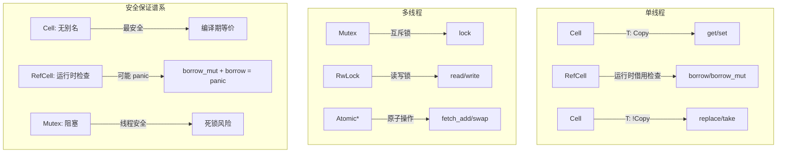
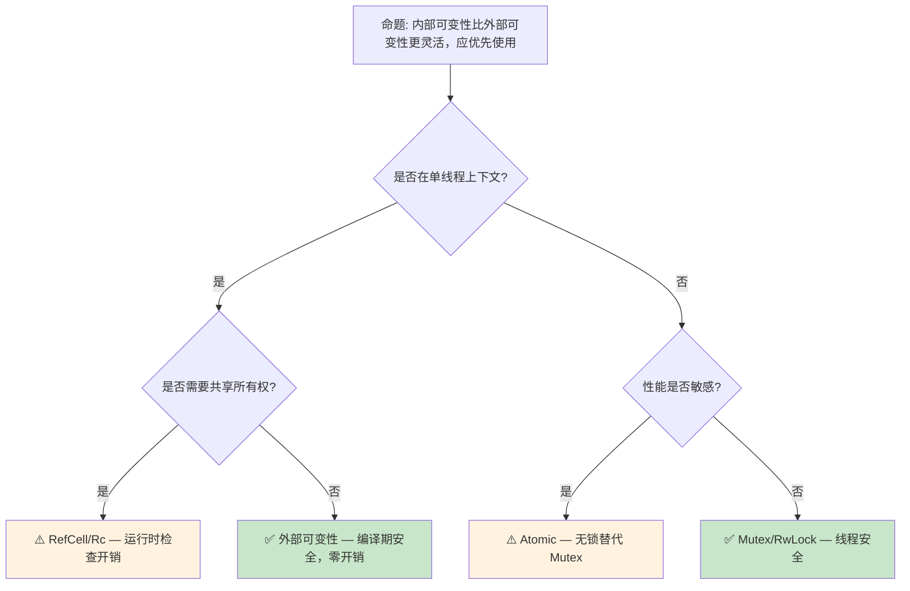

> **内容分级**: [综述级]
> **本节关键术语**: 内部可变性 (Interior Mutability) · RefCell · Cell · Mutex · RwLock · 运行时（Runtime）借用（Borrowing）检查 — [完整对照表](../../00_meta/01_terminology/terminology_glossary.md)
>
# 内部可变性：编译期规则的运行时逃逸
>
> **EN**: Interior Mutability
> **Summary**: Interior Mutability: intermediate Rust mechanisms, patterns, and practical examples.
> **受众**: [进阶]
> **Bloom 层级**: 分析 → 应用
> **A/S/P 标记**: **S+P** — Structure + Procedure
> **双维定位**: C×Ana — 分析内部可变性的安全边界
> **定位**: 深入分析 Rust **内部可变性**（Interior Mutability）模式
> ——`Cell<T>`、`RefCell<T>`、`Mutex<T> [来源: [std::sync::Mutex](https://doc.rust-lang.org/std/sync/struct.Mutex.html)]`、
> `RwLock<T>` 的语义差异、使用场景以及与外部可变性（External Mutability）的互补关系。
> **前置概念**: [Ownership](../../01_foundation/01_ownership_borrow_lifetime/01_ownership.md) ·
> [Borrowing](../../01_foundation/01_ownership_borrow_lifetime/02_borrowing.md) ·
> [Type System](../../01_foundation/02_type_system/04_type_system.md)
> **后置概念**: [Concurrency](../../03_advanced/00_concurrency/01_concurrency.md) ·
> [Async](../../03_advanced/01_async/02_async.md)

---

> **来源**: [Rust Reference — Interior Mutability](https://doc.rust-lang.org/reference/interior-mutability.html) · · [RustBelt — POPL 2018](https://plv.mpi-sws.org/rustbelt/popl18/) · [O'Hearn — Separation Logic and Shared Mutable Data](https://doi.org/10.1017/S0960129501001003) · [Brown University — Concepts in Rust Programming](https://cel.cs.brown.edu/crp/) · [Brown Interactive Rust Book](https://rust-book.cs.brown.edu/) · [Itanium C++ ABI](https://itanium-cxx-abi.github.io/cxx-abi/abi.html)
> [TRPL Ch15 — RefCell](https://doc.rust-lang.org/book/ch15-05-interior-mutability.html) ·
> [Rustonomicon — Interior Mutability](https://doc.rust-lang.org/nomicon/concurrency.html) ·
> [std::cell Documentation](https://doc.rust-lang.org/std/cell/index.html)

## 📑 目录

- 内部可变性：编译期规则的运行时（Runtime）逃逸
  - [📑 目录](#-目录)
  - [一、核心概念](#一核心概念)
    - [1.1 外部可变性与内部可变性的对比](#11-外部可变性与内部可变性的对比)
    - [1.2 内部可变性的类型谱系](#12-内部可变性的类型谱系)
    - 1.3 运行时（Runtime）借用（Borrowing）检查
  - [二、技术细节](#二技术细节)
    - [2.1 `Cell<T>`：无借用（Borrowing）语义的复制](#21-cellt无借用语义的复制)
    - [2.2 `RefCell<T>`：动态借用（Borrowing）规则](#22-refcellt动态借用规则)
    - [2.3 `Mutex<T>` 与 `RwLock<T>`：线程安全版本](#23-mutext-与-rwlockt线程安全版本)
  - [三、使用模式](#三使用模式)
  - [四、反命题与边界分析](#四反命题与边界分析)
    - [4.1 反命题树](#41-反命题树)
    - [4.2 边界极限](#42-边界极限)
  - [五、常见陷阱](#五常见陷阱)
    - [编译错误示例](#编译错误示例)
    - [编译错误 4：`OnceCell` 重复初始化（编译错误）](#编译错误-4oncecell-重复初始化编译错误)
    - [编译错误 5：`RwLock` 读锁升级写锁（死锁风险）](#编译错误-5rwlock-读锁升级写锁死锁风险)
  - [六、来源与延伸阅读](#六来源与延伸阅读)
  - [相关概念文件](#相关概念文件)
  - [逆向推理链（Backward Reasoning）](#逆向推理链backward-reasoning)
  - [权威来源索引](#权威来源索引)
    - [10.5 边界测试：`RefCell::borrow_mut` 的递归 panic（运行时（Runtime） panic）](#105-边界测试refcellborrow_mut-的递归-panic运行时-panic)
    - [10.6 边界测试：`Cell::take` 与 `Default` 的隐式要求（编译错误）](#106-边界测试celltake-与-default-的隐式要求编译错误)
  - [实践](#实践)
  - [参考来源](#参考来源)
  - [嵌入式测验（Embedded Quiz）](#嵌入式测验embedded-quiz)
    - [测验 1：Cell vs RefCell（理解层）](#测验-1cell-vs-refcell理解层)
    - [测验 2：RefCell 的运行时（Runtime）借用（Borrowing）规则（应用层）](#测验-2refcell-的运行时借用规则应用层)
    - [测验 3：内部可变性的适用场景（应用层）](#测验-3内部可变性的适用场景应用层)
    - [测验 4：`Rc<RefCell<T>>` 模式（分析层）](#测验-4rcrefcellt-模式分析层)
    - [测验 5：内部可变性与 Send/Sync（专家级）](#测验-5内部可变性与-sendsync专家级)
  - [认知路径](#认知路径)
    - [核心推理链](#核心推理链)
    - [反命题与边界](#反命题与边界)

---

## 一、核心概念

### 1.1 外部可变性与内部可变性的对比

Rust 的默认规则是**外部可变性**（External Mutability）——可变访问需要 `&mut`：

```text
外部可变性（默认规则）:
  let mut x = 5;
  let r = &mut x;
  *r = 6;  // ✅ &mut 允许修改

  let x = 5;
  let r = &x;
  // *r = 6;  // ❌ &x 不可变，编译错误

内部可变性（运行时规则）:
  let x = RefCell::new(5);
  let r = x.borrow();     // 不可变借用
  drop(r);
  let r = x.borrow_mut(); // 可变借用（通过 &self 调用！）
  *r = 6;  // ✅ 运行时允许

核心差异:
  - 外部: 编译器在编译期验证借用规则
  - 内部: 编译器允许，运行时验证借用规则
  - 代价: 运行时 panic（而非编译错误）
```

> **核心洞察**: 内部可变性是 Rust **借用（Borrowing）检查器的运行时（Runtime）逃逸口**——当编译器无法静态证明借用规则时，通过运行时检查提供灵活性。
> [来源: [TRPL Ch15 — Interior Mutability](https://doc.rust-lang.org/book/ch15-05-interior-mutability.html)]

---

### 1.2 内部可变性的类型谱系



> **认知功能**: 此图展示内部可变性的**类型谱系**——从最简单的 `Cell` 到复杂的 `RwLock`，以及对应的安全保证层级。
> [来源: [TRPL](https://doc.rust-lang.org/book/ch15-05-interior-mutability.html)]
> **使用建议**: 优先使用最简单的类型满足需求：`Cell` > `RefCell` > `Mutex` > `RwLock`。
> **关键洞察**: 内部可变性的选择是**安全-性能-灵活性**的权衡——越简单的类型（Cell）运行时（Runtime）开销越小，但功能越受限。
> [来源: [std::cell Documentation](https://doc.rust-lang.org/std/cell/index.html)]

---

### 1.3 运行时借用检查

```text
RefCell<T> 的运行时借用规则:

  编译期允许（所有方法通过 &self）:
    fn borrow(&self) -> Ref<T>       // 不可变借用
    fn borrow_mut(&self) -> RefMut<T> // 可变借用

  运行时检查（借用计数器）:
    borrow() 时:
      - 若已有可变借用（mut_count > 0）→ panic!
      - 否则 imm_count += 1

    borrow_mut() 时:
      - 若已有任何借用（imm_count > 0 或 mut_count > 0）→ panic!
      - 否则 mut_count = 1

    Ref/RefMut  drop 时:
      - 对应计数器减 1

  与编译期借用的对比:
    ┌─────────────────┬──────────────────┬──────────────────┐
    │     场景        │   编译期借用      │   RefCell 借用    │
    ├─────────────────┼──────────────────┼──────────────────┤
    │ &mut + &mut     │ 编译错误          │ 运行时 panic      │
    │ &mut + &        │ 编译错误          │ 运行时 panic      │
    │ & + &           │ ✅ 允许           │ ✅ 允许         │
    │ 检测时机        │ 编译期            │ 运行时            │
    │ 性能开销        │ 零                │ 计数器增减        │
    └─────────────────┴──────────────────┴──────────────────┘
```

> **运行时（Runtime）洞察**:
> RefCell 的**运行时（Runtime） panic**不是 UB——它是安全的、确定性的失败模式。
> 与 C/C++ 的未定义行为不同，Rust 的运行时检查确保即使规则被违反，程序也是安全的（虽然会崩溃）。
> [来源: [Rustonomicon — Interior Mutability](https://doc.rust-lang.org/nomicon/concurrency.html)]

---

## 二、技术细节

### 2.1 `Cell<T>`：无借用语义的复制

```rust
use std::cell::Cell;

// Cell<T> 的核心机制: 通过复制/替换修改值
let c = Cell::new(5);

// get: 返回 T 的副本（要求 T: Copy）
let v = c.get();  // v = 5, c 内部仍为 5

// set: 替换内部值
 c.set(10);       // c 内部变为 10

// 为什么 Cell 不需要运行时检查?
// 因为 Cell 不暴露引用——只能通过 get/set 访问
// 不存在 &T 或 &mut T 指向 Cell 内部
// 因此不可能出现别名冲突
```

> **Cell 限制**:
>
> 1. `get()` 要求 `T: Copy`——因为返回的是副本
> 2. 对于 `!Copy` 类型，使用 `replace()` 或 `take()`（要求 `T: Default`）
> 3. 无法直接获取内部值的引用（Reference）
> [来源: [std::cell::Cell](https://doc.rust-lang.org/std/cell/struct.Cell.html)]

---

### 2.2 `RefCell<T>`：动态借用规则
>

```rust
use std::cell::RefCell;

let data = RefCell::new(vec![1, 2, 3]);

// 多个不可变借用（允许）
let r1 = data.borrow();
let r2 = data.borrow();
println!("{:?} {:?}", r1, r2);  // ✅ [1,2,3] [1,2,3]
drop(r1);
drop(r2);

// 可变借用（独占）
let mut w = data.borrow_mut();
w.push(4);
drop(w);

// 错误示例: 同时存在不可变和可变借用
let r = data.borrow();
// let w = data.borrow_mut();  // ❌ 运行时 panic!
println!("{:?}", r);
```

> **RefCell 用途**:
>
> 1. 在 `Rc` 内部提供可变性：`Rc<RefCell<T>>`
> 2. 实现自引用（Reference）结构（配合 Pin）
> 3. 在单线程上下文中模拟 `&mut` 的灵活性
> [来源: [std::cell::RefCell](https://doc.rust-lang.org/std/cell/struct.RefCell.html)]

---

### 2.3 `Mutex<T>` 与 `RwLock<T>`：线程安全版本
>

```rust
use std::sync::{Mutex, RwLock};

// Mutex: 互斥访问（任意读写，但独占）
let m = Mutex::new(vec![1, 2, 3]);
{
    let mut guard = m.lock().unwrap();
    guard.push(4);  // 独占访问
} // guard 在此 drop，锁释放

// RwLock: 读共享/写独占
let rw = RwLock::new(vec![1, 2, 3]);
{
    let r1 = rw.read().unwrap();
    let r2 = rw.read().unwrap();  // ✅ 多个读允许
    println!("{:?} {:?}", r1, r2);
}
{
    let mut w = rw.write().unwrap();  // 独占写
    w.push(4);
}
```

> **线程安全版本对比**:
>
> | 类型 | 读并发 | 写并发 | 死锁风险 | 开销 |
> | :--- | :---: | :---: | :---: | :---: |
> | `RefCell` | ✅ | ❌ | 无（单线程） | 最小 |
> | `Mutex` | ❌ | ❌ | 有 | 系统调用 |
> | `RwLock` | ✅ | ❌ | 有 | 系统调用 |
> | `Atomic` | ✅ | ✅（CAS） | 无（无锁） | CPU 指令 |
> [来源: [std::sync Documentation](https://doc.rust-lang.org/std/sync/index.html)]

---

## 三、使用模式

```text
模式 1: Rc<RefCell<T>> — 共享可变所有权（单线程）
  use std::rc::Rc;
  use std::cell::RefCell;

  let shared = Rc::new(RefCell::new(0));
  let a = Rc::clone(&shared);
  let b = Rc::clone(&shared);

  *a.borrow_mut() += 1;
  *b.borrow_mut() += 1;
  assert_eq!(*shared.borrow(), 2);

模式 2: Arc<Mutex<T>> — 共享可变所有权（多线程）
  use std::sync::{Arc, Mutex};

  let shared = Arc::new(Mutex::new(0));
  let mut handles = vec![];

  for _ in 0..10 {
      let s = Arc::clone(&shared);
      handles.push(std::thread::spawn(move || {
          let mut guard = s.lock().unwrap();
          *guard += 1;
      }));
  }

模式 3: Cell<bool> — 简单标志位
  let flag = Cell::new(false);
  // 在回调中修改（&self 方法内）
  fn set_done(flag: &Cell<bool>) {
      flag.set(true);  // ✅ 通过 &self 修改
  }

模式 4: 内部可变性 + 外部不可变性 API
  pub struct Counter {
      count: Cell<u32>,  // 内部可变
  }

  impl Counter {
      pub fn new() -> Self { Self { count: Cell::new(0) } }
      pub fn increment(&self) {  // &self，不是 &mut self！
          self.count.set(self.count.get() + 1);
      }
      pub fn get(&self) -> u32 { self.count.get() }
  }
```

> **最佳实践**: 内部可变性应**封装在模块（Module）内部**，对外暴露 safe API。不要让 `RefCell`/`Mutex` 泄漏到公共接口中，除非这是设计意图。
> [来源: [Rust API Guidelines — Interior Mutability](https://rust-lang.github.io/api-guidelines/)]

---

## 四、反命题与边界分析

### 4.1 反命题树
>



> **认知功能**: 此决策树判断是否使用内部可变性。核心判断标准是**线程上下文**、**共享需求**和**性能敏感度**。
> **使用建议**: 优先外部可变性（编译期安全），仅在需要时才引入内部可变性。内部可变性是**工具而非默认**。
> **关键洞察**: 过度使用内部可变性会导致**运行时（Runtime） panic 风险**和**性能开销**。最佳设计是：大部分代码用外部可变性，仅在边界处使用内部可变性。
> [💡 原创分析](../../00_meta/00_framework/methodology.md)

---

### 4.2 边界极限
>

```text
边界 1: 运行时 panic
├── RefCell::borrow_mut() 在已有借用时 panic
├── Mutex::lock() 在已持有的线程上再次调用 → 死锁（部分实现）
└── 这些 panic/死锁是逻辑错误，不是内存安全问题

边界 2: Send 和 Sync
├── Cell 和 RefCell 不是 Sync（不能在线程间共享引用）
├── Rc 不是 Send/Sync
├── Arc<RefCell<T>> 无法编译（RefCell 不是 Sync）
└── 线程间共享可变状态必须用 Arc<Mutex<T>>

边界 3: 与 Pin 的交互
├── Pin<&RefCell<T>> 允许通过 RefCell 获取 &mut T
├── 这可能破坏 Pin 的不动性保证
├── 解决方案: Pin::map_unchecked 或避免 RefCell + Pin 组合

边界 4: 递归借用
├── RefCell 不支持递归 borrow_mut（与 &mut 不同）
├── 需要递归可变性时用 Cell 或重新设计
└── 例: RefCell::borrow_mut() 内部再次调用 borrow_mut() → panic
```

> **边界要点**: 内部可变性的边界反映了 Rust 的**保守安全哲学**——即使提供运行时逃逸口，也不允许真正危险的内存操作。

---

## 五、常见陷阱

```text
陷阱 1: RefCell 在已持有 borrow 时调用 borrow_mut
  ❌ let r = data.borrow();
     let w = data.borrow_mut();  // panic!
     println!("{}", r);  // r 仍在作用域

  ✅ drop(r);  // 先释放不可变借用
     let w = data.borrow_mut();  // 安全

陷阱 2: 忘记 Mutex guard 的 drop
  ❌ let guard = mutex.lock().unwrap();
     // 长时间持有 guard，阻塞其他线程

  ✅ { let guard = mutex.lock().unwrap();
     // 快速操作
     } // guard 在此 drop，锁释放

陷阱 3: 死锁（嵌套锁）
  ❌ let a = mutex_a.lock().unwrap();
     let b = mutex_b.lock().unwrap();  // 如果另一线程先锁 b 再锁 a → 死锁

  ✅ 始终按固定顺序获取锁
     或使用 std::sync::LockResult::lock 的超时版本

陷阱 4: Cell 与 !Copy 类型
  ❌ let c = Cell::new(String::from("hello"));
     let s = c.get();  // ❌ String 不是 Copy

  ✅ let c = Cell::new(String::from("hello"));
     let s = c.take();  // ✅ 取出内部值，替换为 Default
```

> **陷阱总结**: 内部可变性的陷阱主要来自**运行时规则的违反**（panic）和**并发错误**（死锁）。这些是逻辑错误，需要通过设计和代码审查来避免。
> [来源: [Rust Common Mistakes](https://doc.rust-lang.org/book/ch15-05-interior-mutability.html)]

### 编译错误示例

```rust,compile_fail
use std::cell::Cell;

fn cell_non_copy() {
    let c = Cell::new(String::from("hello"));
    // ❌ 编译错误: `String` 未实现 `Copy`
    // Cell::get 要求 T: Copy，因为它返回值的副本
    let s = c.get();
}
```

> **修正**: 对非 Copy 类型使用 `Cell::take` 或改用 `RefCell`。

```rust,compile_fail
use std::cell::RefCell;
use std::sync::Arc;
use std::thread;

fn refcell_not_sync() {
    let shared = Arc::new(RefCell::new(5));
    // ❌ 编译错误: `RefCell<i32>` 未实现 `Sync`
    // Arc 要求内部类型实现 Sync 才能安全跨线程共享
    let shared2 = Arc::clone(&shared);
    thread::spawn(move || {
        *shared2.borrow_mut() += 1;
    });
}
```

> **修正**: 使用 `Arc<Mutex<T>>` 或 `Arc<RwLock<T>>` 替代 `Arc<RefCell<T>>`。

```rust,compile_fail
use std::sync::Mutex;
use std::thread;

fn mutex_guard_not_send() {
    let m = Mutex::new(0);
    let guard = m.lock().unwrap();
    // ❌ 编译错误: `MutexGuard` 不能跨线程发送
    // std::sync::MutexGuard 不实现 Send（某些平台实现）
    thread::spawn(move || {
        println!("{}", *guard);
    });
}
```

> **修正**: 在 `std::sync::Mutex` 的标准实现中，`MutexGuard` 实际上是 `Send` 的。但在某些自定义实现或 `std::sync::RwLockReadGuard` 中可能不实现。以上为教学性边界示例。

### 编译错误 4：`OnceCell` 重复初始化（编译错误）

```rust,ignore
use std::sync::OnceLock;

fn main() {
    static CELL: OnceLock<i32> = OnceLock::new();
    CELL.set(42).unwrap();
    // ❌ 编译错误: 实际上 set 返回 Result，但以下展示借用冲突
    // let val = CELL.get_mut().unwrap(); // get_mut 需要 &mut self
    // *val = 100; // OnceLock 不提供可变访问
}

// 正确: OnceLock 一旦初始化不可变
fn correct_usage() {
    static CELL: OnceLock<i32> = OnceLock::new();
    CELL.set(42).unwrap();
    println!("{}", CELL.get().unwrap()); // ✅ 只读访问
}
```

> **修正**: `OnceLock` / `lazy_static` 提供"一次性初始化"语义，初始化后值不可变。任何试图在初始化后修改值的操作都被 API 设计阻止。若需延迟初始化 + 可变访问，使用 `Mutex<OnceCell<T>>` 或 `RwLock<T>`。

### 编译错误 5：`RwLock` 读锁升级写锁（死锁风险）

```rust
use std::sync::RwLock;

fn main() {
    let lock = RwLock::new(5);
    let _read = lock.read().unwrap();
    // ⚠️ 死锁风险: 在读锁持有期间尝试获取写锁
    // 标准库 `std::sync::RwLock` 不支持锁升级
    let _write = lock.write().unwrap(); // 可能死锁（取决于实现）
}

// 正确: 释放读锁后再获取写锁
fn correct_upgrade() {
    let lock = RwLock::new(5);
    {
        let _read = lock.read().unwrap();
        // 读取操作...
    } // 读锁在此释放
    let mut write = lock.write().unwrap();
    *write += 1; // ✅ 写锁安全获取
}
```

> **修正**: 标准库 `std::sync::RwLock` 不支持读锁升级（read-to-write upgrade）。尝试在持有读锁时获取写锁会导致死锁（写锁需等待所有读锁释放）。某些第三方库（如 `parking_lot::RwLockUpgradableReadGuard`）提供升级支持，但需谨慎使用。[来源: [Rust Standard Library](https://doc.rust-lang.org/std/index.html)]

---

## 六、来源与延伸阅读
>

| 来源 | 可信度 | 说明 |
| [Rust Standard Library](https://doc.rust-lang.org/std/index.html) | ✅ 一级 | 标准库参考 |
| [Rust By Example](https://doc.rust-lang.org/rust-by-example/index.html) | ✅ 一级 | 交互式教程 |

| [This Week in Rust](https://this-week-in-rust.org/) | ✅ 二级 | 社区动态 |
|:---|:---:|:---|
| [TRPL Ch15 — Interior Mutability](https://doc.rust-lang.org/book/ch15-05-interior-mutability.html) | ✅ 一级 | 官方入门指南 |
| [Rustonomicon — Interior Mutability](https://doc.rust-lang.org/nomicon/concurrency.html) | ✅ 一级 | unsafe 视角深入 |
| [std::cell Documentation](https://doc.rust-lang.org/std/cell/index.html) | ✅ 一级 | 标准库文档 |
| [std::sync Documentation](https://doc.rust-lang.org/std/sync/index.html) | ✅ 一级 | 线程同步原语 |
| [Rust Reference — Interior Mutability](https://doc.rust-lang.org/reference/interior-mutability.html) | ✅ 一级 | 语言参考 |

---

## 相关概念文件

- [Ownership](../../01_foundation/01_ownership_borrow_lifetime/01_ownership.md) — 所有权（Ownership）模型
- [Borrowing](../../01_foundation/01_ownership_borrow_lifetime/02_borrowing.md) — 借用与生命周期（Lifetimes）
- [Type System](../../01_foundation/02_type_system/04_type_system.md) — Rust 类型系统（Type System）
- [Concurrency](../../03_advanced/00_concurrency/01_concurrency.md) — 并发编程
- [Async](../../03_advanced/01_async/02_async.md) — 异步（Async）编程

---

> **权威来源**: [Rust Reference](https://doc.rust-lang.org/reference/introduction.html), [The Rust Programming Language](https://doc.rust-lang.org/book/ch15-05-interior-mutability.html), [Rustonomicon](https://doc.rust-lang.org/nomicon/index.html)
> **权威来源对齐变更日志**: 2026-05-21 创建，对齐 Rust 1.96.1+ (Edition 2024)

**文档版本**: 1.0
**对应 Rust 版本**: 1.96.1+ (Edition 2024)
**最后更新**: 2026-05-21
**状态**: ✅ 概念文件创建完成

---

## 逆向推理链（Backward Reasoning）

> **从编译错误反推**：
>
> ```text
> 内部可变安全 ⟸ RefCell/Cell 运行时检查
> ```
>
## 权威来源索引

>
>
>

---

> **补充来源**

### 10.5 边界测试：`RefCell::borrow_mut` 的递归 panic（运行时 panic）

```rust,ignore
use std::cell::RefCell;

fn main() {
    let data = RefCell::new(vec![1, 2, 3]);
    let mut borrow1 = data.borrow_mut();
    // ❌ 运行时 panic: 在同一线程中递归获取 mutable borrow
    let mut borrow2 = data.borrow_mut();
    borrow2.push(4);
}
```

> **修正**:
> `RefCell` 提供**单线程内部可变性**：运行时检查借用（Borrowing）规则。
> `borrow()` 增加共享计数，`borrow_mut()` 检查共享计数为 0，否则 panic。
> 同一 `RefCell` 上两次 `borrow_mut()`（即使同一线程）→ `already borrowed: BorrowMutError` panic。
> 这是**运行时**错误，非编译错误——编译器无法静态验证 `RefCell` 的内部状态。
> 安全模式：
>
> 1) 避免递归/重入的 `borrow_mut`；
> 2) 使用 `Cell<T>`（若 `T: Copy`，无运行时检查开销）；
> 3) 重构为 `take` + `replace` 模式（`let mut temp = data.take(); ...; data.set(temp);`）。
> 这与 C++ 的 `mutable` 关键字（无运行时检查，突破 const 约束）或 Java 的 `final` 字段（引用（Reference）不可变，但对象状态可变）不同——Rust 的 `RefCell` 是显式、有检查的安全机制。
> [来源: [The Rust Programming Language](https://doc.rust-lang.org/book/ch15-05-interior-mutability.html)] ·
> [来源: [Rust Standard Library](https://doc.rust-lang.org/std/cell/struct.RefCell.html)]

### 10.6 边界测试：`Cell::take` 与 `Default` 的隐式要求（编译错误）

```rust,ignore
use std::cell::Cell;

struct NoDefault {
    value: i32,
}

fn main() {
    let cell = Cell::new(NoDefault { value: 42 });
    // ❌ 编译错误: Cell::take 要求 T: Default
    // let inner = cell.take();

    // Cell::take 等价于: Cell::replace(&self, Default::default())
    // 若 T 不实现 Default，不能使用 take
}
```

> **修正**:
> `Cell<T>` 的方法要求：
>
> 1) `get()` — 要求 `T: Copy`（复制值）；
> 2) `take()` — 要求 `T: Default`（取走值，留默认值）；
> 3) `replace(val)` — 无约束（取走旧值，放入新值）；
> 4) `into_inner()` — 无约束（消耗 Cell，返回值）。
>
> `Cell` 的设计：适用于 `Copy` 类型或小值类型（`i32`、`bool`），因为 `get` 复制值。
> 对于非 `Copy` 类型：使用 `RefCell<T>`（运行时借用（Borrowing）检查）或 `Cell<T>` + `replace`/`take`。
> 这与 C++ 的 `std::atomic`（类似 `Cell`，但线程安全，需 `TriviallyCopyable`）或 Java 的 `AtomicReference`（类似 `Cell`，但线程安全）不同
> ——Rust 的 `Cell` 是单线程的、无锁的内部可变性原语。
> [来源: [Rust Standard Library](https://doc.rust-lang.org/std/cell/struct.Cell.html)] ·
> [来源: [The Rust Programming Language](https://doc.rust-lang.org/book/ch15-05-interior-mutability.html)]

## 实践

> **相关资源**:
>
> - [crates/ 示例代码](../crates) — 与本文概念对应的可编译示例
> - [exercises/ 练习](../exercises) — 动手编程挑战
> - [MVP 学习路径](../../00_meta/04_navigation/learning_mvp_path.md) — 从零到多线程 CLI 的 40 小时路径
>
> **建议**: 阅读完本概念文件后，打开对应 crate 的示例代码，尝试修改并运行。完成至少 1 道相关练习以巩固理解。

## 参考来源

> [来源: [std::cell::Cell](https://doc.rust-lang.org/std/cell/struct.Cell.html)]
> [来源: [std::cell::RefCell](https://doc.rust-lang.org/std/cell/struct.RefCell.html)]
> [来源: [std::sync::Mutex](https://doc.rust-lang.org/std/sync/struct.Mutex.html)]
> [来源: [std::sync::RwLock](https://doc.rust-lang.org/std/sync/struct.RwLock.html)]
> [来源: [Rust Unsafe Code Guidelines — Interior Mutability](https://rust-lang.github.io/unsafe-code-guidelines//glossary.html)]
> **权威来源**:
> [Rust Reference](https://doc.rust-lang.org/reference/introduction.html) ·
> [The Rust Programming Language](https://doc.rust-lang.org/book/ch15-05-interior-mutability.html) ·
> [Rust Standard Library](https://doc.rust-lang.org/std/index.html) ·
> [Rustonomicon](https://doc.rust-lang.org/nomicon/index.html)
> **对应 Rust 版本**: 1.96.1+ (Edition 2024)

## 嵌入式测验（Embedded Quiz）

### 测验 1：Cell vs RefCell（理解层）

`Cell<T>` 和 `RefCell<T>` 的核心区别是什么？

- A. `Cell` 线程安全，`RefCell` 不是
- B. `Cell` 只能存储 `Copy` 类型，`RefCell` 提供动态借用检查
- C. `Cell` 允许多个可变引用（Mutable Reference）同时存在

<details>
<summary>✅ 答案</summary>

**B. `Cell` 只能存储 `Copy` 类型，`RefCell` 提供动态借用检查**。

| 类型 | 核心机制 | 限制 |
|:---|:---|:---|
| `Cell<T>` | 通过 `get/set` 整体替换值 | `T: Copy`（或配合 `take` 使用 `Default`） |
| `RefCell<T>` | 运行时借用检查（类似编译期借用规则的动态版） | 违反规则时 panic |
| `Mutex<T>` | 线程安全的 `RefCell`（操作系统原语） | 可能死锁 |
| `RwLock<T>` | 多读单写锁 | 读锁升级写锁导致死锁 |

`Cell` 和 `RefCell` 都是**单线程**内部可变性原语。
</details>

---

### 测验 2：RefCell 的运行时借用规则（应用层）

以下代码运行时会发生什么？

```rust
use std::cell::RefCell;

fn main() {
    let data = RefCell::new(42);
    let b1 = data.borrow();
    let b2 = data.borrow_mut();
    println!("{}", b1);
}
```

- A. 编译错误
- B. 运行时 panic
- C. 正常输出 42

<details>
<summary>✅ 答案</summary>

**B. 运行时 panic**。

`RefCell` 在运行时强制执行借用规则：

- `borrow()` 获取不可变引用（Immutable Reference）
- `borrow_mut()` 获取可变引用（Mutable Reference）
- 两者不能同时存在，违反时在**运行时 panic**

这与编译期借用检查不同：编译器无法在运行时跟踪 `RefCell` 的借用状态，因此将检查推迟到运行时。若需要线程安全版本，使用 `Mutex`（同样运行时检查）。
</details>

---

### 测验 3：内部可变性的适用场景（应用层）

以下哪种场景最适合使用 `RefCell<T>`？

- A. 多线程共享可变状态
- B. 单线程中需要绕过编译期借用规则（如实现自引用（Reference）或回调）
- C. 需要原子操作（Atomic Operations）保证无锁并发

<details>
<summary>✅ 答案</summary>

**B. 单线程中需要绕过编译期借用规则**。

`RefCell` 的设计目标：当编译器过于保守（如自引用（Reference）结构、观察者模式回调）时，允许在**单线程**中以运行时检查换取灵活性。

不适用场景：

- 多线程共享 → 使用 `Mutex<T>`/`RwLock<T>`（需 `Send`）
- 原子操作（Atomic Operations） → 使用 `AtomicUsize` 等（无锁，更快）
- 性能关键路径 → `RefCell` 有运行时开销

</details>

---

### 测验 4：`Rc<RefCell<T>>` 模式（分析层）

`Rc<RefCell<T>>` 提供了什么组合能力？

- A. 单所有权（Ownership） + 编译期可变借用（Mutable Borrow）
- B. 多所有权（Ownership） + 运行时可变借用（Mutable Borrow）
- C. 线程安全共享 + 编译期不可变借用（Immutable Borrow）

<details>
<summary>✅ 答案</summary>

**B. 多所有权（Ownership） + 运行时可变借用（Mutable Borrow）**。

组合语义：

- `Rc<T>`：多所有权（Ownership）引用（Reference）计数（单线程）
- `RefCell<T>`：运行时借用检查
- `Rc<RefCell<T>>` = "多个所有者共享同一可变数据"

这是 Rust 中实现**图结构**、**双向链表**等复杂数据结构的经典模式。但需注意：

- 仅单线程（`Rc` 不是 `Send`）
- 可能形成循环引用（Reference） → 配合 `Weak<T>` 使用
- 运行时 panic 风险 → 避免 `borrow_mut()` 嵌套

</details>

---

### 测验 5：内部可变性与 Send/Sync（专家级）

为什么 `RefCell<T>` 不是 `Sync`？

- A. 因为它使用操作系统锁
- B. 因为它的借用计数器不是原子操作（Atomic Operations），多线程同时访问会导致数据竞争
- C. 因为它只允许不可变借用（Immutable Borrow）

<details>
<summary>✅ 答案</summary>

**B. 因为它的借用计数器不是原子操作（Atomic Operations），多线程同时访问会导致数据竞争**。

`RefCell` 的借用状态（当前有多少个 `borrow`/是否有 `borrow_mut`）存储在普通整型中，非线程安全。如果两个线程同时调用 `borrow()`，计数器更新会产生数据竞争。

对比：

- `RefCell<T>: !Sync`（即使 `T: Sync`）
- `Mutex<T>: Sync if T: Send`（使用 OS 锁保护内部状态）
- `AtomicUsize: Sync`（CPU 原子指令）

这是内部可变性类型设计的关键安全属性。
</details>

---

## 认知路径

> **认知路径**: 从 L0 基础概念出发，经由本节的 **内部可变性：编译期规则的运行时逃逸** 核心原理，通向 L2 进阶模式与 L3 工程实践。

### 核心推理链

| 定理 | 前提 | 结论 | 置信度 |
|:---|:---|:---|:---|
| 内部可变性：编译期规则的运行时逃逸 基础定义 ⟹ 正确用法 | 理解语法与语义 | 能写出符合惯用法的代码 | 高 |
| 内部可变性：编译期规则的运行时逃逸 正确用法 ⟹ 常见陷阱 | 忽略边界条件 | 编译错误或运行时 bug | 高 |
| 内部可变性：编译期规则的运行时逃逸 常见陷阱 ⟹ 深度掌握 | 系统学习反模式 | 能进行代码审查与优化 | 高 |

> 内部可变性安全 ⟸ RefCell/Cell/Mutex 隔离 ⟸ 运行时检查
> 共享可变状态正确 ⟸ Arc<Mutex<T>> 模式 ⟸ Send/Sync 边界
> **过渡**: 掌握 内部可变性：编译期规则的运行时逃逸 的基础语法后，下一步需要理解其在类型系统（Type System）中的位置与与其他概念的交互关系。
> **过渡**: 在实践中应用 内部可变性：编译期规则的运行时逃逸 时，务必关注边界条件与异常处理，这是从"能编译"到"能生产"的关键跃迁。
> **过渡**: 内部可变性：编译期规则的运行时逃逸 的设计理念体现了 Rust 零成本抽象（Zero-Cost Abstraction）与安全保证的核心权衡，理解这一权衡有助于迁移到更高级的并发与形式化验证领域。

### 反命题与边界

> **反命题**: "内部可变性：编译期规则的运行时逃逸 在所有场景下都是最佳选择" —— 错误。需要根据具体上下文权衡性能、可读性与安全性，某些场景下显式替代方案可能更优。

---

## 补充视角：crate 实践中的智能指针与内部可变性选型

> 本节选编自 `crates/c01_ownership_borrow_scope/docs/tier_03_references/06_advanced_ownership_patterns_reference.md`，
> 作为 canonical 概念页的工程实践补充。

### 决策流程

```text
需要内部可变性？
    ↓ 是
需要跨线程共享？
    ↓ 否                              ↓ 是
类型是 Copy？                      是否读多写少？
    ↓ 是          ↓ 否                  ↓ 是         ↓ 否
使用 Cell<T>   使用 RefCell<T>       使用 RwLock<T>   使用 Mutex<T>
```

### 选型矩阵

| 场景 | 推荐方案 | 原因 |
| :--- | :--- | :--- |
| 单线程 + Copy 类型 | `Cell<T>` | 零开销，按值替换 |
| 单线程 + 非 Copy 类型 | `RefCell<T>` | 运行时借用检查，灵活 |
| 多线程 + 频繁读取 | `RwLock<T>` | 读并发 |
| 多线程 + 频繁写入 | `Mutex<T>` | 简单可靠 |
| 多线程 + 原子操作 | `AtomicXxx` | 最高性能 |
| 不需要内部可变性 | `&mut T` | 编译时保证 |

### 典型组合模式

- `Rc<RefCell<T>>`：单线程共享可变图/树结构。
- `Arc<Mutex<T>>` / `Arc<RwLock<T>>`：多线程共享状态。
- `Weak<T>`：打破 `Rc`/`Arc` 循环引用，常用于缓存键或观察者模式。
