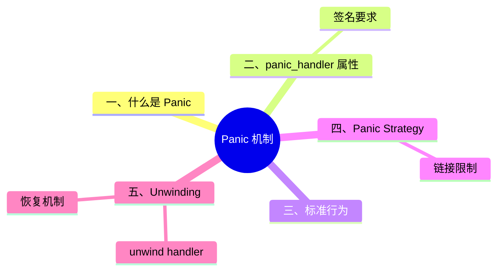

# Panic 机制

> **EN**: Panic
> **Summary**: Rust panic 的规范语义：panic handler、标准行为、panic strategy、unwind 与跨 FFI boundary 的规则。
> **Rust 版本**: 1.97.0+ (Edition 2024)
>
> **受众**: [专家]
> **内容分级**: [专家级]
> **Bloom 层级**: L2-L4
> **权威来源**: 本文件为 `concept/` 权威页。
> **A/S/P 标记**: **S** — Specification
> **双维定位**: S×Ana — 规范分析
> **前置依赖**: [Panic and Abort](../../01_foundation/08_error_handling/03_panic_and_abort.md) · [Unsafe Rust](../../03_advanced/02_unsafe/01_unsafe.md) · [The Rust Runtime](../../03_advanced/06_low_level_patterns/07_rust_runtime.md)
> **后置概念**: [Error Handling](01_error_handling.md) · [FFI Advanced](../../03_advanced/04_ffi/02_ffi_advanced.md) · [Behavior Considered Undefined](../../04_formal/01_ownership_logic/06_behavior_considered_undefined.md)
> **定理链**: Panic → Handler → Strategy → Unwind → UB Boundary
> **主要来源**: [Rust Reference — Panic](https://doc.rust-lang.org/reference/panic.html) · [RustBelt — POPL 2018](https://plv.mpi-sws.org/rustbelt/popl18/) · [O'Hearn — Separation Logic and Shared Mutable Data](https://doi.org/10.1017/S0960129501001003) · [Brown University — Interactive Rust Book](https://rust-book.cs.brown.edu/) · [TRPL — Panic](https://doc.rust-lang.org/book/ch09-01-unrecoverable-errors-with-panic.html) · [Itanium C++ ABI](https://itanium-cxx-abi.github.io/cxx-abi/abi.html)

>
> **来源**: [Rust Reference — Panic](https://doc.rust-lang.org/reference/panic.html)

---

## 一、什么是 Panic

**Panic** 是 Rust 提供的机制，用于阻止函数正常返回，以响应通常不可恢复的错误条件。(Source: [Rust Reference — Panic](https://doc.rust-lang.org/reference/panic.html), [TRPL Ch9 — Unrecoverable Errors](https://doc.rust-lang.org/book/ch09-01-unrecoverable-errors-with-panic.html))

- 某些语言结构（如数组越界索引）会自动 panic。
- 标准库通过 `panic!` 宏（Macro）提供显式 panic 能力。
- panic 行为由 **panic handler** 控制。
- FFI ABI 可能改变 panic 行为。

---

## 二、`panic_handler` 属性

`#[panic_handler]` 应用于函数以定义 panic 行为。

### 签名要求

```rust,ignore
// panic hook 的签名类型（类型片段，非完整语句）
fn(&PanicInfo) -> !
```

- `PanicInfo` 包含 panic 发生位置的信息。
- 整个依赖图中必须存在**唯一一个** `panic_handler` 函数。

### `no_std` 示例

```rust
#![no_std]

use core::panic::PanicInfo;

#[panic_handler]
fn panic(_info: &PanicInfo) -> ! {
    loop {}
}
```

---

## 三、标准行为

标准库提供两种 panic handler：(Source: [Rust Reference — Panic Strategy](https://doc.rust-lang.org/reference/panic.html#panic-strategy))

| 策略 | 行为 | 可恢复性 |
|:---|:---|:---:|
| `unwind` | 展开栈，调用沿途 `Drop` | 潜在可恢复 |
| `abort` | 直接 abort 进程 | 不可恢复 |

- 并非所有目标都支持 `unwind`。
- 使用 `std` 链接时，可通过 `-C panic` 选择策略；大多数目标默认 `unwind`。
- 可通过 `std::panic::set_hook` 在运行时（Runtime）修改标准库 panic 行为。(Source: [std::panic::set_hook](https://doc.rust-lang.org/std/panic/fn.set_hook.html))
- 链接 `no_std` binary、dylib、cdylib 或 staticlib 时必须自行指定 panic handler。

---

## 四、Panic Strategy

**Panic strategy** 定义 crate 构建时支持的 panic 行为。

- 可通过 `rustc` 的 `-C panic` 选择。
- 生成 binary / dylib / cdylib / staticlib 并链接 `std` 时，`-C panic` 也决定使用哪个 panic handler。
- 使用 `abort` 策略时，优化器可以假设不会跨 Rust 栈帧 unwind，从而可能减小代码体积并提升运行速度。

### 链接限制

- `unwind` 策略的 crate 可以使用 `abort` panic handler。
- `abort` 策略的 crate 不能使用 `unwind` panic handler。
- 跨不同 panic strategy 链接 crate 时存在限制，参见 linkage/unwinding 文档。

---

## 五、Unwinding

Panic 可以是可恢复的，也可以是不可恢复的，具体取决于 panic handler 配置。

### `unwind` handler

- 当 panic 发生时，`unwind` handler 会“展开” Rust 栈帧，类似 C++ 的 `throw`。
- 展开过程中，经过的 Rust 栈帧中具有 `Drop` 实现的对象会调用 `drop`。
- 保证资源清理，就像正常离开作用域一样。

### 恢复机制

- `std::panic::catch_unwind`：在当前线程内恢复 panic。(Source: [std::panic::catch_unwind](https://doc.rust-lang.org/std/panic/fn.catch_unwind.html))
- `std::thread::spawn`：自动为子线程设置 panic 恢复，使其他线程继续运行。

---

## 六、跨 FFI Boundary 的 Unwinding

跨 FFI boundary 的 unwind 需要特别小心，错误的 ABI 声明会导致未定义行为。(Source: [Rust Reference — Unwinding](https://doc.rust-lang.org/reference/panic.html#unwinding), [Rust Reference — ABIs](https://doc.rust-lang.org/reference/items/external-blocks.html#abi))

### UB 情况

- 从通过非 unwinding ABI（如 `"C"`、`"system"`）声明的外国函数引发 unwind 进入 Rust 代码。
- 从不支持 unwind 的代码调用使用 `extern "C-unwind"` 等允许 unwind 的 ABI 声明的 Rust 函数。

### 捕获外部 unwind

使用 `catch_unwind`、`JoinHandle::join` 或让其传播到 `main`/线程根时，行为未指定：

- 进程 abort；或
- 函数返回包含不透明类型的 `Result::Err`。

### 运行时边界

- 来自不同 Rust 标准库实例的 `panic` 被视为“外部异常”。
- Rust 运行时（Runtime）产生的 unwind 必须要么导致进程终止，要么被同一运行时捕获。

---

## 七、相关概念

| 概念 | 关系 |
|:---|:---|
| [Panic and Abort](../../01_foundation/08_error_handling/03_panic_and_abort.md) | panic 与 abort 的基础概念 |
| [Error Handling](01_error_handling.md) | panic 是不可恢复错误的机制，`Result` 用于可恢复错误 |
| [FFI Advanced](../../03_advanced/04_ffi/02_ffi_advanced.md) | 跨 FFI unwind 需要正确的 ABI |
| [Behavior Considered Undefined](../../04_formal/01_ownership_logic/06_behavior_considered_undefined.md) | 错误的 FFI unwind 是 UB |
| [The Rust Runtime](../../03_advanced/06_low_level_patterns/07_rust_runtime.md) | panic handler 是运行时的一部分 |

> **权威来源**: [Rust Reference — Panic](https://doc.rust-lang.org/reference/panic.html), [TRPL Ch9 — Unrecoverable Errors](https://doc.rust-lang.org/book/ch09-01-unrecoverable-errors-with-panic.html), [Rustonomicon — Panics](https://doc.rust-lang.org/nomicon/unwinding.html)
>
> **权威来源对齐变更日志**: 2026-07-10 Stage F L3 补全权威来源块与关键引用 [Authority Source Sprint Batch 10](../../00_meta/02_sources/05_international_authority_index.md)

---

## 国际权威参考 / International Authority References（P1 学术 · P2 生态）

> 依据 `AGENTS.md` §2「对齐网络国际化权威内容」补充：仅追加已验证可达的权威链接，不改动正文事实。

- **P2 生态/社区**: [docs.rs/memmap2 — 生态权威 API 文档](https://docs.rs/memmap2) · [docs.rs/embedded-hal — 生态权威 API 文档](https://docs.rs/embedded-hal)

---

## 嵌入式测验（Embedded Quiz）

> W3-b 补充（2026-07-12）：本页原无嵌入式测验，按四级题型规范补 3 题（🟢🟡🔴 各 1 题，`<details>` 折叠答案），内容与本页正文严格一致。

### 测验 1：Panic 的定义（🟢 基础）

按 Rust Reference，panic 是？

- A. 一种可恢复错误的返回类型
- B. Rust 提供的机制，用于阻止函数正常返回，以响应通常不可恢复的错误条件
- C. 编译器警告的别称
- D. 仅在 `unsafe` 代码中才会发生的事件

<details>
<summary>✅ 答案</summary>

**B 正确**。按本页「一、什么是 Panic」(Source: Rust Reference — Panic)：Panic 用于阻止函数正常返回，响应通常不可恢复的错误条件；某些语言结构（如数组越界索引）会自动 panic，`panic!` 宏提供显式能力，行为由 **panic handler** 控制。

</details>

---

### 测验 2：两种 panic 策略（🟡 进阶）

关于 `unwind` 与 `abort` 两种 panic 策略，下列说法正确的是？

- A. `unwind` 直接 abort 进程；`abort` 展开栈
- B. `unwind` 展开栈并调用沿途 `Drop`（潜在可恢复）；`abort` 直接终止进程（不可恢复）
- C. 所有目标平台都支持 `unwind`
- D. `abort` 策略的 crate 可以使用 `unwind` panic handler

<details>
<summary>✅ 答案</summary>

**B 正确**。按本页「三、标准行为」表格：`unwind` 展开栈、调用沿途 `Drop`、潜在可恢复（可由 `catch_unwind` 恢复）；`abort` 直接终止进程、不可恢复。C 错：并非所有目标都支持 `unwind`。D 错：链接限制恰好相反——`unwind` 策略的 crate 可以使用 `abort` handler，`abort` 策略的 crate **不能**使用 `unwind` handler。

</details>

---

### 测验 3：跨 FFI 边界的 unwind（🔴 专家）

下列哪种跨 FFI 的 unwind 构成未定义行为（UB）？

- A. 在 Rust 内部用 `catch_unwind` 捕获同运行时的 panic
- B. 从通过非 unwinding ABI（如 `"C"`、`"system"`）声明的外国函数引发 unwind 进入 Rust 代码
- C. 子线程 panic 后被 `JoinHandle::join` 捕获
- D. 使用 `extern "C-unwind"` 声明的函数在支持 unwind 的两侧之间传播

<details>
<summary>✅ 答案</summary>

**B 正确**。按本页「六、跨 FFI Boundary 的 Unwinding」UB 清单：①从非 unwinding ABI（`"C"`、`"system"`）声明的外国函数引发 unwind 进入 Rust 代码；②从不支持 unwind 的代码调用 `extern "C-unwind"` 等允许 unwind 的 ABI 声明的 Rust 函数。A/C 是合法的同运行时恢复机制（§五）；D 是 `C-unwind` ABI 的设计用途。

</details>

---

## ⚠️ 反例与陷阱：catch_unwind 捕获非 UnwindSafe 闭包

**反例**（rustc 1.97 实测编译失败：E0277）：

```rust,compile_fail
fn main() {
    let mut data = vec![1];
    let r = std::panic::catch_unwind(|| data.push(2));
    let _ = r;
}
```

捕获 `&mut` 的闭包不是 `UnwindSafe`：panic 可能留下被观察到的不一致中间状态，编译器默认拒绝跨 unwind 边界共享可变引用。

**修正**：

```rust
fn main() {
    let mut data = vec![1];
    let r = std::panic::catch_unwind(std::panic::AssertUnwindSafe(|| data.push(2)));
    let _ = r;
}
```

## 🧭 思维导图（Mindmap）


