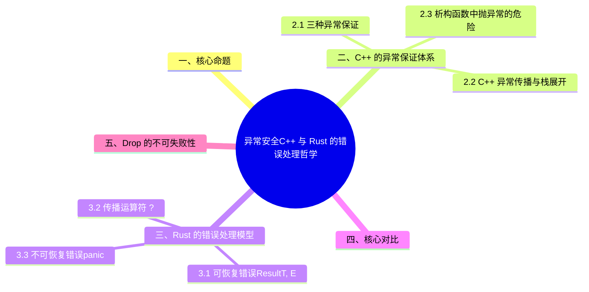

> **内容分级**: [综述级]
>
# 异常安全：C++ 与 Rust 的错误处理哲学
>
> **EN**: Exception Safety: C++ vs Rust
> **Summary**: A deep comparison of exception safety guarantees in C++ (strong/basic/no-throw) and Rust's error-handling model (Result, panic, Drop).
> **Rust 版本**: 1.97.0+ (Edition 2024)
>
> **受众**: [进阶]
> **权威来源**: 本文件为 `concept/` 权威页。
> **层级分工声明**: 本文件虽位于 L2（`02_intermediate/`），但属**跨语言对比专题**（C++ ↔ Rust），保留在 L2 是因为其内容服务于对应 L2 概念（类型/宏（Macro）/错误处理（Error Handling）/构造/可见性）的就近对照学习；L5 对比分析层索引与反链见 [`05_comparative/README.md`](../../05_comparative/README.md) §“L2 跨语言对比专题登记”。
> **层级**: L2 进阶概念
> **A/S/P 标记**: C+A — Comparison + Application
> **双维定位**: C×Ana
> **前置概念**: [Error Handling](01_error_handling.md) · [Error Handling Basics](../../01_foundation/08_error_handling/01_error_handling_basics.md) · [Ownership](../../01_foundation/01_ownership_borrow_lifetime/01_ownership.md)
> **后置概念**: [Error Handling Deep Dive](02_error_handling_deep_dive.md) · [Rust vs C++](../../05_comparative/01_systems_languages/01_rust_vs_cpp.md)
> **主要来源**: · [RustBelt — POPL 2018](https://plv.mpi-sws.org/rustbelt/popl18/) · [O'Hearn — Separation Logic and Shared Mutable Data](https://doi.org/10.1017/S0960129501001003) · [Rust Reference — Runtime and Unwinding](https://doc.rust-lang.org/reference/runtime.html) · [Itanium C++ ABI](https://itanium-cxx-abi.github.io/cxx-abi/abi.html)
>
> [Brown University CRP — Exceptions](https://cel.cs.brown.edu/crp/idioms/exceptions.html) ·
> [Google Comprehensive Rust — C++ Exception](https://google.github.io/comprehensive-rust/android/interoperability/cpp/cpp-exception.html) ·
> [TRPL Ch 9 — Error Handling](https://doc.rust-lang.org/book/ch09-00-error-handling.html) ·
> [cppreference — Exceptions](https://en.cppreference.com/w/cpp/language/exceptions) ·
> [cppreference — noexcept](https://en.cppreference.com/w/cpp/language/noexcept)
>
---

> **Bloom 层级**: L2-L5

---

## 📑 目录

- [异常安全：C++ 与 Rust 的错误处理哲学](#异常安全c-与-rust-的错误处理哲学)
  - [📑 目录](#-目录)
  - [一、核心命题](#一核心命题)
  - [二、C++ 的异常保证体系](#二c-的异常保证体系)
    - [2.1 三种异常保证](#21-三种异常保证)
    - [2.2 C++ 异常传播与栈展开](#22-c-异常传播与栈展开)
    - [2.3 析构函数中抛异常的危险](#23-析构函数中抛异常的危险)
  - [三、Rust 的错误处理模型](#三rust-的错误处理模型)
    - [3.1 可恢复错误：`Result<T, E>`](#31-可恢复错误resultt-e)
    - [3.2 传播运算符 `?`](#32-传播运算符-)
    - [3.3 不可恢复错误：panic](#33-不可恢复错误panic)
  - [四、核心对比](#四核心对比)
  - [五、`Drop` 的不可失败性](#五drop-的不可失败性)
  - [六、C++23 `std::expected` vs Rust `Result`](#六c23-stdexpected-vs-rust-result)
  - [七、形式化视角](#七形式化视角)
  - [八、总结](#八总结)
  - [九、延伸阅读](#九延伸阅读)
  - [📋 关键属性](#-关键属性)
  - [🔗 概念关系](#-概念关系)
  - [国际权威参考 / International Authority References（P1 学术 · P2 生态）](#国际权威参考--international-authority-referencesp1-学术--p2-生态)
  - [相关概念](#相关概念)
  - [⚠️ 反例与陷阱：Drop 中二次 panic 导致 abort（运行时陷阱）](#️-反例与陷阱drop-中二次-panic-导致-abort运行时陷阱)
  - [🧭 思维导图（Mindmap）](#-思维导图mindmap)

---

## 一、核心命题

> **C++ 和 Rust 对"程序出错时如何保持状态一致"给出了两套完全不同的答案。
> C++ 依赖异常传播机制，并通过 strong / basic / no-throw guarantee 描述异常发生时的状态保证；
> Rust 将可恢复错误编码进类型系统（Type System）（`Result<T, E>`），将不可恢复错误隔离为 panic，并通过所有权（Ownership）规则保证资源释放（`Drop`）。**

---

## 二、C++ 的异常保证体系

C++ 的异常安全是**程序员承诺的分级体系**，三个等级由弱到强：

1. **基本保证（basic guarantee）**：异常抛出后对象仍处于有效状态（可析构、可重新赋值），无资源泄漏——但数据可能已改变；这是所有代码的最低义务；
2. **强保证（strong guarantee）**：异常抛出后操作回滚（commit-or-rollback 语义）——通常用 copy-and-swap 惯用法实现；
3. **不抛保证（nothrow guarantee）**：操作承诺绝不抛异常——`noexcept` 标注，移动构造/析构的 `noexcept` 直接影响容器优化路径（`vector` 重分配是否用移动）。

配套机制：栈展开（stack unwinding）逐帧调用析构——析构函数中再抛异常（展开期间）直接 `std::terminate`，这是「析构必须 noexcept」规则的根源。异常保证的脆弱性：它们全部依赖**文档与纪律**，编译器只检查 `noexcept` 标注的表层。

### 2.1 三种异常保证

C++ 标准库和工程中常用以下分类描述函数在异常发生时的行为（cppreference: [Exception safety guarantees](https://en.cppreference.com/w/cpp/language/exceptions#Exception_safety)）：

| 保证级别 | 定义 | 工程含义 |
|:---|:---|:---|
| **No-throw guarantee** | 函数保证不抛出任何异常 | 可用于析构函数、移动操作、关键回滚路径 |
| **Strong guarantee** | 如果函数抛出异常，程序状态回滚到调用前 | 类似事务的原子性，实现成本高 |
| **Basic guarantee** | 如果函数抛出异常，程序状态保持有效（不变量成立）但不保证与调用前相同 | 最低可接受的异常安全级别 |
| **No guarantee** | 不保证任何状态 | 应避免在健壮代码中出现 |

> (Source: [cppreference — Exception safety guarantees](https://en.cppreference.com/w/cpp/language/exceptions#Exception_safety))

### 2.2 C++ 异常传播与栈展开

```cpp
void f() {
    auto r = acquire_resource();
    g(); // 若 g() 抛出异常，栈展开会调用 r 的析构函数
}
```

C++ 异常传播依赖**栈展开（stack unwinding）**：从抛出点向上遍历调用栈，调用沿途局部对象的析构函数，直到找到匹配的 catch 块。

### 2.3 析构函数中抛异常的危险

```cpp
struct Bad {
    ~Bad() { throw std::runtime_error("boom"); }
};

void f() {
    Bad b;
    throw std::runtime_error("outer"); // 栈展开时调用 ~Bad()，~Bad() 又抛异常
} // std::terminate
```

C++ 中，**析构函数抛异常会导致 `std::terminate`**。因此析构函数必须标记为 `noexcept`（隐式或显式）。

---

## 三、Rust 的错误处理模型

Rust 用类型系统（Type System）替代 C++ 的异常保证分级，错误处理的三层结构：

1. **可恢复错误：`Result<T, E>`**——错误是返回类型的一部分，调用方必须处理（`#[must_use]` 强制），「忘记处理」是编译警告而非运行期惊喜；`?` 运算符使传播简洁但**显式可见**；
2. **传播运算符 `?`**——等价于 `match` + `From::from` 转换：错误沿调用栈逐跳显式流动，每跳都是类型转换点，错误路径可静态追踪（C++ 异常路径完全隐式）；
3. **不可恢复错误：panic**——对应 C++ 的 `terminate`/逻辑错误：`panic!` 默认 unwind（析构正常运行，等价于「基本保证」内建），`catch_unwind` 提供隔离边界，`panic = "abort"` 则全进程终止。

对照要点：Rust 的「异常安全」不需要分级承诺——`Result` 把错误处理编码进类型（编译器执行），panic + Drop 把清理语义内建（RAII 在 unwind 中同样运行）。C++ 靠纪律的三级保证，在 Rust 中前两级由类型系统覆盖，第三级对应「不 panic 的代码」这一可审计属性。

### 3.1 可恢复错误：`Result<T, E>`

```rust
fn divide(a: f64, b: f64) -> Result<f64, &'static str> {
    if b == 0.0 {
        Err("division by zero")
    } else {
        Ok(a / b)
    }
}

fn main() {
    match divide(10.0, 0.0) {
        Ok(v) => println!("{}", v),
        Err(e) => eprintln!("error: {}", e),
    }
}
```

Rust 将可恢复错误编码进返回类型（TRPL: [Error Handling](https://doc.rust-lang.org/book/ch09-00-error-handling.html)）。调用者必须显式处理 `Err` 分支，不存在"异常未被捕获就向上传播"的情况。
> (Source: [TRPL — Error Handling](https://doc.rust-lang.org/book/ch09-00-error-handling.html))

### 3.2 传播运算符 `?`

```rust
struct Config;

impl Config {
    fn parse(_content: &str) -> Result<Config, std::io::Error> {
        Ok(Config)
    }
}

fn read_config(path: &str) -> Result<Config, std::io::Error> {
    let content = std::fs::read_to_string(path)?; //  early return Err
    Ok(Config::parse(&content)?)
}
```

`?` 运算符提供类似异常传播的便利性，但受类型系统（Type System）约束：只能在返回 `Result`、`Option` 或实现 `Try` 的类型的函数中使用。

### 3.3 不可恢复错误：panic

```rust
fn main() {
    panic!("unrecoverable");
}
```

Rust 的 panic 用于不可恢复错误（Rust Reference: [Macro std::panic](https://doc.rust-lang.org/std/macro.panic.html)）。默认情况下会展开栈并调用析构函数，但也可以配置为立即 abort。panic 不应用于常规错误处理（Error Handling）。

---

## 四、核心对比

| 维度 | C++ | Rust |
|:---|:---|:---|
| 可恢复错误机制 | 异常（`throw` / `catch`） | `Result<T, E>` 作为返回类型 |
| 错误传播 | 自动沿栈向上传播 | 显式 `?` 运算符或 `match` |
| 异常保证 | strong / basic / no-throw | 通过类型系统（Type System）保证：失败路径显式 |
| 析构函数失败 | 会导致 `std::terminate` | `Drop::drop` 签名 `fn drop(&mut self)`，不可返回错误 |
| 资源释放 | RAII + 栈展开 | RAII + 所有权（Ownership）转移 + `Drop` |
| 不可恢复错误 | 异常可被捕获，也可未捕获导致 `std::terminate` | `panic!` 明确用于不可恢复场景 |
| 编译期检查 | 无（异常规格 `throw()` 已被移除） | `Result` 必须被处理或传播 |

---

## 五、`Drop` 的不可失败性

Rust 的 `Drop` trait  deliberately 不能失败：

```rust
pub trait Drop {
    fn drop(&mut self);
}
```

这与 C++ 析构函数类似（实际中也不应抛异常），但 Rust 在类型层面强制保证：

- `drop` 返回 `()`，没有 `Result` 返回类型。
- 如果在 `drop` 中调用可能失败的操作，必须内部处理错误（如记录日志、忽略或 panic）。
- 这消除了 C++ 中"析构函数抛异常导致 terminate"的整类问题。

> (Source: [Rust Reference — The Drop Trait](https://doc.rust-lang.org/reference/special-types-and-traits.html#drop))

---

## 六、C++23 `std::expected` vs Rust `Result`

C++23 引入 `std::expected<T, E>`，显式向 Rust 的 `Result` 靠拢：

```cpp
#include <expected>

std::expected<int, std::string> parse_int(const std::string& s) {
    try {
        return std::stoi(s);
    } catch (...) {
        return std::unexpected("parse failed");
    }
}
```

| 特性 | C++23 `std::expected` | Rust `Result<T, E>` |
|:---|:---|:---|
| 编译器强制处理 | 否 | 是（未使用 Result 会警告） |
| 传播语法 | 手动或 `and_then` | `?` 运算符 |
| 与现有异常生态 | 可混合使用 | 与 panic 严格区分 |
| 模式匹配（Pattern Matching） | C++17 `if` 初始化器或 C++23 `std::visit` | `match` / `if let` |

> (Source: [cppreference — std::expected](https://en.cppreference.com/w/cpp/utility/expected))

---

## 七、形式化视角

C++ 的异常安全保证可以形式化为**关于计算前后状态的关系**：

- **No-throw**: `∀s. exec(f, s) ≠ ⊥`
- **Strong**: `exec(f, s) = ⊥ ⟹ state = s`
- **Basic**: `exec(f, s) = ⊥ ⟹ invariant(state)`

Rust 的 `Result<T, E>` 把异常安全的**状态关系**编码为**类型关系**：

```text
f: S -> Result<S', E>
```

成功时返回新状态 `S'`，失败时返回错误 `E`，原状态 `S` 由所有权（Ownership）规则决定是被消费、保留还是部分修改。

---

## 八、总结

- **L1**：C++ 用异常处理错误，需要 strong/basic/no-throw 保证；Rust 用 `Result` 显式编码错误，`panic` 用于不可恢复错误。
- **L2**：Rust 的 `Drop` 不可失败，消除了 C++ 析构函数抛异常导致 `std::terminate` 的问题；`?` 运算符提供类似异常传播的便利但受类型约束。
- **L3**：C++ 异常安全是关于"状态不变量"的运行时（Runtime）/约定保证；Rust 将错误处理（Error Handling）转化为类型系统（Type System）的分支显式化，使异常安全从"约定"变为"可静态检查的结构"。

---

## 九、延伸阅读

- [TRPL: Error Handling](https://doc.rust-lang.org/book/ch09-00-error-handling.html)
- [Rust Reference: panic! macro](https://doc.rust-lang.org/std/macro.panic.html)
- [Brown University CRP — Exceptions](https://cel.cs.brown.edu/crp/idioms/exceptions.html)
- [Google Comprehensive Rust — C++ Exception](https://google.github.io/comprehensive-rust/android/interoperability/cpp/cpp-exception.html)
- [cppreference: Exceptions](https://en.cppreference.com/w/cpp/language/exceptions)
- [cppreference: noexcept specifier](https://en.cppreference.com/w/cpp/language/noexcept)
- [cppreference: Exception safety guarantees](https://en.cppreference.com/w/cpp/language/exceptions#Exception_safety)

> **权威来源**: [Rust Reference — Runtime and Unwinding](https://doc.rust-lang.org/reference/runtime.html), [The Rust Programming Language — Error Handling](https://doc.rust-lang.org/book/ch09-00-error-handling.html), [Rustonomicon — Unwinding](https://doc.rust-lang.org/nomicon/unwinding.html)

---

## 📋 关键属性

| 属性 | 取值 / 判定 | 依据 |
|---|---|---|
| C++ 保证体系 | 基本保证 / 强保证 / 不抛（nothrow）保证三级 | 本文 §2.1 |
| Rust 错误模型 | 可恢复错误 `Result<T, E>` + 不可恢复错误 panic 二分 | 本文 §三 |
| 栈展开 | 两者的 panic/throw 均触发栈展开并运行析构 | 本文 §2.2、§四 |
| Drop 不可失败 | 析构/`Drop` 不允许失败路径，保证展开过程安全 | 本文 §五 |
| C++23 收敛 | `std::expected` 语义对齐 Rust `Result` | 本文 §六 |

## 🔗 概念关系

- **上位（is-a）**：跨语言错误处理哲学的对比研究。
- **下位（实例）**：C++ exception 三级保证、Rust `Result`/panic 双轨模型、`std::expected`。
- **对偶**：异常（隐式控制流）⇄ 返回值错误（显式控制流）。
- **组合**：与 [错误处理深入](02_error_handling_deep_dive.md)、[Panic](03_panic.md) 组合。
- **依赖**：依赖 Drop/析构语义，见 [内存管理](../02_memory_management/01_memory_management.md)。

---

## 国际权威参考 / International Authority References（P1 学术 · P2 生态）

> 依据 `AGENTS.md` §2「对齐网络国际化权威内容」补充：仅追加已验证可达的权威链接，不改动正文事实。

- **P2 生态/社区**: [docs.rs/thiserror — 生态权威 API 文档](https://docs.rs/thiserror) · [docs.rs/anyhow — 生态权威 API 文档](https://docs.rs/anyhow)

---

## 相关概念

- [对应测验](../08_quizzes/30_quiz_cpp_rust_foundations.md) — C/C++ → Rust 工程层基础对比（RTTI、宏、异常安全、构造、move 语义）

---

## ⚠️ 反例与陷阱：Drop 中二次 panic 导致 abort（运行时陷阱）

**反例**（运行时陷阱，代码可通过编译）：

```rust
struct Guard;
impl Drop for Guard {
    fn drop(&mut self) { panic!("drop panic"); }
}
fn main() {
    let _g = Guard;
    panic!("first panic");
}
```

unwind 过程中析构函数再次 panic 会触发二次 panic，进程直接 abort；这对应 C++ 异常安全中「析构函数不得抛异常」的规则。

**修正**：

```rust
struct Guard;
impl Drop for Guard {
    fn drop(&mut self) {
        if std::thread::panicking() { return; } // unwind 中不再 panic
    }
}
fn main() {
    let _g = Guard;
    panic!("first panic");
}
```

## 🧭 思维导图（Mindmap）


