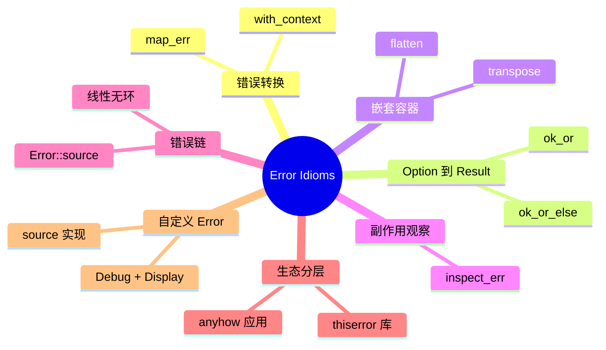

> **内容分级**: [进阶]
> **本节关键术语**: 错误处理 · map_err · with_context · 错误链 · thiserror · anyhow — [完整对照表](../../00_meta/01_terminology/01_terminology_glossary.md)

# Rust 错误处理惯用法（Error Idioms）

> **EN**: Rust Error Handling Idioms
> **Summary**: Idiomatic Rust error-handling patterns: `map_err`, `with_context`, `ok_or`/`ok_or_else`, `transpose`, `flatten`, `inspect_err`, error chains via `Error::source()`, and the thiserror/anyhow layering strategy.
>
> **Rust 版本**: 1.97.0+ (Edition 2024)
> **受众**: [进阶]
> **Bloom 层级**: L3-L4
> **权威来源**: 本文件为 `concept/` 权威页。
> **定位**: 本页聚焦 Rust 错误处理的**惯用组合子与工程分层**，是 `01_error_handling.md` 的进阶补充与 `02_error_handling_deep_dive.md` 的实战聚焦页。
>
> **前置概念**: [Error Handling Basics](../../01_foundation/08_error_handling/01_error_handling_basics.md) · [Error Handling Deep Dive](02_error_handling_deep_dive.md) · [Type Conversions](../04_types_and_conversions/07_type_conversions.md)
> **后置概念**: [Async Error Handling](../../03_advanced/01_async/01_async.md) · [Logging and Observability](../../06_ecosystem/00_toolchain/02_logging_observability.md)

---

> **来源**:
> [The Rust Programming Language — Error Handling](https://doc.rust-lang.org/book/ch09-00-error-handling.html) ·
> [std::error::Error](https://doc.rust-lang.org/std/error/trait.Error.html) ·
> [thiserror crate](https://docs.rs/thiserror/latest/thiserror/) ·
> [anyhow crate](https://docs.rs/anyhow/latest/anyhow/) ·
> [Rust Error Handling Patterns](https://doc.rust-lang.org/rust-by-example/error.html) ·
> [RustBelt: Securing the Foundations of the Rust Programming Language](https://plv.mpi-sws.org/rustbelt/popl18/)

---

## 📑 目录

- [Rust 错误处理惯用法（Error Idioms）](#rust-错误处理惯用法error-idioms)
  - [📑 目录](#-目录)
  - [一、错误处理组合子速查](#一错误处理组合子速查)
  - [二、`map_err`：转换错误类型](#二map_err转换错误类型)
  - [三、`with_context` / `context`：添加上下文](#三with_context--context添加上下文)
  - [四、`ok_or` / `ok_or_else`：Option → Result](#四ok_or--ok_or_elseoption--result)
  - [五、`transpose` 与 `flatten`：嵌套容器](#五transpose-与-flatten嵌套容器)
    - [5.1 `transpose`](#51-transpose)
    - [5.2 `flatten`](#52-flatten)
  - [六、`inspect_err`：不中断错误链的副作用](#六inspect_err不中断错误链的副作用)
  - [七、错误链与 `Error::source()`](#七错误链与-errorsource)
  - [八、thiserror / anyhow 分层](#八thiserror--anyhow-分层)
    - [8.1 库层：thiserror](#81-库层thiserror)
    - [8.2 应用层：anyhow](#82-应用层anyhow)
    - [8.3 分层协作](#83-分层协作)
  - [九、自定义 Error trait](#九自定义-error-trait)
  - [十、反例与陷阱](#十反例与陷阱)
    - [反例 1：`map_err` 丢失原始错误](#反例-1map_err-丢失原始错误)
    - [反例 2：`ok_or` 构造昂贵错误](#反例-2ok_or-构造昂贵错误)
    - [反例 3：混用 anyhow 与 thiserror 丢失上下文](#反例-3混用-anyhow-与-thiserror-丢失上下文)
  - [十一、边界测试](#十一边界测试)
    - [11.1 边界测试：`ok_or_else` 的惰性求值](#111-边界测试ok_or_else-的惰性求值)
    - [11.2 边界测试：`transpose` 处理 `Some(Err)`](#112-边界测试transpose-处理-someerr)
    - [11.3 边界测试：错误链循环导致栈溢出](#113-边界测试错误链循环导致栈溢出)
  - [十二、思维导图](#十二思维导图)
  - [十三、国际权威参考](#十三国际权威参考)

---

## 一、错误处理组合子速查

| 组合子 | 签名要点 | 用途 |
|:---|:---|:---|
| `map_err` | `Result<T, E> → Result<T, F>` | 转换错误类型，同时保留上下文 |
| `with_context` | `Result<T, E> → Result<T, anyhow::Error>` | 动态添加上下文（anyhow/eyre） |
| `ok_or` | `Option<T> → Result<T, E>` | 把 `None` 转为固定错误 |
| `ok_or_else` | `Option<T> → Result<T, E>` | 把 `None` 转为惰性错误 |
| `transpose` | `Option<Result<T, E>> → Result<Option<T>, E>` | 交换容器嵌套 |
| `flatten` | `Result<Result<T, E>, E> → Result<T, E>` | 扁平化嵌套 Result |
| `inspect_err` | `Result<T, E> → Result<T, E>` | 观察错误但不改变 |
| `Error::source` | `&dyn Error → Option<&dyn Error>` | 遍历错误因果链 |

---

## 二、`map_err`：转换错误类型

当 `?` 的自动 `From` 转换不够精确，或需要进行有损转换时，使用 `map_err`。

```rust
use std::fs::File;
use std::io;

#[derive(Debug)]
enum AppError {
    Config(String),
    Io(io::Error),
}

fn open_config(path: &str) -> Result<File, AppError> {
    File::open(path).map_err(|e| AppError::Io(e))
}

fn parse_timeout(s: &str) -> Result<u64, AppError> {
    s.parse::<u64>()
        .map_err(|e| AppError::Config(format!("invalid timeout '{}': {}", s, e)))
}
```

> **原则**：`map_err` 是"有损升格"——你把底层错误信息包装成更上层的领域错误。与 `From` 的"无损转换"相对。来源: [std::result::Result::map_err](https://doc.rust-lang.org/std/result/enum.Result.html#method.map_err)

---

## 三、`with_context` / `context`：添加上下文

`anyhow` 提供的 `Context` trait 让你在不丢失原始错误的情况下，附加人类可读的上下文。

```rust
use std::fs;
use anyhow::Context;

fn read_settings(path: &str) -> anyhow::Result<String> {
    fs::read_to_string(path)
        .with_context(|| format!("failed to read settings from {}", path))
}

fn main() -> anyhow::Result<()> {
    let content = read_settings("app.toml")?;
    println!("{}", content);
    Ok(())
}
```

> **注意**：`context` 是立即求值，`with_context` 是惰性求值。错误路径才需要上下文时，优先 `with_context`。来源: [anyhow::Context](https://docs.rs/anyhow/latest/anyhow/trait.Context.html)

---

## 四、`ok_or` / `ok_or_else`：Option → Result

把 `Option` 转成 `Result`，当值为 `None` 时返回错误。

```rust
#[derive(Debug, PartialEq)]
struct User { id: u64 }

fn find_user(_id: u64) -> Option<User> { None }

fn get_user(id: u64) -> Result<User, &'static str> {
    find_user(id).ok_or("user not found")
}

// 若错误构造有成本，用 ok_or_else
fn get_user_lazy(id: u64) -> Result<User, String> {
    find_user(id).ok_or_else(|| format!("user {} not found", id))
}
```

反例：

```rust,ignore
// ❌ 非惯用：match 显式展开
let user = match find_user(id) {
    Some(u) => Ok(u),
    None => Err("user not found"),
};
```

---

## 五、`transpose` 与 `flatten`：嵌套容器

### 5.1 `transpose`

`Option<Result<T, E>>` 与 `Result<Option<T>, E>` 互换位置。

```rust
fn batch_parse(inputs: &[&str]) -> Result<Option<Vec<i32>>, std::num::ParseIntError> {
    if inputs.is_empty() {
        return Ok(None);
    }
    let nums: Vec<i32> = inputs
        .iter()
        .map(|s| s.parse())
        .collect::<Result<Vec<_>, _>>()?;
    Ok(Some(nums))
}

fn main() {
    let r = batch_parse(&["1", "2", "3"]).transpose();
    assert_eq!(r, Some(Ok(vec![1, 2, 3])));
}
```

### 5.2 `flatten`

`Result<Result<T, E>, E>` 扁平化为 `Result<T, E>`。

```rust
fn nested_result() -> Result<Result<i32, &'static str>, &'static str> {
    Ok(Ok(42))
}

fn main() {
    let flat: Result<i32, &'static str> = nested_result().flatten();
    assert_eq!(flat, Ok(42));
}
```

---

## 六、`inspect_err`：不中断错误链的副作用

`inspect_err` 在 `Result` 为 `Err` 时执行闭包，但不改变结果本身，适合日志、指标、调试。

```rust
use std::fs::File;

fn open_logged(path: &str) -> Result<File, std::io::Error> {
    File::open(path).inspect_err(|e| {
        eprintln!("failed to open {}: {}", path, e);
    })
}
```

> **注意**：`inspect_err` 稳定于 Rust 1.76。更早版本可用 `map_err` + 返回原错误模拟，但语义不如 `inspect_err` 清晰。来源: [std::result::Result::inspect_err](https://doc.rust-lang.org/std/result/enum.Result.html#method.inspect_err)

---

## 七、错误链与 `Error::source()`

`std::error::Error::source()` 返回导致当前错误的下一个错误，形成**错误因果链**。打印完整链可帮助定位根因。

```rust
use std::error::Error;
use std::fmt;

#[derive(Debug)]
enum ServiceError {
    Db(std::io::Error),
    Config(String),
}

impl fmt::Display for ServiceError {
    fn fmt(&self, f: &mut fmt::Formatter<'_>) -> fmt::Result {
        match self {
            ServiceError::Db(e) => write!(f, "database error: {}", e),
            ServiceError::Config(s) => write!(f, "config error: {}", s),
        }
    }
}

impl Error for ServiceError {
    fn source(&self) -> Option<&(dyn Error + 'static)> {
        match self {
            ServiceError::Db(e) => Some(e),
            ServiceError::Config(_) => None,
        }
    }
}

fn print_chain(err: &dyn Error) {
    let mut current: Option<&dyn Error> = Some(err);
    while let Some(e) = current {
        println!("{}", e);
        current = e.source();
    }
}
```

> **原则**：错误链应保持**线性无环**。手写 `source()` 时若形成环，会导致 `Display` 或 `Debug` 递归栈溢出。来源: [std::error::Error::source](https://doc.rust-lang.org/std/error/trait.Error.html#method.source)

---

## 八、thiserror / anyhow 分层

### 8.1 库层：thiserror

库代码需要精确错误类型，便于调用方 `match` 与恢复。

```rust
use thiserror::Error;
use std::io;

#[derive(Debug, Error)]
pub enum ConfigError {
    #[error("io error reading {path}: {source}")]
    Read { path: String, #[source] source: io::Error },

    #[error("invalid field {field}: {message}")]
    InvalidField { field: String, message: String },

    #[error("missing required field {0}")]
    MissingField(String),
}
```

### 8.2 应用层：anyhow

应用代码通常不需要匹配具体错误，只需要把错误传播到顶层并打印。

```rust
use anyhow::{Context, Result};
use std::fs;

fn load_app() -> Result<()> {
    let config = fs::read_to_string("app.toml")
        .with_context(|| "loading app configuration")?;
    let _settings: toml::Value = config
        .parse()
        .with_context(|| "parsing app.toml")?;
    Ok(())
}
```

### 8.3 分层协作

```text
库 (thiserror 枚举) → 应用 (anyhow::Error) → 顶层 (打印/上报)
         ↑                    ↑
    精确匹配              上下文追踪
```

---

## 九、自定义 Error trait

当无法依赖 `thiserror` 时（如 `no_std` 场景），手动实现 `Error` trait。

```rust
use std::error::Error;
use std::fmt;

#[derive(Debug)]
pub struct ParseConfigError {
    line: usize,
    message: String,
}

impl fmt::Display for ParseConfigError {
    fn fmt(&self, f: &mut fmt::Formatter<'_>) -> fmt::Result {
        write!(f, "config parse error at line {}: {}", self.line, self.message)
    }
}

impl Error for ParseConfigError {}
```

> **注意**：`Error` trait 要求 `Debug + Display`。`source()` 默认返回 `None`。来源: [std::error::Error](https://doc.rust-lang.org/std/error/trait.Error.html)

---

## 十、反例与陷阱

### 反例 1：`map_err` 丢失原始错误

```rust,ignore
// ❌ 错误信息丢失
let n = s.parse::<i32>().map_err(|_| "parse failed")?;

// ✅ 保留原始错误
let n = s.parse::<i32>().map_err(|e| format!("parse failed: {}", e))?;
```

### 反例 2：`ok_or` 构造昂贵错误

```rust,ignore
// ❌ 即使 Some 也会构造错误字符串
let user = find_user(id).ok_or(format!("user {} not found", id))?;

// ✅ 惰性构造
let user = find_user(id).ok_or_else(|| format!("user {} not found", id))?;
```

### 反例 3：混用 anyhow 与 thiserror 丢失上下文

```rust,compile_fail
use eyre::Result;

fn may_fail() -> anyhow::Result<i32> {
    anyhow::bail!("error")
}

fn main() -> Result<()> {
    let _ = may_fail()?; // ❌ eyre::Result 与 anyhow::Result 不直接兼容
    Ok(())
}
```

> **修正**：一个应用统一使用 `anyhow` 或 `eyre`，不要混用。来源: [anyhow docs](https://docs.rs/anyhow/)

---

## 十一、边界测试

### 11.1 边界测试：`ok_or_else` 的惰性求值

```rust
fn main() {
    let opt: Option<i32> = Some(42);
    let result = opt.ok_or_else(|| {
        println!("error constructed");
        "failed"
    });
    assert_eq!(result, Ok(42));
    // "error constructed" 不会被打印
}
```

> **诊断**: `ok_or_else` 仅在 `None` 时调用闭包，`Some` 时零额外成本。来源: [std::option::Option::ok_or_else](https://doc.rust-lang.org/std/option/enum.Option.html#method.ok_or_else)

### 11.2 边界测试：`transpose` 处理 `Some(Err)`

```rust
fn main() {
    let x: Option<Result<i32, &str>> = Some(Err("bad"));
    let y: Result<Option<i32>, &str> = x.transpose();
    assert_eq!(y, Err("bad"));
}
```

> **诊断**: `transpose` 把 `Some(Err)` 变成 `Err`，把 `None` 变成 `Ok(None)`。来源: [std::option::Option::transpose](https://doc.rust-lang.org/std/option/enum.Option.html#method.transpose)

### 11.3 边界测试：错误链循环导致栈溢出

```rust,ignore
use std::error::Error;
use std::fmt;
use std::sync::Arc;

#[derive(Debug)]
struct CyclicError {
    source: Option<Arc<dyn Error + Send + Sync>>,
}

impl fmt::Display for CyclicError {
    fn fmt(&self, f: &mut fmt::Formatter<'_>) -> fmt::Result { write!(f, "cyclic") }
}

impl Error for CyclicError {
    fn source(&self) -> Option<&(dyn Error + 'static)> {
        self.source.as_ref().map(|e| e.as_ref() as &(dyn Error + 'static))
    }
}

// 若把 source 指向自身，遍历错误链将无限递归
```

> **修正**: 错误链必须是有向无环图；使用 `anyhow`/`thiserror` 自动生成链可避免此类 bug。来源: [std::error::Error::source](https://doc.rust-lang.org/std/error/trait.Error.html#method.source)

---

## 十二、思维导图



> **认知功能**: 本 mindmap 按"转换 → 构造 → 嵌套 → 观察 → 链 → 分层"组织错误处理惯用法，覆盖从单点错误操作到系统错误架构的完整路径。来源: [TRPL — Error Handling](https://doc.rust-lang.org/book/ch09-00-error-handling.html)

---

## 十三、国际权威参考

- **P0 官方**: [std::error::Error](https://doc.rust-lang.org/std/error/trait.Error.html)
- **P0 官方**: [The Rust Programming Language — Error Handling](https://doc.rust-lang.org/book/ch09-00-error-handling.html)
- **P1 生态**: [thiserror crate](https://docs.rs/thiserror/latest/thiserror/)
- **P1 生态**: [anyhow crate](https://docs.rs/anyhow/latest/anyhow/)
- **P1 生态**: [Rust Error Handling Patterns](https://doc.rust-lang.org/rust-by-example/error.html)
- **P1 书籍**: [Rust for Rustaceans](https://rust-for-rustaceans.com/)

---

> **权威来源**: [std::error::Error](https://doc.rust-lang.org/std/error/trait.Error.html), [thiserror](https://docs.rs/thiserror/), [anyhow](https://docs.rs/anyhow/)
> **状态**: ✅ 概念文件创建完成
> **最后更新**: 2026-07-30
