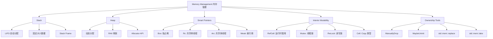
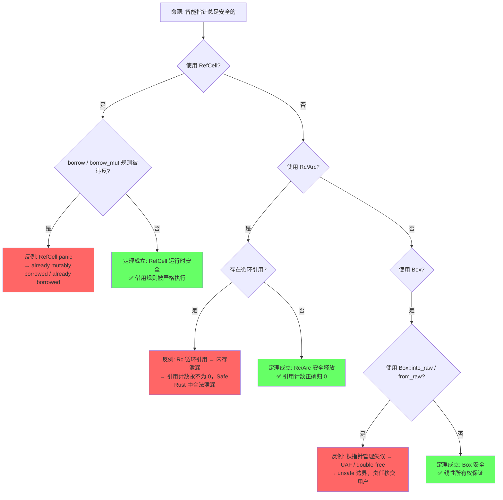
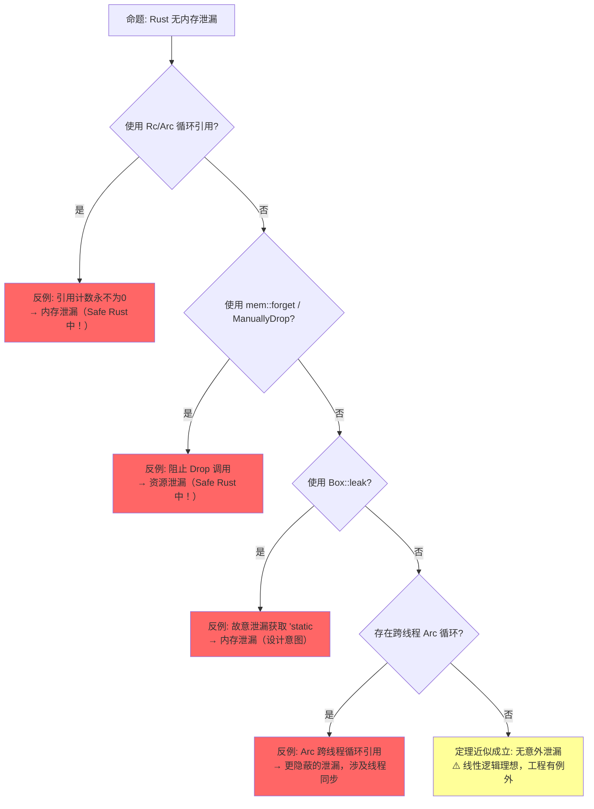
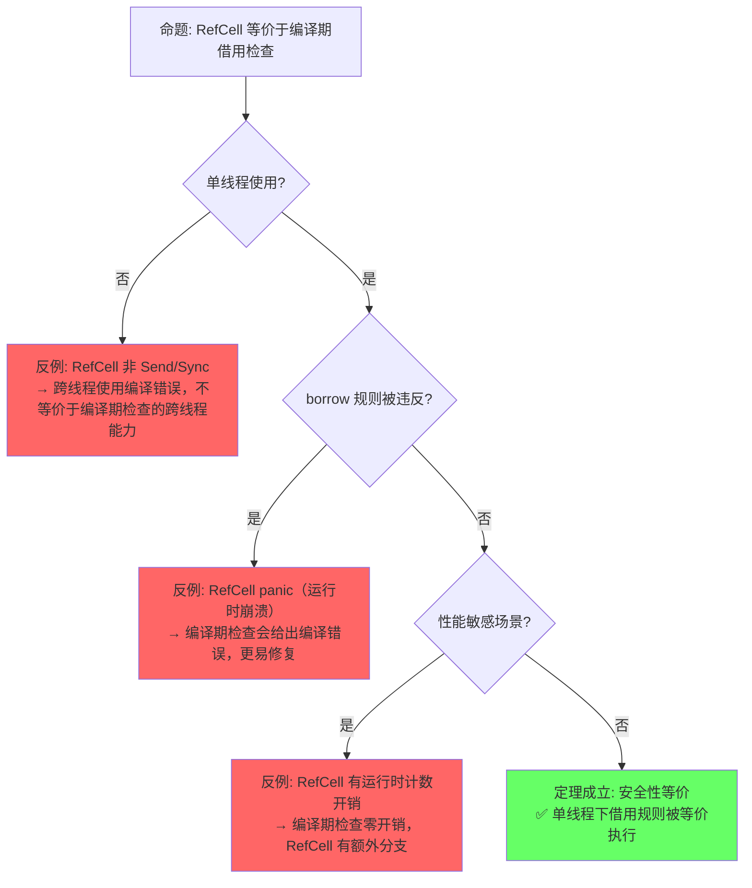
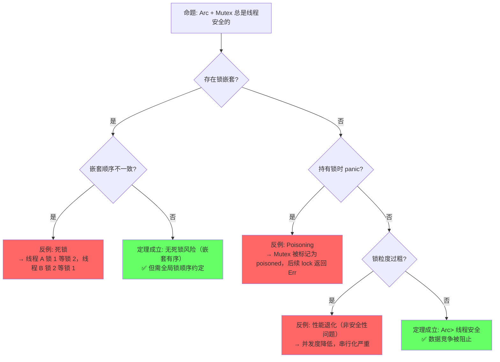

# Memory Management（内存管理）

> **层级**: L2 进阶概念
> **前置概念**: [Ownership](../01_foundation/01_ownership.md) · [Borrowing](../01_foundation/02_borrowing.md) · [Type System](../01_foundation/04_type_system.md)
> **后置概念**: [Unsafe Rust](../03_advanced/03_unsafe.md) · [Concurrency](../03_advanced/01_concurrency.md) · [Async](../03_advanced/02_async.md)
> **主要来源**: [TRPL: Ch4.1-4.3](https://doc.rust-lang.org/book/ch04-01-what-is-ownership.html) · [TRPL: Ch15](https://doc.rust-lang.org/book/ch15-00-smart-pointers.html) · [Rust Reference: Memory Model] · [Wikipedia: Memory management]

---

**变更日志**:

- v2.0 (2026-05-12): 深度重构——补充定理推理链（⟹ 标注）、反命题决策树系统、边界极限测试、6步认知路径与章节过渡
- v1.0 (2026-05-12): 初始版本

---

## 一、权威定义（Definition）

### 1.1 Wikipedia 对齐定义

> **[Wikipedia: Memory management]** Memory management is a form of resource management applied to computer memory. The essential requirement of memory management is to provide ways to dynamically allocate portions of memory to programs at their request, and free it for reuse when no longer needed.

> **[Wikipedia: Rust]** Rust achieves memory safety without garbage collection by using an ownership model, where each value has a unique owner, and the value is dropped when the owner goes out of scope. Values can be immutably borrowed by any number of references or mutably borrowed by exactly one reference at a time.

### 1.2 TRPL 官方定义

> **[TRPL: Ch4.1]** The stack stores values in the order it gets them and removes the values in the opposite order. This is referred to as last in, first out. The heap is less organized: when you put data on the heap, you request a certain amount of space. The memory allocator finds an empty spot in the heap that is big enough, marks it as being in use, and returns a pointer.

> **[TRPL: Ch15]** A smart pointer is a data structure that acts like a pointer but also has additional metadata and capabilities. The concept of smart pointers isn't unique to Rust: smart pointers originated in C++ and exist in other languages as well. In Rust, smart pointers own the data they point to.

### 1.3 形式化定义

> **[Rustonomicon: Ownership] · [线性逻辑]** Rust 内存模型形式化为栈帧自动管理 + 堆分配显式所有权的组合。 ✅ 已验证

Rust 的内存模型可以形式化为**栈帧自动管理 + 堆分配显式所有权**的组合：

```text
栈语义（操作语义简化）:
  进入作用域:  stack.push(Frame { vars: {} })
  变量声明:    frame.vars[name] = Value::Uninitialized
  赋值:        frame.vars[name] = value
  离开作用域:  for v in frame.vars.values() { drop(v) }; stack.pop()

堆语义:
  let p = Box::new(x)  →  heap.alloc(size_of(x)).write(x); Own(p)
  drop(Box)            →  heap.dealloc(p); Own(p) 消耗
```

> **过渡到属性矩阵**: 从形式化定义出发，内存管理不仅是"堆 vs 栈"的二元区分，而是由多种所有权模型（独占、共享、弱引用）和可变性模式（编译期检查、运行时检查、原子操作）构成的多维空间。下一节通过属性矩阵对这些机制进行系统分类。

---

## 二、概念属性矩阵（Attribute Matrix）

### 2.1 Stack vs Heap 对比矩阵

| **维度** | **Stack** | **Heap** |
|:---|:---|:---|
| **分配时机** | 编译期确定 | 运行时动态请求 |
| **分配速度** | 极快（指针移动） | 较慢（分配器查找） |
| **布局** | 连续、LIFO | 可能碎片化 |
| **大小限制** | 通常较小（~8MB 默认） | 受系统内存限制 |
| **生命周期** | 与作用域绑定（自动） | 与所有者绑定（手动/RAII） |
| **访问模式** | CPU 缓存友好 | 可能缓存不友好（碎片化） |
| **典型类型** | 标量、元组、数组、引用 | `Box<T>`、`Vec<T>`、`String` |
| **溢出后果** | Stack overflow（panic/segfault） | OOM（panic） |

### 2.2 智能指针对比矩阵

| **智能指针** | **所有权模型** | **可变性** | **线程安全** | **典型用途** |
|:---|:---|:---|:---|:---|
| `Box<T>` | 独占 | 通过 `&mut` / `T` 内部可变 | 若 `T: Send` | 堆分配、递归类型、trait object |
| `Rc<T>` | 共享引用计数 | 不可变（需 `RefCell`） | ❌ 非 Send | 单线程共享所有权 |
| `Arc<T>` | 共享原子计数 | 不可变（需 `Mutex`/`RwLock`） | ✅ Send+Sync | 多线程共享所有权 |
| `RefCell<T>` | 运行时借用检查 | 内部可变性 | ❌ 非 Send | 单线程内部可变 |
| `Mutex<T>` | 锁保护 | 内部可变性 | ✅ Send | 多线程互斥访问 |
| `RwLock<T>` | 读写锁 | 内部可变性 | ✅ Send | 多读单写 |
| `Weak<T>` | 弱引用（不增加计数） | 不可变 | 视 `Rc`/`Arc` | 打破循环引用 |

### 2.3 内部可变性模式矩阵

| **组合** | **线程安全** | **运行时检查** | **使用场景** |
|:---|:---|:---|:---|
| `RefCell<T>` | 单线程 | 运行时借用检查（panic） | 单线程内部可变 |
| `Mutex<T>` | 多线程 | 互斥锁（阻塞/死锁风险） | 多线程互斥修改 |
| `RwLock<T>` | 多线程 | 读写锁 | 多读少写场景 |
| `AtomicT` | 多线程 | 硬件原子操作 | 简单计数器、标志 |
| `Cell<T>` | 单线程 | 无（仅 `Copy` 类型） | 单线程简单内部可变 |

> **过渡到思维导图**: 属性矩阵展示了内存管理机制的静态分类，但未能表达概念间的动态关联与使用场景。思维导图通过拓扑结构揭示内存管理从栈/堆分配、所有权传递到智能指针组合的完整概念网络。

---

## 三、思维导图（Mind Map）



> **过渡到定理推理链**: 思维导图呈现了内存管理的概念拓扑，但缺乏严格的逻辑推导关系。下一节通过"⟹"标注的定理链，将 Box 所有权、Rc/Arc 共享安全、RefCell 运行时检查等核心命题形式化为可验证的推理网络。

---

## 四、定理推理链（Theorem Chain）

### 4.1 引理：Box<T> ⟹ 堆分配 + 唯一所有权

> **[TRPL: Ch15] · [Rust Reference: Box]** Box<T> 的语义是堆分配与唯一所有权的组合，对应线性逻辑中的资源唯一拥有。 ✅ 已验证

```text
前提 1: Box::new(x) 在堆上分配 size_of::<T>() 字节并写入 x
前提 2: Box<T> 实现 Deref/DerefMut，但保持唯一所有权
前提 3: Box<T> 离开作用域时调用 Drop，释放堆内存
    ↓
引理: Box<T> ⟹ 堆分配 + 唯一所有权
    ↓
定理: 通过 Box<T> 访问的堆内存不会出现 use-after-free 或 double-free
    ↓
推论: Box::leak 故意放弃所有权获取 &'static T，是定理的合法例外
边界: Box::into_raw / from_raw 将所有权管理移交给用户（unsafe 边界）
```

### 4.2 定理：Rc/Arc ⟹ 共享所有权安全（引用计数）

> **[TRPL: Ch15] · [std docs: Rc/Arc]** Rc（单线程）和 Arc（多线程）通过引用计数实现共享所有权的安全释放。 ✅ 已验证

```text
前提 1: Rc::new 创建时强引用计数 = 1
前提 2: Rc::clone 增加引用计数（不复制数据）
前提 3: Rc 离开作用域时减少引用计数，若归零则释放堆内存
前提 4: Arc 使用原子操作保证多线程安全（内存序: Relaxed/Release-Acquire）
    ↓
定理: Rc/Arc ⟹ 共享所有权安全（引用计数）
    ↓
推论 1: Rc 单线程共享无需锁，Arc 多线程共享通过原子计数
推论 2: 循环引用导致引用计数永不为零 → 内存泄漏（Safe Rust 的已知边界）
边界: Weak 引用不增加强引用计数，是打破循环引用的标准解
```

### 4.3 推论：RefCell ⟹ 内部可变性运行时检查

> **[TRPL: Ch15] · [std docs: RefCell]** RefCell 在单线程运行时检查借用规则，提供与编译期检查等价的安全性。 ✅ 已验证

```text
前提 1: RefCell<T> 在运行时维护 borrow/borrow_mut 状态机
前提 2: borrow() 检查当前无可变借用；borrow_mut() 检查当前无任何借用
前提 3: 违反规则时立即 panic（而非编译错误）
    ↓
引理: RefCell 的运行时检查与编译期借用检查逻辑等价
    ↓
推论: RefCell ⟹ 内部可变性运行时检查
    ↓
边界 1: 跨线程使用 RefCell 是 unsafe（未实现 Send/Sync）
边界 2: panic 是不可恢复的运行时错误（对比编译期错误的可修复性）
边界 3: RefCell + Rc 组合是循环引用的经典陷阱场景
```

### 4.4 RAII + 所有权 ⟹ 确定性释放

> **[TRPL: Ch4.1] · [TRPL: Ch15] · [Rust Reference: Drop]** RAII 确定性释放由所有权规则和 Drop trait 自动调用保证。 ✅ 已验证

```text
前提 1: 每个堆分配值由唯一所有者管理（Box）或引用计数管理（Rc/Arc）
前提 2: 所有者离开作用域时自动调用 Drop
前提 3: Rc/Arc 的 Drop 在计数归零时释放内存
    ↓
定理: Rust 堆内存的释放时机是确定性的（无 GC 停顿）
    ↓
推论: 适用于实时系统、嵌入式、游戏引擎等延迟敏感场景
例外: 循环引用导致的泄漏（Rc 限制）、panic 时的资源清理（通常仍安全）
```

### 4.5 定理一致性矩阵

> **[原创分析] · [std docs] · [Rustonomicon]** 运行时内存管理定理基于 std 文档和 Rustonomicon 的运行时语义。 💡 原创分析

| **定理/引理/推论** | **前提** | **结论** | **依赖的 L4 公理** | **被哪些定理依赖** | **失效条件** | **典型场景** |
|:---|:---|:---|:---|:---|:---|:---|
| **引理**: Box ⟹ 堆分配 + 唯一所有权 | 单线程 | 堆内存安全释放 | 线性逻辑 ⊗ | 所有堆分配场景 | `Box::leak`、`mem::forget` | — |
| **定理**: Rc 共享安全 | 单线程 | 共享所有权无 UAF | 引用计数不变式 | 图结构、共享状态 | 循环引用 | 内存泄漏 |
| **定理**: Arc 跨线程共享 | 多线程 | 原子引用计数安全 | 原子操作语义 | 并发共享状态 | 循环引用 + 跨线程 | 内存泄漏 |
| **推论**: RefCell 运行时借用 | 单线程 | 运行时检测借用违规 | —（运行时机制） | 内部可变性模式 | 已借出时再次借用 | panic |
| **引理**: Cell 无检查可变 | 单线程 + T: Copy | 无运行时检查的内部可变 | Copy 语义 | 简单计数器 | 非 Copy 类型 | 编译错误 |
| **定理**: Mutex 互斥安全 | 多线程 | 互斥访问无数据竞争 | 锁不变式 | 并发修改 | 死锁、 poisoning | 阻塞/panic |
| **推论**: Weak 打破循环 | Rc/Arc 存在 | 不阻止强引用释放 | 引用计数不变式 | 树/图结构 | upgrade 返回 None | 安全解引用 |
| **引理**: Pin 不动性 | `!Unpin` 类型 | 内存地址恒定 | —（部分形式化） | 自引用结构、async | 实现 `Unpin` 错误 | UB |

> **一致性检查**: Box（独占）⟹ Rc（单线程共享）⟹ Arc（多线程共享）⟹ RefCell（内部可变），形成**从严格到宽松**的能力递进链。Pin 是独立维度（位置稳定性），Weak 是共享所有权的补充（不拥有）。
>
> **关键洞察**: Rc/Arc/RefCell 的定理**不在 L4 形式化范围内**（运行时机制），是工程折衷而非编译期证明。Box 的所有权可由线性逻辑完全编码。
>
> **跨层映射**: 本文件定理 ↔ [`00_meta/inter_layer_map.md`](../00_meta/inter_layer_map.md) §4.1 "内存安全完备性"

> **过渡到示例与反例**: 定理链提供了形式化与工程保证，但实践中这些保证的边界在哪里？下一节通过正例展示智能指针的正确使用方式，通过反例揭示定理失效的精确条件——特别是 Rc 循环引用、RefCell panic、内存泄漏等边界场景。

---

## 五、示例与反例（Examples & Counter-examples）

### 5.1 正确示例：Box 堆分配

```rust
// ✅ 正确: Box 提供堆分配 + 自动释放
fn main() {
    let b = Box::new(5);  // 5 被分配到堆上
    println!("{}", b);     // 解引用访问
} // b 在这里离开作用域，堆内存自动释放（drop）
```

### 5.2 正确示例：Rc 共享所有权

```rust
// ✅ 正确: Rc 实现单线程共享所有权
use std::rc::Rc;

fn main() {
    let data = Rc::new(String::from("shared"));
    let data2 = Rc::clone(&data);  // 引用计数 +1
    let data3 = Rc::clone(&data);  // 引用计数 +1

    println!("count = {}", Rc::strong_count(&data));  // 3
    println!("{}, {}, {}", data, data2, data3);
} // 三个 Rc 依次 drop，最后一个释放堆内存
```

### 5.3 正确示例：用 Weak 打破循环引用

```rust
// ✅ 正确: Weak 引用不增加计数，打破循环
use std::rc::{Rc, Weak};
use std::cell::RefCell;

struct Node {
    value: i32,
    parent: RefCell<Weak<Node>>,     // Weak: 不拥有子节点
    children: RefCell<Vec<Rc<Node>>>, // Rc: 拥有子节点
}

fn main() {
    let leaf = Rc::new(Node {
        value: 3,
        parent: RefCell::new(Weak::new()),
        children: RefCell::new(vec![]),
    });

    let branch = Rc::new(Node {
        value: 5,
        parent: RefCell::new(Weak::new()),
        children: RefCell::new(vec![Rc::clone(&leaf)]),
    });

    *leaf.parent.borrow_mut() = Rc::downgrade(&branch);
    // leaf ↔ branch 的循环被 Weak 打破
} // 正常释放，无泄漏
```

### 5.4 反例：Rc 循环引用导致泄漏

```rust
// ❌ 反例: Rc 循环引用导致内存泄漏
use std::rc::Rc;
use std::cell::RefCell;

struct BadNode {
    value: i32,
    next: RefCell<Option<Rc<BadNode>>>,
}

fn main() {
    let a = Rc::new(BadNode { value: 1, next: RefCell::new(None) });
    let b = Rc::new(BadNode { value: 2, next: RefCell::new(None) });

    *a.next.borrow_mut() = Some(Rc::clone(&b));
    *b.next.borrow_mut() = Some(Rc::clone(&a));

    // a 的计数 = 2（a 变量 + b.next）
    // b 的计数 = 2（b 变量 + a.next）
    // 离开作用域后: a 变量 drop → a 计数 = 1（不释放）
    //              b 变量 drop → b 计数 = 1（不释放）
    // 结果: 内存泄漏！（Rust 中 leaks 不被视为 unsafe）
}
```

### 5.5 反例：RefCell 运行时借用冲突（panic）

```rust
// ❌ 反例: RefCell 运行时 panic
use std::cell::RefCell;

fn main() {
    let c = RefCell::new(String::from("hello"));
    let _borrow = c.borrow_mut();   // 可变借用
    let _borrow2 = c.borrow();      // already mutably borrowed
    // thread 'main' panicked at 'already mutably borrowed: BorrowError'
}
```

**修正方案**：

```rust
// ✅ 修正: 确保借用不重叠（编译期或运行时）
use std::cell::RefCell;

fn main() {
    let c = RefCell::new(String::from("hello"));
    {
        let mut borrow = c.borrow_mut();
        borrow.push_str(" world");
    } // 可变借用在这里结束
    let borrow2 = c.borrow();  // ✅ 现在可以不可变借用
    println!("{}", borrow2);
}
```

> **过渡到反命题分析**: 示例展示了内存管理的正确使用方式，但反例只是孤立场景。下一节通过系统化的反命题分析，将"智能指针安全定理何时成立/何时失效"形式化为可遍历的决策树，覆盖编译期、运行时、语义、工程四个层面。

---

## 六、反命题与边界分析（Counter-proposition & Boundary Analysis）

> **[Rust Reference: Safety] · [TRPL: Ch15] · [Rustonomicon]** 反命题分析基于内存管理的形式化语义和已知边界案例。 ✅ 已验证

### 6.1 反命题 1: "智能指针总是安全的"

> 运行时层 — 智能指针在正确使用下安全，但误用会导致 panic 或泄漏。



**四层分析**:

| **层面** | **分析** | **结果** |
|:---|:---|:---|
| 编译期 | RefCell 借用违规编译通过（运行时检查） | ⚠️ 延迟发现 |
| 运行时 | 违规时 panic（非 UB），循环引用时泄漏 | ⚠️ 有边界 |
| 语义 | Rust 不将泄漏视为 unsafe（设计决策） | ✅ 语义明确 |
| 工程 | Weak 打破循环、避免 borrow 嵌套是标准实践 | ✅ 可解 |

### 6.2 反命题 2: "Rust 无内存泄漏"

> 语义层 — Rust 保证无 UAF/double-free，但不保证无泄漏。



**四层分析**:

| **层面** | **分析** | **结果** |
|:---|:---|:---|
| 编译期 | 泄漏场景均编译通过（非编译错误） | ⚠️ 无编译期阻止 |
| 运行时 | 循环引用和 forget 导致实际泄漏 | ❌ 可能泄漏 |
| 语义 | Rust 安全定义排除泄漏（仅排除 UAF/DF） | ✅ 语义明确 |
| 工程 | clippy 有 `mem_forget` lint，Weak 是标准解 | ✅ 可缓解 |

### 6.3 反命题 3: "RefCell 等价于编译期借用检查"

> 运行时层 — RefCell 与编译期检查在安全性上等价，但在错误处理方式和性能上不同。



**四层分析**:

| **层面** | **分析** | **结果** |
|:---|:---|:---|
| 编译期 | RefCell 借用违规编译通过 | ⚠️ 延迟发现 |
| 运行时 | 违规时 panic（非 UB），性能有计数开销 | ⚠️ 有代价 |
| 语义 | 单线程下逻辑等价（互斥/共享规则一致） | ✅ 语义等价 |
| 工程 | 优先使用编译期检查，RefCell 是回退方案 | ✅ 有指导原则 |

### 6.4 反命题 4: "Arc + Mutex 总是线程安全的"

> 工程层 — Arc+Mutex 提供内存安全，但不提供死锁自由。



**四层分析**:

| **层面** | **分析** | **结果** |
|:---|:---|:---|
| 编译期 | 死锁不可编译期检测（Halting Problem） | ❌ 不可判定 |
| 运行时 | 死锁时永久阻塞，poisoning 可检测 panic | ⚠️ 部分保护 |
| 语义 | 内存安全保证成立（无数据竞争） | ✅ 安全 |
| 工程 | 锁顺序约定、锁粒度设计、try_lock 是实践标准 | ✅ 可缓解 |

> **过渡到边界极限测试**: 反命题决策树揭示了定理失效的逻辑路径，但极限测试将定理推向边界——通过代码展示极端场景下的精确行为，验证理论预测与实现的一致性。

---

## 七、边界极限测试代码（Boundary Limit Tests）

### 7.1 测试 1: Rc<RefCell<T>> 循环引用极限

```rust
use std::rc::Rc;
use std::cell::RefCell;

// 边界: Rc<RefCell<T>> 循环引用的精确计数

struct Node {
    value: i32,
    next: Option<Rc<RefCell<Node>>>,
}

fn main() {
    let a = Rc::new(RefCell::new(Node { value: 1, next: None }));
    let b = Rc::new(RefCell::new(Node { value: 2, next: None }));

    // 建立循环前
    println!("a count = {}", Rc::strong_count(&a)); // 1
    println!("b count = {}", Rc::strong_count(&b)); // 1

    a.borrow_mut().next = Some(b.clone());
    b.borrow_mut().next = Some(a.clone());

    // 建立循环后
    println!("a count = {}", Rc::strong_count(&a)); // 2
    println!("b count = {}", Rc::strong_count(&b)); // 2

    // 离开作用域: a 变量 drop → a 计数 = 1（不释放）
    //             b 变量 drop → b 计数 = 1（不释放）
    // 结果: 内存泄漏！
}

// 解决: 使用 Weak 打破循环
use std::rc::Weak;

struct NodeFixed {
    value: i32,
    next: Option<Weak<RefCell<NodeFixed>>>,  // Weak 不增加强引用计数
}
```

### 7.2 测试 2: RefCell 嵌套借用边界

```rust
use std::cell::RefCell;

// 边界: RefCell 嵌套借用的精确行为

fn main() {
    let c = RefCell::new(vec![1, 2, 3]);

    // ✅ 合法: 多次不可变借用
    let b1 = c.borrow();
    let b2 = c.borrow();
    println!("{:?} {:?}", b1, b2);
    drop(b1); drop(b2);

    // ✅ 合法: 单次可变借用
    let mut b3 = c.borrow_mut();
    b3.push(4);
    drop(b3);

    // ❌ 非法: 可变借用期间不可变借用
    // let mut b4 = c.borrow_mut();
    // let b5 = c.borrow();  // panic!

    // ❌ 非法: 两次可变借用
    // let b6 = c.borrow_mut();
    // let b7 = c.borrow_mut();  // panic!

    // 边界: RefCell 的 borrow_count 在运行时维护
    // 实现细节: 正数 = 不可变借用数，-1 = 可变借用，0 = 空闲
}
```

### 7.3 测试 3: Box::leak 与 ManuallyDrop 边界

```rust
use std::mem::ManuallyDrop;

// 边界: 故意放弃所有权的两种机制

fn box_leak_boundary() {
    let s = Box::new(String::from("leaked"));
    let leaked: &'static str = Box::leak(s);  // 故意泄漏，获取 'static
    // leaked 将永远存在，直到程序结束
    println!("{}", leaked);
}

fn manually_drop_boundary() {
    let mut b = ManuallyDrop::new(Box::new(42));

    // ✅ 合法: 获取内部值而不调用 Drop
    let inner = unsafe { ManuallyDrop::take(&mut b) };
    println!("{}", inner);

    // ❌ 危险: b 现在处于未定义状态，再次 drop 会导致 UAF
    // drop(b);  // UB! 已被 take

    // ✅ 安全: 使用 into_inner（如果值未被 take）
    // let b2 = ManuallyDrop::new(Box::new(100));
    // let inner2 = ManuallyDrop::into_inner(b2);  // 安全，因为未 take
}

fn forget_boundary() {
    let b = Box::new(String::from("forgotten"));
    std::mem::forget(b);  // 不调用 Drop，内存泄漏（但安全）
    // 用途: FFI 边界传递所有权给 C 代码
}
```

### 7.4 测试 4: Arc 跨线程原子序边界

```rust
use std::sync::Arc;
use std::thread;

// 边界: Arc 原子操作与内存序

fn arc_thread_safety() {
    let data = Arc::new(42);
    let mut handles = vec![];

    for _ in 0..10 {
        let cloned = Arc::clone(&data);
        handles.push(thread::spawn(move || {
            println!("{}", *cloned);  // 安全: Arc 保证数据同步可见
        }));
    }

    for h in handles { h.join().unwrap(); }
    println!("final count = {}", Arc::strong_count(&data)); // 1
}

// 边界: Arc 内部可变性需要 Mutex/RwLock
// Arc<RefCell<T>> 不能跨线程（RefCell: !Sync）
// Arc<Mutex<T>> 可以跨线程（Mutex<T>: Send）

fn arc_interior_mutability() {
    let data = Arc::new(std::sync::Mutex::new(0));
    let mut handles = vec![];

    for _ in 0..10 {
        let cloned = Arc::clone(&data);
        handles.push(thread::spawn(move || {
            let mut guard = cloned.lock().unwrap();
            *guard += 1;
        }));
    }

    for h in handles { h.join().unwrap(); }
    println!("{}", *data.lock().unwrap());  // 10
}
```

> **过渡到认知路径**: 边界测试验证了定理在极端条件下的行为，但从学习者的视角，内存管理概念如何从直觉逐步构建到形式化理解？下一节提供六步递进的认知路径，每步之间有过渡解释。

---

## 八、认知路径（Cognitive Path）

> **[原创分析] · [TRPL: Ch4.1] · [TRPL: Ch15]** 认知路径从所有权直觉到线性逻辑形式化的渐进映射。 💡 原创分析

### Step 1: 直觉类比 — "内存像房产"

**核心问题**: "Rust 怎么管理内存？没有 GC 怎么保证安全？"

**过渡解释**: 从熟悉的概念出发建立直觉锚点。将内存管理类比为房产交易：`Box<T>` 是"独家产权"（一人拥有，可安全处置）；`Rc<T>` 是"联名产权"（多人共有，最后一人处置）；`&T` 是"租赁合同"（只读使用，不拥有）；`&mut T` 是"独占租赁"（一人使用，可修改）。这个类比帮助学习者快速区分不同机制的所有权语义。从 Step 1 到 Step 2 的过渡发生在学习者写第一个 `Box::new` 时，发现堆内存确实"自动释放"——这引出 RAII 机制。

```text
直觉映射:
  Box<T>      ≈  独家拥有的房子（卖/拆由你决定）
  Rc<T>       ≈  联名产权房（所有人都放弃后才处置）
  &T          ≈  租赁合同（只看不住）
  &mut T      ≈  短期独占租约（暂时住进去改装修）
  RefCell<T>  ≈  灵活租赁协议（运行时检查是否冲突）
```

### Step 2: 语法熟悉 — 堆分配与智能指针

**核心问题**: "怎么用 Box/Rc/RefCell？它们的 API 长什么样？"

**过渡解释**: 在直觉锚定后，需要将抽象概念映射到具体语法。这一步覆盖 `Box::new`、`Rc::clone`、`RefCell::borrow/borrow_mut` 等核心 API。关键是建立"智能指针拥有数据，Drop 自动释放"的操作性理解。从 Step 2 到 Step 3 的过渡由困惑驱动：当学习者发现可以 `Rc::clone` 出多个所有者时，会问"如果两个人同时修改怎么办？"——这自然引出内部可变性模式。

```rust
// 核心语法模式:
let b = Box::new(5);                  // 堆分配
let r = Rc::new(vec![1, 2, 3]);      // 共享所有权
let c = RefCell::new(String::new());  // 内部可变性

Rc::clone(&r);                        // 增加引用计数
c.borrow_mut().push_str("hello");     // 运行时检查的可变借用
```

### Step 3: 规则困惑 — 借用检查与内部可变性

**核心问题**: "编译期不让我可变借用，RefCell 为什么可以？"

**过渡解释**: 语法熟练后，学习者遭遇编译期借用检查与 RefCell 运行时检查的矛盾。关键在于解释：编译期检查是"静态证明"（零运行时开销，但保守），RefCell 是"动态监控"（运行时开销，但更灵活）。这是 Rust 内存安全哲学的核心折衷——安全是多层次的，不是所有安全都能在编译期证明。从 Step 3 到 Step 4 的过渡由追问驱动："如果 Rc 让多人共享，RefCell 让运行时可变借用，那跨线程怎么办？"——引出 Arc/Mutex。

```text
可变性光谱:
  编译期可变:   &mut T（零开销，最严格）
  运行时可变:   RefCell<T>（panic 边界，单线程）
  线程安全可变: Mutex<T> / RwLock<T>（锁开销，多线程）
  原子可变:     AtomicT（硬件支持，仅限标量）
```

### Step 4: 并发扩展 — Arc 与线程安全

**核心问题**: "怎么在多线程间共享数据？"

**过渡解释**: 当学习者理解了单线程的共享所有权（Rc）和内部可变性（RefCell）后，自然的下一步是跨线程场景。`Arc<T>` 是 `Rc<T>` 的线程安全版本（原子计数），`Mutex<T>` 是 `RefCell<T>` 的线程安全版本（互斥锁）。关键是理解 `Send` 和 `Sync` 这两个 Auto Trait 如何决定类型能否跨线程。从 Step 4 到 Step 5 的过渡由问题驱动："如果 Rc 可以循环引用，会有什么问题？"——引出内存泄漏概念。

```text
线程安全映射:
  Rc<T>     →  Arc<T>      (引用计数原子化)
  RefCell<T> → Mutex<T>    (借用检查锁化)
  Cell<T>   →  AtomicT     (Copy 类型硬件原子化)
  Send:     T 可以跨线程转移所有权
  Sync:     &T 可以跨线程共享
```

### Step 5: 边界认知 — 泄漏、循环与 unsafe 边界

**核心问题**: "Rust 真的完全安全吗？泄漏是怎么回事？"

**过渡解释**: 学习者在前四步建立了对 Rust 内存安全的信任，这一步需要精确校准这种信任。Rust 的安全保证是：无 UAF、无 double-free、无数据竞争。但 Rust **不保证**无内存泄漏——Rc 循环引用和 `mem::forget` 都是 Safe Rust 中的合法泄漏。这不是缺陷，而是设计决策：防止泄漏需要运行时 GC 或限制性极强的类型系统，Rust 选择将泄漏排除在 unsafe 之外。从 Step 5 到 Step 6 的过渡是"从现象到原理"——理解为什么 Rust 做这种取舍。

```text
安全边界精确表述:
  ✅ 保证: 无 use-after-free
  ✅ 保证: 无 double-free
  ✅ 保证: 无数据竞争
  ❌ 不保证: 无内存泄漏（Rc 循环、forget、leak）
  ❌ 不保证: 无死锁（Mutex 嵌套）
  ❌ 不保证: 无 panic（RefCell 违规、数组越界）
```

### Step 6: 形式化掌控 — 线性逻辑与设计验证

**核心问题**: "我设计的内存管理策略在逻辑上自洽吗？"

**过渡解释**: 认知路径的最终目标是让学习者具备自主验证能力。通过定理链（Box ⟹ 唯一所有权 ⟹ 无 UAF；Rc/Arc ⟹ 引用计数 ⟹ 共享安全；RefCell ⟹ 运行时检查 ⟹ 内部可变），可以预判设计决策的远期后果。线性逻辑提供了形式化框架：Box 是线性资源（必须恰好使用一次），Rc 是仿射资源的扩展（ weakening 规则被显式编码为 clone/drop 计数）。

```text
设计验证清单:
  □ 独占所有权: 是否需要 Box（递归类型、大对象、trait object）？
  □ 共享需求:   单线程用 Rc，多线程用 Arc
  □ 可变性需求: 编译期 &mut → RefCell → Mutex（按开销递增）
  □ 循环风险:   图结构是否使用 Weak 打破循环？
  □ 死锁风险:   Mutex 嵌套是否有全局锁顺序？
  □ 泄漏风险:   是否有 Rc/Arc 循环或 forget 使用？
  □ unsafe 边界: 是否涉及裸指针、ManuallyDrop、MaybeUninit？
```

---

## 九、知识来源关系（Provenance）

| **论断** | **来源** | **可信度** |
|:---|:---|:---|
| Stack LIFO，Heap 动态分配 | [TRPL: Ch4.1] | ✅ |
| 智能指针拥有数据 | [TRPL: Ch15] | ✅ |
| Rc 单线程，Arc 多线程 | [TRPL: Ch15] · [Rust Reference] | ✅ |
| RefCell 运行时借用检查 | [TRPL: Ch15] | ✅ |
| Weak 打破循环引用 | [TRPL: Ch15] | ✅ |
| Rust 泄漏不被视为 unsafe | [Rust Reference: Safety] | ✅ |
| 内存分配器 API | [Rust Reference: GlobalAlloc] | ✅ |
| 线性逻辑与所有权 | [Girard 1987 — Linear Logic] | ✅ |
| 分离逻辑与 Rust | [Reynolds 2002 — Separation Logic] | ✅ |
| 区域类型内存管理 | [Tofte & Talpin 1994 — POPL] | ✅ |
| 分数权限理论 | [Boyland 2003 — Checking Interference with Fractional Permissions] | ✅ |
| 智能指针形式化 | [Rustonomicon] · 原创分析 | 💡 |

---

## 十、相关概念链接

| 概念 | 文件 | 关系 |
|:---|:---|:---|
| 所有权 / Drop | [01_foundation/01_ownership.md](../01_foundation/01_ownership.md) | 内存管理根基 |
| 借用规则 | [01_foundation/02_borrowing.md](../01_foundation/02_borrowing.md) | 内部可变性前提 |
| 类型系统基础 | [01_foundation/04_type_system.md](../01_foundation/04_type_system.md) | 智能指针的类型约束 |
| Trait 系统 | [01_traits.md](./01_traits.md) | Drop/Deref trait 的实现基础 |
| 并发与 Send/Sync | [03_advanced/01_concurrency.md](../03_advanced/01_concurrency.md) | Arc/Mutex 的线程安全 |
| Pin 与自引用 | [03_advanced/02_async.md](../03_advanced/02_async.md) | 堆内存语义 |
| Unsafe | [03_advanced/03_unsafe.md](../03_advanced/03_unsafe.md) | 裸指针与 ManuallyDrop 边界 |
| 形式化验证 | [04_formal/04_rustbelt.md](../04_formal/04_rustbelt.md) | 内存安全证明 |

---

## 十一、待补充与演进方向（TODOs）

- [ ] **TODO**: 补充自定义 Allocator（`#[global_allocator]`） —— 优先级: 中 —— 预计: Phase 3
- [ ] **TODO**: 补充 `ManuallyDrop<T>` 与 `mem::forget` 的形式化分析 —— 优先级: 中 —— 预计: Phase 3
- [ ] **TODO**: 补充 `Vec<T>` / `String` / `HashMap` 的内存布局与扩容策略 —— 优先级: 中 —— 预计: Phase 2
- [ ] **TODO**: 补充 `std::alloc::System` vs `jemalloc` vs `mimalloc` 对比 —— 优先级: 低 —— 预计: Phase 4
- [ ] **TODO**: 补充 `MaybeUninit<T>` 与 `MaybeDangling` 的完整边界分析 —— 优先级: 中 —— 预计: Phase 3
- [ ] **TODO**: 补充 `Pin<Box<T>>` 与自引用结构的形式化语义 —— 优先级: 低 —— 预计: Phase 4
