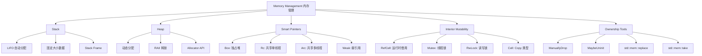
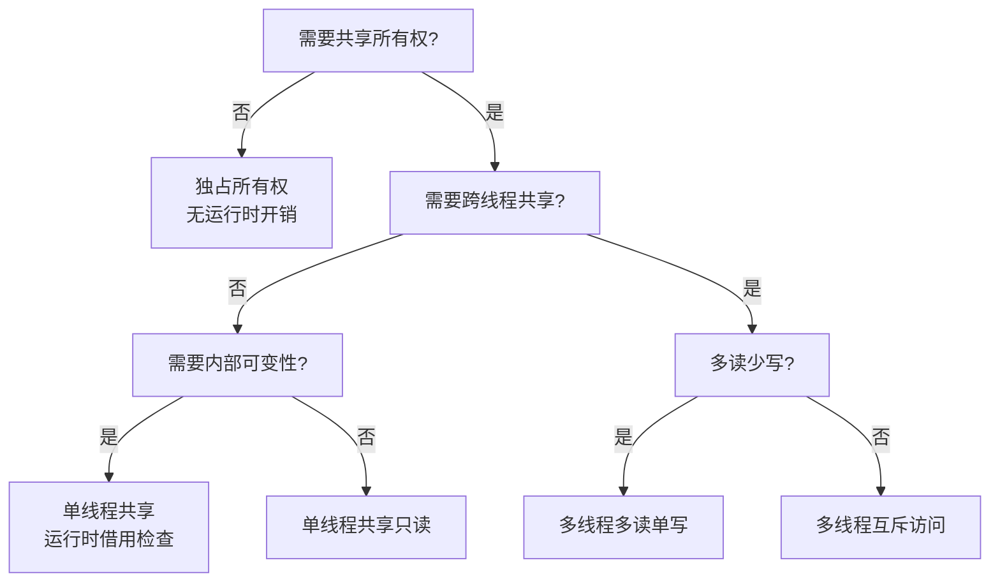
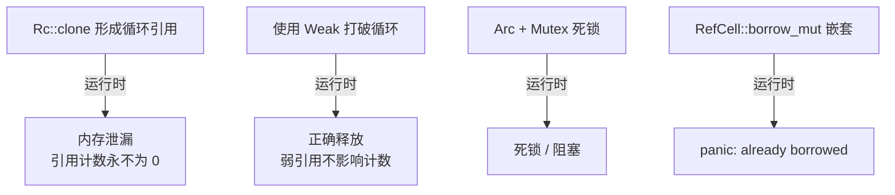

# Memory Management（内存管理）

> **层级**: L2 进阶概念
> **前置概念**: [Ownership](../01_foundation/01_ownership.md) · [Borrowing](../01_foundation/02_borrowing.md) · [Type System](../01_foundation/04_type_system.md)
> **后置概念**: [Unsafe Rust](../03_advanced/03_unsafe.md) · [Concurrency](../03_advanced/01_concurrency.md) · [Async](../03_advanced/02_async.md)
> **主要来源**: [TRPL: Ch4.1-4.3](https://doc.rust-lang.org/book/ch04-01-what-is-ownership.html) · [TRPL: Ch15](https://doc.rust-lang.org/book/ch15-00-smart-pointers.html) · [Rust Reference: Memory Model] · [Wikipedia: Memory management]

---

**变更日志**:

- v1.0 (2026-05-12): 初始版本，完成权威定义、内存布局矩阵、智能指针对比、形式化视角、思维导图、示例反例

---

## 一、权威定义（Definition）

### 1.1 Wikipedia 对齐定义

> **[Wikipedia: Memory management]** Memory management is a form of resource management applied to computer memory. The essential requirement of memory management is to provide ways to dynamically allocate portions of memory to programs at their request, and free it for reuse when no longer needed.

> **[Wikipedia: Rust]** Rust achieves memory safety without garbage collection by using an ownership model, where each value has a unique owner, and the value is dropped when the owner goes out of scope. Values can be immutably borrowed by any number of references or mutably borrowed by exactly one reference at a time.

### 1.2 TRPL 官方定义

> **[TRPL: Ch4.1]** The stack stores values in the order it gets them and removes the values in the opposite order. This is referred to as last in, first out. The heap is less organized: when you put data on the heap, you request a certain amount of space. The memory allocator finds an empty spot in the heap that is big enough, marks it as being in use, and returns a pointer.

> **[TRPL: Ch15]** A smart pointer is a data structure that acts like a pointer but also has additional metadata and capabilities. The concept of smart pointers isn't unique to Rust: smart pointers originated in C++ and exist in other languages as well. In Rust, smart pointers own the data they point to.

### 1.3 形式化定义

Rust 的内存模型可以形式化为**栈帧自动管理 + 堆分配显式所有权**的组合：

```text
栈语义（操作语义简化）:
  进入作用域:  stack.push(Frame { vars: {} })
  变量声明:    frame.vars[name] = Value::Uninitialized
  赋值:        frame.vars[name] = value
  离开作用域:  for v in frame.vars.values() { drop(v) }; stack.pop()

堆语义:
  let p = Box::new(x)  →  heap.alloc(size_of(x)).write(x); Own(p)
  drop(Box)            →  heap.dealloc(p); Own(p) 消耗
```

---

## 二、概念属性矩阵（Attribute Matrix）

### 2.1 Stack vs Heap 对比矩阵

| **维度** | **Stack** | **Heap** |
|:---|:---|:---|
| **分配时机** | 编译期确定 | 运行时动态请求 |
| **分配速度** | 极快（指针移动） | 较慢（分配器查找） |
| **布局** | 连续、LIFO | 可能碎片化 |
| **大小限制** | 通常较小（~8MB 默认） | 受系统内存限制 |
| **生命周期** | 与作用域绑定（自动） | 与所有者绑定（手动/RAII） |
| **访问模式** | CPU 缓存友好 | 可能缓存不友好（碎片化） |
| **典型类型** | 标量、元组、数组、引用 | `Box<T>`、`Vec<T>`、`String` |
| **溢出后果** | Stack overflow（panic/segfault） | OOM（panic） |

### 2.2 智能指针对比矩阵

| **智能指针** | **所有权模型** | **可变性** | **线程安全** | **典型用途** |
|:---|:---|:---|:---|:---|
| `Box<T>` | 独占 | 通过 `&mut` / `T` 内部可变 | 若 `T: Send` | 堆分配、递归类型、trait object |
| `Rc<T>` | 共享引用计数 | 不可变（需 `RefCell`） | ❌ 非 Send | 单线程共享所有权 |
| `Arc<T>` | 共享原子计数 | 不可变（需 `Mutex`/`RwLock`） | ✅ Send+Sync | 多线程共享所有权 |
| `RefCell<T>` | 运行时借用检查 | 内部可变性 | ❌ 非 Send | 单线程内部可变 |
| `Mutex<T>` | 锁保护 | 内部可变性 | ✅ Send | 多线程互斥访问 |
| `RwLock<T>` | 读写锁 | 内部可变性 | ✅ Send | 多读单写 |
| `Weak<T>` | 弱引用（不增加计数） | 不可变 | 视 `Rc`/`Arc` | 打破循环引用 |

### 2.3 内部可变性模式矩阵

| **组合** | **线程安全** | **运行时检查** | **使用场景** |
|:---|:---|:---|:---|
| `RefCell<T>` | 单线程 | 运行时借用检查（panic） | 单线程内部可变 |
| `Mutex<T>` | 多线程 | 互斥锁（阻塞/死锁风险） | 多线程互斥修改 |
| `RwLock<T>` | 多线程 | 读写锁 | 多读少写场景 |
| `AtomicT` | 多线程 | 硬件原子操作 | 简单计数器、标志 |
| `Cell<T>` | 单线程 | 无（仅 `Copy` 类型） | 单线程简单内部可变 |

---

## 三、形式化理论根基（Formal Foundation）

### 3.1 资源敏感的类型论

```text
Box<T> 的线性类型语义:
  Box::new: T → Box<T>        （将栈值包装为堆所有权）
  *box:     Box<T> → T        （解引用获取所有权——实际为 Deref）
  drop:     Box<T> → ⊥        （消耗 Box，释放堆内存）

Rc<T> 的仿射逻辑扩展:
  Rc::new:   T → Rc<T>                    （创建，计数 = 1）
  clone:     Rc<T> → Rc<T> ⊗ Rc<T>        （复制句柄，计数 +1）
  drop:      Rc<T> → Option<T>            （计数 -1，若 0 则释放）

关键: clone 不复制数据，仅复制所有权句柄（引用计数）
```

### 3.2 分离逻辑中的所有权转移

```text
堆断言（Heap Assertions）:
  p ↦ v   表示地址 p 存储值 v

Box::new(x) 的分离逻辑规约:
  { emp }              // 前置条件: 无特殊堆要求
  let b = Box::new(x);
  { b.ptr ↦ x }       // 后置条件: b 指向包含 x 的堆地址

drop(b) 的规约:
  { b.ptr ↦ _ }
  drop(b);
  { emp }             // 堆地址被释放
```

---

## 四、思维导图（Mind Map）



---

## 五、决策/边界判定树（Decision / Boundary Tree）

### 5.1 "我该用哪种智能指针？" 决策树



### 5.2 循环引用边界判定



---

## 六、定理推理链（Theorem Chain）

### 6.1 RAII + 所有权 ⇒ 确定性释放

```text
前提 1: 每个堆分配值由唯一所有者管理（Box）或引用计数管理（Rc/Arc）
前提 2: 所有者离开作用域时自动调用 Drop
前提 3: Rc/Arc 的 Drop 在计数归零时释放内存
    ↓
定理: Rust 堆内存的释放时机是确定性的（无 GC 停顿）
    ↓
推论: 适用于实时系统、嵌入式、游戏引擎等延迟敏感场景
例外: 循环引用导致的泄漏（Rc 限制）、panic 时的资源清理（通常仍安全）
```

### 6.2 内部可变性不变式

```text
前提: RefCell<T> 在运行时检查借用规则
    ↓
定理: 单线程场景下，RefCell 提供与编译期借用检查等价的安全性
    ↓
边界: 跨线程使用 RefCell 是 unsafe（未实现 Send/Sync）
      运行时冲突导致 panic（非编译错误）
```

---

## 七、示例与反例（Examples & Counter-examples）

### 7.1 正确示例：Box 堆分配

```rust
// ✅ 正确: Box 提供堆分配 + 自动释放
fn main() {
    let b = Box::new(5);  // 5 被分配到堆上
    println!("{}", b);     // 解引用访问
} // b 在这里离开作用域，堆内存自动释放（drop）
```

### 7.2 正确示例：Rc 共享所有权

```rust
// ✅ 正确: Rc 实现单线程共享所有权
use std::rc::Rc;

fn main() {
    let data = Rc::new(String::from("shared"));
    let data2 = Rc::clone(&data);  // 引用计数 +1
    let data3 = Rc::clone(&data);  // 引用计数 +1

    println!("count = {}", Rc::strong_count(&data));  // 3
    println!("{}, {}, {}", data, data2, data3);
} // 三个 Rc 依次 drop，最后一个释放堆内存
```

### 7.3 正确示例：用 Weak 打破循环引用

```rust
// ✅ 正确: Weak 引用不增加计数，打破循环
use std::rc::{Rc, Weak};
use std::cell::RefCell;

struct Node {
    value: i32,
    parent: RefCell<Weak<Node>>,     // Weak: 不拥有子节点
    children: RefCell<Vec<Rc<Node>>>, // Rc: 拥有子节点
}

fn main() {
    let leaf = Rc::new(Node {
        value: 3,
        parent: RefCell::new(Weak::new()),
        children: RefCell::new(vec![]),
    });

    let branch = Rc::new(Node {
        value: 5,
        parent: RefCell::new(Weak::new()),
        children: RefCell::new(vec![Rc::clone(&leaf)]),
    });

    *leaf.parent.borrow_mut() = Rc::downgrade(&branch);
    // leaf ↔ branch 的循环被 Weak 打破
} // 正常释放，无泄漏
```

### 7.4 反例：Rc 循环引用导致泄漏

```rust
// ❌ 反例: Rc 循环引用导致内存泄漏
use std::rc::Rc;
use std::cell::RefCell;

struct BadNode {
    value: i32,
    next: RefCell<Option<Rc<BadNode>>>,
}

fn main() {
    let a = Rc::new(BadNode { value: 1, next: RefCell::new(None) });
    let b = Rc::new(BadNode { value: 2, next: RefCell::new(None) });

    *a.next.borrow_mut() = Some(Rc::clone(&b));
    *b.next.borrow_mut() = Some(Rc::clone(&a));

    // a 的计数 = 2（a 变量 + b.next）
    // b 的计数 = 2（b 变量 + a.next）
    // 离开作用域后: a 变量 drop → a 计数 = 1（不释放）
    //              b 变量 drop → b 计数 = 1（不释放）
    // 结果: 内存泄漏！（Rust 中 leaks 不被视为 unsafe）
}
```

### 7.5 反例：RefCell 运行时借用冲突（panic）

```rust
// ❌ 反例: RefCell 运行时 panic
use std::cell::RefCell;

fn main() {
    let c = RefCell::new(String::from("hello"));
    let _borrow = c.borrow_mut();   // 可变借用
    let _borrow2 = c.borrow();      // already mutably borrowed
    // thread 'main' panicked at 'already mutably borrowed: BorrowError'
}
```

**修正方案**：

```rust
// ✅ 修正: 确保借用不重叠（编译期或运行时）
use std::cell::RefCell;

fn main() {
    let c = RefCell::new(String::from("hello"));
    {
        let mut borrow = c.borrow_mut();
        borrow.push_str(" world");
    } // 可变借用在这里结束
    let borrow2 = c.borrow();  // ✅ 现在可以不可变借用
    println!("{}", borrow2);
}
```

---

## 八、知识来源关系（Provenance）

| **论断** | **来源** | **可信度** |
|:---|:---|:---|
| Stack LIFO，Heap 动态分配 | [TRPL: Ch4.1] | ✅ |
| 智能指针拥有数据 | [TRPL: Ch15] | ✅ |
| Rc 单线程，Arc 多线程 | [TRPL: Ch15] · [Rust Reference] | ✅ |
| RefCell 运行时借用检查 | [TRPL: Ch15] | ✅ |
| Weak 打破循环引用 | [TRPL: Ch15] | ✅ |
| Rust 泄漏不被视为 unsafe | [Rust Reference: Safety] | ✅ |
| 内存分配器 API | [Rust Reference: GlobalAlloc] | ✅ |

---

## 九、待补充与演进方向（TODOs）

- [ ] **TODO**: 补充自定义 Allocator（`#[global_allocator]`） —— 优先级: 中 —— 预计: Phase 3

### 补充章节：MaybeUninit<T> 的内存安全边界

#### 问题背景

```text
Rust 要求所有变量初始化后才能使用：
  let x: i32;  // 未初始化
  println!("{}", x);  // ❌ 编译错误

但某些场景需要延迟初始化：
  - 数组/Vec 逐个元素初始化
  - FFI 返回未初始化的结构
  - 高性能场景避免零初始化开销
```

#### MaybeUninit 的设计

```rust
use std::mem::MaybeUninit;

// ✅ MaybeUninit<T> 允许包含未初始化的 T
fn maybe_uninit_demo() {
    let mut x = MaybeUninit::<String>::uninit();  // 未初始化

    // Safety: 必须先写入再读取
    unsafe {
        x.as_mut_ptr().write(String::from("hello"));
        let s = x.assume_init();  // 现在安全了
        println!("{}", s);
    }
}
```

#### 安全边界

```text
✅ 安全操作:
  - MaybeUninit::uninit() —— 创建未初始化值
  - MaybeUninit::as_mut_ptr() —— 获取原始指针（不读取）
  - ptr::write() —— 通过指针写入（不读取旧值）
  - MaybeUninit::assume_init() —— 转换为 T（unsafe，需已初始化）
  - MaybeUninit::assume_init_drop() —— 安全 drop（即使未完全初始化）

❌ UB 操作:
  - assume_init() 在未初始化时调用 → 读取未定义值
  - 重复 assume_init() → double-free（move 语义）
  - drop 未初始化的 MaybeUninit → 可能调用无效析构函数
```

```rust
// ✅ 安全模式: 数组初始化
fn init_array<T, F>(n: usize, mut f: F) -> [T; 100]
where F: FnMut(usize) -> T
{
    let mut arr: [MaybeUninit<T>; 100] = unsafe {
        MaybeUninit::uninit().assume_init()  // 创建未初始化数组
    };

    for i in 0..n {
        arr[i].write(f(i));
    }

    // Safety: 所有元素已初始化
    unsafe { std::mem::transmute_copy(&arr) }
}
```

---

- [x] **TODO**: 补充 `MaybeUninit<T>` 的内存安全边界 —— 优先级: 高 —— 已完成 v1.1
- [ ] **TODO**: 补充 `ManuallyDrop<T>` 与 `mem::forget` 的形式化分析 —— 优先级: 中 —— 预计: Phase 3

### 补充章节：Pin<&mut T> 的堆内存语义

`Pin<Box<T>>` 结合了**堆分配**、**所有权**和**位置不变性**：

```text
内存布局:
  Pin<Box<T>>
    ├── Box: 堆指针（栈上）
    │     └── 指向堆上的 T
    └── Pin: 保证 T 不移动（若 T: !Unpin）

所有权: Box 拥有堆内存，Pin 不干扰所有权
释放: 当 Pin<Box<T>> 离开作用域，Box drop，堆内存释放
```

```rust
use std::pin::Pin;
use std::marker::PhantomPinned;

struct HeapSelfRef {
    data: String,
    ptr: *const String,
    _pin: PhantomPinned,
}

fn create() -> Pin<Box<HeapSelfRef>> {
    let mut boxed = Box::pin(HeapSelfRef {
        data: String::from("heap"),
        ptr: std::ptr::null(),
        _pin: PhantomPinned,
    });

    // 建立自引用
    let ptr = &boxed.as_ref().data as *const String;
    unsafe {
        Pin::get_unchecked_mut(boxed.as_mut()).ptr = ptr;
    }
    boxed
}

fn main() {
    let pinned = create();
    println!("{:p}", pinned.data_ptr());  // 堆地址
    // pinned 可以像普通 Box 一样传递（Box<T> 是 Unpin）
    // 但内部 HeapSelfRef 不可移动
    // 当 pinned drop 时，堆内存正常释放
}
```

---

- [x] **TODO**: 补充 `Pin<&mut T>` 的堆内存语义 —— 优先级: 高 —— 已完成 v1.1
- [ ] **TODO**: 补充 `Vec<T>` / `String` / `HashMap` 的内存布局与扩容策略 —— 优先级: 中 —— 预计: Phase 2
- [ ] **TODO**: 补充 `std::alloc::System` vs `jemalloc` vs `mimalloc` 对比 —— 优先级: 低 —— 预计: Phase 4
