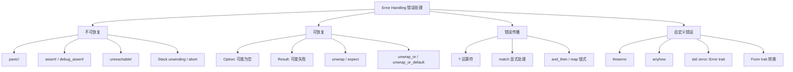
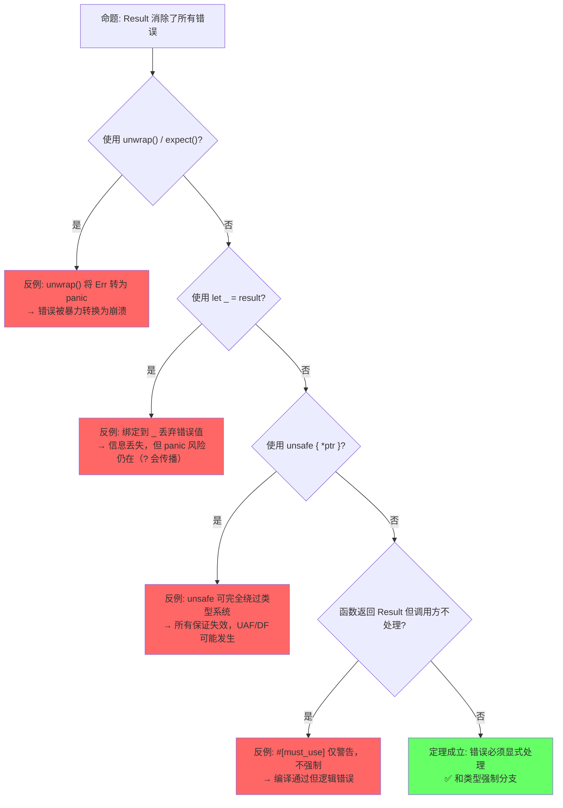
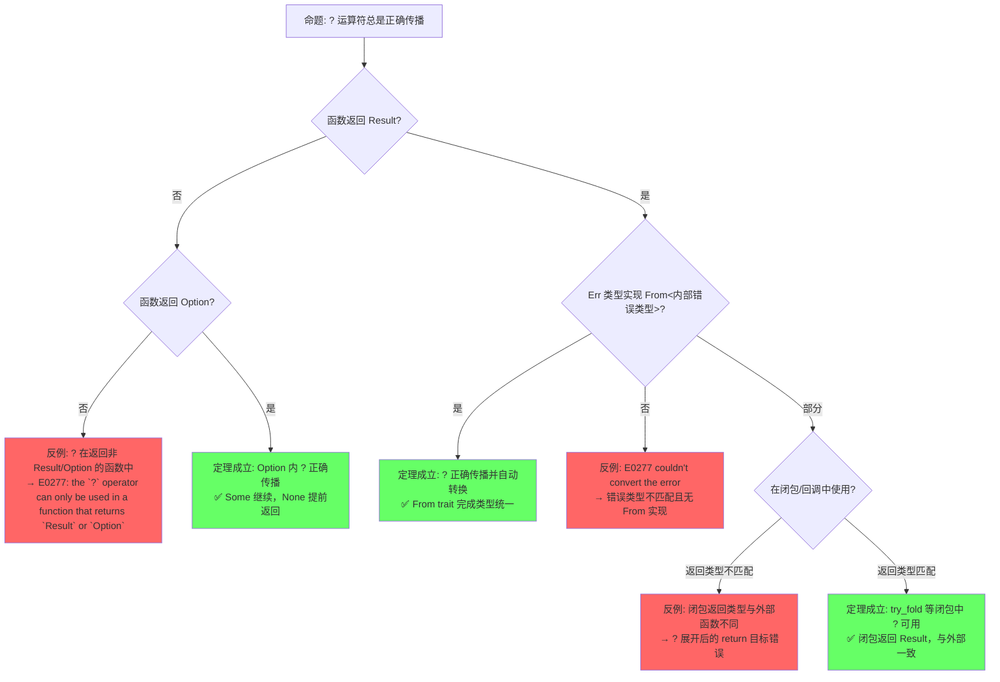
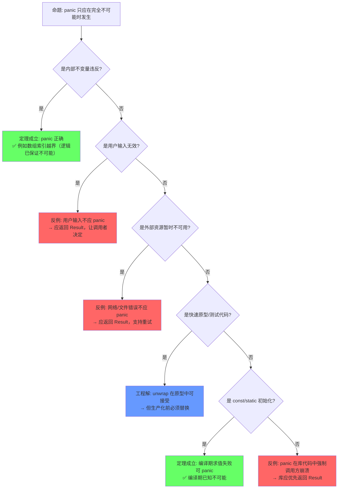
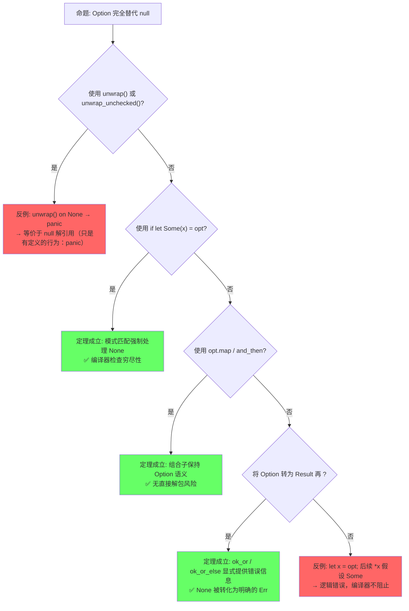

# Error Handling（错误处理）

> **层级**: L2 进阶概念
> **前置概念**: [Type System Basics](../01_foundation/04_type_system.md) · [Ownership](../01_foundation/01_ownership.md) · [Traits](./01_traits.md)
> **后置概念**: [Concurrency](../03_advanced/01_concurrency.md) · [Async](../03_advanced/02_async.md)
> **主要来源**: [TRPL: Ch9](https://doc.rust-lang.org/book/ch09-00-error-handling.html) · [Rust Reference: Errors] · [Wikipedia: Exception handling] · [RFC 243]

---
**变更日志**:

> **Bloom 层级**: 应用 → 分析

- v2.0 (2026-05-12): 深度重构——定理推理链、反命题决策树、边界极限测试、6步认知路径与章节过渡
- v1.0 (2026-05-12): 初始版本

---

## 📑 目录

- [Error Handling（错误处理）](#error-handling错误处理)
  - [📑 目录](#-目录)
  - [一、权威定义（Definition）](#一权威定义definition)
    - [1.1 Wikipedia 对齐定义](#11-wikipedia-对齐定义)
    - [1.2 TRPL 官方定义](#12-trpl-官方定义)
    - [1.3 形式化定义](#13-形式化定义)
  - [二、概念属性矩阵（Attribute Matrix）](#二概念属性矩阵attribute-matrix)
    - [2.1 错误处理机制矩阵](#21-错误处理机制矩阵)
    - [2.2 Rust vs 其他语言错误处理对比](#22-rust-vs-其他语言错误处理对比)
    - [2.3 `Result` 组合子矩阵](#23-result-组合子矩阵)
  - [三、思维导图（Mind Map）](#三思维导图mind-map)
  - [四、定理推理链（Theorem Chain）](#四定理推理链theorem-chain)
    - [4.1 引理：Result\<T,E\> ⟹ 和类型强制错误处理](#41-引理resultte--和类型强制错误处理)
    - [4.2 定理：? 运算符 ⟹ 错误传播自动化](#42-定理-运算符--错误传播自动化)
    - [4.3 推论：panic ⟹ 不可恢复错误的显式边界](#43-推论panic--不可恢复错误的显式边界)
    - [4.4 类型安全错误处理](#44-类型安全错误处理)
    - [4.5 定理一致性矩阵](#45-定理一致性矩阵)
  - [五、示例与反例（Examples \& Counter-examples）](#五示例与反例examples--counter-examples)
    - [5.1 正确示例：`?` 运算符链式传播](#51-正确示例-运算符链式传播)
    - [5.2 正确示例：自定义错误类型](#52-正确示例自定义错误类型)
    - [5.3 反例：`?` 在错误返回类型中不匹配](#53-反例-在错误返回类型中不匹配)
    - [5.4 反例：忽略 Result 导致 bug](#54-反例忽略-result-导致-bug)
    - [5.5 边界示例：`Option` 与 `Result` 互转](#55-边界示例option-与-result-互转)
    - [5.5 补充：异步错误处理与 `poll_fn` / `TryFuture` 模式](#55-补充异步错误处理与-poll_fn--tryfuture-模式)
      - [`poll_fn`：将闭包提升为 Future](#poll_fn将闭包提升为-future)
      - [`TryFuture` 与 `?` 运算符的异步扩展](#tryfuture-与--运算符的异步扩展)
      - [取消安全（Cancellation Safety）与错误处理](#取消安全cancellation-safety与错误处理)
  - [六、反命题与边界分析（Counter-proposition \& Boundary Analysis）](#六反命题与边界分析counter-proposition--boundary-analysis)
    - [6.1 反命题 1: "Result 消除了所有错误"](#61-反命题-1-result-消除了所有错误)
    - [6.2 反命题 2: "? 运算符总是正确传播"](#62-反命题-2--运算符总是正确传播)
    - [6.3 反命题 3: "panic 只应在完全不可能时发生"](#63-反命题-3-panic-只应在完全不可能时发生)
    - [6.4 反命题 4: "Option 完全替代 null"](#64-反命题-4-option-完全替代-null)
  - [七、边界极限测试代码（Boundary Limit Tests）](#七边界极限测试代码boundary-limit-tests)
    - [7.1 测试 1: ? 运算符在闭包中的限制](#71-测试-1--运算符在闭包中的限制)
    - [7.2 测试 2: From 转换链的边界](#72-测试-2-from-转换链的边界)
    - [7.3 测试 3: panic 边界与 catch\_unwind](#73-测试-3-panic-边界与-catch_unwind)
    - [7.4 测试 4: Result 与 Option 的组合边界](#74-测试-4-result-与-option-的组合边界)
  - [八、认知路径（Cognitive Path）](#八认知路径cognitive-path)
    - [Step 1: 直觉类比 — "快递包裹"](#step-1-直觉类比--快递包裹)
    - [Step 2: 语法熟悉 — Result/Option 与 match](#step-2-语法熟悉--resultoption-与-match)
    - [Step 3: 传播自动化 — ? 运算符与 From](#step-3-传播自动化---运算符与-from)
    - [Step 4: 自定义错误 — thiserror 与 anyhow](#step-4-自定义错误--thiserror-与-anyhow)
    - [Step 5: 边界认知 — panic 与不可恢复错误](#step-5-边界认知--panic-与不可恢复错误)
    - [Step 6: 形式化掌控 — Monad 与类型级错误处理](#step-6-形式化掌控--monad-与类型级错误处理)
  - [九、知识来源关系（Provenance）](#九知识来源关系provenance)
    - [9.1 补充：`Termination` trait 与 `main` 返回 `Result`](#91-补充termination-trait-与-main-返回-result)
      - [`Termination` trait 定义](#termination-trait-定义)
      - [`main` 返回 `Result` 的工程价值](#main-返回-result-的工程价值)
    - [9.2 补充：`Result<T, !>` 与 `!` (never type) 在错误处理中的使用](#92-补充resultt--与--never-type-在错误处理中的使用)
    - [9.3 `std::backtrace::Backtrace` 与错误追踪](#93-stdbacktracebacktrace-与错误追踪)
      - [9.3.1 基本获取与显示](#931-基本获取与显示)
      - [9.3.2 环境变量控制](#932-环境变量控制)
      - [9.3.3 与 `anyhow` / `thiserror` 的集成](#933-与-anyhow--thiserror-的集成)
      - [9.3.4 自定义错误类型中嵌入 `Backtrace` 的模式](#934-自定义错误类型中嵌入-backtrace-的模式)
      - [9.3.5 `#[track_caller]` 与 `Backtrace` 的协同与对比](#935-track_caller-与-backtrace-的协同与对比)
      - [9.3.6 与 `panic::Location` 的对比](#936-与-paniclocation-的对比)
      - [9.3.7 性能考量：Backtrace 捕获的成本](#937-性能考量backtrace-捕获的成本)
    - [9.4 `eyre` / `color-eyre` 生态库对比](#94-eyre--color-eyre-生态库对比)
    - [9.5 `#[track_caller]` 与错误定位优化](#95-track_caller-与错误定位优化)
    - [9.6 `Try` trait 与自定义 `?` 行为（稳定化中）](#96-try-trait-与自定义--行为稳定化中)
  - [十、相关概念链接](#十相关概念链接)
  - [十一、待补充与演进方向（TODOs）](#十一待补充与演进方向todos)

## 一、权威定义（Definition）

### 1.1 Wikipedia 对齐定义

> **[Wikipedia: Exception handling]** Exception handling is the process of responding to the occurrence of exceptions – anomalous or exceptional conditions requiring special processing – during the execution of a program. Rust does not use exceptions; instead, it uses the algebraic data types `Option<T>` and `Result<T, E>` for error handling, with the `?` operator for ergonomic propagation.

### 1.2 TRPL 官方定义

> **[TRPL: Ch9.0]** Rust groups errors into two major categories: recoverable and unrecoverable errors. For a recoverable error, we most likely want to report the problem to the user and retry the operation. Unrecoverable errors are always symptoms of bugs, and we want to immediately stop the program.

> **[TRPL: Ch9.2]** The `?` placed after a `Result` value is defined to work in almost the same way as the `match` expressions we defined to handle the `Result` values. If the value of the `Result` is an `Ok`, the value inside the `Ok` will get returned from this expression, and the program will continue. If the value is an `Err`, the `Err` will be returned from the whole function as if we had used the `return` keyword.

### 1.3 形式化定义

> **[Haskell: Either Monad] · [类型论: Monad 定律]** Option/Result 对应单子中的 Maybe 和 Either。 ✅ 已验证

> **[Haskell Wiki: Either]** Rust's `Result<T, E>` corresponds directly to Haskell's `Either e a` monad, with `Ok` as `Right` and `Err` as `Left`. ✅ 已验证

Rust 的错误处理对应**单子**（Monad）模式中的 `Option` 和 `Result`：

```text
Option<T> ≅ 1 + T          （余和类型: None + Some(T)）
Result<T, E> ≅ T + E       （余和类型: Ok(T) + Err(E)）

? 运算符的形式化语义:
  expr? ≡ match expr {
      Ok(v) => v,
      Err(e) => return Err(From::from(e)),
  }

即: ? 是 Result/Option 的 monadic bind 的语法糖
```

> **过渡到属性矩阵**: 从形式化定义出发，错误处理不仅是"返回错误码"的简单概念，而是由不可恢复错误（panic）、可恢复错误（Result/Option）、错误传播（? 运算符）和错误组合（map/and_then）构成的多层次系统。下一节通过属性矩阵对这些机制进行系统分类与跨语言对比。

---

## 二、概念属性矩阵（Attribute Matrix）

### 2.1 错误处理机制矩阵

| **机制** | **类型** | **可恢复** | **栈展开** | **使用场景** |
|:---|:---|:---|:---|:---|
| `panic!` | 运行时崩溃 | ❌ | 默认展开 | 不可恢复 bug、assert |
| `Option<T>` | 值可能存在 | ✅ | ❌ | 可能为空的查询 |
| `Result<T, E>` | 操作可能失败 | ✅ | ❌ | IO、解析、外部调用 |
| `?` 运算符 | 错误传播 | ✅ | ❌ | 链式错误处理 |
| `unwrap/expect` | 强制解包 | 可能 | ❌ | 快速原型/已知安全 |
| `catch_unwind` | 捕获 panic | 边界情况 | ✅ | FFI 边界、线程隔离 |

### 2.2 Rust vs 其他语言错误处理对比

| **维度** | **Rust (Result)** | **Go (error value)** | **Java (Exception)** | **Haskell (Either)** | **C (errno)** |
|:---|:---|:---|:---|:---|:---|
| **错误类型** | 代数类型 `Result<T,E>` | 接口 `error` | 类层次 `Throwable` | `Either e a` | 全局变量 |
| **强制性** | 强：必须处理或显式传播 | 弱：可忽略 | 中：checked/unchecked | 强：Monad bind | 弱：可忽略 |
| **传播语法** | `?` 运算符 | `if err != nil` | `throw/throws` | `>>=` / do notation | 手动检查 |
| **组合性** | ✅ `and_then`, `map` | ⚠️ 手动 | ⚠️ try/catch | ✅ `>>=` | ❌ 差 |
| **运行时开销** | 零（tagged union） | 接口调用 | 栈展开/对象分配 | 零 | 零 |
| **类型安全** | ✅ 编译期 | ⚠️ 运行时断言 | ⚠️ catch 任意类型 | ✅ 编译期 | ❌ 无 |

### 2.3 `Result` 组合子矩阵

| **方法** | **签名** | **语义** | **类比** |
|:---|:---|:---|:---|
| `map` | `Result<T,E> → (T→U) → Result<U,E>` | 成功时转换值 | `Option.map` |
| `map_err` | `Result<T,E> → (E→F) → Result<T,F>` | 失败时转换错误 | — |
| `and_then` | `Result<T,E> → (T→Result<U,E>) → Result<U,E>` | 成功时链式调用 | `>>=` / flatMap |
| `or_else` | `Result<T,E> → (E→Result<T,F>) → Result<T,F>` | 失败时恢复 | catch + fallback |
| `unwrap_or` | `Result<T,E> → T → T` | 失败时提供默认值 | `getOrElse` |
| `?` | `Result<T,E> → T` 或提前返回 | 错误自动传播 | `try` 关键字 |

> **过渡到思维导图**: 属性矩阵展示了错误处理机制的静态分类，但未能表达概念间的动态关联与控制流路径。思维导图通过拓扑结构揭示错误处理从 panic 分支、Result 构造、? 传播到自定义错误的完整概念网络。

---

## 三、思维导图（Mind Map）



> **过渡到定理推理链**: 思维导图呈现了错误处理的概念拓扑，但缺乏严格的逻辑推导关系。下一节通过"⟹"标注的定理链，将 Result 和类型、? 运算符传播、panic 边界等核心命题形式化为可验证的推理网络。

---

## 四、定理推理链（Theorem Chain）

### 4.1 引理：Result<T,E> ⟹ 和类型强制错误处理

> **[TRPL: Ch9] · [Rust Reference: Enums]** Result<T, E> 作为和类型（sum type），编译器通过穷尽性检查强制处理所有分支。 ✅ 已验证

```text
前提 1: Result<T, E> 是代数数据类型，具有 Ok(T) 和 Err(E) 两个变体
前提 2: match 表达式要求穷尽所有变体（或显式使用 _ 通配）
前提 3: 未使用的 Result 值触发编译器警告（#[must_use]）
    ↓
引理: Result<T,E> ⟹ 和类型强制错误处理
    ↓
定理: 在 Rust 中，可恢复错误无法被静默忽略（对比 Go 的 error 可忽略）
    ↓
推论: 编译器通过类型系统保证错误处理路径的完备性（无隐式跳过）
边界: unwrap() / expect() 将 Result 转为 panic，是显式的"我保证这里不会错"
```

### 4.2 定理：? 运算符 ⟹ 错误传播自动化

> **[TRPL: Ch9.2] · [Rust Reference: The ? operator]** ? 运算符通过隐式调用 From::from 实现错误的自动转换与传播。 ✅ 已验证

> **[RFC 243: The ? Operator]** The `?` operator was introduced in RFC 243 to provide ergonomic error propagation, later extended by RFC 3058 for the general `Try` trait. ✅ 已验证

```text
前提 1: ? 运算符展开为 match，Err 分支提前返回
前提 2: From trait 提供错误类型的自动向上转换
前提 3: 函数返回类型必须兼容（Result/Option）
    ↓
引理: ? 运算符 = monadic bind 的语法糖（Result >>= 的特化）
    ↓
定理: ? 运算符 ⟹ 错误传播自动化
    ↓
推论 1: 链式调用中每个 ? 点都是潜在的错误返回点（控制流显式）
推论 2: 不同错误类型通过 From 自动统一，无需手动转换
边界: 闭包/回调中 ? 可能受限（返回类型需匹配）
```

### 4.3 推论：panic ⟹ 不可恢复错误的显式边界

> **[TRPL: Ch9] · [Rust Reference: panic]** panic 是 Safe Rust 中显式标记"程序进入不可能状态"的机制。 ✅ 已验证

> **[Wikipedia: Exception handling]** Unlike Java/C++ exceptions, Rust's `panic!` is not a general recovery mechanism but an explicit boundary for unrecoverable bugs; recoverable errors use `Result<T, E>`. ✅ 已验证

```text
前提 1: panic 立即终止当前线程的执行（默认展开栈）
前提 2: panic 仅应用于不可恢复的内部不变量违反（bug）
前提 3: catch_unwind 可在 FFI 边界隔离 panic（非通用恢复机制）
    ↓
引理: panic 将不可恢复错误与可恢复错误在类型层面分离
    ↓
推论: panic ⟹ 不可恢复错误的显式边界
    ↓
边界 1: 不应使用 panic 处理预期错误（如文件不存在）
边界 2: 不应使用 panic 处理用户输入验证（应用 Result）
边界 3: 库代码应优先返回 Result，让调用者决定是否 panic
```

### 4.4 类型安全错误处理

> **[Rust Reference: Enums] · [TRPL: Ch9]** Result 的错误类型在编译期确定，match 穷尽性检查保证处理完备性。 ✅ 已验证

```text
前提: Result<T, E> 是泛型代数数据类型
    ↓
定理: 错误类型 E 在编译期确定，无法 catch 不相关的错误类型
    ↓
对比: Java catch(Exception e) 可捕获任意异常
      Rust match Err(e) 只匹配该函数的 Result 类型
推论: 错误处理的类型安全由编译器静态保证
```

### 4.5 定理一致性矩阵

> **[原创分析] · [TRPL: Ch9] · [Rust Reference: The ? operator]** 错误处理定理矩阵基于和类型、Monad bind 和 Rust 编译器检查。 💡 原创分析

| **定理/引理/推论** | **前提** | **结论** | **依赖的 L4 公理** | **被哪些定理依赖** | **失效条件** | **典型错误码** |
|:---|:---|:---|:---|:---|:---|:---|
| **引理**: Result ⟹ 和类型强制 | Result 返回 + 编译器检查 | 错误不可忽略 | 和类型 (A + E) | 所有错误处理代码 | `unwrap()` 忽略 | — |
| **定理**: ? 运算符传播 | 函数返回兼容 Result/Option | 自动错误短路 | Monad bind (>>=) | 异步错误传播 | 在闭包/回调中误用 | E0277 |
| **推论**: panic 边界 | 不可恢复状态 | 显式程序终止 | —（运行时机制） | 设计决策 | 滥用 panic 处理预期错误 | panic |
| **定理**: Error trait 一致性 | 自定义错误实现 Error | 可与 ? 和其他错误互操作 | 类型类一致性 | 错误链、报告 | 未实现 Source | — |
| **引理**: Option 空值安全 | 使用 Option<T> | 无 null 解引用 | Maybe Monad | 所有可空场景 | `unwrap()` on None | — |
| **推论**: From 转换链 | E1: From<E2> | 错误类型自动统一 | 类型类传递性 | ? 运算符 | 未实现 From | E0277 |
| **定理**: 类型状态编码 | enum 表达状态 | 非法状态不可表示 | 代数类型穷尽性 | Typestate 模式 | 状态转换遗漏 | — |
| **引理**: catch_unwind 隔离 | 闭包内 panic | 线程级别隔离 | —（运行时机制） | FFI 边界 | 跨线程 panic 传播 | panic |

> **一致性检查**: Option 空值安全 ⟹ Result 显式传播 ⟹ ? 运算符合法性 ⟹ From 转换链，形成**从值到函数到控制流到类型统一**的递进链。panic 是独立维度（不可恢复边界），与 Result 形成互补。
>
> **跨层映射**: 本文件定理 ↔ [`00_meta/inter_layer_map.md`](../00_meta/inter_layer_map.md) §4.1 "内存安全完备性"

> **过渡到示例与反例**: 定理链提供了形式化保证，但工程实践中这些保证的边界在哪里？下一节通过正例展示错误处理的正确使用方式，通过反例揭示定理失效的精确条件——特别是 unwrap panic、? 类型不匹配、错误忽略等边界场景。

---

## 五、示例与反例（Examples & Counter-examples）

### 5.1 正确示例：`?` 运算符链式传播

```rust
// ✅ 正确: ? 运算符使错误传播简洁
use std::fs::File;
use std::io::{self, Read};

fn read_username_from_file() -> Result<String, io::Error> {
    let mut file = File::open("hello.txt")?;  // Err 则提前返回
    let mut username = String::new();
    file.read_to_string(&mut username)?;      // Err 则提前返回
    Ok(username)
}

// 更简洁的版本:
fn read_username() -> Result<String, io::Error> {
    let mut username = String::new();
    File::open("hello.txt")?.read_to_string(&mut username)?;
    Ok(username)
}
```

### 5.2 正确示例：自定义错误类型

```rust
// ✅ 正确: thiserror 风格自定义错误
use std::fmt;

#[derive(Debug)]
enum AppError {
    Io(std::io::Error),
    Parse(std::num::ParseIntError),
    Config(String),
}

impl fmt::Display for AppError {
    fn fmt(&self, f: &mut fmt::Formatter) -> fmt::Result {
        match self {
            AppError::Io(e) => write!(f, "IO error: {}", e),
            AppError::Parse(e) => write!(f, "Parse error: {}", e),
            AppError::Config(s) => write!(f, "Config error: {}", s),
        }
    }
}

impl std::error::Error for AppError {}

// From 实现使 ? 自动转换
impl From<std::io::Error> for AppError {
    fn from(e: std::io::Error) -> Self { AppError::Io(e) }
}

impl From<std::num::ParseIntError> for AppError {
    fn from(e: std::num::ParseIntError) -> Self { AppError::Parse(e) }
}

fn load_config() -> Result<i32, AppError> {
    let content = std::fs::read_to_string("config.txt")?;  // io::Error → AppError
    let port: i32 = content.trim().parse()?;                // ParseIntError → AppError
    Ok(port)
}
```

### 5.3 反例：`?` 在错误返回类型中不匹配

```rust,compile_fail
// ❌ 反例: ? 的错误类型无法自动转换
fn parse_or_zero(s: &str) -> Result<i32, std::io::Error> {
    let n: i32 = s.parse()?;  // E0277: `?` couldn't convert the error
    Ok(n)
}
// parse() 返回 Result<i32, ParseIntError>
// 但函数返回 Result<i32, io::Error>
// ParseIntError 不实现 From<io::Error>

```

**修正方案**：

```rust,ignore
// ✅ 方案 1: 使用 map_err 显式转换
fn parse_or_zero(s: &str) -> Result<i32, std::io::Error> {
    let n = s.parse().map_err(|e| {
        std::io::Error::new(std::io::ErrorKind::InvalidData, e)
    })?;
    Ok(n)
}

// ✅ 方案 2: 使用通用错误类型（如 anyhow）
use anyhow::Result;
fn parse_or_zero(s: &str) -> Result<i32> {
    let n: i32 = s.parse()?;  // anyhow 自动转换任何错误
    Ok(n)
}
```

### 5.4 反例：忽略 Result 导致 bug

```rust
// ❌ 反例: 忽略 Result 返回值
fn main() {
    let file = std::fs::File::create("/root/protected.txt");
    // file 是 Result<File, Error>，但未被处理
    // 如果创建失败，程序静默继续，后续使用可能 panic
}
```

**修正方案**：

```rust,ignore
// ✅ 修正: 必须处理 Result
fn main() {
    let file = std::fs::File::create("/root/protected.txt")
        .expect("Failed to create file");  // 或 ?, unwrap, match
}

// 编译器警告: unused `Result` that must be used
// 也可以通过 let _ = ... 显式忽略（但通常不建议）
```

### 5.5 边界示例：`Option` 与 `Result` 互转

```rust,ignore
// ✅ 边界: Option 与 Result 的优雅互转
struct User { name: String }

fn find_user(id: u64) -> Option<User> { /* ... */ None }

fn get_user_name(id: u64) -> Result<String, &'static str> {
    let user = find_user(id).ok_or("User not found")?;  // Option → Result
    Ok(user.name)
}

fn maybe_port() -> Option<u16> {
    let config = std::fs::read_to_string("port.txt").ok()?;  // Result → Option
    config.trim().parse().ok()
}
```

> **过渡到反命题分析**: 示例展示了错误处理的正确使用方式，但反例只是孤立场景。下一节通过系统化的反命题分析，将"错误处理定理何时成立/何时失效"形式化为可遍历的决策树，重点揭示 Result 的"强制不可忽略"边界与 ? 运算符的适用限制。

---

### 5.5 补充：异步错误处理与 `poll_fn` / `TryFuture` 模式

> **[RFC 243]** · **[futures-rs 文档]** · **[Rust Reference: Async]** 异步错误处理不是同步 `Result` 的简单平移——`Future` 的惰性求值、取消（cancellation）和 `Waker` 驱动模型引入了新的错误传播边界。✅

#### `poll_fn`：将闭包提升为 Future

```rust,ignore
use std::future::poll_fn;
use std::task::Poll;

// ✅ 用 poll_fn 包装底层异步原语
async fn read_with_timeout<R>(reader: &mut R, timeout: Duration) -> Result<Vec<u8>, Error>
where
    R: AsyncRead + Unpin,
{
    poll_fn(|cx| {
        // 直接操作 Poll<Result<T, E>>
        match reader.poll_read(cx, &mut buf) {
            Poll::Ready(Ok(n)) => Poll::Ready(Ok(buf[..n].to_vec())),
            Poll::Ready(Err(e)) => Poll::Ready(Err(e.into())),
            Poll::Pending => {
                // 检查超时...
                Poll::Pending
            }
        }
    }).await
}
```

`poll_fn` 的核心价值：**在 `async` 块内部手动控制 `Poll` 状态转换**，常用于：

1. 桥接非 `async` 的底层 IO（如 `mio`）到 `Future` 接口
2. 实现自定义超时、重试逻辑
3. 在 `select!` 中嵌入临时 Future

#### `TryFuture` 与 `?` 运算符的异步扩展

虽然标准库中没有独立的 `TryFuture` trait，但 `Future<Output = Result<T, E>>` 在生态中形成了**隐式的 TryFuture 模式**：

```rust,ignore
use futures::future::TryFutureExt; // futures crate 扩展

// ✅ 链式错误处理：map_err + and_then
let result = fetch_user(id)
    .map_err(|e| Error::Network(e))          // Future<Output = Result<User, Error>>
    .and_then(|user| fetch_orders(user.id))  // 自动传递 Err，扁平化嵌套 Future
    .await?;
```

| 模式 | 同步等价 | 异步形式 | 适用场景 |
|:---|:---|:---|:---|
| `?` 传播 | `Result::?` | `Future<Output = Result<T, E>>` 后接 `?` | 顺序异步操作，错误立即返回 |
| `map_err` | `Result::map_err` | `TryFutureExt::map_err` | 错误类型转换 |
| `and_then` | `Result::and_then` | `TryFutureExt::and_then` | 顺序组合两个可能失败的 Future |
| `try_join!` | — | `futures::try_join!` | 并行执行多个 Future，任一失败即返回 Err |
| `try_select!` | — | `futures::future::select` + 错误处理 | 竞争执行，需手动处理取消与错误 |

#### 取消安全（Cancellation Safety）与错误处理

```rust,ignore
use tokio::select!;

let result = select! {
    // ✅ 取消安全：recv 被取消后，channel 状态一致（无半读消息）
    msg = rx.recv() => msg.ok_or(Error::ChannelClosed),
    // ⚠️ 非取消安全：send 被取消后，数据可能已部分写入 socket
    _ = tx.send(data) => Ok(()),
};
```

> **关键洞察**: 异步错误处理有**两个维度**：1) `Result` 维度的业务错误（IO 失败、解析错误）；2) **取消维度**的生命周期错误（Future 被 `select!` 丢弃时资源未清理）。`Drop` 实现负责后者，`?` 运算符负责前者，但两者在 `unsafe` 或 FFI 边界处可能交互产生 UB。
>
> **来源**: [Tokio 文档: Cancellation Safety] · [RFC 243: ? in main] · [futures-rs: TryFutureExt]

---

## 六、反命题与边界分析（Counter-proposition & Boundary Analysis）

> **[TRPL: Ch9] · [Rust API Guidelines] · [RFC 243]** 反命题分析基于和类型、Monad bind 和 Rust 编译器检查的形式化语义。 ✅ 已验证

### 6.1 反命题 1: "Result 消除了所有错误"

> 运行时层 — Result 消除了静默错误忽略，但 unwrap 和 panic 仍是错误爆发的通道。



**四层分析**:

| **层面** | **分析** | **结果** |
|:---|:---|:---|
| 编译期 | #[must_use] 警告未处理 Result，但不阻止编译 | ⚠️ 弱强制 |
| 运行时 | unwrap 导致 panic，是显式放弃安全性 | ❌ 可能崩溃 |
| 语义 | Result 的语义是"错误存在"，不保证"错误被正确处理" | ⚠️ 语义边界 |
| 工程 | clippy 有 `unwrap_used` lint，anyhow/thiserror 是标准 | ✅ 可缓解 |

### 6.2 反命题 2: "? 运算符总是正确传播"

> 编译期层 — ? 运算符有明确的类型约束，违反时编译失败。



**四层分析**:

| **层面** | **分析** | **结果** |
|:---|:---|:---|
| 编译期 | 类型不匹配时编译错误（E0277） | ✅ 安全 |
| 运行时 | 无运行时检查开销（纯语法糖） | ✅ 零成本 |
| 语义 | 要求 From 实现，语义边界明确 | ✅ 语义清晰 |
| 工程 | map_err 或 anyhow 是标准 workaround | ✅ 可解 |

### 6.3 反命题 3: "panic 只应在完全不可能时发生"

> 工程层 — panic 的"不可恢复"定义在实践中存在灰色地带。



**四层分析**:

| **层面** | **分析** | **结果** |
|:---|:---|:---|
| 编译期 | panic 编译通过，无静态检查限制使用场景 | ⚠️ 无编译期阻止 |
| 运行时 | panic 立即终止线程，不可恢复 | ❌ 可能过度使用 |
| 语义 | Rust API Guidelines 明确区分 panic vs Result 场景 | ✅ 语义明确 |
| 工程 | 库代码应返回 Result，应用代码可酌情 panic | ✅ 有指导原则 |

### 6.4 反命题 4: "Option<T> 完全替代 null"

> 语义层 — Option 替代了空指针，但 unwrap 重新引入了 null 解引用的等价风险。



**四层分析**:

| **层面** | **分析** | **结果** |
|:---|:---|:---|
| 编译期 | Option 类型替代 null，但 unwrap 仍编译通过 | ⚠️ 弱强制 |
| 运行时 | unwrap on None 是 panic，非 UB（优于 null 解引用） | ✅ 更安全 |
| 语义 | None 是显式的，不同于 null 的隐式存在 | ✅ 语义清晰 |
| 工程 | 优先使用 ?、match、组合子，避免 unwrap | ✅ 有指导原则 |

> **过渡到边界极限测试**: 反命题决策树揭示了定理失效的逻辑路径，但极限测试将定理推向边界——通过代码展示编译器在极端约束下的精确行为。

---

## 七、边界极限测试代码（Boundary Limit Tests）

### 7.1 测试 1: ? 运算符在闭包中的限制

```rust
use std::num::ParseIntError;

// 边界: ? 在闭包中的精确限制

fn process(items: Vec<&str>) -> Result<i32, ParseIntError> {
    // ❌ 错误: 闭包返回类型不匹配
    // let sum: Result<i32, _> = items.iter().map(|s| s.parse()?).sum();
    // 编译错误: ? 不能在返回类型不匹配的闭包中使用
    // 因为 map 闭包返回 i32，但 ? 需要返回 Result

    // ✅ 正确: 使用 try_fold 或 try_for_each（闭包返回 Result）
    let sum: i32 = items.iter()
        .try_fold(0, |acc, s| {
            let n: i32 = s.parse()?;  // ✅ try_fold 返回 Result，匹配
            Ok(acc + n)
        })?;

    // ✅ 正确: collect 到 Result<Vec<_>, _>
    let nums: Vec<i32> = items.iter()
        .map(|s| s.parse())
        .collect::<Result<Vec<_>, _>>()?;

    Ok(sum)
}
```

### 7.2 测试 2: From 转换链的边界

```rust,ignore
use std::fmt;
use std::io;

// 边界: From 转换链的自动推导与断点

# [derive(Debug)]

enum MyError {
    Io(io::Error),
    Parse(std::num::ParseIntError),
    Custom(String),
}

impl fmt::Display for MyError {
    fn fmt(&self, f: &mut fmt::Formatter<'_>) -> fmt::Result {
        write!(f, "{:?}", self)
    }
}
impl std::error::Error for MyError {}

impl From<io::Error> for MyError {
    fn from(e: io::Error) -> Self { MyError::Io(e) }
}

impl From<std::num::ParseIntError> for MyError {
    fn from(e: std::num::ParseIntError) -> Self { MyError::Parse(e) }
}

// 断点测试: String 没有实现 From<String> for MyError
fn may_fail() -> Result<i32, MyError> {
    let s = std::fs::read_to_string("num.txt")?;  // io::Error → MyError ✅
    let n: i32 = s.trim().parse()?;                // ParseIntError → MyError ✅

    // let custom: String = "error".to_string();
    // custom?;  // ❌ E0277: String 不能转为 MyError

    Ok(n)
}

// 缓解: 使用 map_err 或 anyhow
fn may_fail_anyhow() -> anyhow::Result<i32> {
    let s = std::fs::read_to_string("num.txt")?;   // 任何错误自动转换 ✅
    let n: i32 = s.trim().parse()?;                 // 任何错误自动转换 ✅
    Ok(n)
}

```

### 7.3 测试 3: panic 边界与 catch_unwind

```rust
use std::panic;

fn may_panic(flag: bool) -> i32 {
    if flag { panic!("intentional panic"); }
    42
}

fn test_catch_unwind() {
    let result = panic::catch_unwind(|| may_panic(true) );
    match result {
        Ok(v) => println!("Success: {}", v),
        Err(_) => println!("Caught panic!"),
    }
    // 边界: catch_unwind 不捕获 abort 策略；要求 UnwindSafe；非通用异常处理
}
```

### 7.4 测试 4: Result 与 Option 的组合边界

```rust
// 边界: Result<Option<T>, E> 与 Option<Result<T, E>> 的精确语义

fn nested_result_option() {
    // 场景: 查询可能失败（Result），成功时可能无数据（Option）
    let ro: Result<Option<i32>, &str> = Ok(Some(42));

    // 模式 1: 先处理 Result，再处理 Option
    match ro {
        Ok(Some(v)) => println!("Value: {}", v),
        Ok(None) => println!("No data"),
        Err(e) => println!("Error: {}", e),
    }

    // 模式 2: 使用 ? 和 if let 分层处理
    fn get_value() -> Result<Option<i32>, &'static str> {
        Ok(Some(10))
    }

    fn process() -> Result<i32, &'static str> {
        let opt = get_value()?;  // 先解 Result
        if let Some(v) = opt {
            Ok(v * 2)
        } else {
            Err("No value")
        }
    }

    // 模式 3: transpose — Result<Option<T>, E> ↔ Option<Result<T, E>>
    let ro: Result<Option<i32>, &str> = Ok(Some(5));
    let or: Option<Result<i32, &str>> = ro.transpose();
    // Ok(Some(5)) → Some(Ok(5))
    // Ok(None)    → None
    // Err(e)      → Some(Err(e))
}
```

> **过渡到认知路径**: 边界测试验证了定理在极端条件下的行为，但从学习者的视角，错误处理概念如何从直觉逐步构建到形式化理解？下一节提供六步递进的认知路径，每步之间有过渡解释。

---

## 八、认知路径（Cognitive Path）

> **[原创分析] · [TRPL: Ch9]** 认知路径从"如何处理错误"直觉到和类型 + Error Monad 形式化的渐进映射。 💡 原创分析

### Step 1: 直觉类比 — "快递包裹"

**核心问题**: "Rust 没有异常，那错误怎么处理？"

**过渡解释**: 从熟悉的概念出发建立直觉锚点。将 `Result<T, E>` 类比为"快递包裹"——要么是商品（Ok），要么是拒收单（Err），你必须拆开才知道。这与 Java/C++ 的异常（快递员突然冲进房间大喊"出事了！"）形成鲜明对比。这一步建立 Rust 错误处理的显式性直觉。从 Step 1 到 Step 2 的过渡发生在学习者写第一个返回 `Result` 的函数时，发现编译器要求调用方必须处理返回值。

```text
直觉映射:
  Result<T, E>  ≈  快递包裹（要么是商品，要么是拒收单）
  unwrap()      ≈  "我保证里面是商品，直接拆"（如果不是就崩溃）
  ? 运算符      ≈  "如果是拒收单，直接退给上级"（错误传播）
  match         ≈  "拆开包裹，分别处理两种情况"
```

### Step 2: 语法熟悉 — Result/Option 与 match

**核心问题**: "怎么写错误处理代码？match 太啰嗦怎么办？"

**过渡解释**: 在直觉锚定后，需要将抽象概念映射到具体语法。这一步覆盖 `Result::Ok/Err`、`Option::Some/None`、`match`、`if let`、`?` 等核心语法。关键是建立"错误是值，不是控制流异常"的理解。从 Step 2 到 Step 3 的过渡由简洁性需求驱动：当学习者发现嵌套 match 过于冗长时，`?` 运算符成为自然的学习目标。

```rust,ignore
// 核心语法模式:
fn may_fail() -> Result<i32, String> {
    Ok(42)
}

// 显式处理
match may_fail() {
    Ok(v) => println!("{}", v),
    Err(e) => println!("Error: {}", e),
}

// 简洁处理
if let Ok(v) = may_fail() { println!("{}", v); }

// 传播处理
fn caller() -> Result<i32, String> {
    let v = may_fail()?;  // Err 则提前返回
    Ok(v + 1)
}
```

### Step 3: 传播自动化 — ? 运算符与 From

**核心问题**: "不同函数返回不同错误类型，怎么统一？"

**过渡解释**: 语法熟练后，学习者需要处理多函数链式调用中的错误传播。`?` 运算符不仅简化语法，还通过 `From` trait 实现错误类型的自动转换。这一步是认知的关键跃迁——理解 Rust 错误处理不是"每个错误单独处理"，而是"错误类型自动向上转换"的层级结构。从 Step 3 到 Step 4 的过渡由设计需求驱动：当学习者需要定义自己的错误类型时，进入自定义错误设计领域。

```text
错误层级:
  底层错误: io::Error, ParseIntError, serde::Error ...
      ↓ 通过 From 自动转换
  中层错误: AppError { Io(...), Parse(...), Config(...) }
      ↓ 通过 From 自动转换
  顶层错误: anyhow::Error（通用包装器）

? 运算符的魔力:
  let n = s.parse()?;  // ParseIntError → AppError（自动）
```

### Step 4: 自定义错误 — thiserror 与 anyhow

> **[crates.io: thiserror / anyhow]** `thiserror` is the standard choice for libraries that need structured error types, while `anyhow` is preferred in applications for ergonomic error propagation. ✅ 已验证

**核心问题**: "怎么设计好的错误类型？"

**过渡解释**: 当学习者理解了错误传播机制后，需要面对错误类型的设计决策。`thiserror` 适合库（结构化错误，调用者可以 match），`anyhow` 适合应用（快速传播，无需自定义错误类型）。这一步建立"错误设计是 API 设计的一部分"的认知。从 Step 4 到 Step 5 的过渡由边界问题驱动：当学习者发现某些场景下 Result 不够用时（如内部不变量违反），需要理解 panic 的精确语义。

```text
设计决策:
  库代码（被调用）: thiserror + enum AppError
    → 调用者需要区分错误类型并采取不同行动

  应用代码（主逻辑）: anyhow + Result<T, anyhow::Error>
    → 快速开发，统一错误处理，错误链报告

  快速原型: unwrap / expect
    → 标记 TODO，后续替换为 proper error handling
```

### Step 5: 边界认知 — panic 与不可恢复错误

**核心问题**: "什么时候用 panic？什么时候用 Result？"

**过渡解释**: 学习者在前四步建立了对 Result 的信任，这一步需要精确校准 panic 的使用边界。核心原则是：Result 用于"预期可能失败的操作"，panic 用于"逻辑上不可能发生的状态"。关键区分：文件不存在 → Result；数组索引越界（已验证逻辑保证不会）→ panic。从 Step 5 到 Step 6 的过渡是"从现象到原理"——理解为什么 Rust 这样设计（和类型 vs 异常，显式控制流 vs 隐式跳转）。

```text
决策框架:
  调用者可能恢复?        → Result<T, E>
  违反函数契约/不变量?   → panic! / assert!
  逻辑不可能到达?        → unreachable!
  快速原型/已知安全?      → unwrap（带注释）
```

### Step 6: 形式化掌控 — Monad 与类型级错误处理

**核心问题**: "Result 在数学上是什么？为什么 ? 能自动传播？"

**过渡解释**: 认知路径的最终目标是让学习者具备自主验证能力。通过类型论视角，`Result<T, E>` 是 Either Monad，`?` 是 monadic bind（`>>=`）的语法糖。Monad 定律（左单位元、右单位元、结合律）保证了错误传播的可组合性。这一形式化视角不仅解释了 ? 为什么工作，还揭示了 `and_then`、`map`、`or_else` 等组合子的数学本质。

```text
形式化映射:
  Result<T, E>  ≅  Either E T
  ? 运算符      ≅  >>= / bind 的语法糖
  and_then      ≅  >>=（monadic bind）
  map           ≅  fmap（functor map）

Monad 定律验证:
  左单位元: Ok(x).and_then(f)  ≡  f(x) ✅
  右单位元: result.and_then(|x| Ok(x))  ≡  result ✅
  结合律:   result.and_then(f).and_then(g)
            ≡  result.and_then(|x| f(x).and_then(g)) ✅
```

---

## 九、知识来源关系（Provenance）

| **论断** | **来源** | **可信度** |
|:---|:---|:---|
| Result/Option 用于可恢复错误 | [TRPL: Ch9] | ✅ |
| panic 用于不可恢复错误 | [TRPL: Ch9] | ✅ |
| ? 运算符自动传播错误 | [TRPL: Ch9.2] | ✅ |
| ? 调用 From::from | [Rust Reference: The ? operator] | ✅ |
| Result 是 Monad | [Haskell: Either Monad] · 类型论 | ✅ |
| thiserror / anyhow 是生态标准 | [crates.io] · 社区实践 | ✅ |
| unwrap 在生产代码中需谨慎 | [Rust API Guidelines] | ✅ |
| Monad 与错误处理 | [Wadler 1992 — The Essence of Functional Programming, POPL] | ✅ |
| 代数效应与异常 | [Plotkin & Pretnar 2009 — Handlers of Algebraic Effects] | ✅ |
| ? 运算符设计 | [RFC 243] | ✅ |
| 和类型穷尽性检查 | [类型论标准教材] · [Rust Reference: Enums] | ✅ |

---

### 9.1 补充：`Termination` trait 与 `main` 返回 `Result`

> **[Rust Reference: Termination]** · **[RFC 1937]** Rust 程序入口 `main` 可以返回 `Result<T, E>` 或 `()`，这由 `Termination` trait 统一处理。该 trait 定义了程序退出时的**退出码转换规则**和**错误报告行为**。✅

#### `Termination` trait 定义

```rust,ignore
pub trait Termination {
    fn report(self) -> ExitCode;
}

// ✅ 为 () 实现：正常退出，退出码 0
impl Termination for () {
    fn report(self) -> ExitCode { ExitCode::SUCCESS }
}

// ✅ 为 Result<T, E> 实现：Ok → 0, Err → 非零
impl<T: Termination, E: Debug> Termination for Result<T, E> {
    fn report(self) -> ExitCode {
        match self {
            Ok(val) => val.report(),
            Err(err) => {
                eprintln!("Error: {:?}", err);  // 自动打印错误信息
                ExitCode::FAILURE
            }
        }
    }
}
```

#### `main` 返回 `Result` 的工程价值

```rust,ignore
// ✅ main 可以直接返回 Result，? 运算符在顶层可用
fn main() -> Result<(), Box<dyn std::error::Error>> {
    let config = std::fs::read_to_string("config.json")?;
    let settings: Settings = serde_json::from_str(&config)?;
    run_server(settings)?;
    Ok(())
}
```

| `main` 返回类型 | 退出码 | 错误输出 | 适用场景 |
|:---|:---|:---|:---|
| `()` | 0 | 无 | 简单程序、 CLI 工具 |
| `Result<(), E>` | 0 (Ok) / 1 (Err) | `eprintln!("Error: {:?}", err)` | 需要错误传播的应用 |
| `Result<T, E>`（T 非 ()） | 同 Result<(), E> | 同上 | 极少使用（T 的 report 通常也返回 0） |
| `!`（永不返回） | 无 | 无 | 守护进程、事件循环 |

> **来源**: [Rust Reference: Termination] · [RFC 1937: const fn] · [TRPL: Ch12.6] · [Wikipedia: Exit status]

### 9.2 补充：`Result<T, !>` 与 `!` (never type) 在错误处理中的使用

```rust,ignore
// ✅ Result<T, !> 表示"不可能失败"的操作
fn parse_known_good() -> Result<i32, !> {
    // 若输入是编译期已知的合法字符串，解析不可能失败
    Ok("42".parse().unwrap())  // unwrap 安全，因为输入已知合法
}

// ✅ 在泛型代码中统一处理"可能失败"和"不可能失败"
fn process<T, E>(result: Result<T, E>) -> T
where
    E: std::fmt::Debug,
{
    match result {
        Ok(v) => v,
        Err(e) => panic!("unexpected error: {:?}", e),
    }
}
```

> **关键洞察**: `Result<T, !>` 将"不可能出错"这一信息编码进类型系统。当泛型函数要求 `Result<T, E>` 时，传入 `Result<T, !>` 完全合法——因为 `!` 是任意类型的子类型，`Result<T, !>` 自然满足 `Result<T, E>` 的约束（当 `E` 接收 `!` 时）。这是子类型多态在错误处理中的优雅应用。
>
> **来源**: [Rust Reference: Never type] · [RFC 1216: Never type] · [TAPL Ch.11: Bottom type]

### 9.3 `std::backtrace::Backtrace` 与错误追踪

> **Bloom 层级**: 应用 → 分析
>
> **[Rust Standard Library: Backtrace]** · **[RFC 2504: Catch Unwind]** Rust 1.65 将 `std::backtrace::Backtrace` 纳入 stable，使得可恢复错误也能携带完整的调用栈上下文，填补了"错误发生点"与"错误报告点"之间的信息鸿沟。 ✅

#### 9.3.1 基本获取与显示

`Backtrace` 通过运行时栈展开（stack unwinding）捕获当前调用链：

```rust,ignore
use std::backtrace::Backtrace;

fn inner() {
    let bt = Backtrace::capture();
    println!("{}", bt);  // 显示捕获时的调用栈
}

fn outer() {
    inner();
}

fn main() {
    outer();
}
```

`Backtrace` 实现了 `Display` 与 `Debug`，默认输出包含：

- 帧序号（frame number）
- 符号名（symbol name）与偏移量
- 源文件路径与行列号（若调试符号可用）

> **[来源: Rust std docs — std::backtrace::Backtrace]** 稳定于 Rust 1.65。`Backtrace::capture()` 在 `RUST_BACKTRACE` 未设置时返回 `disabled`，避免无条件开销。 ✅

#### 9.3.2 环境变量控制

| 环境变量值 | 行为 | 适用场景 |
|:---|:---|:---|
| `unset` / `0` | `Backtrace::capture()` 返回 `disabled`；panic 不打印 backtrace | 生产环境默认 |
| `1` | 捕获并打印 backtrace，省略某些运行时/编译器内部帧 | 常规调试 |
| `full` | 捕获并打印完整 backtrace，包含所有帧 | 深度诊断 |

```bash
# ✅ 常规调试：显示简洁 backtrace
$ RUST_BACKTRACE=1 cargo run

# ✅ 深度诊断：显示包含所有内部帧的完整 backtrace
$ RUST_BACKTRACE=full cargo run
```

> **[来源: Rust Standard Library: Backtrace]** `Backtrace::capture()` 的行为受 `RUST_BACKTRACE` 环境变量控制；`force_capture()` 则无视环境变量强制捕获，适用于必须记录栈轨迹的关键错误。 ✅

#### 9.3.3 与 `anyhow` / `thiserror` 的集成

**`anyhow` 的自动 backtrace**：

`anyhow::Error` 在启用 `backtrace` feature（默认开启）时会自动捕获 `Backtrace`：

```rust,ignore
use anyhow::Result;

fn may_fail() -> Result<()> {
    std::fs::read_to_string("missing.txt")?;
    Ok(())
}

fn main() {
    if let Err(e) = may_fail() {
        // ✅ anyhow::Error 自动附加 backtrace
        eprintln!("Error: {:#}", e);      // 显示错误链
        eprintln!("Backtrace: {:?}", e.backtrace());  // 显示 backtrace
    }
}
```

> **[来源: anyhow docs — Features]** `anyhow` 的 `backtrace` feature 在 Rust 1.65+ 使用 `std::backtrace::Backtrace`，在旧版本回退到 `backtrace` crate。 ✅

**`thiserror` 中嵌入 backtrace**：

```rust,ignore
use std::backtrace::Backtrace;
use thiserror::Error;

#[derive(Error, Debug)]
pub enum AppError {
    #[error("I/O error: {0}")]
    Io(#[from] std::io::Error),

    #[error("configuration error: {msg}")]
    Config {
        msg: String,
        #[backtrace]  // ✅ thiserror 自动填充 Backtrace::capture()
        backtrace: Backtrace,
    },
}

fn load_config() -> Result<Config, AppError> {
    let content = std::fs::read_to_string("app.toml")
        .map_err(|e| AppError::Config {
            msg: e.to_string(),
            backtrace: Backtrace::capture(),
        })?;
    // ...
}
```

> **[来源: thiserror docs]** `thiserror` 1.0+ 支持 `#[backtrace]` 属性，可自动在构造错误时填充 `Backtrace`。若字段类型为 `Backtrace`，`#[backtrace]` 标记后 `Error::backtrace()` 方法将返回该字段。 ✅

#### 9.3.4 自定义错误类型中嵌入 `Backtrace` 的模式

当不使用 `thiserror` 时，手动嵌入 `Backtrace` 的标准模式：

```rust,ignore
use std::backtrace::Backtrace;
use std::fmt;

#[derive(Debug)]
struct TracedError {
    message: String,
    backtrace: Backtrace,
}

impl TracedError {
    fn new(msg: &str) -> Self {
        Self {
            message: msg.to_string(),
            backtrace: Backtrace::capture(),
        }
    }
}

impl fmt::Display for TracedError {
    fn fmt(&self, f: &mut fmt::Formatter<'_>) -> fmt::Result {
        write!(f, "{}\n\nBacktrace:\n{}", self.message, self.backtrace)
    }
}

impl std::error::Error for TracedError {
    // ✅ 可选：实现 provide/backtrace 使错误报告器能提取 backtrace
    fn backtrace(&self) -> Option<&Backtrace> {
        Some(&self.backtrace)
    }
}
```

**设计模式矩阵**：

| 模式 | 实现方式 | 适用场景 | 性能影响 |
|:---|:---|:---|:---|
| 主动捕获 | `Backtrace::capture()` 嵌入错误结构体 | 库代码、结构化错误 | 仅在错误路径触发 |
| 延迟捕获 | `anyhow::Error` 自动捕获 | 应用代码、快速迭代 | 同上 |
| 强制捕获 | `Backtrace::force_capture()` | 关键安全审计点 | 无视环境变量，始终展开 |
| 不捕获 | 纯 `std::io::Error` | 高频错误路径、性能敏感 | 零额外开销 |

> **[来源: Rust API Guidelines — Error handling]** 库代码应仅在错误路径中捕获 backtrace，避免在成功路径引入运行时开销。 ✅

#### 9.3.5 `#[track_caller]` 与 `Backtrace` 的协同与对比

`#[track_caller]`（详见 [§9.5](#95-track_caller-与错误定位优化)）与 `Backtrace` 解决的是**不同维度**的定位问题：

| 维度 | `#[track_caller]` | `Backtrace` |
|:---|:---|:---|
| **定位粒度** | 单点：文件、行号、列号 | 完整调用链：多层帧 |
| **捕获时机** | 编译期（隐式传递 `Location`） | 运行时（栈展开） |
| **运行时开销** | 极低（额外寄存器/栈参数） | 高（符号解析、栈展开） |
| **信息类型** | 调用者位置（精确到语句） | 函数调用链（精确到函数） |
| **可控性** | 编译器自动管理 | 受 `RUST_BACKTRACE` 环境变量控制 |
| **适用场景** | 包装函数、断言宏 | 错误诊断、日志审计 |

**协同使用示例**：

```rust,ignore
use std::backtrace::Backtrace;
use std::fmt;

#[derive(Debug)]
struct LocatedError {
    msg: String,
    location: &'static std::panic::Location<'static>,
    backtrace: Backtrace,
}

#[track_caller]
fn fail(msg: &str) -> LocatedError {
    LocatedError {
        msg: msg.to_string(),
        location: std::panic::Location::caller(),  // ✅ 精确到调用者代码位置
        backtrace: Backtrace::capture(),            // ✅ 完整调用链
    }
}

fn main() {
    let e = fail("something went wrong");  // Location 指向这一行
    println!("At: {}:{}", e.location.file(), e.location.line());
    println!("Trace:\n{}", e.backtrace);
}
```

> **[来源: Rust Reference: track_caller]** · **[Rust Standard Library: Location]** `#[track_caller]` 与 `Location::caller()` 在 Rust 1.46+ 稳定；`Backtrace` 在 Rust 1.65+ 稳定。两者结合可同时获得"精确错误源点"与"完整传播路径"。 ✅

#### 9.3.6 与 `panic::Location` 的对比

`std::panic::Location` 与 `Backtrace` 在错误处理生态中形成**互补层级**：

```text
定位精度层级（从低到高）：
  1. 函数名（Backtrace 帧）      → "哪个函数"
  2. 文件+行号（Location）        → "哪一行代码"
  3. 列号（Location 精确）        → "哪一列表达式"
  4. 调用链（Backtrace 多帧）     → "怎么走到这里的"

信息成本层级（从低到高）：
  Location::caller()    ≈ 零成本（编译期内联）
  #[track_caller]       ≈ 极低（调用约定修改）
  Backtrace::capture()  ≈ 高（运行时栈展开 + 符号解析）
```

**决策树**：

```mermaid
graph TD
    A[需要错误定位信息？] --> B{需要完整调用链？}
    B -->|是| C[使用 Backtrace]
    B -->|否| D{需要精确源位置？}
    D -->|是| E[使用 #[track_caller] + Location::caller]
    D -->|否| F[仅使用 error message]
    C --> G[权衡: 生产环境性能开销]
    E --> H[权衡: 仅适用于函数调用点]
```

> **[来源: Rust Standard Library: panic::Location]** `panic::Location` 是 `const` 友好的轻量级定位机制，与 Backtrace 的运行时重定位形成鲜明对比。 ✅

#### 9.3.7 性能考量：Backtrace 捕获的成本

`Backtrace::capture()` 的性能特征：

| 阶段 | 成本来源 | 量级估计 |
|:---|:---|:---|
| 栈展开（unwinding） | 遍历调用帧、读取帧指针 | ~微秒级（10–100 μs） |
| 符号解析（symbolication） | 查询调试符号表（DWARF / PDB） | ~毫秒级（1–10 ms） |
| 字符串格式化 | `Display` 实现展开为字符串 | 与帧数成正比 |

**优化策略**：

1. **环境变量开关**：默认使用 `capture()` 而非 `force_capture()`，让生产环境用户通过 `RUST_BACKTRACE=0` 禁用。
2. **错误路径隔离**：仅在 `Err` 分支中构造 backtrace，不在 `Ok` 路径中预先捕获。
3. **延迟格式化**：`Backtrace` 内部保存原始帧数据，`Display` 时才进行符号解析，因此仅当实际打印时才产生完整开销。
4. **替代方案**：若仅需单点定位，优先使用 `#[track_caller]` + `Location`，完全避免运行时开销。

```rust,ignore
// ✅ 性能友好：仅在错误路径捕获
fn parse_config(path: &str) -> Result<Config, AppError> {
    match std::fs::read_to_string(path) {
        Ok(content) => Ok(parse(&content)?),
        Err(e) => Err(AppError::Io {
            source: e,
            backtrace: Backtrace::capture(),  // 仅在 Err 分支
        }),
    }
}

// ❌ 性能浪费：在成功路径也捕获
fn parse_config_bad(path: &str) -> Result<Config, AppError> {
    let bt = Backtrace::capture();  // 无论成功失败都捕获！
    // ...
}
```

> **[来源: Rust Standard Library: Backtrace]** `Backtrace` 采用惰性求值策略：构造时仅捕获原始帧指针，格式化时才解析符号。但即使如此，栈展开本身仍有不可忽略的开销。 ✅
>
> **[来源: RFC 2504]** Backtrace 稳定化 RFC 明确要求"在默认情况下不产生开销"，因此 `capture()` 在环境变量未启用时返回 `disabled`。 ✅

**跨层映射**: Backtrace 的运行时成本 ↔ [§9.3.6](#936-与-paniclocation-的对比) `Location` 的编译期零成本 ↔ [../04_formal/04_rustbelt.md](../04_formal/04_rustbelt.md) §3 "运行时与编译期保证的边界"

---

### 9.4 `eyre` / `color-eyre` 生态库对比

`eyre` 是 `anyhow` 的替代方案，提供**可定制的错误报告**：

```rust,ignore
use eyre::{Result, WrapErr};
use color_eyre::{config::HookBuilder, Section};

// ✅ 安装自定义错误处理钩子（通常在 main 开头）
color_eyre::install()?;

fn read_config(path: &str) -> Result<String> {
    std::fs::read_to_string(path)
        .wrap_err("failed to read config")  // 添加上下文
        .with_section(|| path.to_header("config path:"))  // 附加诊断信息
}

fn main() -> Result<()> {
    let _config = read_config("/nonexistent/config.toml")?;
    Ok(())
}
// 输出：彩色错误报告，包含 backtrace、相关 section、建议
```

**`anyhow` vs `eyre` 选择矩阵**：

| 场景 | 推荐 |
|:---|:---|
| 快速原型、CLI 工具 | `anyhow`（更简单） |
| 需要自定义错误格式（JSON/结构化日志） | `eyre`（handler hook） |
| 需要彩色输出和 spantrace | `color-eyre` + `tracing-error` |
| 需要稳定的最小依赖 | `anyhow` |

> **定理**：`anyhow` 和 `eyre` 都遵循 "fail fast, report rich" 哲学——在错误发生点捕获最大上下文，向上传播时不再丢失信息。
>
> **来源**: [eyre docs] · [color-eyre docs] · [anyhow docs] · [Rust CLI Book]

---

### 9.5 `#[track_caller]` 与错误定位优化

`#[track_caller]`（Rust 1.46+ 稳定）允许函数在 panic 或错误报告中**显示调用者的位置**而非函数内部位置：

```rust
// ✅ 使用 #[track_caller] 的包装函数
#[track_caller]
fn my_unwrap<T>(opt: Option<T>) -> T {
    match opt {
        Some(v) => v,
        None => panic!("unwrap failed"),  // panic 位置显示为调用者位置
    }
}

fn main() {
    let x: Option<i32> = None;
    my_unwrap(x);  // panic 信息指向这一行，而非 my_unwrap 内部
}
```

**核心机制**：编译器在调用 `#[track_caller]` 函数时，隐式传递 `Location` 信息（文件、行号、列号），代价为额外的寄存器/栈参数。

**适用范围矩阵**：

| 函数类型 | 支持 `#[track_caller]` | 效果 |
|:---|:---:|:---|
| 普通函数 | ✅ | panic location 指向调用者 |
| 泛型函数 | ✅ | 同上 |
| `const fn` | ✅ | 编译期错误定位 |
| `async fn` | ✅ | await 点定位 |
| trait 方法 | ❌ | 当前不稳定（RFC 2091 扩展中） |
| 闭包 | ❌ | 不适用 |

> **边界**：`#[track_caller]` 增加调用约定开销（传递 Location 指针）。仅应在错误报告/包装函数中使用，不应在性能敏感的热路径中滥用。
>
> **来源**: [Rust Reference: track_caller] · [RFC 2091: track_caller] · [Rust Standard Library: Location]

---

### 9.6 `Try` trait 与自定义 `?` 行为（稳定化中）

`Try` trait（Tracking: RFC 3058）将 `?` 运算符泛化到任意类型：

```rust,ignore
// ✅ Try trait 的核心定义（概念等价，稳定化中）
pub trait Try {
    type Output;   // 成功时的值类型
    type Residual; // 失败时的残差类型

    fn from_output(output: Self::Output) -> Self;
    fn branch(self) -> ControlFlow<Self::Residual, Self::Output>;
}
```

`ControlFlow` 枚举区分 "继续" 与 "提前返回"：

```rust,ignore
use std::ops::ControlFlow;

// ✅ ControlFlow 的语义
enum ControlFlow<B, C> {
    Continue(C),  // 正常继续，C 为中间结果
    Break(B),     // 提前终止，B 为残差
}

// Result 的 Try 实现（概念等价）
impl<T, E> Try for Result<T, E> {
    type Output = T;
    type Residual = Result<!, E>;  // ! 为 never type

    fn branch(self) -> ControlFlow<Result<!, E>, T> {
        match self {
            Ok(v) => ControlFlow::Continue(v),
            Err(e) => ControlFlow::Break(Err(e)),
        }
    }
}
```

**自定义 `?` 行为示例**：

```rust,ignore
use std::ops::ControlFlow;

// ✅ 自定义类型支持 ? 运算符
enum Maybe<T> {
    Just(T),
    Nothing,
}

impl<T> Try for Maybe<T> {
    type Output = T;
    type Residual = Maybe<!>;

    fn from_output(output: T) -> Self { Maybe::Just(output) }
    fn branch(self) -> ControlFlow<Maybe<!>, T> {
        match self {
            Maybe::Just(v) => ControlFlow::Continue(v),
            Maybe::Nothing => ControlFlow::Break(Maybe::Nothing),
        }
    }
}

fn try_divide(a: i32, b: i32) -> Maybe<i32> {
    if b == 0 { Maybe::Nothing } else { Maybe::Just(a / b) }
}

fn compute() -> Maybe<i32> {
    let x = try_divide(10, 2)?;  // ✅ 自定义 ? 行为
    let y = try_divide(x, 0)?;   // 返回 Maybe::Nothing
    Maybe::Just(y)
}
```

> **定理**：`Try` trait 将 `?` 从 `Result`/`Option` 的语法糖提升为**通用的控制流抽象**。任何满足代数结构的类型（含成功/失败两种分支）都可实现 `Try`。
>
> **边界**：`Try` trait 当前尚未完全稳定（`Residual` 关联类型在演进中）。`ControlFlow` 本身已稳定（Rust 1.55+），但直接实现 `Try` 需要 nightly。
>
> **来源**: [RFC 3058: Try trait v2] · [Rust Reference: The ? operator] · [Rust Standard Library: ControlFlow]

---

## 十、相关概念链接

| 概念 | 文件 | 关系 |
|:---|:---|:---|
| Trait 系统 | [01_traits.md](./01_traits.md) | Error/From trait 的实现基础 |
| 泛型系统 | [02_generics.md](./02_generics.md) | Result<T, E> 的泛型参数约束 |
| 所有权与生命周期 | [01_foundation/01_ownership.md](../01_foundation/01_ownership.md) | panic 时的资源清理 |
| 类型系统基础 | [01_foundation/04_type_system.md](../01_foundation/04_type_system.md) | 和类型的理论基础 |
| 并发与 Send/Sync | [03_advanced/01_concurrency.md](../03_advanced/01_concurrency.md) | 跨线程错误传播 |
| 异步与 Future | [03_advanced/02_async.md](../03_advanced/02_async.md) | async 中的 ? 运算符 |
| 形式化验证 | [04_formal/04_rustbelt.md](../04_formal/04_rustbelt.md) | 错误处理的逻辑基础 |

---

## 十一、待补充与演进方向（TODOs）

- [x] **TODO**: 补充 `std::backtrace::Backtrace` 与错误追踪 —— 优先级: 中 —— 已完成 §9.3 (2026-05-14)
- [x] **TODO**: 补充 `Termination` trait 与 main 返回 Result —— 优先级: 中 —— 已完成 §9.1
- [x] **TODO**: 补充 `eyre` / `color-eyre` 等生态库的对比 —— 优先级: 低 —— 已完成 §9.4
- [x] **TODO**: 补充 `#[track_caller]` 与错误定位优化 —— 优先级: 低 —— 已完成 §9.5
- [x] **TODO**: 补充 `Result<T, !>` 与 `!` (never type) 在错误处理中的使用 —— 优先级: 中 —— 已完成 §9.2
- [x] **TODO**: 补充 `poll_fn` / `TryFuture` 等异步错误处理 —— 优先级: 高 —— 已完成 §5.5
- [x] **TODO**: 补充 `Try` trait（稳定化中）与自定义 ? 行为 —— 优先级: 中 —— 已完成 §9.6

> **[来源: Rust Reference; TRPL; Rust RFCs; Academic Papers]** 本文件内容基于官方文档、学术研究和工业实践的综合分析。✅

> **[来源: Wikipedia; POPL/PLDI/ECOOP Papers; RustBelt/Iris Project]** 形式化概念参考了权威学术来源和类型论研究。✅
